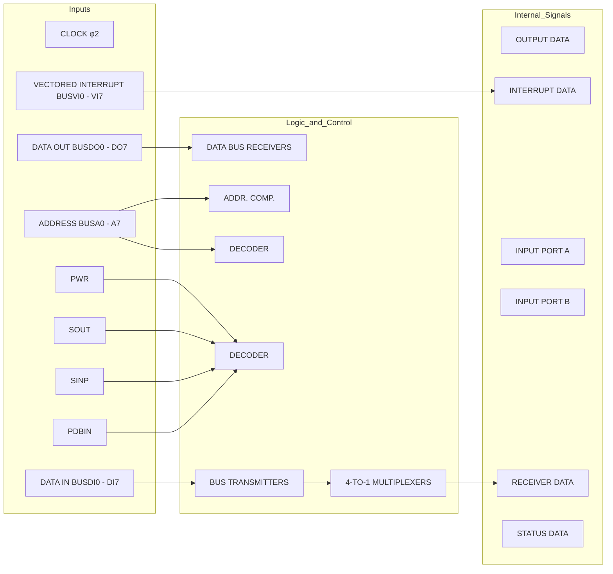

# 3P+S INPUT/OUTPUT MODULE

## ASSEMBLY and OPERATING INSTRUCTIONS

PROCESSOR TECHNOLOGY CORPORATION

6200 Hollis St.
Emeryville, Ca. 94608

Phone - (415)652-8080

COPYRIGHT © PROCESSOR TECHNOLOGY CORPORATION 1976

# PROCESSOR TECHNOLOGY CORPORATION

3P+S INPUT/OUTPUT MODULE [space] CONTENTS

<table>
  <thead>
    <tr>
        <th>SECTION</th>
        <th>TITLE</th>
        <th>PAGE</th>
    </tr>
  </thead>
  <tbody>
    <tr>
        <td>I</td>
        <td>INTRODUCTION and GENERAL INFORMATION</td>
        <td> </td>
    </tr>
    <tr>
        <td> </td>
        <td>1.1 Introduction</td>
        <td>I-1</td>
    </tr>
    <tr>
        <td> </td>
        <td>1.2 General Description</td>
        <td>I-1</td>
    </tr>
    <tr>
        <td> </td>
        <td>1.2.1 3P+S Description</td>
        <td>I-1</td>
    </tr>
    <tr>
        <td> </td>
        <td>1.2.2 Receiving Inspection</td>
        <td>I-1</td>
    </tr>
    <tr>
        <td> </td>
        <td>1.2.3 Warranty Information</td>
        <td>I-2</td>
    </tr>
    <tr>
        <td> </td>
        <td>1.2.4 Replacement Parts</td>
        <td>I-2</td>
    </tr>
    <tr>
        <td> </td>
        <td>1.2.5 Factory Service</td>
        <td>I-2</td>
    </tr>
    <tr>
        <td>II</td>
        <td>ASSEMBLY and TEST</td>
        <td> </td>
    </tr>
    <tr>
        <td> </td>
        <td>2.1 Assembly</td>
        <td>II-1</td>
    </tr>
    <tr>
        <td> </td>
        <td>2.1.1 Parts and Components</td>
        <td>II-1</td>
    </tr>
    <tr>
        <td> </td>
        <td>2.1.2 Orientation</td>
        <td>II-1</td>
    </tr>
    <tr>
        <td> </td>
        <td>2.1.3 Integrated Circuit Installation</td>
        <td>II-1</td>
    </tr>
    <tr>
        <td> </td>
        <td>2.1.4 Heat Sink Installation</td>
        <td>II-4</td>
    </tr>
    <tr>
        <td> </td>
        <td>2.1.5 Electrolytic Capacitor Installation</td>
        <td>II-4</td>
    </tr>
    <tr>
        <td> </td>
        <td>2.1.6 Disc Capacitor Installation</td>
        <td>II-5</td>
    </tr>
    <tr>
        <td> </td>
        <td>2.1.7 Resistor Installation</td>
        <td>II-5</td>
    </tr>
    <tr>
        <td> </td>
        <td>2.1.8 Diode and Transistor Installation</td>
        <td>II-6</td>
    </tr>
    <tr>
        <td> </td>
        <td>2.1.9 R10 Installation</td>
        <td>II-7</td>
    </tr>
    <tr>
        <td> </td>
        <td>2.1.10 Regulator Installation</td>
        <td>II-7</td>
    </tr>
    <tr>
        <td> </td>
        <td>2.1.11 Jumper Installation</td>
        <td>II-8</td>
    </tr>
    <tr>
        <td> </td>
        <td>2.1.12 UART Installation</td>
        <td>II-8</td>
    </tr>
    <tr>
        <td> </td>
        <td>2.1.13 Ribbon Cable Jumper Installation</td>
        <td>II-8</td>
    </tr>
    <tr>
        <td> </td>
        <td>2.2 Test</td>
        <td>II-10</td>
    </tr>
    <tr>
        <td>III</td>
        <td>OPTION SELECTION</td>
        <td> </td>
    </tr>
    <tr>
        <td> </td>
        <td>3.1 Option Selection</td>
        <td>III-1</td>
    </tr>
    <tr>
        <td> </td>
        <td>3.1.1 Address Selection</td>
        <td>III-1</td>
    </tr>
    <tr>
        <td> </td>
        <td>3.1.2 Channel C Input</td>
        <td>III-4</td>
    </tr>
    <tr>
        <td> </td>
        <td>3.1.3 Channel C Output</td>
        <td>III-4</td>
    </tr>
    <tr>
        <td> </td>
        <td>3.1.4 Channel D Input</td>
        <td>III-9</td>
    </tr>
    <tr>
        <td> </td>
        <td>3.1.5 Channel D Output</td>
        <td>III-9</td>
    </tr>
    <tr>
        <td> </td>
        <td>3.1.6 Channel A and B Flags</td>
        <td>III-10</td>
    </tr>
    <tr>
        <td>IV</td>
        <td>PERIPHERAL INTERFACING</td>
        <td> </td>
    </tr>
    <tr>
        <td> </td>
        <td>4.1 Peripheral Interfacing</td>
        <td>IV-1</td>
    </tr>
    <tr>
        <td> </td>
        <td>4.1.1 Input/Output Interfacing</td>
        <td>IV-1</td>
    </tr>
    <tr>
        <td> </td>
        <td>4.1.2 EIA RS-232-C</td>
        <td>IV-1</td>
    </tr>
    <tr>
        <td> </td>
        <td>4.1.3 Teletype, Models ASR33 or KSR33</td>
        <td>IV-2</td>
    </tr>
    <tr>
        <td> </td>
        <td>4.1.4 Teleprinter, Model 15</td>
        <td>IV-7</td>
    </tr>
    <tr>
        <td> </td>
        <td>4.1.5 Teleprinter, Model 28</td>
        <td>IV-8</td>
    </tr>
    <tr>
        <td> </td>
        <td>4.1.6 CT1024 TV Typewriter II</td>
        <td>IV-12</td>
    </tr>
  </tbody>
</table>

<page_number>i</page_number>

PROCESSOR TECHNOLOGY CORPORATION

3P+S INPUT/OUTPUT MODULE CONTENTS

<u>SECTION</u> <u>TITLE</u> <u>PAGE</u>

V **DRAWINGS**

Component Location Diagram

3P+S Block Diagram

3P+S Schematic Diagram

**APPENDICES**

I Statement of Warranty

II 8080 Operating Codes

III Loading DIP Devices and Soldering Tips

IV Integrated Circuit Pin Configurations

V 3P+S Port Test Programs

<page_number>

ii
</page_number>

PROCESSOR TECHNOLOGY CORPORATION

## SECTION I

# <u>INTRODUCTION and GENERAL INFORMATION</u>

3P+S INPUT/OUTPUT MODULE

PROCESSOR TECHNOLOGY CORPORATION

# 3P+S INPUT/OUTPUT MODULE SECTION I

## 1.1 INTRODUCTION

This manual supplies the information needed to assemble, test and use the 3P+S Input/Output Module. We suggest that you first scan the entire manual before starting assembly. Then make sure you have all the parts and components specified in the "Parts List" (see Page II-2). When assembling the module, follow the instructions in the order given.

Should you encounter any problem during assembly, call on us for help if necessary. If your completed module does not work properly, recheck your assembly step by step. Most problems stem from backward installed components and/or installing the wrong component. Once you are satisfied that the module is correctly assembled, feel free to ask for our help.

## 1.2 GENERAL INFORMATION

### 1.2.1 3P+S Description

The 3P+S Input/Output Module is designed to meet all the I/O needs of most 8800 system users. For example, one teletype and two TV typewriters with keyboards can operate simultaneously with the 8800 through only one 3P+S. Similarly, one RS-232-C modem, a teletype, and one TV typewriter plus another parallel data device can all be interfaced with one 3P+S at the same time.

One parallel port is available to set up control conditions for both parallel and serial ports, as well as to set the serial I/O baud rate under program control. The baud rate can be set from 35 to 9600 Baud. Another parallel port allows polling the input data available flags and external device ready flags. This port also permits checking the serial I/O error flags. Full handshaking with both input and output peripherals can be implemented.

Module addressing is jumper selectable to any one of 64 address segments within the 8800 range of 256 I/O addresses. Additional flexibility allows either the UART (Universal Asynchronous Receiver Transmitter) and control port or the two parallel ports to occupy the lower two relative addresses.

Interfacing to the 8800 vectored interrupt bus is provided as a jumper selectable option. Any of the UART error flags or handshaking signals can be used to generate interrupts. A Vectored Interrupt Module, however, is required for this purpose.

### 1.2.2 Receiving Inspection

When your module arrives, examine the shipping container for signs of possible damage to the contents during transit. Then inspect the contents for damage. (We suggest you save the shipping materials for use in returning the module to Processor Technology

<page_number>I-1</page_number>

PROCESSOR TECHNOLOGY CORPORATION

3P+S INPUT/OUTPUT MODULE SECTION I

should it become necessary to do so.) If your 3P+S kit is damaged, please write us at once describing the condition so that we can take appropriate action.

If there is no apparent damage, check that your kit has the correct number of component containers and materials. There should be three trays of integrated circuits, six bags of components and hardware, 4-feet of flat cable and a PC (printed circuit) board. Let us know of any shortages so that we can supply the needed materials.

## 1.2.3 Warranty Information

In brief, the parts supplied with the module, as well as the assembled module, are warranted against defects in materials and workmanship for a period of 6 months after the date of purchase. Refer to Appendix I for the complete "Statement of Warranty".

## 1.2.4 Replacement Parts

Order replacement parts by component nomenclature (e.g., SN74175) and/or a complete description (e.g., 6.8 ohm, ½ watt, 5% resistor).

## 1.2.5 Factory Service

In addition to in-warranty service, Processor Technology also provides factory repair service on out-of-warranty products. Before returning the module to Processor Technology, first obtain authorization to do so. After the return is authorized, proceed as follows:

1. Write a letter describing the problem.

2. Pack the module with the letter in a container suitable to the method of shipment.

3. Ship prepaid to Processor Technology, 2465 Fourth Street, Berkeley, CA 94710.

Your module will be repaired as soon as possible after receipt and return shipped to you prepaid.

<page_number>

I-2
</page_number>

PROCESSOR TECHNOLOGY CORPORATION

SECTION II

<u>ASSEMBLY</u>
and
<u>TEST</u>

3P+S INPUT/OUTPUT MODULE

PROCESSOR TECHNOLOGY CORPORATION

3P+S INPUT/OUTPUT MODULE SECTION II

## 2.1 ASSEMBLY

### CAUTION

THIS DEVICE USES A MOS INTEGRATED CIRCUIT WHICH CAN BE DAMAGED BY STATIC ELECTRICITY DISCHARGES. AVOID UNNECESSARY HANDLING OF THIS I.C. AND WEAR COTTON CLOTHING, RATHER THAN SYNTHETICS, WHEN HANDLING IT.

## 2.1.1 Parts and Components

Check all parts and components against the "Parts List" (Table 2-1). If you have difficulty in identifying any parts by sight, refer to Figure 2-1.

## 2.1.2 Orientation

The heat sink area will be located in the lower left-hand corner of the board when the 100-pin edge connector is on the lower edge of the card. J1 is the 44-pin edge connector at the upper left; J2 is the 44-pin edge connector at the upper right.

## 2.1.3 Integrated Circuit Installation

### NOTE

To facilitate IC replacement, we recommend that you install DIP sockets in all IC locations on the PC board. (Except for the UART socket, IC sockets are not included in your kit.) If you elect to install sockets, make the installations before performing any of the subsequent assembly steps.

Refer to the component location diagram in Section V and the instructions on installation of DIP devices in Appendix III. Install the following I.C.'s in the indicated locations. Pay careful attention to the proper orientation.

<table>
  <thead>
    <tr>
        <th>I.C. NO.</th>
        <th>TYPE</th>
        <th>ORIENTATION</th>
    </tr>
  </thead>
  <tbody>
    <tr>
        <td>IC 1</td>
        <td>74177</td>
        <td>Pin 1 lower left</td>
    </tr>
    <tr>
        <td>IC 2</td>
        <td>74177</td>
        <td> </td>
    </tr>
    <tr>
        <td>IC 3</td>
        <td>74177</td>
        <td> </td>
    </tr>
    <tr>
        <td>IC 4</td>
        <td>74177</td>
        <td> </td>
    </tr>
    <tr>
        <td>IC 5</td>
        <td>MC1488</td>
        <td> </td>
    </tr>
    <tr>
        <td>IC 6</td>
        <td>74175</td>
        <td>upper left</td>
    </tr>
    <tr>
        <td>IC 7</td>
        <td>93L16</td>
        <td>lower left</td>
    </tr>
    <tr>
        <td>IC 8</td>
        <td>93L16</td>
        <td> </td>
    </tr>
    <tr>
        <td>IC 9</td>
        <td>93L16</td>
        <td> </td>
    </tr>
  </tbody>
</table>

II-1

# PROCESSOR TECHNOLOGY CORPORATION

3P+S INPUT/OUTPUT MODULE SECTION II

## Table 2-1. Parts List: 3P+S I/O Module

### INTEGRATED CIRCUITS

<table>
  <thead>
    <tr>
        <th>Tray #1</th>
        <th> </th>
        <th>Tray #2</th>
        <th> </th>
        <th>Tray #3</th>
        <th> </th>
    </tr>
  </thead>
  <tbody>
    <tr>
        <td>1</td>
        <td>DM 7400 or 74LS00</td>
        <td>1</td>
        <td>DM74155 or 74LS155</td>
        <td>1</td>
        <td>1488PC</td>
    </tr>
    <tr>
        <td>2</td>
        <td>DM 7406</td>
        <td>1</td>
        <td>DM74175 or 74LS175</td>
        <td>1</td>
        <td>1489APC</td>
    </tr>
    <tr>
        <td>2</td>
        <td>N74LS08</td>
        <td>1</td>
        <td>DM74109 or DM8124N</td>
        <td>1</td>
        <td>DM8131</td>
    </tr>
    <tr>
        <td>4</td>
        <td>DM74177</td>
        <td> </td>
        <td>or 74LS109</td>
        <td>1</td>
        <td>DM8836 or 8T380</td>
    </tr>
    <tr>
        <td> </td>
        <td> </td>
        <td>3</td>
        <td>93L16PC or 74LS163</td>
        <td>1</td>
        <td>DM8837 or 8T37</td>
    </tr>
    <tr>
        <td> </td>
        <td> </td>
        <td>4</td>
        <td>AM25LS153PC</td>
        <td>2</td>
        <td>DM8097 or 74367</td>
    </tr>
    <tr>
        <td> </td>
        <td> </td>
        <td> </td>
        <td> </td>
        <td> </td>
        <td>or 8T97</td>
    </tr>
  </tbody>
</table>

### OTHER COMPONENTS and MATERIALS

<table>
  <tbody>
    <tr>
        <td rowspan="3">Bag #1: Capacitors</td>
        <td>3</td>
        <td>1 mfd dipped tantalum electrolytic</td>
    </tr>
    <tr>
        <td>3</td>
        <td>15 mfd dipped tantalum electrolytic</td>
    </tr>
    <tr>
        <td>19</td>
        <td>0.1 mfd disc ceramic capacitor</td>
    </tr>
    <tr>
        <td> </td>
        <td> </td>
        <td> </td>
    </tr>
    <tr>
        <td rowspan="7">Bag #2: Resistors</td>
        <td>1</td>
        <td>6.8 ohms 1/2 watt 5%</td>
    </tr>
    <tr>
        <td>3</td>
        <td>330 ohms 1/4 watt 5%</td>
    </tr>
    <tr>
        <td>2</td>
        <td>4.02k ohms 1/4 watt 1%</td>
    </tr>
    <tr>
        <td>2</td>
        <td>100 ohms 1/4 watt 5%</td>
    </tr>
    <tr>
        <td>5</td>
        <td>1.0k ohms 1/4 watt 5%</td>
    </tr>
    <tr>
        <td>8</td>
        <td>2.2k ohms 1/4 watt 5%</td>
    </tr>
    <tr>
        <td>1</td>
        <td>1N4148 DIODE</td>
    </tr>
    <tr>
        <td> </td>
        <td> </td>
        <td> </td>
    </tr>
    <tr>
        <td rowspan="8">Bag #3: Hardware</td>
        <td>1</td>
        <td>78L12ACZ</td>
    </tr>
    <tr>
        <td>1</td>
        <td>LM340T-5.0 or 7805UC</td>
    </tr>
    <tr>
        <td>2</td>
        <td>2N2222 transistors</td>
    </tr>
    <tr>
        <td>3</td>
        <td>2N2907 transistors</td>
    </tr>
    <tr>
        <td>3</td>
        <td>6-32 screw nut, lock washer sets</td>
    </tr>
    <tr>
        <td>solder</td>
        <td></td>
    </tr>
    <tr>
        <td>bare jumper wire</td>
        <td></td>
    </tr>
    <tr>
        <td>spaghetti</td>
        <td></td>
    </tr>
    <tr>
        <td> </td>
        <td> </td>
        <td> </td>
    </tr>
    <tr>
        <td rowspan="2">Bag #4: Sockets</td>
        <td>6</td>
        <td>Augat pins in carriers</td>
    </tr>
    <tr>
        <td>1</td>
        <td>40 DIP</td>
    </tr>
    <tr>
        <td> </td>
        <td> </td>
        <td> </td>
    </tr>
    <tr>
        <td>Bag #5: UART</td>
        <td>1</td>
        <td>AMI S1883 UART or TMS6011NC</td>
    </tr>
    <tr>
        <td> </td>
        <td> </td>
        <td> </td>
    </tr>
    <tr>
        <td>Bag #6: Heatsink</td>
        <td>1</td>
        <td> </td>
    </tr>
    <tr>
        <td> </td>
        <td> </td>
        <td> </td>
    </tr>
    <tr>
        <td>Flat cable</td>
        <td>4</td>
        <td>feet</td>
    </tr>
    <tr>
        <td> </td>
        <td> </td>
        <td> </td>
    </tr>
    <tr>
        <td>PC Board</td>
        <td>1</td>
        <td> </td>
    </tr>
    <tr>
        <td> </td>
        <td> </td>
        <td> </td>
    </tr>
    <tr>
        <td>Manual</td>
        <td>1</td>
        <td> </td>
    </tr>
  </tbody>
</table>

II-2

PROCESSOR TECHNOLOGY CORPORATION

# 3P+S INPUT/OUTPUT

# SECTION II

transistor - TO-92 package (plastic)
transistor - TO-92 package (plastic)

transistor - TO-18 package (metal can)
transistor - TO-18 package (metal can)

ceramic disc capacitor
ceramic disc capacitor

dipped tantalum electrolytic capacitor

dipped tantalum electrolytic capacitor

dual-inline-package (DIP) integrated circuit

DIP IC corner dot or cut-out detail

dual-inline-package (DIP) integrated circuit
8,14,16,24 or 40 pins (14 pin shown)

carbon film resistor 5% (gold) or 10% (silver)

carbon film resistor 5% (gold) or 10% (silver)

metal film 1% precision resistor

metal film 1% precision resistor

regulator IC or power transistor (TO-220)

regulator IC or power transistor (TO-220)

Figure 2-1. Identification of components.

<page_number>II-3</page_number>

© Processor Technology Corp.

PROCESSOR TECHNOLOGY CORPORATION

SECTION II

3P+S INPUT/OUTPUT

<table>
  <thead>
    <tr>
        <th><u>I.C. NO.</u></th>
        <th><u>TYPE</u></th>
        <th><u>ORIENTATION</u></th>
    </tr>
  </thead>
  <tbody>
    <tr>
        <td>IC 10</td>
        <td>MC1489</td>
        <td>Pin 1 lower left</td>
    </tr>
    <tr>
        <td>IC 11</td>
        <td>74LS153</td>
        <td>upper left</td>
    </tr>
    <tr>
        <td>IC 12</td>
        <td>74LS153</td>
        <td> </td>
    </tr>
    <tr>
        <td>IC 13</td>
        <td>74LS153</td>
        <td> </td>
    </tr>
    <tr>
        <td>IC 14</td>
        <td>74LS153</td>
        <td>lower left</td>
    </tr>
    <tr>
        <td>IC 15</td>
        <td>74109</td>
        <td>upper left</td>
    </tr>
    <tr>
        <td>IC 16</td>
        <td colspan="2">not installed this step</td>
    </tr>
    <tr>
        <td>IC 17</td>
        <td colspan="2">not installed this step</td>
    </tr>
    <tr>
        <td>IC 18</td>
        <td>LM741C</td>
        <td> </td>
    </tr>
    <tr>
        <td>IC 19</td>
        <td colspan="2">Install only if your computer has a<br/>vectored interrupt capability.<br/>(Specific installation instructions<br/>will be the subject of a technical<br/>bulletin as soon as information on<br/>the vectored interrupt module<br/>becomes available.)</td>
    </tr>
    <tr>
        <td>IC 20</td>
        <td>74155</td>
        <td>Pin 1 lower left</td>
    </tr>
    <tr>
        <td>IC 21</td>
        <td>7400</td>
        <td> </td>
    </tr>
    <tr>
        <td>IC 22</td>
        <td>DM8836</td>
        <td>upper left</td>
    </tr>
    <tr>
        <td>IC 23</td>
        <td>DM8837</td>
        <td>lower right</td>
    </tr>
    <tr>
        <td>IC 24</td>
        <td>DM8131</td>
        <td> </td>
    </tr>
    <tr>
        <td>IC 25</td>
        <td>40-pin socket</td>
        <td>no orientation</td>
    </tr>
    <tr>
        <td>IC 26</td>
        <td>74LS08</td>
        <td>Pin 1 lower left</td>
    </tr>
    <tr>
        <td>IC 27</td>
        <td>74LS08</td>
        <td> </td>
    </tr>
    <tr>
        <td>IC 28</td>
        <td>DM8097</td>
        <td>upper left</td>
    </tr>
    <tr>
        <td>IC 29</td>
        <td>DM8097</td>
        <td>lower left</td>
    </tr>
    <tr>
        <td>IC 30</td>
        <td>7406</td>
        <td> </td>
    </tr>
  </tbody>
</table>

Check for proper position and orientation. Then solder all IC's. (See Appendix III.) Avoid creating "solder bridges" between adjacent pins of IC's and between pins and traces which run between pins.

## 2.1.4 Heat Sink Installation

Refer to Figure 2-2 and component location diagram (Section V). Position the large, black heat sink (flat side to the board) over the square foil area on the lower left corner. Orient the sink so that the triangle of holes is under one of the triangular cut-outs in the sink. Using 6-32 screws, nuts, and lockwashers, attach the heat sink to the board, inserting the screws from the back side of the board.

## 2.1.5 Electrolytic Capacitor Installation

Refer to component location diagram in Section V. Install dipped, upright tantalum electrolytic capacitors in the following locations. Take care to observe the proper values and orientations.

II-4
<page_number>II-4</page_number>

PROCESSOR TECHNOLOGY CORPORATION

3P+S INPUT/OUTPUT MODULE SECTION II

HEATSINK, REGULATOR, and SPAGHETTI INSTALLATION diagram showing IC 16, IC 17, C1, and 78L12AC components with handwritten note: INSTALL 1/8" INSULATING SLEEVING ON LEADS OF C1.

Figure 2-2

<table>
  <thead>
    <tr>
        <th>CAPACITOR</th>
        <th>VALUE</th>
        <th>ORIENTATION</th>
    </tr>
  </thead>
  <tbody>
    <tr>
        <td>C1 (See Figure 2-2)</td>
        <td>.15 uf</td>
        <td>+ lead down</td>
    </tr>
    <tr>
        <td>C2</td>
        <td>.15 uf</td>
        <td>+ lead lower left</td>
    </tr>
    <tr>
        <td>C3</td>
        <td>1.0 uf</td>
        <td>+ lead top</td>
    </tr>
    <tr>
        <td>C4</td>
        <td>1.0 uf</td>
        <td>+ lead down</td>
    </tr>
    <tr>
        <td>C5</td>
        <td>1.0 uf</td>
        <td>+ lead down</td>
    </tr>
    <tr>
        <td>C6</td>
        <td>.15 uf</td>
        <td>+ lead left</td>
    </tr>
  </tbody>
</table>

Check the capacitors for proper value and orientation, and solder.

## 2.1.6 Disc Capacitor Installation

Refer to the component location diagram in Section V. Install 0.1 uf disc ceramic capacitors in locations C7 through C25. Take care to mount the capacitor leads in the proper holes. After mounting each capacitor, bend the leads outward underneath the board, solder and trim.

## 2.1.7 Resistor Installation

Refer to the component location diagram in Section V. Install the following resistors in the indicated locations.

<page_number>II-5</page_number>

PROCESSOR TECHNOLOGY CORPORATION

# 3P+S INPUT/OUTPUT MODULE SECTION II

<table>
  <thead>
    <tr>
        <th><u>LOCATION</u></th>
        <th><u>VALUE</u></th>
        <th><u>COLOR CODE</u></th>
    </tr>
  </thead>
  <tbody>
    <tr>
        <td>R1</td>
        <td>4020 ohms</td>
        <td>4021F</td>
    </tr>
    <tr>
        <td>R2</td>
        <td>4020 ohms</td>
        <td>4021F</td>
    </tr>
    <tr>
        <td>R3</td>
        <td>100 ohms</td>
        <td>brown-black-brown</td>
    </tr>
    <tr>
        <td>R4</td>
        <td>6.8 ohms</td>
        <td>blue-grey-gold</td>
    </tr>
    <tr>
        <td>R5</td>
        <td>2.2 kohms</td>
        <td>red-red-red</td>
    </tr>
    <tr>
        <td>R6</td>
        <td>2.2 kohms</td>
        <td>red-red-red</td>
    </tr>
    <tr>
        <td>R7</td>
        <td>1.0 kohms</td>
        <td>brown-black-red</td>
    </tr>
    <tr>
        <td>R8</td>
        <td>1.0 kohms</td>
        <td>brown-black-red</td>
    </tr>
    <tr>
        <td>R9</td>
        <td>1.0 kohms</td>
        <td>brown-black-red</td>
    </tr>
    <tr>
        <td>R10</td>
        <td colspan="2">not installed this step</td>
    </tr>
    <tr>
        <td>R11</td>
        <td>2.2 kohms</td>
        <td>red-red-red</td>
    </tr>
    <tr>
        <td>R12</td>
        <td>330 ohms</td>
        <td>orange-orange-brown</td>
    </tr>
    <tr>
        <td>R13</td>
        <td>330 ohms</td>
        <td>orange-orange-brown</td>
    </tr>
    <tr>
        <td>R14</td>
        <td>100 ohms</td>
        <td>brown-black-brown</td>
    </tr>
    <tr>
        <td>R15</td>
        <td>1.0 kohms</td>
        <td>brown-black-red</td>
    </tr>
    <tr>
        <td>R16</td>
        <td>2.2 kohms</td>
        <td>red-red-red</td>
    </tr>
    <tr>
        <td>R17</td>
        <td>2.2 kohms</td>
        <td>red-red-red</td>
    </tr>
    <tr>
        <td>R18</td>
        <td>330 ohms</td>
        <td>orange-orange-brown</td>
    </tr>
    <tr>
        <td>R19</td>
        <td>2.2 kohms</td>
        <td>red-red-red</td>
    </tr>
    <tr>
        <td>R20</td>
        <td>2.2 kohms</td>
        <td>red-red-red</td>
    </tr>
    <tr>
        <td>R21</td>
        <td>1.0 kohms</td>
        <td>brown-black-red</td>
    </tr>
  </tbody>
</table>

Take particular care to install R5, R8, R12, R13, R19 and R20 in the proper holes.

After checking the location and value of all resistors, solder and trim.

## 2.1.8 Diode and Transistor Installation

Refer to the component location diagram in Section V and the diagram on transistor lead identification (Figure 2-1).

Install diode CR1 in the location indicated by the diode symbol on the component location diagram. The end of the diode with the band marked on it is installed toward the left. Solder and trim the leads.

Install 2N2907 transistors Q1, Q2, Q3 in the locations indicated. The emitter lead is oriented to the left and the base lead is oriented downwards. Push straight down on the transistors until they are stopped by their leads. Install jumper between Q2 emitter and R1 as shown in Figure 2-3. Solder and trim all leads.

Install 2N2222 transistors Q4 and Q5 (See Figure 2-4.) in the locations indicated. The emitter lead of Q4 is oriented to the lower right; the emitter lead of Q5 is oriented toward the top. Push straight down on the transistors until they are stopped by their leads. Solder and trim the leads.

II-6

PROCESSOR TECHNOLOGY CORPORATION

3P+S INPUT/OUTPUT MODULE SECTION II

REAR OF BOARD, LOWER
RIGHT-HAND CORNER:

(100-pin Edge Connector
positioned at bottom)

Diagram showing solder jumper from emitter of Q2 to upper pad of R1 with +5V and Processor Technol labels

Figure 2-3

Illustration of transistor installation for Q4 and Q5 with a warning bubble: "MAKE SURE WE'RE NOT THE SAME HEIGHT, OR OUR TABS WILL CONTACT!"

Figure 2-4

## 2.1.9 R10 Installation

Before installing R10, refer to Paragraph 3.1.3 in Section III. Connect upper lead of R10 as shown in the component location diagram in Section V. If bit $\emptyset$ is to be the input for Q3, the peripheral control driver, connect the lower lead of R10 to the lefthand terminal in Area F. Connect the lower lead of R10 to the righthand terminal in Area F if bit 1 is selected as the input to Q3.

## 2.1.10 Regulator Installation

Refer to Figure 2-2 and the component location diagram (Section V). Position regulator IC 16 (LM340T) as shown and observe how the leads must be bent to fit the holes. Note that the center lead (3) must be bent downwards at a point approximately 0.2 inches further from the body than the other leads. Bend the leads so that no

II-7

PROCESSOR TECHNOLOGY CORPORATION

# 3P+S INPUT/OUTPUT MODULE SECTION II

contact is made with the heat sink when the regulator is flat against the heat sink and its mounting hole is aligned with the hole in the heat sink. Fasten the regulator to the heat sink using a 6-32 screw, lockwasher and nut. Insert the screw from the back side of the board. Solder and trim the leads.

Install regulator IC 17 (78L12AC) as shown, with the flat face oriented downwards. Bend the center lead back to fit into the hole indicated. Push straight downwards until the IC is stopped by its leads. Solder and trim the leads.

## 2.1.11 Jumper Installation

There is only one permanent wire jumper on this device. It is located in the center of the board and is oriented vertically. Install a piece of insulated wire as shown in the component location diagram and solder. Trim the ends.

## 2.1.12 UART Installation

Refer to the component location diagram and the cautionary note at the beginning of this Section. The UART (IC 25, S1883) is a MOS device. Set the board on a flat surface and carefully position the UART on its socket, with pin 1 oriented toward the upper right. Gently insert all of the pins of the UART into the entries of the socket and check to be sure that no pin is obstructed. Press downward on the UART chip with an even, firm pressure until it seats. Excessive pressure may indicate a blocked pin, which can bend or break. Inspect the UART chip after installation for any possible bent pins.

## 2.1.13 Ribbon Cable Jumper Installation

This jumper connects the inputs to IC 19 and the VI bus terminals in Area G.

### NOTE

> Install this jumper only if your computer has a vectored interrupt capability.

Refer to component location diagram in Section V. On the back (solder) side of the board, install a piece of ribbon cable (approximately 8" long) between the VI bus (Ø thru 7) in Area G and V INT terminals (Ø thru 7). (The V INT terminals are to the immediate right--as viewed from component side of board--of IC 19.) To ensure correct terminal-to-terminal interconnection, make a 90° fold in the cable below the VI bus in Area G. This technique is clearly illustrated in Figure 2-5.

II-8
<page_number>II-8</page_number>

PROCESSOR TECHNOLOGY CORPORATION

# 3P+S INPUT/OUTPUT MODULE

# SECTION II

Engineering drawing showing how to fold a cable over to make a 90 degree bend on the back (solder) side of the board, with dimensions and component labels.

Figure 2-5

<page_number>II-9</page_number>

PROCESSOR TECHNOLOGY CORPORATION

3P+S INPUT/OUTPUT MODULE SECTION II

## 2.2 TEST

The test procedure for the 3P+S Input/Output Module checks the various input/output ports.

**2.2.1 Output Ports A and B, Test No. 1**

Install 3P+S in computer. Execute Test No. 1 program given in Appendix V.

**2.2.2 Input Ports, Test No. 2**

With 3P+S installed in computer, execute Test No. 2 program given in Appendix V.

**2.2.3 Serial Input/Output, Test No. 3**

With 3P+S installed in computer, execute Test No. 3 program given in Appendix V.

II-10
<page_number>II-10</page_number>

PROCESSOR TECHNOLOGY CORPORATION

SECTION III

# <u>OPTION SELECTION</u>

3P+S INPUT/OUTPUT MODULE

PROCESSOR TECHNOLOGY CORPORATION

# 3P+S INPUT/OUTPUT MODULE SECTION III

## 3.1 OPTION SELECTION

### 3.1.1 Address Selection

The 3P+S will respond to addresses up to 256 in 64 groups of four. Within each group of four, the order of response of the four I/O channels may be changed by jumper selection in Area B (See Figure 3-1.) as shown by the following table:

<table>
  <thead>
    <tr>
        <th colspan="2">ADDRESS BITS</th>
        <th>CHANNEL SELECTED</th>
        <th>CHANNEL SELECTED</th>
    </tr>
    <tr>
        <th>AØ</th>
        <th>A1</th>
        <th>(left jumpered to center)</th>
        <th>(left jumpered to right)</th>
    </tr>
  </thead>
  <tbody>
    <tr>
        <td>[no]</td>
        <td>[no]</td>
        <td>A</td>
        <td>C</td>
    </tr>
    <tr>
        <td>1</td>
        <td>[no]</td>
        <td>B</td>
        <td>D</td>
    </tr>
    <tr>
        <td>[no]</td>
        <td>1</td>
        <td>C</td>
        <td>A</td>
    </tr>
    <tr>
        <td>1</td>
        <td>1</td>
        <td>D</td>
        <td>B</td>
    </tr>
  </tbody>
</table>

AREA B:

Engineering drawing of Area B jumper locations on the circuit board showing ICs 20, 21, 22, and 23 with jumper pins.

Area B jumpers determine whether the UART--control port pair, i.e. ports C and D, will be the upper or the lower two addresses on the card.

Figure 3-1

The group of addresses is selected by six jumpers in Area A (See Figure 3-2.) as follows:

<table>
  <thead>
    <tr>
        <th colspan="2">ADDRESS RANGE</th>
        <th colspan="6">ADDRESS BITS</th>
    </tr>
    <tr>
        <th>Decimal</th>
        <th>Octal</th>
        <th>A7</th>
        <th>A6</th>
        <th>A5</th>
        <th>A4</th>
        <th>A3</th>
        <th>A2</th>
    </tr>
  </thead>
  <tbody>
    <tr>
        <td>0 - 3</td>
        <td>0 - 3</td>
        <td>G</td>
        <td>G</td>
        <td>G</td>
        <td>G</td>
        <td>G</td>
        <td>G</td>
    </tr>
    <tr>
        <td>4 - 7</td>
        <td>4 - 7</td>
        <td>G</td>
        <td>G</td>
        <td>G</td>
        <td>G</td>
        <td>G</td>
        <td>V</td>
    </tr>
    <tr>
        <td>8 - 11</td>
        <td>10 - 13</td>
        <td>G</td>
        <td>G</td>
        <td>G</td>
        <td>G</td>
        <td>V</td>
        <td>G</td>
    </tr>
    <tr>
        <td>12 - 15</td>
        <td>14 - 17</td>
        <td>G</td>
        <td>G</td>
        <td>G</td>
        <td>G</td>
        <td>V</td>
        <td>V</td>
    </tr>
    <tr>
        <td>16 - 19</td>
        <td>20 - 23</td>
        <td>G</td>
        <td>G</td>
        <td>G</td>
        <td>V</td>
        <td>G</td>
        <td>G</td>
    </tr>
    <tr>
        <td>20 - 23</td>
        <td>24 - 27</td>
        <td>G</td>
        <td>G</td>
        <td>G</td>
        <td>V</td>
        <td>G</td>
        <td>V</td>
    </tr>
    <tr>
        <td>24 - 27</td>
        <td>30 - 33</td>
        <td>G</td>
        <td>G</td>
        <td>G</td>
        <td>V</td>
        <td>V</td>
        <td>G</td>
    </tr>
    <tr>
        <td>28 - 31</td>
        <td>34 - 37</td>
        <td>G</td>
        <td>G</td>
        <td>G</td>
        <td>V</td>
        <td>V</td>
        <td>V</td>
    </tr>
    <tr>
        <td>32 - 35</td>
        <td>40 - 43</td>
        <td>G</td>
        <td>G</td>
        <td>V</td>
        <td>G</td>
        <td>G</td>
        <td>G</td>
    </tr>
    <tr>
        <td>36 - 39</td>
        <td>44 - 47</td>
        <td>G</td>
        <td>G</td>
        <td>V</td>
        <td>G</td>
        <td>G</td>
        <td>V</td>
    </tr>
  </tbody>
</table>

III-1

PROCESSOR TECHNOLOGY CORPORATION

3P+S INPUT/OUTPUT MODULE SECTION III

ADDRESS RANGE ADDRESS BITS

<table>
  <thead>
    <tr>
        <th>Decimal</th>
        <th>Octal</th>
        <th>A7</th>
        <th>A6</th>
        <th>A5</th>
        <th>A4</th>
        <th>A3</th>
        <th>A2</th>
    </tr>
  </thead>
  <tbody>
    <tr>
        <td>40 - 43</td>
        <td>50 - 53</td>
        <td>G</td>
        <td>G</td>
        <td>V</td>
        <td>G</td>
        <td>V</td>
        <td>G</td>
    </tr>
    <tr>
        <td>44 - 47</td>
        <td>54 - 57</td>
        <td>G</td>
        <td>G</td>
        <td>V</td>
        <td>G</td>
        <td>V</td>
        <td>V</td>
    </tr>
    <tr>
        <td>48 - 51</td>
        <td>60 - 63</td>
        <td>G</td>
        <td>G</td>
        <td>V</td>
        <td>V</td>
        <td>G</td>
        <td>G</td>
    </tr>
    <tr>
        <td>52 - 55</td>
        <td>64 - 67</td>
        <td>G</td>
        <td>G</td>
        <td>V</td>
        <td>V</td>
        <td>G</td>
        <td>V</td>
    </tr>
    <tr>
        <td>56 - 59</td>
        <td>70 - 73</td>
        <td>G</td>
        <td>G</td>
        <td>V</td>
        <td>V</td>
        <td>V</td>
        <td>G</td>
    </tr>
    <tr>
        <td>60 - 63</td>
        <td>74 - 77</td>
        <td>G</td>
        <td>G</td>
        <td>V</td>
        <td>V</td>
        <td>V</td>
        <td>V</td>
    </tr>
    <tr>
        <td>64 - 67</td>
        <td>100 - 103</td>
        <td>G</td>
        <td>V</td>
        <td>G</td>
        <td>G</td>
        <td>G</td>
        <td>G</td>
    </tr>
    <tr>
        <td>68 - 71</td>
        <td>104 - 107</td>
        <td>G</td>
        <td>V</td>
        <td>G</td>
        <td>G</td>
        <td>G</td>
        <td>V</td>
    </tr>
    <tr>
        <td>72 - 75</td>
        <td>110 - 113</td>
        <td>G</td>
        <td>V</td>
        <td>G</td>
        <td>G</td>
        <td>V</td>
        <td>G</td>
    </tr>
    <tr>
        <td>76 - 79</td>
        <td>114 - 117</td>
        <td>G</td>
        <td>V</td>
        <td>G</td>
        <td>G</td>
        <td>V</td>
        <td>V</td>
    </tr>
    <tr>
        <td>80 - 83</td>
        <td>120 - 123</td>
        <td>G</td>
        <td>V</td>
        <td>G</td>
        <td>V</td>
        <td>G</td>
        <td>G</td>
    </tr>
    <tr>
        <td>84 - 87</td>
        <td>124 - 127</td>
        <td>G</td>
        <td>V</td>
        <td>G</td>
        <td>V</td>
        <td>G</td>
        <td>V</td>
    </tr>
    <tr>
        <td>88 - 91</td>
        <td>130 - 133</td>
        <td>G</td>
        <td>V</td>
        <td>G</td>
        <td>V</td>
        <td>V</td>
        <td>G</td>
    </tr>
    <tr>
        <td>92 - 95</td>
        <td>134 - 137</td>
        <td>G</td>
        <td>V</td>
        <td>G</td>
        <td>V</td>
        <td>V</td>
        <td>V</td>
    </tr>
    <tr>
        <td>96 - 99</td>
        <td>140 - 143</td>
        <td>G</td>
        <td>V</td>
        <td>V</td>
        <td>G</td>
        <td>G</td>
        <td>G</td>
    </tr>
    <tr>
        <td>100 - 103</td>
        <td>144 - 147</td>
        <td>G</td>
        <td>V</td>
        <td>V</td>
        <td>G</td>
        <td>G</td>
        <td>V</td>
    </tr>
    <tr>
        <td>104 - 107</td>
        <td>150 - 153</td>
        <td>G</td>
        <td>V</td>
        <td>V</td>
        <td>G</td>
        <td>V</td>
        <td>G</td>
    </tr>
    <tr>
        <td>108 - 111</td>
        <td>154 - 157</td>
        <td>G</td>
        <td>V</td>
        <td>V</td>
        <td>G</td>
        <td>V</td>
        <td>V</td>
    </tr>
    <tr>
        <td>112 - 115</td>
        <td>160 - 163</td>
        <td>G</td>
        <td>V</td>
        <td>V</td>
        <td>V</td>
        <td>G</td>
        <td>G</td>
    </tr>
    <tr>
        <td>116 - 119</td>
        <td>164 - 167</td>
        <td>G</td>
        <td>V</td>
        <td>V</td>
        <td>V</td>
        <td>G</td>
        <td>V</td>
    </tr>
    <tr>
        <td>120 - 123</td>
        <td>170 - 173</td>
        <td>G</td>
        <td>V</td>
        <td>V</td>
        <td>V</td>
        <td>V</td>
        <td>G</td>
    </tr>
    <tr>
        <td>124 - 127</td>
        <td>174 - 177</td>
        <td>G</td>
        <td>V</td>
        <td>V</td>
        <td>V</td>
        <td>V</td>
        <td>V</td>
    </tr>
    <tr>
        <td>128 - 131</td>
        <td>200 - 203</td>
        <td>V</td>
        <td>G</td>
        <td>G</td>
        <td>G</td>
        <td>G</td>
        <td>G</td>
    </tr>
    <tr>
        <td>132 - 135</td>
        <td>204 - 207</td>
        <td>V</td>
        <td>G</td>
        <td>G</td>
        <td>G</td>
        <td>G</td>
        <td>V</td>
    </tr>
    <tr>
        <td>136 - 139</td>
        <td>210 - 213</td>
        <td>V</td>
        <td>G</td>
        <td>G</td>
        <td>G</td>
        <td>V</td>
        <td>G</td>
    </tr>
    <tr>
        <td>140 - 143</td>
        <td>214 - 217</td>
        <td>V</td>
        <td>G</td>
        <td>G</td>
        <td>G</td>
        <td>V</td>
        <td>V</td>
    </tr>
    <tr>
        <td>144 - 147</td>
        <td>220 - 223</td>
        <td>V</td>
        <td>G</td>
        <td>G</td>
        <td>V</td>
        <td>G</td>
        <td>G</td>
    </tr>
    <tr>
        <td>148 - 151</td>
        <td>224 - 227</td>
        <td>V</td>
        <td>G</td>
        <td>G</td>
        <td>V</td>
        <td>G</td>
        <td>V</td>
    </tr>
    <tr>
        <td>152 - 155</td>
        <td>230 - 233</td>
        <td>V</td>
        <td>G</td>
        <td>G</td>
        <td>V</td>
        <td>V</td>
        <td>G</td>
    </tr>
    <tr>
        <td>156 - 159</td>
        <td>234 - 237</td>
        <td>V</td>
        <td>G</td>
        <td>G</td>
        <td>V</td>
        <td>V</td>
        <td>V</td>
    </tr>
    <tr>
        <td>160 - 163</td>
        <td>240 - 243</td>
        <td>V</td>
        <td>G</td>
        <td>V</td>
        <td>G</td>
        <td>G</td>
        <td>G</td>
    </tr>
    <tr>
        <td>164 - 167</td>
        <td>244 - 247</td>
        <td>V</td>
        <td>G</td>
        <td>V</td>
        <td>G</td>
        <td>G</td>
        <td>V</td>
    </tr>
    <tr>
        <td>168 - 171</td>
        <td>250 - 253</td>
        <td>V</td>
        <td>G</td>
        <td>V</td>
        <td>G</td>
        <td>V</td>
        <td>G</td>
    </tr>
    <tr>
        <td>172 - 175</td>
        <td>254 - 257</td>
        <td>V</td>
        <td>G</td>
        <td>V</td>
        <td>G</td>
        <td>V</td>
        <td>V</td>
    </tr>
    <tr>
        <td>176 - 179</td>
        <td>260 - 263</td>
        <td>V</td>
        <td>G</td>
        <td>V</td>
        <td>V</td>
        <td>G</td>
        <td>G</td>
    </tr>
    <tr>
        <td>180 - 183</td>
        <td>264 - 267</td>
        <td>V</td>
        <td>G</td>
        <td>V</td>
        <td>V</td>
        <td>G</td>
        <td>V</td>
    </tr>
    <tr>
        <td>184 - 187</td>
        <td>270 - 273</td>
        <td>V</td>
        <td>G</td>
        <td>V</td>
        <td>V</td>
        <td>V</td>
        <td>G</td>
    </tr>
    <tr>
        <td>188 - 191</td>
        <td>274 - 277</td>
        <td>V</td>
        <td>G</td>
        <td>V</td>
        <td>V</td>
        <td>V</td>
        <td>V</td>
    </tr>
    <tr>
        <td>192 - 195</td>
        <td>300 - 303</td>
        <td>V</td>
        <td>V</td>
        <td>G</td>
        <td>G</td>
        <td>G</td>
        <td>G</td>
    </tr>
    <tr>
        <td>196 - 199</td>
        <td>304 - 307</td>
        <td>V</td>
        <td>V</td>
        <td>G</td>
        <td>G</td>
        <td>G</td>
        <td>V</td>
    </tr>
    <tr>
        <td>200 - 203</td>
        <td>310 - 313</td>
        <td>V</td>
        <td>V</td>
        <td>G</td>
        <td>G</td>
        <td>V</td>
        <td>G</td>
    </tr>
    <tr>
        <td>204 - 207</td>
        <td>314 - 317</td>
        <td>V</td>
        <td>V</td>
        <td>G</td>
        <td>G</td>
        <td>V</td>
        <td>V</td>
    </tr>
    <tr>
        <td>208 - 211</td>
        <td>320 - 323</td>
        <td>V</td>
        <td>V</td>
        <td>G</td>
        <td>V</td>
        <td>G</td>
        <td>G</td>
    </tr>
    <tr>
        <td>212 - 215</td>
        <td>324 - 327</td>
        <td>V</td>
        <td>V</td>
        <td>G</td>
        <td>V</td>
        <td>G</td>
        <td>V</td>
    </tr>
    <tr>
        <td>216 - 219</td>
        <td>330 - 333</td>
        <td>V</td>
        <td>V</td>
        <td>G</td>
        <td>V</td>
        <td>V</td>
        <td>G</td>
    </tr>
    <tr>
        <td>220 - 223</td>
        <td>334 - 337</td>
        <td>V</td>
        <td>V</td>
        <td>G</td>
        <td>V</td>
        <td>V</td>
        <td>V</td>
    </tr>
    <tr>
        <td>224 - 227</td>
        <td>340 - 343</td>
        <td>V</td>
        <td>V</td>
        <td>V</td>
        <td>G</td>
        <td>G</td>
        <td>G</td>
    </tr>
    <tr>
        <td>228 - 231</td>
        <td>344 - 347</td>
        <td>V</td>
        <td>V</td>
        <td>V</td>
        <td>G</td>
        <td>G</td>
        <td>V</td>
    </tr>
  </tbody>
</table>

III-2

PROCESSOR TECHNOLOGY CORPORATION

# 3P+S INPUT/OUTPUT MODULE SECTION III

## ADDRESS RANGE ADDRESS BITS

<table>
  <thead>
    <tr>
        <th>Decimal</th>
        <th>Octal</th>
        <th>A7</th>
        <th>A6</th>
        <th>A5</th>
        <th>A4</th>
        <th>A3</th>
        <th>A2</th>
    </tr>
  </thead>
  <tbody>
    <tr>
        <td>232 - 235</td>
        <td>350 - 353</td>
        <td>V</td>
        <td>V</td>
        <td>V</td>
        <td>G</td>
        <td>V</td>
        <td>G</td>
    </tr>
    <tr>
        <td>236 - 239</td>
        <td>354 - 357</td>
        <td>V</td>
        <td>V</td>
        <td>V</td>
        <td>G</td>
        <td>V</td>
        <td>V</td>
    </tr>
    <tr>
        <td>240 - 243</td>
        <td>360 - 363</td>
        <td>V</td>
        <td>V</td>
        <td>V</td>
        <td>V</td>
        <td>G</td>
        <td>G</td>
    </tr>
    <tr>
        <td>244 - 247</td>
        <td>364 - 367</td>
        <td>V</td>
        <td>V</td>
        <td>V</td>
        <td>V</td>
        <td>G</td>
        <td>V</td>
    </tr>
    <tr>
        <td>248 - 251</td>
        <td>370 - 373</td>
        <td>V</td>
        <td>V</td>
        <td>V</td>
        <td>V</td>
        <td>V</td>
        <td>G</td>
    </tr>
    <tr>
        <td>252 - 255</td>
        <td>374 - 377</td>
        <td colspan="6">reserved for front panel switches</td>
    </tr>
  </tbody>
</table>

Area C jumpers connect the UART control strobe input to either the Control Output Port strobe (for software control of the UART serial port conditions; e.g. word length selection, parity selection and number of bits per data word), or to +5V (for hardwired selection of a single UART operating mode).

## AREAS A and C:

Engineering drawing of Areas A and C on the 3P+S module showing jumper locations for IC24, IC25, and address bits A2-A7

Area A jumpers select which one of the possible 64 address segments the 3P+S module will occupy.

Figure 3-2

Six DIP-type carriers of solder - in receptacles - are provided. These may be installed where frequent changes of jumpers may be necessary. They will accept and hold 24 gauge wire (solid) in a pressure fit. It is suggested that these receptacles be installed in all of the holes in Area A.

To select the desired address, connect jumper wires from the holes or receptacles in the lefthand column of Area A to the proper V (righthand) or G (center) holes or receptacles. Solder if no receptacles are used.

<page_number>III-3</page_number>

PROCESSOR TECHNOLOGY CORPORATION

3P+S INPUT/OUTPUT MODULE SECTION III

## 3.1.2 Channel C Input

Channel C is intended for use as the "status" or "control" channel for the other channels. In the "input" direction data enters that channel through terminals CØ through C7 in Area G. (See component location diagram in Section V.) Data may be jumpered to these terminals in any combination from the following sources: (Control bit selection, however, is normally dictated by the program. That is, the source-terminal relationship cannot always be random.)

<u>UART Flags</u>

PE (parity error)
FE (framing error)
OE (overrun error)
RDA (receiver data available)
TBE (transmitter buffer empty)

<u>Channel Flags</u>

FA (latch set by XDAA; external data available Channel A)
FB (latch set by XDAB; external data available Channel B)
XA (input from external latch XDRA;
external data received Channel A)
XB (input from external latch XDRB;
external data received Channel B)

<u>EIA Inputs A, B, C, D</u>

When an EIA device such as a modem is used, serial data will enter on one EIA channel and status data, such as carrier detect, will be received on other EIA channels. The 3P+S has provision for receiving up to four EIA channels which should not be confused with the data channels A through D used in the 3P+S.

The sources listed above may be used to set up the "status word", each bit of which is an independent indicator of the status of various channels and sections in the 3P+S. Where interrupt is not used, this word is continuously tested by the computer to detect any changes such as a new word received. With interrupt, examination of the status word by the computer is carried out only after notification of the CPU by the interrupt system.

## 3.1.3 Channel C Output

Data output on Channel C goes to two places: bits 4 through 7 are brought to terminals in Area H (See Figure 3-3.) from which they may be jumpered to status inputs of the UART. Bits Ø through 3 are strobed into latch IC 6 and are made available at terminals in Area E, see Figure 3-4, (baud rate), Area F (peripheral control driver), and Area J (EIA outputs). The destinations of the various bits are as follows:

III-4
<page_number>III-4</page_number>

PROCESSOR TECHNOLOGY CORPORATION

3P+S INPUT/OUTPUT MODULE SECTION III

Area H jumpers connect the UART condition inputs to Control Output port C, bits 4 through 7. Normal 110 Baud TTY operation (with the ASR33) requires that none of these jumpers be connected (if the Control Strobe input is jumpered to +5V) or that all five condition inputs be initialized via a software routine (to a high state) if the UART serial I/O is to be software controlled for more than one Baud rate and/or set of operating conditions.

Engineering drawing of AREA H jumper locations and labels

Figure 3-3

Area E jumpers select the Baud rate for the serial I/O (i.e. the UART, port D).

Engineering drawing of AREA E jumper locations and labels including IC7, IC8, and IC9

Figure 3-4

<page_number>III-5</page_number>

# PROCESSOR TECHNOLOGY CORPORATION

## 3P+S INPUT/OUTPUT MODULE SECTION III

**Bit Ø**: row 2 of Area J, lefthand terminal of Area F
**Bit 1**: row 4 of Area J, righthand terminal of Area F
**Bit 2**: terminal G of Area E
**Bit 3**: terminal H of Area E, row 3 of Area J
**Bit 4**: bottom row, Area H
**Bit 5**: 5th row, Area H
**Bit 6**: 4th row, Area H
**Bit 7**: 3rd row, Area H

The status inputs to the UART are brought out to the top row of terminals in Area H and consist of the following: (all high active)

**Lefthand**: Parity Inhibit (PI). Inhibits transmission of the parity bit (after data bits) and disables parity error detection circuitry in the receiver.

**2nd from Left**: Stop Bit Select (SBS). Selects one stop bit if inactive (low). Selects two stop bits if active (unless five bit word length is selected, in which case 1.5 stop bits are selected).

**4th from Left**: Word Length Select 1 (WLS1).
**3rd from Left**: Word Length Select 2 (WLS2). Select the number bits per character:

<table>
  <thead>
    <tr>
        <th>WLS1</th>
        <th>WLS2</th>
        <th>Bits Per Character</th>
    </tr>
  </thead>
  <tbody>
    <tr>
        <td>H</td>
        <td>H</td>
        <td>8</td>
    </tr>
    <tr>
        <td>L</td>
        <td>H</td>
        <td>7</td>
    </tr>
    <tr>
        <td>H</td>
        <td>L</td>
        <td>6</td>
    </tr>
    <tr>
        <td>L</td>
        <td>L</td>
        <td>5</td>
    </tr>
  </tbody>
</table>

(Note that these word lengths do not include the parity bit if it is enabled.)

**Righthand**: Even Parity Enable (EPE). If parity is not inhibited, selects polarity of parity bit. "High" selects even parity (even number of bits per character).

### NOTE

If you enable the parity bit, you should generally reduce the word length by one bit to keep the total number of bits in the word the same as the selected word length.

These status inputs may be tied "low" by being connected to the second row from the top in Area H (ground), and may be held "high" by being left unconnected. (Standard Teletype setup has all status inputs "high".)

<page_number>III-6</page_number>

PROCESSOR TECHNOLOGY CORPORATION

3P+S INPUT/OUTPUT MODULE SECTION III

Loading of new information into the status registers of the UART is performed by CRL, Control Register Load, pin 34 of the UART, which is brought out to the righthand terminal of Area C. If this is jumpered to the lefthand terminal it will go active whenever information is output to Channel C.

If the status information is "hard wired" (not variable by the computer), CRL should be jumpered to the center terminal of Area C (See Figure 3-2), where it will be held "high".

It is obvious that if CRL is connected to the Channel C strobe, then each time new data is sent out on the low-order bits of Channel C the same "old data" must be present on the high - order bits of that word. Otherwise new status information will be written into the Control Registers of the UART each time.

The Peripheral Control Driver provides a means for driving high-current loads such as lamps and relays. Bit Ø or bit 1 are selected as an input to this driver by the connection of R10 (2.2 kohm, red-red-red) as shown in the component location diagram. The lower lead is connected either to the righthand terminal (bit 1) or the lefthand terminal (bit Ø) in Area F.

Four EIA-level outputs are available for the output of data selected in Area J. When an EIA device (such as a modem) is connected, serial data is ordinarily transmitted by one output. The others may be used for the transmission of steady-state status or control signals such as "request to send".

In Area J the topmost row of terminals are the four EIA outputs.

The next row down is data bit Ø.

The third row from the top is data bit 3.

The fourth row from the top is data bit 1.

The fifth and bottom row is serial data from the UART.

(Note that bit 2 is not available for use at Area J.)

The Programmable Baud Rate Generator (IC 7, IC 8, IC 9) may be connected to yield almost any baud rate imaginable. It consists of a variable-modulo counter that divides the 2.0 Mhz clock, Ø2. The modulus of the counter is varied by changing the preset value which is loaded into the counter at each "overflow". This value consists of a twelve-bit binary number which is grouped into three words of four bits each.

<table>
  <thead>
    <tr>
        <th rowspan="2">Baud Rate</th>
        <th rowspan="2">Modulus</th>
        <th rowspan="2">Preset</th>
        <th colspan="3">Binary</th>
    </tr>
    <tr>
        <th>(LSB)</th>
        <th> </th>
        <th>(MSB)</th>
    </tr>
  </thead>
  <tbody>
    <tr>
        <td>35</td>
        <td>3571</td>
        <td>514</td>
        <td>0100</td>
        <td>0000</td>
        <td>0100</td>
    </tr>
    <tr>
        <td>45.55</td>
        <td>2744</td>
        <td>1341</td>
        <td>1011</td>
        <td>1100</td>
        <td>1010</td>
    </tr>
    <tr>
        <td>50</td>
        <td>2500</td>
        <td>1585</td>
        <td>1000</td>
        <td>1100</td>
        <td>0110</td>
    </tr>
  </tbody>
</table>

III-7

PROCESSOR TECHNOLOGY CORPORATION

# 3P+S INPUT/OUTPUT MODULE

# SECTION III

<table>
  <thead>
    <tr>
        <th rowspan="2">Baud Rate</th>
        <th rowspan="2">Modulus</th>
        <th rowspan="2">Preset</th>
        <th colspan="3">Binary</th>
    </tr>
    <tr>
        <th>(LSB)</th>
        <th> </th>
        <th>(MSB)</th>
    </tr>
  </thead>
  <tbody>
    <tr>
        <td>56.85</td>
        <td>2198</td>
        <td>1886</td>
        <td>0111</td>
        <td>1010</td>
        <td>1110</td>
    </tr>
    <tr>
        <td>61.12</td>
        <td>2045</td>
        <td>2040</td>
        <td>0001</td>
        <td>1111</td>
        <td>1110</td>
    </tr>
    <tr>
        <td>66.67</td>
        <td>1874</td>
        <td>2210</td>
        <td>0100</td>
        <td>0101</td>
        <td>0001</td>
    </tr>
    <tr>
        <td>74.23</td>
        <td>1684</td>
        <td>2401</td>
        <td>1000</td>
        <td>0110</td>
        <td>1001</td>
    </tr>
    <tr>
        <td>75</td>
        <td>1667</td>
        <td>2418</td>
        <td>0100</td>
        <td>1110</td>
        <td>1001</td>
    </tr>
    <tr>
        <td>110</td>
        <td>1136</td>
        <td>2949</td>
        <td>1010</td>
        <td>0001</td>
        <td>1101</td>
    </tr>
    <tr>
        <td>134.46</td>
        <td>929</td>
        <td>3155</td>
        <td>1100</td>
        <td>1010</td>
        <td>0011</td>
    </tr>
    <tr>
        <td>150</td>
        <td>833</td>
        <td>3252</td>
        <td>0010</td>
        <td>1101</td>
        <td>0011</td>
    </tr>
    <tr>
        <td>300</td>
        <td>417</td>
        <td>3668</td>
        <td>0010</td>
        <td>1010</td>
        <td>0111</td>
    </tr>
    <tr>
        <td>600</td>
        <td>208</td>
        <td>3877</td>
        <td>1010</td>
        <td>0100</td>
        <td>1111</td>
    </tr>
    <tr>
        <td>1200</td>
        <td>104</td>
        <td>3981</td>
        <td>1011</td>
        <td>0001</td>
        <td>1111</td>
    </tr>
    <tr>
        <td>2400</td>
        <td>52</td>
        <td>4033</td>
        <td>1000</td>
        <td>0011</td>
        <td>1111</td>
    </tr>
    <tr>
        <td>3600</td>
        <td>35</td>
        <td>4050</td>
        <td>0100</td>
        <td>1011</td>
        <td>1111</td>
    </tr>
    <tr>
        <td>4800</td>
        <td>26</td>
        <td>4059</td>
        <td>1101</td>
        <td>1011</td>
        <td>1111</td>
    </tr>
    <tr>
        <td>9600</td>
        <td>13</td>
        <td>4072</td>
        <td>0001</td>
        <td>0111</td>
        <td>1111</td>
    </tr>
  </tbody>
</table>

(Note that the output of the divider is sixteen times the desired baud rate. This is a requirement of the UART.)

If the baud rate does not have to be changed by the computer, the binary number corresponding to the desired baud rate may be set up at the inputs to the counters. "1" is set up by connecting an input to +V (third row from the top), and "ø" is set up by connection to Ground (second row from top). The order of the inputs is the same from left to right as the binary bits in the preceding baud rate table.

If the baud rate is to be selectable between any two rates by the computer, the following procedure should be used:

1. Select the two baud rates and write the binary numbers one under the other so that the columns line up.

2. For those columns having "ø" in both numbers, jumper the corresponding inputs to Ground (second row from top).

3. For those columns having "1" in both numbers, jumper the corresponding inputs to +V (third row from top).

4. For those columns having a "1" in the top row and a "ø" in the bottom row, jumper the corresponding inputs to an unused row in Area E, for example, the fourth row from the top.

5. For those columns having a "ø" in the top number and a "1" in the bottom number, jumper the corresponding inputs to another unused row in Area E, for example, the fifth from the top.

III-8
<page_number>III-8</page_number>

PROCESSOR TECHNOLOGY CORPORATION

# 3P+S INPUT/OUTPUT MODULE SECTION III

6. Jumper terminal "G" in Area E to terminal "J". Jumper terminal "H" to terminal "K".

7. Software may be written so that in the word sent out on Channel C the following relationship applies between bits 2 and 3 and the two desired baud rates (top and bottom numbers):

<table>
  <thead>
    <tr>
        <th><u>Bit 2</u></th>
        <th><u>Bit 3</u></th>
        <th><u>Baud Rate</u></th>
    </tr>
  </thead>
  <tbody>
    <tr>
        <td>[no]</td>
        <td>1</td>
        <td>bottom number</td>
    </tr>
    <tr>
        <td>1</td>
        <td>[no]</td>
        <td>top number</td>
    </tr>
  </tbody>
</table>

> NOTE
>
> Only two baud rates may be selected with this technique. Using some additional parts, it is possible to expand the number of baud rates. Those who wish to do this should contact the factory for an engineering bulletin describing these techniques.

## 3.1.4 Channel D Input

Channel D handles data to and from the UART. In the input direction, data may be taken in from any of the four EIA channels or the current loop receiver. The data is jumpered to the "R IN" terminal in Area G.

If an EIA input is used, jumper from the desired "A", "B", "C", or "D" terminal in Area G to the R IN terminal.

If the current loop receiver is used, jumper the terminal to the right of the collector lead of transistor Q5 to the terminal just to the right of Q4.

## 3.1.5 Channel D Output

Any of the four EIA transmitters may be driven by serial data from the UART. The desired terminal on the top row of Area J may be jumpered to the bottom row of Area J. The latter carries the serial output of the UART.

If the current loop transmitter is not used, the center terminal in Area D should be jumpered to the righthand terminal in Area D. (See Figure 3-5.) This will ensure that the current loop output is "floating".

If the current loop transmitter is used, the center terminal in Area D should be jumpered to the lefthand terminal in that area.

<page_number>III-9</page_number>

PROCESSOR TECHNOLOGY CORPORATION

3P+S INPUT/OUTPUT MODULE SECTION III

AREA D:

Hand-drawn engineering diagram of Area D jumpers showing LEFT, CENTER, and RIGHT pins with connections between IC30 (7406) and IC20 (74155)

Area D jumpers enable or disable the TTY current loop output.

Figure 3-5

The current receiver of the external device should be connected between pins 15 and S of J1. Pin 15 is the more positive of the two.

### 3.1.6 Channel A and B Flags

Two flip-flops (IC 15) are provided to latch external signals denoting available data. The inputs to these flip-flops, XDAA and XDAB, are active low. 2.2 kohm pullup resistors are provided (R19, R20) in case the external device has no pullup. They should be returned to the +5 volt source on the board, not an external power supply. This is done by jumpering pins 4 and/or D of J2 to pins W and/or 19 of J1.

When either latch is set a high-active acknowledge signal AKA or AKB is presented at J2 pin 13 or P. The flag remains set until an input is carried out from that channel.

Data must be held stable at the Channel A or B inputs from the time the flag is set until the time it is cleared. <u>This requires an external data latch.</u> AKA or AKB may be used as a high-active clock for such a latch.

<page_number>III-10</page_number>

PROCESSOR TECHNOLOGY CORPORATION

SECTION IV

<u>PERIPHERAL INTERFACING</u>

3P+S INPUT/OUTPUT MODULE

PROCESSOR TECHNOLOGY CORPORATION

3P+S INPUT/OUTPUT MODULE SECTION IV

# 4.1 PERIPHERAL INTERFACING

## 4.1.1 Input/Output Interfacing

All input/output interfacing between the 3P+S and peripheral is done with J1 (3P+S outputs) and J2 (inputs to 3P+S). Pin connections for J1 and J2 are defined in Figure 4-1.

## 4.1.2 EIA RS-232-C

EIA Standard RS-232-C, "Interface Between Data Terminal Equipment and Data Communication Equipment Employing Serial Binary Data Interchange," ensures equipment compatability and interchangeability between different manufacturers by defining the electrical and mechanical interface between a modem and data terminal. Specifically, RS-232-C sets the voltage levels that can be present at the interface. It also establishes the handshaking routine and timing.

The RS-232-C standard signal levels are as follows:

<table>
  <thead>
    <tr>
        <th>DATA</th>
        <th>BINARY</th>
        <th>CONTROL</th>
        <th>VOLTAGE LEVEL</th>
    </tr>
  </thead>
  <tbody>
    <tr>
        <td>Mark</td>
        <td>1</td>
        <td>Off</td>
        <td>-3 to -25v</td>
    </tr>
    <tr>
        <td>Space</td>
        <td>0</td>
        <td>On</td>
        <td>+3 to +25v</td>
    </tr>
  </tbody>
</table>

A load between 3000 and 7000 ohms must be presented to these signals. With this loading, the voltage levels will be between ±5 and ±15 volts, the minimum and maximum voltages set by RS-232-C.

A standard 25-pin "dataphone" interface connector is used. EIA RS-232-C pin number assignments are as follows:

<table>
  <thead>
    <tr>
        <th>PIN NO.</th>
        <th>CIRCUIT</th>
        <th>SIGNAL NAME</th>
        <th>DESCRIPTION</th>
    </tr>
  </thead>
  <tbody>
    <tr>
        <td>1</td>
        <td>AA</td>
        <td>Protective Ground</td>
        <td>Chassis</td>
    </tr>
    <tr>
        <td>2</td>
        <td>BA</td>
        <td>Transmitted Data</td>
        <td>Data flow from terminal to modem</td>
    </tr>
    <tr>
        <td>3</td>
        <td>BB</td>
        <td>Received Data</td>
        <td>Data flow from modem to terminal</td>
    </tr>
    <tr>
        <td>4</td>
        <td>CA</td>
        <td>Request to Send</td>
        <td>Control signal from terminal asking for permission to send data</td>
    </tr>
    <tr>
        <td>5</td>
        <td>CB</td>
        <td>Clear to Send</td>
        <td>Control signal sent to terminal indicating transmission can begin.</td>
    </tr>
    <tr>
        <td>6</td>
        <td>CC</td>
        <td>Data Set Ready</td>
        <td>Control signal sent to terminal indicating data equipment is operational</td>
    </tr>
  </tbody>
</table>

IV-1

PROCESSOR TECHNOLOGY CORPORATION

3P+S INPUT/OUTPUT MODULE

SECTION IV

<table>
  <thead>
    <tr>
        <th><u>PIN NO.</u></th>
        <th><u>CIRCUIT</u></th>
        <th><u>SIGNAL NAME</u></th>
        <th><u>DESCRIPTION</u></th>
    </tr>
  </thead>
  <tbody>
    <tr>
        <td>7</td>
        <td>AB</td>
        <td>Signal Ground (Common Return)</td>
        <td>Ground line for all signals</td>
    </tr>
    <tr>
        <td>8</td>
        <td>CF</td>
        <td>Received Line Signal Detector</td>
        <td>Control signal sent to terminal indicating transmission path for received data is established</td>
    </tr>
    <tr>
        <td colspan="4">9-25 Additional signals, primarily used in high-speed synchronous data transmission.</td>
    </tr>
  </tbody>
</table>

The preceding pin assignment-signal relationships reflect a terminal-modem connection. The 3P+S may either replace a terminal (when connected to a modem) or communicate with a terminal. In these two cases, the signals clearly have different functions with respect to the 3P+S and processor.

To configure the 3P+S for an RS-232-C interface, proceed as follows:

1. Connect UART transmitter output to EIA 4 OUT driver by placing a jumper between 4 and Row 5 in <u>Area J</u>.

2. Connect Channel C bit $\emptyset$ (request to send) to EIA 3 OUT driver by placing a jumper between 3 and Row 2 in <u>Area J</u>.

3. Connect EIA 1 IN (received data) to UART receiver input by placing a jumper between 1 and R IN in <u>Area G</u>.

4. Connect EIA 2 IN (carrier detect) to DI$\emptyset$ (Data In Bus) by placing a jumper between 2 and C$\emptyset$ in <u>Area G</u>.

5. Make the following input-output connections between the 3P+S and EIA connector.

<table>
  <thead>
    <tr>
        <th><u>3P+S CONNECTOR/PIN</u></th>
        <th><u>EIA CONNECTOR PIN</u></th>
    </tr>
  </thead>
  <tbody>
    <tr>
        <td>J2-K</td>
        <td>3</td>
    </tr>
    <tr>
        <td>J2-L</td>
        <td>8</td>
    </tr>
    <tr>
        <td>J1-11</td>
        <td>7</td>
    </tr>
    <tr>
        <td>J1-R</td>
        <td>2</td>
    </tr>
    <tr>
        <td>J1-P</td>
        <td>4</td>
    </tr>
  </tbody>
</table>

All connections and jumpers required for an RS-232-C interface are shown in Figure 4-2.

### 4.1.3 Teletype, Models ASR33 or KSR33

The Teletype (TTY) is probably the most common data terminal around. It is a current loop device, originally intended to send and receive data over a single loop of wire. A normally closed

IV-2

PROCESSOR TECHNOLOGY CORPORATION

# 3P+S INPUT/OUTPUT MODULE
# SECTION IV

<table>
  <thead>
    <tr>
        <th colspan="2">J2 ↓</th>
        <th colspan="2">REAR OF COMPUTER ↑</th>
    </tr>
  </thead>
  <tbody>
    <tr>
        <td>Parallel input port A, bit 0</td>
        <td>22</td>
        <td>Z</td>
        <td>Parallel input port B, bit 0</td>
    </tr>
    <tr>
        <td>bit 1</td>
        <td>21</td>
        <td>Y</td>
        <td>bit 1</td>
    </tr>
    <tr>
        <td>bit 2</td>
        <td>20</td>
        <td>X</td>
        <td>bit 2</td>
    </tr>
    <tr>
        <td>bit 3</td>
        <td>19</td>
        <td>W</td>
        <td>bit 3</td>
    </tr>
    <tr>
        <td>bit 4</td>
        <td>18</td>
        <td>V</td>
        <td>bit 4</td>
    </tr>
    <tr>
        <td>bit 5</td>
        <td>17</td>
        <td>U</td>
        <td>bit 5</td>
    </tr>
    <tr>
        <td>bit 6</td>
        <td>16</td>
        <td>T</td>
        <td>bit 6</td>
    </tr>
    <tr>
        <td>bit 7</td>
        <td>15</td>
        <td>S</td>
        <td>bit 7</td>
    </tr>
    <tr>
        <td>XDAA, data available port A</td>
        <td>14</td>
        <td>R</td>
        <td>XDAB, data available input port B</td>
    </tr>
    <tr>
        <td>AKA, Acknowledge, port A</td>
        <td>13</td>
        <td>P</td>
        <td>AKB, Acknowledge, port B</td>
    </tr>
    <tr>
        <td>GROUND</td>
        <td>12</td>
        <td>N</td>
        <td>EIA RS-232 input 4</td>
    </tr>
    <tr>
        <td colspan="4">11	M	 input 3</td>
    </tr>
    <tr>
        <td colspan="4">10	L	 input 2</td>
    </tr>
    <tr>
        <td colspan="4">9	K	, input 1</td>
    </tr>
    <tr>
        <td>TTY current loop, rcvr input</td>
        <td>8</td>
        <td>J</td>
        <td>TTY current loop source, receive</td>
    </tr>
    <tr>
        <td>no connection</td>
        <td>7</td>
        <td>H</td>
        <td>no connection</td>
    </tr>
    <tr>
        <td colspan="4">6	F</td>
    </tr>
    <tr>
        <td colspan="4">5	E</td>
    </tr>
    <tr>
        <td>+5VDC regulated, if jumpered</td>
        <td>4</td>
        <td>D</td>
        <td>+5VDC regulated, if jumpered</td>
    </tr>
    <tr>
        <td>no connection</td>
        <td>3</td>
        <td>C</td>
        <td>no connection</td>
    </tr>
    <tr>
        <td colspan="4">2	B</td>
    </tr>
    <tr>
        <td colspan="4">1	A</td>
    </tr>
  </tbody>
</table>
<table>
  <thead>
    <tr>
        <th colspan="2">J1 ↓</th>
        <th colspan="2">← COMPONENT SIDE OF 3P-S</th>
    </tr>
  </thead>
  <tbody>
    <tr>
        <td>no connection</td>
        <td>22</td>
        <td>Z</td>
        <td>no connection</td>
    </tr>
    <tr>
        <td colspan="4">21	Y	no connection</td>
    </tr>
    <tr>
        <td>XDRA, ext. device ready, port A</td>
        <td>20</td>
        <td>X</td>
        <td>XDRB, external dev. ready, outport B</td>
    </tr>
    <tr>
        <td>+5VDC regulated,</td>
        <td>19</td>
        <td>W</td>
        <td>+5VDC regulated</td>
    </tr>
    <tr>
        <td>no connection</td>
        <td>18</td>
        <td>V</td>
        <td>Peripheral control driver, neg. current source</td>
    </tr>
    <tr>
        <td colspan="4">17	U	Peripheral control driver, pos. current source</td>
    </tr>
    <tr>
        <td colspan="4">16	T	no connection</td>
    </tr>
    <tr>
        <td>TTY current loop output, pos.</td>
        <td>15</td>
        <td>S</td>
        <td>TTY current loop output, current sink</td>
    </tr>
    <tr>
        <td>GROUND</td>
        <td>14</td>
        <td>R</td>
        <td>EIA RS-232 output 4</td>
    </tr>
    <tr>
        <td colspan="4">13	P	 output 3</td>
    </tr>
    <tr>
        <td colspan="4">12	N	 output 2</td>
    </tr>
    <tr>
        <td colspan="4">11	M	 output 1</td>
    </tr>
    <tr>
        <td>no connection</td>
        <td>10</td>
        <td>L</td>
        <td>Output strobe C</td>
    </tr>
    <tr>
        <td>Output strobe, parallel port A</td>
        <td>9</td>
        <td>K</td>
        <td>Output strobe, parallel port B</td>
    </tr>
    <tr>
        <td>Parallel outport A, bit 7</td>
        <td>8</td>
        <td>J</td>
        <td>Parallel output port B, bit 7</td>
    </tr>
    <tr>
        <td>bit 5</td>
        <td>7</td>
        <td>H</td>
        <td>bit 5</td>
    </tr>
    <tr>
        <td>bit 6</td>
        <td>6</td>
        <td>F</td>
        <td>bit 6</td>
    </tr>
    <tr>
        <td>bit 4</td>
        <td>5</td>
        <td>E</td>
        <td>bit 4</td>
    </tr>
    <tr>
        <td>bit 3</td>
        <td>4</td>
        <td>D</td>
        <td>bit 3</td>
    </tr>
    <tr>
        <td>bit 1</td>
        <td>3</td>
        <td>C</td>
        <td>bit 1</td>
    </tr>
    <tr>
        <td>bit 2</td>
        <td>2</td>
        <td>B</td>
        <td>bit 2</td>
    </tr>
    <tr>
        <td>bit 0</td>
        <td>1</td>
        <td>A</td>
        <td>bit 0</td>
    </tr>
  </tbody>
</table>

Figure 4-1. J1 and J2 Pin Connections.

<page_number>IV-3</page_number>

PROCESSOR TECHNOLOGY CORPORATION

# 3P+S INPUT/OUTPUT MODULE SECTION IV

sending switch maintains current flow when the TTY is sending. Current flow represents a "1". With this switch open, no current flows to denote a "0". When a character is sent from the TTY, the sending switch opens and closes in a sequence specific to that character.

On the receiving side of the TTY is a selector magnet, an electromagnet normally held in the energized state by the current flow. When the magnet is de-energized (no current flow), it places the printing mechanism into operation.

To configure the 3P+S for the simplest ASR33 or KSR33 Teletype interface, proceed as follows:

1. Assign address Ø to the 3P+S by placing jumpers between A2 through A7 and the ground bus in <u>Area A</u>.

2. Place a jumper between left (L) and right (R) in <u>Area B</u>.

3. Hard wire enable the control inputs to the UART by placing a jumper between center (C) and right (R) in <u>Area C</u>.

4. Enable the teletype current loop connection by placing a jumper between left (L) and center (C) in <u>Area D</u>.

5. Program the Baud Rate Generator (IC 7 through 9) for 110 baud as follows:

Jumper pins 3 and 5 of IC 7, pin 6 of IC 8, and pins 3, 4, 6 of IC 9 to the +V bus (the row immediately below the GND bus) in <u>Area E</u>.

Jumper pins 4 and 6 of IC 7, pins 3, 4, 5 of IC 8, and pin 5 of IC 9 to the GND bus (top row) in <u>Area E</u>.

6. Connect RDA (receiver data available) and TBE (transmitter buffer empty) to two of the CØ through C7 control bits in <u>Area G</u>. (Note that control bit selection normally depends on the program. It cannot always be random.)

7. Connect the current loop input to the UART RCV IN input by placing a jumper between the terminal to the immediate right of transistor Q4 and the terminal to the immediate right of Q5. (Q4 and Q5 are located to the left of <u>Area G</u>.)

8. UNPLUG THE TELETYPE and remove the cover. Locate the barrier strip to which the TTY power cord is connected. This is a black barrier strip on the back at the lower left (as viewed from the rear of the TTY). It is behind a panel of square white plastic connectors to which many

IV-4
<page_number>IV-4</page_number>

Engineering drawing of a circuit board layout with component labels and connector pinouts.

**PROCESSOR TECHNOLOGY CORPORATION**
BERKELEY, CA. 94710

Figure 4-2. 3P+S configuration for RS

© 1975

Engineering drawing of a circuit board configuration for RS-232-C interface, showing components like S1883 UART IC 25, MC1489 IC 10, and various logic gates and connectors.

figuration for RS-232-C interface.

IV-5,6

PROCESSOR TECHNOLOGY CORPORATION

3P+S INPUT/OUTPUT MODULE SECTION IV

wires connect. The barrier strip may be hidden by a grey fiber insulating strip. There are nine screw terminals on the barrier strip, numbered 1 to 9 from left to right. Make connections between this strip and the 3P+S as follows:

<table>
  <thead>
    <tr>
        <th><u>3P+S CONNECTOR/PIN</u></th>
        <th><u>TTY BARRIER STRIP PIN</u></th>
    </tr>
  </thead>
  <tbody>
    <tr>
        <td>J1-15</td>
        <td>7</td>
    </tr>
    <tr>
        <td>J1-S</td>
        <td>6</td>
    </tr>
    <tr>
        <td>J2-8</td>
        <td>4</td>
    </tr>
    <tr>
        <td>J2-J</td>
        <td>3</td>
    </tr>
  </tbody>
</table>

All connections and jumpers required for an ASR33 or KSR33 Teletype interface are shown in Figure 4-3.

## 4.1.4 Teleprinter, Model 15

Instructions for interfacing the Model 15 Teleprinter are based on the following assumptions:

* Only the minimal printer-keyboard mechanism is used. (In many cases additional teleprinter circuitry may be present to perform some of the functions of the circuitry to be subsequently described.)

* The selector magnet coil will be driven without the use of the power supply in the teleprinter.

To configure the 3P+S for a Model 15 Teleprinter interface, proceed as follows:

1. Connect the jumpers in <u>Areas</u> <u>A</u>, <u>B</u>, <u>C</u>, <u>D</u>, <u>E</u>, and <u>G</u> as described in Steps 1 through 6 of the ASR33/KSR33 Teletype instructions.

2. Connect the current loop input to the UART RCV IN input as described in Step 7 of the ASR33/KSR33 Teletype instructions.

3. Make the following input/output connections between the 3P+S and Model 15.

Disconnect brown wire from the keyboard terminal block (second terminal from front of block) located on the right side (as viewed from the front) of the Model 15. (See Figure 4-4.) Connect the wire to J2-J on the 3P+S.

Disconnect yellow wire (fourth terminal from front of block) from keyboard terminal block. (See Figure 4-4.) Connect wire to J2-8 on the 3P+S.

IV-7
<page_number>IV-7</page_number>

PROCESSOR TECHNOLOGY CORPORATION

# 3P+S INPUT/OUTPUT MODULE SECTION IV

Connect J1-S and 15 to reed relay circuit shown in Figure 4-5.

Connect one contact of reed relay (See Figure 4-5) to the output of the 12-volt unregulated supply shown in Figure 4-6.

The Model 15 selector magnet coil is connected to a terminal block located on the left side rear (as viewed from the front) of the teleprinter. Both coil leads are yellow and connected to the outside terminals on the block. (See Figure 4-4.) The coil is not sensitive to polarity.

Connect power supply ground to one of the magnet coil terminals on the block. Connect the other relay contact to the other magnet coil terminal.

### CAUTION

> ONLY USE THE REED RELAY TECHNIQUE TO DRIVE THE SELECTOR MAGNET COIL. SIMPLE SOLID-STATE CIRCUITRY AND "DAMPER DIODE" TECHNIQUES WILL NOT WORK.

All connections and jumpers required for a Model 15 Teleprinter interface are shown in Figure 4-7.

## 4.1.5 Teleprinter, Model 28

The interface instructions for the Model 28 Teleprinter are based on the same assumptions outlined for the Model 15.

To configure the 3P+S for a Model 28 Teleprinter, proceed as follows:

1. Perform Steps 1 and 2 of Model 15 instructions.

2. Make the following input/output connections between the 3P+S and Model 28:

   - Connect pins Ø and 2 on the Model 28 keyboard (refer to Figure 4-8) connection plug (upper left side as viewed from front) to J2-J and 8 respectively on the 3P+S.

   - Connect J1-S and 15 to the selector magnet coils as described in Step 3 of the Model 15 instructions.

All connections and jumpers required for a Model 28 Teleprinter interface are shown in Figure 4-9. (See NOTE and CAUTION on Page IV-12.)

IV-8
<page_number>IV-8</page_number>

Engineering drawing of a circuit board layout for Processor Technology Corporation 3P+S, I/O board.

PROCESSOR TECHNOLOGY CORPORATION
BERKELEY, CA. 94710


© 1975

Figure 4-3. 3P+S configuration for ASR33

Circuit board diagram showing components like S1883 UART, 74LS153, 74LS08, and DM8097, with annotations for Teletype Barrier Strip and ASR33/KSR33 interface.

ion for ASR33/KSR33 Teletype interface.

IV-9,10

PROCESSOR TECHNOLOGY CORPORATION

# 3P+S INPUT/OUTPUT MODULE

# SECTION IV

Engineering drawing of Model 15 magnet and keyboard connections showing wiring for pins 1, 6, 2, and 4 with color codes Yellow and Brown, including 220 ohm 60 ma coil and KBD Contact with 0.1 mfd capacitors.

MODEL 15 SELECTOR MAGNET
MODEL 15 KEYBOARD

Figure 4-4. Model 15 magnet and keyboard connections.

## 12-volt Supply

Engineering drawing of a reed relay circuit showing connections between a selector magnet and IC30 7406 via a reed relay, including a 0.1 mfd 600 volt capacitor and 27-47 ohm resistor.

Figure 4-5. Reed relay circuit.

Engineering drawing of a 12-volt unregulated power supply circuit featuring a transformer with 120 Vac input, a 50 volt 1 amp bridge rectifier, and a 250 mfd 25 volt filter capacitor.

Figure 4-6. 12-volt unregulated power supply circuit.

IV-11

PROCESSOR TECHNOLOGY CORPORATION

3P+S INPUT/OUTPUT MODULE SECTION IV

### NOTE

The selector magnet in the Model 28 has two coils. (See Figure 4-8.) These can be parallel connected for 12 volt operation or series connected for 24 volt operation. Since the magnetic fields can add or subtract, take care when connecting the two coils. The coils are connected to a terminal block located on the righthand side (as viewed from the front). For parallel operation, connect pin 1 to pin 0 and pin 3 to pin 4 on this block. For series operation, connect pin 0 to pin 1 and external circuitry to pins 3 and 4. In both cases, polarity is not critical once the connections are made.

### CAUTION

ONLY USE THE REED RELAY TECHNIQUE TO DRIVE THE SELECTOR MAGNET COIL. SIMPLE SOLID-STATE CIRCUITRY AND "DAMPER DIODE" TECHNIQUES WILL NOT WORK.

## 4.1.6 CT1024 TV Typewriter II

The 3P+S can directly interface to the parallel inputs of the TV Typewriter II as well as the keyboard. The TV Typewriter (TVT), however, must be slightly modified to make the signal on pin 6 of IC 9 in the TVT available to the 3P+S.

Make this modification by connecting a wire between pin 6 of IC 9 and pin R of J2 on the 3P+S. This assumes Channel B in the 3P+S is used. (If J9, normally the keyboard input plug on the TVT, is used to connect the TVT and 3P+S, connect pin 6 of IC 9 to pin 9 of J9. Then connect pin 9 of J9 to J2-R on the 3P+S.) Once modified, pin 6 of IC 9 drives the XDAB input to IC 15 in the 3P+S.

Also, connect the jumper at IC 32 in the TVT from pin 1 to pin 3 of IC 32. This causes data to be strobed on the trailing edge of the strobe pulse.

After modifying the TVT, proceed as follows to configure the 3P+S for a TVT II interface:

1. Place a jumper between left (L) and right (R) in <u>Area B</u>.

2. Place a jumper between XB and C1 in <u>Area G</u>.

3. Place a jumper between FB and C5 in <u>Area G</u>.

IV-12
<page_number>IV-12</page_number>

Refer to Figure 4-5

Engineering drawing of a circuit board assembly with components labeled IC1 through IC30, resistors, and capacitors.

PROCESSOR TECHNOLOGY CORPORATION
BERKELEY, CA. 94710

Figure 4-7. 3P+S configuration for Model

© 1975 logo

# KEYBOARD CONTACTS

Engineering schematic diagram of a circuit board for a Model 15 Teleprinter interface, showing components like ICs (S1883 UART, 74LS153, DM8097), resistors, capacitors, and wiring connections for Brown and Yellow wires.

ion for Model 15 Teleprinter interface.

IV-13,14

PROCESSOR TECHNOLOGY CORPORATION

# 3P+S INPUT/OUTPUT MODULE SECTION IV

Engineering drawing of Model 28 magnet and keyboard connections showing wiring diagrams for selector magnets and keyboard contacts.

Figure 4-8. Model 28 magnet and keyboard connections.

4. Make the following connections between the 3P+S and TVT II. (Assumes Channel B in 3P+S is used.)

<table>
  <thead>
    <tr>
        <th><u>3P+S CONNECTOR/PIN</u></th>
        <th><u>TVT II CONNECTOR/PIN</u></th>
    </tr>
  </thead>
  <tbody>
    <tr>
        <td>J1-A</td>
        <td>J9-1</td>
    </tr>
    <tr>
        <td>J1-C</td>
        <td>J9-4</td>
    </tr>
    <tr>
        <td>J1-B</td>
        <td>J9-5</td>
    </tr>
    <tr>
        <td>J1-D</td>
        <td>J9-7</td>
    </tr>
    <tr>
        <td>J1-E</td>
        <td>J9-8</td>
    </tr>
    <tr>
        <td>J1-H</td>
        <td>J9-12</td>
    </tr>
    <tr>
        <td>J1-F</td>
        <td>J9-11</td>
    </tr>
    <tr>
        <td>J1-K</td>
        <td>J9-10 (strobe)</td>
    </tr>
    <tr>
        <td>J1-11</td>
        <td>J9-3 (ground)</td>
    </tr>
  </tbody>
</table>

All connections and jumpers required for a TVT II interface are shown in Figure 4-10.

You may be faced with two problems with this interface. One concerns the strobe pulse and keyboard data stability; the other concerns software.

IV-15

PROCESSOR TECHNOLOGY CORPORATION

# 3P+S INPUT/OUTPUT MODULE SECTION IV

XDAB is used as a flag for keyboard input to the 3P+S. The signal must be negative-going and 1 to 10 microseconds in duration. To ensure a proper XDAB signal, use of the strobe latch circuit in Figure 4-11 is recommended. If the data from the keyboard is not stable for several microseconds after XDAB, a data latch (see Figure 4-11) must also be used.

The second problem arises when serial software (e.g., 8K basic or SWLF) is used since the TVT II is a parallel device. To solve the problem, you have two alternatives: change the software or modify the hardware.

With the latter alternative, the address ports must be changed. This change is accomplished by switching the THRL input to the UART from pin 7 of IC 20 to pin 5 of IC 20, the STROBE B output from pin 5 of IC 20 to pin 7 of IC 20, the DRR input to the UART from pin 9 of IC 20 to pin 11 of IC 20, and the S input (pin 11) of IC 15 from pin 11 of IC 20 to pin 9 of IC 20.

A demonstration program to write characters onto the TVT II follows:

<table>
  <thead>
    <tr>
        <th><u>ADDRESS</u></th>
        <th><u>OCTAL DATA</u></th>
        <th><u>MNEMONIC</u></th>
    </tr>
  </thead>
  <tbody>
    <tr>
        <td>0</td>
        <td>076</td>
        <td>MVI A</td>
    </tr>
    <tr>
        <td>1</td>
        <td>377</td>
        <td> </td>
    </tr>
    <tr>
        <td>2</td>
        <td>323</td>
        <td>OUT</td>
    </tr>
    <tr>
        <td>3</td>
        <td>000</td>
        <td> </td>
    </tr>
    <tr>
        <td>4</td>
        <td>076</td>
        <td>MVI A</td>
    </tr>
    <tr>
        <td>5</td>
        <td>300</td>
        <td> </td>
    </tr>
    <tr>
        <td>6</td>
        <td>041</td>
        <td>LX</td>
    </tr>
    <tr>
        <td>7</td>
        <td>377</td>
        <td> </td>
    </tr>
    <tr>
        <td>10</td>
        <td>020</td>
        <td> </td>
    </tr>
    <tr>
        <td>11</td>
        <td>323</td>
        <td>OUT</td>
    </tr>
    <tr>
        <td>12</td>
        <td>001</td>
        <td> </td>
    </tr>
    <tr>
        <td>13</td>
        <td>055</td>
        <td>DCR L</td>
    </tr>
    <tr>
        <td>14</td>
        <td>302</td>
        <td>JNZ</td>
    </tr>
    <tr>
        <td>15</td>
        <td>013</td>
        <td> </td>
    </tr>
    <tr>
        <td>16</td>
        <td>000</td>
        <td> </td>
    </tr>
  </tbody>
</table>

IV-16

Refer to Figure 4-5

Engineering drawing of a circuit board layout with various integrated circuits (ICs), resistors, and capacitors labeled. The board includes a connector J1 at the top and edge connector pins at the bottom. Key components include IC1-IC30, Q1, and various discrete components like R1-R14 and C1-C24.

PROCESSOR TECHNOLOGY CORPORATION
BERKELEY, CA. 94710

Figure 4-9. 3P+S configuration for Mode

© 1975

Plug (upper left side) On Model 28

Engineering drawing of a circuit board for Model 28 Teleprinter interface, showing various integrated circuits (ICs), resistors, capacitors, and connector pins labeled with letters A-Z and numbers 1-100.

on for Model 28 Teleprinter interface.

IV-17,18

PROCESSOR TECHNOLOGY CORPORATION

3P+S INPUT/OUTPUT MODULE SECTION IV

Schematic diagram of Strobe Latch Circuit and Data Latch Circuit. The Strobe Latch Circuit uses a 7474 flip-flop and a 7404 inverter. The Data Latch Circuit uses two 74175 quad D-type flip-flops to latch keyboard data to a J2 (3P+S) connector.

Figure 4-11. External strobe and data latch circuits.

<page_number>IV-21</page_number>

J9 (TVT II)

Engineering drawing of a circuit board layout with components labeled IC1 through IC30, resistors, and capacitors.

PROCESSOR TECHNOLOGY CORPORATION
BERKELEY, CA. 94710

Figure 4-10. 3P+S configuration for CT1024

© 1975

Refer to Figure 4-11

Engineering drawing of a circuit board layout for CT1024 TV Typewriter II interface, showing components like ICs (93L16, S1883 UART, 74LS153, 74LS08, DM8097), resistors, capacitors, and connection points labeled with letters A-Z and numbers 1-100.

ion for CT1024 TV Typewriter II interface.
<page_number>

IV-22,23
</page_number>

PROCESSOR TECHNOLOGY CORPORATION

## SECTION V

## <u>DRAWINGS</u>

3P+S INPUT/OUTPUT MODULE

Engineering drawing of a circuit board layout with various integrated circuits (ICs), resistors, and capacitors labeled.

© 1975

PR

Engineering drawing of a circuit board assembly with various integrated circuits (ICs), resistors, capacitors, and connectors. Labeled components include 93L16 (IC8, IC9), S1883 UART (IC25), MC1489 (IC10), 74L508 (IC26, IC27), DM8097 (IC28, IC29), 74LS153 (IC11, IC12, IC13, IC14), and 74109 (IC15). The drawing shows pin connections, component values like 1K, 330, 2.2K, and capacitor values like .1uf and .01uf. A large edge connector is shown at the top with pins labeled A-Z and 1-22, and another at the bottom with pins numbered 25-100.

PROCESSOR TECHNOLOGY CORP.
BERKELEY, CALIF. 94710

Block diagram for Processor Technology Corp. 3P+S, showing clock, data bus receivers, vectored interrupt bus, address bus, and data in bus connected through various logic gates, decoders, and multiplexers.



<table>
    <tr>
        <th>PROCESSOR TECHNOLOGY CORP.</th>
        <th>4-TO-1 MULTIPLEXERS</th>
    </tr>
    <tr>
        <td>**BLOCK DIAGRAM, 3P+S**</td>
        <td>L.F. 6 JULY 1975</td>
    </tr>
</table>

Engineering block diagram of a UART interface circuit showing transmitter and receiver sections, output ports A and B, input ports A and B, EIA drivers/receivers, and control logic.

Schematic diagram of 3P+S processor technology board showing various integrated circuits (74LS08, 8837, 7406, 8097, 74LS153, etc.), resistors, capacitors, and transistors (2N2907) interconnected with signal lines like DO0-DO7, A0-A7, and DI0-DI7.

<table>
  <thead>
    <tr>
        <th colspan="4">SCHEMATIC, 3P+S ©1975 LF</th>
    </tr>
    <tr>
        <th>1 JULY 75</th>
        <th> </th>
        <th> </th>
        <th>C</th>
    </tr>
    <tr>
        <th colspan="4">PROCESSOR TECHNOLOGY CORP.</th>
    </tr>
  </thead>
</table>

Engineering schematic diagram showing circuit components including ICs (7406, 74175, 1488, 1489, 74109), transistors (2N2907, 2N2222), resistors, capacitors, and connectors (J1, J2) for a UART interface and peripheral control.

PROCESSOR TECHNOLOGY CORPORATION

# APPENDICES

## 3P+S INPUT/OUTPUT MODULE

APPENDIX I - STATEMENT OF WARRANTY

APPENDIX II - 8080 OPERATION CODE

APPENDIX III - LOADING DIP DEVICES & SOLDERING

APPENDIX IV - IC PIN CONFIGURATIONS

APPENDIX V - 3P+S PORT TEST PROGRAMS

PROCESSOR TECHNOLOGY CORPORATION

3P+S INPUT/OUTPUT MODULE APPENDIX I

# <u>STATEMENT of WARRANTY</u>

PROCESSOR TECHNOLOGY COMPANY, in recognition of its responsibility to provide quality components and adequate instruction for their proper assembly, warrants its products as follows:

All components sold by Processor Technology Company are purchased through normal factory distribution and any part which fails because of defects in workmanship or material will be replaced at no charge for a period of 6 months following the date of purchase. The defective part must be returned postpaid to Processor Technology Company within the warranty period.

Any malfunctioning module, purchased as a kit and returned to Processor Technology within the warranty period, which in the judgement of P.T. Co. has been assembled with care and not subjected to electrical or mechanical abuse, will be restored to proper operating condition and returned, regardless of cause of malfunction, with a minimal charge to cover postage and handling.

Any modules purchased as a kit and returned to P.T. Co. which in the judgement of P.T. Co. are not covered by the above conditions will be repaired and returned at a cost commensurate with the work required. In no case will this charge exceed $20.00 without prior notification and approval of the owner.

Any modules, purchased as assembled units are guaranteed to meet specifications in effect at the time of manufacture for a period of at least 6 months following purchase. These modules are additionally guaranteed against defects in materials or workmanship for the same 6 month period. All warranted factory assembled units returned to P.T. Co. postpaid will be repaired and returned without charge.

This warranty is made in lieu of all other warranties expressed or implied and is limited in any case to the repair or replacement of the module involved.

AI-1

<table>
  <thead>
    <tr>
        <th>JUMP</th>
        <th>CALL</th>
        <th>RETURN</th>
        <th>RESTART</th>
        <th>ROTATE<sup>†</sup></th>
        <th colspan="10">MOVE (cont)</th>
    </tr>
  </thead>
  <tbody>
    <tr>
        <td>C3</td>
        <td>JMP</td>
        <td>CD</td>
        <td>CALL</td>
        <td>C9</td>
        <td>RET</td>
        <td>C7</td>
        <td>RST 0</td>
        <td>07</td>
        <td>RLC</td>
        <td>58</td>
        <td>MOV E,B</td>
        <td colspan="3"></td>
    </tr>
    <tr>
        <td>C2</td>
        <td>JNZ</td>
        <td>C4</td>
        <td>CNZ</td>
        <td>C0</td>
        <td>RNZ</td>
        <td>CF</td>
        <td>RST 1</td>
        <td>0F</td>
        <td>RRC</td>
        <td>59</td>
        <td>MOV E,C</td>
        <td colspan="3"></td>
    </tr>
    <tr>
        <td>CA</td>
        <td>JZ</td>
        <td rowspan="5">Adr</td>
        <td>CC</td>
        <td>CZ</td>
        <td rowspan="5">Adr</td>
        <td>C8</td>
        <td>RZ</td>
        <td>D7</td>
        <td>RST 2</td>
        <td>17</td>
        <td>RAL</td>
        <td>5A</td>
        <td>MOV E,D</td>
        <td></td>
    </tr>
    <tr>
        <td>D2</td>
        <td>JNC</td>
        <td>D4</td>
        <td>CNC</td>
        <td>D0</td>
        <td>RNC</td>
        <td>DF</td>
        <td>RST 3</td>
        <td>1F</td>
        <td>RAR</td>
        <td>5B</td>
        <td>MOV E,E</td>
        <td></td>
    </tr>
    <tr>
        <td>DA</td>
        <td>JC</td>
        <td>DC</td>
        <td>CC</td>
        <td>D8</td>
        <td>RC</td>
        <td>E7</td>
        <td>RST 4</td>
        <td> </td>
        <td> </td>
        <td>5C</td>
        <td>MOV E,H</td>
        <td></td>
    </tr>
    <tr>
        <td>E2</td>
        <td>JPO</td>
        <td>E4</td>
        <td>CPO</td>
        <td>E0</td>
        <td>RPO</td>
        <td>EF</td>
        <td>RST 5</td>
        <td> </td>
        <td> </td>
        <td>5D</td>
        <td>MOV E,L</td>
        <td></td>
    </tr>
    <tr>
        <td>EA</td>
        <td>JPE</td>
        <td>EC</td>
        <td>CPE</td>
        <td>E8</td>
        <td>RPE</td>
        <td>F7</td>
        <td>RST 6</td>
        <td> </td>
        <td> </td>
        <td>5E</td>
        <td>MOV E,M</td>
        <td></td>
    </tr>
    <tr>
        <td>F2</td>
        <td>JP</td>
        <td>F4</td>
        <td>CP</td>
        <td>F0</td>
        <td>RP</td>
        <td>FF</td>
        <td>RST 7</td>
        <td colspan="2">CONTROL</td>
        <td>5F</td>
        <td>MOV E,A</td>
        <td colspan="3"></td>
    </tr>
    <tr>
        <td>FA</td>
        <td>JM</td>
        <td>FC</td>
        <td>CM</td>
        <td>F8</td>
        <td>RM</td>
        <td> </td>
        <td> </td>
        <td>00</td>
        <td>NOP</td>
        <td>60</td>
        <td>MOV H,B</td>
        <td colspan="3"></td>
    </tr>
    <tr>
        <td>E9</td>
        <td>PCHL</td>
        <td> </td>
        <td> </td>
        <td> </td>
        <td> </td>
        <td> </td>
        <td> </td>
        <td>76</td>
        <td>HLT</td>
        <td>61</td>
        <td>MOV H,C</td>
        <td colspan="3"></td>
    </tr>
    <tr>
        <td> </td>
        <td> </td>
        <td> </td>
        <td> </td>
        <td> </td>
        <td> </td>
        <td> </td>
        <td> </td>
        <td>F3</td>
        <td>DI</td>
        <td>62</td>
        <td>MOV H,D</td>
        <td colspan="3"></td>
    </tr>
    <tr>
        <td> </td>
        <td> </td>
        <td> </td>
        <td> </td>
        <td> </td>
        <td> </td>
        <td> </td>
        <td> </td>
        <td>FB</td>
        <td>EI</td>
        <td>63</td>
        <td>MOV H,E</td>
        <td colspan="3"></td>
    </tr>
    <tr>
        <th colspan="2">MOVE IMMEDIATE</th>
        <th colspan="2">Acc IMMEDIATE*</th>
        <th colspan="2">LOAD IMMEDIATE</th>
        <th colspan="2">STACK OPS</th>
        <th> </th>
        <th> </th>
        <th>64</th>
        <th colspan="4">MOV H,H</th>
    </tr>
    <tr>
        <td>06</td>
        <td>MVI B,</td>
        <td>C6</td>
        <td>ADI</td>
        <td>01</td>
        <td>LXI B,</td>
        <td>C5</td>
        <td>PUSH B</td>
        <td colspan="2">MOVE</td>
        <td>65</td>
        <td>MOV H,L</td>
        <td colspan="3"></td>
    </tr>
    <tr>
        <td>0E</td>
        <td>MVI C,</td>
        <td>CE</td>
        <td>ACI</td>
        <td>11</td>
        <td>LXI D,</td>
        <td rowspan="3">D16</td>
        <td>D5</td>
        <td>PUSH D</td>
        <td>40</td>
        <td>MOV B,B</td>
        <td>66</td>
        <td>MOV H,M</td>
        <td colspan="2"></td>
    </tr>
    <tr>
        <td>16</td>
        <td>MVI D,</td>
        <td rowspan="5">D8</td>
        <td>D6</td>
        <td>SUI</td>
        <td rowspan="5">D8</td>
        <td>21</td>
        <td>LXI H,</td>
        <td>E5</td>
        <td>PUSH H</td>
        <td>41</td>
        <td>MOV B,C</td>
        <td>67</td>
        <td>MOV H,A</td>
    </tr>
    <tr>
        <td>1E</td>
        <td>MVI E,</td>
        <td>DE</td>
        <td>SBI</td>
        <td>31</td>
        <td>LXI SP,</td>
        <td>F5</td>
        <td>PUSH PSW</td>
        <td>42</td>
        <td>MOV B,D</td>
        <td>68</td>
        <td>MOV L,B</td>
    </tr>
    <tr>
        <td>26</td>
        <td>MVI H,</td>
        <td>E6</td>
        <td>ANI</td>
        <td> </td>
        <td> </td>
        <td> </td>
        <td>43</td>
        <td>MOV B,E</td>
        <td>69</td>
        <td>MOV L,C</td>
        <td colspan="2"></td>
    </tr>
    <tr>
        <td>2E</td>
        <td>MVI L,</td>
        <td>EE</td>
        <td>XRI</td>
        <td> </td>
        <td>C1</td>
        <td>POP B</td>
        <td>44</td>
        <td>MOV B,H</td>
        <td>6A</td>
        <td>MOV L,D</td>
        <td colspan="2"></td>
    </tr>
    <tr>
        <td>36</td>
        <td>MVI M,</td>
        <td>F6</td>
        <td>ORI</td>
        <td> </td>
        <td>D1</td>
        <td>POP D</td>
        <td>45</td>
        <td>MOV B,L</td>
        <td>6B</td>
        <td>MOV L,E</td>
        <td colspan="2"></td>
    </tr>
    <tr>
        <td>3E</td>
        <td>MVI A,</td>
        <td>FE</td>
        <td>CPI</td>
        <td colspan="2">DOUBLE ADD<sup>†</sup></td>
        <td>E1</td>
        <td>POP H</td>
        <td>46</td>
        <td>MOV B,M</td>
        <td>6C</td>
        <td>MOV L,H</td>
        <td colspan="3"></td>
    </tr>
    <tr>
        <td> </td>
        <td> </td>
        <td> </td>
        <td> </td>
        <td>09</td>
        <td>DAD B</td>
        <td>F1</td>
        <td>POP PSW*</td>
        <td>47</td>
        <td>MOV B,A</td>
        <td>6D</td>
        <td>MOV L,L</td>
        <td colspan="3"></td>
    </tr>
    <tr>
        <td> </td>
        <td> </td>
        <td> </td>
        <td> </td>
        <td>19</td>
        <td>DAD D</td>
        <td>E3</td>
        <td>XTHL</td>
        <td>48</td>
        <td>MOV C,B</td>
        <td>6E</td>
        <td>MOV L,M</td>
        <td colspan="3"></td>
    </tr>
    <tr>
        <th colspan="2">INCREMENT**</th>
        <th colspan="2">DECREMENT**</th>
        <th>29</th>
        <th>DAD H</th>
        <th>F9</th>
        <th>SPHL</th>
        <th>49</th>
        <th>MOV C,C</th>
        <th>6F</th>
        <th colspan="4">MOV L,A</th>
    </tr>
    <tr>
        <td>04</td>
        <td>INR B</td>
        <td>05</td>
        <td>DCR B</td>
        <td>39</td>
        <td>DAD SP</td>
        <td> </td>
        <td> </td>
        <td>4A</td>
        <td>MOV C,D</td>
        <td>70</td>
        <td>MOV M,B</td>
        <td colspan="3"></td>
    </tr>
    <tr>
        <td>0C</td>
        <td>INR C</td>
        <td>0D</td>
        <td>DCR C</td>
        <td> </td>
        <td> </td>
        <td colspan="2">SPECIALS</td>
        <td>4B</td>
        <td>MOV C,E</td>
        <td>71</td>
        <td>MOV M,C</td>
        <td colspan="3"></td>
    </tr>
    <tr>
        <td>14</td>
        <td>INR D</td>
        <td>15</td>
        <td>DCR D</td>
        <td colspan="2">LOAD/STORE</td>
        <td>EB</td>
        <td>XCHG</td>
        <td>4C</td>
        <td>MOV C,H</td>
        <td>72</td>
        <td>MOV M,D</td>
        <td colspan="3"></td>
    </tr>
    <tr>
        <td>1C</td>
        <td>INR E</td>
        <td>1D</td>
        <td>DCR E</td>
        <td> </td>
        <td> </td>
        <td>27</td>
        <td>DAA*</td>
        <td>4D</td>
        <td>MOV C,L</td>
        <td>73</td>
        <td>MOV M,E</td>
        <td colspan="3"></td>
    </tr>
    <tr>
        <td>24</td>
        <td>INR H</td>
        <td>25</td>
        <td>DCR H</td>
        <td>0A</td>
        <td>LDAX B</td>
        <td>2F</td>
        <td>CMA</td>
        <td>4E</td>
        <td>MOV C,M</td>
        <td>74</td>
        <td>MOV M,H</td>
        <td colspan="3"></td>
    </tr>
    <tr>
        <td>2C</td>
        <td>INR L</td>
        <td>2D</td>
        <td>DCR L</td>
        <td>1A</td>
        <td>LDAX D</td>
        <td>37</td>
        <td>STC<sup>†</sup></td>
        <td>4F</td>
        <td>MOV C,A</td>
        <td>75</td>
        <td>MOV M,L</td>
        <td colspan="3"></td>
    </tr>
    <tr>
        <td>34</td>
        <td>INR M</td>
        <td>35</td>
        <td>DCR M</td>
        <td>2A</td>
        <td>LHLD Adr</td>
        <td>3F</td>
        <td>CMC<sup>‡</sup></td>
        <td> </td>
        <td> </td>
        <td> </td>
        <td> </td>
        <td colspan="3"></td>
    </tr>
    <tr>
        <td>3C</td>
        <td>INR A</td>
        <td>3D</td>
        <td>DCR A</td>
        <td>3A</td>
        <td>LDA Adr</td>
        <td> </td>
        <td> </td>
        <td>50</td>
        <td>MOV D,B</td>
        <td>77</td>
        <td>MOV M,A</td>
        <td colspan="3"></td>
    </tr>
    <tr>
        <td> </td>
        <td> </td>
        <td> </td>
        <td> </td>
        <td> </td>
        <td> </td>
        <td colspan="2">INPUT/OUTPUT</td>
        <td>51</td>
        <td>MOV D,C</td>
        <td>78</td>
        <td>MOV A,B</td>
        <td colspan="3"></td>
    </tr>
    <tr>
        <td>03</td>
        <td>INX B</td>
        <td>0B</td>
        <td>DCX B</td>
        <td>02</td>
        <td>STAX B</td>
        <td> </td>
        <td> </td>
        <td>52</td>
        <td>MOV D,D</td>
        <td>79</td>
        <td>MOV A,C</td>
        <td colspan="3"></td>
    </tr>
    <tr>
        <td>13</td>
        <td>INX D</td>
        <td>1B</td>
        <td>DCX D</td>
        <td>12</td>
        <td>STAX D</td>
        <td>D3</td>
        <td>OUT D8</td>
        <td>53</td>
        <td>MOV D,E</td>
        <td>7A</td>
        <td>MOV A,D</td>
        <td colspan="3"></td>
    </tr>
    <tr>
        <td>23</td>
        <td>INX H</td>
        <td>2B</td>
        <td>DCX H</td>
        <td>22</td>
        <td>SHLD Adr</td>
        <td>DB</td>
        <td>IN D8</td>
        <td>54</td>
        <td>MOV D,H</td>
        <td>7B</td>
        <td>MOV A,E</td>
        <td colspan="3"></td>
    </tr>
    <tr>
        <td>33</td>
        <td>INX SP</td>
        <td>3B</td>
        <td>DCX SP</td>
        <td>32</td>
        <td>STA Adr</td>
        <td> </td>
        <td> </td>
        <td>55</td>
        <td>MOV D,L</td>
        <td>7C</td>
        <td>MOV A,H</td>
        <td colspan="3"></td>
    </tr>
    <tr>
        <td> </td>
        <td> </td>
        <td> </td>
        <td> </td>
        <td> </td>
        <td> </td>
        <td> </td>
        <td> </td>
        <td>56</td>
        <td>MOV D,M</td>
        <td>7D</td>
        <td>MOV A,L</td>
        <td colspan="3"></td>
    </tr>
    <tr>
        <td> </td>
        <td> </td>
        <td> </td>
        <td> </td>
        <td> </td>
        <td> </td>
        <td> </td>
        <td> </td>
        <td>57</td>
        <td>MOV D,A</td>
        <td>7E</td>
        <td>MOV A,M</td>
        <td colspan="3"></td>
    </tr>
    <tr>
        <td> </td>
        <td> </td>
        <td> </td>
        <td> </td>
        <td> </td>
        <td> </td>
        <td> </td>
        <td> </td>
        <td> </td>
        <td> </td>
        <td>7F</td>
        <td>MOV A,A</td>
        <td colspan="3"></td>
    </tr>
    <tr>
        <th colspan="2">ACCUMULATOR*</th>
        <th colspan="2"> </th>
        <th colspan="11">CONSTANT DEFINITION</th>
    </tr>
    <tr>
        <td>80</td>
        <td>ADD B</td>
        <td>A8</td>
        <td>XRA B</td>
        <td> </td>
        <td> </td>
        <td colspan="9"></td>
    </tr>
    <tr>
        <td>81</td>
        <td>ADD C</td>
        <td>A9</td>
        <td>XRA C</td>
        <td>0BDH</td>
        <td rowspan="2">Hex</td>
        <td colspan="9"></td>
    </tr>
    <tr>
        <td>82</td>
        <td>ADD D</td>
        <td>AA</td>
        <td>XRA D</td>
        <td>1AH</td>
        <td colspan="9"></td>
    </tr>
    <tr>
        <td>83</td>
        <td>ADD E</td>
        <td>AB</td>
        <td>XRA E</td>
        <td> </td>
        <td> </td>
        <td colspan="9"></td>
    </tr>
    <tr>
        <td>84</td>
        <td>ADD H</td>
        <td>AC</td>
        <td>XRA H</td>
        <td>105D</td>
        <td rowspan="2">Decimal</td>
        <td colspan="9"></td>
    </tr>
    <tr>
        <td>85</td>
        <td>ADD L</td>
        <td>AD</td>
        <td>XRA L</td>
        <td>105</td>
        <td colspan="9"></td>
    </tr>
    <tr>
        <td>86</td>
        <td>ADD M</td>
        <td>AE</td>
        <td>XRA M</td>
        <td> </td>
        <td> </td>
        <td colspan="9"></td>
    </tr>
    <tr>
        <td>87</td>
        <td>ADD A</td>
        <td>AF</td>
        <td>XRA A</td>
        <td>72O</td>
        <td rowspan="2">Octal</td>
        <td colspan="9"></td>
    </tr>
    <tr>
        <td>88</td>
        <td>ADC B</td>
        <td>B0</td>
        <td>ORA B</td>
        <td>72Q</td>
        <td colspan="9"></td>
    </tr>
    <tr>
        <td>89</td>
        <td>ADC C</td>
        <td>B1</td>
        <td>ORA C</td>
        <td> </td>
        <td> </td>
        <td colspan="9"></td>
    </tr>
    <tr>
        <td>8A</td>
        <td>ADC D</td>
        <td>B2</td>
        <td>ORA D</td>
        <td>11011B</td>
        <td rowspan="2">Binary</td>
        <td colspan="9"></td>
    </tr>
    <tr>
        <td>8B</td>
        <td>ADC E</td>
        <td>B3</td>
        <td>ORA E</td>
        <td>00110B</td>
        <td colspan="9"></td>
    </tr>
    <tr>
        <td>8C</td>
        <td>ADC H</td>
        <td>B4</td>
        <td>ORA H</td>
        <td> </td>
        <td> </td>
        <td colspan="9"></td>
    </tr>
    <tr>
        <td>8D</td>
        <td>ADC L</td>
        <td>B5</td>
        <td>ORA L</td>
        <td>'TEST'</td>
        <td rowspan="2">ASCII</td>
        <td colspan="9"></td>
    </tr>
    <tr>
        <td>8E</td>
        <td>ADC M</td>
        <td>B6</td>
        <td>ORA M</td>
        <td>'A B'</td>
        <td colspan="9"></td>
    </tr>
    <tr>
        <td>8F</td>
        <td>ADC A</td>
        <td>B7</td>
        <td>ORA A</td>
        <td> </td>
        <td> </td>
        <td colspan="9"></td>
    </tr>
    <tr>
        <td>90</td>
        <td>SUB B</td>
        <td>B8</td>
        <td>CMP B</td>
        <td colspan="2">OPERATORS</td>
        <td colspan="9"></td>
    </tr>
    <tr>
        <td>91</td>
        <td>SUB C</td>
        <td>B9</td>
        <td>CMP C</td>
        <td> </td>
        <td> </td>
        <td colspan="9"></td>
    </tr>
    <tr>
        <td>92</td>
        <td>SUB D</td>
        <td>BA</td>
        <td>CMP D</td>
        <td> </td>
        <td> </td>
        <td colspan="9"></td>
    </tr>
    <tr>
        <td>93</td>
        <td>SUB E</td>
        <td>BB</td>
        <td>CMP E</td>
        <td>+</td>
        <td>-</td>
        <td colspan="9"></td>
    </tr>
    <tr>
        <td>94</td>
        <td>SUB H</td>
        <td>BC</td>
        <td>CMP H</td>
        <td> </td>
        <td> </td>
        <td colspan="9"></td>
    </tr>
    <tr>
        <td>95</td>
        <td>SUB L</td>
        <td>BD</td>
        <td>CMP L</td>
        <td> </td>
        <td> </td>
        <td colspan="9"></td>
    </tr>
    <tr>
        <td>96</td>
        <td>SUB M</td>
        <td>BE</td>
        <td>CMP M</td>
        <td> </td>
        <td> </td>
        <td colspan="9"></td>
    </tr>
    <tr>
        <td>97</td>
        <td>SUB A</td>
        <td>BF</td>
        <td>CMP A</td>
        <td> </td>
        <td> </td>
        <td colspan="9"></td>
    </tr>
    <tr>
        <td>98</td>
        <td>SBB B</td>
        <td> </td>
        <td> </td>
        <td colspan="2">PSEUDO INSTRUCTION</td>
        <td colspan="9"></td>
    </tr>
    <tr>
        <td>99</td>
        <td>SBB C</td>
        <td> </td>
        <td> </td>
        <td> </td>
        <td> </td>
        <td colspan="9"></td>
    </tr>
    <tr>
        <td>9A</td>
        <td>SBB D</td>
        <td> </td>
        <td> </td>
        <td>ORG</td>
        <td>Adr</td>
        <td colspan="9"></td>
    </tr>
    <tr>
        <td>9B</td>
        <td>SBB E</td>
        <td> </td>
        <td> </td>
        <td>END</td>
        <td> </td>
        <td colspan="9"></td>
    </tr>
    <tr>
        <td>9C</td>
        <td>SBB H</td>
        <td> </td>
        <td> </td>
        <td>EQU</td>
        <td>D16</td>
        <td colspan="9"></td>
    </tr>
    <tr>
        <td>9D</td>
        <td>SBB L</td>
        <td> </td>
        <td> </td>
        <td> </td>
        <td> </td>
        <td colspan="9"></td>
    </tr>
    <tr>
        <td>9E</td>
        <td>SBB M</td>
        <td> </td>
        <td> </td>
        <td>DS</td>
        <td>D16</td>
        <td colspan="9"></td>
    </tr>
    <tr>
        <td>9F</td>
        <td>SBB A</td>
        <td> </td>
        <td> </td>
        <td>DB</td>
        <td>D8 [ ]</td>
        <td colspan="9"></td>
    </tr>
    <tr>
        <td> </td>
        <td> </td>
        <td> </td>
        <td> </td>
        <td>DW</td>
        <td>D16 [ ]</td>
        <td colspan="9"></td>
    </tr>
    <tr>
        <td>A0</td>
        <td>ANA B</td>
        <td> </td>
        <td> </td>
        <td> </td>
        <td> </td>
        <td colspan="9"></td>
    </tr>
    <tr>
        <td>A1</td>
        <td>ANA C</td>
        <td> </td>
        <td> </td>
        <td colspan="2">STANDARD SETS</td>
        <td colspan="9"></td>
    </tr>
    <tr>
        <td>A2</td>
        <td>ANA D</td>
        <td> </td>
        <td> </td>
        <td>A</td>
        <td>SET 7</td>
        <td colspan="9"></td>
    </tr>
    <tr>
        <td>A3</td>
        <td>ANA E</td>
        <td> </td>
        <td> </td>
        <td>B</td>
        <td>SET 0</td>
        <td colspan="9"></td>
    </tr>
    <tr>
        <td>A4</td>
        <td>ANA H</td>
        <td> </td>
        <td> </td>
        <td>C</td>
        <td>SET 1</td>
        <td colspan="9"></td>
    </tr>
    <tr>
        <td>A5</td>
        <td>ANA L</td>
        <td> </td>
        <td> </td>
        <td>D</td>
        <td>SET 2</td>
        <td colspan="9"></td>
    </tr>
    <tr>
        <td>A6</td>
        <td>ANA M</td>
        <td> </td>
        <td> </td>
        <td>E</td>
        <td>SET 3</td>
        <td colspan="9"></td>
    </tr>
    <tr>
        <td>A7</td>
        <td>ANA A</td>
        <td> </td>
        <td> </td>
        <td>H</td>
        <td>SET 4</td>
        <td colspan="9"></td>
    </tr>
    <tr>
        <td> </td>
        <td> </td>
        <td> </td>
        <td> </td>
        <td>L</td>
        <td>SET 5</td>
        <td colspan="9"></td>
    </tr>
    <tr>
        <td> </td>
        <td> </td>
        <td> </td>
        <td> </td>
        <td>M</td>
        <td>SET 6</td>
        <td colspan="9"></td>
    </tr>
    <tr>
        <td> </td>
        <td> </td>
        <td> </td>
        <td> </td>
        <td>SP</td>
        <td>SET 6</td>
        <td colspan="9"></td>
    </tr>
    <tr>
        <td> </td>
        <td> </td>
        <td> </td>
        <td> </td>
        <td>PSW</td>
        <td>SET 6</td>
        <td colspan="9"></td>
    </tr>
  </tbody>
</table>

D8 = constant, or logical/arithmetic expression that evaluates to an 8 bit data quantity.

D16 = constant, or logical/arithmetic expression that evaluates to a 16 bit data quantity.

Adr = 16 bit address

\* :: all Flags (C,Z,S,P) affected

† = only CARRY affected

\*\* = all Flags except CARRY affected; (exception: INX & DCX affect no Flags)

APPENDIX II

© Processor Technology Corp.

PROCESSOR TECHNOLOGY CORPORATION

3P+S INPUT/OUTPUT MODULE APPENDIX III

# LOADING DIP (DUAL IN-LINE PACKAGE) DEVICES

Most DIP devices have their leads spread so that they can not be dropped straight into the board. They must be "walked in" using the following procedure:

(1) Orient the device properly. Pin 1 is indicated by a small embossed dot on the top surface of the device at one corner. Pins are numbered counterclockwise from pin 1.

(2) Insert the pins on one side of the device into their holes on the printed circuit card. Do not press the pins all the way in, but stop when they are just starting to emerge from the opposite side of the card.

(3) Exert a sideways pressure on the pins at the other side of the device by pressing against them where they are still wide below the bend. Bring this row of pins into alignment with its holes in the printed circuit card and insert them an equal distance, until they begin to emerge.

(4) Press the device straight down until it seats on the points where the pins widen.

(5) Turn the card over and select two pins at opposite corners of the device. Using a fingernail or a pair of long-nose pliers, push these pins outwards until they are bent at a 45 degree angle to the surface of the card. This will secure the device until it is soldered.

## SOLDERING TIPS

(1) Use a low-wattage iron — 25 watts is good. Larger irons run the risk of burning the printed-circuit board. Don't try to use a soldering gun, they are too hot.

(2) Use a small pointed tip and keep it clean. Keep a damp piece of sponge by the iron and wipe the tip on it after each use.

(3) Use 60-40 rosin-core solder ONLY. DO NOT use acid-core solder or externally applied fluxes. Use the smallest diameter solder you can get.

*NOTE: DO NOT press the top of the iron on the pad or trace. This will cause the trace to "lift" off of the board which will result in permanent damage.*

(4) In soldering, wipe the tip, apply a light coating of new solder to it, and apply the tip to both parts of the joint, that is, both the component lead and the printed-circuit pad. Apply the solder against the lead and pad being heated, but not directly to the tip of the iron. Thus, when the solder melts the rest of the joint will be hot enough for the solder to "take," (i.e., form a capillary film).

(5) Apply solder for a second or two, then remove the solder and keep the iron tip on the joint. The rosin will bubble out. Allow about three or four bubbles, but don't keep the tip applied for more than ten seconds.

(6) Solder should follow the contours of the original joint. A blob or lump may well be a solder bridge, where enough solder has been built upon one conductor to overflow and "take" on the adjacent conductor. Due to capillary action, these solder bridges look very neat, but they are a constant source of trouble when boards of a high trace density are being soldered. Inspect each integrated circuit and component after soldering for bridges.

(7) To remove solder bridges, it is best to use a vacuum "solder puller" if one is available. If not, the bridge can be reheated with the iron and the excess solder "pulled" with the tip along the printed circuit traces until the lump of solder becomes thin enough to break the bridge. Braid-type solder remover, which causes the solder to "wick up" away from the joint when applied to melted solder, may also be used.

AIII-1 © Processor Technology Corp.
<page_number>AIII-1</page_number>

PROCESSOR TECHNOLOGY CORPORATION

# 3P+S INPUT/OUTPUT MODULE

APPENDIX IV

## AM25LS153PC

AM25LS153PC pinout diagram

<table>
  <thead>
    <tr>
        <th colspan="2">SELECT INPUTS</th>
        <th colspan="4">DATA INPUTS</th>
        <th>STROBE</th>
        <th>OUTPUT</th>
    </tr>
    <tr>
        <th>B</th>
        <th>A</th>
        <th>C0</th>
        <th>C1</th>
        <th>C2</th>
        <th>C3</th>
        <th>G</th>
        <th>Y</th>
    </tr>
  </thead>
  <tbody>
    <tr>
        <td>X</td>
        <td>X</td>
        <td>X</td>
        <td>X</td>
        <td>X</td>
        <td>X</td>
        <td>H</td>
        <td>L</td>
    </tr>
    <tr>
        <td>L</td>
        <td>L</td>
        <td>L</td>
        <td>X</td>
        <td>X</td>
        <td>X</td>
        <td>L</td>
        <td>L</td>
    </tr>
    <tr>
        <td>L</td>
        <td>L</td>
        <td>H</td>
        <td>X</td>
        <td>X</td>
        <td>X</td>
        <td>L</td>
        <td>H</td>
    </tr>
    <tr>
        <td>L</td>
        <td>H</td>
        <td>X</td>
        <td>L</td>
        <td>X</td>
        <td>X</td>
        <td>L</td>
        <td>L</td>
    </tr>
    <tr>
        <td>L</td>
        <td>H</td>
        <td>X</td>
        <td>H</td>
        <td>X</td>
        <td>X</td>
        <td>L</td>
        <td>H</td>
    </tr>
    <tr>
        <td>H</td>
        <td>L</td>
        <td>X</td>
        <td>X</td>
        <td>L</td>
        <td>X</td>
        <td>L</td>
        <td>L</td>
    </tr>
    <tr>
        <td>H</td>
        <td>L</td>
        <td>X</td>
        <td>X</td>
        <td>H</td>
        <td>X</td>
        <td>L</td>
        <td>H</td>
    </tr>
    <tr>
        <td>H</td>
        <td>H</td>
        <td>X</td>
        <td>X</td>
        <td>X</td>
        <td>L</td>
        <td>L</td>
        <td>L</td>
    </tr>
    <tr>
        <td>H</td>
        <td>H</td>
        <td>X</td>
        <td>X</td>
        <td>X</td>
        <td>H</td>
        <td>L</td>
        <td>H</td>
    </tr>
  </tbody>
</table>

Select inputs A and B are common to both sections.
H = high level, L = low level, X = irrelevant

AM25LS153PC logic diagram

## DM7400

DM7400 pinout and logic diagram

positive logic:
Y = AB

## DM7406

DM7406 pinout and logic diagram

positive logic:
Y = A̅

AIV-1

PROCESSOR TECHNOLOGY CORPORATION

# 3P+S INPUT/OUTPUT MODULE  APPENDIX IV

## DM74109 or DM8124N

DM74109 or DM8124N logic diagram

<table>
  <thead>
    <tr>
        <th colspan="5">INPUTS</th>
        <th colspan="2">OUTPUTS</th>
    </tr>
    <tr>
        <th>PRESET</th>
        <th>CLEAR</th>
        <th>CLOCK</th>
        <th>J</th>
        <th>K</th>
        <th>Q</th>
        <th>Q</th>
    </tr>
  </thead>
  <tbody>
    <tr>
        <td>L</td>
        <td>H</td>
        <td>X</td>
        <td>X</td>
        <td>X</td>
        <td>H</td>
        <td>L</td>
    </tr>
    <tr>
        <td>H</td>
        <td>L</td>
        <td>X</td>
        <td>X</td>
        <td>X</td>
        <td>L</td>
        <td>H</td>
    </tr>
    <tr>
        <td>L</td>
        <td>L</td>
        <td>X</td>
        <td>X</td>
        <td>X</td>
        <td>H*</td>
        <td>H*</td>
    </tr>
    <tr>
        <td>H</td>
        <td>H</td>
        <td>↑</td>
        <td>L</td>
        <td>L</td>
        <td>L</td>
        <td>H</td>
    </tr>
    <tr>
        <td>H</td>
        <td>H</td>
        <td>↑</td>
        <td>H</td>
        <td>L</td>
        <td>TOGGLE</td>
        <td> </td>
    </tr>
    <tr>
        <td>H</td>
        <td>H</td>
        <td>↑</td>
        <td>L</td>
        <td>H</td>
        <td>Q₀</td>
        <td>Q₀</td>
    </tr>
    <tr>
        <td>H</td>
        <td>H</td>
        <td>↑</td>
        <td>H</td>
        <td>H</td>
        <td>H</td>
        <td>L</td>
    </tr>
    <tr>
        <td>H</td>
        <td>H</td>
        <td>L</td>
        <td>X</td>
        <td>X</td>
        <td>Q₀</td>
        <td>Q₀</td>
    </tr>
  </tbody>
</table>

***

## DM74155

### 2-LINE-TO-4-LINE DECODER OR 1-LINE-TO-4-LINE DEMULTIPLEXER

DM74155 logic diagram and pinout

<table>
  <thead>
    <tr>
        <th colspan="4">INPUTS</th>
        <th colspan="4">OUTPUTS</th>
    </tr>
    <tr>
        <th colspan="2">SELECT</th>
        <th>STROBE</th>
        <th>DATA</th>
        <th colspan="4">OUTPUTS</th>
    </tr>
    <tr>
        <th>B</th>
        <th>A</th>
        <th>1G</th>
        <th>1C</th>
        <th>1Y0</th>
        <th>1Y1</th>
        <th>1Y2</th>
        <th>1Y3</th>
    </tr>
  </thead>
  <tbody>
    <tr>
        <td>X</td>
        <td>X</td>
        <td>H</td>
        <td>X</td>
        <td>H</td>
        <td>H</td>
        <td>H</td>
        <td>H</td>
    </tr>
    <tr>
        <td>L</td>
        <td>L</td>
        <td>L</td>
        <td>H</td>
        <td>L</td>
        <td>H</td>
        <td>H</td>
        <td>H</td>
    </tr>
    <tr>
        <td>L</td>
        <td>H</td>
        <td>L</td>
        <td>H</td>
        <td>H</td>
        <td>L</td>
        <td>H</td>
        <td>H</td>
    </tr>
    <tr>
        <td>H</td>
        <td>L</td>
        <td>L</td>
        <td>H</td>
        <td>H</td>
        <td>H</td>
        <td>L</td>
        <td>H</td>
    </tr>
    <tr>
        <td>H</td>
        <td>H</td>
        <td>L</td>
        <td>H</td>
        <td>H</td>
        <td>H</td>
        <td>H</td>
        <td>L</td>
    </tr>
    <tr>
        <td>X</td>
        <td>X</td>
        <td>X</td>
        <td>L</td>
        <td>H</td>
        <td>H</td>
        <td>H</td>
        <td>H</td>
    </tr>
  </tbody>
</table>
<table>
  <thead>
    <tr>
        <th colspan="4">INPUTS</th>
        <th colspan="4">OUTPUTS</th>
    </tr>
    <tr>
        <th colspan="2">SELECT</th>
        <th>STROBE</th>
        <th>DATA</th>
        <th colspan="4">OUTPUTS</th>
    </tr>
    <tr>
        <th>B</th>
        <th>A</th>
        <th>2G</th>
        <th>2C</th>
        <th>2Y0</th>
        <th>2Y1</th>
        <th>2Y2</th>
        <th>2Y3</th>
    </tr>
  </thead>
  <tbody>
    <tr>
        <td>X</td>
        <td>X</td>
        <td>H</td>
        <td>X</td>
        <td>H</td>
        <td>H</td>
        <td>H</td>
        <td>H</td>
    </tr>
    <tr>
        <td>L</td>
        <td>L</td>
        <td>L</td>
        <td>L</td>
        <td>L</td>
        <td>H</td>
        <td>H</td>
        <td>H</td>
    </tr>
    <tr>
        <td>L</td>
        <td>H</td>
        <td>L</td>
        <td>L</td>
        <td>H</td>
        <td>L</td>
        <td>H</td>
        <td>H</td>
    </tr>
    <tr>
        <td>H</td>
        <td>L</td>
        <td>L</td>
        <td>L</td>
        <td>H</td>
        <td>H</td>
        <td>L</td>
        <td>H</td>
    </tr>
    <tr>
        <td>H</td>
        <td>H</td>
        <td>L</td>
        <td>L</td>
        <td>H</td>
        <td>H</td>
        <td>H</td>
        <td>L</td>
    </tr>
    <tr>
        <td>X</td>
        <td>X</td>
        <td>X</td>
        <td>H</td>
        <td>H</td>
        <td>H</td>
        <td>H</td>
        <td>H</td>
    </tr>
  </tbody>
</table>

***

## DM74177

DM74177 logic diagram and pinout

asynchronous input: Low input to clear sets Q<sub>A</sub>, Q<sub>B</sub>, Q<sub>C</sub>, and Q<sub>D</sub> low.

## DM8097

DM8097 logic diagram and pinout

<table>
  <thead>
    <tr>
        <th>DISABLE DIS₄</th>
        <th>DISABLE DIS₂</th>
        <th>INPUT</th>
        <th>OUTPUT</th>
    </tr>
  </thead>
  <tbody>
    <tr>
        <td>0</td>
        <td>0</td>
        <td>0</td>
        <td>0</td>
    </tr>
    <tr>
        <td>0</td>
        <td>0</td>
        <td>1</td>
        <td>1</td>
    </tr>
    <tr>
        <td>X</td>
        <td>1</td>
        <td>X</td>
        <td>Hi-Z*</td>
    </tr>
    <tr>
        <td>1</td>
        <td>X</td>
        <td>X</td>
        <td>Hi-Z**</td>
    </tr>
  </tbody>
</table>

\*Output 5-6 only
\*\*Output 1-4 only
X = Irrelevant

AIV-2

PROCESSOR TECHNOLOGY CORPORATION

3P+S INPUT/OUTPUT MODULE

APPENDIX IV

Engineering diagrams for DM8131, DM8836, DM8837, N74LS08, and SN74175 integrated circuits.

AIV-3

PROCESSOR TECHNOLOGY CORPORATION

3P+S INPUT/OUTPUT MODULE

APPENDIX IV

# S1883

S1883 block diagram and 1488PC circuit schematic

# 1488PC

AIV-4
<page_number>AIV-4</page_number>

PROCESSOR TECHNOLOGY CORPORATION

# 3P+S INPUT/OUTPUT MODULE

APPENDIX IV

Engineering diagrams for integrated circuits 1489APC, 78L12ACZ, 93L16PC, and LM340T-5.0. The 1489APC section shows a pinout diagram with logic gates and a detailed internal schematic. The 78L12ACZ section shows a bottom view pinout. The 93L16PC section shows a detailed pinout and internal logic block diagram. The LM340T-5.0 section shows a top view pinout and a complex internal transistor-level schematic.

AIV-5
<page_number>AIV-5</page_number>

PROCESSOR TECHNOLOGY CORPORATION

3P+S INPUT/OUTPUT MODULE

# APPENDIX IV

LM741CN internal circuit schematic and pinout diagram

AIV-6

# PROCESSOR TECHNOLOGY CORPORATION

# 3P+S INPUT/OUTPUT MODULE  APPENDIX V

## V.1 PARALLEL INPUT/OUTPUT, TESTS 1 AND 2

```
0003 *  3P+S PARALLEL PORT TEST PROGRAMS
0005 *  PROCESSOR TECHNOLOGY CORP.
0010 *  2465 FOURTH STREET
0015 *  BERKELEY, CALIF 94710
0020 *  (415) 549-0857
0025 *
0030 *
0035 *  THESE PROGRAMS ASSEMBLED USING THE ALS-8 RESIDENT
0040 *  FIRMWARE EXECUTIVE, EDITOR AND ASSEMBLER.
```

```
0005 *  TEST NO. 1
0010 *  THIS TEST CHECKS OUTPUT PORTS A AND B. THE SENSE
0015 *  SWITCHES ARE OUTPUT TO PORTS A AND B. IF FOR EXAMPLE
0020 *  SENSE SWITCH 0 (ADDR. 0) IS UP, THE OUTPUT FROM
0025 *  BIT 0, I.E. PIN 1 FOR PORT A OR PIN A FOR PORT B,
0030 *  SHOULD BE HIGH (APPROX. FROM 2.5 TO 5.0 VOLTS DC.
0035 *  IF THE SENSE SWITCH IS DOWN THE OUTPUT SHOULD BE
0040 *  FROM 0 TO 0.5 VOLTS DC. PLEASE NOTE THAT ON OUTPUT
0045 *  PORT CONNECTOR J1 THE PIN NUMBERS DO NOT FOLLOW
0050 *  THE OUTPUT BIT NUMBERS IN NUMERICAL ORDER.
0055 *
```

```
0000 DB FF      0060 LOOP IN 0FFH
0002 D3 05      0065      OUT PRTA
0004 D3 07      0070      OUT PRTB
0006 C3 00 00   0075      JMP LOOP
0009            0080 PRTA EQU 5 *ASSUME AREA A IS SET TO RECOGNIZE
0009            0085 PRTB EQU 7 *CARD ADDRESS 34HEX
```

```
0000 *  TEST NO. 2
0002 *  THIS TEST CHECKS THE INPUT PORTS. EACH INPUT
0005 *  PIN SHOULD BE GROUNDED. THE CORRESPONDING OUTPUT BIT
0010 *  WILL GO FROM HIGH (APPROX. 2.5 TO 5.0 VDC) TO LOW
0015 *  (APPROX. 0 TO .5 VDC) FOR BOTH PORTS A AND B.
0020 *  FOR THESE TESTS THE 3P+S SHOULD BE SET UP WITH
0025 *  THE PARALLEL PORTS AS THE HIGHER TWO ADDRESSES
0030 *  AND THE SERIAL AND CONTROL PORTS AS THE LOWER TWO
0035 *  ADDRESSES. I.E. SET THE JUMPER IN AREA B FROM L0
0040 *  LEFT TO RIGHT.
```

```
0000            0045 *
0000            0050 *
0000            0055 *
0000 DB 05      0060 LOOP IN PRTA
0002 D3 06      0065      OUT PRTA
0004 C3 00 00   0070      JMP LOOP
0007 DB 07      0075 LOOP IN PRTB
0009 D3 07      0080      OUT PRTB
000B C3 07 00   0085      JMP LOOP
000E            0090 PRTA EQU 5
000E            0095 PRTB EQU 7
000E            0100 *START PROGRAM AT ADDRESS 0000 TO TEST
000E            0105 *PORT A, START AT ADDRESS 0007
000E            0110 *TO TEST INPUT PORT B.
```

AV-1

PROCESSOR TECHNOLOGY CORPORATION

# 3P+S INPUT/OUTPUT MODULE APPENDIX V

## V.2 SERIAL INPUT/OUTPUT, TEST 3

The Serial Input/Output Test consists of two tests, Test 1 and Test 2 (not to be confused with Parallel Port Tests 1 and 2). In addition to testing the 3P+S, these tests—which are coded—provide an opportunity to become familiar with handling input and output to your machine.

Service routines are coded to reside in restart locations on page 0 so that they can be left there. Restart routines 1, 2, 3, 4 and 5 are, in general, standard types of I/O service routines that provide the ability to input a character and echo it to the output device. Carriage return and line feed routines are also included. At the conclusion of the test, a patch is provided to disable the delay routine used during the test.

## V.2.1 Test Preparation (Prior to Installing 3P+S)

<u>Step 1.</u> In Area G, jumper TBE (transmitter buffer empty) and RDA (receiver data available) flags to D7 and D6 respectively. (Refer to Paragraph 3.1.2 in Section III.)

<u>Step 2.</u> In Area E, select Baud rate (refer to Paragraph 3.1.3 in Section III) required by the peripheral device you are using. Baud rate is the number of bits serialized per second, and will probably be some fixed rate: for example, 110 for a Teletype, 134.5 for a Selectric and 45.5 for a Model 15 Teletype. In setting the Baud rate, you are establishing a speed match between the computer and I/O device.

<u>Step 3.</u> In Area G, jumper OE (overrun error), FE (framing error) and PE (parity error) status flags to any available data bits. (Refer to Paragraph 3.1.2 in Section III.) Being able to monitor these flags can be useful if you have a keyboard of unknown ancestry or quality.

> OE indicates the UART received the character, but before you could unload it with IN1, another character started to write into the UART buffer.

> FE indicates the UART did not see an expected stop bit at the end of the serial data. A consistent FE indication means, in all probability, that the Baud rate is not properly jumpered. Cold solder joints could well be the problem. Cold solder joints can be detected by measuring the voltages on pins 3, 4, 5 and 6 of IC 7, 8 and 9. (0 = 0 volts, 1 = 3.2 to 5 volts) A 2 volt reading indicates a probable cold solder joint.

> PE indicates the UART detected a parity error in the data.

AV-2

PROCESSOR TECHNOLOGY CORPORATION

# 3P+S INPUT/OUTPUT MODULE [TAB][TAB][TAB][TAB] APPENDIX V

<u>Step 4.</u> In Area H, select word length and number of stop bits required by the device you are using. (Refer to Paragraph 3.1.3 in Section III.)

<u>Step 5.</u> Configure the 3P+S to interface the peripheral you are using. (Refer to Section IV.)

<u>Step 6.</u> Carefully check your jumpers to confirm they are all made correctly.

<u>Step 7.</u> Install 3P+S.

V.2.2 Serial Test 1

<u>Step 1.</u> Enter the program given in Paragraph V.2.5 through the front panel switches in the same way you would enter a bootstrap program. Be sure that what you enter is correct, for it is easy to make an error when switching data in through the front panel.

<u>Step 2.</u> Put all front panel switches down and raise the EXAMINE switch. You should be looking at address 0000H which contains 31H. If not, again raise EXAMINE switch and make sure all address switches are down.

<u>Step 3.</u> Single step to location 08H. This takes a long time for much initialization takes place, a restart 3 is executed to load register A with the pattern 0DH and perform a restart 2. Restart 2 moves register A to register B and does a restart 1 which inputs status.

<u>Step 4.</u> When you reach 08H, single step once. The INPUT light should come on. You should also see data bit D7 (TBE), but not D6 (RDA). Nor should you see the bits associated with OE, FE and PE. If you do, the Baud rate is incorrect, the peripheral device is fast or slow, or the word length is incorrect.

<u>Step 5.</u> Assuming the correct indications in Step 4, single step to location 13H. Then single step three times. If you have an ASCII device, it should have performed a carriage return. If you have output by the time you reach 15H, you're well on the way to verifying correct assembly of your 3P+S.

<u>Step 6.</u> Continue single stepping to see if you get a line feed by the next time you get to 15H. If you do, press the RUN switch. Your device should output this character string:

0123456789:;<=>?"@ABCDEFGHIJKLMNOPQ

(30H) ————————————————————————————————> (51HEX)

AV-3

PROCESSOR TECHNOLOGY CORPORATION

3P+S INPUT/OUTPUT MODULE APPENDIX V

### NOTE

If you are outputting to a Baudot or Selectric, the character string will be either slightly or greatly different, depending on the code your device should get.

If there is no output to the device, check the following:

1. Is there any detectable action at the device? Some action, even if wrong, can indicate a possible place to look for trouble.

2. Make sure you have a signal ground from your device to J1 or J2. If you are connected through 25-pin connectors to the back of the computer, pin 7 is signal ground.

EIA signals leave the 3P+S through pin M of J1 to pin 3 of the 25-pin connector. They come in on pin 2 of the 25-pin connector to pin K of J2 on the 3P+S.

If you are using current loop, make sure you have a loop and current in the loop. (Pin assignments for the 25-pin connectors are not standardized for current loop operation.

3. Raise Switch 8 to introduce a delay loop in the program. This puts a delay between each character. If your device now outputs the character stream, you probably selected the wrong number of stop bits. A stop bit is a steady "make" ("1" bit) that marks the end of a character and restores the serial transmission signal to a "make" (looped) condition.

4. If you are using EIA, double check the jumpers you installed on the 3P+S. Consult schematic to determine bits that may be failing or functions that are inoperative. Change the wiring on J1 and J2 (J2-K to J2-L and J1-M to J1-N) to use one of the other EIA circuits. If there is now output to the device, you may have a bad IC.

5. If you are using current loop, doublecheck the jumpers you installed.

**Step 7.** Once you obtain the character stream without the delay loop, proceed to Serial Test 2.

## V.2.3 Serial Test 2

**Step 1.** Lower Switch 8 if you used the delay in Serial Test 1 and raise Switch 15.

AV-4

PROCESSOR TECHNOLOGY CORPORATION

# 3P+S INPUT/OUTPUT MODULE APPENDIX V

<u>Step 2.</u> This step inputs the status of Port Ø and checks the RDA flag. Single step until you get to location 20H. While looking at the INP (input) light, single step once. When INP lights, data bit D6 (RDA) should be off.

<u>Step 3.</u> Strike a key on your device. D6 should light. If not, status is not being received correctly. If you did not get FE or D6, the serial transmission was either not received or the connections are not correct.

Should you be unable to get D6 to light, check the Baud rate. If an FE indication persists, look for a bad integrated circuit in IC 7, IC 8, IC 9 or IC 21. Try switching identical IC types to locate the problem.

If D6 lights when the key is depressed, go on to the next step.

<u>Step 4.</u> Single step to location 28H. Single step once, and when INP lights, the data from the UART is displayed in DØ through D7. (It is echoed back from your I/O device.)

Data bit D7 may or may not indicate a parity bit. Some keyboard devices automatically generate parity, some do not. If you receive a parity bit from your device, you may have to add parity to any data you send to it.

The remainder of the program performs the functions to echo the input back to your I/O device.

If you have data problems after obtaining status, try these character sets:

U and *      ? and @      RUBOUT and (CONTROL-SHIFT-P)

These bit patterns are alternate 1's and Ø's, and will thus help in locating a timing problem.

If you have no data problems after this step, your 3P+S is operating correctly.

## V.2.4 Post Test Procedures (Optional)

Raise Switch 14 and strike a key. This causes 56H to be executed. If you have an instruction at this location it will be executed; if you have a halt; there will be a halt.

Should you wish to preserve the test for use when you want to input and output, or do a carriage return-line feed, change byte--

AV-5
<page_number>AV-5</page_number>

PROCESSOR TECHNOLOGY CORPORATION

# 3P+S INPUT/OUTPUT MODULE APPENDIX V

2A from 77 to D7 (RST2) CHANGE

2B from F7 to C9 (RET) CHANGE

2C through 2F to 00 (NOP)

## V.2.5 Serial Input/Output Test Program

```
0000                0001 *
0000                0002 *
0000                0003 *
0000                0004 *             <<<  SERIAL I/O TEST  >>>
0000                0005 *
0000                0006 *  PROCESSOR TECHNOLOGY CORP.
0000                0007 *  6200 HOLLIS STREET
0000                0008 *  EMERYVILLE, CALIF.  94608
0000                0009 *  (415) 652-8080
0000                0010 *
0000                0011 *
0000                0012 IBUF      EQU      $+3        SET SPECIAL BUFFER NEAR HERE
0000 C3 6B 00       0013           JMP      INIT
0003                0014           ORG      8
0008                0015 *
0008                0016 *  -RST 1-    LOOP UNTIL TBE IS OK
0008 DB 00          0017 TBET      IN       STATUS
000A E6 80          0018           ANI      TBE        TBE "AND"WITH THE BIT MASK
000C C0             0019           RNZ      .          LEAVE WHEN BIT GOES TRUE
000D C3 08 00       0020           JMP      TBET
0010                0021 *
0010                0022 *
0010                0023 *  -RST 2-    OUTPUT CHR IN REG "A"
0010 47             0024 COUT      MOV      B,A        HOLD CHAR IN REG B
0011 CF             0025           RST      1          GO FIND TBE
0012 78             0026           MOV      A,B        GET OUTPUT CHAR
0013 D3 01          0027           OUT      PORT1      PUT IT OUT
0015 C9             0028           RET
0016 00             0029           NOP
0017 00             0030           NOP
0018                0031 *
0018                0032 *  -RST 3-    CARRIAGE RETURN/LINE FEED
0018 3E 0D          0033 CRLF      MVI      A,0DH      SET UP C/R.
001A D7             0034           RST      2          OUTPUT IT
001B 3E 0A          0035           MVI      A,10       NOW THE LINE FEED
001D D7             0036           RST      2          IT ALSO
001E C9             0037           RET
001F 00             0038           NOP
0020                0039 *  -RST 4-    HAS CHAR BEEN INPUT?
0020 DB 00          0040 CKIN      IN       STATUS     GET STATUS
0022 E6 40          0041           ANI      RDA        RDA "AND" WITH RDA MASK BIT
0024 C0             0042           RNZ      .          LEAVE WHEN BIT COMES TRUE
0025 C3 20 00       0043           JMP      CKIN       LOOP UNTIL IT DOES
0028                0044 *
0028                0045 *  -RST 5-    GET CHAR FROM INPUT PORT
0028 DB 01          0046 CGET      IN       PORT1      GET CHAR FROM DATA PORT
002A 77             0047           MOV      M,A        COPY TO LOCATION 0003
002B F7             0048           RST      6          CHECK IF DELAY IS WANED
002C 7E             0049           MOV      A,M        RETRIEVE CHAR
002D D7             0050           RST      2          ECHO THE CHR
```

AV-6

PROCESSOR TECHNOLOGY CORPORATION

3P+S INPUT/OUTPUT MODULE

APPENDIX V

<table>
  <tbody>
    <tr>
        <td>002E</td>
        <td>C9</td>
        <td>0051</td>
        <td> </td>
        <td>RET</td>
        <td> </td>
    </tr>
    <tr>
        <td>002F</td>
        <td>00</td>
        <td>0052</td>
        <td> </td>
        <td>NOP</td>
        <td> </td>
    </tr>
    <tr>
        <td>0030</td>
        <td> </td>
        <td>0053</td>
        <td>\*</td>
        <td> </td>
        <td> </td>
    </tr>
    <tr>
        <td>0030</td>
        <td> </td>
        <td>0054</td>
        <td>\*</td>
        <td>-RST 6-</td>
        <td>FIND IF DELAY FROM SENSE SWITCHES</td>
    </tr>
    <tr>
        <td>0030</td>
        <td>DB FF</td>
        <td>0055</td>
        <td> </td>
        <td>IN SNSW</td>
        <td>INPUT THE SWITCHES</td>
    </tr>
    <tr>
        <td>0032</td>
        <td>OF</td>
        <td>0056</td>
        <td> </td>
        <td>RRC</td>
        <td>PUT BIT DO IN CARRY</td>
    </tr>
    <tr>
        <td>0033</td>
        <td>DC 5A 00</td>
        <td>0057</td>
        <td> </td>
        <td>CC DELAY</td>
        <td>DO DELAY IF CARRY</td>
    </tr>
    <tr>
        <td>0036</td>
        <td>C9</td>
        <td>0058</td>
        <td> </td>
        <td>RET</td>
        <td> </td>
    </tr>
    <tr>
        <td>0037</td>
        <td> </td>
        <td>0059</td>
        <td>\*</td>
        <td> </td>
        <td> </td>
    </tr>
    <tr>
        <td>0037</td>
        <td> </td>
        <td>0060</td>
        <td>\*</td>
        <td>TESTS BEGIN HERE</td>
        <td> </td>
    </tr>
    <tr>
        <td>0037</td>
        <td> </td>
        <td>0061</td>
        <td>\*</td>
        <td> </td>
        <td> </td>
    </tr>
    <tr>
        <td>0037</td>
        <td>DF</td>
        <td>0062</td>
        <td>TEST1</td>
        <td>RST 3</td>
        <td>DO CR,LF</td>
    </tr>
    <tr>
        <td>0038</td>
        <td>7A</td>
        <td>0063</td>
        <td>T1C1</td>
        <td>MOV A,D</td>
        <td>GET TEST CHR</td>
    </tr>
    <tr>
        <td>0039</td>
        <td>D7</td>
        <td>0064</td>
        <td> </td>
        <td>RST 2</td>
        <td>OUTPUT IT</td>
    </tr>
    <tr>
        <td>003A</td>
        <td>DB FF</td>
        <td>0065</td>
        <td> </td>
        <td>IN SNSW</td>
        <td>INPUT FROM SENSE W SWITCHES</td>
    </tr>
    <tr>
        <td>003C</td>
        <td>07</td>
        <td>0066</td>
        <td> </td>
        <td>RLC</td>
        <td>PUT D7 IN CARRY</td>
    </tr>
    <tr>
        <td>003D</td>
        <td>DA 49 00</td>
        <td>0067</td>
        <td> </td>
        <td>JC TEST2</td>
        <td>IF BIT 7 IS UP THEN EXIT TEST1</td>
    </tr>
    <tr>
        <td>0040</td>
        <td>F7</td>
        <td>0068</td>
        <td> </td>
        <td>RST 6</td>
        <td>CHECK IF DELAY IS WANTED</td>
    </tr>
    <tr>
        <td>0041</td>
        <td>14</td>
        <td>0069</td>
        <td> </td>
        <td>INR D</td>
        <td>FORM NEXT TEST CHAR</td>
    </tr>
    <tr>
        <td>0042</td>
        <td>0C</td>
        <td>0070</td>
        <td> </td>
        <td>INR C</td>
        <td>BUMP CHAR COUNTER</td>
    </tr>
    <tr>
        <td>0043</td>
        <td>CA 71 00</td>
        <td>0071</td>
        <td> </td>
        <td>JZ CRST</td>
        <td>RESET CHARACTER STRING</td>
    </tr>
    <tr>
        <td>0046</td>
        <td>C3 38 00</td>
        <td>0072</td>
        <td> </td>
        <td>JMP T1C1</td>
        <td>LOOP FOR TEST1</td>
    </tr>
    <tr>
        <td>0049</td>
        <td> </td>
        <td>0073</td>
        <td>\*</td>
        <td> </td>
        <td> </td>
    </tr>
    <tr>
        <td>0049</td>
        <td> </td>
        <td>0074</td>
        <td>\*</td>
        <td> </td>
        <td> </td>
    </tr>
    <tr>
        <td>0049</td>
        <td>E7</td>
        <td>0075</td>
        <td>TEST2</td>
        <td>RST 4</td>
        <td>CHECK IF CHR HAS BEEN INPUT</td>
    </tr>
    <tr>
        <td>004A</td>
        <td>EF</td>
        <td>0076</td>
        <td> </td>
        <td>RST 5</td>
        <td>GO INPUT IT</td>
    </tr>
    <tr>
        <td>004B</td>
        <td>DB FF</td>
        <td>0077</td>
        <td> </td>
        <td>IN SNSW</td>
        <td>INPUT THE SWITCHES</td>
    </tr>
    <tr>
        <td>004D</td>
        <td>07</td>
        <td>0078</td>
        <td> </td>
        <td>RLC</td>
        <td>PUT D6....</td>
    </tr>
    <tr>
        <td>004E</td>
        <td>07</td>
        <td>0079</td>
        <td> </td>
        <td>RLC</td>
        <td>....IN THE CARRY</td>
    </tr>
    <tr>
        <td>004F</td>
        <td>DA 55 00</td>
        <td>0080</td>
        <td> </td>
        <td>JC ENDT</td>
        <td>IF 6 THEN END OF TESTS</td>
    </tr>
    <tr>
        <td>0052</td>
        <td>C3 49 00</td>
        <td>0081</td>
        <td> </td>
        <td>JMP TEST2</td>
        <td>KEEP ON TRUCKIN</td>
    </tr>
    <tr>
        <td>0055</td>
        <td> </td>
        <td>0082</td>
        <td>\*</td>
        <td> </td>
        <td> </td>
    </tr>
    <tr>
        <td>0055</td>
        <td>76</td>
        <td>0083</td>
        <td>ENDT</td>
        <td>HLT</td>
        <td>STOP HERE ON END OF TEST</td>
    </tr>
    <tr>
        <td>0056</td>
        <td> </td>
        <td>0084</td>
        <td> </td>
        <td>DS 4</td>
        <td>ROOM FOR OTHER "ENDS"</td>
    </tr>
    <tr>
        <td>005A</td>
        <td> </td>
        <td>0085</td>
        <td>\*</td>
        <td> </td>
        <td> </td>
    </tr>
    <tr>
        <td>005A</td>
        <td> </td>
        <td>0086</td>
        <td>\*</td>
        <td>DELAY LOOP</td>
        <td> </td>
    </tr>
    <tr>
        <td>005A</td>
        <td> </td>
        <td>0087</td>
        <td>\*</td>
        <td> </td>
        <td> </td>
    </tr>
    <tr>
        <td>005A</td>
        <td>CF</td>
        <td>0088</td>
        <td>DELAY</td>
        <td>RST 1</td>
        <td>WAIT FOR TBE</td>
    </tr>
    <tr>
        <td>005B</td>
        <td>E5</td>
        <td>0089</td>
        <td> </td>
        <td>PUSH H</td>
        <td>DO ALL KNIDS OF..</td>
    </tr>
    <tr>
        <td>005C</td>
        <td>AF</td>
        <td>0090</td>
        <td> </td>
        <td>XRA A</td>
        <td>.....STALL TACTICS</td>
    </tr>
    <tr>
        <td>005D</td>
        <td>6F</td>
        <td>0091</td>
        <td> </td>
        <td>MOV L,A</td>
        <td>CLEAR L</td>
    </tr>
    <tr>
        <td>005E</td>
        <td>67</td>
        <td>0092</td>
        <td> </td>
        <td>MOV H,A</td>
        <td>CLEAR H</td>
    </tr>
    <tr>
        <td>005F</td>
        <td>EB</td>
        <td>0093</td>
        <td>STALL</td>
        <td>XCHG</td>
        <td>SWAP REGISTERS</td>
    </tr>
    <tr>
        <td>0060</td>
        <td>EB</td>
        <td>0094</td>
        <td> </td>
        <td>XCHG</td>
        <td>BACK AGAIN</td>
    </tr>
    <tr>
        <td>0061</td>
        <td>2C</td>
        <td>0095</td>
        <td> </td>
        <td>INR L</td>
        <td>COUNT UP IN REG L</td>
    </tr>
    <tr>
        <td>0062</td>
        <td>C2 5F 00</td>
        <td>0096</td>
        <td> </td>
        <td>JNZ STALL</td>
        <td>LOOP</td>
    </tr>
    <tr>
        <td>0065</td>
        <td>24</td>
        <td>0097</td>
        <td> </td>
        <td>INR H</td>
        <td>COUNT UP IN REG H</td>
    </tr>
    <tr>
        <td>0066</td>
        <td>C2 5F 00</td>
        <td>0098</td>
        <td> </td>
        <td>JNZ STALL</td>
        <td>MORE LOOP</td>
    </tr>
    <tr>
        <td>0069</td>
        <td>E1</td>
        <td>0099</td>
        <td> </td>
        <td>POP H</td>
        <td>RETRIEVE THE REAL H&amp;L</td>
    </tr>
    <tr>
        <td>006A</td>
        <td>C9</td>
        <td>0100</td>
        <td> </td>
        <td>RET</td>
        <td>AND QUIT STALLING</td>
    </tr>
    <tr>
        <td>006B</td>
        <td> </td>
        <td>0101</td>
        <td>\*</td>
        <td> </td>
        <td> </td>
    </tr>
    <tr>
        <td>006B</td>
        <td> </td>
        <td>0102</td>
        <td>\*</td>
        <td>-- INITIALIZATION</td>
        <td>-START PROGRAM HERE</td>
    </tr>
    <tr>
        <td>006B</td>
        <td> </td>
        <td>0103</td>
        <td>\*</td>
        <td> </td>
        <td> </td>
    </tr>
    <tr>
        <td>006B</td>
        <td>31 FF 00</td>
        <td>0104</td>
        <td>INIT</td>
        <td>LXI SP,255</td>
        <td>SET UP STACK</td>
    </tr>
    <tr>
        <td>006E</td>
        <td>21 03 00</td>
        <td>0105</td>
        <td> </td>
        <td>LXI H,IBUF</td>
        <td>SET MEMORY REFERENCE</td>
    </tr>
    <tr>
        <td>0071</td>
        <td>16 30</td>
        <td>0106</td>
        <td>CRST</td>
        <td>MVI D,30H</td>
        <td>SET FIRST CHR</td>
    </tr>
    <tr>
        <td>0073</td>
        <td>0E D5</td>
        <td>0107</td>
        <td> </td>
        <td>MVI C,0D5H</td>
        <td>PRINT FROM O TO Z</td>
    </tr>
    <tr>
        <td>0075</td>
        <td>C3 37 00</td>
        <td>0108</td>
        <td> </td>
        <td>JMP TEST1</td>
        <td>GO TO FIRST TEST</td>
    </tr>
  </tbody>
</table>

AV-7

PROCESSOR TECHNOLOGY CORPORATION

3P+S INPUT/OUTPUT MODULE  APPENDIX V

<table>
  <tbody>
    <tr>
        <td>0078</td>
        <td>0109</td>
        <td>*</td>
        <td colspan="3"></td>
    </tr>
    <tr>
        <td>0078</td>
        <td>0110</td>
        <td>*</td>
        <td>EQUATES</td>
        <td colspan="2"></td>
    </tr>
    <tr>
        <td>0078</td>
        <td>0111</td>
        <td>*</td>
        <td colspan="3"></td>
    </tr>
    <tr>
        <td>0078</td>
        <td>0112</td>
        <td>STATUS</td>
        <td>EQU</td>
        <td>0</td>
        <td>BIT FOR STATUS INPUT PORT</td>
    </tr>
    <tr>
        <td>0078</td>
        <td>0113</td>
        <td>PORT1</td>
        <td>EQU</td>
        <td>1</td>
        <td>DATA INPUT PORT</td>
    </tr>
    <tr>
        <td>0078</td>
        <td>0114</td>
        <td>TBE</td>
        <td>EQU</td>
        <td>80H</td>
        <td>TBE BIT MASK</td>
    </tr>
    <tr>
        <td>0078</td>
        <td>0115</td>
        <td>RDA</td>
        <td>EQU</td>
        <td>40H</td>
        <td>RDA BIT MASK</td>
    </tr>
    <tr>
        <td>0078</td>
        <td>0116</td>
        <td>SNSW</td>
        <td>EQU</td>
        <td>0FFH</td>
        <td>SENSE SWITCH PORT</td>
    </tr>
    <tr>
        <td>CGET</td>
        <td>0028</td>
        <td colspan="4"></td>
    </tr>
    <tr>
        <td>CKIN</td>
        <td>0020</td>
        <td>0043</td>
        <td colspan="3"></td>
    </tr>
    <tr>
        <td>COUT</td>
        <td>0010</td>
        <td colspan="4"></td>
    </tr>
    <tr>
        <td>CRLF</td>
        <td>0018</td>
        <td colspan="4"></td>
    </tr>
    <tr>
        <td>CRST</td>
        <td>0071</td>
        <td>0071</td>
        <td colspan="3"></td>
    </tr>
    <tr>
        <td>DELAY</td>
        <td>005A</td>
        <td>0057</td>
        <td colspan="3"></td>
    </tr>
    <tr>
        <td>ENDT</td>
        <td>0055</td>
        <td>0080</td>
        <td colspan="3"></td>
    </tr>
    <tr>
        <td>IBUF</td>
        <td>0003</td>
        <td>0105</td>
        <td colspan="3"></td>
    </tr>
    <tr>
        <td>INIT</td>
        <td>006B</td>
        <td>0013</td>
        <td colspan="3"></td>
    </tr>
    <tr>
        <td>PORT1</td>
        <td>0001</td>
        <td>0027 0046</td>
        <td colspan="3"></td>
    </tr>
    <tr>
        <td>RDA</td>
        <td>0040</td>
        <td>0041</td>
        <td colspan="3"></td>
    </tr>
    <tr>
        <td>SNSW</td>
        <td>00FF</td>
        <td>0055 0065 0077</td>
        <td colspan="3"></td>
    </tr>
    <tr>
        <td>STALL</td>
        <td>005F</td>
        <td>0096 0098</td>
        <td colspan="3"></td>
    </tr>
    <tr>
        <td>STATU</td>
        <td>0000</td>
        <td>0017 0040</td>
        <td colspan="3"></td>
    </tr>
    <tr>
        <td>T1C1</td>
        <td>0038</td>
        <td>0072</td>
        <td colspan="3"></td>
    </tr>
    <tr>
        <td>TBE</td>
        <td>0080</td>
        <td>0018</td>
        <td colspan="3"></td>
    </tr>
    <tr>
        <td>TBET</td>
        <td>0007</td>
        <td>0020</td>
        <td colspan="3"></td>
    </tr>
    <tr>
        <td>TEST1</td>
        <td>0037</td>
        <td>0108</td>
        <td colspan="3"></td>
    </tr>
    <tr>
        <td>TEST2</td>
        <td>0049</td>
        <td>0067 0081</td>
        <td colspan="3"></td>
    </tr>
  </tbody>
</table>

<page_number>AV-8</page_number>