# Helios II

**Model 2 (Part No. 300000)**

**Model 4 (Part No. 304000)**

# Disk Memory System Manual

Processor Technology logo

**Processor Technology**
**Corporation**

7100 Johnson Industrial Drive
Pleasanton, CA 94566
Telephone (415) 829-2600

Copyright (C) 1978, Processor Technology Corporation
Second Printing, March, 1978
Literature Kit No. 730009
All rights reserved.

# PREFACE

As a convenience feature for the user, this three-ring binder is an "easel" binder. The cover is hinged across the front and back as well as down the binding. You may find it helpful to stand up the binder in its easel position for two-handed operations when reference to the manual is necessary at the same time, as in the assembly sections, or troubleshooting.

TO USE THIS FEATURE: (Refer to illustration below)

1. Lay the manual open on a table. Bend back the full width of the bottom half of the binder along the creased hinge until a resistance to further bending is felt.

2. Set the manual up on the table, with the bottom of the pages down against the table, and the top inclining away from you. (It is supported from falling by the portion of the binder you have bent back.)

Photograph of the manual in its easel position on a table

## IMPORTANT NOTE

The first part of this manual you should read is at the very end: the Updates section. Integrate this information into your manual before you begin.

The reader is invited to participate in the evolution of this manual. Please send your comments or suggestions for improvements to Processor Technology.

> **In Memoriam**
>
> This book is dedicated in grateful memory of Noel Leffler, a fine engineer and good person who is largely responsible for this book, but who died before his Helios II project was completed.

<page_number>iii</page_number>

## This Document was scanned and contributed by:

## Barry A. Watzman

Photograph of the Helios II System including the diskette drive cabinet, two printed circuit boards (PCBs), a ribbon cable, and an 8-inch floppy diskette. The front of the cabinet is labeled "Helios II" and "Processor".

Fig. Ø Helios II System: Diskette Drive Cabinet, Controller and Formatter PCBs and Diskette containing PTDOS

<page_number>2</page_number>

ii

Helios II

# CONTENTS OUTLINE

Detailed contents precede each section.

SECTION

1 INTRODUCTION

2 SPECIFICATIONS

3 ASSEMBLY AND TESTING

4 OPERATING INSTRUCTIONS

5 TESTING AND DIAGNOSTICS

6 MAINTENANCE

7 THEORY OF OPERATION

8 DRAWINGS

9 APPENDIX

10 UPDATES

SOFTWARE MANUAL: <u>PTDOS User's Guide</u>

**NOTE**

Parts of this manual relating to the diskette drive assembly are reprinted with permission of PerSci, Inc., 1212 Nebraska Ave., W. Los Angeles, CA 90025

<page_number>2</page_number>

v

Helios II

# LIST OF FIGURES

<table>
  <thead>
    <tr>
        <th>FIG. #</th>
        <th> </th>
        <th>PAGE</th>
    </tr>
  </thead>
  <tbody>
    <tr>
        <td>F-Ø</td>
        <td>Frontispiece, Helios II System: Diskette<br/>Drive Cabinet, Controller and Formatter PCBs,<br/>and Diskette containing PTDOS (photo).</td>
        <td>ii</td>
    </tr>
    <tr>
        <td>F-iii</td>
        <td>Easel Binder (photo)</td>
        <td>iii</td>
    </tr>
    <tr>
        <td>1-1</td>
        <td>Helios II System, Generalized Block Diagram.</td>
        <td>1-1</td>
    </tr>
    <tr>
        <td>3-1</td>
        <td>DIP Sockets</td>
        <td>3-3</td>
    </tr>
    <tr>
        <td>3-2</td>
        <td>Integrated Circuits.</td>
        <td>3-4</td>
    </tr>
    <tr>
        <td>3-3</td>
        <td>Checking IC Pins.</td>
        <td>3-5</td>
    </tr>
    <tr>
        <td>3-4</td>
        <td>Helios II Diskette Drive Cabinet,<br/>Inside Top View (photo)</td>
        <td>3-8</td>
    </tr>
    <tr>
        <td>3-5</td>
        <td>Diskette Drive DC Power and Signal Connectors (photo)</td>
        <td>3-10</td>
    </tr>
    <tr>
        <td>4-1</td>
        <td>Helios II Front Panel (photo)</td>
        <td>4-Ø</td>
    </tr>
    <tr>
        <td>4-2</td>
        <td>Helios System Terminology.</td>
        <td>4-2</td>
    </tr>
    <tr>
        <td>4-3</td>
        <td>Floppy Disk Handling and Storage</td>
        <td>4-5</td>
    </tr>
    <tr>
        <td>4-4</td>
        <td>Diskette Orientation for Loading</td>
        <td>4-7</td>
    </tr>
    <tr>
        <td>4-5</td>
        <td>Helios II Indicator Panel, Model 2.</td>
        <td>4-12</td>
    </tr>
    <tr>
        <td>4-6</td>
        <td>Helios II Indicator Panel, Model 4.</td>
        <td>4-12</td>
    </tr>
    <tr>
        <td>5-1</td>
        <td>Automatic Test Report Format, Printout</td>
        <td>5-4</td>
    </tr>
    <tr>
        <td>5-2</td>
        <td>Bit Counter Timing</td>
        <td>5-30</td>
    </tr>
    <tr>
        <td>5-3</td>
        <td>Formatter Timing During Erase</td>
        <td>5-31</td>
    </tr>
    <tr>
        <td>5-4</td>
        <td>Helios II Rear Panel, Outside View (photo)</td>
        <td>5-36</td>
    </tr>
    <tr>
        <td>5-5</td>
        <td>Helios II Rear Panel, Inside View (photo)</td>
        <td>5-38</td>
    </tr>
    <tr>
        <td>5-6</td>
        <td>A: AC Input Plug B: Switched AC Receptacle.</td>
        <td>5-39</td>
    </tr>
    <tr>
        <td>6-1</td>
        <td>Positioner Tracks (Unit Ø)</td>
        <td>6-4</td>
    </tr>
    <tr>
        <td>6-2</td>
        <td>Location of Positioner Scale, Unit Ø (photo)</td>
        <td>6-6</td>
    </tr>
    <tr>
        <td>6-3</td>
        <td>Positioner Scale, Dust Cover Removed (photo)</td>
        <td>6-6</td>
    </tr>
    <tr>
        <td>7-Ø</td>
        <td>Controller/Formatter Simplified Block Diagram</td>
        <td>7-iv</td>
    </tr>
    <tr>
        <td>7-1</td>
        <td>Format within a Block</td>
        <td>7-7</td>
    </tr>
    <tr>
        <td>7-2</td>
        <td>Normal Stream of Clock/Data</td>
        <td>7-7</td>
    </tr>
    <tr>
        <td>7-3</td>
        <td>Unique Sync Byte.</td>
        <td>7-7</td>
    </tr>
    <tr>
        <td>7-4</td>
        <td>State Counter Logic, Block Diagram.</td>
        <td>7-13</td>
    </tr>
    <tr>
        <td>7-5A</td>
        <td>DMA Transfer, the Process As Seen by<br/>the PTDOS (Flowchart)</td>
        <td>7-24</td>
    </tr>
    <tr>
        <td>7-5B</td>
        <td>Single Byte DMA Transfer Cycle (Flowchart)</td>
        <td>7-28</td>
    </tr>
    <tr>
        <td>7-6</td>
        <td>Hold Transfer Cycle, Timing Diagram</td>
        <td>7-30</td>
    </tr>
    <tr>
        <td>7-7</td>
        <td>Bit Counter Sequence, State Diagram</td>
        <td>7-49</td>
    </tr>
    <tr>
        <td>7-8</td>
        <td>Construction Counter Sequence, State Diagram</td>
        <td>7-50</td>
    </tr>
    <tr>
        <td>7-9</td>
        <td>PC and KEY Sequence, State Diagram.</td>
        <td>7-51</td>
    </tr>
    <tr>
        <td>7-10</td>
        <td>State Counters During Read Header Command</td>
        <td>7-53</td>
    </tr>
    <tr>
        <td>7-11</td>
        <td>State Counters During Read Data Command</td>
        <td>7-54</td>
    </tr>
    <tr>
        <td>7-12</td>
        <td>State Counters During Write Header Command</td>
        <td>7-55</td>
    </tr>
    <tr>
        <td>7-13</td>
        <td>State Counters During Write Data Command.</td>
        <td>7-56</td>
    </tr>
    <tr>
        <td>7-14</td>
        <td>Helios II Dual Diskette Drive Cabinet<br/>(Model 2) (photo)</td>
        <td>7-58</td>
    </tr>
    <tr>
        <td>7-15</td>
        <td>Simplified Controller Design Configuration<br/>with Fast Multi-Track Seek and Restore</td>
        <td>7-61</td>
    </tr>
    <tr>
        <td>7-16</td>
        <td>Two-Drive Parallel (Daisy-Chain) Connection<br/>Wiring Diagram</td>
        <td>7-63</td>
    </tr>
  </tbody>
</table>

<page_number>2</page_number>

vi

Helios II

# LIST OF FIGURES (Continued)

<table>
  <thead>
    <tr>
        <th>FIG. #</th>
        <th> </th>
        <th>FIG</th>
    </tr>
  </thead>
  <tbody>
    <tr>
        <td colspan="3">MODEL 2</td>
    </tr>
    <tr>
        <td>8-1</td>
        <td>System Assembly, Interconnect Diagram</td>
        <td>8-1</td>
    </tr>
    <tr>
        <td>8-2</td>
        <td>Cabinet Assembly, Model 2, Exploded.</td>
        <td>8-2</td>
    </tr>
    <tr>
        <td>8-3</td>
        <td>Base Assembly, Model 2, Exploded.</td>
        <td>8-3</td>
    </tr>
    <tr>
        <td>8-4</td>
        <td>Bezel Assembly, Model 2, Exploded</td>
        <td>8-4</td>
    </tr>
    <tr>
        <td>8-5</td>
        <td>Rear Panel Assembly, Model 2, Exploded.</td>
        <td>8-5</td>
    </tr>
    <tr>
        <td>8-6</td>
        <td>Controller PCB Assembly</td>
        <td>8-6</td>
    </tr>
    <tr>
        <td>8-7</td>
        <td>Formatter PCB Assembly</td>
        <td>8-7</td>
    </tr>
    <tr>
        <td>8-8</td>
        <td>Regulator PCB Assembly, Model 2</td>
        <td>8-8</td>
    </tr>
    <tr>
        <td>8-9</td>
        <td>Indicator Panel PCB Assembly</td>
        <td>8-9</td>
    </tr>
    <tr>
        <td>8-10</td>
        <td>System Wiring Diagram</td>
        <td>8-10</td>
    </tr>
    <tr>
        <td>8-11</td>
        <td>Controller PCB, Schematic</td>
        <td>8-11</td>
    </tr>
    <tr>
        <td>8-12</td>
        <td>Formatter PCB, Schematic</td>
        <td>8-12</td>
    </tr>
    <tr>
        <td>8-13</td>
        <td>Regulator PCB, Schematic</td>
        <td>8-13</td>
    </tr>
    <tr>
        <td>8-14</td>
        <td>Indicator Panel PCB, Schematic</td>
        <td>8-14</td>
    </tr>
    <tr>
        <td>8-15</td>
        <td>Selector DIPs, Schematic Assemblies.</td>
        <td>8-15</td>
    </tr>
    <tr>
        <td>8-16</td>
        <td>Pin-to-Pin Signal Flow Diagram</td>
        <td>8-16</td>
    </tr>
    <tr>
        <td>8-17</td>
        <td>System Block Diagram.</td>
        <td>8-17</td>
    </tr>
    <tr>
        <td colspan="3">MODEL 4</td>
    </tr>
    <tr>
        <td>8-18</td>
        <td>Cabinet Assembly, Model 4, Exploded.</td>
        <td>8-18</td>
    </tr>
    <tr>
        <td>8-19</td>
        <td>Base Assembly, Model 4, Exploded.</td>
        <td>8-19</td>
    </tr>
    <tr>
        <td>8-20</td>
        <td>Bezel Assembly, Model 4, Exploded</td>
        <td>8-20</td>
    </tr>
    <tr>
        <td>8-21</td>
        <td>Rear Panel Assembly, Model 4, Exploded.</td>
        <td>8-21</td>
    </tr>
    <tr>
        <td>8-22</td>
        <td>Regulator PCB Assembly, Model 4</td>
        <td>8-22</td>
    </tr>
    <tr>
        <td>9-1</td>
        <td>IC Pin Configurations</td>
        <td>9-1</td>
    </tr>
  </tbody>
</table>

# LIST OF TABLES

<table>
  <thead>
    <tr>
        <th> </th>
        <th> </th>
        <th>PAGE</th>
    </tr>
  </thead>
  <tbody>
    <tr>
        <td>5-1</td>
        <td>Command Port Test Pattern Bits</td>
        <td>5-6</td>
    </tr>
    <tr>
        <td>5-2</td>
        <td>Disk Drive Power Connector Wiring</td>
        <td>5-41</td>
    </tr>
    <tr>
        <td>7-1</td>
        <td>Distribution of Helios II Functions.</td>
        <td>7-2</td>
    </tr>
    <tr>
        <td>7-2</td>
        <td>Input/Output Port Configuration</td>
        <td>7-4</td>
    </tr>
    <tr>
        <td>7-3</td>
        <td>Port FØ Status Bit Assignments</td>
        <td>7-4</td>
    </tr>
    <tr>
        <td>7-4</td>
        <td>Port F1 Transfer Command Bit Assignments</td>
        <td>7-4</td>
    </tr>
    <tr>
        <td>7-5</td>
        <td>Port F7 Disk Command Register Bit Assignments</td>
        <td>7-5</td>
    </tr>
    <tr>
        <td>7-6</td>
        <td>FIFO Interconnections</td>
        <td>7-38</td>
    </tr>
    <tr>
        <td>7-7</td>
        <td>Numerical Pin-to-Pin Assignments Between Controller and S-100 Backplane (with Descriptions).</td>
        <td>7-42</td>
    </tr>
    <tr>
        <td>7-8</td>
        <td>Diskette Drive Power and Interface Pin Connections.</td>
        <td>7-64</td>
    </tr>
    <tr>
        <td>8-1</td>
        <td>Numerical Pin-to-Pin Assignments Controller P3/Formatter P3.</td>
        <td>Fig. 8-16</td>
    </tr>
    <tr>
        <td>8-2</td>
        <td>Numerical Pin-to-Pin Assignments, Controller/Drive/Indicator Panel.</td>
        <td>Fig. 8-16</td>
    </tr>
    <tr>
        <td>8-3</td>
        <td>Key to System Functional Block Diagram.</td>
        <td>Fig. 8-17</td>
    </tr>
    <tr>
        <td> </td>
        <td>Parts Lists.</td>
        <td>Sec. 9</td>
    </tr>
  </tbody>
</table>

<page_number>2</page_number>

vii

Helios II

# ABBREVIATIONS

<table>
  <tbody>
    <tr>
        <td>±</td>
        <td>Plus or minus</td>
        <td>CRC ERR</td>
        <td>CRC Error</td>
    </tr>
    <tr>
        <td>A</td>
        <td>Ampere; Automatic;<br/>Address</td>
        <td>CUTS</td>
        <td>Computer Users<br/>Tape System</td>
    </tr>
    <tr>
        <td>AC</td>
        <td>Alternating current</td>
        <td>CWE</td>
        <td>Check Write Enable<br/>Signal on formatter,<br/>CRC gen.</td>
    </tr>
    <tr>
        <td>ACI</td>
        <td>Audio Cassette<br/>Interface</td>
        <td> </td>
        <td> </td>
    </tr>
    <tr>
        <td>ADDR DSBL</td>
        <td>Address Disable</td>
        <td>D</td>
        <td>Display</td>
    </tr>
    <tr>
        <td>A/R</td>
        <td>As received</td>
        <td>DC</td>
        <td>Direct Current</td>
    </tr>
    <tr>
        <td>Assy</td>
        <td>Assembly</td>
        <td>DI</td>
        <td>Data Input</td>
    </tr>
    <tr>
        <td>Aux</td>
        <td>Auxiliary</td>
        <td>DIO</td>
        <td>Diode</td>
    </tr>
    <tr>
        <td>AWG</td>
        <td>American Wire Gage</td>
        <td>DIP</td>
        <td>Dual-In-Line Package</td>
    </tr>
    <tr>
        <td>BC</td>
        <td>Bit Counter</td>
        <td>DMA</td>
        <td>Direct Memory Access</td>
    </tr>
    <tr>
        <td>BCTC</td>
        <td>Bit Counter transmis-<br/>sion complete</td>
        <td>DNSYNC</td>
        <td>Name of a FF on<br/>the controller</td>
    </tr>
    <tr>
        <td>Bin</td>
        <td>Binary</td>
        <td>DO</td>
        <td>Data Output</td>
    </tr>
    <tr>
        <td>BO</td>
        <td>Bootload</td>
        <td>DO DSBL</td>
        <td>Data Out Disable</td>
    </tr>
    <tr>
        <td>Br.</td>
        <td>Bridge</td>
        <td>DOS</td>
        <td>Disk Operating<br/>System</td>
    </tr>
    <tr>
        <td>BTU</td>
        <td>British Thermal Unit</td>
        <td>Drv</td>
        <td>Drive</td>
    </tr>
    <tr>
        <td>BUSTR</td>
        <td>Bus Strobe</td>
        <td>DS</td>
        <td>Data Serial</td>
    </tr>
    <tr>
        <td>C</td>
        <td>Celsius (centigrade);<br/>Capacitor</td>
        <td>EMI</td>
        <td>electromagnetic<br/>interference</td>
    </tr>
    <tr>
        <td>CC</td>
        <td>Construction Counter</td>
        <td>EO</td>
        <td>Enable Output<br/>(Fifo signal)</td>
    </tr>
    <tr>
        <td>CC DSBL</td>
        <td>Command/Control<br/>Disable</td>
        <td>EX-OR</td>
        <td>exclusive OR</td>
    </tr>
    <tr>
        <td>Cer</td>
        <td>Ceramic</td>
        <td>F</td>
        <td>Fahrenheit</td>
    </tr>
    <tr>
        <td>CF</td>
        <td>Carbon film</td>
        <td>Fab</td>
        <td>Fabrication</td>
    </tr>
    <tr>
        <td>CI</td>
        <td>Command Interpreter</td>
        <td>FF</td>
        <td>Flipflop</td>
    </tr>
    <tr>
        <td>Cm</td>
        <td>Centimeter</td>
        <td>FIFO</td>
        <td>First-In, First-Out<br/>(LSI Buffer)</td>
    </tr>
    <tr>
        <td>CNTR</td>
        <td>Counter</td>
        <td>FIFOPL</td>
        <td>FIFO Parallel Load</td>
    </tr>
    <tr>
        <td>Comm</td>
        <td>Commoning</td>
        <td>FIFO QS</td>
        <td>Fifo Serial Output</td>
    </tr>
    <tr>
        <td>Conn</td>
        <td>Connector</td>
        <td>Fig</td>
        <td>Figure</td>
    </tr>
    <tr>
        <td>CPSI</td>
        <td>Clock Pulse Serial<br/>Input</td>
        <td>ft</td>
        <td>feet</td>
    </tr>
    <tr>
        <td>CPSO</td>
        <td>Clock Pulse Serial<br/>Output</td>
        <td>FW</td>
        <td>Flat Washer</td>
    </tr>
    <tr>
        <td>CPU</td>
        <td>Central Processing<br/>Unit</td>
        <td>g</td>
        <td>gravity (unit of<br/>measure)</td>
    </tr>
    <tr>
        <td>CR</td>
        <td>Carriage Return</td>
        <td>GND</td>
        <td>Ground</td>
    </tr>
    <tr>
        <td>CRC</td>
        <td>Cyclic Redundancy<br/>Check</td>
        <td>Hex</td>
        <td>hexidecimal</td>
    </tr>
    <tr>
        <td> </td>
        <td> </td>
        <td>HN</td>
        <td>hex nut</td>
    </tr>
  </tbody>
</table>

<page_number>2</page_number>

viii

Helios II

<table>
  <tbody>
    <tr>
        <td>HRR</td>
        <td>Hold Request<br/>Resynchronized</td>
        <td>NPN</td>
        <td>Negative, Positive,<br/>Negative</td>
    </tr>
    <tr>
        <td>Hz</td>
        <td>Hertz (cycle)</td>
        <td>ns</td>
        <td>nanosecond</td>
    </tr>
    <tr>
        <td>IC</td>
        <td>Integrated Circuit</td>
        <td>Ω</td>
        <td>ohm</td>
    </tr>
    <tr>
        <td>ID</td>
        <td>Identifier</td>
        <td>OD</td>
        <td>outside diameter</td>
    </tr>
    <tr>
        <td>IESA</td>
        <td>Input Enable<br/>Serial, A</td>
        <td>OESA</td>
        <td>Output Enable<br/>Serial, A<br/>(Fifo signal)</td>
    </tr>
    <tr>
        <td>IESB</td>
        <td>INPUT Enable<br/>Serial, B</td>
        <td>OESB</td>
        <td>Output Enable<br/>Serial, B<br/>(fifo signal)</td>
    </tr>
    <tr>
        <td>Insul.</td>
        <td>Insulated</td>
        <td> </td>
        <td> </td>
    </tr>
    <tr>
        <td>Inv</td>
        <td>Inverter</td>
        <td>ORE</td>
        <td>Output Register<br/>Empty</td>
    </tr>
    <tr>
        <td>I/O</td>
        <td>Input/Output</td>
        <td> </td>
        <td> </td>
    </tr>
    <tr>
        <td>IRF</td>
        <td>Input Register Full</td>
        <td>P</td>
        <td>Plug; Processor</td>
    </tr>
    <tr>
        <td>ITLW</td>
        <td>Internal Tooth<br/>Lock Washer</td>
        <td>PC</td>
        <td>Punctuation Counter</td>
    </tr>
    <tr>
        <td> </td>
        <td> </td>
        <td>PCB</td>
        <td>Printed Circuit<br/>Board</td>
    </tr>
    <tr>
        <td>J</td>
        <td>Jack</td>
        <td> </td>
        <td> </td>
    </tr>
    <tr>
        <td>JK</td>
        <td>Inputs to a JK<br/>Flipflop</td>
        <td>PCHI</td>
        <td>Signal on formatter</td>
    </tr>
    <tr>
        <td> </td>
        <td> </td>
        <td>PCL</td>
        <td>Punctuation Counter L</td>
    </tr>
    <tr>
        <td>K</td>
        <td>kilobyte</td>
        <td>PCQ</td>
        <td>Punctuation Counter<br/>Output</td>
    </tr>
    <tr>
        <td>Kg.</td>
        <td>kilogram</td>
        <td> </td>
        <td> </td>
    </tr>
    <tr>
        <td>kHz</td>
        <td>kilohertz</td>
        <td>PCX</td>
        <td>Punctuation<br/>Counter X</td>
    </tr>
    <tr>
        <td>LED</td>
        <td>Light Emitting Diode</td>
        <td> </td>
        <td> </td>
    </tr>
    <tr>
        <td>LS</td>
        <td>Low Power Schottky</td>
        <td>PDBIN</td>
        <td>Processor Data<br/>Bus In</td>
    </tr>
    <tr>
        <td>mA</td>
        <td>milliampere</td>
        <td> </td>
        <td> </td>
    </tr>
    <tr>
        <td>μf</td>
        <td>microfarad</td>
        <td>PHLDA</td>
        <td>Processor Hold<br/>Acknowledge</td>
    </tr>
    <tr>
        <td>max.</td>
        <td>maximum</td>
        <td>PHLDAR</td>
        <td>Delayed PHLDA</td>
    </tr>
    <tr>
        <td>MOS</td>
        <td>Metal Oxide<br/>Semiconductor</td>
        <td>PHMS</td>
        <td>Phillips Head<br/>Machine Screw</td>
    </tr>
    <tr>
        <td>MPX</td>
        <td>multiplexer</td>
        <td>PINTE</td>
        <td>Processor Interrupt<br/>Enable (S-100 signal)</td>
    </tr>
    <tr>
        <td>MR</td>
        <td>Master Reset<br/>(Fifo signal)</td>
        <td>PL</td>
        <td>Parallel Load</td>
    </tr>
    <tr>
        <td>μs</td>
        <td>microsecond</td>
        <td>Plex</td>
        <td>plexiglas</td>
    </tr>
    <tr>
        <td>ms</td>
        <td>millisecond</td>
        <td>POC</td>
        <td>Power On Clear</td>
    </tr>
    <tr>
        <td>MTBF</td>
        <td>Mean Time Between<br/>Failures</td>
        <td>PRDY</td>
        <td>Processor Ready</td>
    </tr>
    <tr>
        <td> </td>
        <td> </td>
        <td>PT</td>
        <td>Processor Technology</td>
    </tr>
    <tr>
        <td>MTTR</td>
        <td>Mean Time To Repair</td>
        <td>PTDOS</td>
        <td>Processor Technology<br/>Disk Operating System</td>
    </tr>
    <tr>
        <td>N</td>
        <td>number</td>
        <td> </td>
        <td> </td>
    </tr>
    <tr>
        <td>NA</td>
        <td>Not Applicable;<br/>National Semiconductor</td>
        <td>PWAIT</td>
        <td>Processor Wait<br/>(S-100 signal)</td>
    </tr>
    <tr>
        <td>NET</td>
        <td>network</td>
        <td>PWR</td>
        <td>Processor Write</td>
    </tr>
    <tr>
        <td>No.</td>
        <td>number</td>
        <td>Pwr</td>
        <td>power</td>
    </tr>
  </tbody>
</table>

<page_number>2</page_number>

ix

Helios II

<table>
  <tbody>
    <tr>
        <td>Q</td>
        <td>transistor; Output of<br/>a JK flipflop</td>
        <td>TOS</td>
        <td>Transfer Out Serial<br/>(Fifo Signal)</td>
    </tr>
    <tr>
        <td>R</td>
        <td>Resistor</td>
        <td>TP</td>
        <td>Test Point</td>
    </tr>
    <tr>
        <td>RAM</td>
        <td>Random Access Memory</td>
        <td>TR</td>
        <td>transfer</td>
    </tr>
    <tr>
        <td>RCLOCK</td>
        <td>Read Clock</td>
        <td>TRANS COMM</td>
        <td>transfer command</td>
    </tr>
    <tr>
        <td>RDATA</td>
        <td>Read Data</td>
        <td>TTS</td>
        <td>Transfer to Stock,<br/>FIFO signal</td>
    </tr>
    <tr>
        <td>Recpt.</td>
        <td>receptacle</td>
        <td>U</td>
        <td>Integrated Circuit</td>
    </tr>
    <tr>
        <td>Rect.</td>
        <td>Rectifier</td>
        <td>UFO</td>
        <td>Unidentified Flying<br/>Object</td>
    </tr>
    <tr>
        <td>Reg.</td>
        <td>regulator</td>
        <td>UUT</td>
        <td>Unit Under Test</td>
    </tr>
    <tr>
        <td>REV</td>
        <td>revision</td>
        <td>Φ2</td>
        <td>Phase 2<br/>(Signal on Controller)</td>
    </tr>
    <tr>
        <td>RH</td>
        <td>Relative Humidity</td>
        <td>V</td>
        <td>Volt(s)</td>
    </tr>
    <tr>
        <td>RMC</td>
        <td>Read missing clock</td>
        <td>VAC</td>
        <td>Volts AC</td>
    </tr>
    <tr>
        <td>RND</td>
        <td>Round</td>
        <td>VCC</td>
        <td>+5 V<br/>(Fifo pin)</td>
    </tr>
    <tr>
        <td>rpm</td>
        <td>revolutions per minute</td>
        <td>VDC</td>
        <td>Volts DC</td>
    </tr>
    <tr>
        <td>RSECT</td>
        <td>Sector Reset</td>
        <td>VDM</td>
        <td>Video Display Module</td>
    </tr>
    <tr>
        <td>RQST</td>
        <td>Request</td>
        <td>VOM</td>
        <td>volt/ohm meter</td>
    </tr>
    <tr>
        <td>R/W</td>
        <td>Read or Write</td>
        <td>XCVR</td>
        <td>transceiver</td>
    </tr>
    <tr>
        <td>S</td>
        <td>Seek; Status</td>
        <td>XEQ</td>
        <td>Execute</td>
    </tr>
    <tr>
        <td>S-100</td>
        <td>name of Intel standard<br/>100-pin bus interface</td>
        <td>XRDY</td>
        <td>External Ready</td>
    </tr>
    <tr>
        <td>SREADY</td>
        <td>Status Ready</td>
        <td> </td>
        <td> </td>
    </tr>
    <tr>
        <td>SS</td>
        <td>solid strand</td>
        <td> </td>
        <td> </td>
    </tr>
    <tr>
        <td>sec.</td>
        <td>second</td>
        <td> </td>
        <td> </td>
    </tr>
    <tr>
        <td>SHLTA</td>
        <td>Status Halt Acknowledge</td>
        <td> </td>
        <td> </td>
    </tr>
    <tr>
        <td>SINP</td>
        <td>Status Input</td>
        <td> </td>
        <td> </td>
    </tr>
    <tr>
        <td>SINTA</td>
        <td>Status Interrupt<br/>Acknowledge</td>
        <td> </td>
        <td> </td>
    </tr>
    <tr>
        <td>Sldr</td>
        <td>solder</td>
        <td> </td>
        <td> </td>
    </tr>
    <tr>
        <td>SM1</td>
        <td>Status Machine Cycle 1</td>
        <td> </td>
        <td> </td>
    </tr>
    <tr>
        <td>SMEMR</td>
        <td>Status Memory Read<br/>(S-100 signal)</td>
        <td> </td>
        <td> </td>
    </tr>
    <tr>
        <td>SOUT</td>
        <td>Status Output</td>
        <td> </td>
        <td> </td>
    </tr>
    <tr>
        <td>SWO</td>
        <td>Status Write Out<br/>(S-100) Signal</td>
        <td> </td>
        <td> </td>
    </tr>
    <tr>
        <td>SYNC</td>
        <td>Synchronization</td>
        <td> </td>
        <td> </td>
    </tr>
    <tr>
        <td>Tant</td>
        <td>tantalum</td>
        <td> </td>
        <td> </td>
    </tr>
    <tr>
        <td>TC</td>
        <td>Transmission Complete</td>
        <td> </td>
        <td> </td>
    </tr>
    <tr>
        <td>TCSI</td>
        <td>Transmission Complete<br/>Serial Input</td>
        <td> </td>
        <td> </td>
    </tr>
    <tr>
        <td>TOP</td>
        <td>Transfer Out Parallel<br/>(Fifo Signal)</td>
        <td> </td>
        <td> </td>
    </tr>
  </tbody>
</table>

<page_number>2</page_number>

x

Helios II

# CONTENTS

## SECTION 1 INTRODUCTION

<table>
  <thead>
    <tr>
        <th>SECTION</th>
        <th> </th>
        <th>PAGE</th>
    </tr>
  </thead>
  <tbody>
    <tr>
        <td>1.0</td>
        <td>SCOPE OF THIS MANUAL</td>
        <td>1-1</td>
    </tr>
    <tr>
        <td>1.1</td>
        <td>GENERAL DESCRIPTION OF THE Helios II SYSTEM</td>
        <td>1-1</td>
    </tr>
    <tr>
        <td>1.2</td>
        <td>PHYSICAL CONFIGURATION</td>
        <td>1-1</td>
    </tr>
    <tr>
        <td> </td>
        <td>A. Model 2</td>
        <td>1-1</td>
    </tr>
    <tr>
        <td> </td>
        <td>B. Model 4</td>
        <td>1-1</td>
    </tr>
    <tr>
        <td>1.3</td>
        <td>OPERATING SYSTEM and TEST/DIAGNOSTIC PROGRAMS</td>
        <td>1-2</td>
    </tr>
    <tr>
        <td>1.4</td>
        <td>DESCRIPTION OF DISKETTE DRIVE ASSEMBLY</td>
        <td>1-2</td>
    </tr>
    <tr>
        <td> </td>
        <td>1.4.1 Diskette Access</td>
        <td>1-2</td>
    </tr>
    <tr>
        <td> </td>
        <td>1.4.2 Electronics</td>
        <td>1-2</td>
    </tr>
    <tr>
        <td>1.5</td>
        <td>DISKETTE</td>
        <td>1-3</td>
    </tr>
    <tr>
        <td> </td>
        <td>1.5.1 Diskette Interchangeability</td>
        <td>1-3</td>
    </tr>
  </tbody>
</table>

<page_number>2</page_number>

Helios II

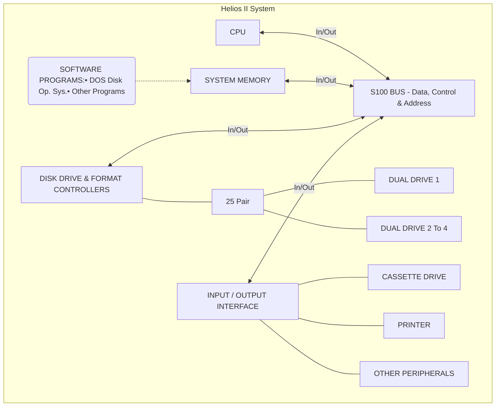

Fig. 1-1 Helios II System, Generalized Block Diagram

<page_number>2</page_number>

Helios II

# SECTION 1 INTRODUCTION

## 1.0 SCOPE OF THIS MANUAL

This manual is an operating and light maintenance reference for Helios II floppy disk memory system in its various configurations. The binder containing this manual also contains the system software manual, <u>PTDOS User's Manual.</u>

For detailed drive assembly troubleshooting, and replacement procedures for authorized dealers, refer to <u>Helios II Service Manual.</u>

## 1.1 GENERAL DESCRIPTION OF THE Helios II SYSTEM

(Refer to Fig. 1-1, Helios II System, Generalized Block Diagram.)

The Helios II is a dual floppy disk drive system designed as a mass data storage for host microcomputers using the S-100 bus. The disk drive unit is a firm-sectored type, which uses an optical sector and indexing system. The diskette required is a standard 32+1 hole diskette. System storage capacity is approximately 768,768 bytes per dual drive (two diskettes). The controller in the system is capable of interfacing up to four dual drives in two cabinets. Access time is approximately 173 ms typical. DMA (Direct Memory Access) transfer rate is approximately .66 megabyte per second. A sixteen byte fifo buffers the drive and computer.

## 1.2 PHYSICAL CONFIGURATION (Refer to Fig. 3-4, Diskette Drive Cabinet, Inside View.)

A. <u>Model 2</u>

The Helios II Model 2 consists of one dual drive unit, in its own air cooled cabinet, a controller PCB and formatter PCB which plug into the backplane of the S-100 bus, a power supply and cabling. (Refer to the frontispiece "Helios II System ...") The formatter is virtually part of the controller. The formatter PCB does not have to be plugged into the backplane. A Model 2 can be upgraded to a Model 4.

B. <u>Model 4</u>

The Helios Model 4 consists of two dual drive units in a cabinet the same size as the Model 2. It differs from the Model 2 in that it has two fans, a higher capacity power supply, and a larger indicator display. It uses the same controller and formatter PCBs.

Two Model 4s can be daisy-chained in an 8-diskette-unit system which can be accommodated by standard controller and formatter PCBs and PTDOS software.

<page_number>2</page_number>

1-1

Helios II

# 1.3 OPERATING SYSTEM and TEST/DIAGNOSTIC PROGRAMS

A disk operating system called PTDOS (Processor Technology Disk Operating System) is provided on a diskette. A test program is also provided on cassette.

# 1.4 DESCRIPTION OF DISKETTE DRIVE ASSEMBLY

(Refer to Item 7, Fig. 8-2, Cabinet Assembly, Model 2, Exploded.)

The Helios II diskette drive assembly (commonly referred to hereafter as "drive assembly") is installed in the Helios II cabinet as a separate subassembly without DC power or cabling of its own. Signal and power are provided from interconnections from other subassemblies in the system.

The Helios II diskette drive is designed to provide a means of low-cost, random-access data storage. This is accomplished through the recording of data on, and the retrieval of data from two separate rotating magnetic surfaces, as represented by two separate diskette cartridge assemblies (commonly called diskettes).

Means for easy acceptance, rotation, and quick independent removal of each diskette is provided by spindles which are linked to and derive their rotational motion from an electrical drive motor.

The diskette drive consists of: selectable read/write/erase electronics; common positioning control electronics; a common head positioning actuator; a common Track ØØ sensor; a common spindle drive mechanism; two read/write/erase heads; two head loading actuators; two separate index sensors.

## 1.4.1 DISKETTE ACCESS

Data is transferred to or from each diskette through its separate read/write/erase head.

Each read/write/erase head is assembled on a carriage which is located on the common head positioning actuator. The read/write/erase head is in direct contact with the diskette media surface. The head employs a single read/write gap followed by tunnel erase elements to provide erased areas between data tracks. Thus, normal track position tolerances between media and drives will not degrade the signal-to-noise ratio, and the diskette interchangeability is enhanced.

## 1.4.2 ELECTRONICS

A. Sufficient control electronics are employed to provide minimal data access time at optimal data transfer rates within compatibility requirements.

The electronics perform the following functions:

<page_number>2</page_number>

1-2

Helios II

1. Interpret and generate control signals.

2. Move the read/write/erase heads to the selected track.

3. Load the heads and read or write data.

4. Drive the spindle motor.

B. The electronics are packaged on printed circuit boards containing the following circuits:

1. Head positioning actuator driver.

2. Head load actuator drivers.

3. Read/write/erase amplifier and transition detector.

4. Index detection.

5. Track position and data safety sensing.

6. Spindle motor driver.

# 1.5 DISKETTE (Refer to Section 2, for specifications.)

The diskette is a cartridge that consists of a flexible magnetic disk enclosed in a plastic jacket. The disk is free to rotate within the jacket. Access and sector/index holes for the read/write/erase head and for data timing are provided. There are 32 sector holes and one index hole. Data is recorded only on one side of the diskette at the present time. The Helios II has provisions for the addition of another index photosense assembly to accommodate recording on both sides of the diskette. Reading and writing are done with the head in contact with the disk.

The diskette is provided with an envelope and container to protect the diskette when not in use. Detailed handling instructions are described in Section 4, Operating Instructions.

## 1.5.1 DISKETTE INTERCHANGEABILITY

Each diskette drive in conjunction with the controller transfers data to and from the diskette in such fashion that diskettes are fully "write/read" interchangeable within any other Helios II diskette drive system. (See Section 4.3.3, Diskette Compatibility with Other Systems.)

<page_number>2</page_number>

1-3

Helios II

# CONTENTS

## SECTION 2 SPECIFICATIONS

<table>
    <tr>
        <th>SECTION</th>
        <th></th>
        <th>PAGE</th>
    </tr>
    <tr>
        <td>2.0</td>
        <td>INTRODUCTION</td>
        <td>2-1</td>
    </tr>
    <tr>
        <td>2.1</td>
        <td>SYSTEM SPECIFICATIONS</td>
        <td>2-1</td>
    </tr>
    <tr>
        <td></td>
        <td>2.1.1 Physical</td>
        <td>2-1</td>
    </tr>
    <tr>
        <td></td>
        <td>A. Net Shipping Weight</td>
        <td>2-1</td>
    </tr>
    <tr>
        <td></td>
        <td>B. Cooling</td>
        <td>2-1</td>
    </tr>
    <tr>
        <td></td>
        <td>C. Dimensions</td>
        <td>2-1</td>
    </tr>
    <tr>
        <td></td>
        <td>2.1.2 Environmental</td>
        <td>2-1</td>
    </tr>
    <tr>
        <td></td>
        <td>A. Temperature and Humidity</td>
        <td>2-1</td>
    </tr>
    <tr>
        <td></td>
        <td>B. Ambient Air</td>
        <td>2-1</td>
    </tr>
    <tr>
        <td></td>
        <td>C. Other</td>
        <td>2-1</td>
    </tr>
    <tr>
        <td></td>
        <td>2.1.3 Power Requirements</td>
        <td>2-1</td>
    </tr>
    <tr>
        <td>2.2</td>
        <td>PCBs</td>
        <td>2-2</td>
    </tr>
    <tr>
        <td></td>
        <td>A. IC Technology</td>
        <td>2-2</td>
    </tr>
    <tr>
        <td></td>
        <td>B. Power Requirements</td>
        <td>2-2</td>
    </tr>
    <tr>
        <td></td>
        <td>C. Connectors</td>
        <td>2-2</td>
    </tr>
    <tr>
        <td>2.3</td>
        <td>DRIVE ASSEMBLY</td>
        <td>2-2</td>
    </tr>
    <tr>
        <td></td>
        <td>2.3.1 Dimensions</td>
        <td>2-2</td>
    </tr>
    <tr>
        <td></td>
        <td>2.3.2 Multiple-Drive Option</td>
        <td>2-2</td>
    </tr>
    <tr>
        <td></td>
        <td>2.3.3 Environmental Requirements</td>
        <td>2-3</td>
    </tr>
    <tr>
        <td></td>
        <td>A. Temperature, Humidity</td>
        <td>2-3</td>
    </tr>
    <tr>
        <td></td>
        <td>B. Magnetic Fields</td>
        <td>2-3</td>
    </tr>
    <tr>
        <td></td>
        <td>C. Altitude</td>
        <td>2-3</td>
    </tr>
    <tr>
        <td></td>
        <td>D. Shock and Vibration</td>
        <td>2-3</td>
    </tr>
    <tr>
        <td></td>
        <td>E. Cleanliness</td>
        <td>2-4</td>
    </tr>
    <tr>
        <td></td>
        <td>2.3.4 Electrical Specifications</td>
        <td>2-4</td>
    </tr>
    <tr>
        <td></td>
        <td>A. DC Power</td>
        <td>2-4</td>
    </tr>
    <tr>
        <td></td>
        <td>B. Logic Levels</td>
        <td>2-4</td>
    </tr>
</table>

<page_number>2</page_number>

Helios II

# CONTENTS (Continued)

<table>
  <thead>
    <tr>
        <th>SECTION</th>
        <th colspan="2">PAGE</th>
    </tr>
  </thead>
  <tbody>
    <tr>
        <td>2.3.5</td>
        <td>Functional Specifications</td>
        <td>2-4</td>
    </tr>
    <tr>
        <td> </td>
        <td>A. Diskette Loading Controls</td>
        <td>2-4</td>
    </tr>
    <tr>
        <td> </td>
        <td>B. Diskette Rotational Speed Control</td>
        <td>2-5</td>
    </tr>
    <tr>
        <td> </td>
        <td>C. Head Loading</td>
        <td>2-5</td>
    </tr>
    <tr>
        <td> </td>
        <td>D. Head Positioning</td>
        <td>2-5</td>
    </tr>
    <tr>
        <td> </td>
        <td>E. Data Recording</td>
        <td>2-6</td>
    </tr>
    <tr>
        <td> </td>
        <td>F. Data Addressing at Track Locations</td>
        <td>2-7</td>
    </tr>
    <tr>
        <td> </td>
        <td>G. MTBF, MTTR (See Section 6, Maintenance.)</td>
        <td>2-7</td>
    </tr>
    <tr>
        <td>2.3.6</td>
        <td>Safety Requirements</td>
        <td>2-7</td>
    </tr>
    <tr>
        <td> </td>
        <td>A. Interlocks</td>
        <td>2-7</td>
    </tr>
    <tr>
        <td> </td>
        <td>B. Heat Dissipation</td>
        <td>2-7</td>
    </tr>
    <tr>
        <td>2.3.7</td>
        <td>Interface Connectors</td>
        <td>2-7</td>
    </tr>
    <tr>
        <td> </td>
        <td>A. Signal Interface</td>
        <td>2-8</td>
    </tr>
    <tr>
        <td> </td>
        <td>B. Power and Interface Pin Connections (See Section 7.)</td>
        <td>2-8</td>
    </tr>
    <tr>
        <td> </td>
        <td>C. DC Power to Diskette Drives</td>
        <td>2-8</td>
    </tr>
    <tr>
        <td>2.3.8</td>
        <td>Interface Requirements</td>
        <td>2-8</td>
    </tr>
    <tr>
        <td> </td>
        <td>A. Power-On Sequence</td>
        <td>2-8</td>
    </tr>
    <tr>
        <td> </td>
        <td>B. Power-Off Sequence</td>
        <td>2-8</td>
    </tr>
    <tr>
        <td> </td>
        <td>C. Data Access and Transfer</td>
        <td>2-9</td>
    </tr>
    <tr>
        <td>2.4</td>
        <td>DISKETTE (For care and handling, see Section 4.3.)</td>
        <td>2-10</td>
    </tr>
    <tr>
        <td>2.4.1</td>
        <td>Physical</td>
        <td>2-10</td>
    </tr>
    <tr>
        <td> </td>
        <td>A. Type</td>
        <td>2-10</td>
    </tr>
    <tr>
        <td> </td>
        <td>B. Wearlife</td>
        <td>2-10</td>
    </tr>
    <tr>
        <td> </td>
        <td>C. Dimensions</td>
        <td>2-10</td>
    </tr>
    <tr>
        <td>2.4.2</td>
        <td>Environmental</td>
        <td>2-11</td>
    </tr>
    <tr>
        <td> </td>
        <td>A. Temperature and Humidity</td>
        <td>2-11</td>
    </tr>
    <tr>
        <td> </td>
        <td>B. Ambient Air</td>
        <td>2-11</td>
    </tr>
  </tbody>
</table>

<page_number>2</page_number>

Helios II

# SECTION 2 SPECIFICATIONS

## 2.0 INTRODUCTION

These specifications are divided into four subsections:

1. System (the cabinet and the PCBs installed in the host computer and cabling).

2. The PCBs excluding those in the drive assembly.

3. The diskette drive assembly.

4. The diskette.

All specifications pertain to a Model 2 (one dual drive) unless noted otherwise.

## 2.1 SYSTEM SPECIFICATIONS

### 2.1.1 PHYSICAL

A. Net Shipping Weight: 24.04 Kg. (53 lbs.)

B. Cooling: Forced air with passive mechanical filter.

C. Dimensions (cabinet) Height: 23.47 cm (9.24")
Width: 35.59 cm (14.01")
Length: 50.72 cm (19.97")

### 2.1.2 ENVIRONMENTAL

A. <u>Temperature and Humidity</u>

1. <u>Operating</u>

a. Range: 10 to 38°C (50 to 100°F)

b. Max. gradient: 36°C (20°F) per hour.

c. Relative Humidity: 8 to 80%.

d. Max. Wet Bulb Temperature: 25°C (78°F).

2. <u>Storage (Non-operating)</u>

a. Range: -29 to +49°C (-20 to +120°F).

b. Max. gradient: 36°C (20°F) per hour.

c. Relative Humidity: 8 to 80%.

d. Max. Wet Bulb Temperature: 29°C (85°F).

B. <u>Ambient Air:</u> Clean, dust and particle free air, cool with 50% humidity. No corrosive gases in the air. No colloids such as tobacco smoke.

C. <u>Other:</u> (See 2.3.3, Diskette Drive Assembly.)

### 2.1.3 POWER REQUIREMENTS (Cabinet with contained components, excluding PCBs in host computer.)

117 VAC, 8A Max; 5.0 nominal running

OR: 230 V, 50 Hz

Average Power Consumption: 30 watts

<page_number>2</page_number>

2-1

Helios II

# 2.2 PCBs

The following PCBs are components of the system outside of the diskette drive assembly:

1. Controller

2. Formatter

3. Indicator Panel

4. Regulator

## A. <u>IC Technology</u>

TTL and low power Schottky TTL.

## B. <u>Power Requirements</u>

<table>
  <thead>
    <tr>
        <th>PCB</th>
        <th>Voltage</th>
        <th>Current (Typical)</th>
    </tr>
  </thead>
  <tbody>
    <tr>
        <td>Controller</td>
        <td>+8 VDC (typical) +7.25 VDC (min.)</td>
        <td>1600 mA</td>
    </tr>
    <tr>
        <td>Formatter</td>
        <td>+8 VDC unregulated +7.25 V (min.)</td>
        <td>600 mA</td>
    </tr>
    <tr>
        <td>Regulator</td>
        <td>+8 VDC unregulated (min.); -8 V<br/>60 Hz (min.); 24 V 60 Hz (min.)</td>
        <td> </td>
    </tr>
    <tr>
        <td>Indicator</td>
        <td>+5 VDC</td>
        <td>175 mA</td>
    </tr>
  </tbody>
</table>

## C. <u>Connectors</u>

J2 of formatter PCB (jack which mates with P2): consists of a female shell: Molex Part No. 22-01-2015 and three pins, Molex Part No. 09-50-01114. (P2 is not supplied; see Section 3.5, Optional DC Power for Formatter PCB.)

# 2.3 DRIVE ASSEMBLY (Removed from cabinet and system)

## 2.3.1 DIMENSIONS

**Height**: 21.84 cm (8.6")
**Width**: 11.18 cm (4.4")
**Depth**: 38.1 cm (15.0") overall from mounting surface
**Weight (shipping)**: 11.34 Kg. (25 lbs. max.)
**Weight (installed)**: 9.07 Kg. (20 lbs. max.)

## 2.3.2 MULTIPLE-DRIVE OPTION

The multiple-drive option provides for the operation from one controller and two power supplies of up to four dual diskette drives (8 drive units) in close physical proximity to each other. All diskette drives in this system configuration use the same printed circuit boards. However, the line-terminating resistors on the diskette drive electronics printed circuit board (Data and Interface PCB) and indicator panel PCBs and are removed from all but the drive farthest from the controller, and the proper drive selector module is inserted in each drive. (Refer to Section 4.2.2, Drive Configuration.)

<page_number>2</page_number>

2-2

Helios II

# 2.3.3 ENVIRONMENTAL REQUIREMENTS:

The diskette drive and diskette should be in the same environment and subject to the same environmental conditions (especially temperature and humidity) for at least one hour prior to operation, as normal recommended operating procedure.

## A. <u>Temperature, Relative Humidity, Maximum Wet Bulb</u>

(See Section 2.1.2, System Environmental.)

## B. <u>Magnetic Fields</u>

### 1. <u>Operating</u>

The ambient stray magnetic field in the region of the head should not exceed 15 Gauss.

### 2. <u>Storage</u>

The ambient stray magnetic field in the region of the diskette should not exceed 50 oerstads.

## C. <u>Altitude</u>

### 1. <u>Equipment Operational</u>

Sea level to 10,000 feet.

### 2. <u>Equipment Non-operational</u>

Sea level to 35,000 feet.

## D. <u>Shock and Vibration</u>

The equipment should not suffer damage nor fail to perform as specified after having been subjected to the following shock and vibration under non-operational conditions:

### 1. <u>Shock</u>

Internal bracing is allowed if needed to meet this requirement. Eighteen (18) impact shocks of 5 g's (±10%) consisting of three shocks in opposite directions along each of three mutually perpendicular axes. Each shock impulse shall be a half sine wave with a time duration of 11 (±1) ms.

### 2. <u>Vibration</u>

Internal bracing is allowed, if needed, to meet this requirement. 1.5 g's (±10%) for the 5 to 55 (Hz) range for four hours on each axis with a 20-minute frequency scan.

<page_number>2</page_number>

2-3

Helios II

## E. <u>Cleanliness</u>

The Helios II diskette drive assembly is designed for use in commercial and industrial environments. However, no air filters or forced-air systems are provided within the diskette drive itself. Therefore, it should be kept in the Helios cabinet. If it must be removed from the cabinet for maintenance, and operated, optimum performance can be expected when used in a computer room environment with the resultant air cleanliness found in such a location. Dust and other airborne contaminants are a major threat to the operating life of the media and drive recording and positioning systems. (Refer to Section 6, Maintenance.)

## 2.3.4 ELECTRICAL SPECIFICATIONS

### A. <u>DC Power</u>

The following DC power is required per dual diskette drive:

<table>
  <tbody>
    <tr>
        <td>+5V DC ± 5%</td>
        <td>1.7 A nominal running.</td>
    </tr>
    <tr>
        <td> </td>
        <td>2.2 A maximum running.</td>
    </tr>
    <tr>
        <td>+8V DC Unregulated</td>
        <td>1.2 A nominal running.</td>
    </tr>
    <tr>
        <td>(Limits: 7.0 to 10.0V)</td>
        <td>2.0 A maximum running.</td>
    </tr>
    <tr>
        <td>-5V DC ± 10%</td>
        <td>0.15 A nominal.</td>
    </tr>
    <tr>
        <td> </td>
        <td>0.20 A maximum.</td>
    </tr>
    <tr>
        <td>+24V DC ± 10%</td>
        <td>1.0 A nominal when seeking.</td>
    </tr>
    <tr>
        <td> </td>
        <td>0.2 A nominal when not seeking.</td>
    </tr>
    <tr>
        <td> </td>
        <td>1.2 A maximum seeking with 3.0 A.</td>
    </tr>
    <tr>
        <td> </td>
        <td>maximum peak surges for up to</td>
    </tr>
    <tr>
        <td> </td>
        <td>10 ms at start of seek.</td>
    </tr>
  </tbody>
</table>

### B. <u>Logic Levels</u>

Interface line logic levels are as follows:

Negative level = 0.0V to ±0.5V.
Positive level = ±2.5V to ±5.5V or open circuit.
I/O signals are negative when selected (True).

## 2.3.5 FUNCTIONAL SPECIFICATIONS

### A. <u>Diskette Loading Controls</u>

Diskette loading and unloading is under manual operator control. Loading and unloading mechanisms within the drive provide the following features:

1. Positive diskette registration when loaded.

2. Visible, partial ejection of the diskette when unloading.

3. Minimum possibility of diskette damage due to loading/unloading.

<page_number>2</page_number>

2-4

Helios II

4. Easy diskette loading and unloading.

5. Unloading initiated manually or by remote control line (remote on designated options only).

## B. <u>Diskette Rotational Speed Control</u>

### 1. <u>Spindle Drive System</u>

A direct-coupled DC spindle motor servoed to follow a reference frequency comprises the diskette spindle drive system. Spindle power is applied by inserting one or both diskettes into the diskette drive.

### 2. <u>Motor Speed Regulation</u>

a. Average Diskette Rotational Speed: 360 ±7 rpm

b. Instantaneous Speed Variation: ±5 rpm

### 3. <u>Motor Start Time</u>

The diskette drive comes up to speed and attains operational status with 1 second after the application of drive DC or diskette insertion.

## C. <u>Head Loading</u>

### 1. <u>Head Engage Time</u>

The head engage time is less than 40 ms.

### 2. <u>Head Contact Force</u>

The head-to-disk contact force is 13 grams nominal, as established by testing and vendor recommendations.

## D. <u>Head Positioning</u>

### 1. <u>Head Positioning Times</u>

Track-to-track, including settling time: 10 ms max.

Inside-to-outside track, including settling: 100 ms max.

### 2. <u>Rotational Latency</u>

Average rotational latency: 83.3 ms.

### 3. <u>Head Positioning Error Rate</u>

The head positioning error rate is less than one positioning error per 10<sup>6</sup> seek executions.

<page_number>2</page_number>

2-5

Helios II

# E. <u>Data Recording</u>

## 1. <u>Recording Mode</u>

Data is represented on the diskette by 8-bit bytes.

## 2. <u>Recording Format</u>

Firm-sectored type, formatted by PTDOS (Refer to Section 7, Theory of Operation.)

## 3. <u>Recording Density</u>

Data is recorded at a nominal density of 6536 (±4%) flux changes per inch for an all 1's pattern on the innermost track, and 3672 (±4%) flux changes per inch for an all 1's pattern on the outermost track.

## 4. <u>Recording Capacity</u>

Unformatted data capacity is 3.1 megabits per diskette and 41 kilobits per track, single-side recording. Seventy-seven (77) tracks are available.

## 5. <u>Write Data Transfer Rate</u>

The write data bit rate is determined by the controller. The nominal bit rate is 250 kilobits per second. To insure that the recording density and read data bit rate are held within the specified limits, the write data bit rate shall not vary more than ±0.3% from nominal.

## 6. <u>Read Data Transfer Rate</u>

The read data bit rate is determined by the recording density and the rotational speed of the diskette being read. The nominal bit rate is 250 kilobits per second. Due to variations between diskette drives and controllers, this bit rate may vary as much as ±17% on an instantaneous basis (including pulse crowding effects).

## 7. <u>Recoverable Read Error Rate</u>

A recoverable read error is defined to be a read error corrected by no more than three attempts to read the record in error. The recoverable read error rate is less than one error per 10<sup>9</sup> bits read. All error rates are quoted for reading and writing on the same machine without removal and re-insertion of the diskette. All error rate tests are to be performed with a new (unused) diskette.

<page_number>2</page_number>

2-6

Helios II

## 8. <u>Non-recoverable Read Error Rate</u>

A non-recoverable read error is defined to be a read error which cannot be corrected after three attempts to read the record in error. The non-recoverable read error rate is less than one error per 10<sup>12</sup> bits read. Errors caused by the diskette (i.e., due to surface flaws, etc.) shall not be included in the computation of the non-recoverable read error rate.

## F. <u>Data Addressing at Track Locations</u>

The diskette drive is designed to locate data at the 77 defined tracks on the initialized surface of a diskette. Recorded tracks after tunnel erasure are 0.012" on 0.021" centers. The 77 tracks are numbered from øø for the outermost track to 76 for the innermost track. Track centerline is defined by the formula:

centerline radius = 2.029" + (76-N)/48"
± (tolerance) "

where N is the physical track number.

G. <u>MTBF, MTTR</u>: (See Section 6, Maintenance.)

## 2.3.6 SAFETY REQUIREMENTS

### A. <u>Interlocks</u>

An interlock indicating that a diskette has been properly mounted in the diskette drive is provided for each individual unit within the dual drive. This interlock inhibits operation of the spindle motor and generation of the Ready interface signal when diskettes are not properly mounted in the diskette drive.

### B. <u>Heat Dissipation</u>

Nominal heat dissipation for the all-DC-power diskette drive is 109 BTU per hour. Average operating power is 28 watts.

## 2.3.7 INTERFACE CONNECTORS

Within the configuration of a diskette system, all diskette drives are connected to the controller through a signal connector, either directly or by cabling routed in parallel to other diskette drives. Power is supplied to each diskette drive through a separate power connector.

<page_number>2</page_number>

2-7

Helios II

## A. <u>Signal Interface</u>

(For names and descriptions of signals, see Section 7, Theory of Operation.)

The signal connector of the first diskette drive in a diskette system is connected directly to the controller through a 50-conductor flat cable, or through a cable consisting of twenty-five twisted wire pairs. The signal connectors of subsequent diskette drives are connected in parallel with the signal connector of the first diskette drive through similar cables.

All signal lines should have a maximum length of 20 feet, and shall use a wire diameter equivalent to AWG #30 or larger.

## B. <u>Power and Interface Pin Connections</u>

(See Section 7, Theory of Operation.)

## C. <u>DC Power to Diskette Drives</u>

All DC power lines shall have lengths and wire diameters consistent with meeting the power regulation requirements of the diskette drive, as specified in Paragraph 2.3.4.

Eight lines are used to transmit DC power from the power supply through a separate power connector for each drive. One line pair (high and ground) is used for +5 VDC, one for +5 VDC unregulated, one for +24 VDC, and one for -5 VDC. In addition, a separate single line is available to connect drive and power supply chassis grounds.

Five-foot lengths of #18 AWG wire are normally acceptable for use as DC power lines between the drive and typical power sources.

# 2.3.8 INTERFACE REQUIREMENTS

## A. <u>Power-on Sequence</u>

DC power levels may be applied in any sequence to the diskette drive without causing damage to the drive unit.

## B. <u>Power-off Sequence</u>

Power levels may be removed in any sequence from the diskette drive without causing damage to the drive.

<page_number>2</page_number>

2-8

Helios II

# <u>C. Data Access and Transfer</u>

The timing inter-relationship during head positioning, head selection, and data transfer satisfies the following criteria and remains within the tolerances specified below:

1. Diskette spindle speed: 360 ±12 rpm.

2. Maximum head positioning time for an adjacent rack seek: 10 ms.

3. Maximum head positioning time for a 76-track seek: 100 ms.

4. Average rotational latency: 83.3 ms.

5. Maximum motor start time: 1 sec.

6. Radial dimensions of recording tracks: 3.612" for track 00, 2.029" for track 76.

7. Separation between the read/write gap and the trailing erase gap: 0.035 ± 0.002".

8. Index pulse interval time: 166.7 ± 3.3 ms.

9. Read data cell time: 4.0 μs ± 4%.

10. Write clock pulse to write data pulse: 2.0 μs ± 0.3%.

11. Width of Read, Separated Data, and Separated Clock pulses: 200 ns ± 20%.

12. Write data frequency: 249.7 kHz ± 0.3%.

13. Head load time: 40 ms maximum.

14. Erase gate turn-on: 210 ± 8 μs after leading edge of Write Gate (internal drive timing).

<page_number>2</page_number>

2-9

Helios II

15. Erase gate turn-off: 518 ± 10 μs after trailing edge of Write Gate (internal drive timing).

16. Maximum rise and fall time of interface pulses: 25 ns.

17. Phase-locked oscillator acquisition (lock-up) requirement is 4 bytes of all zeroes data.

18. Separated clock contains only those clocks that were written on the diskette.

19. Write current amplitude automatically switched by internal drive logic between Tracks 43 and 44.

20. Restore is a low-speed head positioning operation to Track ØØ. Completion of the Restore command is indicated by a negative level on the Seek Complete interface line.

21. Track position incrementing of the Track Difference Buffer Register in the drive is initiated by the positive-going (trailing) edge of the internal track detent pulse.

22. The Direction Select line shall be stable for a minimum of 100 ns prior to the leading edge of the Step pulse(s).

23. The entire pulse train on the Step line representative of a multi-track address change (one pulse per track) must be transmitted in less than 2.0 ms, at pulse recurrent frequencies of up to 500 kHz.

# 2.4 DISKETTE (For care and handling of diskettes, see Section 4.3.)

## 2.4.1 PHYSICAL

<u>A. Type</u>

Compatible to Dysan Part No. 101, having 32 sector holes and one index hole. Compatible diskettes are manufactured by Maxell.

<u>B. Wearlife</u>

200 hours of use on one track.

<u>C. Dimensions</u>
Inner Disk: 19.8 cm diameter (7.8")
Protective Jacket: 20.32 cm square (8")
Index Holes: .025 cm (.01")

<page_number>2</page_number>

2-10

Helios II

# 2.4.2 ENVIRONMENTAL

## A. <u>Temperature and Humidity</u>

1. <u>Operating</u>
   (See System Environmental, 2.1.2.)

2. <u>Storage (Non-operating)</u>

   a. Range: 4°C to 53°C (40°F to 127°F).

   b. Relative Humidity: 8% to 80%.

   c. Max. Wet Bulb Temperature: 29°C (85°F).

3. <u>Transportation</u>

   (Diskette in its envelope and in a protective box)

   Range: -40°C to 53°C (-40 to 127°F).

   Relative Humidity: 8 to 80%.

## B. <u>Ambient Air</u>

Clean, dust and particle free air, cool with 50% humidity. No corrosive gases in the air. No colloids such as tobacco smoke.

<page_number>2</page_number>

2-11

Helios II

# CONTENTS

## SECTION 3 UNPACKING AND ASSEMBLY TIPS

<table>
  <thead>
    <tr>
        <th>SECTION</th>
        <th> </th>
        <th>PAGE</th>
    </tr>
  </thead>
  <tbody>
    <tr>
        <td>3.0</td>
        <td>INTRODUCTION</td>
        <td>3-1</td>
    </tr>
    <tr>
        <td>3.1</td>
        <td>UNPACKING</td>
        <td>3-1</td>
    </tr>
    <tr>
        <td>3.2</td>
        <td>ASSEMBLY TIPS</td>
        <td>3-2</td>
    </tr>
    <tr>
        <td>3.2.1</td>
        <td>Printed Circuit Boards</td>
        <td>3-2</td>
    </tr>
    <tr>
        <td> </td>
        <td>A. Orientation of PCBs</td>
        <td>3-2</td>
    </tr>
    <tr>
        <td> </td>
        <td>B. Identifying Revision Levels of Assemblies</td>
        <td>3-2</td>
    </tr>
    <tr>
        <td>3.2.2</td>
        <td>DIP Sockets</td>
        <td>3-3</td>
    </tr>
    <tr>
        <td> </td>
        <td>A. Orientation of DIP Sockets</td>
        <td>3-3</td>
    </tr>
    <tr>
        <td> </td>
        <td>B. DIP Socket Installation Tip</td>
        <td>3-3</td>
    </tr>
    <tr>
        <td>3.2.3</td>
        <td>Integrated Circuits</td>
        <td>3-3</td>
    </tr>
    <tr>
        <td> </td>
        <td>A. Orientation of ICs</td>
        <td>3-4</td>
    </tr>
    <tr>
        <td> </td>
        <td>B. Loading ICs</td>
        <td>3-4</td>
    </tr>
    <tr>
        <td>3.2.4</td>
        <td>Soldering</td>
        <td>3-5</td>
    </tr>
    <tr>
        <td>3.3</td>
        <td>MODIFYING PCBs</td>
        <td>3-7</td>
    </tr>
    <tr>
        <td>3.3.1</td>
        <td>Tools And Materials Required</td>
        <td>3-7</td>
    </tr>
    <tr>
        <td>3.3.2</td>
        <td>Locating IC Pins</td>
        <td>3-7</td>
    </tr>
    <tr>
        <td>3.3.3</td>
        <td>To Cut A Trace</td>
        <td>3-9</td>
    </tr>
    <tr>
        <td>3.3.4</td>
        <td>To Install A Solder Bridge</td>
        <td>3-9</td>
    </tr>
    <tr>
        <td>3.3.5</td>
        <td>Check after Mods</td>
        <td>3-9</td>
    </tr>
    <tr>
        <td>3.4</td>
        <td>RE-INSTALLING THE DISKETTE ASSEMBLY</td>
        <td>3-9</td>
    </tr>
    <tr>
        <td>3.5</td>
        <td>OPTIONAL DC POWER FORMATTER PCB</td>
        <td>3-12</td>
    </tr>
  </tbody>
</table>

<page_number>2</page_number>

Helios II

Scanned page with hole punch marks and a faint smudge at the bottom

2

# SECTION 3 UNPACKING AND ASSEMBLY TIPS

## 3.0 INTRODUCTION

This section contains information you may need from time to time for making hardware modifications and updates to your Helios. It includes PCB and IC handling, soldered and PCB modifying tips.

Instructions for hardware changes are in the form of Change Notices which are contained in Section 10, Updates. From time to time additional Change Notices may be sent to you.

Also, in this section are instructions for re-assembling the Helios II after special cleaning procedures in Section 6, Maintenance.

## 3.1 UNPACKING

1. Choose a clear, clean, flat area to unpack.

2. Inspect for shipping damage. If damage is detected, contact the carrier and Processor Technology immediately.

3. Do not pull the cardboard dummy diskettes out of the diskette slots. Wait until you have read Section 4, Operating Instructions. The cardboard must be ejected by the drive when AC power is applied.

4. Check the contents of the shipment against the following list and the packing list. If an item is missing, notify Processor Technology.

* a. Helios II cabinet(s) with 2 keys.

* b. Controller PCB.

* c. Formatter PCB.

* d. Cable Assembly, Controller/Formatter.

* e. Cable Assembly, Controller/Cabinet(s).

* f. Helios II Disk Memory System Manual (this Manual).

* g. <u>PTDOS User's Guide</u> software manual (in this binder, behind the white cardboard divider).

* h. Diskette, containing PTDOS.

* i. Diskette, blank.

* j. Cassette, Disk System Test.

<page_number>2</page_number>

3-1

Helios II

NOTE: If you have purchased a computer system containing one or more Helios II cabinets, compare the contents of the shipment package(s) against the packing list instead of the above list.

There should also be an accessories price list and a warranty card in the binder of the manual.

5. Fill out the warranty card and mail it to Processor Technology.

6. When you are unpacked, go to Section 4, Operating Instructions.

## 3.2 ASSEMBLY TIPS

### 3.2.1 PRINTED CIRCUIT BOARDS

A. ORIENTATION OF PCBS
(Refer to the PCB Assembly drawings in Section 8, Drawings.)

Orient the PCB with the component side up, lying flat on the work bench, so that the printed matter on the component side is in normal reading position. The printed matter is called the legend. The legend contains the silkscreened component layout lines and the component identification words and numbers. The components are soldered in place over their respective outlines. There may or may not be traces on the component side in addition to the components. This side of the PCB is referred to as the "component side" or the "legend side."

The opposite surface of a PCB has trace circuits etched on it and is called the "trace side," or "circuit side," or "solder side." It is characterized by a lack of components and by the points of the component lead wires protruding above its surface (when assembled).

B. IDENTIFYING REVISION LEVELS OF ASSEMBLIES

1. <u>Assembly Number</u>

This number is marked on the component side of the PCB, either silkscreened as part of the legend or etched as part of the conductor pattern if a legend is not used. Example: "ASSY 123456 REV..." The revision level is marked separately and is not part of the silkscreen or etching. "Assembly" means the board is assembled with components to a certain configuration. The same schematic may be used for different assemblies or revision levels.

2. <u>PC Number</u>

This number (with Rev. letter) is etched on the solder side (trace side) of the PCB. Example: "PC 123456 REV X." This PC number gives the part number and revision level of the bare board.

<page_number>2</page_number>

3-2

Helios II

# 3.2.2 DIP SOCKETS

There are two sizes: 14 and 16-pin. The correct size is indicated by the size of the legend on the component side of the PCB.

## A. <u>Orientation of DIP Sockets</u>

Orient each socket with its end notch or #1 end matching the colored dot on the legend. The pin #1 end is indicated by the lower right-hand corner being filled in on an angle. Occasionally, the #1 pin end of a socket is indicated instead by a notch in the side of the socket. (See Figure 3-1, DIP Sockets.)

Engineering drawing of two DIP sockets showing orientation notches and pin 1 indicators

Figure 3-1, DIP Sockets

## B. <u>DIP Socket Installation Tip</u>

1. Insert socket pins into the mounting pads at the appropriate location.

2. While pressing the socket in place to ensure that is is fully seated, on back (solder) side of board, bend pins at opposite corners of socket (e.g., pins 1 and 9 on a 16-pin socket) outward until they are at a 45° angle to the board surface. This secures the socket until it is soldered.

3. Repeat this procedure with each socket until all are secured to the board.

4. Solder the unbent pins on the trace side.

5. Straighten the bent pins and solder. Do not solder bent pins since that may cause solder bridges.

# 3.2.3 INTEGRATED CIRCUITS

> **CAUTION**
>
> <u>Installing and Removing Integrated Circuits<sup>\*</sup></u>
>
> NEVER install or remove integrated circuits when power is applied to the Helios II. To do so can damage the ICs.

\*There are no MOS ICs on Helios PCBs.

<page_number>2</page_number>

3-3

Helios II

## A. ORIENTATION OF ICS AND SOCKETS

Orient the IC so that the number one pin is in the lower right hand corner. The pin number one position is indicated by a dot or small hole embossed into the lower right hand corner or by a notch molded into the IC on the lower edge when the IC is properly oriented. The assembly drawing and the legend both show the notch in the lower edge of the IC and a dot on the PCB in front of the outline of the IC socket. (See Figure 3-2, "Integrated Circuits.")

Engineering drawing of an integrated circuit (DM7400N) showing pin numbering from PIN 1 to PIN 14

Engineering drawing detail showing a notch and a note: PIN 1 MAY BE INDICATED BY CORNER DOT OR CUT-OUT

Figure 3-2, Integrated Circuits

## B. LOADING ICs

Many DIP devices have their leads spread so that they may not be inserted directly into their sockets. They must be "walked in" using the following procedure.

Insert the pins from one row only into the socket until they barely engage. Push the device using both hands with even pressure to bend this first row of pins until the second row of pins lines up with the holes in the socket, then push the second row of pins into the socket. After all ICs are inserted, examine each to make sure that no pins are bent out or under. Careful examination might prevent hours of unnecessary troubleshooting later.

<page_number>2</page_number>

3-4

Helios II

Diagram showing a socket on a PCB with pins labeled "BENT UNDER" and "BENT OUT"

Diagram showing a socket correctly seated on a PCB labeled "CORRECT"

Figure 3-3, Checking IC Pins

## 3.2.4 SOLDERING

1. Use a low-wattage iron with a small screwdriver pointed tip, 25 watts maximum on the formatter, controller, and indicator panel PCBs. A higher wattage may be used on the regulator board.

Larger irons run the risk of burning the printed-circuit board. Don't try to use a soldering gun, they are too hot.

2. To make a good solder joint the iron must be clean. Keep a damp piece of sponge by the iron and wipe the tip on it before using it and after each use.

3. Use only 60-40 rosin-core solder. NEVER use acid-core solder or externally applied fluxes. Use the smallest diameter solder you can get.

4. To solder, wipe the tip, apply a light coating of new solder to it, and apply the tip to both parts of the joint, that is, both the component lead and the printed-circuit pad. Apply the solder against the lead and pad being heated, but not directly to the tip of the iron. Thus, when the solder melts the rest of the joint will be hot enough for the solder to "take," (i.e., form a capillary film).

5. Always heat both parts that are to be soldered, preferably at their junction. Use a very light touch. Pressing the

<page_number>2</page_number>

3-5

Helios II

tip of the iron too hard on pad or trace can cause the pad or trace to lift off the board and permanently damage the board.

6. Apply solder for a second or two, then remove the solder and keep the iron tip on the joint. The rosin will bubble out. Allow about three or four bubbles, but don't keep the tip applied for more than ten seconds.

7. Solder neatly and as quickly as possible. Wipe residual flux off the soldering iron with a damp sponge.

## 8. <u>Solder Bridges</u>

Solder should follow the contours of the original joint. A blob or lump may well be a solder bridge, where enough solder has been built upon one conductor to overflow and "take" on the adjacent conductor. This causes a short circuit. Due to capillary action, these solder bridges look very neat, but they are a constant source of trouble when boards of a high trace density are being soldered.

The Helios II uses circuit boards with plated-through holes. Solder flow through to the component (front) side of the board can produce solder bridges. After soldering each group of components, clean the soldered parts immediately and then check for such bridges.

A few minutes of careful inspection at this time may prevent damage to components and hours of troubleshooting later. The best time to inspect for solder bridges is immediately after soldering; otherwise, time will be wasted going back to find the soldered areas with the possibility of overlooking or forgetting them.

To remove solder bridges, it is best to use a vacuum "solder puller" if one is available. If not, the bridge can be reheated with the iron and the excess solder "pulled" with the tip along the printed circuit traces until the lump of solder becomes thin enough to break the bridge. Braid-type solder remover, which causes the solder to "wick up" away from the joint when applied to melted solder, may also be used.

9. The Helios II circuit boards have integral solder masks (lacquer coating); masks shield selected areas on the boards and minimize the chances of creating solder bridges during assembly. Do not put masking tape over the traces. When the masking tape is removed, it can tear off the solder mask.

<page_number>2</page_number>

3-6

Helios II

# SOLDER CLEANING INSTRUCTIONS

A. Select the following materials:

a. Solder flux remover (kester).

b. Flux (Acid) Brush (Cut off bristles of a tooth brush to 3/8 inch to make a cleaning brush).

c. Paper towels (small Kimwipes are recommended).

B. Put flux remover on the area to be cleaned and scrub the area with the cleaning brush.

C. Put the paper towel over the scrubbed area.

D. Brush the back side of the paper towel.

E. Lift off paper towel and discard.

## 3.3 MODIFYING PCBs

### 3.3.1 TOOLS AND MATERIALS REQUIRED

1. Exacto knife.

2. Soldering iron and solder.

3. #24 insulated, solid jumper wire.

4. Magnifying glass.

### 3.3.2 LOCATING IC PINS

1. Orient the PCB as in section 3.2.1, Orientation of PCBs.

2. Put your finger on pin-1 of the device called for in the instructions; for example, U23-14 (IC 23, pin-14).

3. Keeping your finger at the place, flip the PCB over by twisting your wrist horizontally so that the trace side faces up and the Rev level of the board is in normal reading position.

4. Note to which pin lead or pad your finger is pointing at on the other side of the PCB. Pin-1 on the trace side is square; other pin pads are round.

5. Count the pins clockwise to arrive at the pin called for by the instructions. (The pins are counted counterclockwise on the legend side.)

19n1d63301G 95

<page_number>2</page_number>

3-7

Helios II

Photograph of the inside top view of a Helios II Diskette Drive Cabinet with labels for Fan, Transformer, Regulator PCB, Diode Bridge Rectifier, Diskette Drive Assembly, Keyswitch, Indicator Panel, and Bezel.

Figure 3-4 Helios II Diskette Drive Cabinet, Inside Top View

<page_number>2</page_number>

3-8

Helios II

### 3.3.3 TO CUT A TRACE

1. Make two cuts between 1/32 and 1/16 inch apart.

2. Lift up the trace between the cuts with an exacto knife. (Sometimes space will not permit this.)

3. Inspect with a magnifying glass to be sure all copper has been removed.

> 

> **NOTE**
>
> 

> All trace cuts are to be made on the trace side of the PCB unless otherwise specified.

### 3.3.4 TO INSTALL A SOLDER BRIDGE

To solder a solder bridge onto a trace, first scrape off the solder mask so that the solder will adhere.

### 3.3.5 CHECK AFTER MODS

1. After you have soldered a connection, clean and inspect for solder bridges.

2. Check the modifications made by reversing the procedure in "Locating IC Pins;" that is, orient the PCB with the trace side up (where the mods are usually made); then put your finger on the connection; count the pin number, flip the PCB over and verify the device designation.

### 3.4 RE-INSTALLING THE DISKETTE DRIVE ASSEMBLY

(Refer to the exploded views of the cabinet, base, and bezel assemblies, Figures 8-2, 8-3, and 8-4, respectively.)

1. Choose a clean and uncluttered area to install the drive assembly. Optical and mechanical systems within the disk drive unit are particularly susceptible to dust and dirt accumulating especially when the top cover is removed; the working area should be thoroughly cleaned and kept clean while the drive is being installed.

> 

> **CAUTION**
>
> 

> Avoid handling the drive unit by its inner components; pick it up by its outer chassis only. Alignment of these components is critical. Do not touch them unnecessarily with the hand or tools. This is especially the case with the positioner mechanism.

80114H

3-9

Helios II

<page_number>2</page_number>

J3 CONNECTOR

Photograph of disk drive internal components showing the J3 and PI connectors with their respective cables attached to a circuit board assembly.

PI CONNECTOR

Fig. 3-5. Disk Drive DC Power and Signal Connectors

<page_number>2</page_number>

3-10

Helios II

2. Select the Helios II bezel assembly and install the disk drive to bezel using two 8-32 x 1 inch cap screws. Do not tighten at this time.

3. Reinstall the pushbutton switches on the bezel as follows:

    a. Insert switch into hole provided on bezel.

    b. Attach and tighten the internal tooth lockwashers and hexnuts over the stems of the switches.

    c. Push-back-on the pushbutton covers.

4. Mount the drive assembly to the base assembly using four 8 x 32 x 5/8 inch screws, four #8 internal lockwashers; tighten the screws

5. Make sure the #8 cap screws (step 2) are still untightened at this time.

6. <u>Attaching Bezel to Base</u>
    (Refer to Fig. 8-2, Cabinet Assembly, Exploded.)

    a. Install three 6-32 x 7/16 inch screws and three #6 internal lockwashers from the bottom of the base into the bezel.

    b. Install one 6-32 x 1/2 inch screw and one internal lockwasher on the keyswitch side of the bezel into the base.

    c. Now tighten the two #8 cap screws which attach the bezel assembly to the drive assembly (installed in step 2).

7. Ensure that all screws are tight.

8. Connect the 10-pin plug connector from the power supply wiring harness to J3 of the rear of the disk drive unit. One of the pins is removed from J3 and a polarizing plug is inserted in the mating plug hole so that 10-pin plug connector can go on only one way. (See Fig. 3-5, Diskette Drive DC Power and Signal Connectors.)

9. Connect the flat 50-conductor signal cable (Signal/Indicator Panel Cable Assembly) from the indicator panel PCB to the disk drive at P1. P1 is an edge connector on the PCB<sup>\*</sup> protruding its short edge at the rear of the drive assembly. The pin-1 end of the plug connector (indicated by the colored stripe on the pin-1 edge of the cable) goes on at the bottom of the mating PCB edge connector P1. Pin-2 is designated on the PCB legend at this end and pin-50 on the opposite end. (See Fig. 3-5, Disk Drive DC Power and Signal Connectors.)

\*Data and Interface PCB.

<page_number>2</page_number>

3-11

Helios II

10. Install the top cover on the drive cabinet. Using three 6 x 32 x 1/4 inch screws, attach the rear panel to the cover.

## 3.5 OPTIONAL DC POWER FOR FORMATTER PCB

The formatter PCB receives only DC power through the S-100 edge-connector. Instead of plugging the formatter into a S-100 backplane connector, when the connector would otherwise be useful, power may be supplied through P2. The connector, J2, which mates with P2 is specified in Section 2, Specifications.<sup>*</sup> It is not supplied in Helios II system.

To supply power through P2:

1. Apply +8 volts on pin 3 (center pin).

2. Ground on pins 1 and/or 5.

\* Since the voltages are arranged symmetrically around the center pin, the plug is non-polarized. The jack which mates with P2 may be oriented either way.

<page_number>2</page_number>

3-12

Helios II

# CONTENTS

## SECTION 4 OPERATING INSTRUCTIONS

<table>
  <thead>
    <tr>
        <th>SECTION</th>
        <th> </th>
        <th>PAGE</th>
    </tr>
  </thead>
  <tbody>
    <tr>
        <td>4.0</td>
        <td>INTRODUCTION.</td>
        <td>4-1</td>
    </tr>
    <tr>
        <td>4.1</td>
        <td>SYSTEM REQUIREMENTS</td>
        <td>4-1</td>
    </tr>
    <tr>
        <td>4.2</td>
        <td>TERMINOLOGY, NUMBERING, AND CONFIGURATION</td>
        <td>4-2</td>
    </tr>
    <tr>
        <td> </td>
        <td>4.2.1 Helios Terms</td>
        <td>4-2</td>
    </tr>
    <tr>
        <td> </td>
        <td>4.2.2 Multi-Drive System Configuration.</td>
        <td>4-3</td>
    </tr>
    <tr>
        <td> </td>
        <td>A. Terminator Resistor Pack</td>
        <td>4-3</td>
    </tr>
    <tr>
        <td> </td>
        <td>B. Selector DIP</td>
        <td>4-3</td>
    </tr>
    <tr>
        <td>4.3</td>
        <td>CARE AND USE OF DISKETTES</td>
        <td>4-4</td>
    </tr>
    <tr>
        <td> </td>
        <td>4.3.1 Preliminary Handling Tips</td>
        <td>4-4</td>
    </tr>
    <tr>
        <td> </td>
        <td>4.3.2 Loading and Unloading The Diskette</td>
        <td>4-4</td>
    </tr>
    <tr>
        <td> </td>
        <td>4.3.3 Write Protection</td>
        <td>4-7</td>
    </tr>
    <tr>
        <td> </td>
        <td>4.3.4 Compatibility with Other Systems.</td>
        <td>4-8</td>
    </tr>
    <tr>
        <td>4.4</td>
        <td>SETUP AND INSTALLATION</td>
        <td>4-9</td>
    </tr>
    <tr>
        <td> </td>
        <td>4.4.1 Connecting The Cables</td>
        <td>4-10</td>
    </tr>
    <tr>
        <td>4.5</td>
        <td>INDICATORS</td>
        <td>4-13</td>
    </tr>
    <tr>
        <td>4.6</td>
        <td>CONTROLS</td>
        <td>4-14</td>
    </tr>
    <tr>
        <td>4.7</td>
        <td>OPERATING INSTRUCTIONS</td>
        <td>4-14</td>
    </tr>
  </tbody>
</table>

<page_number>2</page_number>

Helios II

2001648130 43

Photograph of the Helios II Disk Memory System front panel by Processor Technology, showing drive slots, status indicators (RDY, WRT, HEAD, SEEK, ON), and a key lock.

Fig. 4-1 Helios II Front Panel
<page_number>2</page_number> Helios II

# SECTION 4 OPERATING INSTRUCTIONS

## 4.0 INTRODUCTION

The Helios II should not be loaded with the PTDOS program until the Disk System Test in Section 5, "Testing and Trouble-shooting" is performed; however, this entire section should be read before performing the tests in Section 5.

This section builds up to the actual operating instructions rather than jumping into them. The operator must be adequately prepared with information and understand the relative importance of the elements in the system. For example, the care and handling of the diskette is critical in a floppy disk system. Special terminology used in this system must be defined. The sequence of steps is often as important as the steps themselves. Please read each section in the sequence given. Of course, when you become familiar with the content, the sections can be referenced as needed.

These instructions are aimed primarily at the operation of the system hardware with some references to disk operating system. Instructions for the software are in the <u>PTDOS User's Guide</u>, also contained in this binder.

## 4.1 SYSTEM REQUIREMENTS

1. Helios II tested as per Section 5, Testing and Trouble-shooting.

2. Host computer (S-100 bus compatible), preferably a Sol-20.\*

3. 16 kilobytes of RAM memory (minimum) configured as follows:

> 4K: ØØØØH to 3FFFH
> 12K: 9ØØØH to BFFFH

4. Video monitor or black and white TV converted for video input. (For TV conversion instructions, see <u>Sol Systems Manual</u>, Appendices, or <u>VDM-1 Video Display Module Assembly and Test Instructions</u> (PTC).

5. PTDOS program on diskette; a blank diskette.

6. Disk System Test (cassette).

7. BOOTLOAD program in either of three forms:

   - a. P.T. BOOTLOAD Personality Module.

   - b. BOOTLOAD as recorded on the front of the Disk System Test cassette (item 6 above). This requires a Sol or a host computer with CUTS interface and CUTER monitor.

   - c. BOOTLOAD listing. (Refer to PTDOS User's Guide, Section 8, Appendix B, "Getting Started with PTDOS.")

8. <u>Helios II Disk Memory System Manual</u>, including the <u>PTDOS User's Guide</u>.

\*This section is oriented primarily with the assumption that the Helios is associated with a Processor Technology Sol system.

<page_number>2</page_number>

4-1

Helios II

# 4.2 TERMINOLOGY, NUMBERING, AND CONFIGURATION

The terms used in this manual in relation to the drive configurations are illustrated in Figure 4-2 "Helios System Terminology."

Helios System Terminology engineering drawing showing Cabinet 1 and Cabinet 2 with drive and unit numbering

Figure 4-2 Helios System Terminology

(Model 2 contains only drive Ø, units Ø and 1. See 4.2.2, Multi-Drive System Configuration.)

## 4.2.1 **HELIOS TERMS** (Refer to Fig. 4-2)

<table>
  <thead>
    <tr>
        <th>TERM</th>
        <th>DEFINITION</th>
    </tr>
  </thead>
  <tbody>
    <tr>
        <td>CABINET</td>
        <td>The enclosure containing one or two dual drives.</td>
    </tr>
    <tr>
        <td>DRIVE</td>
        <td>The dual drive assembly; containing 2 slots to accept diskettes.</td>
    </tr>
    <tr>
        <td>UNIT</td>
        <td>The individual diskette slot with its accompanying drive mechanism, numbered by counting all the slots in the system (from Ø up to 7 inclusive).</td>
    </tr>
    <tr>
        <td>SELECTED UNIT</td>
        <td>The unit in the system selected by the PTDOS and indicated by the light on one of the indicator panels in the system (Ø up to 7 inclusive).</td>
    </tr>
    <tr>
        <td>INDICATED UNIT</td>
        <td>The individual diskette slot numbered by counting only the slots within a given cabinet. (Ø up to 3 inclusive).</td>
    </tr>
    <tr>
        <td>DISKETTE</td>
        <td>The floppy disk recording medium.</td>
    </tr>
  </tbody>
</table>

<page_number>2</page_number>

4-2

Helios II

# 4.2.2 MULTI-DRIVE SYSTEM CONFIGURATION

## A. <u>Placement of Terminator Resistors</u>

Four dual diskette drives can be operated with signal connectors in parallel on one signal cable (daisy chain). In a multi-drive system, the terminator resistor pack, which can occupy U1 on the drive Data and Interface PCB, must be installed only in the drive farthest electrically from the controller. All the other drives must have U1 vacant.

Similarly, resistors R12 through R15 on the indicator panel PCB must be installed only in the drive cabinet further electrically from the controller and must be removed from the board in the cabinet closer to the controller.

## B. <u>Selector DIP</u> (Refer to Fig. 8-15, Selector DIPS ... )

The Helios system is capable of accommodating up to 8 units, as shown in Figure 4-2. Model 2 contains two units only. In systems containing more than two units, each pair of units must be able to identify itself to PTDOS as being units 0-1, 2-3, 4-5, or 6-7.

On the large PCB on the right side of each drive (Data and Interface PCB) is a DIP socket, U11, which can receive a DIP device called a Selector. The Selector performs the unit identification function. If you are using the Model 2 alone, it is recommended that you do install the Selector if supplied with the unit (even though it will be non-functional), as a means of safe-keeping it. If Selector 0-1 is <u>not</u> installed, the drive will respond to calls from the software to any unit, 0 through 7. If you add additional drives, install Selector 0-1 in the left-hand drive (drive 0 of cabinet 1). Make sure the pin 1 designation on the Selector is aligned with the pin 1 designation on the socket U11, as with an ordinary IC.

Additional Selectors designated 2-3, 4-5, and 6-7 are available. If a second drive is added in the same cabinet, install a Selector 2-3 in it. The left-hand drive in a second cabinet should receive Selector 4-5 whether or not the first cabinet has a second drive identified 2-3. The right-hand drive in a second cabinet should receive Selector 6-7. This arrangement of unit identification is shown in Figure 4-2, "Helios System Terminology."

Refer to 7.12.2, E, Parallel Operation and Unit Selection for more information.

<page_number>2</page_number>

4-3

Helios II

# 4.3 CARE AND USE OF DISKETTES

> 

> **NOTE:**
>
> Use only Dysan diskettes (Dysan Part No. 101) or an approved equivalent such as Maxell. This diskette must have 32 sector holes (plus one index hole), which are visible through the small hole near the spindle hole.

## 4.3.1 PRELIMINARY HANDLING TIPS

The floppy disk diskette is a precision component and must be handled with reasonable care to avoid damage or accidental erasure. Proper care will assure longer life and greater reliability. The main concerns are dirt, foreign matter, mechanical damage, magnetic fields, and heat.

1. Store the diskette in its protective envelope at all times when not in use. Store in a vertical position. Store in a cool, dry place, out of direct sunlight. Do not leave it in a car or near sources of heat.

2. Do not bend or crease the diskette. Handle carefully, and never touch the area inside the rectangular window, or the magnetic surface containing the tracks inside the circular window. Fingerprints can destroy data and prevent the diskette from being written on.

3. Insert and remove the diskette from the drive carefully and gently.

4. Protect the area of the diskette which is exposed on both sides, through the area of the window, from contact with hands or other objects. A small crease from a fingernail or sharp object can render the diskette useless.

5. Avoid exposure to magnetic fields from magnets, transformers, etc. Avoid contact with all ferrous metals. Common tools, such as screwdrivers, often have magnetized tips which can erase valuable information stored on the diskette.

## 4.3.2 LOADING AND UNLOADING THE DISKETTE

> 

> **CAUTION**
>
> Do not execute the procedures in this section using a recorded diskette. You may practice using a blank diskette. This section is primarily for you to remember when you get to the operating instructions, Section 4.7.

2 JIL9H 4-4 Helios II
<page_number>4-4</page_number>

# FLOPPY DISK HANDLING AND STORAGE

## Handling precautions to protect against possible failure

1. Do not touch the disk surface. Easily contaminated, and causes errors.

Illustration of a hand touching a floppy disk surface with a cross over it

2. Do not use solutions: alcohol, thinner, Freon, to clean the disk.

Illustration of bottles of alcohol, thinner, and Freon with crosses over them

3. Do not use magnets or magnetized objects near the disk. Data can be lost from a disk when exposed to a magnetic field.

Illustration of a magnet near a floppy disk

4. Do not bend or fold the disk.

Illustration of a bent floppy disk

5. Do not place heavy objects on the disk.

Illustration of books stacked on a floppy disk

6. Do not use rubber bands or paper clips on the disk.

Illustration of a paper clip and rubber band on floppy disks

7. Do not write on a disk label with a pencil or a ball-point pen. Use a fiber-tip.

Illustration of a pencil and pen with crosses, and a fiber-tip pen

8. Do not use erasers.

Illustration of an eraser being used on a disk with a cross

9. Put I. D. labels in a right place, never use them in layers.

Illustration of correct label placement on a floppy disk

10. Insert carefully, by grasping upper edge and placing it into the drive.

Illustration of a floppy disk being inserted into a disk drive

11. Keep disk in its envelope.

Illustration of a floppy disk and its envelope

12. Store disk not for immediate use in their box, and set it up.

Illustration of floppy disks stored vertically in a box

13. Do not expose the disk to excessive heat or sunlight.

Illustration of a floppy disk exposed to sun and heat

14. Operating environment
10°C to 50°C (50°F to 122°F)
20% to 80% RH
less than 29°C (Wet bulb temperature)

Diagram showing operating temperature range from 10°C to 50°C

15. Storage environment
4°C to 53°C (40°F to 127°F)
8% to 80% RH

Diagram showing storage temperature range from 4°C to 53°C

16. Transportation
During transportation the disk shall be in its envelope, and in a protective box.
Temperature: -40°C to 53°C (-40°F to 127°F)
Relative humidity: 8% to 90% RH

Diagram showing transportation temperature range from -40°C to 53°C

Reprinted courtesy of maxell logo Corp. of America
Moonachie, New Jersey

Fig. 4-3 Floppy Disk Handling And Storage

<page_number>2</page_number>

4-5

Helios II

# DISKETTE CAUTIONS

A. Do not attempt to insert a diskette with the power to the drive turned OFF. Acceptance of the diskette by the drive is motorized.

B. Do not turn the drive power OFF with a diskette in the slot. Eject the diskette(s) before power-down.

C. Do not turn the computer power OFF with a diskette still in a slot. Eject the diskettes before computer power-down.

D. Do not try to pull out the diskette manually with the power to the drive turned off. The ejection of the diskette is motorized.

E. Do not run the drive with one diskette in and one ejected. Fully remove the ejected diskette. Otherwise, the revolving hub for the ejected unit may wear into the ejected or partially removed diskette.

1. The diskette should be approximately the same temperature as the drive while operating. If the diskette has been exposed to temperatures outside the recommended operating conditions given in Section 2, keep it at room temperature for about five minutes before inserting it in the drive.

2. Grasp the diskette on its edge opposite the notched edge (opposite the rectangular window with the rounded edges.) (Refer to Fig. 4-4, Diskette Orientation for Loading.)

3. Hold the diskette vertically on edge so that the label is in the upper right corner (on the left side of the diskette). The large notch should be in the bottom 1/4 of the diskette.

4. The direction of insertion into the diskette aperture is forward from the notched edge.

Insert the diskette gently into the appropriate slot, until the front edge is flush with the face of the slot. There should be no resistance to the insertion. A sensing device in the drive will automatically close the carrier when the diskette is properly positioned. The drive will grab the diskette and spin it.

If the diskette is inserted in the wrong orientation, it will cause no damage, but no data can be read or written on the diskette; if PTDOS is loaded, it will report, on the system output device, the error message: "Drive not Ready."

The heads for both units read or write on the side of the diskette opposite the side with the label. Only this side is tested and initialized by the diskette manufacturer at the present time.

<page_number>2</page_number>

4-6

Helios II

Diagram showing diskette orientation for loading into a Helios drive slot, highlighting the label, grasp area, small notches, window, index hole, and large notch.

Fig. 4-4 Diskette Orientation for Loading

5. To eject diskette, apply power to the drive, and press the EJECT button next to the slot in which you have inserted the diskette. The diskette should eject automatically to where it can be easily removed from the drive. If the adjoining unit is revolving with a loaded diskette, remove the ejected diskette completely to avoid abrasion.

6. When you leave your Helios idling with power on for more than a few minutes, eject the diskette to save wear and tear on the diskette and the spindle and drive motor. This will also conserve energy.

## 4.3.3 WRITE PROTECTION

> **CAUTION**
>
> Helios II diskettes that have data written on them are not protected from being overwritten by the protect label. See explanation in the following paragraph.

The edge of the diskette, diagonally opposite the label, has an oval notch. In some floppy disk systems the diskettes are normally protected from being written upon unless this notch is covered over with a protect label. In the Helios system, the

<page_number>2</page_number>

4-7

Helios II

diskettes are always unprotected mechanically but are protected by program control. Diskettes can be written on whether or not the notch is covered.

## 4.3.4 DISKETTE COMPATIBILITY WITH OTHER SYSTEMS

Diskettes containing data written by your Helios II may be used in any other Helios II system. Blank diskettes may be used in other floppy disk systems but written diskettes will not be compatible in format with other systems.

<page_number>2</page_number>

4-8

Helios II

# 4.4 SETUP AND INSTALLATION

1. Assure that the ambient temperature is between 50° and 100°F (10°C to 38°C); room temperature (77°F, 25°C) is recommended.

2. Situate the disk drive unit in the working area so that there is easy access for inserting and removing diskettes.

3. Make sure the fan opening, on the rear panel, is unobstructed, allowing adequate air flow.

4. Assure that the power ON/OFF switches for both the Helios cabinet(s) and the host computer are OFF.

5. Locate a S-100 slot in the computer for the controller PCB. The slot should be located so that the formatter PCB can be plugged into an adjacent or nearby slot and connected with the flat signal cable, and so that the controller PCB can be connected via a flat signal cable to the disk drive. (Refer to Fig. 8-1, System Assembly, Interconnect Diagram.)

Because of the heat dissipated by the controller PCB and because of the cable connections involved, the top slot (in the Sol) is recommended for the controller PCB and the second slot for the formatter PCB. (Cable connections are described in the following section.)

Insert the formatter in the second slot (in the Sol) and the controller PCB in the top slot. This will allow for the interconnecting cable to lie flat in the space between the top PCB and the Sol cover.

> 

> CAUTION
>
> 

> Do NOT position the controller and formatter PCBs so that their connecting signal cable must be wedged between two PCBs. This may cause the signal cable to be punctured by the component leads and may also cause the boards to bow outward unless the cable is creased in a particular spot. For proper cable orientation, refer to Fig. 8-1, System Assembly, Interconnect Diagram.

<page_number>2</page_number>

4-9

Helios II

> NOTE
>
> The formatter PCB receives only DC power from the S-100 backplane. DC power can also be supplied to the formatter PCB through its 5-pin P2. The formatter PCB, therefore, does not have to be plugged into the computer backplane to function in the Helios II system. Instructions for supplying DC power to the formatter PCB are paragraph 3.5, "Optional DC Power for the Formatter PCB."

## 4.4.1 CONNECTING THE CABLES

(Refer to Fig. 8-1, System Assembly, Interconnect Diagram.)

> CAUTION
>
> Take care to observe the correct polarity of the mating connectors. Triangular arrowheads are molded on matching ends of the connectors to indicate the polarity.

In addition to the arrowhead polarity indicators, there are two other aids in matching the polarity of the connectors. The pin numbers are molded (embossed) along their respective pin jacks on the face of the cable connectors. A colored stripe along one edge of the flat signal cable indicates the pin-1 signal line.

> NOTE
>
> The connectors on the ends of the signal cables are designed to mate with the connectors on the formatter and controller PCBs only one way. This is accomplished by the fact that Pin 15 of the P3 jacks on both PCBs are removed. Pin-31 of P2 on the controller PCB and J5 of the drive cabinet are also removed. Tiny polarizing plugs are inserted in the mating female connectors at the corresponding pin numbers.

<page_number>2</page_number>

4-10

Helios II

1. Assure that the controller and formatter PCBs are positioned according to subsection 4.4, "Setup and Installation."

2. Select the controller/formatter interconnect cable (a flat signal cable about 10 inches long.)

   a. Orient the cable lengthwise (left to right) so that the colored stripe is up or away from you.

   b. Connect the left-hand connector to P3 of the formatter PCB, observing the proper pin polarity. The cable should be extending out from P3 (away from the computer). The color stripe should be on the side of the connector which is opposite the heatsink (to the right of the PCB looking from the rear of the Sol.) See Fig. 8-1, System Assembly, Interconnect Diagram.)

3. Observing the same pin polarity, connect the other end of the cable to P3 of the controller PCB, which is recommended to be placed above the formatter PCB.

4. Select from the kit the controller/cabinet signal cable (a flat 50-pin signal cable about 5 ft. long). Plug one end of this cable onto P2 of the controller PCB and the other end onto J5 on the rear panel of the drive cabinet.

5. Assure that both PCBs are securely plugged into the backplane.

6. Fold the loop of the controller/formatter cable down flat on top the controller PCB.

7. Replace the computer's cover.

8. Assure that the AC linecord is plugged into the 3-pin receptacle at the lower right-hand corner of the rear panel of the Helios cabinet.

<page_number>2</page_number>

4-11

Helios II

Helios II Disk Memory System Indicator Panel, Model 2, showing indicators for 0, 1, RDY, WRT, HEAD, SEEK, and ON. Processor Technology logo at bottom.

Fig. 4-5 Helios II Indicator Panel, Model 2

Helios II Disk Memory System Indicator Panel, Model 4, showing indicators for 0, 1, 2, 3, RDY, WRT, HEAD, SEEK, and ON. Processor Technology logo at bottom.

Fig. 4-6 Helios II Indicator Panel, Model 4

<page_number>2</page_number>

4-12

Helios II

# 4.5 INDICATORS (Refer to Fig. 4-5 and 4-6, Helios II Indicator Panels and Fig. 4-2, Helios System Terminology.)

In the Helios II, Model 2, there are 7 indicator lights on the front panel. They consist of small round windows back-lighted by LED's (Light Emitting Diodes).

<table>
  <thead>
    <tr>
        <th>LEGEND</th>
        <th>POSITION</th>
        <th>DESCRIPTION</th>
    </tr>
  </thead>
  <tbody>
    <tr>
        <td>ON</td>
        <td>Far right<br/>(Both Models)</td>
        <td>The ON LED glows when AC power is applied to the drive and the power key switch is ON.</td>
    </tr>
    <tr>
        <td>[no]</td>
        <td>Far left<br/>(Both Models)</td>
        <td>The Ø (zero) LED glows to indicate that the left-hand unit of the left-hand dual drive is selected by the system.</td>
    </tr>
    <tr>
        <td>1</td>
        <td>Second from left<br/>(Both Models)</td>
        <td>The 1 (one) LED glows to indicate that the right-hand unit of the left-hand dual drive is selected by the system. Note: the system selects only one unit at a time. Normally unit Ø is ON when the system is initialized. If the system by mistake selects a unit not in your configuration, no indicator will light.</td>
    </tr>
    <tr>
        <td>2</td>
        <td>Third from left<br/>(Model 4)</td>
        <td>The 2 LED glows to indicate that the left-hand unit of the right-hand dual drive is selected by the system.</td>
    </tr>
    <tr>
        <td>3</td>
        <td>Fourth from left<br/>(Model 4)</td>
        <td>The 3 LED glows to indicate that the right-hand unit of the right-hand dual drive is selected by the system.</td>
    </tr>
    <tr>
        <td colspan="3">ACTION INDICATORS</td>
    </tr>
    <tr>
        <td>READY</td>
        <td>Fifth from right</td>
        <td>The selected unit is ready and its drive is rotating at speed. The diskette is positioned properly.</td>
    </tr>
    <tr>
        <td>WRITE</td>
        <td>Fourth from right</td>
        <td>The system is writing on the diskette.</td>
    </tr>
    <tr>
        <td>HEAD</td>
        <td>Third from right</td>
        <td>The selected head is loaded.</td>
    </tr>
    <tr>
        <td>SEEK</td>
        <td>Second from right</td>
        <td>(SEEK COMPLETE) When the light is OFF, the selected unit is seeking the track requested by the system. When light is ON, the selected unit is on the last track requested.</td>
    </tr>
  </tbody>
</table>

<page_number>2</page_number>

4-13

Helios II

# 4.6 CONTROLS

> CAUTION
>
> The Controls sections is to familiarize you with the controls only. For operating instructions, refer to subsection 4.7, "Operating Instructions."

The operator controls the Helios II system primarily through the console keyboard. See the PTDOS User's Manual, in this binder, for keyboard commands. The controls on the front panel of the disk drive cabinet are: key switch and two eject buttons for each dual drive.

KEY SWITCH (Refer to Fig. 4-1 "Helios II Front Panel.")

The key switch locks the AC power to the drive either ON or OFF. Its purpose is to protect the drive from unwanted access by locking the AC power OFF or to preserve power by locking the AC power ON. The key can be removed in either position. Two keys are provided for the lock.

<table>
  <thead>
    <tr>
        <th>KEY POSITION</th>
        <th>FUNCTION</th>
    </tr>
  </thead>
  <tbody>
    <tr>
        <td>ON</td>
        <td>To lock the drive power ON, turn the key clockwise and remove key.</td>
    </tr>
    <tr>
        <td>OFF</td>
        <td>To lock the drive power OFF, turn the key counterclockwise and remove key.</td>
    </tr>
  </tbody>
</table>

EJECT BUTTONS

To eject a diskette, hold the appropriate eject button in momentarily, with the power ON.

# 4.7 OPERATING INSTRUCTIONS

> CAUTION
>
> These instructions assume your Helios II is tested according to Section 5, "Testing and Troubleshooting." The PTDOS program can be erased from the diskette by an untested system. As soon as you have qualified your system according to Section 5 and you are familiar with the system, use the DISKCOPY command to produce a backup diskette, in case the PTDOS program is accidentally erased.

<page_number>2</page_number> 4-14 Helios II

1. Assure the cables are connected as described in subsection 4.4.1, "Connecting the Cables."

2. Turn on AC power to the computer.

3. Turn on AC power to the disk drive using the keyswitch.

4. Initialize the computer operating system (OS). The OS prompt character should appear to indicate the OS is ready.

5. Insert a diskette containing PTDOS in unit $\emptyset$. (See instructions in subsection 4.3, "Care and Use of Diskettes."

6. If your computer is a Sol equipped with the BOOTLOAD Personality module (a Helios II accessory), load the PTDOS from the diskette by typing: BO (from SOLOS Command Mode)

Press: RETURN

> 

> Bootload is a short program which bootstraps a longer bootload program off the diskette. The longer bootload in turn loads the PTDOS itself and transfers control to it. The PTDOS is loaded into RAM in the computer. For the listing and additional information, refer to PTDOS User's Guide, Section 8, Appendix B, "Getting Started with PTDOS."

7. If your computer is other than a Sol, load and execute the program BOOTLOAD from the cassette containing the Disk System Test. Bootload is on the front part of the tape.

Both BOOTLOAD and the Disk System Test are in CUTS format which requires the CUTS interface module with the CUTER operating system.

8. When PTDOS has been successfully loaded, it presents "PTDOS" on the output device, with the current version number, release date, and other system information. On a second line it presents an asterisk as the prompt character: *

When presented, the prompt character indicates that the Command Interpreter (CI) program within PTDOS is waiting for a command.

> 

> ### CAUTION
>
> 

> Do not procede further without completely assimilating PTDOS User's Guide, Section 8, Appendix B, "Getting Started with PTDOS."

<page_number>2</page_number>

4-15

Helios II

NOTES

<page_number>2</page_number>

4-16

Helios II

# CONTENTS

## SECTION 5 TESTING AND TROUBLE-SHOOTING

<table>
  <thead>
    <tr>
        <th> </th>
        <th>PAGE</th>
    </tr>
  </thead>
  <tbody>
    <tr>
        <td>5.0 SCOPE OF THIS SECTION</td>
        <td>5-1</td>
    </tr>
    <tr>
        <td>5.1 INTRODUCTION TO DISK SYSTEM TEST</td>
        <td>5-1</td>
    </tr>
    <tr>
        <td>5.1.1 Qualifying Tests</td>
        <td>5-2</td>
    </tr>
    <tr>
        <td>5.1.2 Diagnostic/Trouble-shooting Tests</td>
        <td>5-2</td>
    </tr>
    <tr>
        <td>5.1.3 S-100 Bus Compatibility</td>
        <td>5-2</td>
    </tr>
    <tr>
        <td>5.2 DISK SYSTEM TEST, DESCRIPTION AND PRELIMINARY INSTRUCTIONS</td>
        <td>5-3</td>
    </tr>
    <tr>
        <td>5.2.1 Qualifying Tests, Preliminary Information</td>
        <td>5-3</td>
    </tr>
    <tr>
        <td>A. Seek Test</td>
        <td>5-3</td>
    </tr>
    <tr>
        <td>B. Automatic Write/Read Test</td>
        <td>5-4</td>
    </tr>
    <tr>
        <td>5.2.2 Diagnostic/Trouble-shooting Tests, Preliminary Information</td>
        <td>5-5</td>
    </tr>
    <tr>
        <td>A. Input/Output Test (Test Part 1)</td>
        <td>5-5</td>
    </tr>
    <tr>
        <td>B. Controller/DMA Test (Test Part 2)</td>
        <td>5-6</td>
    </tr>
    <tr>
        <td>C. Header Write Test (Test Part 3)</td>
        <td>5-6</td>
    </tr>
    <tr>
        <td>D. Header Read Test (Test Part 4)</td>
        <td>5-7</td>
    </tr>
    <tr>
        <td>E. Data Write Test (Test Part 5)</td>
        <td>5-7</td>
    </tr>
    <tr>
        <td>F. Data Read Test (Test Part 6)</td>
        <td>5-7</td>
    </tr>
    <tr>
        <td>5.2.3 Disk System Test Errors</td>
        <td>5-7</td>
    </tr>
    <tr>
        <td>5.3 DISK SYSTEM TEST: REQUIREMENTS AND SYSTEM CONFIGURATION</td>
        <td>5-8</td>
    </tr>
    <tr>
        <td>5.3.1 Sol System Requirements and Configuration</td>
        <td>5-8</td>
    </tr>
    <tr>
        <td>5.3.2 Other S-100 Systems — Requirements and Configuration</td>
        <td>5-8</td>
    </tr>
    <tr>
        <td>5.4 TEST OPERATING INSTRUCTIONS (Includes System Test Checklist)</td>
        <td>5-9</td>
    </tr>
    <tr>
        <td>5.4.1 Recommended Test Procedure</td>
        <td>5-11</td>
    </tr>
    <tr>
        <td>A. To Qualify A System after Shipping, Modification, Repair, or Maintenance</td>
        <td>5-11</td>
    </tr>
    <tr>
        <td>B. Complete System Checkout</td>
        <td>5-13</td>
    </tr>
    <tr>
        <td>C. Copy the Disk System Test to Diskette</td>
        <td>5-13</td>
    </tr>
    <tr>
        <td>5.4.2 Disk System Test Frames</td>
        <td>5-14</td>
    </tr>
    <tr>
        <td>A. Manual Test</td>
        <td>5-14</td>
    </tr>
    <tr>
        <td>B. Automatic Test</td>
        <td>5-21</td>
    </tr>
  </tbody>
</table>

<page_number>2</page_number>

Helios II

# CONTENTS (Continued)

<table>
    <tr>
        <th></th>
        <th></th>
        <th>PAGE</th>
    </tr>
    <tr>
        <td>5.5</td>
        <td>CONTROLLER TRANSFER/DMA TEST/TROUBLE-SHOOTING PROCEDURE</td>
        <td>5-23</td>
    </tr>
    <tr>
        <td></td>
        <td>5.5.1 Controller PCB</td>
        <td>5-23</td>
    </tr>
    <tr>
        <td></td>
        <td>5.5.2 Formatter PCB</td>
        <td>5-29</td>
    </tr>
    <tr>
        <td>5.6</td>
        <td>BASIC TROUBLE-SHOOTING PROCEDURES</td>
        <td>5-37</td>
    </tr>
    <tr>
        <td></td>
        <td>5.6.1 Circuit Boards Checkout</td>
        <td>5-37</td>
    </tr>
    <tr>
        <td></td>
        <td>5.6.2 Checking Connector Contacts on Diskette Drive</td>
        <td>5-37</td>
    </tr>
    <tr>
        <td></td>
        <td>5.6.3 Use of Ground Connection on PCBs</td>
        <td>5-37</td>
    </tr>
    <tr>
        <td></td>
        <td>5.6.4 Simple Visual Check for +5 VDC Supply</td>
        <td>5-37</td>
    </tr>
    <tr>
        <td>5.7</td>
        <td>ELECTRICAL CHECKOUT OF REAR PANEL</td>
        <td>5-37</td>
    </tr>
    <tr>
        <td></td>
        <td>5.7.1 Simple Preliminary Check</td>
        <td>5-37</td>
    </tr>
    <tr>
        <td></td>
        <td>5.7.2 Continuity Checkout of Rear Panel Wiring</td>
        <td>5-37</td>
    </tr>
    <tr>
        <td>5.8</td>
        <td>ELECTRICAL CHECKOUT OF REGULATOR PCB</td>
        <td>5-40</td>
    </tr>
</table>

<page_number>2</page_number>

Helios II

SECTION 5 TESTING AND TROUBLE-SHOOTING

# 5.0 SCOPE OF THIS SECTION

Subsection 5.1, "Introduction," through 5.5, "Controller Transfer/DMA Test/Trouble-shooting Procedure," are concerned with the Disk System Test. The remaining sections contain basic trouble-shooting and electrical checkout procedures.

The Disk System Test subsections are organized as follows:

5.1, "Introduction to the Disk System Test," describes the overall characteristics of the Test. It categorizes its component tests according their uses, shows their inter-relationships, and gives a brief idea of how they are exercised.

5.2, "Disk System Test, Description and Preliminary Instructions," devotes a separate subsection to each test in order to familiarize the user. This subsection can be used as references in time of need during the tests.

5.3, "Disk System Test Requirements and System Configuration," gives the different requirements for both a Sol system and non-Sol systems.

Finally the Operating Instructions for the Test are presented in 5.4. Recommended alternate procedures for the test are given. An annotated printout of the actual test frames is provided.

# 5.1 INTRODUCTION TO DISK SYSTEM TEST

The Disk System Test is the second program recorded on a cassette supplied with the Helios II.

The Test is divided into 8 parts. These parts are categorized by their two major applications:

1. Qualifying Tests

    a. Seek Test

    b. Automatic Write/Read Test } Initialize diskette

2. Diagnostic/Trouble-shooting Tests

    (I/O Ports test) ———> Part 1 - Input/Output Test

    (DMA Circuits test) { Part 2 - Controller/DMA Test (Initializes diskette)
    Part 3 - Header Write Test
    Part 4 - Header Read Test
    Part 5 - Data Write Test
    Part 6 - Data Read Test

<page_number>

2
</page_number>

5-1

Helios II

# 5.1.1 QUALIFYING TESTS

Only the Qualifying Tests must be performed on a newly installed system before the diskette containing PTDOS is loaded. Each Helios II system has been completely tested at the factory by a similar test before shipment to the customer. Even so, to protect your PTDOS diskette from possible faults in the system which may have developed during aging, shipping, and handling, the Seek Test and Automatic Write/Read Test should be run before you load the diskette containing PTDOS for the first time.

These two tests should also be performed whenever the system is:

1. Modified, repaired or parts replaced.

2. After preventative maintenance procedures such as the cleaning of the write/read heads.

3. After shipping and/or re-installation.

A system which has not been qualified by these tests may contain an undetected fault which could destroy valuable data or even erase an entire diskette.

A recommended procedure for performing the qualifying tests is given in 5.4.1, Recommended Test Procedures.

A recommended procedure for performing a complete system checkout is given in 5.4.1, Recommended Test Procedures.

# 5.1.2 DIAGNOSTIC/TROUBLE-SHOOTING TESTS

The diagnostic/trouble-shooting tests, Parts 1 through 6, need be run only if the system has failed to qualify during the Automatic Write/Read Test and Seek Test. Although limited to a certain extent by interdependency, parts 1 through 6 are randomly accessible to provide a flexible trouble-shooting tool. Error handling, repeat, and re-entry options are built into the tests. Parts 3 through 6 may be stepped through manually or run automatically. Within the automatic option there are also various error-handling options.

Part 1 checks the operation of the output ports on the controller PCB. Parts 2 through 6 check the circuits which perform direct memory access (DMA).

# 5.1.3 S-100 BUS COMPATIBILITY

The Helios II Disk System Test is a SOLOS/CUTER compatible program. This compatibility allows the program to be loaded and run in either a Processor Technology Sol or any other S-100 system which has the CUTER operating system installed. The program is loaded into memory using the XEQ command. The program is controlled through the SOLOS/CUTER console input device.

<page_number>2</page_number>

5-2

Helios II

> **NOTE:**
>
> To aid users who must make I/O patches,
> a listing of the I/O routines used by
> the Disk System Test is included in the
> Appendix, Section 9.

## 5.2 DISK SYSTEM TEST, DESCRIPTION AND PRELIMINARY INSTRUCTIONS

This subsection contains descriptions of each test. The actual operating instructions are in subsection 5.4. These descriptions do contain some test operating information which can be previewed now and then referred to just before or during the corresponding test.

The first frame of the Disk System Test is the introduction (frame 1). (Refer to the printout of the frame<sup>\*</sup> in the Test Operating Instructions, 5.4.2, Disk System Test Frames.) Typing "P" advances the program to the next frame.

Frame 2 presents a list of entry points to the test program. These are the starting points of the various parts of the test. They enable the user to reach a certain part of the test without stepping through all the preceding parts. This capability is very useful for trouble-shooting. For example, the Automatic Write/Read Test would be entered from this point by typing "A."

The controller cannot write or read data to or from a blank diskette. It must first "initialize" the diskette. Certain tests initialize the diskette as part of the test. Initializing is the function described as "erasing." (Refer to 7.10.2, K, The Erase Function." It is briefly defined as writing a primitive empty format on the diskette. The initializing is done when the test program announces, "Wait a moment while the disk is being erased," as in frame 14. In each of the following test descriptions, a caption reminds you of the prerequisite conditions for the test, such as an initialized diskette or another test. The list of tests in 5.1, Introduction, includes notes as to which of the tests initialize the diskette.

## 5.2.1 QUALIFYING TESTS, PRELIMINARY INFORMATION

### A. <u>Seek Test</u>

(This test initializes a blank diskette.)

This test checks the head positioning function of the drive. The test runs about 5 minutes. If an error occurs, an error message will be displayed. After an error, typing "P" will return to the beginning of the Disk System Test. If no

<sup>\*</sup> A frame is the extent of a page of data presented on the screen of the video monitor at one time, or the corresponding lines printed on the teleprinter; although the two forms of output do not always coincide.

<page_number>2</page_number>

5-3

Helios II

error occurs after 5 minutes, the message "SEEK TEST COMPLETE" will be presented. After this message, typing "p" will return to the start of the Disk System Test.

## B. <u>Automatic Write/Read Test</u>

(This test initializes a blank diskette.)

The Automatic Test performs parts 3 through 6 of the Disk System Test, automatically, keeping count of the number of passes through these 4 parts of the test. It also counts errors.

During the automatic tests, the drive first makes one test pass of each track in sequential order, starting from the outside track. When the drive reaches the innermost track, it steps the head at random from track to track to make each pass.

One of four display options can be selected within the automatic test by typing:

D Displays the results of each test part, but takes no special action when an error occurs.

E Displays the results of each test part, and stops and presents the repeat-options when an error occurs.

O Stops and displays only when an error occurs. This option does not present the repeat-options.

N Runs the test with no display until a "G" is typed.

When the automatic test is running, typing a "G" will stop the tests and generate a report as shown in Fig. 5-1, "Automatic Test Report Format." The report indicates the number of passes through the test parts, the number of errors encountered, and whether the errors occurred during a header transfer or during a data transfer. After the report has been presented, typing "p" will return the program to the start of the Disk System Test.

### << DRIVE & CONTROLLER TEST REPORT >>
### [HEXADECIMAL VALUES

<table>
  <thead>
    <tr>
        <th> </th>
        <th>HEADER</th>
        <th>DATA</th>
    </tr>
  </thead>
  <tbody>
    <tr>
        <td>NUMBER OF TESTS</td>
        <td>0006</td>
        <td> </td>
    </tr>
    <tr>
        <td>WRITE ABORTS</td>
        <td>0000</td>
        <td>0000</td>
    </tr>
    <tr>
        <td>NO ERROR FLAGS - BAD DATA!</td>
        <td>0000</td>
        <td>0000</td>
    </tr>
    <tr>
        <td>READ ABORTS</td>
        <td>0000</td>
        <td>0000</td>
    </tr>
    <tr>
        <td>NO TRANSFER COMPLETE</td>
        <td>0000</td>
        <td>0000</td>
    </tr>
    <tr>
        <td>CRC ERROR</td>
        <td>0000</td>
        <td>0000</td>
    </tr>
    <tr>
        <td>WRITE DATA MISSES (SOME OK)</td>
        <td> </td>
        <td>0002</td>
    </tr>
  </tbody>
</table>

TYPE 'T' TO RESTART TEST, LEAVE COUNT UNCHANGED
TYPE 'C' TO CLEAR COUNT AND RESTART TEST
?

Fig. 5-1 Automatic Test Report Format, Printout

<page_number>2</page_number>

5-4

Helios II

# 5.2.2 DIAGNOSTIC/TROUBLE-SHOOTING TESTS, PRELIMINARY INFORMATION

## A. <u>Input/Output Test</u> (Test Part 1)

This test checks the operation of the output ports on the controller PCB. The output ports are used to setup a transfer of data between memory and diskette. The Input/Output Test operates in the manual mode only.

Start with the Input/Output test (I/O Test) for a thorough checkout of the Helios system. The Input/Output Test uses the numeric keys on the keyboard to exercise each bit of the controller output ports. During the I/O tests, a voltage measurement instrument (scope, logic probe, etc.) should be used to monitor the signal at the test points indicated on the controller PCB. When the bit being tested is a Ø, the voltage should be less than 0.5 V or a logic probe should indicate a low level. When the bit being tested is a 1, the voltage should be at least 4 volts. A logic probe should indicate a high.)

COMMAND PORT TEST PATTERN BITS

During frames 4 through 8, there is a pattern of bits in the lower left-hand portion of the frame. Each bit shows a Ø or a 1 to indicate the status of certain test functions defined in the table below. Each bit is individually controlled by the corresponding numeric keys 1 through 8 on the console keyboard. Pressing the key toggles the bit (changes its state); that is, if the bit is Ø, striking the key will change it to 1, and vice versa. Striking the Ø key will return the pattern of bits to their initial condition at the beginning of each frame, which is not always all zeros. Striking the 9 key will print out the pattern on a printer connected to the serial interface.

Frame 3 presents the pattern of bits so you may become familiar with the operation of the keys, before their actual functions are activated. In frames 4 through 8, the functions are activated. Each of frames 4 through 8 instructs you to exercise the various functions in conjunction with an oscilloscope or logic probe. Note that in frame 9, and in further frames, the functions of the numeric keys are progressively redefined. Refer to the table below only for frames 4 through 8. The table may be helpful when the frame which explains the needed key function is not being displayed.

<page_number>2</page_number>

5-5

Helios II

# Table 5-1 Command Port Test Pattern Bits

<table>
  <thead>
    <tr>
        <th><u>KEY</u></th>
        <th colspan="2"><u>FUNCTION</u></th>
    </tr>
  </thead>
  <tbody>
    <tr>
        <td>1</td>
        <td>Step when Ø</td>
        <td></td>
    </tr>
    <tr>
        <td>2</td>
        <td>Direction: Ø = Toward center of disk<br/>1 = Toward Edge of disk</td>
        <td></td>
    </tr>
    <tr>
        <td rowspan="6">3<br/>}<br/>4</td>
        <td>Drive Selection:</td>
        <td></td>
    </tr>
    <tr>
        <td>KEY 3</td>
        <td>KEY 4</td>
        <td>DRIVE #</td>
    </tr>
    <tr>
        <td>[no]</td>
        <td>[no]</td>
        <td>3</td>
    </tr>
    <tr>
        <td>1</td>
        <td>[no]</td>
        <td>1</td>
    </tr>
    <tr>
        <td>[no]</td>
        <td>1</td>
        <td>2</td>
    </tr>
    <tr>
        <td>1</td>
        <td>1</td>
        <td>[no]</td>
    </tr>
    <tr>
        <td>5</td>
        <td>Restore head to outer disk limit.</td>
        <td></td>
    </tr>
    <tr>
        <td>6</td>
        <td>Load left head</td>
        <td></td>
    </tr>
    <tr>
        <td>7</td>
        <td>Load right head</td>
        <td></td>
    </tr>
    <tr>
        <td>8</td>
        <td>Select unit: Ø = Right unit selected<br/>1 = Left unit selected</td>
        <td></td>
    </tr>
  </tbody>
</table>

> 

> **NOTE:**
>
> For convenience in running test parts 2 through 6, a blank diskette should be installed in each unit of the dual drive being tested. These diskettes will be erased.

## B. <u>Controller/DMA Test</u> (Test Part 2)

(This test initializes the diskette.)

This test exercises the port which initiates actions of the controller. When this test requests a unit for test, type a "Ø" to test the left-hand unit of the disk drive; type a "1" to test the right-hand unit. (Refer to Figure 4-2, "Helios System Numbering/Terminology/Configuration.") This test consists of an oscilloscope checkout of the formatter and controller PCBs. This checkout procedure is printed in Section 5.5, "Controller Transfer/DMA Test/Trouble-shooting Procedure." A dual-trace oscilloscope with triggered sweep is necessary.

## C. <u>Header Write Test</u> (Test Part 3)

(REQUIRES PRIOR INITIALIZATION OF DISKETTE)

This test is also run as the first part of the automatic test. It checks the system function of writing the header which precedes and identifies each block of data on the diskette. If there are no aborts during this operation,

<page_number>2</page_number>

5-6

Helios II

the test is considered successful. After this test and also after parts 4, 5, and 6, repeat-options are presented. To select one of these options type from the following table as required:

1 To repeat this test once.

R To repeat the test until "S" is typed.

B To repeat this write/read test combination until "S" is typed.

P To continue

## D. <u>Header Read Test</u> (Test Part 4)

(MUST BE PRECEDED BY HEADER WRITE TEST)

Part 4 reads a header. Until this part of the test, the data in the header has not been checked. If the data is correct and no errors occur, this test is considered successful. The repeat options are again presented, described in "Part 3."

## E. <u>Data Write Test</u> (Test Part 5)

(REQUIRES AN INITIALIZED DISKETTE)

Part 5 writes a 4K data block on the diskette following the header. If no aborts occur, the test is considered successful. The repeat-options described in "Part 3" are again presented.

## F. <u>Data Read Test</u> (Test Part 6)

(MUST BE PRECEDED BY DATA WRITE TEST (Test Part 5)

Part 6 reads the data block written during part 5. When this part is completed, the repeat-options are again presented.

# 5.2.3 DISK SYSTEM TEST ERRORS

## A. <u>Automatic Write/Read Errors</u>

NO TRANSFER COMPLETE The transfer length counter had not reached $\emptyset$ at a time when this should have occurred.

DATA WRITE MISSES A Data Write Miss is an Abort Error 5. (See Below.)

## B. <u>Errors During Parts 3, 4, 5, and 6</u>

ABORT (An "ABORT" error message may be caused by one of the following:)

1. The S-100 signal $\overline{\text{POC}}$ (P1, pin-99) went low during the DMA transfer.

8-2

<page_number>2</page_number>

5-7

Helios II

2. The formatter was out of sync with the diskette when the transfer was requested.

3. Memory was not ready when a DMA transfer was required.

4. The leading edge of the sector hole after the index hole was detected during a transfer.

5. A request to write data was given to the controller too late after a header had been read and checked.

**CRC ERROR**

The data which has been read from the diskette does not compare with the data which has been written on it. The data is in serial form.

**BAD DATA**

The data read from the diskette and transferred to memory does not match the data which was written on the diskette from memory.

# 5.3 DISK SYSTEM TEST: REQUIREMENTS AND SYSTEM CONFIGURATION

## 5.3.1 Sol SYSTEM REQUIREMENTS AND CONFIGURATION

1. Helios II system installed in a Sol. (Installation instructions are contained in Sec. 5.4, "Test Operating Instructions.")

2. A contiguous block of 16K of memory beginning at address Ø.

3. Video monitor connected to the Sol video output or a serial output device connected to the Sol serial interface connector.

4. Cassette player connected to the Sol ACI (Audio Cassette Interface).

5. An oscilloscope (preferably dual-trace) and a voltage measuring instrument such as a VOM (Volt/Ohm Meter) or logic probe.

6. A blank diskette (32 sector hole type).

7. Cassette containing the Disk System test.

## 5.3.2 OTHER S-100 SYSTEMS — REQUIREMENTS AND CONFIGURATION

1. Helios II system installed in a host computer. (Installation Instructions are contained in Sec. 5.4, Test Operating Instructions.)

2. At least 16K of contiguous memory beginning at address Ø.

<page_number>2</page_number>

5-8

Helios II

3. At least 3K of contiguous memory for the CUTER operating system.

4. CUTER operating system loaded into the host computer at address 4000 (hex) or higher. The CUTER operating system must be interfaced with a keyboard input device and, either the Processor Technology VDM 1, or a serial output device on pseudo port 1. (Refer to SOLOS/CUTER User's Manual, P. T. To aid users of non-standard systems, the SOLOS/CUTER Interface specifications are included in the latest edition of the SOLOS/CUTER User's Manual.)

5. Processor Technology CUTS cassette interface installed in the host computer and connected to a cassette player.

6. An oscilloscope (preferably dual-trace) and a voltage measuring device such as a VOM (Volt/Ohm Meter) or a logic probe.

7. A blank diskette (32 sector hole type).

8. Cassette containing the Disk System test.

## 5.4 TEST OPERATING INSTRUCTIONS

(Steps 1 through 11 comprise the System Test Checklist referred to in the beginning of the Disk System Test.)

[ ] 1. Be sure you have read all of Section 4, Operating Instructions.

[ ] 2. Setup the Helios II system and connect the cables as in Section 4.4, Setup and Installation.

[ ] 3. Turn ON AC power to the computer.

[ ] 4. Turn ON AC power to the Helios II drive unit.

[ ] 5. Eject any diskette(s) written with data you wish to preserve.

[ ] 6. On the controller PCB, check P1, pins 1 and 51 with a VOM. They should be a minimum of +7.25 VDC, typically +8 VDC. These pins are the output of the unregulated +8 VDC supply.

[ ] 7. On the controller PCB, the top right corner are two regulator IC's (U54 and U55). With a VOM check the output leg of each of these. It should be a minimum of +5 VDC. Looking at the IC with the legs toward you and with the legend on the IC in reading position, the output leg is pin-3, counting from the left.

[ ] 8. On the controller PCB verify that a jumper has been installed between FX and C. (Refer to Fig. 8-6, Controller PCB, Assembly.) FX is the augat pin just below U6. It is connected to the trace coming from U6-6. C is the augat pin between U8 and U9 (near pin-1 of U3). It is connected by a trace to U23-5. (This step configures the system for the standard PTDOS.)

[ ] 9. On the formatter PCB, on the top right corner is another regulator IC (U31). Verify that the output of this IC is a minimum of +5 VDC.

<page_number>2</page_number>

5-9

Helios II

( ) 10. Insert a blank diskette in unit Ø. Verify that the disk drive grips the diskette and that the spindle is turning after the diskette is accepted. Eject the diskette and verify that the drive responds to the eject button.

( ) 11. Insert a blank diskette in unit 1 and make the same observations as in the previous step.

( ) 12. Setup the cassette recorder and the video monitor as in the Sol Systems Manual, "Monitor and Cassette Recorder Connections."

( ) 13. a. Set the controls on the cassette player. (For the Sol, refer to: Sol Systems Manual, "Command Mode Operation.")

        b. Insert the Disk System Test cassette and rewind to the beginning.

( ) 14. Initialize the SOLOS or CUTER program to the command mode — On Sol, by pressing: MODE SELECT

( ) 15. When the system displays the prompt character >

                                Type: XEQ DISKT

        On the Sol keyboard, Press: RETURN (CR) Carriage Return

        The tape should be moving, indicating that the computer is loading the program.<sup>\*</sup> This should take about 3 minutes. If the program is loaded into memory correctly, the computer will stop the tape and display the message: DISKT T (followed by a number). The XEQ command has automatically begun execution of the program. The program is now waiting for input from the SOLOS/CUTER console input device.

        In Sol systems this will be the keyboard. In other S-100 systems this will be the default input pseudo-port selected by sense switches two and three when CUTER is started up; that is, the console keyboard.

( ) 16. Before the test can proceed you must select either video or serial output as follows:

        For the Sol or other systems which have a VDM-1 installed, select video output for the test by typing: V

        <u>OR:</u> If your system doesn't have a VDM-1, hopefully you will have an output device such as a teleprinter which is serially interfaced. To select the serial output option type: S

( ) 17. The Disk System Test Introduction frame should now be displayed or printed depending on the output option selected. (See 5.4.2, "Disk System Test Frames, frame 1.")

\* DISKT (Disk System test) is the second program on the tape. The first is "BOOTLOAD," which is bypassed by the command: XEQ DISKT.

<page_number>2</page_number>

5-10

Helios II

Follow the instructions presented on your output device by the test program which you select according to the guidelines in the following section, 5.4.1, Recommended Test Procedure. Refer to 5.2, "Disk System Test, Description and Preliminary Instructions," as an aid in understanding the particular test part you are about to run or are running.

## 18. <u>Resetting Disk System Test Without Reloading</u>

During certain parts of the test, an option to reset to the beginning of the test is presented on the output device.

All other times:

a. Press: ESCAPE

This resets the system back to SOLOS/CUTER command mode. The SOLOS/CUTER prompt character should appear.

If the SOLOS/CUTER prompt character is not displayed, indicating that escape is not possible at the time:

For Sol only, press simultaneously:

UPPER CASE and REPEAT

(This clears only the system RAM. The Disk System Test is still in memory and does not have to be reloaded.)

For non-Sol systems, begin program execution at the start of the CUTER program.

The SOLOS/CUTER prompt character should appear.

b. Type: EX 3

c. Press: RETURN

d. For video output, type: V

For serial output, type: S

## 5.4.1 RECOMMENDED TEST PROCEDURES

A. <u>To Qualify a System after Shipping, Modification, Repair, or Maintenance</u>

1. Load unit 0 with a blank diskette in good condition.

2. Call up the Disk System Test according to the operating instructions in section 5.4.

3. After the introductory frame 1 has appeared, type: P

<page_number>2</page_number>

5-11

Helios II

4. In frame 2 where the test options are presented, select the Seek Test by typing: S

5. When the Seek test is completed (about 5 minutes) return to the start of the Disk System Test program by typing: P

6. When the program has returned to the start, in frame 2 where the test options are presented, select the Automatic Write/Read Test by typing: A

Let the test run for 8 hours minimum. No errors should occur.

7. After unit Ø has passed the above test, test the other unit(s) in the system using the same procedure.

If significant errors or a major problem is encountered during the above tests, return to the start of the test and select the test which pertains to the problem. If the problem is unknown, follow the thorough diagnostic procedure in B.

> 

> NOTE
>
> 

> Seek write and read errors may be caused by factors in the system other than the diskette drive, namely: a bad diskette, a faulty memory, or even the host computer. Therefore, it is recommended that you use the Complete System Checkout procedure which follows in heading B to attempt to diagnose the problem. If it is determined that the diskette, memory boards, the controller and formatter PCBs, the cable and PCB connections, and host computer are all operating without error, the probability is that the seek and/or write/read errors are being caused by an alignment problem(s) in the diskette drive assembly. The system must be returned to an authorized dealer to correct such problems.

> 

> CAUTION
>
> 

> Some numeric keys are active during parts of the test in which they are <u>not</u> called for. Do not type numeric keys unless called for in the test instructions. To do so may cause unexpected actions to occur.

<page_number>5-12</page_number>

Helios II

# B. <u>Complete System Checkout.</u>

1. Load unit Ø with a blank diskette in good condition.

2. Call up the Disk System Test according to the operating instructions in section 5.4.

3. When the introductory frame 1 has appeared, type: P

4. In frame 2 where the test options are presented, start with the I/O test by typing: 1

(Select unit Ø as the unit under test when called for in frame 4.)

5. When the I/O test is completed, the program will proceed to part 2, Controller/DMA test, then part 3, Header Write test through part 6, Data Read test, and finally the Seek test. The program then returns to the start.

6. When the program has returned to start, select the Automatic Write/Read test (A) and let the system run for an hour or more.

7. After testing unit Ø as above, test the other unit(s) in the system using this procedure.

# C. <u>Copy the Disk System Test to Diskette</u>

To speed up the loading of the test for future use, it is convenient to have a copy of it on diskette. This can be done by using the IMAGE command of the PTDOS when both the PTDOS and the test are in memory (refer to PTDOS User's Guide).

Caution: Do not copy the test to the diskette containing the PTDOS. Use a separate diskette.

<page_number>2</page_number>

L9H

5-13

Helios II

5.4.2 DISK SYSTEM TEST FRAMES (For Recommended Test Procedure)

## A. Manual Test
## Frame 1 Introduction

PROCESSOR TECHNOLOGY HELIOS II
DISK SYSTEM TEST
(REVISION     )

COPYRIGHT (C) 1977 PROCESSOR TECHNOLOGY CORP.
+=+=+=+=+=+=+=+=+=+=+=+=+=+=+=+=+=+=+=+=+=+=+=+=+

\>>>>----> REMOVE DISKS CONTAINING DATA YOU WANT <----<<<
\>>>>----> TO PRESERVE <----<<<

WHEN YOU HAVE COMPLETED THE SYSTEM TEST CHECK LIST

TYPE 'P' TO CONTINUE -?

## Frame 2

TYPE '1' FOR PART 1 - INPUT/OUTPUT TEST
TYPE '2' FOR PART 2 - CONTROLLER/DMA TEST
TYPE '3' FOR PART 3 - HEADER WRITE TEST
TYPE '4' FOR PART 4 - HEADER READ TEST
TYPE '5' FOR PART 5 - DATA WRITE TEST
TYPE '6' FOR PART 6 - DATA READ TEST
TYPE 'S' FOR SEEK TEST
TYPE 'A' FOR AUTOMATIC WRITE/READ TESTS
TYPE 'ESC' TO RETURN TO SOLOS/CUTER

## Frame 3

+++ DISK I/O PORT TEST +++

THE NUMERIC KEYS 1 THRU 8 ARE USED TO GENERATE A TEST PATTERN FOR THE I/O TESTS. THE Ø KEY INITIALIZES THE PATTERN. THE 9 KEY PRINTS THE PATTERN ON A PRINTER CONNECTED TO THE SERIAL INTERFACE.

IN THE LOWER LEFT OF THE SCREEN ARE TWO GROUPS OF FOUR Ø'S, WHICH REPRESENT THE EIGHT BITS OF THE TEST PATTERN. KEY 1 CONTROLS THE FIRST BIT ON THE LEFT. KEY 2 CONTROLS THE 2ND. BIT FROM THE LEFT. ...KEY 8 CONTROLS THE 8TH. BIT. EACH TIME YOU STRIKE ONE OF THESE KEYS, THE CORRESPONDING BIT WILL CHANGE TO THE OPPOSITE STATE. STRIKE KEY 1. THE LEFT-MOST BIT WILL CHANGE FROM Ø TO 1. EXPERIMENT WITH THIS PATTERN GENERATOR, THEN TYPE 'P' TO CONTINUE.

<table>
  <thead>
    <tr>
        <th>1</th>
        <th>2</th>
        <th>3</th>
        <th>4</th>
        <th>5</th>
        <th>6</th>
        <th>7</th>
        <th>8</th>
        <th>KEYS</th>
    </tr>
  </thead>
  <tbody>
    <tr>
        <td>[no]</td>
        <td>[no]</td>
        <td>[no]</td>
        <td>[no]</td>
        <td>[no]</td>
        <td>[no]</td>
        <td>[no]</td>
        <td>[no]</td>
        <td> </td>
    </tr>
    <tr>
        <td>1</td>
        <td>[no]</td>
        <td>[no]</td>
        <td>[no]</td>
        <td>[no]</td>
        <td>[no]</td>
        <td>[no]</td>
        <td>[no]</td>
        <td> </td>
    </tr>
    <tr>
        <td>1</td>
        <td>1</td>
        <td>[no]</td>
        <td>[no]</td>
        <td>[no]</td>
        <td>[no]</td>
        <td>[no]</td>
        <td>[no]</td>
        <td> </td>
    </tr>
    <tr>
        <td>1</td>
        <td>1</td>
        <td>[no]</td>
        <td>[no]</td>
        <td>[no]</td>
        <td>1</td>
        <td>[no]</td>
        <td>[no]</td>
        <td> </td>
    </tr>
    <tr>
        <td>[no]</td>
        <td>[no]</td>
        <td>[no]</td>
        <td>[no]</td>
        <td>[no]</td>
        <td>[no]</td>
        <td>[no]</td>
        <td>[no]</td>
        <td> </td>
    </tr>
  </tbody>
</table>

<page_number>2</page_number>

5-14

Helios II

<u>Frame 4</u> NOTE: If key 3 comes up as a "0" on your copy of the Disk System test cassette, toggle it to a "1," before exercising key 8.

THE UNIT 0 SELECTED LIGHT SHOULD BE ON.

KEY 8 CONTROLS THE SELECTION OF THE LEFT OR RIGHT UNIT

WHEN THE DISPLAY INDICATES 0, THE RIGHT UNIT IS SELECTED.
WHEN THE DISPLAY INDICATES 1, THE LEFT UNIT IS SELECTED

THIS SELECT SIGNAL ORIGINATES AT PIN 2 OF U31 ON THE
DISK CONTROLLER BOARD.

EXERCISE THE UNIT SELECTION LOGIC. THEN TYPE 'P' TO CONTINUE

1 0 1 1 1 1 1 1
1 0 1 1 1 1 1 0
1 0 1 1 1 1 1 1

<u>Frame 5</u>

WHEN BIT 1 IS 0 THE HEAD MECHANISM WILL STEP FROM TRACK
TO TRACK. BIT 2 CONTROLS THE STEP DIRECTION:

0 = TOWARD THE CENTER OF THE DISK
1 = TOWARD THE EDGE OF THE DISK

WHEN THE HEAD REACHES EITHER LIMIT IT WILL STOP.\*

STEP ORIGINATES AT PIN 3 OF U21. IT IS A VERY NARROW PULSE
DIRECTION ORIGINATES AT PIN 12 OF U31.

EXERCISE THE STEP LOGIC USING KEYS 1 AND 2
THEN TYPE 'P' TO CONTINUE

<table>
  <thead>
    <tr>
        <th>1</th>
        <th>2</th>
        <th>3</th>
        <th>4</th>
        <th>5</th>
        <th>6</th>
        <th>7</th>
        <th>8 BIT #</th>
    </tr>
  </thead>
  <tbody>
    <tr>
        <td>1</td>
        <td>0</td>
        <td>1</td>
        <td>1</td>
        <td>1</td>
        <td>1</td>
        <td>1</td>
        <td>1</td>
    </tr>
    <tr>
        <td>0</td>
        <td>0</td>
        <td>1</td>
        <td>1</td>
        <td>1</td>
        <td>1</td>
        <td>1</td>
        <td>1</td>
    </tr>
    <tr>
        <td>1</td>
        <td>0</td>
        <td>1</td>
        <td>1</td>
        <td>1</td>
        <td>1</td>
        <td>1</td>
        <td>1</td>
    </tr>
    <tr>
        <td>1</td>
        <td>1</td>
        <td>1</td>
        <td>1</td>
        <td>1</td>
        <td>1</td>
        <td>1</td>
        <td>1</td>
    </tr>
    <tr>
        <td>0</td>
        <td>1</td>
        <td>1</td>
        <td>1</td>
        <td>1</td>
        <td>1</td>
        <td>1</td>
        <td>1</td>
    </tr>
    <tr>
        <td>1</td>
        <td>1</td>
        <td>1</td>
        <td>1</td>
        <td>1</td>
        <td>1</td>
        <td>1</td>
        <td>1</td>
    </tr>
  </tbody>
</table>

\* NOTE
In this test, the operator takes the place of the controller. If the head is allowed to remain at either extreme of its range of movement for several seconds, it may restore to the middle of the disk. This is not necessarily an indication of a defective drive. When the head mechanism reaches an extreme, either change its direction or reset key 1 to 1.

<page_number>2</page_number>

5-15

Helios II

<u>Frame 6</u>

INSERT A BLANK DISKETTE INTO UNIT 1 AND UNIT Ø (If you have only one
diskette, insert it into the UUT, Unit Under Test.)
THE READY LIGHT SHOULD COME ON. USE KEY 8 TO SELECT UNIT 1.
THE READY LIGHT SHOULD REMAIN ON.

KEY 6 CONTROLS THE UNIT Ø HEAD. KEY 7 CONTROLS THE UNIT 1 HEAD
WHEN THE DISPLAY INDICATES Ø THE HEAD WILL LOAD

    THE SIGNAL FOR HEAD Ø ORIGINATES AT PIN 15 OF U31
    THE SIGNAL FOR HEAD 1 ORIGINATES AT PIN 5 OF U31

EXERCISE THE HEADS THEN TYPE 'P' TO CONTINUE

    1 Ø 1 1    1 1 1 1
    1 Ø 1 1    1 Ø 1 1
    1 Ø 1 1    1 1 1 1
    1 Ø 1 1    1 1 Ø 1
    1 Ø 1 1    1 1 1 1

<u>Frame 7</u>

USE KEYS 1 AND 2 TO MOVE THE HEAD TOWARD THE CENTER OF
THE DISKETTE. WHEN THE INSIDE LIMIT IS REACHED, SET
BIT 1 TO 1

NOW STRIKE KEY 5. THE HEAD WILL QUICKLY RESTORE TO THE OUTER
LIMIT

THE RESTORE SIGNAL ORIGINATES AT PIN 6 OF U1Ø

WHEN THIS CHECK IS COMPLETE, TYPE 'P' TO CONTINUE

    1 Ø 1 1    1 1 1 1
    Ø Ø 1 1    1 1 1 1
    1 Ø 1 1    1 1 1 1
    1 Ø 1 1    Ø 1 1 1
    1 Ø 1 1    1 1 1 1

<page_number>2</page_number>

5-16 al-d

Helios II

## <u>Frame 8</u>

KEYS 3 AND 4 CONTROL DRIVE SELECTION AS FOLLOWS:

<table>
  <thead>
    <tr>
        <th>KEY 4</th>
        <th>KEY 3</th>
        <th>DRIVE #</th>
    </tr>
  </thead>
  <tbody>
    <tr>
        <td>[no]</td>
        <td>[no]</td>
        <td>3</td>
    </tr>
    <tr>
        <td>[no]</td>
        <td>1</td>
        <td>2</td>
    </tr>
    <tr>
        <td>1</td>
        <td>[no]</td>
        <td>1</td>
    </tr>
    <tr>
        <td>1</td>
        <td>1</td>
        <td>[no]</td>
    </tr>
  </tbody>
</table>

KEY 4 CONTROLS THE SIGNAL ON PIN 10 OF U31
KEY 3 CONTROLS THE SIGNAL ON PIN 7 OF U31

CHECK THE DRIVE SELECTION LOGIC IF NECESSARY
THEN TYPE 'P' TO CONTINUE

<table>
  <tbody>
    <tr>
        <td>1</td>
        <td>[no]</td>
        <td>1</td>
        <td>1</td>
        <td>1</td>
        <td>1</td>
        <td>1</td>
        <td>1</td>
    </tr>
    <tr>
        <td>1</td>
        <td>[no]</td>
        <td>[no]</td>
        <td>[no]</td>
        <td>1</td>
        <td>1</td>
        <td>1</td>
        <td>1</td>
    </tr>
    <tr>
        <td>1</td>
        <td>[no]</td>
        <td>1</td>
        <td>[no]</td>
        <td>1</td>
        <td>1</td>
        <td>1</td>
        <td>1</td>
    </tr>
    <tr>
        <td>1</td>
        <td>[no]</td>
        <td>[no]</td>
        <td>1</td>
        <td>1</td>
        <td>1</td>
        <td>1</td>
        <td>1</td>
    </tr>
  </tbody>
</table>

## <u>Frame 9</u>

KEYS 1 THRU 8 NOW CONTROL THE LOW ADDRESS COUNTER.

<table>
  <thead>
    <tr>
        <th>KEY</th>
        <th>SIGNAL</th>
    </tr>
  </thead>
  <tbody>
    <tr>
        <td>1</td>
        <td>- PIN 3, U24</td>
    </tr>
    <tr>
        <td>2</td>
        <td>- PIN 2, U24</td>
    </tr>
    <tr>
        <td>3</td>
        <td>- PIN 6, U24</td>
    </tr>
    <tr>
        <td>4</td>
        <td>- PIN 7, U24</td>
    </tr>
    <tr>
        <td>5</td>
        <td>- PIN 3, U25</td>
    </tr>
    <tr>
        <td>6</td>
        <td>- PIN 2, U25</td>
    </tr>
    <tr>
        <td>7</td>
        <td>- PIN 6, U25</td>
    </tr>
    <tr>
        <td>8</td>
        <td>- PIN 7, U25</td>
    </tr>
  </tbody>
</table>

CHECK EACH SIGNAL THEN TYPE 'P' TO CONTINUE -?

<table>
  <tbody>
    <tr>
        <td>[no]</td>
        <td>[no]</td>
        <td>[no]</td>
        <td>[no]</td>
        <td>[no]</td>
        <td>[no]</td>
        <td>[no]</td>
        <td>[no]</td>
    </tr>
    <tr>
        <td>1</td>
        <td>[no]</td>
        <td>[no]</td>
        <td>[no]</td>
        <td>[no]</td>
        <td>[no]</td>
        <td>[no]</td>
        <td>[no]</td>
    </tr>
    <tr>
        <td>1</td>
        <td>1</td>
        <td>[no]</td>
        <td>[no]</td>
        <td>[no]</td>
        <td>[no]</td>
        <td>[no]</td>
        <td>[no]</td>
    </tr>
    <tr>
        <td>1</td>
        <td>1</td>
        <td>1</td>
        <td>[no]</td>
        <td>[no]</td>
        <td>[no]</td>
        <td>[no]</td>
        <td>[no]</td>
    </tr>
    <tr>
        <td>1</td>
        <td>1</td>
        <td>1</td>
        <td>1</td>
        <td>[no]</td>
        <td>[no]</td>
        <td>[no]</td>
        <td>[no]</td>
    </tr>
    <tr>
        <td>1</td>
        <td>1</td>
        <td>1</td>
        <td>1</td>
        <td>1</td>
        <td>[no]</td>
        <td>[no]</td>
        <td>[no]</td>
    </tr>
    <tr>
        <td>1</td>
        <td>1</td>
        <td>1</td>
        <td>1</td>
        <td>1</td>
        <td>1</td>
        <td>[no]</td>
        <td>[no]</td>
    </tr>
    <tr>
        <td>1</td>
        <td>1</td>
        <td>1</td>
        <td>1</td>
        <td>1</td>
        <td>1</td>
        <td>1</td>
        <td>[no]</td>
    </tr>
    <tr>
        <td>1</td>
        <td>1</td>
        <td>1</td>
        <td>1</td>
        <td>1</td>
        <td>1</td>
        <td>1</td>
        <td>1</td>
    </tr>
  </tbody>
</table>

81-

<page_number>2</page_number>

5-17

Helios II

<u>Frame 10</u>

KEYS 1 THRU 8 NOW CONTROL THE HIGH ADDRESS COUNTER.

**KEY** **SIGNAL**
1 - PIN 3, U26
2 - PIN 2, U26
3 - PIN 6, U26
4 - PIN 7, U26
5 - PIN 3, U27
6 - PIN 2, U27
7 - PIN 6, U27
8 - PIN 7, U27

CHECK EACH SIGNAL THEN TYPE 'P' TO CONTINUE -?

```
0 0 0 0  0 0 0 0
1 0 0 0  0 0 0 0
1 1 0 0  0 0 0 0
1 1 1 0  0 0 0 0
1 1 1 1  0 0 0 0
1 1 1 1  1 0 0 0
1 1 1 1  1 1 0 0
1 1 1 1  1 1 1 0
1 1 1 1  1 1 1 1
```

<u>Frame 11</u>

KEYS 1 THRU 8 NOW CONTROL THE LOW TRANSFER LEN. COUNTER.

**KEY** **SIGNAL**
1 - PIN 3, U28
2 - PIN 2, U28
3 - PIN 6, U28
4 - PIN 7, U28
5 - PIN 3, U29
6 - PIN 2, U29
7 - PIN 6, U29
8 - PIN 7, U29

CHECK EACH SIGNAL THEN TYPE 'P' TO CONTINUE -?

```
0 0 0 0  0 0 0 0
1 0 0 0  0 0 0 0
1 1 0 0  0 0 0 0
1 1 1 0  0 0 0 0
1 1 1 1  0 0 0 0
1 1 1 1  1 0 0 0
1 1 1 1  1 1 0 0
1 1 1 1  1 1 1 0
1 1 1 1  1 1 1 1
```

<page_number>2</page_number>

12 5-18

Helios II

<u>Frame 12</u>

KEYS 1 THRU 4 NOW CONTROL THE 4 BITS OF THE HIGH TRANSFER
LENGTH COUNTER

KEY SIGNAL
1 - PIN 3, U30
2 - PIN 2, U30
3 - PIN 6, U30
4 - PIN 7, U30

CHECK EACH SIGNAL THEN TYPE 'P' TO CONTINUE -?

0 0 0 0 0 0 0 0
1 0 0 0 0 0 0 0
1 1 0 0 0 0 0 0
1 1 1 0 0 0 0 0
1 1 1 1 0 0 0 0

<u>Frame 13</u>

>> CONTROLLER TRANSFER/DMA TEST <<

BE SURE A DISKETTE IS INSERTED IN EACH UNIT.
THEN TYPE THE # OF THE UNIT YOU WANT TO TEST (0-7) IT'S NOT READY!
BE SURE A DISKETTE IS INSERTED IN EACH UNIT.
THEN TYPE THE # OF THE UNIT YOU WANT TO TEST (0-7)
TESTING UNIT 0

KEYS 1 THRU 4 NOW CONTROL THE TRANSFER COMMAND PORT.

KEY 1 = ERASE WHEN 0

KEY 2 = READ WHEN 1 / WRITE WHEN 0

KEY 3 = TR. HEADER WHEN 1 / TR. DATA WHEN 0

KEY 4 = ENABLE TRANSFER WHEN 0

USING THESE KEYS IT IS POSSIBLE TO CHECK OUT THE CONTROLLER
AND FORMATTER BOARDS. SEE THE TEST INSTRUCTIONS FOR THESE STEPS. \*
WHEN THE LAST CHECK IS COMPLETED TYPE 'P' TO CONTINUE -?

1 1 1 1 1 1 1 1

\*5.5, Controller Transfer/DMA Test Trouble-shooting Procedure

<page_number>2</page_number>

5-19

Helios II

<u>Frame 14</u>
<u>Frame 15</u>
<u>Frame 16</u>
<u>Frame 17</u>

WAIT A MOMENT WHILE THE DISK IS BEING ERASED

HEADER WRITE TEST: OK

TYPE '1' TO REPEAT THIS TEST ONCE

TYPE 'R' TO REPEAT THIS TEST UNTIL 'S' IS TYPED

TYPE 'B' TO REPEAT THIS WRITE/READ TEST COMBINATION
UNTIL 'S' IS TYPED

TYPE 'P' TO CONTINUE -?


HEADER READ TEST: OK DATA GOOD

TYPE '1' TO REPEAT THIS TEST ONCE

TYPE 'R' TO REPEAT THIS TEST UNTIL 'S' IS TYPED

TYPE 'B' TO REPEAT THIS WRITE/READ TEST COMBINATION
UNTIL 'S' IS TYPED

TYPE 'P' TO CONTINUE -?


DATA WRITE TEST: OK

TYPE '1' TO REPEAT THIS TEST ONCE

TYPE 'R' TO REPEAT THIS TEST UNTIL 'S' IS TYPED

TYPE 'B' TO REPEAT THIS WRITE/READ TEST COMBINATION
UNTIL 'S' IS TYPED

TYPE 'P' TO CONTINUE -?


DATA READ TEST: OK DATA GOOD

TYPE '1' TO REPEAT THIS TEST ONCE

TYPE 'R' TO REPEAT THIS TEST UNTIL 'S' IS TYPED

TYPE 'B' TO REPEAT THIS WRITE/READ TEST COMBINATION
UNTIL 'S' IS TYPED

TYPE 'P' TO CONTINUE -?

<page_number>2</page_number>

5-20

Helios II

# B. <u>Automatic Test, Frame 1</u>

BE SURE A DISKETTE IS INSERTED IN EACH UNIT. (Or only the UUT)
THEN TYPE THE # OF THE UNIT YOU WANT TO TEST (0-7)
TESTING UNIT 0

WAIT A MOMENT WHILE THE DISK IS BEING ERASED

## << AUTOMATIC TESTS >>

TEST PARTS: 1. WRITE RANDOM HEADER
2. READ AND COMPARE HEADER
3. READ HEADER, WRITE DATA BLOCK
4. READ AND COMPARE DATA BLOCK

## > DISPLAY OPTIONS <

TYPE 'D' FOR DISPLAY ON, NO STOP ON ERRORS
TYPE 'E' FOR DISPLAY ON, STOP ON ERRORS
TYPE 'O' STOP AND DISPLAY ERRORS ONLY
TYPE 'N' FOR NO DISPLAY, NO STOP
DURING TEST TYPE: 'G' TO STOP AND GENERATE A REPORT
LC

**HEADER WRITE TEST**: OK

**HEADER READ TEST**: OK DATA GOOD

**DATA WRITE TEST**: OK

**DATA READ TEST**: OK DATA GOOD

**HEADER WRITE TEST**: OK

**HEADER READ TEST**: OK DATA GOOD

**DATA WRITE TEST**: OK

**DATA READ TEST**: OK DATA GOOD

<page_number>2</page_number>

5-21

Helios II

# Automatic Test, Frame 2

<table>
  <tbody>
    <tr>
        <td>HEADER WRITE TEST:</td>
        <td>OK</td>
        <td> </td>
    </tr>
    <tr>
        <td>HEADER READ TEST:</td>
        <td>OK</td>
        <td>DATA GOOD</td>
    </tr>
    <tr>
        <td>DATA WRITE TEST:</td>
        <td>OK</td>
        <td> </td>
    </tr>
    <tr>
        <td>DATA READ TEST:</td>
        <td>OK</td>
        <td>DATA GOOD</td>
    </tr>
    <tr>
        <td>HEADER WRITE TEST:</td>
        <td>OK</td>
        <td> </td>
    </tr>
    <tr>
        <td>HEADER READ TEST:</td>
        <td>OK</td>
        <td>DATA GOOD</td>
    </tr>
    <tr>
        <td>DATA WRITE TEST:</td>
        <td>OK</td>
        <td> </td>
    </tr>
    <tr>
        <td>DATA READ TEST:</td>
        <td>OK</td>
        <td>DATA GOOD</td>
    </tr>
    <tr>
        <td>HEADER WRITE TEST:</td>
        <td>OK</td>
        <td> </td>
    </tr>
    <tr>
        <td>HEADER READ TEST:</td>
        <td>OK</td>
        <td>DATA GOOD</td>
    </tr>
    <tr>
        <td>DATA WRITE TEST:</td>
        <td>READ FILE ID ERROR</td>
        <td> </td>
    </tr>
    <tr>
        <td>DATA WRITE TEST:</td>
        <td>READ FILE ID ERROR</td>
        <td> </td>
    </tr>
    <tr>
        <td>DATA WRITE TEST:</td>
        <td>OK</td>
        <td> </td>
    </tr>
    <tr>
        <td>DATA READ TEST:</td>
        <td>OK</td>
        <td>DATA GOOD</td>
    </tr>
    <tr>
        <td>HEADER WRITE TEST:</td>
        <td>OK</td>
        <td> </td>
    </tr>
    <tr>
        <td>HEADER READ TEST:</td>
        <td>OK</td>
        <td>DATA GOOD</td>
    </tr>
  </tbody>
</table>

<page_number>2</page_number>

5-22

Helios II

# 5.5 CONTROLLER TRANSFER/DMA TEST/TROUBLE-SHOOTING PROCEDURE

Use these procedures for trouble-shooting, if a problem can be traced to controller functions.

This section contains instructions for a signal-by-signal test of the Controller transfer/DMA function. The Controller is tested in Section 5.5.1 and the Formatter in 5.5.2. This test may be reached by loading the Disk System Test as described in Section 5.4, Test Operation Instructions. In frame 2 select "Controller/DMA Test" by typing "2." At frame 13 select units $\emptyset$ (left) or 1 (right). All testing in Sections 5.5.1 and 5.5.2 is done in frame 13.

## 5.5.1 CONTROLLER PCB

Using a dual-trace oscilloscope, make the following checks on the controller PCB. Most of the checks are to be made on IC pins, for which a "DIP clip" is very useful. Be very careful not to short adjacent pins on the ICs. In the first step "Check TRANSFER COMMAND (U42-14)" means "Put the probe of the oscilloscope on pin 14 of U42, with the return lead of the oscilloscope connected to zero volts, to observe the signal called TRANSFER COMMAND." To perform these tests you must be in frame 13 of the Disk System Test, per previous instructions in this Section. When frame 13 first appears, the bit pattern in the lower left-hand portion of the screen is initialized at 1111. Various instructions below call for modifying this pattern using the numeric keys on the keyboard. Make only the changes which are called for, and check to see that the pattern matches the pattern in the column to the left of the test instructions below before proceeding to the instructions. When the instructions modify the bit pattern, the new pattern is shown at the beginning of the next line. For purposes of trouble-shooting, Table 7-1, Distribution of Helios II Functions, and Table 8-1, Numerical Pin-to-Pin Assignments, Controller P3/Formatter P3, may be useful. Figures 8-6 and 8-7, the assembly drawings of the formatter and controller PCBs, can help in locating ICs.

<table>
  <thead>
    <tr>
        <th> </th>
        <th>CURRENT</th>
        <th> </th>
    </tr>
    <tr>
        <th> </th>
        <th>BIT</th>
        <th> </th>
    </tr>
    <tr>
        <th> </th>
        <th>PATTERN</th>
        <th> </th>
    </tr>
    <tr>
        <th>STEP NO.</th>
        <th>KEYS 1-4</th>
        <th>TEST INSTRUCTIONS</th>
    </tr>
  </thead>
  <tbody>
    <tr>
        <td>( ) 1.</td>
        <td>1111</td>
        <td>Check TRANSFER COMMAND strobe (U42-14). There<br/>should be a string of sharp negative-going pulses.</td>
    </tr>
    <tr>
        <td>( ) 2.</td>
        <td>1111</td>
        <td>Check ERASE (U22-15).<br/>It should be at a TTL high level. Set key 1</td>
    </tr>
    <tr>
        <td> </td>
        <td>$\emptyset$111</td>
        <td>to $\emptyset$. ERASE should go low. Leave key 1 at $\emptyset$.</td>
    </tr>
    <tr>
        <td>( ) 3.</td>
        <td>$\emptyset$111</td>
        <td>Check $\emptyset_2$ (U6-8).<br/>There should be a positive pulse every 500 ns.</td>
    </tr>
  </tbody>
</table>

AS-2

<page_number>2</page_number>

5-23

Helios II

( ) 4. Ø111 Check <u>CLOCK Ø</u> (U14-12). Also check at the same time: <u>CLOCK 2</u> (U14-11), and <u>CLOCK 4</u> (U14-10). Sync the oscilloscope on U9-14. Each of these three signals should be a 500 nsec negative pulse, occurring the in sequence listed, at 1 µs. intervals.

( ) 5. Ø111 Check INDEX (U50-4). There should be a negative pulse every 166 msec (every diskette revolution).

( ) 6. Ø111 Check SELECTED DISC READY (U50-6). This signal is normally low. Eject the diskette whose select light is on. The signal should go high.

( ) 7. Ø111 Check <u>SELECTED HEAD LOADED</u> (U15-9). This signal is normally low. On the S-100 edge-connector of the Controller PCB, jumper between pin 3 (XRDY) and pin 50 (Ø volts) for two seconds but not more than five seconds. After about one second the signal should go high, and you should hear the head loading mechanism click. WARNING: Do not ground pin 2, a power supply pin.

( ) 8. Ø111 Check <u>RSECT</u> (U10-12). There should be a negative pulse every 10 ms. If no pulses are found, trace the index and sector signals through the sector reset logic on the Formatter PCB.

( ) 9. Ø111 Check <u>WRITE</u> (U39-7). It should be low. Set key 1 to 1. <u>WRITE</u> should go high. Leave key 1 set to Ø with <u>WRITE</u> low. Also check WRITE (U39-6) which has the inverse signal.
1111
Ø111

( ) 10. Ø111 Check <u>TC</u> (U33-4). Set key 1 to 1, then back to Ø. TC should go low then high again. Leave key 1 set to Ø.

( ) 11. Ø111 Check <u>MAIN CLOCK</u> (U11-4). It should be identical to <u>CLOCK 4</u>, tested in Step 4 above.

( ) 12. Ø111 Check <u>CROSSOVER</u> (U19-5). There should be negative pulses.

( ) 13. Ø111 Check <u>SYNC ERROR</u> (U17-2). It should be high with no pulses.

( ) 14. Ø111 Set key 1 to 1. Confirm that keys 2, 3, and 4 are set to 1.
1111

( ) 15. 1111 Check <u>RMC</u> (U14-1). It should go negative for periods of approximately 3 usec.

<page_number>2</page_number>

5-24

Helios II

( ) 16. 1111 Check <u>RCLOCK</u> (U11-3). It should be negative pulses of .9 μs duration, at 4 μs intervals.
Check MAIN CLOCK (U9-4), using the other trace. It should be the inverted form of <u>RCLOCK</u> (U11-3).
Check MAIN CLOCK (U9-5). It should be the same as MAIN CLOCK (U9-4).

( ) 17. 1111 Sync the oscilloscope on <u>TRANS COMM</u> (U42-14). Display the waveform of <u>TRANSFER</u> (U22-10). It should be high with no pulses.

( ) 18. 1111 This step is a likely point for a board error to cause a system crash since it involves repeated DMA transfers. To initiate DMA transfers, set key 4 to Ø, and leave it at Ø until 111Ø Step 34. If there is no crash, procede.

( ) 19. 111Ø Check <u>TRANSFER</u> (U22-10). There should be negative pulses of up to 11 ms duration.

( ) 20. 111Ø Check <u>DMAOFF</u> (U20-9). It should have positive pulses of about 1.3 ms duration. Check DMAOFF (U20-10). It should be a complementary signal.

( ) 21. 111Ø Sync on <u>DMAOFF</u> (U20-9). display HOLD (U2-6). 1.1 ms after the start of <u>DMAOFF</u>, there should be a positive pulse of about 25 μs duration.

( ) 22. 111Ø Check CRC ERROR (U33-13) and CRC CHECKED (U33-9). Both should start low. CRC CHECKED goes high near the end of DMAOFF (U20-10), but CRC ERROR should remain low.
Sync on HOLD (U2-6).
Check DMASYNC (U18-11).
This should be a burst of about 14 positive pulses coinciding with HOLD (U2-6). Each pulse should be .5 μs in duration, at 1.5 μs intervals.

( ) 23. 111Ø Check PHLDA (U1-4). It should look like HOLD, but occur slightly later.
Check <u>BUS TRANSFER</u> at U40-3 and at U40-11. They should be identical to HOLD (U2-6), but inverted.

( ) 24. 111Ø Check <u>IRF</u> (U11-13). It should be high for about 12 ms surrounding HOLD, and low otherwise.

( ) 25. 111Ø Check <u>ORE</u> (U11-14). It should be a train of positive pulses of approximately 400 ns duration, during HOLD (U2-6).

<page_number>2</page_number>

5-25

Helios II

( ) 26. 111ø Check <u>TEST</u> (U16-1). It should be a train of negative pulses of approximately 500 nsec duration, during HOLD (U2-6).

( ) 27. 111ø Check BUMP (U28-14) and <u>BUMP</u> (U36-2). Both should be identical to <u>TEST</u> (U16-1).

( ) 28. 111ø Check <u>ABORT S1</u> (U17-8) and <u>TCS1</u> (U17-6). They should be high with no pulses.

( ) 29. 111ø Check <u>NORMAL</u> (U16-6) and <u>NORMAL R</u> (U24-14). They should have negative pulses during HOLD (U2-6).

( ) 30. 111ø Check FIFOPL (U11-7). It should be low with no pulses.

( ) 31. 111ø Check <u>PWR</u> (U13-12). There should be a train of about 16 negative pulses of approximately 200 nsec duration.

( ) 32. 111ø Check the FIFOs, U52 and U53, with the following procedures. They are normally hot to the touch.

a) Check DI Ø-7 (U52 pins 3 through 6 and U53 pins 3 through 6). All eight pins should be positive with negative pulses.

b) Check QØ through Q3 (U52 pins 18 through 21 and U53 pins 18 through 21). All eight pins should be high with no pulses.

c) Check each of the following signals on the FIFOs, U52 and U53. Check the pins shown below on each FIFO.

<table>
  <thead>
    <tr>
        <th>SIGNAL</th>
        <th>PIN NO.</th>
        <th>CONDITION</th>
    </tr>
  </thead>
  <tbody>
    <tr>
        <td>DS</td>
        <td>7</td>
        <td>Positive pulses, each 3 usec long, during HOLD (U2-6).</td>
    </tr>
    <tr>
        <td>CPSI</td>
        <td>8</td>
        <td>Short positive pulses, 3 usec apart.</td>
    </tr>
    <tr>
        <td>IESB</td>
        <td>U53-9</td>
        <td>Burst of 16 usec pulses, starting when HOLD (U2-6) goes high.</td>
    </tr>
    <tr>
        <td>IESA</td>
        <td>U52-9</td>
        <td>Low with no pulses.</td>
    </tr>
    <tr>
        <td>TTS</td>
        <td>10</td>
        <td>Negative pulse at the beginning of HOLD (U2-6).</td>
    </tr>
    <tr>
        <td><u>MR</u></td>
        <td>11</td>
        <td>High during HOLD (U2-6).</td>
    </tr>
    <tr>
        <td><u>TOP</u></td>
        <td>13</td>
        <td>Positive pulses during HOLD (U2-6).</td>
    </tr>
    <tr>
        <td><u>TOS</u></td>
        <td>14</td>
        <td>Positive pulses during HOLD (U2-6) of very short duration.</td>
    </tr>
  </tbody>
</table>

<page_number>2</page_number>

5-26

Helios II

<table>
  <thead>
    <tr>
        <th>SIGNAL</th>
        <th>PIN NO.</th>
        <th>CONDITION</th>
    </tr>
  </thead>
  <tbody>
    <tr>
        <td>OESA</td>
        <td>U-52-15</td>
        <td>Low with no pulses.</td>
    </tr>
    <tr>
        <td>OESB</td>
        <td>U53-15</td>
        <td>Positive pulses during HOLD (U2-6)<br/>of very short duration.</td>
    </tr>
    <tr>
        <td>CPSO</td>
        <td>16</td>
        <td>Low during HOLD (U2-6).</td>
    </tr>
    <tr>
        <td>EO</td>
        <td>17</td>
        <td>Low during HOLD (U2-6).</td>
    </tr>
  </tbody>
</table>

[ ] 33. 111Ø Check the status driver inputs:
TC (U51-4) should be low.
SREADY (U51-2) should be low during HOLD (U2-6) and go high 500 usec after the start of HOLD (U2-6).
ABORT (U51-10) should be low during HOLD (U2-6).
CRC ERROR (U51-6) should be low with no pulses.

[ ] 34. 111Ø Perform the following sequence of keystrokes in the order given, in preparation for the next test. This sequence erases the selected track.

Set key 4 to 1 for a bit pattern of 1111.

1111 Set key 2 to Ø.

1Ø11 Set key 1 to Ø then back to 1.

1Ø11 Set key 2 to 1. Final bit pattern is 1111.

[ ] 35. 1111 Sync on $\overline{\text{RSECT}}$ (U10-12).
Display TEXT (U12-2).
It should exhibit the following waveform:

<table>
  <thead>
    <tr>
        <th>1st Preamble</th>
        <th>Header Text</th>
        <th>2nd Preamble</th>
        <th>Data Text</th>
        <th>DONE</th>
    </tr>
  </thead>
  <tbody>
    <tr>
        <td>16 bytes</td>
        <td>16 bytes</td>
        <td>16 bytes</td>
        <td>4 byte</td>
        <td>many bytes</td>
    </tr>
  </tbody>
</table>

[ ] 36. 1111 Set key 4 to Ø. This will read the header off
111Ø the diskette into memory. The waveform should remain the same. Leave key 4 at Ø.

[ ] 37. 111Ø Set key 3 to Ø. This will read the data text off
1ØØØ the diskette into memory. The waveform should remain the same. Set key 3 back to 1.

[ ] 38. 111Ø Set key 2 to Ø. This will write the header text
1Ø1Ø on the diskette. The first preamble and data text portions of the waveform should remain the same, but the rest of the waveform may jitter. Set key 2 to 1.

111Ø The original waveform of Step 35 should return.

<page_number>2</page_number>

5-27

Helios II

( ) 39. 111ø Set key 3 to ø.

        11øø Set key 2 to ø.

        1øøø This will write data on the diskette.

             The waveform should be as follows:

             $\overline{\text{RSECT}}$
RSECT waveform diagram

             Reset the keys for a bit pattern of 1111.

( ) 40. 1111 Repeat the keystroke sequence of Step. 34.
        1111 Repeat Step 35.

( ) 41. 1111 Check ABORT (U51-1ø).

             Set key 1 to ø. Wait one second. Set key 1 to 1.

        1111 ABORT should be low.

             Set key 3 to ø.

        11ø1 ABORT is alternately high and low.

             Set key 3 to 1.

        1111 ABORT should be low.

This concludes the test of the controller PCB.
Procede to test the formatter PCB in the next section.

<page_number>2</page_number>

5-28

Helios II

# 5.5.2 FORMATTER PCB

This section contains a signal-by-test of the Formatter PCB, similar to the test of the Controller PCB above. Follow the general instructions given in Sections 5.5 and 5.5.1 above.

<table>
  <thead>
    <tr>
        <th>STEP NO.</th>
        <th>CURRENT BIT PATTERN</th>
        <th>TEST INSTRUCTIONS</th>
    </tr>
  </thead>
  <tbody>
    <tr>
        <td>( ) 1.</td>
        <td>1111</td>
        <td>Set key 1 to Ø.</td>
    </tr>
    <tr>
        <td>( ) 2.</td>
        <td>Ø111</td>
        <td>Sync on INDEX (U15-15).<br/>Display SECTOR (U14-12).<br/>It should have 32 negative pulses per INDEX pulse.</td>
    </tr>
    <tr>
        <td>( ) 3.</td>
        <td>Ø111</td>
        <td>Check <u>RSECT</u> (U16-6).<br/>It should have negative pulses every 10 msec.<br/>If not, trace INDEX and SECTOR signals through the sector reset logic.</td>
    </tr>
    <tr>
        <td>( ) 4.</td>
        <td>Ø111</td>
        <td>Check five outputs of the Bit Counter (BC), U13.<br/>Figure 5-2, Bit Counter Timing, shows the action of this counter.<br/>It is clocked by MAIN CLOCK (U13-2) which pulses as each bit is transferred. There are four outputs: Q<sub>A</sub>, Q<sub>B</sub>, Q<sub>C</sub>, and Q<sub>D</sub>, and a carry output TC. A four output counter normally has 16 states, but in this counter 8 of the states have been surpressed, so that 8 states remain. If the four outputs of the counter are added, and represented in hexadecimal notation, the eight counts are, in sequence: Ø, 9, A, B, C, D, E, F; Ø, as shown in Figure 5-2, Bit Counter Timing.<br/><br/>Sync on the negative-going edge of Q<sub>D</sub> (U13-11).<br/>Display Q<sub>D</sub> (U13-11), and adjust the time base so that a complete cycle is visible. While displaying Q<sub>D</sub>, with the other trace check the other signals shown in Figure 5-2. Each signal should have the transitions shown.</td>
    </tr>
  </tbody>
</table>

<page_number>2</page_number>

5-29

Helios II

Timing diagram showing MAIN CLOCK and Bit Counter (BC) signals QA, QB, QC, QD, and TC with hexadecimal states F, 0, 9, A, B, C, D, E, F, 0.

Figure 5-2. Bit Counter Timing

( ) 5. Ø111 Set key 2 to Ø.
ØØ11 Check the Punctuation Counter (PC), and signals decoded from PC, referring to Figure 5-3, Formatter Timing During Erase. This diagram shows various signals derived from BCTC (U13-15), which appears as the bottom signal on Fig. 5-2, and the top signal on Figure 5-3. The horizontal dimension of Figure 5-3 is divided into the five components of the data block of each sector on the diskette: 1st Preamble, Header, 2nd Preamble, Data, and Done. The pattern of these five elements repeats. "Done" may be envisioned as a period of long duration, about 8 msec., extending off the right-hand side of the diagram, with all signals except BCTC (U13-15) inactive. The tail end of the Done period is shown again on the left-hand side of the diagram. PC is a 16 state counter during the 1st Preamble, Header, and 2nd Preamble intervals. During the Done interval, states 1 through C are surpressed. The states of PC are shown in hexadecimal notation at the top of the diagram. The IC and pin number on which each signal may be found is shown immediately to the left of each signal.

<page_number>2</page_number>

5-30

Helios II

2

Timing diagram showing signals for 1st PREAMBLE, HEADER, 2nd PREAMBLE, and DATA during an erase operation. Signals include BCTC, QA, QB, QC, QD, TC, KEY, PCL, PCM, PCN, PCX, RSECT, TEXT, DATA, DONE, and CROSSOVER.

Fig. 5-3 Formatter Timing During Erase

5-31
Helios II

Sync on the negative-going edge of $\overline{\text{RSECT}}$ (U16-6), the fifth signal from the bottom, in Figure 5-3. Display BCTC (U13-15), and adjust the time base so that 16 pulses of BCTC are visible, so details within the 1st Preamble may be examined. Still displaying BCTC, with the other trace examine signals Q<sub>A</sub> through U5-10 in sequence. Check each

signal to make sure its transitions are as shown in Figure 5-3, by displaying it over BCTC and counting pulses.

( ) 6. øø11 With the same oscilloscope arrangement, readjust the time base for a .2 msec per division, to display the entire pattern of Figure 5-3, "Formatter..." With one trace, display $\overline{\text{PCX}}$ (U25-9). Check it against the diagram.

With the other trace, examine CC signals TEXT (U11-14), DATA (U11-13), and DONE (U11-12). Check each signal so make sure its transitions are as shown, by comparing against $\overline{\text{PCX}}$. Also check CROSSOVER (U10-7), the bottom signal on Figure 5-3. Look for a very sharp pulse coinciding with $\overline{\text{RSECT}}$ (U16-6), and another sharp pulse at the A to B transition of BCTC. Check CROSSOVER (U2-12), not shown in Figure 5-3. It should be the complement of CROSSOVER (U10-7).

( ) 7. øø11 Sync on the positive-going edge of DATA (U11-13). Display DATA (U11-13), and adjust the time base to display its complete positive period (640 usec). Now move the same probe to display BCTC (U13-15). Approximately 22 positive pulses should be visible. This arrangement will be used to display the details of the 2nd Preamble and Data intervals, on the right-hand side of the diagram. With the other trace, display each of the signals Q<sub>A</sub>

through U5-10 in sequence. Check each signal to make sure its transitions are as shown, by displaying it over BCTC and counting pulses.

( ) 8. øø11 Sync on $\overline{\text{RSECT}}$ (U16-6). Display TEXT (U11-14). Note the waveform.

With the bit pattern set as it has been, øø11, the Controller and Formatter have been writing data blocks in each sector on the diskette. Since no data has been written in these blocks, all data bytes have been FF.

Set key 1 to 1. Also set key 2 to 1.
1111 This causes the controller and formatter to read data blocks from the diskette. The waveform should remain essentially the same, although it

<page_number>2</page_number>

5-32

Helios II

may jitter slightly. If so, skip to Step 29. If the waveform does not remain essentially the same, there is a problem in the read or synchronization logic, which may be located in Steps 9-20 which follow.

( ) 9. 1111 Check SEPARATED CLOCK (U6-11). It should be a train of positive pulses, .2 usec wide, at 4 usec intervals.

( )10. 1111 Sync on the positive-going edge of TEXT (U11-14). Check the signal at U17-4. It should be a train of negative pulses 2.45 usec wide, at 4 usec intervals.

( )11. 1111 Sync on the negative-going edge of <u>RSECT</u> (U16-6). Set the time base of about .2 msec per division. Display <u>RMC</u> (U28-7). It should have 4 usec wide negative pulses at 512, 1024, 1536, and 1664 usec, ± 6.6%, measured from <u>RSECT</u>. There may be one additional intermittant pulse elsewhere.

( )12. 1111 With the same sync and time base, and still displaying <u>RMC</u> (U28-7), display <u>RDATA</u> (U29-10). During the interval just before the first <u>RMC</u> and between the second and third <u>RMC</u>, <u>RDATA</u> should be mostly low. During the interval between the first and second <u>RMC</u>, and between the third and fourth <u>RMC</u>, <u>RDATA</u> should be mostly high.

( )13. 1111 Sync on the positive-going edge of RDATA (U29-10). Display RDATA (U29-10). It should be a train of positive pulses, 3 usec wide, at 4 usec intervals. Some pulses may be missing.

( )14. 1111 With the other trace, display <u>RDATA</u> (U29-9). It should be identical to RDATA (U29-10) but inverted.

( )15. 1111 Sync on and display <u>RCLOCK</u> (U17-12). With the other trace, display <u>MAIN CLOCK</u> (U4-10). It should be identical to RCLOCK (U17-12), but inverted.

( )16. 1111 Move the trace from <u>MAIN CLOCK</u> (U4-10) to <u>MAIN CLOCK</u> (U4-9). It should be identical to RCLOCK (U17-12) which is also displayed.

( )17. 1111 Sync on the negative-going edge of <u>RSECT</u> (U16-6). Set the time base for about .2 msec per division. Display SYNC (U27-8).

<page_number>2</page_number>

5-33

Helios II

It should have .9 usec wide pulses at 512, 1024, 1536, and 1664 usec, $\pm$ 6.6%, measured from <u>RSECT</u>.

( ) 18. 1111 With the same sync and time base, display <u>SYNC ERROR</u> (U1-11). It should be high with no pulses.

( ) 19. 1111 Sync on the negative-going edge of <u>RSECT</u> (U16-6). Set the time base for about .2 msec per division.

Figure 5-3 shows timing during erase only. We are now reading rather than erasing, but some signals shown in Figure 5-3 are still as shown, and may be checked.

With one trace, display BCTC (U13-15). With the other trace, display <u>PCL</u> (U25-12). It should be as shown in Figure 5-3. Move the probe from <u>PCL</u> to <u>KEY</u> (U18-8). It too should be as shown in Figure 5-3.

( ) 20. 1111 With the same sync and time base, move the probe on BCTC (U13-15) to <u>PCL</u> (U25-12). Move the other probe from <u>KEY</u> (18-7) to PCQA (U12-14). This signal, and the other signals tested in this step may not be as shown in Figure 5-3. The period that <u>PCL</u> is low is one byte in duration (32 usec). Three "<u>PCLs</u>" should be visible.

( ) a) Check PCQA (U12-14). It should be low during the <u>first PCL</u>, and high during the following byte.

( ) b) Check PCQB (U12-13). It should be low during the <u>first PCL</u>, and also low during the following byte.

( ) c) Check PCQC (U12-12). It should be high during the <u>first PCL</u>, and also high during the following byte.

( ) d) Check PCQD (U12-11). It should be high during the <u>first PCL</u>, and low during the following byte.

( ) e) Check PCQA (U12-14) again. It should be low during the <u>third PCL</u>, and high during the following byte.

( ) f) Check PCQB (U12-13) again. It should be low during the <u>third PCL</u>, and also low during the following byte.

<page_number>2</page_number>

5-34

Helios II

M

( ) g) Check PCQC (U12-12) again. It should be high during the <u>third PCL</u>, and low during the following byte.

( ) h) Check PCQD (U12-11) again. It should be high during the <u>third PCL</u>, and also high during the following byte.

If there is a problem <u>discovered</u> in the above substeps, check the <u>PULL 8</u> and <u>PULL 4</u> circuitry. If there is no problem, set keys 1 and 2 to Ø and repeat Step 8. Then continue at Step 21.

( ) 21. [ØØ11or] Set the bit pattern to 111Ø.[1111] Sync on the negative-going edge of $\overline{\text{DMAOFF}}$ (U27-1),[111Ø] and display it. It should have a positive pulse of about 2 msec duration. Set bit 4 back to 1.

( ) 22. 1111 Sync on $\overline{\text{RSECT}}$ (U16-6). Set the time base for about .2 msec per division. Display TEXT (U11-14). It should be as shown in Figure 5-3, "Formatter Timing During Erase."

( ) 23. 1111 Still displaying the <u>same</u> waveform, set key 4 to Ø.111Ø Header (the second main interval shown in Figure 5-3) is being read from diskette to memory. The waveform should remain the same.

( ) 24. 111Ø Set key 3 to Ø.11ØØ Data (the fourth interval in Figure 5-3) is being read from diskette to memory. The waveform should remain the same.111Ø Set key 3 back to 1.

( ) 25. 111Ø Set key 2 to Ø.1Ø1Ø Header is being written on diskette. The 1st Preamble and Data should <u>remain</u> the same. The rest of the waveform will jitter. Set key 2 back to 1.111Ø The same stable waveform should **return**.Set key 2 back to Ø.

( ) 25. 1Ø1Ø Set key 3 to Ø.1ØØØ **Data is being written on the diskette.** The basic waveform should **remain**, but on alternate traces, the second high pulse displayed **will remain high until the end of the sweep instead of going low.**

**This concludes the signal-by-signal checkout of the Controller and Formatter PCBs.** If you have performed these tests as part of the overall Disk System Test, you may type "P" to proceed to frame 14.

<page_number>2</page_number>

5-35

Helios II

Photograph of the Helios II Rear Panel, Outside View, showing various connectors (J1-J9), power outlets, fuse holders, and a manufacturer's label.

Fig. 5-4 Helios II Rear Panel, Outside View

<page_number>2</page_number>

5-36

Helios II

## 5.6 BASIC TROUBLE-SHOOTING PROCEDURES

## 5.6.1 CIRCUIT BOARDS CHECKOUT

* [ ] 1. Visually check the Helios PCBs for solder bridges (shorts).

> 

> **CAUTION**
> Obviously constructed solder bridges may be board modifications by the factory.

* [ ] 2. Check the board to insure that the +5 volt bus is not shorted to ground: Using an ohmmeter, measure between pins 1 and 50; there should be no continuity (no short circuit).

* 3. If visual inspection reveals any defects, or you measure a short in the above test, and you cannot easily correct the problem, return the board to your authorized dealer for repair or replacement.

## 5.6.2 CHECKING CONNECTOR CONTACTS ON DISKETTE DRIVE

On the top edge of the data and interface PCB of the diskette drive assembly are a number of plug connectors for various cables internal to the drive assembly. The connectors tend to work loose especially during shipping. Make sure all these connectors are securely in place.

## 5.6.3 USE OF GROUND CONNECTION ON PCBs

Use the ground TP (Test Point) at pin 50 on the S-100 connector P1 of formatter and controller PCBs for connecting ground for testing.

## 5.6.4 SIMPLE VISUAL CHECK FOR +5 VDC SUPPLY

If the ON LED does not light when AC power is applied to the drive and the power keyswitch is ON, check the +5 VDC output of the Regulator PCB. If +5 VD is being supplied, and the other LEDs glow as required, the LED itself may be defective.

## 5.7 ELECTRICAL CHECKOUT OF REAR PANEL

(Refer to Fig. 8-10, System Wiring Diagram.)

## 5.7.1 SIMPLE PRELIMINARY CHECK

Does the fan(s) operate when AC power is applied and the keyswitch is ON?

Does an AC test lamp light when plugged into the auxiliary AC receptacles?

If not, use the checkout procedure in the following subsection.

## 5.7.2 CONTINUITY CHECKOUT OF REAR PANEL WIRING

Equipment Required: VOM (Volt/Ohm Meter)

* [ ] 1. Disconnect the AC linecord.

* [ ] 2. Turn the keyswitch ON.

Fig. 5-6 Helios II Rear Panel Inside View

<page_number>2</page_number>

5-37

Helios II

Photograph of the inside view of the Helios II rear panel showing internal components and wiring.

Fig. 5-5 Helios II Rear Panel, Inside View

<page_number>2</page_number>

5-38

Helios II

3. With an ohm meter, set the scale to the lowest range (ohms x 1), measure continuity between ground of the AC input plug (Figure 5-6A, AC Input Plug) and the ground pin of the switched AC receptacles (Figure 5-6B, Switched AC Receptacle). There should be continuity (zero ohms) between these pins. If not, check the actual wiring against the System Diagram, Fig. 8-10.

Engineering drawing of AC Input Plug showing Neutral, Ground (green), and Hot pins

Engineering drawing of Switched AC Receptacle showing Neutral, Hot, and Ground (green) pins

Figure 5-6A, AC Input Plug

Figure 5-6B, Switched AC Receptacle

( ) 4. With one of the meter leads still on ground of the AC input plug (Fig. 5-6A, AC Input Plug), check for continuity between the hot and neutral pins of each of the switched AC receptacles. There should be no continuity (infinite ohms using the highest range on an ohm meter.) If not, check the wiring against the System Wiring Diagram, Fig. 8-10.

( ) 5. Move the test lead to the hot pin of the AC input plug (Figure 5-6A, Input Plug).

a. Set the meter to the lowest scale (ohms x 1).

b. With the other lead, test for continuity between hot pin of the AC input plug and the hot pin in each switched AC receptacle (Figure 5-6B, Switched AC Receptacle). There should be continuity (zero ohms).

c. If there is no continuity, check for one or more of the following:

1. Errors in the wiring harness (System Wiring Diagram, Fig. 8-10.

2. Wires for the keyswitch may be shorted together.

3. Check to see that good fuses are installed.

( ) 6. Move one test lead to the neutral pin of the AC input plug (Figure 5-6A).

a. Set the meter on the lowest scale.

<page_number>2</page_number>

5-39

Helios II

b. Check for continuity between the neutral pin of the AC input plug and the neutral pin of each of the switched AC receptacles (Figure 5-6B). There should be continuity.

c. If there is no continuity, check the wiring of the AC Interconnect Cable Assy (Fig. 8-10, System Wiring Diagram.).

( ) 7. Finally, check for continuity among all pins of the AC input plugs (Figure 5-6A). There may be some resistance (approximately 600 ohms) between the hot and neutral because the fan is in the circuit. Check for the following:

<table>
  <thead>
    <tr>
        <th>Test Point</th>
        <th>Expected Result</th>
    </tr>
  </thead>
  <tbody>
    <tr>
        <td>Neutral to Ground</td>
        <td>Open (infinite resistance)</td>
    </tr>
    <tr>
        <td>Neutral to Hot</td>
        <td>Approximately 600 ohms</td>
    </tr>
    <tr>
        <td>Ground to Hot</td>
        <td>Open</td>
    </tr>
  </tbody>
</table>

# 5.8 ELECTRICAL CHECKOUT OF REGULATOR PCB

(Refer to Fig. 8-8, Regulator PCB Assembly Drawing, Fig. 8-13, Regulator PCB, Schematic, and Fig. 8-10, System Wiring Diagram.)

**CAUTION: Do not check voltages until step 7.**

Equipment Required: Voltmeter

( ) 1. Be sure the keyswitch is in OFF position. (Turn keyswitch to counter-clockwise.)

( ) 2. Be sure fuses are in fuse holders.

( ) 3. With keyswitch in OFF position, connect the AC powercord to the AC receptacle on the rear panel.

( ) 4. Plug AC linecord into the 117 VAC outlet.

( ) 5. Inspect the 10-pin connector on the regulator power cable (8 wire) to assure it is wired as shown in Table 5-2, Disk Drive Power Connector Wiring.

> **CAUTION**
>
> The red (+5 VDC) and white (GND) supplying DC to the indicator panel PCB must be kept apart during the test. If the +5 V touches ground, it will short the 5 V supply.

( ) 6. Turn keyswitch ON.

( ) 7. Measure the voltages at the 10-pin female connector of the regulator PCB wiring harness, at the points indicated in the wiring table. The voltage must be as given in Table 5-2.

<page_number>2</page_number>

5-40

Helios II

## Table 5-2 Disk Drive Power Connector Wiring

<table>
  <thead>
    <tr>
        <th><u>PIN #</u></th>
        <th><u>COLOR</u></th>
        <th><u>VOLTAGE</u></th>
    </tr>
  </thead>
  <tbody>
    <tr>
        <td>1</td>
        <td>None</td>
        <td>NA</td>
    </tr>
    <tr>
        <td>2</td>
        <td>Red</td>
        <td>+5VDC ±.25V</td>
    </tr>
    <tr>
        <td>3</td>
        <td>Blue</td>
        <td>+8vDC Unregulated<br/>(7.0V-14.0V)</td>
    </tr>
    <tr>
        <td>4</td>
        <td>Polarizing<br/>key</td>
        <td>NA</td>
    </tr>
    <tr>
        <td>5</td>
        <td>Yellow</td>
        <td>+24 VDC ±2.4V</td>
    </tr>
    <tr>
        <td>6</td>
        <td>White</td>
        <td>Ground</td>
    </tr>
    <tr>
        <td>7</td>
        <td>White</td>
        <td>Ground</td>
    </tr>
    <tr>
        <td>8</td>
        <td>White</td>
        <td>Ground</td>
    </tr>
    <tr>
        <td>9</td>
        <td>White</td>
        <td>Ground</td>
    </tr>
    <tr>
        <td>10</td>
        <td>Green</td>
        <td>-5VDC ±.5V</td>
    </tr>
  </tbody>
</table>

( ) 8. Measure the voltage between the red and white leads supplying DC to the indicator panel PCB. It should be +5 VDC.

> 

> **NOTE:**
>
> Do NOT take voltage measurements at any other points in the power supply, even though they may be more accessible. It is important that the indicated voltages be available at the connector.

( ) 9. If the power supply fails any of the preceeding test, locate and correct the cause before proceeding.

<page_number>2</page_number>

5-41

Helios II

# NOTES

<page_number>2</page_number> 5-42 Helios II

# CONTENTS

## SECTION 6, MAINTENANCE

<table>
  <thead>
    <tr>
        <th> </th>
        <th> </th>
        <th>PAGE</th>
    </tr>
  </thead>
  <tbody>
    <tr>
        <td>6.0</td>
        <td>INTRODUCTION</td>
        <td>6-1</td>
    </tr>
    <tr>
        <td>6.1</td>
        <td>RECOMMENDED USER CLEANING</td>
        <td>6-2</td>
    </tr>
    <tr>
        <td>6.1.1</td>
        <td>Air Filter(s)</td>
        <td>6-2</td>
    </tr>
    <tr>
        <td>6.1.2</td>
        <td>Outside Surfaces of the Helios Cabinet</td>
        <td>6-2</td>
    </tr>
    <tr>
        <td>6.1.3</td>
        <td>Drive Assembly Surfaces</td>
        <td>6-3</td>
    </tr>
    <tr>
        <td>6.1.4</td>
        <td>Positioner Guide Rails</td>
        <td>6-4</td>
    </tr>
    <tr>
        <td>6.2</td>
        <td>RECOMMENDED USER CHECKS, INSPECTIONS AND TESTS</td>
        <td>6-5</td>
    </tr>
    <tr>
        <td>6.2.1</td>
        <td>Read/Write System Checks</td>
        <td>6-5</td>
    </tr>
    <tr>
        <td>6.2.2</td>
        <td>Quarterly Drive System Test</td>
        <td>6-5</td>
    </tr>
    <tr>
        <td>6.3</td>
        <td>SPECIAL CLEANING PROCEDURES</td>
        <td>6-5</td>
    </tr>
    <tr>
        <td>6.3.1</td>
        <td>Cleaning Read/Write Heads</td>
        <td>6-5</td>
    </tr>
    <tr>
        <td>6.3.2</td>
        <td>Positioner Scale Surfaces</td>
        <td>6-7</td>
    </tr>
    <tr>
        <td>6.4</td>
        <td>REPLACING DEFECTIVE DIP DEVICES</td>
        <td>6-8</td>
    </tr>
  </tbody>
</table>

<page_number>2</page_number>

Helios II

# NOTES

<page_number>2</page_number>

6-ii

Helios II

# SECTION 6 MAINTENANCE

## 6.0 INTRODUCTION

> 

> WARNING
>
> 

> This section contains or refers to routine cleaning, inspections, checks, and tests which the user should perform regularly as specified. The Helios diskette drive is a complex electromechanical device; repair and adjustment is complicated and sensitive. All problems other than those solved by the following cleaning procedures must be referred to the authorized selling dealer.
>
> 

> Repair and readjustment of drives which have been worked on by unauthorized persons, and problems caused by improper adjustment or repair, are not covered under warranty.

## <u>Reliability</u>

The Helios diskette drive is designed and constructed to provide a useful life of five years or 15,000 hours, whichever occurs first, before a factory overhaul or replacement is required. Repair or replacement of parts is permitted during the lifetime of the unit.

### 1. <u>Mean Time Between Failures (MTBF)</u>

Following an initial period of 200 hours, MTBF should exceed 4,000 hours provided the proper preventative maintenance procedures are followed. The following expression defines MTBF:

$$ \text{MTBF} = \frac{\text{Operating Hours}}{\text{No. of Equipment Failures}} $$

Operating hours mean total "power on" hours less any maintenance time. Equipment failures mean any stoppage or substandard performance of the equipment because of equipment malfunction. Equipment failure excludes down-time or substandard performance caused by operator error, adverse environment, power failure, controller failure, cable failure, use of a defective diskette or other failure not caused by the diskette drive. To establish a meaningful MTBF, operating hours must be greater than 2,500 hours and include all sites where the diskette drives are used. Equipment failures are defined as those failures requiring repairs, adjustments, or replacements on an unscheduled basis, i.e., emergency maintenance required because of hardware failure or substandard performance.

<page_number>2</page_number>

6-1

Helios II

## 2. <u>Mean Time to Repair (MTTR)</u>

Mean time to repair should be less than 20 minutes and is defined as the time for an adequately trained and competent servicemen with a full contingent of spare parts to diagnose and correct a malfunction.

## 6.1 RECOMMENDED USER CLEANING

(Refer to Sec. 2 for recommended operating conditions.)

## 6.1.1 AIR FILTER(S)

(Refer to Fig. 8-5, Rear Panel Assembly, Exploded.)

The metal mesh filter screen and the plastic foam filter element, which comprise the cleanable portions of the Helios air filter, should be inspected and cleaned regularly, as often as required by environmental conditions. Clean as follows:

1. Turn off AC power to the Helios Cabinet. (The fan should not be running without the filter installed.)

2. Remove the screws holding the plastic filter frame.

3. Remove the filter frame.

4. Remove the metal filter screen and the foam filter element.

5. Immerse the screen and the foam element separately in a solution of hot water and mild detergent.

6. Rinse in clear warm water.

7. Wring dry the foam filter element.

8. Dry the parts with compressed air or allow sufficient time to drain and air dry.

9. Put the screen against the outside of the rear panel; put the foam element next, then replace filter frame.

## 6.1.2 OUTSIDE SURFACES OF THE HELIOS CABINET

(Clean as often as required.)

> 

> **CAUTION**
>
> 

> Do not use acetone or similar solvent. Acetone will melt the indicator panel screen and probably the paint.

1. Use a damp cloth or sponge to clean dust off the painted metal cabinet surfaces. For stubborn spots, use a mild detergent solution with the cloth or sponge.

<page_number>2</page_number>

6-2

Helios II

2. To clean the plexiglass indicator panel screen, use a cloth or sponge moistened in clean warm or cool water. For stubborn spots, use windex solution, ammonia solution, or 95% isopropyl alcohol solution. (Isopropyl alcohol, called for in this and following procedures, is available at most pharmacies.)

> 

> CAUTION
>
> In any of the cleaning operations, do not use audio/ video head cleaner or alcohol with olive oil added.

6.1.3 DRIVE ASSEMBLY SURFACES (Perform as required.)

1. <u>Interior and Exterior Surfaces</u>

Clean interior and exterior surfaces with a cloth dampened in a solution of 95% isopropyl alcohol.

2. <u>Drive Belt, Drive and Driven Pulleys</u>

Clean drive belt, drive and driven pulleys with cloth or sponge dampened in a solution of 95% isopropyl alcohol. For small belts and pulleys and hard-to-reach places, use pipe cleaners or cotton swabs (Q-tips).

> 

> CAUTION
>
> Protect the disk drive at all times from dust and dirt which could accumulate and interfere with optical and mechanical components, causing read errors.

<page_number>2</page_number>

6-3

Helios II

Engineering drawing of Positioner Tracks showing the positioner guide rails.

Figure 6-1 Positioner Tracks (Unit Ø).

6.1.4 Positioner Guide Rails (Refer to Fig. 6-1, Positioner Tracks, Unit Ø).

Clean the positioner guide rails with a dry, lint-free cloth, quarterly or as required.

<page_number>2</page_number>

6-4

Helios II

## 6.2 RECOMMENDED USER CHECKS, INSPECTIONS AND TESTS (Perform Quarterly)

### 6.2.1 READ/WRITE SYSTEM CHECKS (Quarterly)

1. Examine read/write head for scratches, wear and oxide deposits. Clean if dirty; refer to 6.3.1, Cleaning Read/Write Heads. Worn heads must be replaced by an authorized dealer.

2. Examine pressure arm pad for wear and contamination. (Unit Ø)

## 6.2.2 QUARTERLY DRIVE SYSTEM TEST

Run the Disk System test (Refer to Section 5, Testing and Trouble-shooting) to verify proper operation of diskette drive or to detect errors which may occur.

## 6.3 SPECIAL CLEANING PROCEDURES

### 6.3.1 CLEANING READ/WRITE HEADS

(Perform in conjunction with 6.2.1, Read/Write System Checks.)

1. The unit Ø head is accessible when the top cover of the Helios cabinet is removed. To access the unit 1 head, remove the drive assembly from the Helios cabinet as follows:

    a. Remove the bezel assembly. (Refer to 3.4, Re-Installing the Diskette Drive Assembly, and reverse the procedure.)

    b. Remove the drive assembly reversing the procedure in 3.4, Re-Installing the Diskette Drive Assembly.

    c. Remove the two PCB mounting screws in the lower corners of the Data and Interface PCB.

    d. Lift up the PCB on its hinges to access the head.

    e. Examine pressure arm pad for wear and contamination at this time (unit 1). Worn heads must be replaced by an authorized dealer. Examine unit 1 head at this time.

2. Clean the read/write heads with a lintless gauze wrapped around a clean wooden spatula (popsicle stick or tongue depresser) after moistening the gauze in a solution of 95% isopropyl alcohol. Do not use audio/video head cleaner.

3. After cleaning with alcohol-wetted gauze, clean the head with a dry gauze in the same manner to pick up any residue left when the alcohol evaporates. No residue of lint or alcohol is allowed to remain on the head.

4. Reassemble the drive in the cabinet according to 3.4, Re-Installing the Diskette Drive Assembly.

> 

> **CAUTION**
>
> 

> After cleaning the heads, perform the Disk System test as in 5.4.1, Recommended Test Procedures, before loading the PTDOS from diskette.

<page_number>2</page_number>

6-5

Helios II

Photograph showing the location of the Dust Cover, Bracket Retaining Screw, and Lamp Amplifier PCB on the device.

Fig. 6-2 Location of Positioner Scale, Unit Ø

Photograph showing the Positioner Scale, Velocity Wedge, and Positioner Guide Rail with the dust cover removed.

Fig. 6-3 Positioner Scale, Dust Cover Removed

<page_number>2</page_number>

6-6

Helios II

# 6.3.2 POSITIONER SCALE SURFACES (Refer to Fig. 6.2, "Location of Positioner Scale" and Fig. 6.3, "Positioner Scale, Dust Cover Removed.")

> **CAUTION**
>
> Do not attempt to adjust the transducer adjustment screws. Do not touch the positioner scale with your fingers or tools. Both the mechanical alignment and the optical cleanliness of the positioner scale are extremely critical.

The positioner scale is a glass plate engraved with a row of precision slots. It is mounted on the carriage which holds the read/write head, below the small horizontally-mounted PCB. It is enclosed by a plastic, rectangular dust shield. <u>Do not remove this dust shield and do not clean the positioner scale surfaces unless a symptom, such as consistent seek errors, indicates that the scale may be dirty.</u> If so clean as follows:

1. The dust shield is held in position over the positioner scale by a small metal bracket which is attached to the dust shield by two 4-40 screws. The bracket is in turn attached to the drive case by a large screw. Remove this screw completely to remove the dust shield.

2. Remove the dust shield.

3. Inspect the scale for foreign particles. If particles are present, use a dry cotton swab to brush off the particles.

4. After cleaning, visually examine the scale for foreign particles again to see if they have been removed. Foreign particles on the clear area of the velocity wedge are particularly detrimental to positioner performance.

5. You will have to slide the carriage back and forth to see all the scale. If the scale is contaminated by film of tobacco smoke or a scum of a substance which cannot be removed by a dry brushing, a cotton swab dampened in 95% isopropyl alcohol can be used as a final resort. Do not use alcohol to which olive oil has been added. Do not use audio/video head cleaner.

6. Replace the dust shield.

> **CAUTION**
>
> If the air in which the drive is operating contains large amounts of dust, humidity, tobacco smoke, or corrosives, the cleaning intervals may be shorter than the nominal 3 months suggested.

> **CAUTION**
>
> Do not clean diskettes.

<page_number>2</page_number>

6-7

Helios II

# 6.4 REPLACING DEFECTIVE DIP DEVICES

> 

> **CAUTION**
>
> Do not replace a device thought to be defective on a PCB which is still on warranty. This will void the warranty.

1. Do not replace a DIP device unless found to be defective in the course of troubleshooting the PCB in Section 5, Testing and Troubleshooting.

2. Before replacing a device, read Section 3.2.3, Integrated Circuits, and Section 10.1, Parts List Update Table.

<page_number>2</page_number>

6-8

Helios II

# CONTENTS

## SECTION 7 THEORY OF OPERATION

<table>
  <thead>
    <tr>
        <th>SECTION</th>
        <th> </th>
        <th>PAGE</th>
    </tr>
  </thead>
  <tbody>
    <tr>
        <td>7.0</td>
        <td>SCOPE</td>
        <td>7-1</td>
    </tr>
    <tr>
        <td>7.1</td>
        <td>GENERAL FUNCTIONAL DESCRIPTION OF THE Helios SYSTEM</td>
        <td>7-1</td>
    </tr>
    <tr>
        <td>7.2</td>
        <td>DISTRIBUTION OF FUNCTIONS</td>
        <td>7-1</td>
    </tr>
    <tr>
        <td>7.3</td>
        <td>COMPUTER I/O PORTS ASSIGNED TO TRANSFER AND CONTROL OF TRANSFER</td>
        <td>7-3</td>
    </tr>
    <tr>
        <td>7.4</td>
        <td>DISK RECORDING FORMAT.</td>
        <td>7-6</td>
    </tr>
    <tr>
        <td>7.4.1</td>
        <td>Overview</td>
        <td>7-6</td>
    </tr>
    <tr>
        <td>7.4.2</td>
        <td>Format within A Block</td>
        <td>7-6</td>
    </tr>
    <tr>
        <td>7.4.3</td>
        <td>Provisions for Variations in Disk Speed</td>
        <td>7-9</td>
    </tr>
    <tr>
        <td>7.5</td>
        <td>CYCLICAL REDUNDANCY CHECKING</td>
        <td>7-9</td>
    </tr>
    <tr>
        <td>7.6</td>
        <td>SIGNAL FLOW AND SIGNAL IDENTIFICATION IN THE Helios SYSTEM</td>
        <td>7-9</td>
    </tr>
    <tr>
        <td>7.7</td>
        <td>GENERAL DESCRIPTION OF CONTROLLER FUNCTIONS</td>
        <td>7-9</td>
    </tr>
    <tr>
        <td>7.7.1</td>
        <td>Clocks</td>
        <td>7-9</td>
    </tr>
    <tr>
        <td>7.7.2</td>
        <td>I/O Port Decoder.</td>
        <td>7-10</td>
    </tr>
    <tr>
        <td>7.7.3</td>
        <td>Status Multiplexer</td>
        <td>7-11</td>
    </tr>
    <tr>
        <td>7.7.4</td>
        <td>DMA Hold Sequence Logic (DMA Transfer)</td>
        <td>7-11</td>
    </tr>
    <tr>
        <td>7.7.5</td>
        <td>FIFO Data Buffer.</td>
        <td>7-11</td>
    </tr>
    <tr>
        <td>7.8</td>
        <td>GENERAL DESCRIPTION OF FORMATTER FUNCTIONS.</td>
        <td>7-11</td>
    </tr>
    <tr>
        <td>7.8.1</td>
        <td>Data And Clock Conditioners</td>
        <td>7-11</td>
    </tr>
    <tr>
        <td>7.8.2</td>
        <td>Missing Clock Detector.</td>
        <td>7-11</td>
    </tr>
    <tr>
        <td>7.8.3</td>
        <td>SYNC Detector.</td>
        <td>7-11</td>
    </tr>
    <tr>
        <td>7.8.4</td>
        <td>Sector/Index Logic</td>
        <td>7-12</td>
    </tr>
    <tr>
        <td>7.8.5</td>
        <td>State Counter Logic.</td>
        <td>7-12</td>
    </tr>
    <tr>
        <td>A.</td>
        <td>The State Counter</td>
        <td>7-12</td>
    </tr>
    <tr>
        <td>B.</td>
        <td>The State Decoders and Jump Logic.</td>
        <td>7-12</td>
    </tr>
    <tr>
        <td>7.8.6</td>
        <td>CRC Generator/Detector And Write Multiplexer</td>
        <td>7-12</td>
    </tr>
  </tbody>
</table>

<page_number>2</page_number>

Helios II

# CONTENTS (Continued)

<table>
  <thead>
    <tr>
        <th>SECTION</th>
        <th> </th>
        <th>PAGE</th>
    </tr>
  </thead>
  <tbody>
    <tr>
        <td>7.9</td>
        <td>DC POWER REQUIREMENTS</td>
        <td>7-14</td>
    </tr>
    <tr>
        <td> </td>
        <td>7.9.1 Controller PCB</td>
        <td>7-14</td>
    </tr>
    <tr>
        <td> </td>
        <td>7.9.2 Formatter PCB</td>
        <td>7-14</td>
    </tr>
    <tr>
        <td>7.10</td>
        <td>FUNCTIONAL CIRCUIT ANALYSIS OF THE CONTROLLER</td>
        <td>7-15</td>
    </tr>
    <tr>
        <td> </td>
        <td>7.10.1 Communication of Control And Status</td>
        <td>7-15</td>
    </tr>
    <tr>
        <td> </td>
        <td>A. Clock Generator/Multiplexer</td>
        <td>7-15</td>
    </tr>
    <tr>
        <td> </td>
        <td>B. I/O Port Decoder</td>
        <td>7-15</td>
    </tr>
    <tr>
        <td> </td>
        <td>C. Internal Data Bus</td>
        <td>7-16</td>
    </tr>
    <tr>
        <td> </td>
        <td>D. Disk Command Logic</td>
        <td>7-16</td>
    </tr>
    <tr>
        <td> </td>
        <td>E. Address Counter</td>
        <td>7-16</td>
    </tr>
    <tr>
        <td> </td>
        <td>F. Transfer Length Counter</td>
        <td>7-18</td>
    </tr>
    <tr>
        <td> </td>
        <td>G. Transfer Command Register and Logic</td>
        <td>7-18</td>
    </tr>
    <tr>
        <td> </td>
        <td>H. Status Reporting</td>
        <td>7-20</td>
    </tr>
    <tr>
        <td> </td>
        <td>I. Headload Timing</td>
        <td>7-20</td>
    </tr>
    <tr>
        <td> </td>
        <td>J. Unit Head Selection</td>
        <td>7-21</td>
    </tr>
    <tr>
        <td> </td>
        <td>K. Read/Write Timing</td>
        <td>7-21</td>
    </tr>
    <tr>
        <td> </td>
        <td>L. Producing The Status Bits</td>
        <td>7-22</td>
    </tr>
    <tr>
        <td> </td>
        <td>M. Pass-Through Signals on<br/>The Controller Board</td>
        <td>7-23</td>
    </tr>
    <tr>
        <td> </td>
        <td>N. Power-on Clear (Write Timing Control)</td>
        <td>7-23</td>
    </tr>
    <tr>
        <td> </td>
        <td>7.10.2 DMA Transfers</td>
        <td>7-23</td>
    </tr>
    <tr>
        <td> </td>
        <td>A. General Description of<br/>The DMA Transfer</td>
        <td>7-23</td>
    </tr>
    <tr>
        <td> </td>
        <td>B. Timing of DMA Transfers And<br/>Transfer Request</td>
        <td>7-25</td>
    </tr>
    <tr>
        <td> </td>
        <td>C. Bus Access Status Indicators<br/>(Hold Sequence Logic)</td>
        <td>7-25</td>
    </tr>
    <tr>
        <td> </td>
        <td>D. Controller Requests Bus</td>
        <td>7-26</td>
    </tr>
    <tr>
        <td> </td>
        <td>E. Generation And Function of BUSTR</td>
        <td>7-27</td>
    </tr>
    <tr>
        <td> </td>
        <td>F. PSYNC Originated to Begin Hold Transfer</td>
        <td>7-27</td>
    </tr>
    <tr>
        <td> </td>
        <td>G. The Hold Transfer Cycle</td>
        <td>7-27</td>
    </tr>
    <tr>
        <td> </td>
        <td>H. Types of Hold Transfer Cycles</td>
        <td>7-29</td>
    </tr>
    <tr>
        <td> </td>
        <td>I. Abort Signals</td>
        <td>7-34</td>
    </tr>
    <tr>
        <td> </td>
        <td>J. CRC Reporting</td>
        <td>7-34</td>
    </tr>
    <tr>
        <td> </td>
        <td>K. The Erase Function</td>
        <td>7-36</td>
    </tr>
  </tbody>
</table>

<page_number>2</page_number>

7-ii

Helios II

# CONTENTS (Continued)

<table>
  <thead>
    <tr>
        <th>SECTION</th>
        <th> </th>
        <th>PAGE</th>
    </tr>
  </thead>
  <tbody>
    <tr>
        <td> </td>
        <td>L. FIFO Buffer Functions</td>
        <td>7-37</td>
    </tr>
    <tr>
        <td> </td>
        <td>M. FIFO Input And Output Signals</td>
        <td>7-40</td>
    </tr>
    <tr>
        <td>7.11</td>
        <td>FUNCTIONAL CIRCUIT ANALYSIS OF THE FORMATTER</td>
        <td>7-46</td>
    </tr>
    <tr>
        <td>7.11.1</td>
        <td>Description of Formatting</td>
        <td>7-46</td>
    </tr>
    <tr>
        <td>7.11.2</td>
        <td>Controller Functions in Formatting</td>
        <td>7-47</td>
    </tr>
    <tr>
        <td>7.11.3</td>
        <td>Details of Sequencing</td>
        <td>7-48</td>
    </tr>
    <tr>
        <td> </td>
        <td>A. Sector Reset Logic</td>
        <td>7-48</td>
    </tr>
    <tr>
        <td> </td>
        <td>B. Sync Detector</td>
        <td>7-48</td>
    </tr>
    <tr>
        <td> </td>
        <td>C. State Counter</td>
        <td>7-48</td>
    </tr>
    <tr>
        <td>7.11.4</td>
        <td>Transfer Command Sequences</td>
        <td>7-50</td>
    </tr>
    <tr>
        <td>7.12</td>
        <td>DISKETTE DRIVE</td>
        <td>7-59</td>
    </tr>
    <tr>
        <td>7.12.1</td>
        <td>Electromechanical Description</td>
        <td>7-59</td>
    </tr>
    <tr>
        <td> </td>
        <td>A. Head Loading Actuator</td>
        <td>7-59</td>
    </tr>
    <tr>
        <td> </td>
        <td>B. Head Positioning</td>
        <td>7-59</td>
    </tr>
    <tr>
        <td> </td>
        <td>C. Diskette Surface Accessibility</td>
        <td>7-59</td>
    </tr>
    <tr>
        <td> </td>
        <td>D. Remote Eject Option</td>
        <td>7-59</td>
    </tr>
    <tr>
        <td>7.12.2</td>
        <td>Electronic Description</td>
        <td>7-60</td>
    </tr>
    <tr>
        <td> </td>
        <td>A. Data Recording Scheme</td>
        <td>7-60</td>
    </tr>
    <tr>
        <td> </td>
        <td>B. Controller Seek Monitoring</td>
        <td>7-60</td>
    </tr>
    <tr>
        <td> </td>
        <td>C. Data Separator PCB</td>
        <td>7-60</td>
    </tr>
    <tr>
        <td> </td>
        <td>D. High-Speed Seek</td>
        <td>7-60</td>
    </tr>
    <tr>
        <td> </td>
        <td>E. Parallel Operation And Unit Selection</td>
        <td>7-62</td>
    </tr>
    <tr>
        <td>7.12.3</td>
        <td>Signal Names And Functions</td>
        <td>7-65</td>
    </tr>
  </tbody>
</table>

<page_number>2</page_number>

7-iii

Helios II

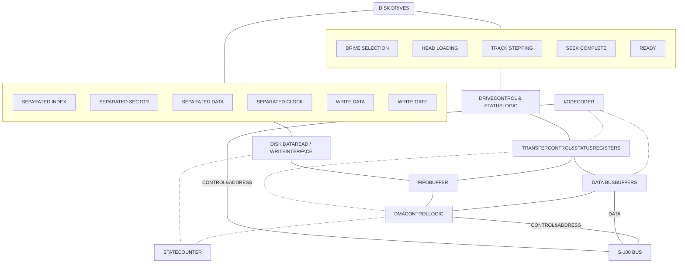

--- --- INDICATES CONTROL PATH

Fig. 7-0 Controller/Formatter Simplified Block Diagram

<page_number>2</page_number>

7-iv

Helios II

# SECTION 7 THEORY OF OPERATION

## 7.0 SCOPE

This section describes the operation of the Helios II hardware. For a discussion of software refer to the PTDOS manual. Discussion of details of operation is abandoned at the boundaries of the IC devices. For a discussion of the internal operation of integrated circuits, etc., refer to the device manuals published by the device manufacturers.<sup>\*</sup> For a discussion of the dual disk drives and their signal definitions, refer to Section 7.12, Diskette Drive, Theory of Operation. For a discussion of the 8080 microprocessor and its signal definitions, refer to the Intel manual, 8080 Microcomputer Systems User's Manual. For a discussion of the S-100 bus, refer to the Processor Technology manual, <u>Sol Systems Manual</u>. S-100 bus signals used by the controller are described briefly in Table 7-7. For a general overview of the Helios system, refer to Section 1, Introduction, and Fig. 1-1, Helios II System, Generalized Block Diagram.

## 7.1 GENERAL FUNCTIONAL DESCRIPTION OF THE Helios SYSTEM

Communication between the disks and the host computer can be thought of as being of two kinds: control, and data transfer. Data transfer and storage are the purposes of the floppy disk system. Control communication is the means by which data transfer is described and executed. In the Helios II system, data transfer is done via Direct Memory Access (DMA).

## 7.2 DISTRIBUTION OF FUNCTIONS

(Refer to Fig. 7-Ø, Controller/Formatter Simplified Block Diagram.)

Table 7-1, Distribution of Helios II Functions, lists the functions which must be performed by a floppy disk system, and indicates the parts of the system which are responsible for each.

Fig. 8-16, Pin-to-Pin Signal Flow Diagram, shows all the signals among the major subsystems, by name and pin number. It also shows the direction of travel of the signals and groups them by general functions such as clocks, controls, status, error reports and data.

Fig. 8-17, System Block Diagram, attempts to group the circuits found on the schematics into functional blocks. It groups signals by their connectors and their direction of travel in the system. It shows the major signals among the functional blocks within a PCB.

\* Note: Pin configurations for ICs used in the Helios are given in the Appendix, Section 9.

<page_number>2</page_number>

7-1

Helios II

Table 7-1 Distribution of Helios II Functions

<table>
  <thead>
    <tr>
        <th>FUNCTIONS:</th>
        <th>Software</th>
        <th>Controller</th>
        <th>Formatter</th>
        <th>Disk Drive</th>
    </tr>
  </thead>
  <tbody>
    <tr>
        <td>Disk insertion, retention, ejection</td>
        <td> </td>
        <td> </td>
        <td> </td>
        <td>X</td>
    </tr>
    <tr>
        <td>Disk rotation and speed control</td>
        <td> </td>
        <td> </td>
        <td> </td>
        <td>X</td>
    </tr>
    <tr>
        <td>Track selection (mechanical)</td>
        <td> </td>
        <td> </td>
        <td> </td>
        <td>X</td>
    </tr>
    <tr>
        <td>Head loading (mechanical)</td>
        <td> </td>
        <td> </td>
        <td> </td>
        <td>X</td>
    </tr>
    <tr>
        <td>Index and sector sensing (optical)</td>
        <td> </td>
        <td> </td>
        <td> </td>
        <td>X</td>
    </tr>
    <tr>
        <td>Index and sector separation</td>
        <td> </td>
        <td> </td>
        <td> </td>
        <td>X</td>
    </tr>
    <tr>
        <td>Clock and data recording (magnetic)</td>
        <td> </td>
        <td> </td>
        <td> </td>
        <td>X</td>
    </tr>
    <tr>
        <td>Clock and data reading (magnetic)</td>
        <td> </td>
        <td> </td>
        <td> </td>
        <td>X</td>
    </tr>
    <tr>
        <td>Clock and data separation</td>
        <td> </td>
        <td> </td>
        <td> </td>
        <td>X</td>
    </tr>
    <tr>
        <td>Read data conditioning</td>
        <td> </td>
        <td> </td>
        <td>X</td>
        <td> </td>
    </tr>
    <tr>
        <td>Read clock conditioning</td>
        <td> </td>
        <td> </td>
        <td>X</td>
        <td> </td>
    </tr>
    <tr>
        <td>Sector control</td>
        <td> </td>
        <td> </td>
        <td>X</td>
        <td> </td>
    </tr>
    <tr>
        <td>Format control</td>
        <td> </td>
        <td> </td>
        <td>X</td>
        <td> </td>
    </tr>
    <tr>
        <td>Write signal generation</td>
        <td> </td>
        <td> </td>
        <td>X</td>
        <td> </td>
    </tr>
    <tr>
        <td>Redundancy checking</td>
        <td> </td>
        <td> </td>
        <td>X</td>
        <td> </td>
    </tr>
    <tr>
        <td>Interfacing to CPU (Via I/O Port)</td>
        <td> </td>
        <td>X</td>
        <td> </td>
        <td> </td>
    </tr>
    <tr>
        <td>Interfacing to memory (Via DMA)</td>
        <td> </td>
        <td>X</td>
        <td> </td>
        <td> </td>
    </tr>
    <tr>
        <td>Transfer address storage and counting</td>
        <td> </td>
        <td>X</td>
        <td> </td>
        <td> </td>
    </tr>
    <tr>
        <td>Transfer length storage and counting</td>
        <td> </td>
        <td>X</td>
        <td> </td>
        <td> </td>
    </tr>
    <tr>
        <td>Disk Drive Selection and Control</td>
        <td> </td>
        <td>X</td>
        <td> </td>
        <td> </td>
    </tr>
    <tr>
        <td>Write clock generation</td>
        <td> </td>
        <td>X</td>
        <td> </td>
        <td> </td>
    </tr>
    <tr>
        <td>Ready reporting</td>
        <td> </td>
        <td>X</td>
        <td> </td>
        <td>X</td>
    </tr>
    <tr>
        <td>Error reporting</td>
        <td> </td>
        <td>X</td>
        <td>X</td>
        <td> </td>
    </tr>
    <tr>
        <td>Data buffering</td>
        <td> </td>
        <td>X</td>
        <td> </td>
        <td> </td>
    </tr>
    <tr>
        <td>Serial/Parallel and Parallel/Serial<br/>Conversion</td>
        <td> </td>
        <td>X</td>
        <td> </td>
        <td> </td>
    </tr>
    <tr>
        <td>Head load Management</td>
        <td>X</td>
        <td>X</td>
        <td> </td>
        <td> </td>
    </tr>
    <tr>
        <td>Track Management</td>
        <td>X</td>
        <td> </td>
        <td> </td>
        <td> </td>
    </tr>
    <tr>
        <td>Sector Management</td>
        <td>X</td>
        <td> </td>
        <td> </td>
        <td> </td>
    </tr>
  </tbody>
</table>

<page_number>2</page_number>

7-2

Helios II

# 7.3 COMPUTER I/O PORTS ASSIGNED TO TRANSFER AND CONTROL OF TRANSFER

Control communication for DMA transfers is done via input and output commands addressed to ports FØ through F7. No other S-100 devices in the system may use ports numbered FØ through F7. Refer to Table 7-2, Input/Output Port Assignments.<sup>\*</sup>

To transfer data the CPU must describe the transfer via the various output ports, execute the transfer via port F1, and periodically examine the progress of the transfer by input via port FØ until it is judged to be complete, or defective.

Ports F3 and F4 are used to output 16 bits (only 12 used) which specify the number of bytes in the transfer. Ports F5 and F6 are used to output 16 bits which specify the starting address of memory to be used in the transfer. Port F7 is used to output control bits to the disk drives. These bits specify unit selection, head loading, and track selection. Port F1 defines the transfer as read (from disk) or write (to disk), and as header (identification) or data block (the data itself). Port F1 also defines when or whether to execute the transfer. Tables 7-3 through 7-5 show the bit assignments for ports FØ, F1 and F7.

### TERMINOLOGY NOTE

The term "binary" is used to signify a flipflop. "FF" is an abbreviation of "flipflop."

The term "DMA controller" means those portions of the controller logic which have been identified as "DMA transfer" and "hold sequence" logic.

"Disk drive" is taken to mean "diskette drive." Similarly, "diskette" is sometimes referred to as "disk."

\*For test purposes, primarily, individual controllers can be jumpered to respond to ports EØ through E7 instead.

<page_number>2</page_number>

7-3

Helios II

Table 7-2 Input/Output Port Configuration

<table>
  <thead>
    <tr>
        <th><u>PORT #</u></th>
        <th><u>FUNCTION</u></th>
        <th><u>DIRECTION RELATIVE<br/>TO COMPUTER</u></th>
    </tr>
  </thead>
  <tbody>
    <tr>
        <td>FØ</td>
        <td>Status</td>
        <td>Input</td>
    </tr>
    <tr>
        <td>Fl</td>
        <td>Transfer command</td>
        <td>Output</td>
    </tr>
    <tr>
        <td>F2</td>
        <td>Spare</td>
        <td>-</td>
    </tr>
    <tr>
        <td>F3</td>
        <td>Transfer length, low order byte</td>
        <td>Output</td>
    </tr>
    <tr>
        <td>F4</td>
        <td>Transfer length, high order byte</td>
        <td>Output</td>
    </tr>
    <tr>
        <td>F5</td>
        <td>Transfer address, low order byte;<br/>clears the status register</td>
        <td>Output</td>
    </tr>
    <tr>
        <td>F6</td>
        <td>Transfer address, high order byte</td>
        <td>Output</td>
    </tr>
    <tr>
        <td>F7</td>
        <td>Drive Command</td>
        <td>Output</td>
    </tr>
  </tbody>
</table>

Table 7-3 Port FØ Status Bit Assignments

<table>
  <thead>
    <tr>
        <th><u>BIT</u></th>
        <th><u><u>SIGNAL NAME</u></u></th>
        <th><u>ACTIVE<br/>STATE</u></th>
        <th><u>SIGNIFICANCE</u></th>
    </tr>
  </thead>
  <tbody>
    <tr>
        <td>[no]</td>
        <td>TC</td>
        <td>high</td>
        <td>= transfer complete</td>
    </tr>
    <tr>
        <td>1</td>
        <td>SREADY</td>
        <td>high</td>
        <td>= ready</td>
    </tr>
    <tr>
        <td>2</td>
        <td>ABORT</td>
        <td>high</td>
        <td>= error</td>
    </tr>
    <tr>
        <td>3</td>
        <td>CRC ERROR</td>
        <td>high</td>
        <td>= error</td>
    </tr>
    <tr>
        <td>4</td>
        <td>CRC CHECKED</td>
        <td>high</td>
        <td>= check complete</td>
    </tr>
    <tr>
        <td>5</td>
        <td>DISK READY</td>
        <td>low</td>
        <td>= ready</td>
    </tr>
    <tr>
        <td>6</td>
        <td>SEEK COMPLETE</td>
        <td>low</td>
        <td>= done</td>
    </tr>
    <tr>
        <td>7</td>
        <td>INDEX</td>
        <td>low</td>
        <td>= index hole present</td>
    </tr>
  </tbody>
</table>

Table 7-4 Port Fl Transfer Command Bit Assignments

<table>
  <thead>
    <tr>
        <th><u>BIT</u></th>
        <th><u>SIGNAL NAME</u></th>
        <th><u>ACTIVE<br/>STATE</u></th>
        <th><u>SIGNIFICANCE</u></th>
    </tr>
  </thead>
  <tbody>
    <tr>
        <td>[no]</td>
        <td><u>ERASE</u></td>
        <td>low</td>
        <td>= erase</td>
    </tr>
    <tr>
        <td rowspan="2">1</td>
        <td rowspan="2"><u>R/W</u></td>
        <td>high</td>
        <td>= read</td>
    </tr>
    <tr>
        <td>low</td>
        <td>= write</td>
    </tr>
    <tr>
        <td rowspan="2">2</td>
        <td rowspan="2"><u>TR DATA</u></td>
        <td>high</td>
        <td>= header</td>
    </tr>
    <tr>
        <td>low</td>
        <td>= data</td>
    </tr>
    <tr>
        <td>4</td>
        <td rowspan="4">Don't care, ever</td>
        <td rowspan="4"> </td>
        <td rowspan="4"> </td>
    </tr>
    <tr>
        <td>5</td>
    </tr>
    <tr>
        <td>6</td>
    </tr>
    <tr>
        <td>7</td>
    </tr>
  </tbody>
</table>

<page_number>2</page_number>

7-4

Helios II

# Table 7-5 Port F7 Drive Command Register Bit Assignments

<table>
  <thead>
    <tr>
        <th>BIT</th>
        <th>SIGNAL NAME</th>
        <th>ACTIVE STATE</th>
        <th>SIGNIFICANCE</th>
    </tr>
  </thead>
  <tbody>
    <tr>
        <td rowspan="2">[no]</td>
        <td rowspan="2"><u>STEP</u></td>
        <td>low =</td>
        <td>Do step</td>
    </tr>
    <tr>
        <td>high =</td>
        <td>Do not step.</td>
    </tr>
    <tr>
        <td rowspan="2">1</td>
        <td rowspan="2"><u>INWARD</u></td>
        <td>low =</td>
        <td>away from track Ø</td>
    </tr>
    <tr>
        <td>high =</td>
        <td>toward track Ø.</td>
    </tr>
    <tr>
        <td rowspan="2">2</td>
        <td rowspan="2"><u>DRIVE SELECT I</u></td>
        <td>low =</td>
        <td>select unit 2, 3, 6, or 7</td>
    </tr>
    <tr>
        <td>high =</td>
        <td>select unit Ø, 1, 4 or 5</td>
    </tr>
    <tr>
        <td rowspan="2">3</td>
        <td rowspan="2"><u>DRIVE SELECT 2</u></td>
        <td>low =</td>
        <td>select unit 4, 5, 6, or 7<br/>(cabinet 2)</td>
    </tr>
    <tr>
        <td>high =</td>
        <td>select drive Ø (units Ø &amp; 1)<br/>and drive 1 (units 2 &amp; 3)<br/>(the drives in cabinet 1)</td>
    </tr>
    <tr>
        <td rowspan="2">4</td>
        <td rowspan="2"><u>RESTORE</u></td>
        <td>low =</td>
        <td>go to track Ø</td>
    </tr>
    <tr>
        <td>high =</td>
        <td>not active</td>
    </tr>
    <tr>
        <td rowspan="2">5</td>
        <td rowspan="2"><u>LOAD HEAD Ø</u></td>
        <td>low =</td>
        <td>load head of unit 0, 2,<br/>4 or 6</td>
    </tr>
    <tr>
        <td>high =</td>
        <td>not active</td>
    </tr>
    <tr>
        <td rowspan="2">6</td>
        <td rowspan="2"><u>LOAD HEAD 1</u></td>
        <td>low =</td>
        <td>load head of unit 1, 3,<br/>5, or 7</td>
    </tr>
    <tr>
        <td>high =</td>
        <td>not active</td>
    </tr>
    <tr>
        <td rowspan="2">7</td>
        <td rowspan="2"><u>SELECT DISK I</u></td>
        <td>low =</td>
        <td>select units 1, 3, 5 or 7</td>
    </tr>
    <tr>
        <td>high =</td>
        <td>select unit 0, 2, 4 or 6</td>
    </tr>
  </tbody>
</table>

<page_number>2</page_number>

7-5

Helios II

# 7.4 DISK RECORDING FORMAT

## 7.4.1 OVERVIEW

(Refer to Figs. 7-1, 7-2, and 7-3.)
Helios II uses a combination of hard sectoring and soft sectoring techniques to provide a recording format with variable block length and optimum utilization of disk capacity.

There are 77 tracks per disk. Each recorded block lies entirely within a single track.

Data is recorded on the disk in 8-bit bytes serially by bit, at a rate of 250K bits/second, the most significant bit first. The recording technique consists of a stream of clock pulses combined with data pulses which are written midway between clock pulses. A binary $\emptyset$ is represented by a pair of clock pulses with no data pulse between them. A binary 1 is represented by a pair of clock pulses with a data pulse at the midpoint. The clock pulses are normally written continuously since they are used for synchronization at the bit level. Missing clocks are not a normal occurrence, but are intentionally created to help identify the various parts of a block recorded on the disk. Refer to Fig. 7.2 and 7.3.

There are 32 "hard sector marks"<sup>\*</sup> per revolution of the disk. There is one index mark which lies midway between two of the hard sector marks. The hard sector mark immediately after the index mark is sector mark $\emptyset$.

Only 16 of the hard sector marks are used. These are the alternate ones, starting with sector mark $\emptyset$. These 16 are numbered $\emptyset$ through 15. The other 16 are completely ignored.

A block is a recording of data prefixed by some identification. All recording is done in blocks. A block always begins on a sector mark and always ends on a sector mark. Its length may be as short as 1 sector mark interval (1/16 revolution) or as long as 13 sector mark intervals.

Blocks may begin on any sector mark and may end on any sector mark, but must observe the following rule: No block may cross sector mark $\emptyset$. Stated another way, sector mark zero must be the start of some block, and the end of some block.

Each sector as yet unrecorded with data is primitively formatted by the system into blocks one sector interval long. The optimum packing scheme available to the software (highest density) is two blocks per track each 8 sectors long.

## 7.4.2 FORMAT WITHIN A BLOCK

(Refer to Fig. 7-1, Format Within A Block.)

A block is made up of 5 parts. These are: preamble of header (16 bytes), header (16 bytes), preamble of data (16 bytes), data (variable length), and postamble (variable length). The

\* "Hard Sector mark" means physical holes are formed in the diskette to provide a reference for the electro-optics.

<page_number>2</page_number>

7-6

Helios II

Timing diagram showing the format within a block, including signals for SECTOR, RSECT, CROSSOVER, TEXT (with Preamble Header, Header Text 16 Bytes, Preamble Data, Text Data 256 Bytes+3, and Postamble 19 Bytes), DATA, DONE, SYNC(BYTE), and CRC.

Fig. 7-1 Format within A Block

***

Timing diagram showing the normal stream of clock and data, with signals for UNSEPARATED (CLOCK AND WRITE DATA), CLOCK (showing 4 µsec pulses), and DATA (showing bit cells with values 0, 0, 1, 0, 0, 1).

Fig. 7-2 Normal Stream of Clock/Data

***

Timing diagram for a Unique Sync Byte, showing signals for UNSEPARATED, CLOCK, DATA, MISSING CLOCK, and RMC. It highlights a missing clock pulse and notes that the missing clock must be surrounded by data ones.

Fig. 7-3 Unique Sync Byte

<page_number>7-7</page_number>

Helios II

data part contains the actual memory image. The header contains identification and other information about the data. The post-amble is whatever is left over before the next sync mark.

"Sync mark" is described in the following paragraphs.

Starting at a sector mark the preamble of header is 15 bytes recorded as zeros, followed by 1 sync byte. The header is recorded as 13 bytes of ID., 2 bytes of CRC, and 1 sync byte. The preamble of data is recorded as 11 bytes of zeros before CROSSOVER, 4 bytes of zeroes after CROSSOVER, and 1 sync byte. Data is recorded as a variable number of bytes followed by 2 bytes of CRC and one sync byte. The postamble is recorded as zeros until the next sector mark.

The pulses of the signal SYNC (sync mark) in Fig. 7-1, Format Within A Block, are generated by single bytes which mark the boundaries of the various parts of a block. These bytes contain the data FE<sub>16</sub> and are made unique by suppressing the second of the 8 clocks which normally accompany a byte. (Refer to Fig. 7-2, Normal Stream of Clock/Data and Fig. 7-3, Unique Sync Byte.)

<page_number>2</page_number>

7-8

Helios II

### 7.4.3 PROVISIONS FOR VARIATIONS IN DISK SPEED

A block is written in two sections; these parts are written at two different times. The boundaries between these two recordings are called crossovers. Within each recording, clocks and data bits are recorded continuously in a coherent pattern. At each crossover there will be a discontinuity due to variations in disk rotary speed at the times the crossovers occur. At each such discontinuity, the circuitry which separates clock and data will lose synchronism. The Preambles provide time for this circuitry to regain synchronism, and as a tolerance for variation in disk rotary speed and sector detector timing.

### 7.5 CYCLICAL REDUNDANCY CHECKING

Cyclical redundancy checking is a technique for detecting errors in the recorded data as they are read. Helios II provides cyclical redundancy checking in hardware. The pulses marked CRC in Fig. 7-1, Format within a Block, are 2 bytes where the redundancy data is recorded.

### 7.6 SIGNAL FLOW AND SIGNAL IDENTIFICATION IN THE Helios SYSTEM

For an overall picture of the signal flow in the Helios system, refer to Fig. 8-16, Pin-to-Pin Signal Flow Diagram. For numerical pin-to-pin assignments between the controller and formatter, see Table 8-1. For numerical pin-to-pin assignments among the controller, drive and indicator panel, see Table 8-2. For numerical pin-to-pin assignments and functional descriptions of signal between the controller and the S-100 backplane, see Table 7-7. For functional block diagrams of the controller/formatter, see Figs. 7-0 and 8-17. Schematic diagram for the controller, formatter, indicator panel and regulator PCBs are in Section 8, Drawings. Schematic diagrams for PCBs internal to the diskette drive assembly are in the <u>Helios II Service Manual.</u>

### 7.7 GENERAL DESCRIPTION OF CONTROLLER FUNCTIONS

(Refer to Fig. 7-0, Controller/Formatter Block Diagram and Fig. 8-11, Controller PCB, Schematic.)

The controller is the heart of the Helios system and acts as a processor taking over control of the S-100 bus to transfer data directly to/or from memory (although in close coordination with the CPU). This not only provides for fast loading and unloading of the memory but also leaves the CPU free for other tasks, by buffering the relatively slow moving diskette drive.

### 7.7.1 CLOCKS

The Clock Generator/Multiplexer on the block diagram represents the functions of the controller clock circuitry.

Helios II uses the S-100 Phase 2 clock ($\Phi$2) when writing on diskette, and uses a clock signal resulting from reading the disk (RCLOCK) at other times. $\overline{\text{RCLOCK}}$ has a period of about 4 $\mu$s, but varies with disk rotary speed. $\Phi$2 has a period of .5 $\mu$s (crystal controlled) and is counted by a modulo-8 counter and

<page_number>2</page_number>

7-9

Helios II

and decoded into 4 signals called <u>CLOCK Ø</u>, <u>CLOCK 2</u> and <u>CLOCK 4</u>. These signals are .5 μs pulses at 1 μs intervals. Each has a repetition period of 4 μs.

The clock multiplexer selects either <u>RCLOCK</u> or <u>CLOCK 4</u> to produce MAIN CLOCK. RCLOCK originates on the formatter PCB. (Refer to 7.8.1, Data and Clock Conditioners.)

## 7.7.2 I/O PORT DECODER

The I/O Port Decoder on the block diagram represents the functions of I/O Port Decoder logic and circuitry.

I/O instructions controlling data transfers is done by input/output. The necessary ports are decoded here. Seven outputs of this decoder activate various data connections as requested. We will examine these. For port assignments refer to Table 7-2, I/O Port Configuration.

F7 - The DISK COMMAND STROBE causes control information destined for the disk drives to be taken from the DO bus, and latched into the disk command register. Disk command buffers drive the lines of the disk control cables between Controller P2 and the diskette drive P1.

F6 - The INITIAL ADDRESS, HIGH ORDER BYTE STROBE causes the high half of the initial address to be taken from the DO bus and latched into the high half of the address counter.

The initial address is the first address to be used in a forthcoming transfer of data.

F5 - The INITIAL ADDRESS, LOW ORDER BYTE STROBE causes the low half of the initial address to be taken from the DO bus and latched into the low half of the address counter.

F4 - The TRANSFER LENGTH, HIGH ORDER BYTE STROBE causes the high 4 bits of the transfer length to be taken from the DO bus and latched into the transfer length counter. The transfer length is the number of bytes to be moved in such a transfer.

F3 - The TRANSFER LENGTH, LOW ORDER BYTE STROBE causes the low 8 bits of the transfer length to be taken from the DO bus and latched into the transfer length counter.

F1 - The TRANSFER COMMAND STROBE causes the transfer command (4 bits) to be taken from the DO bus and latched into the transfer command register. The transfer command causes the transfer of data to occur. All the other ports merely describe features of a transfer.

FØ - The STATUS REPORT STROBE causes the 8 status bits to be enabled onto the DI bus. This is an input to the CPU, while all the other ports are used as outputs. Four of the status bits which are reports on the progress of a DMA transfer are latched in the status register as they

<page_number>2</page_number>

7-10

Helios II

occur. This register is cleared by the INITIAL ADDRESS, LOW ORDER BYTE STROBE.

## 7.7.3 STATUS MULTIPLEXER

The status signals SELECTED HEAD LOADED and SELECTED DISK READY are selected by the Status Multiplexer. This selection is based on the disk command register bit SELECT DISK 1. This bit determines left/right selection within one dual drive.

The status signal SREADY means that the controller is ready.

## 7.7.4 DMA HOLD SEQUENCE LOGIC (DMA TRANSFER)

The DMA transfer logic controls the details of moving data between memory and disk. To perform such a transfer, the DMA controller, with permission from the CPU, suspends the operation of the CPU and puts itself in the place of the CPU, interacting with the S-100 bus as required to accomplish the appropriate memory operations.

DMA operations are done in bursts of about 12 bytes. The exact number varies, but 12 is typical. DMA operations proceed at 1.5 $\mu$s per byte.

## 7.7.5 FIFO DATA BUFFER

A FIFO data buffer (two 9403 ICs) performs the temporary storage and serial/parallel and parallel/serial conversions necessary to interface the serial-by-bit format of the disk to the byte burst format of the memory.

# 7.8 GENERAL DESCRIPTION OF FORMATTER FUNCTIONS

(Refer to Fig. 7-0, Controller/Formatter Block Diagram and Fig. 8-12, Formatter PCB, Schematic.)

## 7.8.1 DATA AND CLOCK CONDITIONERS

The signals -SEPARATED CLOCK and -SEPARATED DATA originate at the data separator in the selected disk drive. The data conditioner latches the data bits to form the signal RDATA and its inverse. The clock conditioner is a oneshot which extends each clock pulse to .9 $\mu$s. RCLOCK, P3, Pin 22 goes to the controller board where it passes through a multiplexer (except when writing) and returns to this board as MAIN CLOCK.

## 7.8.2 MISSING CLOCK DETECTOR

The missing clock detector monitors MAIN CLOCK for gaps and supplies the signal MISSING CLOCK if a MAIN CLOCK pulse is missing. MISSING CLOCK is a short pulse. RMC is a latched version of it. These signals are used for sync detection and CRC checking. MISSING CLOCK is ORed with SEPARATED CLOCK by the clock conditioner.

## 7.8.3 SYNC DETECTOR

The sync detector recognizes the special sync byte by examining every byte containing a missing clock. (Refer to Fig. 7-1,

<page_number>2</page_number>

7-11

Helios II

"Format Within a Block" and Fig. 7-3, "Unique Sync Byte.") It generates a signal called SYNC when a sync byte is found. It generates a signal called SYNC ERROR if a sync search exceeds its limit without finding a sync byte.

## 7.8.4 SECTOR/INDEX LOGIC

The signals -SEPARATED SECTOR and -SEPARATED INDEX originate in the selected disk drive. They are used by the sector reset logic to generate a formatter reset signal RSECT and an error report OVERINDEX.

## 7.8.5 STATE COUNTER LOGIC (Refer to Fig. 7-4, State Counter Logic.)

### A. <u>The State Counter</u>

Format is generated, interpreted and controlled by a 12 bit state counter. When writing on disk, this counter generates the format. When not writing, this counter uses the read signals to keep itself in step with the format passing the read head. If no head is loaded, if the head is off track, or no disk loaded, etc., the formatter is not be able to keep itself in step with read format. In such a case it is said to be "out of sync." The signal SYNC ERROR (from the Sync Detector) is a report of this.

The state counter is reset to its initial condition by RSECT at a sector mark.

The state counter is divided into 3 sections. The first of these is called the bit counter (BC). It counts 8 bits per byte. The second section is called the punctuation counter (PC). It counts the number of bytes in each section of a block. (The sections are: preamble of header, header, etc.) Sixteen is a typical number of bytes. The third section is called the construction counter (CC). It counts the 5 sections of a block.

### B. <u>The State Decoders and Jump Logic</u>

The state decoders and the jump logic generate the signals needed to control the variable features of the state counter, and generates the format signals needed by the rest of the formatter and by the controller.

## 7.8.6 CRC GENERATOR/DETECTOR AND WRITE MULTIPLEXER

The CRC generator and detector generates the two check bytes at the end of each message when writing, and makes the check on each message when reading.

The write multiplexer generates the write signal for the disk drives by selecting data bits, and clocks, and suppressing "missing clocks" in the correct sequence.

<page_number>2</page_number>

7-12

Helios II

<page_number>2</page_number>

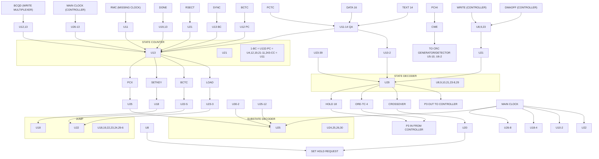

Fig. 7-4 State Counter Logic, Block Diagram

7-13

Helios II

# 7.9 DC POWER REQUIREMENTS

## 7.9.1 CONTROLLER PCB (Refer to Fig. 8-11, Controller PCB, Schematic.)

The controller power supply requires an unregulated DC voltage in the range 7.5 volts to 10 volts at 1.6 amps. The controller has 2 on-board regulators and a heat sink. It requires forced air cooling.

U54 and U55 are +5 volt integrated regulators. They supply two SEPARATE +5 volt lines which supply the various ICs in two groups.

> **CAUTION**
>
> Do not connect these two +5 volt lines together. To do so may overload one of the regulators, or may cause them to oscillate.

C8 is an electrolytic capacitor across the unregulated supply. It provides local energy storage to minimize the effects of any short disturbances on the unregulated supply and to prevent oscillation of the regulators.

C9 and C23 are electrolytic capacitors across the two regulated supplies. They provide regulation at high frequencies beyond the range of the regulators, and take part in preventing oscillation by the regulators.

The remaining capacitors across the power supplies are ceramic capacitors. They provide regulation at still higher frequencies which are beyond the effective range of electrolytic capacitors. They are distributed about the board so as to minimize the effects of inductance of the circuit traces as impedance common to more than one device.

## 7.9.2 FORMATTER PCB (Refer to Fig. 8-12, Formatter PCB, Schematic.)

The power supply of the formatter is similar to that of the controller. It requires only 0.6 amps, and has only 1 regulator. It requires no heat sink other than the board itself. Its unregulated supply may be obtained from the S-100 bus, or from the external supply connector P2. The formatter does not use any S-100 bus signals, and P2 makes it possible to mount it somewhere other than in an S-100 bus connector. (Refer to 3.5, Optional DC Power for Formatter PCB.)

<page_number>2</page_number>

7-14

Helios II

# 7.10 FUNCTIONAL CIRCUIT ANALYSIS OF THE CONTROLLER
(Refer to Fig. 8-11, Controller PCB Schematic and Fig. 8-17, System Block Diagram.)

## 7.10.1 COMMUNICATION OF CONTROL AND STATUS

### A. <u>Clock Generator/Multiplexer</u>

The clock signal $\Phi 2$ (S100-24) is inverted by the Schmidt trigger U7-4. This signal is counted by U5. The first three outputs of this counter repeat their pattern every eight counts. These eight states can be numbered $\emptyset$ through 7. U14 decodes states $\emptyset$, 2 and 4 to form the signals CLOCK $\emptyset$ at U14-12, CLOCK 2 at U14-11, and CLOCK 4 at U14-10. The two inverters (U6-12 and U6-10) provide delay to prevent decoding spikes at the outputs of U14.

RCLOCK (P3-22) originates in the formatter. It is derived from a clock signal read from disk. Multiplexer U11-4 selects and inverts CLOCK 4 when writing on disk, or RCLOCK when not writing, to form MAIN CLOCK. Buffer U9-5 drives P3-36 to send MAIN CLOCK to the formatter.

The clock signals just described are used throughout the system.

### B. <u>I/O Port Decoder</u>

1. Data transfer by Helios II is controlled by input and output operations addressed to ports F$\emptyset$ through F7. Refer to Table 7-2, I/O Port Configuration, for the details of these port assignments. U42 decodes 8 port strobe signals from the 3 lowest order S-100 address lines (U42 pins 1, 2 and 3) when allowed by enable signals (U42 pins 4, 5 and 6).

2. Address A3 (S-100 pin 31) drives U42-5, enabling U42 when low.

3. Address A4 (S-100 pin 30) is inverted by the Schmidt trigger U7-12, applied to selector pin EX and inverted again by inverter U6-6 whose output is applied to selector pin FX. Normally selector pin C will be jumpered to selector pin FX to chose ports F$\emptyset$ through F7. The user may chose to cause this board to respond to input and output to ports E$\emptyset$ through E7 by moving the jumper so that it connects selector pin C to selector pin EX. This makes it possible to operate two controllers in the same S-100 computer.<sup>\*</sup> Processor Technology software assumes the board is wired C to FX. Selector pin C drives U23-5 enabling if high. Address A5 (S100 pin 29) enables U23-4 if high. Address A6 (S100 pin 82) enables U23-1 if high. Address A7 (S100 pin 83) enables U23-2 if high. If all 4 inputs to the gate U23-6 are high, then U23-6 will be low, and will enable U42-4.

\*This feature can be used for test purposes. The present PTDOS cannot operate with 2 controllers. One controller handles up to 4 dual drives.

<page_number>2</page_number>

7-15

Helios II

4. The 5 inputs to U42 just discussed cause the selection of one or none of the 8 outputs. The activation or strobing of the output is done by the signal at U42-6. This signal is described next.

5. U8-6 is a 4-input andgate with inverted output. It has hysteresis inputs for noise immunity. U8-1 is driven by PDBIN, S-100 bus pin 78. U8-2 is driven by SINP, S-100 bus pin 46. SINP identifies an input cycle, and PDBIN describes the time during which input data is to be enabled to the DI bus. U8-5 is driven by <u>PHLDAR</u>. It is used here to prevent any port strobes from occurring as an unintended result of a DMA transfer. No input/output activity is intended during DMA transfers.

6. U8-4 is driven by $\Phi$2. In some machines, PDBIN and SINP deliver noise pulses due to crosstalk with other signals. Use of $\Phi$2 here suppresses this noise while allowing normal operation. This use of $\Phi$2 has caused malfunction in some systems using the Z80 microprocessor, and can be disabled by inserting U8 with pin 4 bent under so that it makes no connection.

When these 4 inputs are all high, U8-6 will be low.

7. U8-8 is a gate similar to U8-6. It produces output strobes. U8-9 is wired always enabled. U8-10 is driven by <u>PHLDAR</u> to prevent port strobes during DMA transfers. <u>PWR</u>, S-100 bus pin 77, is inverted by the hysteresis inverter U7-2, which in turn drives U8-12. SOUT, S-100 bus pin 45 drives U8-13.

When these 4 inputs are all high, U8-8 will be low.

8. U21-6 is an OR gate with inverted inputs. It is driven by U8-6 and U8-8. If either of these signals goes low, U21-6 will go high. U21-6 drives U42-6, the strobe input of the port decoder. Note that the port decoder does not distinguish between inputs and outputs. To avoid errors, the software sends inputs or outputs as are appropriate to the particular port assigned to the selected function.

## C. Internal Data Bus

The 8 bits of the S-100 data output bus DO-$\emptyset$ through DO-7 are copied onto an internal data bus by the 8 receivers of U47 and U48. This internal bus is used throughout the controller wherever access to DO bus data is needed.

## D. Disk Command Logic (Output Port F7)

1. The signal <u>DISK COMMAND</u> is produced by the I/O Port Decoder at U42-7. It is applied to the inverter input U6-3. The signal DISK COMMAND is produced at inverter output U6-4, and is applied to U21-1 enabling gate U21-3. If DO-$\emptyset$ (S-100 pin 95) is low, U21-2 is high, and a low pulse will occur at U21-3. This is applied to buffer

<page_number>7-16</page_number>

Helios II

input U46-12. Buffer output U46-11 produces the signal -STEP (P2-36). This is the step command to the disk drive.

2. The signal DISK COMMAND is also applied to the clock input U10-4 of a binary, and to the clock input U31-9 of a 6 bit latch. These 7 binaries make up the disk command register. The rising edge of the signal DISK COMMAND causes this register to store the 7 bits of data DO-1 through DO-7.

The meanings of these 7 bits are given in Table 7-5, Disk Command Register Bit Assignments.

3. The buffer U9-7 and the 6 buffers of U32 drive these signals onto 7 pins of P2. These 7 signals and -STEP all go to the disk drive. Refer to 7.12, Drive Theory of Operation, for the definitions of these signals. Note that PerSci documentation defines them as active low signals. Wherever these signals appear on Processor Technology documentation they are prefixed with a minus sign.

## E. <u>Address Counter</u> (Output Ports F6 and F7)

1. U24, U25, U26 and U27 form the address counter. A starting address can be loaded into the address counter in two halves by executing output instructions. OUT F5 is executed with the low order half in the accumulator. The processor executes an output operation, placing the accumulator contents on the DO BUS and F5 on the low half (also on the high half) of the address bus. The port decoder responds to these signals, as previously described, by producing a negative pulse at U42-10. The low half of the starting address appears on the internal data bus which drives the input pins of the address counter. U42-10 drives the parallel load inputs of the low half of the address counter (U24-11, U25-11) low, causing these two devices to store the 8 bits at their data inputs. This is the low half of the starting address. Execution of OUT F6 with the high half of the starting address in the accumulator, will store the high half of the starting address in U26 and U27.

2. When a DMA transfer is in progress, the address counter is incremented each time a byte is transferred. Its contents represent the memory address with which the DMA Controller is interchanging data.

3. During each hold sequence within a DMA transfer, the signal BUSTR causes the address drivers U43, U44, U45 and U46 to place the contents of the address counter on the address bus by forcing low their disable inputs (pins 1).

<page_number>2</page_number>

7-17

Helios II

# F. <u>Transfer Length Counter</u> (Output Ports F3 and F4)

1. U28, U29 and U30 form the transfer length counter. The length (in bytes) of a transfer being described is stored in this counter in two steps. This is done by the same method which stores the starting address in the address counter. OUT F3 and OUT F4 cause this transfer by producing a negative pulse at U42-12, and U42-11 respectively.

2. When a DMA transfer is in progress, the transfer length counter is decremented each time a byte is transferred. Its contents represent the number of bytes yet to be transferred.

3. U30-13 (zero count) is used by the DMA controller to determine whether more bytes are needed to complete the specified length of the transfer.

4. Note that the high order "half" of the transfer length consists of only 4 bits.

# G. <u>Transfer Command Register and Logic</u> (Output Port F1)

The ports described thus far are all output ports, and describe the features of a DMA transfer which may occur in the future. The remaining output port, F1, is the transfer command port. It causes transfers to happen.

## 1. <u>Input Selection and Outputs U22-10 and 12</u>

* a. U42-14 produces the transfer command strobe. U22 is the transfer command register. It is a 74LS298. It contains four 2-input multiplexers, each with an output latch. Latching occurs on the negative-going edge of the signal at pin 11. Input selection is controlled by pin 10.

* b. The register has been cleared to all outputs high. This signifies "do nothing." Pin 12 being high drives pin 10 high selecting the B-inputs. These are driven by the internal data bus. A transfer command port strobe on U42-14 drives U21-13 negative, causing U21-11 to drive U22-11 positive. When this strobe is REMOVED, the data present on the B-inputs will be latched to the outputs. Output pin 12 will copy DO bus bit 3 (DO 3) at one of its B-inputs. If anything is to happen, this bit will be LOW. (These 4 bits are all active low.) Pin 12 now drives pin 10 low which selects the A-inputs (pins 3, 4, 9 and 7). The 4 bits latched here represent a transfer pending. The transfer will actually happen at some later time when the disk has reached the correct rotary position.

* c. The binary U20-6 is clocked at pin 4 by MAIN CLOCK. It holds a slightly delayed copy of the signal of U22-12, which changes only on leading edges of MAINCLOCK.

<page_number>2</page_number>

7-18

Helios II

d. The signal CROSSOVER is a pulse which describes the times (disk positions) at which it is proper to start or stop writing on disk. All DMA transfers start and end at a CROSSOVER pulse. CROSSOVER originates on the formatter PC assembly, and comes to the controller at P3-30.

e. U19-4 is an andgate with inverted inputs. If a transfer is pending, U20-6 is low, enabling U19-6. Each low pulse on CROSSOVER at U19-5 causes a high pulse at U19-4 if U19-6 is low.

f. The signal DATA is low if the read/write head of the disk is in a header region and is high if the head is in a data block region. It originates on the formatter assembly, and comes to the controller at P3-16. It drives U40-9.

## 2. Output U22-13

a. U22-13 is the bit of the pending transfer command which determines whether the controller is to transfer a header or a data block. It is high for a header, low for a data block. It drives U40-10. U40-8 is an exclusive orgate. U40-8 will be high if both inputs indicate header, or if both indicate data; U40-8 will be low in the remaining 2 cases.

b. U18-6 is an andgate with inverted output. U18-6 will pulse low if U19-4 pulses high when U40-8 is high. U18-6 describes a crossover time at which a transfer is requested and the head is in the region described (header or data).

c. DMAOFF is a binary whose output is normally high. Its output is low for the time that a DMA transfer is occurring. DMAOFF is clocked by the trailing (rising) edge of CROSSOVER. The J and $\overline{\text{K}}$ inputs of DMAOFF (U20-14 and U20-13) are wired together and driven by U18-6. This is effectively a "type D" flipflop. The result is that DMAOFF is clocked high at every crossover except the selected one, at which time it is clocked low, and remains low until the next crossover.

d. The low pulse at U18-6 drives U21-12 low, causing a high pulse at U21-11. The trailing edge of this pulse causes the transfer command register to sample its A-inputs (all tied high) to its output latches. This amounts to a reset to all high. High at U22-12 means "do nothing." U22-12 drives U22-10 high returning selection to the inputs driven by the internal bus.

e. The negative pulse at U18-6 also enables U19-9. U-19-10 is an andgate with inverted inputs (U19-8, U19-9).

<page_number>7-19</page_number>

Helios II

## 3. <u>Output U22-14</u>

a. U19-8 is driven by U22-14, which is low if the pending transfer is to be a write to disk and is high if a read from disk is indicated. If low, the low pulse at U18-6 causes a high pulse at U19-10 (W) which drives U39-2 and U39-3. These 2 pins are the D input of a type D flipflop WRITE (U39-6). WRITE is clocked by the trailing (rising) edge of CROSSOVER. WRITE normally is clocked to a low at every crossover time, but is clocked to a high instead, if U19-10 is high as described above. Once high, it will remain high until the next crossover.

b. DMAOFF and WRITE and their complements $\overline{\text{DMAOFF}}$ and $\overline{\text{WRITE}}$ are used throughout the controller and formatter.

c. The low pulse of U18-6 is used to clear the FIFO (first in first out) memories (U52 and U53).

## 4. <u>Output U22-15</u>

U22-15 is the fourth and final bit of the transfer command register. It must be high (inactive) during normal transfer commands as described above. It is used alone to cause an entire track to be cleared and written to a primitive format. Its operation is described more fully at 7.10.2, K, The Erase Function.

All of the output ports have now been discussed.

## H. <u>Status Reporting (Input Port FØ)</u>

Port FØ is an input port. Execution of the command IN FØ will cause a low pulse at U42-15 (I/O Port Decoder). This drives low the disable inputs\* (the two #1 pins) of the status drivers (U50, U51), enabling them to drive the DI bus with the 8 bits of the controller status. The processor puts this status into the accumulator. These 8 bits contain the only reports from the disk and controller to the processor.

For the meanings of these bits refer to Table 7-3, Port FØ Status Bit Assignments.

Four of these 8 bits are latched by U33 of the Data Transfer Status Logic. Any output to port F5 clears this latch to all low.

## I. <u>Headload Timing</u>

1. The status strobe U42-15 drives U15-1 of the Drive Status Logic. This circuit is a one shot of approximately 1 second duration. Its inverted output U15-4 drives U32-15 low. This enables U32-11 and U32-13 to

\* These drivers have inverted inputs.

<page_number>2</page_number>

7-20

Helios II

load the heads if the disk drive is indicated by the appropriate bits in the disk command register U31.

2. A negative edge at U15-1 fires the oneshot, or renews its timeout to one second if already fired. The effect of this is to unload the heads if there is no activity at port F0 for 1 second or longer. This reduces head and disk wear without burdening the software with long timeouts.

In early revisions of the controller this function was performed by port F5.

3. C1, Q1, R7 and R8 are discrete components required to establish the 1 second timeout. The B and R inputs of this oneshot are not used, and are wired high.

## J. <u>Unit Head Selection</u>

U34 contains four 2-input multiplexers, two of which are unused. The signal -SELECTED DISK (U32-3) drives the select input (U34-1).

-LOAD HEAD 0 (U32-13) drives U34-10. -LOAD HEAD 1 (U32-11) drives U34-11. The appropriate one of these two signals is selected by the Drive Status multiplexer and delivered on U34-9. This line will be low when the selected head is loaded. It drives U15-9, the $\overline{\text{A}}$ input of the second oneshot in package U15. This oneshot fires on the leading edge of the selected head loaded signal, and remains on for approximately 40 ms. The B and R inputs are unused and are wired high. During this 40 ms, U15-12 is low and drives U10-11 low.

## K. <u>Read/Write Timing</u>

U10-11 is the $\overline{\text{S}}$ input of the SREADY FF of the Drive Status Timers. When it is low the FF is forced on, and its $\overline{\text{Q}}$ output (U10-9) is low. The J and K inputs (U10-14, U10-13) are wired low, and the $\overline{\text{R}}$ input is wired high so that the FF can be restored to its normal off state only by being clocked by a rising edge at U10-12. This pin is driven by the signal RSECT, the selected sector reset signal from the formatter. RSECT marks the beginning of a new block passing the read/write head.

The $\overline{\text{Q}}$ output of this FF, when low, holds the status bit SREADY low, indicating that the controller is not ready. This will occur for 40 ms following the start of selected head loaded, and will remain until the first RSECT occurring after the 40 ms. This circuitry relieves the software of the responsibility for the 40 ms head load timeout. The software merely awaits SREADY.

<page_number>2</page_number>

7-21

Helios II

# L. <u>Producing The Status Bits</u>

## 1. SREADY

SREADY is produced by gates U12-11 and U12-8 of the Data Transfer Status Register. Input U12-12 is driven by U10-9 as just discussed. Input U12-13 is driven low by U22-12, if a transfer has been requested but not started. If either of these is low, U12-11 will be low, driving U12-10 low. Input U12-9 is driven low by DMAOFF (U20-10 of the Transfer Command Logic), if a transfer is in progress. If either U12-10 or U12-9 is low, then SREADY (U12-8) will be low.

## 2. <u>SELECTED DRIVE READY</u>

The signal -READY 1 arrives from the disk drive on P2-6. It indicates that the right-hand (odd-numbered) unit in the selected disk drive is ready (low = ready). It drives U34-14.

The signal -READY 0 arrives from the disk drive on P2-22. It indicates that the left-hand (even-numbered) unit in the selected disk drive is ready. It drives U34-13 of the Drive Status Multiplexer.

-SELECT DISK 1 causes U34 to select the appropriate one of these two signals. The selected signal appears at U34-12, which drives U50-6 of the Status Read Driver. This line is the status bit <u>SELECTED DRIVE READY</u>.

## 3. SEEK COMPLETE

The signal -SEEK COMPLETE arrives from the disk drive on P2-10. It is delivered directly to the Status Read Driver U50-2. This line is the status bit <u>SEEK COMPLETE</u>. If low, it indicates that any requested track-seek operation (seek or restore) has been done.

## 4. SEPARATED INDEX

The signal -SEPARATED INDEX arrives from the disk drive on P2-8. It is delivered directly to U50-4. This line is the status bit SEPARATED INDEX. If low, it indicates that the selected disk is in the "index" reference position. This signal is called "separated" index because it originates mixed with sector, and has been separated into index and sector signals. Each dual drive has two index and sector optical pickups, but only 1 separator circuit. Therefore, separated index and separated sector may be invalid for 1 revolution after a change of selected unit. If you are attempting to design a software handler for this controller, beware.

<page_number>7-22</page_number>

Helios II

## M. <u>Pass-Through Signals on The Controller Board</u>
(Refer to Fig. 8-16, Pin-to-Pin Signal Flow Diagram.)

The signals -SEPARATED INDEX (P2-8), -SEPARATED DATA (P2-48), -SEPARATED CLOCK (P2-50), and -SEPARATED SECTOR (P2-20) arrive from the disk drive on the P2 pins cited, and drive pins of the same numbers in P3 of the controller which sends them to the formatter.

The signal -WRITE DATA arrives from the formatter on P3-38 and drives P2-38 which sends it to the disk drive.

## N. <u>Poweron Clear (Write Timing Control)</u>

The signal $\overline{\text{POC}}$ appears at S-100 bus pin 99. Its use varies somewhat depending on the host computer, but it normally represents a reset or a statement that power has just been turned on. The controller uses it to assure that no write or DMA operation is occurring and that none will be started until the software enables it. A low pulse on $\overline{\text{POC}}$ drives U39-15 low, resetting the $\overline{\text{PWR ON}}$ FF. U39-10 goes low and remains low until a transfer command strobe (port F1) occurs. This low pulse originates at U42-15 and drives U39-11 low setting $\overline{\text{PWR ON}}$. $\overline{\text{PWR ON}}$ low drives U39-1 low resetting the WRITE FF in the Transfer Command Logic (U39-6 goes low). It also drives U20-11 low, setting the DMAOFF FF (U20-10 goes high). $\overline{\text{PWR ON}}$ also drives several latches in the DMA circuitry (Hold Sequence Logic) which have not yet been described.

The principal risk to recorded data other than mechanical damage to the recording surface is the risk that the controller may write at the wrong place or time. The controller will not write unless the write FF is on.

> 

> CAUTION
>
> The circuitry just described assures that WRITE remains off starting with the $\overline{\text{POC}}$ signal, but does not provide protection during the time that power goes off. Therefore, it is advisable to remove disks before turning power off.

# 7.10.2 DMA TRANSFERS (Refer to Fig. 7-5A, DMA Transfer, the Process as Seen by the PTDOS.)

## A. <u>General Description of The DMA Transfer</u>

The previous paragraphs describe the circuitry which communicates control from and status to the central processor. The following describes the moving of data to and from memory.

Data transfers are done by direct memory access (DMA). This means that the data goes directly to and from memory under the direction of the controller without being handled or controlled by the central processor. The DMA controller takes

<page_number>2</page_number>

7-23

Helios II

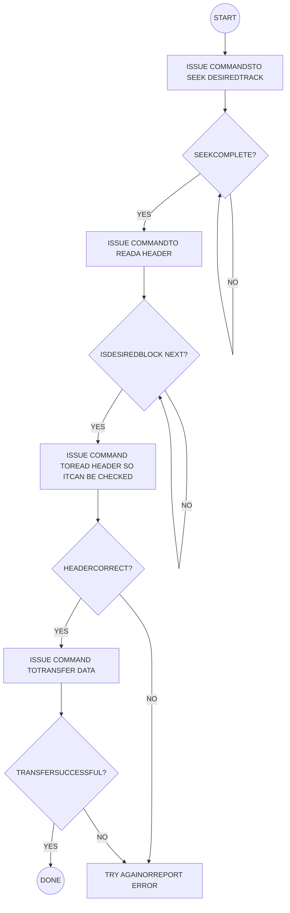

Fig. 7-5A DMA Transfer, The Process As Seen by The PTDOS

<page_number>2</page_number>

7-24

Helios II

possession of the bus, putting itself in the place of the central processor. The DMA controller logic is on the controller board with some outlying functions being done on the formatter.

Within the scope of Helios II, a DMA TRANSFER means the sequence of events which occurs to move data bytes specified by the software via OUT instructions. This data will always be a data block, or the header describing a data block. A DMA transfer consists of one or more hold sequences interspersed with periods of normal CPU activity. A HOLD SEQUENCE is the sequence of events which occurs when the DMA controller takes possession of the bus and moves a group of bytes to or from memory.

## B. <u>Timing of DMA Transfers And Transfer Request</u>

A typical hold sequence lasts for 20 µs and moves 12 bytes. After the hold sequence, the controller is inactive for a period typically about 370 µs. During this period the CPU resumes its normal activity.

A DMA transfer lasts for as much as 130 ms, depending on block length.

A DMA transfer is represented by the time that the signal DMAOFF is low. A hold transfer is represented by the time that the HOLD FF (U2-6) is high.

DMA transfers are begun and ended under software control and timed by disk position as previously described in 7.10.1, paragraphs I and following.

Individual requests for hold sequences are initiated by the signal <u>SET HOLD RQST</u>. This is generated on the formatter and arrives via P3-46. A low pulse here drives low U37-1 of the Hold Sequence Logic. This rests the FF <u>HOLD RQST</u>, causing its $\overline{Q}$ output (U37-7) to go high, and remain high. This signal is applied to U35-4, and to U1-13, the D-input of a type D binary called HRR.

$\Phi$2 (U6-8) drives the clock input of HRR (U1-9) sampling the hold request signal to HRR's output (U1-15). This signal represents a hold request, resynchronized to the $\Phi$2 clock. Its complement appears on U1-14.

## C. <u>Bus Access Status Indicators (Hold Sequence Logic)</u>

1. PHLDA is a S-100 bus signal appearing on S-100 pin 26. PHLDA high means that the processor has abandoned the bus signals to some other device (a DMA controller or alternate processor). PHLDA drives the D-input (U1-4) of the type D binary PHLDAR whose clock input (U1-9) is driven by $\Phi$2 (U6-8). PHLDAR is a slightly delayed version of PHLDA. (Refer to Table 7-7, S-100 Pins.)

2. PHLDAR low (U1-3 high) means that no DMA device has control of the bus. U1-3 high enables gates U8-6 and U8-8 of the I/O Port Decoder, making possible the port strobes described earlier. U1-3 if high, enables and-gate UØ-3, by driving input UØ-1 high.

<page_number>2</page_number>

7-25

Helios II

3. <u>PHOLD</u> is an S-100 bus signal by which DMA devices request control of the bus. It appears at S-100 pin 74. This signal drives UØ-2. If high it means that no DMA device is asking for the bus.

4. UØ-3 drives UØ-5 and UØ-10. The second inputs of these 2-input andgates are driven by HRR and $\overline{\text{HRR}}$. Andgate UØ-6 if high means: No DMA device has the bus, no DMA device has asked for the bus, and the controller does not want the bus.

## 5. <u>Controller's Priority of Bus Access</u>

Andgate UØ-6 drives a single wire connector (J4) at the top edge of the board. It is labeled PRIORITY OUT and is intended to be the beginning of a priority chain establishing an order of priority among DMA devices. Note that this board has no PRIORITY IN connector. As the executive device of the operating system it demands first priority. This will not usually be a problem to other DMA devices since this device takes control for 5% of the time or less and does so only for about 20 $\mu$s at a time. This controller will not demand that another DMA device give up control once that device has established control. If another device keeps control for long periods of time it may cause individual DMA transfers by this controller to abort. The operating system will normally be able to recover from such errors, but caution is advisable.

6. UØ-8 of the Hold Sequence Logic, if high, means that no DMA device has control of the bus, no DMA device has asked for control of the bus, and "this" controller wants control of the bus.

## D. <u>Controller Requests Bus</u>

UØ-8 drives the J input (U2-2) of the HOLD FF of the Hold Sequence Logic. HRR (U1-15) drives the $\overline{\text{K}}$ input (U2-3) of the HOLD binary. $\Phi$2 drives the clock input (U2-4) of the HOLD binary. Therefore, HOLD will come on at the first trailing edge of $\Phi$2 after HRR rises, provided that no other device has control of the bus or has requested control by pulling down <u>PHOLD</u>. Other DMA devices should lower <u>PHOLD</u> only at the trailing edge of $\Phi$2.

The S and R inputs of the Hold binary are unused and are wired high. <u>HOLD</u> (U2-7) drives the disable input (U41-15) and the signal input (U41-14) of the <u>PHOLD</u> driver, whose output (U41-13) drives <u>PHOLD</u>. When <u>HOLD</u> is high this board will drive <u>PHOLD</u> low. When <u>HOLD</u> is low, this board will release <u>PHOLD</u> to the third state (open circuit).

<u>HOLD</u> also drives U3-2, the input of a non-inverting driver whose output (U3-3) drives P3-18 providing the signal <u>HOLD</u> to the formatter.

<page_number>2</page_number>

7-26

Helios II

HOLD (U2-6) drives U36-10. This resets a latch when low, and allows it to operate when high.

## E. <u>Generation And Function of BUSTR</u>

HOLD drives UØ-12, the input of an andgate. The output of this gate (UØ-11) will be high when both HOLD and PHLDAR are high. This signal drives the D-input (U1-5) of the FF BUSTR. The clock input of BUSTR (U1-9) is driven by $\phi$2. The output (U1-7) of BUSTR is (HOLD and PHLDAR) delayed until $\phi$2 rises.

BUSTR is the signal which executes the bus transfer. It drives so many inputs that fanout drivers are used. U40-3 and U40-11 are inverting fanout drivers made from exclusive-OR gates. These devices generate two equivalent signals which drive many three-state driver disable inputs. Their effect is to cause the S-100 drivers of the CPU to release the bus lines, and the drivers on the controller to seize them.

BUSTR drives the reset input (U37-15) of the FF DNSYNC. When BUSTR is low, DNSYNC is held reset. When BUSTR is high, DNSYNC is released to function normally.

BUSTR also drives U35-3. This is an input of a three-input andgate with inverted output.

## F. <u>PSYNC Originated to Begin Hold Transfer</u>

At the rise of BUSTR, DNSYNC is high and drives U35-5 high. U35-4 is held high by U37-7. All 3 inputs now being high, U35-6 goes low. This signal is $\overline{\text{DMASYNC}}$. It drives the inputs (U18-12, U18-13) of a gate wired as an inverter. Its output (U18-11) is DMASYNC. It is applied to U43-14, the input of a three-state driver, whose output (U43-13) drives the S-100 bus signal PSYNC (S-100 pin 76). U18-11 also drives the J-input of DNSYNC (U37-14).

The clock input of DNSYNC (U37-12) is driven by $\phi$2. When DMASYNC is high, DNSYNC will be low, and its K-input will be high. The first $\phi$2 leading edge will clock DNSYNC (U37-10) high, and DNSYNC (U37-9) low. This will lower U35-5 and force DMASYNC low.

## G. <u>The Hold Transfer Cycle</u> (Refer to Fig. 7-5B, Single Byte DMA Hold Transfer Cycle, Flow Chart.)

### 1. <u>The SYNC Phase</u>

Thus PSYNC has been applied to the bus and removed announcing the start of a normal cycle which is intended to transfer one byte.<sup>\*</sup> DNSYNC will remain high holding PSYNC low until the cycle is complete.

\*PSYNC is active high.

<page_number>2</page_number>

7-27

Helios II

INITIATED BY SOFTWARE
OUT FI

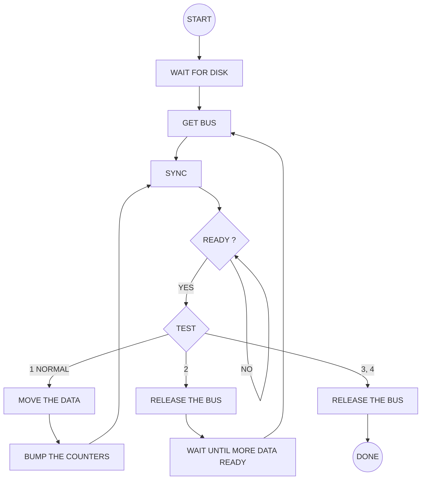

Fig. 7-5B Single Byte DMA Transfer Cycle

<page_number>7-28</page_number>

Helios II

## 2. <u>The Ready Phase</u>

U23-8 of the Hold Sequence Logic is a four-input and-gate with inverted output. It has hysteresis inputs for noise immunity. Input U23-12 is driven by S-100 pin 3, XRDY. Input U23-13 is driven by S-100 pin 72, PRDY. Input U23-9 is driven by DNSYNC. If U23-10 is high, a high on DNSYNC samples the ready lines, producing a low at U23-8 if both ready lines are ready (high).

## 3. <u>The Test Phase</u>

a. U23-8 drives U38-12, the D-input of the type D binary <u>TEST</u>, whose clock-input (U38-9) is driven by $\Phi$2. <u>TEST</u> (U38-10) is normally high, becoming low on the first $\Phi$2 trailing edge after DNSYNC has risen and the ready lines are high.

b. <u>TEST</u> drives U36-1. If low, U36-3 will be low, driving U23-10 low which raises U23-8. <u>TEST</u> will be clocked high at the next $\Phi$2 trailing edge. <u>TEST</u> can remain low for only one $\Phi$2 period at a time.

c. <u>TEST</u> drives the <u>enable</u> input U16-1 of a decoder which tests the states of two signals. The first of these signals, appearing at U16-2, indicates the readiness of the FIFO buffer memory to provide data or space for the byte to be transferred. A low indicates ready.

d. The second signal indicates whether the requested number of bytes has already been transferred. A low indicates completion. The negative pulse at U16-1 will result in a similar negative pulse at one of the 4 outputs of this decoder, the selection being determined by the states of the two inputs. Whichever one of these outputs is active will result in a permutation of the basic cycle. (Refer to Fig.7-5B, the decision block "test.") We will now examine these 4 cases individually.

## H. <u>Types of Hold Transfer Cycles</u>

(Refer to Fig. 7-6, Hold Transfer Cycle, Timing Diagram.)

1. <u>The Normal Cycle</u> (Refer to Fig. 7-5B, branching condition 1 at the TEST decision block.)

Only this first version of the cycle results in the transfer of a byte.

a. The normal case is described by FIFO ready (U16-2 low) and count not complete (U16-3 high). This will produce a low pulse at U16-6. This will result in the transfer of 1 byte, and the repeating of the cycle.

<page_number>2</page_number>

7-29

Helios II

Timing diagram showing the Hold Transfer Cycle with signals Φ2, HOLD, PHLDA, PHLDAR, BUST(UØ-II), BUSTR, DMASYNC, DNSYNC, TEST, NORMAL, NORMALR, BUMP, PWR, ADDRESSES (AØ-15), COUNT COMPLETE (U16-3, RC), HOLD RQST, and RESET HOLD REQUEST. The diagram illustrates the timing relationship between these signals during 1st byte transfers and 2nd/3rd/4th type transfers, ending the hold sequence.

Fig. 7-6 Hold Transfer Cycle, Timing Diagram

<page_number>2</page_number>

7-30

Helios II

b. U16-6 drives the D-inputs of 2 type-D binaries, NORMALR and BUMP. The clock input of NORMALR is driven by $\Phi$2. The clock input of BUMP is driven by $\Phi$2.

c. U16-6 is a negative pulse of duration equal to one $\Phi$2 period. It begins and ends on $\Phi$2 trailing edges. NORMALR is identical but delayed, changing on $\Phi$2 leading edges. BUMP is identical but delayed more. It changes on $\Phi$2 trailing edges, being delayed by 1 full cycle.

d. NORMALR (U1-11) and BUMP (U38-15) are applied to the inputs of a gate (U18-9, U18-10). Its output (U18-11) will be low when both inputs are high. This is the first part of NORMALR before BUMP has started. It corresponds to a single high pulse of $\Phi$2. This low pulse is the data strobe. When delivering data to memory, it provides PWR. When getting data from memory, it provides the parallel load pulse which moves a byte into the top of the FIFO buffer memory.

e. U18-8 drives U13-13. This is an input to a two-input multiplexer. The alternate input (13-14) is wired inactive (high). Selection is determined by WRITE applied to U13-1. U13-15 is wired enabled (low). Output U13-12 is applied to U44-12, the input of a three-state driver whose output (U44-11) drives PWR (S-100 pin 77). PWR will be driven low during the data strobe when writing to memory (reading from disk).

f. U18-8 drives U11-5. This is an input to a two-input multiplexer. The alternate input (U11-6) is wired inactive (high). Selection is determined by WRITE applied to U11-1. U11-15 is wired enabled (low). The output of this multiplexer is an inverter. The output (U11-7) drives the PL-inputs of both FIFO buffer memories (U52-2, U53-2). PL will normally be low, and will be pulsed high by the data strobe.

g. NORMALR (U1-10) drives the clock-inputs of the address counter. These are U24-14, U25-14, U26-14 and U27-14. Counting occurs on the trailing edge. The address counter counts upward since Pin 5 of each stage is wired low.

h. BUMP (U38-14) drives the clock-input (U28-14) of the transfer length counter. Counting occurs on the leading edge. The counter counts downward since pin 5 of each stage is wired high. The terminal carry of this counter (U30-13) drives U16-3 providing the signal which indicates completion of the requested number of bytes. This signal will be low (completed) only if all bits of the counter are zero, and BUMP is low.

<page_number>2</page_number>

7-31

Helios II

i. BUMP (U38-15), if low holds U36-2 low which holds U36-3 low which drives U23-10 low, preventing a new TEST pulse. BUMP drives the K input (U37-13) of DNSYNC. The $\Phi$2 leading edge during BUMP clocks DNSYNC off, raising U37-9, and enabling the start of a new DMASYNC.

j. During read (from disk), BUMP which drives U13-6, is selected by the multiplexer U13-7 to drive the FIFO TOP (transfer out parallel) inputs (U52-13, U53-13). The trailing (rising) edge of this low pulse causes a new byte to be dropped from the bottom of the stack to the output-register within each FIFO.

This concludes the description of a normal cycle during which one byte is transferred to or from memory.

## 2. <u>Second Type of Hold Transfer Cycle</u>

a. Now we will discuss the second type of cycle. The signal <u>TEST</u>, a negative pulse, enables U16-1. At this time the transfer length count is incomplete (U16-3 high), and the FIFO is unready to supply space or data for a transfer (U16-2 high). The present hold-sequence must be ended to allow time for the disk to move more data to or from the FIFO.

b. A negative pulse appears at U16-7, driving U16-13 low. U16-9 goes high, driving U36-9 high. Since HOLD is high, U36-10 is high; therefore U36-8 is high. This drives U16-15 high. U16-9 and U36-8 are connected as a latch. Once both are high, they will remain high until reset by lowering U36-10. This will eventually occur when HOLD goes low.

c. U36-8 drives the J-input (U37-2) of the <u>HOLD RQST</u> latch. <u>HOLD RQST</u> will be clocked to a 1 (U37-7 low) by the trailing (rising) edge of <u>TEST</u>. The next $\Phi$2 rise will clock HRR (U2-15) low, which drives the K input (U2-3) of the HOLD binary low. The next $\Phi$2 trailing edge clocks HOLD low, resetting the latch (U36-8, U16-9).

d. <u>HOLD</u> (U2-7) rises, causing <u>HOLD</u> (P3-18) to rise, and <u>PHOLD</u> (S-100 bus pin 74) to be released to the third state.

e. HOLD (U2-6) drives U$\emptyset$-12. When low, U2-11 goes low, driving the D-input of BUSTR low. At the next $\Phi$2 leading edge, BUSTR goes low, disabling the bus drivers on this board, and enabling those of the S-100 CPU. Note that the S-100 status lines are now invalid until new status is latched during the next processor sync.

<page_number>2</page_number>

7-32

Helios II

f. The processor will note the removal of PHOLD and will lower PHLDA at the start of a new T1 cycle. SYNC will rise on $\Phi$2 leading edge. The processor is now back to its usual routine. PHLDA drives the D-input of PHLDAR. PHLDAR goes low on the first $\Phi$2 leading edge. This is the same edge which causes the new SYNC from the processor. <u>PHLDAR</u> (U1-3) goes high, enabling input and output to the controller, and enabling U$\emptyset$-1. This raises U$\emptyset$-3, since U$\emptyset$-2, PHOLD, is high. U$\emptyset$-3 drives U$\emptyset$-5. HRR (U$\emptyset$-4) is high, so U$\emptyset$-5 high causes U$\emptyset$-6 to go high. This is priority out. It is permission for other devices to use PHOLD. (See 7.10.2, C, 5, "Controller's Priority of Bus Access.")

This completes the discussion of the second type cycle which ends a hold sequence. No data byte was transferred. Control of the bus was returned to the CPU.

## 3. <u>3rd and 4th Type of Hold Transfer Cycle</u>

a. We will now discuss the remaining type of cycle. (The 3rd and 4th types are identical.) The signal TEST, a negative pulse, enables U16-1. At this time the transfer length count is complete (U16-3 is low). Depending on the signal at U16-2, a negative pulse will appear at U16-4 or at U16-5. In either case, a negative pulse will appear at U17-6. This pulse will cause the end of the present hold sequence, and indicate that the DMA transfer is complete.

b. U17-6 drives U16-14. When these go low, U16-9 and U36-8 are latched high. This causes a sequence identical to that previously described, which ends the hold sequence and returns control of the bus to CPU.

c. U17-6 drives the $\overline{\text{S}}$ input (U33-3) of the latch TC. When low, TC (U33-4) will become high and remain high until reset by an F5 port strobe. TC is bit $\emptyset$ of the status byte. TC is delivered to a status driver input (U51-4) and to an inverter input (U7-11).

d. $\overline{\text{TC}}$ (U11-10) drives gate input (U19-12). U19-11 is driven by $\overline{\text{ORE}}$, a signal which is low when the FIFO output register is empty (and some other times, too; see paragraph L, FIFO discussion for details). If both U19-11 and U19-12 are low, U19-13 will be high. It drives U3-10, a driver whose output (U3-9) drives P3-4, sending $\overline{\text{ORE}}$ AND TC to the formatter. The formatter uses this signal to break out of a loop, which escape eventually causes the end of the DMA transfer by producing CROSSOVER.

<page_number>2</page_number>

7-33

Helios II

# I. <u>Abort Signals</u>

There are 5 abort signals, all of which set the ABORT latch. The first 3, <u>PWR ON</u>, <u>SYNC ERROR</u>, and <u>FIFO DEPLETED</u> all terminate a DMA transfer as just described. The remaining two <u>OVER INDEX</u> and <u>MISSED</u> do not terminate the DMA transfer.

1. <u>PWR ON</u> (U39-10) has already been discussed. It drives U17-1. If low, U17-12 will be low. This drives U17-11, and U17-3. If U17-3 is low, U17-6 will be low. This will result in <u>TC</u> being set and the present hold sequence and DMA transfer being ended as previously described.

If U17-11 is low, U17-8 will be low, driving the $\overline{\text{S}}$ input (U33-6) of ABORT low. ABORT (U33-7) then goes high and stays high until reset by an OUT F5 strobe.

2. <u>SYNC ERROR</u> arrives at P3-6 from the formatter board. It drives U17-2. If low, U17-12 goes low, producing the same results as <u>PWR ON</u>.

<u>SYNC ERROR</u> low means that the state counter on the formatter is out of step with the data passing the head.

3. <u>FIFO DEPLETED</u> is produced at U35-8 and drives U17-13. If low, U17-12 goes low, producing the same results as <u>PWR ON</u>.

<u>FIFO DEPLETED</u> means that bad data has been transferred because the FIFO buffer memory ran out of space or data needed by the disk. This can happen if the system fails to respond to the controller in a timely manner. Possible causes are hardware failure, slow memory, failure of another DMA device to release the bus at reasonable intervals, or a ready line held low.

This abort is indicative of system inadequacy of some sort and is never seen in normal operation.

<u>FIFO DEPLETED</u> is produced by gates U35-8, U18-8 and U35-12. They are equivalent to one 5-input andgate with inverted output. <u>FIFO DEPLETED</u> will be low if the following five signals are all high:

<table>
  <thead>
    <tr>
        <th>NAME</th>
        <th>SOURCE</th>
        <th>INPUT</th>
    </tr>
  </thead>
  <tbody>
    <tr>
        <td><u>DMAOFF</u></td>
        <td>U20-9</td>
        <td>U35-10</td>
    </tr>
    <tr>
        <td>*</td>
        <td>U11-12</td>
        <td>U35-9</td>
    </tr>
    <tr>
        <td><u>TC</u></td>
        <td>U7-10</td>
        <td>U35-1</td>
    </tr>
    <tr>
        <td>MAIN CLOCK</td>
        <td>U11-4</td>
        <td>U35-2</td>
    </tr>
    <tr>
        <td>TEXT</td>
        <td>P3-14</td>
        <td>U35-13</td>
    </tr>
  </tbody>
</table>

The signal marked "*" is produced by the 2-input inverting multiplexer U11-12. Selection is controlled

<page_number>2</page_number>

7-34

Helios II

by <u>WRITE</u> (U39-7) which drives the select input (U11-1). The <u>enable</u> input is wired low (enabled). U11-12 will be high if <u>WRITE</u> is low and <u>OREB</u> (U53-22) is low, or if <u>WRITE</u> is high and <u>IRFB</u> (U53-1) is low. These two cases correspond to writing on the disk, and reading from the disk respectively.

4. <u>OVER INDEX</u> (P3-10) originates on the formatter. It drives U17-9. If low, U17-8 goes low, setting the ABORT latch (U33-7) high.

<u>OVER INDEX</u> low means that the formatter board has found the sector mark after index to be within a data block. This is a violation of the rule that the sector mark after index must be a data block boundary.

5. <u>MISSED</u> (U40-6) drives U17-10. If low, U17-8 goes low, setting the ABORT latch (U33-7) high.

<u>RSECT</u> (P3-32) originates on the formatter. It is the sector reset which starts a new data block. <u>RSECT</u> drives U19-3. U22-13 is the output of the transfer command register which indicates whether a pending transfer command is to move header or data. Low indicates data. If both these signals are low, U19-1 and U40-5 will be high; U40-6 and U17-10 will be low.

<u>MISSED</u> low means that a new block has started without doing a data transfer command which is still pending.

Transfer data commands are given only after finding the correct header. Such a command must be given before the next crossover (about 350 µs, in order to be executed in the correct block. If this timing requirement is not met, a <u>MISSED</u> abort will occur at the beginning of the next block. The software must send a null transfer command (OUT F1, data = FF) to cancel the missed transfer; otherwise the wrong block will be transferred. Software handler designers beware. (PTDOS takes care of this automatically.)

## J. <u>CRC Reporting</u>

The following is a description of the circuitry which reports the results of the CYCLICAL REDUNDANCY CHECK (CRC).

1. <u>DMAOFF</u> (U20-9) drives U21-9. If high it indicates that a DMA transfer is in progress and a report is appropriate. <u>TEXT</u> (P3-14) drives U21-10. If high it indicates that the formatter is in the text of a message (not preamble or postamble). If both these signals are high, U21-8 will be low. It drives U14-3, the high order select-input of a 2-to-4 line decoder.

2. <u>CRCERR</u> (P3-24) is the output of the CRC checker on the formatter. It carries continually changing data which at one unique time represents the results of the CRC

<page_number>2</page_number>

7-35

Helios II

check. High at that time represents an error. CRCERR is applied to the low order select-input (U14-2) of the decoder.

3. RMC (P3-42) originates on the formatter. It is a latched copy of the "missing clock" signal. It represents the unique time at which CRCERR is valid. <u>RMC</u> drives the <u>enable</u> input of the decoder.

4. Only 2 of the 4 outputs are used. All outputs remain high unless <u>RMC</u> is pulsed low. If <u>RMC</u> goes low, one of the outputs will go low.

5. If U14-3 is high, one of the unused outputs goes low, and nothing happens. If U14-3 is low, one of the two used outputs will be pulsed low by <u>RMC</u>. If U14-2 is low, U14-4 will be pulsed low by <u>RMC</u>, driving U33-11 low and setting the status latch CRC CHECKED (U33-9) high. This indicates completion of the check with no error. If U14-2 is high, U15-5 will be pulsed low driving U33-12 and U33-15 low. This sets both the CRC CHECKED latch (U33-9) and the CRC ERROR latch (U33-13) high, indicating completion of the check and an error.

6. Note that the latches CRC CHECKED, CRC ERROR, ABORT, and TC remain high, once set high. Any OUT F5 instruction will produce a negative pulse at U42-10, driving the <u>R</u> inputs U33-1, U33-5, U33-14 and U33-10 low, thus resetting the four latches.

## K. <u>The Erase Function</u>

ERASE on the controller is used to describe an operation which writes an entire track to an empty, primative format. It is an erase from the point of view of data, but is not really erasure in the usual magnetic recording sense.

ERASE will occur in response to an OUT F1 instruction executed with the low order bit of the accumulator containing a zero. It will continue until removed by executing an OUT F1 with the low order bit of the accumulator containing a one. To assure that a full track is formatted, the software should count two index marks while ERASE is on.

While erase is on, U22-15 will be low. This drives U39-5 and U33-3. The <u>S</u> input (U39-5) of the WRITE FF when low forces WRITE (U39-6) high. The <u>S</u> input of the TC latch when low, forces TC (U33-4) high. This causes the controller and formatter to write continuously until U22-15 returns high. Writing will continue after that, until the next crossover. This results in a clean departure, leaving a complete track written in format legible to the controller. The headers on such a track contain 13 bytes of FF<sub>16</sub> (all ones), and the data blocks contain 1 byte (also FF<sub>16</sub>). There are 16 blocks per track.

<page_number>2</page_number>

7-36

Helios II

# L. <u>FIFO Buffer Functions</u>

1. The controller board uses two 9403 ICs to provide a first in, first out (FIFO) buffer memory, and to do the serial-to-parallel, and parallel-to-serial conversion required by the serial-by-bit disk format, and the 8-bit parallel format of the S-100 bus.

2. The buffer memory allows the controller to communicate with the disk at the relatively slow data rate required by the disk, without requiring continual participation by the processor. At intervals, the controller suspends the operation of the processor for a short time, while communicating with memory at the maximum speed the system can accommodate.

3. The result is that data can be moved to and from disk with only a minimum requirement of processor time. Typically, the system is tied up by disk communications only 5% of the time while transfers are occurring.

4. For a discussion of the operation of the 9403 refer to the Fairchild publications, <u>Low Power Schottky and Macrologic</u> or <u>Macrologic Bipolar Microprocessor Databook</u>.

5. Because of a successful effort to minimize the number of pins, the pinout nomenclature of the FIFO is somewhat enigmatic. In particular do not put too much reliance on the words "serial" and "parallel" in the names of control pins. Nearly every pin has functional requirements in both serial and parallel operation.

6. This controller uses two 9403s arranged in parallel using the method suggested by Fairchild.

7. U52, FIFO A is the master, so distinguished by having pins 9 and 15 tied low. U53, FIFO B is the slave.

8. FIFO pin assignments, signals and interconnections are summarized in Table 7-6, FIFO Interconnections. Most of this is self-explanatory. Signals needing elaboration are marked "\*" and discussed below.

<page_number>2</page_number>

7-37

Helios II

# Table 7-6 FIFO Interconnections

## <u>FIFO A</u>

<table>
  <thead>
    <tr>
        <th><u>PIN</u></th>
        <th><u>MNEMONIC</u></th>
        <th><u>COMMFNT</u></th>
    </tr>
  </thead>
  <tbody>
    <tr>
        <td>1</td>
        <td>IRF</td>
        <td>Low indicates input register full (first half).<br/>Drives <u>IES</u> (U53-9) of FIFO B, enabling if low.</td>
    </tr>
    <tr>
        <td>2</td>
        <td>PL</td>
        <td>Parallel Load; rise moves 1 byte to input<br/>register; lowers IRF.</td>
    </tr>
    <tr>
        <td>3</td>
        <td>DØ</td>
        <td>Parallel input driven directly by S-100 DI7.</td>
    </tr>
    <tr>
        <td>4</td>
        <td>D1</td>
        <td>Parallel input driven directly by S-100 DI6.</td>
    </tr>
    <tr>
        <td>5</td>
        <td>D2</td>
        <td>Parallel input driven directly by S-100 DI5.</td>
    </tr>
    <tr>
        <td>6</td>
        <td>D3</td>
        <td>Parallel input driven directly by S-100 DI4.</td>
    </tr>
    <tr>
        <td>7</td>
        <td>DS</td>
        <td>Serial input driven by RDATA (P3-44).</td>
    </tr>
    <tr>
        <td>8</td>
        <td>CPSI</td>
        <td>\* Clock Pulse, Serial Input.</td>
    </tr>
    <tr>
        <td>9</td>
        <td>IES</td>
        <td>Input Enable, Serial. Wired low to establish<br/>FIFO A as the master.</td>
    </tr>
    <tr>
        <td>10</td>
        <td>TTS</td>
        <td>Transfer To Stack. Driven by IRF of FIFO B.</td>
    </tr>
    <tr>
        <td>11</td>
        <td>MR</td>
        <td>Master Reset. Driven by U18-6. Clears the<br/>control circuitry at the start of each DMA<br/>transfer.</td>
    </tr>
    <tr>
        <td>12</td>
        <td>GND</td>
        <td>0 V from power supply.</td>
    </tr>
    <tr>
        <td>13</td>
        <td>TOP</td>
        <td>Transfer Out, Parallel. Moves a byte from<br/>bottom of stack to output register.</td>
    </tr>
    <tr>
        <td>14</td>
        <td>TOS</td>
        <td>Transfer Out, Serial. Driven by ORF of FIFO B.</td>
    </tr>
    <tr>
        <td>15</td>
        <td>OES</td>
        <td>Output Enable, Serial. Wired low, A is the<br/>master.</td>
    </tr>
    <tr>
        <td>16</td>
        <td>CPSO</td>
        <td>\* Clock Pulse, Serial Output.</td>
    </tr>
    <tr>
        <td>17</td>
        <td>EO</td>
        <td>Enable Output. Driven by WRITE (U39-6).</td>
    </tr>
    <tr>
        <td>18</td>
        <td>Q3</td>
        <td>Parallel data output. Drives DO4 driver.</td>
    </tr>
    <tr>
        <td>19</td>
        <td>Q2</td>
        <td>Parallel data output. Drives DO5 driver.</td>
    </tr>
    <tr>
        <td>20</td>
        <td>Q1</td>
        <td>Parallel data output. Drives DO6 driver.</td>
    </tr>
    <tr>
        <td>21</td>
        <td>QØ</td>
        <td>Parallel data output. Drives DO7 driver.</td>
    </tr>
    <tr>
        <td>22</td>
        <td>QS</td>
        <td>Serial data output. Sent to formatter via the<br/>driver U3-7 and P3-12.</td>
    </tr>
    <tr>
        <td>23</td>
        <td>ORE</td>
        <td>Output Register Empty (if low). Drives OES of<br/>FIFO B.</td>
    </tr>
    <tr>
        <td>24</td>
        <td>VCC</td>
        <td>+5 V from power supply.</td>
    </tr>
  </tbody>
</table>

<page_number>2</page_number>

7-38

Helios II

# Table 7-6 FIFO Interconnections (Continued)

<table>
  <thead>
    <tr>
        <th colspan="3">FIFO B</th>
    </tr>
    <tr>
        <th><u>PIN</u></th>
        <th><u>MNEMONIC</u></th>
        <th><u>COMMENT</u></th>
    </tr>
  </thead>
  <tbody>
    <tr>
        <td>1</td>
        <td><u>IRF</u></td>
        <td>\* Input Register Full (if low). Drives <u>TTS</u> of both FIFOs.</td>
    </tr>
    <tr>
        <td>2</td>
        <td>PL</td>
        <td>Parallel Load. Rise moves 1 byte to input register, lowers <u>IRF</u>.</td>
    </tr>
    <tr>
        <td>3</td>
        <td>DØ</td>
        <td>Parallel input driven directly by S-100 DI3.</td>
    </tr>
    <tr>
        <td>4</td>
        <td>D1</td>
        <td>Parallel input driven directly by S-100 DI2.</td>
    </tr>
    <tr>
        <td>5</td>
        <td>D2</td>
        <td>Parallel input driven directly by S-100 DI1.</td>
    </tr>
    <tr>
        <td>6</td>
        <td>D3</td>
        <td>Parallel input driven directly by S-100 DIØ.</td>
    </tr>
    <tr>
        <td>7</td>
        <td>DS</td>
        <td>Serial input driven by RDATA (P3-44).</td>
    </tr>
    <tr>
        <td>8</td>
        <td><u>CPSI</u></td>
        <td>\* Clock Pulse, Serial Input.</td>
    </tr>
    <tr>
        <td>9</td>
        <td><u>IES</u></td>
        <td>Input Enable, Serial. Driven by <u>IRF</u> of FIFO A. Low indicates the slaves's turn to load bits.</td>
    </tr>
    <tr>
        <td>10</td>
        <td><u>TTS</u></td>
        <td>Transfer To Stack. Driven by <u>IRF</u> of FIFO B.</td>
    </tr>
    <tr>
        <td>11</td>
        <td><u>MR</u></td>
        <td>Master Reset. Driven by U18-6. Clears the control circuitry at the start of each DMA transfer.</td>
    </tr>
    <tr>
        <td>12</td>
        <td>GND</td>
        <td>Ø V from power supply.</td>
    </tr>
    <tr>
        <td>13</td>
        <td>TOP</td>
        <td>Transfer Out, Parallel. Moves a byte from bottom of stack to output register.</td>
    </tr>
    <tr>
        <td>14</td>
        <td><u>TOS</u></td>
        <td>Transfer Out, Serial. Driven by <u>ORE</u> of FIFO B.</td>
    </tr>
    <tr>
        <td>15</td>
        <td><u>OES</u></td>
        <td>Output Enable, Serial. Driven by <u>ORE</u> of FIFO A. Low indicates the slave's turn to deliver bits.</td>
    </tr>
    <tr>
        <td>16</td>
        <td><u>CPSO</u></td>
        <td>\* Clock Pulse, Serial Output.</td>
    </tr>
    <tr>
        <td>17</td>
        <td><u>EO</u></td>
        <td>Enable Output. Driven by WRITE (U39-6).</td>
    </tr>
    <tr>
        <td>18</td>
        <td>Q3</td>
        <td>Parallel data output. Drives DOØ driver.</td>
    </tr>
    <tr>
        <td>19</td>
        <td>Q2</td>
        <td>Parallel data output. Drives DO1 driver.</td>
    </tr>
    <tr>
        <td>20</td>
        <td>Q1</td>
        <td>Parallel data output. Drives DO2 driver.</td>
    </tr>
    <tr>
        <td>21</td>
        <td>QØ</td>
        <td>Parallel data output. Drives DO3 driver.</td>
    </tr>
    <tr>
        <td>22</td>
        <td>QS</td>
        <td>Serial data output. Sent to formatter via the driver U3-7 and P3-12.</td>
    </tr>
    <tr>
        <td>23</td>
        <td><u>ORE</u></td>
        <td>\* Output Register Empty (if low). Drives <u>TOS</u> of both FIFOs.</td>
    </tr>
    <tr>
        <td>24</td>
        <td>VCC</td>
        <td>+5 V from power supply.</td>
    </tr>
  </tbody>
</table>

<page_number>2</page_number> 7-39 Helios II

# M. <u>FIFO Input And Output Signals</u>

## 1. <u>Origin of $\overline{\text{CPSI}}$ Input Signal</u>

U12-2 of the DMA logic is driven by TEXT (P3-14). U12-1 is driven by MAIN CLOCK (U11-4). If both of these signals are high, U12-3 will be high, and will drive U13-3 high. U13-4 is a 2-input multiplexer. Its enable input (U13-15) is wired low (enabled). Its select input (U13-1) is driven by $\overline{\text{WRITE}}$ (U39-7). Its alternate input U13-2 is wired high. When writing (to disk) U13-4 will be high. At other times it will follow the signal at U13-3. U13-4 drives the $\overline{\text{CPSI}}$ inputs of both FIFOs.

## 2. <u>Origin of the $\overline{\text{CPSO}}$ Input Signal</u>

U12-4 is driven by $\overline{\text{WRITE}}$ (U39-6). U12-5 is driven by CLOCK 2 (U14-11). If both are high, U12-6 will be high. U12-6 drives the $\overline{\text{CPSO}}$ inputs of both FIFOs.

## 3. <u>FIFO-Full Reporting</u>

The $\overline{\text{IRF}}$ output of FIFO B is the signal used to report to the controller whether the FIFOs are full. It drives multiplexers at U11-11 and U11-13.

The $\overline{\text{ORE}}$ output of FIFO B is the signal used to report to the controller whether the FIFOs are full. It drives multiplexers at U11-14 and U11-10. It also drives U19-11 to produce the signal $\overline{\text{ORE}}$ AND TC which is sent to the formatter.

The signals $\overline{\text{IRF}}$ and $\overline{\text{ORE}}$ are not as simple as their names would indicate. Each is driven to unnatural states by other control signals, therefore, they are valid full- or -empty reports only at certain times. See the Fairchild data for details if needed (paragraph 7.10.2, L, 4 above.)

U11-12 is a 2-input multiplexer which supplies the appropriate one of $\overline{\text{IRF}}$ or $\overline{\text{ORE}}$ to the FIFO DEPLETED ABORT circuit at U35-9.

U11-9 is a 2-input multiplexer which supplies the appropriate one of $\overline{\text{IRF}}$ or $\overline{\text{ORE}}$ to a binary U2-10. Both this and the previous multiplexer are wired enabled (low) at U11-15, and selection is governed by $\overline{\text{WRITE}}$ (U39-7) which drives the select input (U11-1).

The FF U2-10 is needed to latch the full or empty signal for use by the DMA circuitry in selecting the type of cycle to be performed. It is the FIFO ready indicator discussed. U11-9 drives the J and $\overline{\text{K}}$ inputs making it effectively a type-D FF. This data is clocked to the output at the rising (trailing) edge of the $\overline{\text{DMASYNC}}$ pulses. $\overline{\text{DMASYNC}}$ originates at U35-6

<page_number>7-40</page_number>

Helios II

which drives the clock input (U2-12). The $\overline{\text{R}}$ and $\overline{\text{S}}$ inputs are wired high (unused).

## 4. <u>FIFO Parallel Output to S-100 DO Bus</u>

U48 and U47 each contains 4 tristate drivers as well as the receivers previously discussed. These 8 drivers are enabled by $\overline{\text{BUSTR}}$ (U40-3) at pins U47-9 and U48-9. They deliver the FIFO parallel output to the S-100 DO bus.

<page_number>2</page_number>

7-41

Helios II

# Table 7-7 Numerical Pin-to-Pin Assignments Between Controller and S-100 Backplane (with Descriptions)

<table>
  <thead>
    <tr>
        <th>PIN #</th>
        <th>SIGNAL SYMBOL</th>
        <th>SIGNAL NAME</th>
        <th>FUNCTION</th>
    </tr>
  </thead>
  <tbody>
    <tr>
        <td>1</td>
        <td>+8V</td>
        <td>+8 VDC</td>
        <td>Unregulated supply to controller<br/>from S-100.</td>
    </tr>
    <tr>
        <td>2</td>
        <td>Not used by<br/>the controller</td>
        <td> </td>
        <td> </td>
    </tr>
    <tr>
        <td>3</td>
        <td>XRDY</td>
        <td>EXTERNAL READY</td>
        <td>External ready input to CPU and<br/>controller.</td>
    </tr>
    <tr>
        <td>4-17</td>
        <td>Not used by<br/>the controller</td>
        <td> </td>
        <td> </td>
    </tr>
    <tr>
        <td>18</td>
        <td><u>STATUS DSBL</u></td>
        <td>STATUS DISABLE</td>
        <td>Disables the CPU buffers for<br/>the 8 status lines.</td>
    </tr>
    <tr>
        <td>19</td>
        <td><u>CC DSBL</u></td>
        <td>COMMAND/CONTROL DISABLE</td>
        <td>Disables the CPU buffers for the<br/>6 command/control lines.</td>
    </tr>
    <tr>
        <td>20-21</td>
        <td>Not used by<br/>the controller</td>
        <td> </td>
        <td> </td>
    </tr>
    <tr>
        <td>22</td>
        <td><u>ADDR DSBL</u></td>
        <td>ADDRESS DISABLE</td>
        <td>Disables the CPU buffers for the<br/>16 address lines.</td>
    </tr>
    <tr>
        <td>23</td>
        <td><u>DO DSBL</u></td>
        <td>DATA OUT DISABLE</td>
        <td>Disables the CPU buffers for<br/>the 8 data output lines.</td>
    </tr>
    <tr>
        <td>24</td>
        <td>$\phi$2</td>
        <td>PHASE 2 CLOCK</td>
        <td>S-100 clock.</td>
    </tr>
    <tr>
        <td>25</td>
        <td>Not used by<br/>the controller</td>
        <td> </td>
        <td> </td>
    </tr>
    <tr>
        <td>26</td>
        <td>PHLDA</td>
        <td>HOLD ACKNOWLEDGE</td>
        <td>Processor command/control output<br/>signal that responds to HOLD,<br/>indicating that the data and<br/>address buses will go to the high<br/>impedance state and the processor<br/>will enter the HOLD state after<br/>the current machine cycle.</td>
    </tr>
    <tr>
        <td>27</td>
        <td>PWAIT</td>
        <td>WAIT</td>
        <td>Processor command/control signal<br/>which acknowledges that the pro-<br/>cessor is in a wait state. The<br/>controller holds this line at a<br/>low state during DMA transfers.</td>
    </tr>
    <tr>
        <td>28</td>
        <td>PINTE</td>
        <td>INTERRUPT ENABLE</td>
        <td>Processor command/control output<br/>signal; indicates interrupts are<br/>enabled, as determined by the<br/>contents of the CPU internal in-<br/>terrupt flip-flop. When the<br/>flip-flop is set (Enable Inter-<br/>rupt instruction), interrupts are<br/>accepted by the CPU; when it is<br/>reset (Disable Interrupt instruc-<br/>tion), interrupts are ignored.</td>
    </tr>
    <tr>
        <td>29</td>
        <td>A5</td>
        <td>ADDRESS LINE #5</td>
        <td> </td>
    </tr>
    <tr>
        <td>30</td>
        <td>A4</td>
        <td>ADDRESS LINE #4</td>
        <td> </td>
    </tr>
    <tr>
        <td>31</td>
        <td>A3</td>
        <td>ADDRESS LINE #3</td>
        <td> </td>
    </tr>
  </tbody>
</table>

<page_number>2</page_number>

7-42

Helios II

# Table 7-7 Numerical Pin-to-Pin Assignments Between Controller and S-100 Backplane (with Descriptions), Continued

<table>
  <thead>
    <tr>
        <th><u>PIN #</u></th>
        <th><u>SIGNAL SYMBOL</u></th>
        <th><u>SIGNAL NAME</u></th>
        <th colspan="2"><u>FUNCTION</u></th>
    </tr>
  </thead>
  <tbody>
    <tr>
        <td>32</td>
        <td>A15</td>
        <td>ADDRESS LINE #15 (MSB)</td>
        <td> </td>
        <td></td>
    </tr>
    <tr>
        <td>33</td>
        <td>A12</td>
        <td>ADDRESS LINE #12</td>
        <td> </td>
        <td></td>
    </tr>
    <tr>
        <td>34</td>
        <td>A9</td>
        <td>ADDRESS LINE #9</td>
        <td> </td>
        <td></td>
    </tr>
    <tr>
        <td>35</td>
        <td>DO1</td>
        <td>DATA OUT LINE #1</td>
        <td> </td>
        <td></td>
    </tr>
    <tr>
        <td>36</td>
        <td>DOØ</td>
        <td>DATA OUT LINE #Ø</td>
        <td> </td>
        <td></td>
    </tr>
    <tr>
        <td>37</td>
        <td>A10</td>
        <td>ADDRESS LINE #10</td>
        <td> </td>
        <td></td>
    </tr>
    <tr>
        <td>38</td>
        <td>DO4</td>
        <td>DATA OUT LINE #4</td>
        <td> </td>
        <td></td>
    </tr>
    <tr>
        <td>39</td>
        <td>DO5</td>
        <td>DATA OUT LINE #5</td>
        <td> </td>
        <td></td>
    </tr>
    <tr>
        <td>40</td>
        <td>DO6</td>
        <td>DATA OUT LINE #6</td>
        <td> </td>
        <td></td>
    </tr>
    <tr>
        <td>41</td>
        <td>DI2</td>
        <td>DATA IN LINE #2</td>
        <td> </td>
        <td></td>
    </tr>
    <tr>
        <td>42</td>
        <td>DI3</td>
        <td>DATA IN LINE #3</td>
        <td> </td>
        <td></td>
    </tr>
    <tr>
        <td>43</td>
        <td>DI7</td>
        <td>DATA IN LINE #7</td>
        <td> </td>
        <td></td>
    </tr>
    <tr>
        <td>44</td>
        <td>SM1</td>
        <td>MACHINE CYCLE 1</td>
        <td>Status output signal that indicates that the processor is in the fetch cycle for the first byte of an instruction.</td>
        <td></td>
    </tr>
    <tr>
        <td>45</td>
        <td>SOUT</td>
        <td>STATUS OUTPUT</td>
        <td>Status output signal that indicates the address bus contains the address of an output device and the data-out bus will contain the ouput data when <u>PWR</u> is active.</td>
        <td></td>
    </tr>
    <tr>
        <td>46</td>
        <td>SINP</td>
        <td>STATUS INPUT</td>
        <td>Status output signal indicating that the address bus contains the address of an input device and the input data should be placed on the data bus when PDBIN is active.</td>
        <td></td>
    </tr>
    <tr>
        <td>47</td>
        <td>SMEMR</td>
        <td>MEMORY READ</td>
        <td>Status output signal that indicates the data bus will be used to read memory data.</td>
        <td></td>
    </tr>
    <tr>
        <td>48</td>
        <td>SHLTA</td>
        <td>HALT ACKNOWLEDGE</td>
        <td>Status output signal that acknowledges a HALT instruction.</td>
        <td></td>
    </tr>
    <tr>
        <td>49</td>
        <td colspan="2">Not used by the controller</td>
        <td> </td>
        <td> </td>
    </tr>
    <tr>
        <td>50</td>
        <td>GND</td>
        <td>GROUND</td>
        <td> </td>
        <td></td>
    </tr>
    <tr>
        <td>51</td>
        <td>+8V</td>
        <td>+8 VDC</td>
        <td>Unregulated supply to the controller.</td>
        <td></td>
    </tr>
    <tr>
        <td>52-71</td>
        <td colspan="2">Not used by the controller</td>
        <td> </td>
        <td> </td>
    </tr>
  </tbody>
</table>

<page_number>2</page_number>

7-43

Helios II

# Table 7-7 Numerical Pin-to-Pin Assignments Between Controller and S-100 Backplane (with Descriptions), Continued

<table>
  <thead>
    <tr>
        <th><u>PIN #</u></th>
        <th><u>SIGNAL SYMBOL</u></th>
        <th><u>SIGNAL NAME</u></th>
        <th><u>FUNCTION</u></th>
    </tr>
  </thead>
  <tbody>
    <tr>
        <td>72</td>
        <td>PRDY</td>
        <td>PROCESSOR READY</td>
        <td>Memory and I/O input to the CPU Board wait circuitry and to the controller.</td>
    </tr>
    <tr>
        <td>73</td>
        <td colspan="2">Not used by the controller</td>
        <td> </td>
    </tr>
    <tr>
        <td>74</td>
        <td>PHOLD</td>
        <td><u>HOLD</u></td>
        <td>Processor command/control input signal that requests the processor enter the HOLD state; allows an external device to gain control of address and data buses as soon as the processor has completed its use of these buses for the current machine cycle.</td>
    </tr>
    <tr>
        <td>75</td>
        <td colspan="2">Not used by the controller</td>
        <td> </td>
    </tr>
    <tr>
        <td>76</td>
        <td>PSYNC</td>
        <td>SYNC</td>
        <td>Processor command/control output; provides a signal to indicate the beginning of each machine cycle.</td>
    </tr>
    <tr>
        <td>77</td>
        <td><u>PWR</u></td>
        <td><u>WRITE</u></td>
        <td>Processor command/control output; used for memory write or I/O control. Data on the data-out bus is stable while the <u>PWR</u> is active.</td>
    </tr>
    <tr>
        <td>78</td>
        <td>PDBIN</td>
        <td>DATA BUS IN</td>
        <td>Processor command/control output; indicates to external circuits that the data-in bus is in the input mode.</td>
    </tr>
    <tr>
        <td>79</td>
        <td>AØ</td>
        <td>ADDRESS LINE #Ø (LSB)</td>
        <td> </td>
    </tr>
    <tr>
        <td>80</td>
        <td>A1</td>
        <td>ADDRESS LINE #1</td>
        <td> </td>
    </tr>
    <tr>
        <td>81</td>
        <td>A2</td>
        <td>ADDRESS LINE #2</td>
        <td> </td>
    </tr>
    <tr>
        <td>82</td>
        <td>A6</td>
        <td>ADDRESS LINE #6</td>
        <td> </td>
    </tr>
    <tr>
        <td>83</td>
        <td>A7</td>
        <td>ADDRESS LINE #7</td>
        <td> </td>
    </tr>
    <tr>
        <td>84</td>
        <td>A8</td>
        <td>ADDRESS LINE #8</td>
        <td> </td>
    </tr>
    <tr>
        <td>85</td>
        <td>A13</td>
        <td>ADDRESS LINE #13</td>
        <td> </td>
    </tr>
    <tr>
        <td>86</td>
        <td>A14</td>
        <td>ADDRESS LINE #14</td>
        <td> </td>
    </tr>
    <tr>
        <td>87</td>
        <td>A11</td>
        <td>ADDRESS LINE #11</td>
        <td> </td>
    </tr>
    <tr>
        <td>88</td>
        <td>DO2</td>
        <td>DATA OUT LINE #2</td>
        <td> </td>
    </tr>
    <tr>
        <td>89</td>
        <td>DO3</td>
        <td>DATA OUT LINE #3</td>
        <td> </td>
    </tr>
    <tr>
        <td>90</td>
        <td>DO7</td>
        <td>DATA OUT LINE #7</td>
        <td> </td>
    </tr>
    <tr>
        <td>91</td>
        <td>DI4</td>
        <td>DATA IN LINE #4</td>
        <td> </td>
    </tr>
  </tbody>
</table>

<page_number>2</page_number>

7-44

Helios II

# Table 7-7 Numerical Pin-to-Pin Assignments Between Controller and S-100 Backplane (with Descriptions), Continued

<table>
  <thead>
    <tr>
        <th>PIN #</th>
        <th>SIGNAL SYMBOL</th>
        <th>SIGNAL NAME</th>
        <th>FUNCTION</th>
    </tr>
  </thead>
  <tbody>
    <tr>
        <td>92</td>
        <td>DI5</td>
        <td>DATA IN LINE #5</td>
        <td> </td>
    </tr>
    <tr>
        <td>93</td>
        <td>DI6</td>
        <td>DATA IN LINE #6</td>
        <td> </td>
    </tr>
    <tr>
        <td>94</td>
        <td>DI1</td>
        <td>DATA IN LINE #1</td>
        <td> </td>
    </tr>
    <tr>
        <td>95</td>
        <td>DIØ</td>
        <td>DATA IN LINE #Ø</td>
        <td> </td>
    </tr>
    <tr>
        <td>96</td>
        <td>SINTA</td>
        <td>INTERRUPT ACKNOWLEDGE</td>
        <td>Status output signal; active when the CPU processes an accepted interrupt. Controller ignores INTERRUPT REQUEST and keeps SINTA low when in control.</td>
    </tr>
    <tr>
        <td>97</td>
        <td><u>SWO</u></td>
        <td><u>STATUS WRITE OUT</u></td>
        <td>Status output signal; indicates that the operation in the current machine cycle will be a WRITE memory or output function.</td>
    </tr>
    <tr>
        <td>98</td>
        <td>SSTACK</td>
        <td>STATUS STACK</td>
        <td>Status output signal indicates that the address bus holds the pushdown stack address from the Stack Pointer.</td>
    </tr>
    <tr>
        <td>99</td>
        <td><u>POC</u></td>
        <td><u>POWER-ON CLEAR</u></td>
        <td>Resets DMA transfer logic.</td>
    </tr>
    <tr>
        <td>100</td>
        <td>GND</td>
        <td>GROUND</td>
        <td> </td>
    </tr>
  </tbody>
</table>

<page_number>2</page_number>

7-45

Helios II

# 7.11 FUNCTIONAL CIRCUIT ANALYSIS OF THE FORMATTER
(Refer to Fig. 8-12, Formatter PCB Schematic and Fig. 8-17, System Block Diagram.)

## 7.11.1 DESCRIPTION OF FORMATTING

(Refer to Fig. 7-1, Format within A Block.)

The controller uses a combination of hard and soft sectoring techniques to provide a recording format with variable sector length and good utilization of disk capacity.

There are 77 tracks per diskette. Each recorded sector lies entirely within a single track. Recording on the disk is serial-by-bit; all recording is done in 8-bit bytes. There are 32 "hard sector marks" per revolution of the disk. These marks are in the form of small holes at the same radius as index hole. There is one "index mark" which falls halfway between two of the hard sector marks. The hard sector mark immediately after the index mark is sector mark zero.

Only 16 of the hard sector marks are used by the controller. These are the alternate ones starting with zero. The 16 are numbered 0-15. The others are completely ignored.

The preamble of Header begins at the leading edge of a sector mark. It is recorded with all clocks present, and all data zero. It may contain crossovers which may cause missing clocks. A crossover is the point on the disk where writing started or stopped.

Within a single write-on-disk, clock and data marks are recorded coherently. Since disk speed is somewhat variable, there is an incoherency at each crossover. When reading, the clock separator will momentarily lose and regain sync at crossovers, sending some missing clock pulses as it does so.

The preamble of Header is space to allow the clock separator to lose and regain sync at crossover, and space to allow the controller to gain sync with the new sector.

Header is a block of 13 bytes which identify the sector, 2 bytes of redundancy data for checking, and one byte of synchronization of data.

The preamble of Data provides space to re-sync the clock separator and the controller and provides program time for the processor to examine the content of the Header just read, and make a decision whether to read, write or ignore the Data.

Note that the Header and Data of a sector are read by separate operations, and written by separate operations.

The data block is of variable length and contains the actual data. It also contains 2 bytes of redundancy check data and one byte of synchronization data.

<page_number>2</page_number>

7-46

Helios II

The length of the data block (not counting CRC and Sync) is selected by the processor. Generally this can be any length from Ø to 4095 bytes; however, certain byte counts are forbidden. Checking for this is done by the DOS. If a forbidden byte count is requested, the DOS will add dummy data, and increase the request to the next allowed size. This is done so that data blocks will not end too close to sector marks.

The postamble is the empty space after the end of Data, and before the next sector mark. It provides tolerance for disk speed variations.

## 7.11.2 CONTROLLER FUNCTIONS IN FORMATTING

The controller accepts requests for transfers of data between memory and the disk. These are accepted and stored as "transfer commands." These commands consist of 3 bits.

**Bit 1 TRANSFER COMMAND**

      Low: Do a transfer starting at the next appropriate crossover.

      High: Do not do a transfer.

**Bit 2 <u>TR DATA</u>**

      Low: The transfer is to be a Data transfer; use the crossover after Header.

      High: The transfer is to be a Header transfer; use the crossover before Header.

**Bit 3 R/$\overline{\text{W}}$**

      Low: The transfer is to be a Write.

      High: The transfer is to be a Read.

When the controller is writing on disk, writing begins at a crossover mark, and proceeds through a given sequence of steps, timed by a crystal clock in the CPU. The timing accuracy is excellent, but recording position on the disk varies with variations in the sector detector, and with disk speed. When the same data is read later, the start is again subject to sector detector variation and disk speed variation. When the controller reads, it searches for a known byte (the sync mark) in order to prevent errors due to sector detector variation.

From this point, sequencing is caused by the clock received from the disk, thus avoiding errors due to disk speed.

Write sequencing consists of stepping through a known sequence; read sequencing consists of searches for sync followed by recognition of success and stepping through a known sequence, or recognition of failure to sync.

<page_number>2</page_number>

7-47

Helios II

# 7.11.3 DETAILS OF SEQUENCING

## A. <u>Sector Reset Logic</u>

The sector Reset logic does the following:

1. Separates the 16 "sector marks" from the 32 "hard sector marks."

2. Generates a signal <u>RSECT</u> (Sector Reset) which is synchronous with <u>MAIN CLOCK</u>, and occurs just after the leading edge of each sector mark, if that sector mark has not been included in a block.

3. Detects the error and generates the error signal <u>OVER INDEX</u>. This signal asserts that sector mark zero has been included within a block.

## B. <u>Sync Detector</u>

1. Constantly watches for the sync byte, producing the signal <u>SYNC</u> whenever it is found.

2. Recognizes the end of a sync search and generates the error signal <u>SYNC ERROR</u> if sync was not found.

## C. <u>State Counter</u>

(Refer to Fig. 7-4, State Counter Logic, and Fig. 5-3, Formatter Timing During Erase.)

The state counter generates the remainder of the signals needed to control the format when writing and interpret what is read.

The State Counter consists of three 4-bit binary counters and decoding logic. The three counters are called BC (Bit Counter), PC (Punctuation Counter) and CC (Construction Counter).

### 1. <u>Bit Counter</u>

(Refer to Fig. 7-7, Bit Counter Sequence and Fig. 5-2, Bit Counter Timing.)

The BC counts 8 bits per byte. Its terminal carry BCTC is used in many places. Its highest order binary output BCQD is used by the disk write multiplexer to indicate which clock is to be surpressed to become missing clock.

### 2. <u>Construction Counter</u>

(Refer to Fig. 7-8, Construction Counter Sequence.)

The CC counts the 5 parts of a sector. The first 3 outputs are named Text, Data and Done. The fourth is unused.

<page_number>2</page_number>

7-48

Helios II

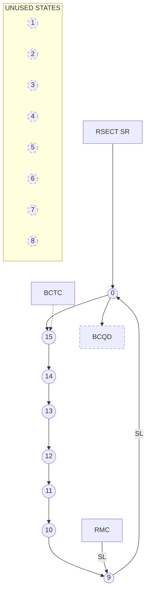

**LEGEND:**

Legend for Clocked Count
**CLOCKED COUNT**

Legend for Synchronous Reset
**SYNCHRONOUS RESET**

Legend for Synchronous Load
**SYNCHRONOUS LOAD**

Fig. 7-7 Bit Counter Sequence

<page_number>2</page_number>

7-49

Helios II


Fig. 7-8 Construction Counter Sequence

### 3. <u>Punctuation Counter</u>

(Refer to Fig. 7-9, PC And Key Sequence and Figures 7-10 through 7-13, State Counter Diagrams.)

The PC counts bytes. For Header, it counts 13 bytes of data, 2 of CRC, 1 sync (if writing), or (together with KEY) 20 bytes if reading. For Header preamble it (together with KEY) counts 16 bytes if writing, counts 24 bytes of search for sync if reading. For Data preamble it (together with KEY) counts 16 bytes if writing, counts 20 bytes of search for sync if reading.

For Data, byte counting is done elsewhere, except for the last 3 bytes (CRC and SYNC) which are counted by the PC.

Counts of 13 or 14 in the PC always indicate the 2 CRC bytes. A count of 15 always indicates the sync byte. The counts of 12, 13, 14, 15 are individually decoded and are collectively described by the signal $\overline{\text{PCHI}}$.

The $\overline{\text{JK}}$ FF Key in the Jump Logic, functions as part of the PC. It is set to 1 after the PC passes 12, and to $\emptyset$ by RESECT or after SYNC or PC Terminal Carry. It is used to permit sync searches of more than 16 bytes.

SETHOLD RQST (SET HOLD REQUEST) initiates DMA transfers. DMAX parallel loads the PC to 13 (29) to write the CRC checked + Sync after the requested number of bytes have been written on disk by DMA. (DMA exit.)

## 7.11.4 TRANSFER COMMAND SEQUENCES

Because of hardware limitations of the disk drive, controller and formatter, not all the possible sequences of transfer commands are allowed.

1. For less than one minimum sector after writing, the read amplifiers in the disk drive are saturated, and it is not possible to get into sync. Attempts to read immediately after writing may result in aborts.

<page_number>2</page_number>

7-50

Helios II

<table>
  <tbody>
    <tr>
        <td colspan="2">graph TD</td>
    </tr>
    <tr>
        <td>subgraph KEY_BAR [$\overline{</td>
        <td>ext{KEY}}$]</td>
    </tr>
    <tr>
        <td colspan="2">direction TB</td>
    </tr>
    <tr>
        <td colspan="2">0((0)) --&gt; 1((1))</td>
    </tr>
    <tr>
        <td colspan="2">1 --&gt; 2((2))</td>
    </tr>
    <tr>
        <td colspan="2">2 --&gt; 3((3))</td>
    </tr>
    <tr>
        <td colspan="2">3 --&gt; 4((4))</td>
    </tr>
    <tr>
        <td colspan="2">4 --&gt; 5((5))</td>
    </tr>
    <tr>
        <td colspan="2">5 --&gt; 6((6))</td>
    </tr>
    <tr>
        <td colspan="2">6 --&gt; 7((7))</td>
    </tr>
    <tr>
        <td colspan="2">7 --&gt; 8((8))</td>
    </tr>
    <tr>
        <td colspan="2">8 --&gt; 9((9))</td>
    </tr>
    <tr>
        <td colspan="2">9 --&gt; 10((10))</td>
    </tr>
    <tr>
        <td colspan="2">10 --&gt; 11((11))</td>
    </tr>
    <tr>
        <td colspan="2">11 --&gt; 12((12))</td>
    </tr>
    <tr>
        <td colspan="2">end</td>
    </tr>
    <tr>
        <td colspan="2">subgraph KEY [KEY]</td>
    </tr>
    <tr>
        <td colspan="2">direction TB</td>
    </tr>
    <tr>
        <td colspan="2">17((17)) --&gt; 18((18))</td>
    </tr>
    <tr>
        <td colspan="2">18 --&gt; 19((19))</td>
    </tr>
    <tr>
        <td colspan="2">19 --&gt; 20((20))</td>
    </tr>
    <tr>
        <td colspan="2">20 --&gt; 21((21))</td>
    </tr>
    <tr>
        <td colspan="2">21 --&gt; 22((22))</td>
    </tr>
    <tr>
        <td colspan="2">22 --&gt; 23((23))</td>
    </tr>
    <tr>
        <td colspan="2">23 --&gt; 24((24))</td>
    </tr>
    <tr>
        <td colspan="2">24 --&gt; 25((25))</td>
    </tr>
    <tr>
        <td colspan="2">25 --&gt; 26((26))</td>
    </tr>
    <tr>
        <td colspan="2">26 --&gt; 27((27))</td>
    </tr>
    <tr>
        <td colspan="2">27 --&gt; 28((28))</td>
    </tr>
    <tr>
        <td colspan="2">28 --&gt; 29((29))</td>
    </tr>
    <tr>
        <td colspan="2">29 --&gt; 30((30))</td>
    </tr>
    <tr>
        <td colspan="2">30 --&gt; 31((31))</td>
    </tr>
    <tr>
        <td colspan="2">end</td>
    </tr>
    <tr>
        <td colspan="2">SYNC -- SR --&gt; 0</td>
    </tr>
    <tr>
        <td>RSECT_BAR [$\overline{</td>
        <td>ext{RSECT}}$] -- SR --&gt; 0</td>
    </tr>
    <tr>
        <td colspan="2">0 -- SL --&gt; 17</td>
    </tr>
    <tr>
        <td colspan="2">17 -- SL --&gt; 29</td>
    </tr>
    <tr>
        <td colspan="2">12 -- "IF TEXT · DATA · BCTC" --&gt; 17</td>
    </tr>
    <tr>
        <td colspan="2">12 -- "IF TEXT · DATA · WRITE · BCTC" --&gt; 21</td>
    </tr>
    <tr>
        <td>12 -- "IF TEXT · DATA · R/$\overline{</td>
        <td>ext{W}}$ · BCTC<br/>OR TEXT · DATA · WRITE · BCTC" --&gt; 25</td>
    </tr>
    <tr>
        <td colspan="2">12 -- "OTHERWISE · BCTC" --&gt; 29</td>
    </tr>
    <tr>
        <td colspan="2">28 -- "IF TEXT · DATA · BCTC" --&gt; 17</td>
    </tr>
    <tr>
        <td colspan="2">31 --&gt; 0</td>
    </tr>
    <tr>
        <td colspan="2">31 -.-&gt; PCTC</td>
    </tr>
    <tr>
        <td>DMAX_BAR [$\overline{</td>
        <td>ext{DMAX}}$] --&gt; 29</td>
    </tr>
    <tr>
        <td colspan="2">DMAX_BAR --&gt; 30</td>
    </tr>
    <tr>
        <td colspan="2">style 12 text-align:left</td>
    </tr>
    <tr>
        <td colspan="2">12 -.-&gt; JUMP</td>
    </tr>
  </tbody>
</table>

$\overline{\text{DMAX}}$
NORMALLY OCCURS ONLY
WHEN KEY IS ON.

Fig. 7-9 PC And KEY Sequence

<page_number>2</page_number>

7-51

Helios II

2. Only one transfer command may be pending at a time. There is storage only for one. Upon receipt of a transfer command, the SREADY status bits will go low (not ready). It will stay low until the transfer is complete. Do not send a transfer command if SREADY is low. (For an exception to this see 3c and d, below.)

Note that SREADY may be low for other reasons.

3. The recommended transfer command sequences are as follows:

a. <u>To Read a Header</u>

Send Read Header and examine the result. Repeat until the desired one is found.

b. To write Header, find the previous one as in a, then (within 10 ms) send Write Header.

c. To read Data, find the correct Header as in a. Then send Read Data (within 300 ns).

d. To write Data, find the correct Header as in a, then send Write Data (within 300 μs).

Note that in c and d it is not practical, or necessary, to wait for SREADY AFTER reading Header. The data is in memory when TC status bit becomes a 1, you have about 300 μs to send a new transfer command. If you miss the timing, an abort will appear at the beginning of the next Header. If the transfer command was a write, it has not happened yet, but will happen in the wrong place. It can be prevented by sending a transfer command describing no transfer (1 in all 4 bits).

<page_number>2</page_number>

7-52

Helios II

```mermaid
graph TD
    subgraph Column1 [ ]
        direction TB
        Start1["RSECT = ØTEXT = ØDATA = Ø"] -- SR --> Node0["Ø PC=ØØØØKEY=Ø"]
        Node0 --> Node1["1 PC=ØØØ1KEY=Ø"]
        Node1 --> Node2["2 PC=ØØ1ØKEY=Ø"]
        Node2 --> Node3["3 PC=ØØ11KEY=Ø"]
        Node3 --> Node4["4 PC=Ø1ØØKEY=Ø"]
        Node4 --> Node5["5 PC=Ø1Ø1KEY=Ø"]
        Node5 --> Node6["6 PC=Ø11ØKEY=Ø"]
        Node6 --> Node7["7 PC=Ø111KEY=Ø"]
        Node7 --> Node8["8 PC=1ØØØKEY=Ø"]
        Node8 --> Node9["9 PC=1ØØ1KEY=Ø"]
        Node9 --> Node10["10 PC=1Ø1ØKEY=Ø"]
        Node10 --> Node11["11 PC=1Ø11KEY=Ø"]
        Node11 --> Node12["12 PC=11ØØKEY=ØPCL=Ø"]
    end

    subgraph Column2 [ ]
        direction TB
        Node21["21 PC=Ø1Ø1KEY=1"]
        Node21 --> Node22["22 PC=Ø11ØKEY=1"]
        Node22 --> Node23["23 PC=Ø111KEY=1"]
        Node23 --> Node24["24 PC=1ØØØKEY=1"]
        Node24 --> Node25["25 PC=1ØØ1KEY=1"]
        Node25 --> Node26["26 PC=1Ø1ØKEY=1"]
        Node26 --> Node27["27 PC=1Ø11KEY=1"]
        Node27 --> Node28["28 PC=11ØØKEY=1"]
        Node28 --> Node29["29 PC=11Ø1KEY=1"]
        Node29 --> Node30["30 PC=111ØKEY=1"]
        Node30 --> Node31["31 PC=1111KEY=1PCX=Ø"]
        Node31 --> Abort["ABORT OCCURSIF NO SYNC BYTEBY THIS TIME(24 BYTES)"]
    end

    subgraph Column3 [ ]
        direction TB
        Start2["SYNC BYTE 1 ADVANCESCONSTRUCTION COUNTERSYNC = ØTEXT = 1DATA = Ø"] -- SR --> Node0R["Ø PC=ØØØØKEY=Ø"]
        Node0R --> Node1R["1 PC=ØØØ1KEY=Ø"]
        Node1R --> Node2R["2 PC=ØØ1ØKEY=Ø"]
        Node2R --> Node3R["3 PC=ØØ11KEY=Ø"]
        Node3R --> Node4R["4 PC=Ø1ØØKEY=Ø"]
        Node4R --> Node5R["5 PC=Ø1Ø1KEY=Ø"]
        Node5R --> Node6R["6 PC=Ø11ØKEY=Ø"]
        Node6R --> Node7R["7 PC=Ø111KEY=Ø"]
        Node7R --> Node8R["8 PC=1ØØØKEY=Ø"]
        Node8R --> Node9R["9 PC=1ØØ1KEY=Ø"]
        Node9R --> Node10R["10 PC=1Ø1ØKEY=Ø"]
        Node10R --> Node11R["11 PC=1Ø11KEY=Ø"]
        Node11R --> Node12R["12 PC=11ØØKEY=ØPCL=Ø"]
    end

    subgraph Column4 [ ]
        direction TB
        Node25R["25 PC=1ØØ1KEY=1PCM=Ø"]
        Node25R --> Node26R["26 PC=1Ø1ØKEY=1PCN=Ø"]
        Node26R --> Node27R["27 PC=1Ø11KEY=1PCX=Ø"]
        Node27R --> Sync2["SYNC BYTE 2 ADVANCESCONSTRUCTION COUNTERAND RESETS P.C. TO Ø,READING CONTINUES TOMAINTAIN SYNCHRONIZATION"]
    end

    Node12 -- "STILL READING HEADERPREAMBLE. WAITING FORSYNC BYTE 1" --> Node21
    Node4 -- "SL PULL 4=ØPULL 8=1" --> Node21
    Node31 -- "SYNC BYTE 1 USUALLY ARRIVES HEREADVANCING COUNTERS TO THIS SEQUENCE" --> Node4R
    Node12R --> Node25R
    Node8R -- "PULL 4=1SL PULL 8=Ø" --> Node25R

    style Column1 fill:none,stroke:none
    style Column2 fill:none,stroke:none
    style Column3 fill:none,stroke:none
    style Column4 fill:none,stroke:none
```

**READING HEADER PREAMBLEWAITING FOR SYNC BYTE 1**

**READING HEADER(13 BYTES)**

**READINGCRC BYTES**

**READINGSYNC BYTE 2**

Fig. 7-10 State Counters During Read Header Command

<page_number>2</page_number>

7-53

Helios II

```mermaid
graph TD
    subgraph Left_Column ["SYNC BYTE 2 FOLLOWING HEADER CAUSES:"]
        direction TB
        L_START["SYNC = 0TEXT = 0DATA = 1"] --> L0
        L0(("0")) --- L0_BOX["PC=0000KEY=0"]
        L0_BOX --> L1
        L1(("1")) --- L1_BOX["PC=0001KEY=0"]
        L1_BOX --> L2
        L2(("2")) --- L2_BOX["PC=0010KEY=0"]
        L2_BOX --> L3
        L3(("3")) --- L3_BOX["PC=0011KEY=0"]
        L3_BOX --> L4
        L4(("4")) --- L4_BOX["PC=0100KEY=0"]
        L4_BOX --> L5
        L5(("5")) --- L5_BOX["PC=0101KEY=0"]
        L5_BOX --> L6
        L6(("6")) --- L6_BOX["PC=0110KEY=0"]
        L6_BOX --> L7
        L7(("7")) --- L7_BOX["PC=0111KEY=0"]
        L7_BOX --> L8
        L8(("8")) --- L8_BOX["PC=1000KEY=0"]
        L8_BOX --> L9
        L9(("9")) --- L9_BOX["PC=1001KEY=0"]
        L9_BOX --> L10
        L10(("10")) --- L10_BOX["PC=1010KEY=0"]
        L10_BOX --> L11
        L11(("11")) --- L11_BOX["PC=1011KEY=0"]
        L11_BOX --> L12
        L12(("12")) --- L12_BOX["PC=1100KEY=0"]
        L12_BOX -- "PCL = 0" --> L25
    end

    subgraph Middle_Column ["STILL READING DATA PREAMBLE WAITING FOR SYNC BYTE 3"]
        direction TB
        L25(("25")) --- L25_BOX["PC=1001KEY=1"]
        L25_BOX --> L26
        L26(("26")) --- L26_BOX["PC=1010KEY=1"]
        L26_BOX --> L27
        L27(("27")) --- L27_BOX["PC=1011KEY=1"]
        L27_BOX --> L28
        L28(("28")) --- L28_BOX["PC=1100KEY=1"]
        L28_BOX --> L29
        L29(("29")) --- L29_BOX["PC=1101KEY=1"]
        L29_BOX --> L30
        L30(("30")) --- L30_BOX["PC=1110KEY=1"]
        L30_BOX --> L31
        L31(("31")) --- L31_BOX["PC=1111KEY=1"]
        L31_BOX --> ABORT["ABORT OCCURS IF NO SYNC BYTE BY THIS TIME (20 BYTES)"]
    end

    subgraph Right_Column ["SYNC BYTE 3 ADVANCES CONSTRUCTION COUNTER"]
        direction TB
        R_START["SYNC = 0TEXT = 1DATA = 1"] --> R0
        R0(("0")) --- R0_BOX["PC=0000KEY=0"]
        R0_BOX --> R1
        R1(("1or17")) --- R1_BOX["PC=0001KEY=0or1"]
        R1_BOX --> R2
        R2(("2or18")) --- R2_BOX["PC=0010KEY=0or1"]
        R2_BOX --> R3
        R3(("3or19")) --- R3_BOX["PC=0011KEY=0or1"]
        R3_BOX --> R4
        R4(("4or20")) --- R4_BOX["PC=0100KEY=0or1"]
        R4_BOX --> R5
        R5(("5or21")) --- R5_BOX["PC=0101KEY=0or1"]
        R5_BOX --> R6
        R6(("6or22")) --- R6_BOX["PC=0110KEY=0or1"]
        R6_BOX --> R7
        R7(("7or23")) --- R7_BOX["PC=0111KEY=0or1"]
        R7_BOX --> R8
        R8(("8or24")) --- R8_BOX["PC=1000KEY=0or1"]
        R8_BOX --> R9
        R9(("9or25")) --- R9_BOX["PC=1001KEY=0or1"]
        R9_BOX --> R10
        R10(("10or26")) --- R10_BOX["PC=1010KEY=0or1"]
        R10_BOX --> R11
        R11(("11or27")) --- R11_BOX["PC=1011KEY=0or1"]
        R11_BOX --> R12
        R12(("12or28")) --- R12_BOX["PC=1100KEY=0or1"]
        R12_BOX -- "PCL = 0" --> R29
        R29(("29")) --- R29_BOX["PC=1101KEY=1"]
        R29_BOX -- "PCM = 0" --> R30
        R30(("30")) --- R30_BOX["PC=1110KEY=1"]
        R30_BOX -- "PCN = 0" --> R31
        R31(("31")) --- R31_BOX["PC=1111KEY=1"]
        R31_BOX -- "PCX = 0" --> DONE["SYNC BYTE 4 ADVANCES CONSTRUCTION COUNTER, SETTING DONE. P.C. STOPS AT STATE 0 UNTIL NEXT RSECT STARTS COUNTERS AGAIN TO MAINTAIN SYNCHRONIZATION."]
    end

    %% Annotations and Side Loops
    L6_BOX -.-> |"READING DATA PREAMBLE WAITING FOR SYNC BYTE 3"| L6_BOX
    R6_BOX -.-> |"READING DATA STAYS IN THIS LOOP UNTIL DMAX = 0"| R6_BOX
    L25_BOX -.-> |"PULL 4 = 1, SL, PULL 8 = 0"| L25_BOX
    R0_BOX -.-> |"PULL 4 = 1, PULL 8 = 1"| R1_BOX
    R1_BOX -.-> |"SL"| R1_BOX
    R27 -.-> |"SYNC BYTE 3 NORMALLY ARRIVES HERE ADVANCING COUNTERS TO THIS SEQUENCE."| R27
    R29_BOX -.-> |"AFTER LAST DATA BYTE IS READ: PULL 4 = 0, PULL 8 = 0, DMAX = 0, SL"| R29_BOX
    R30_BOX -.-> |"READING CRC BYTES"| R30_BOX
    R31_BOX -.-> |"READING SYNC BYTE 4"| R31_BOX
```

Fig. 7-11 State Counters During Read Data Command

<page_number>2</page_number>

7-54

Helios II

```mermaid
graph TD
    subgraph Column1 [ ]
        direction TB
        C1_Start[RSECT = 0] --> C1_SR[SR]
        C1_SR --> C1_0
        C1_0((0)) --> C1_0_Text["PC = 0000KEY = 0"]
        C1_0_Text --> C1_1((1))
        C1_1 --> C1_1_Text["PC = 0001KEY = 0"]
        C1_1_Text --> C1_2((2))
        C1_2 --> C1_2_Text["PC = 0010KEY = 0"]
        C1_2_Text --> C1_3((3))
        C1_3 --> C1_3_Text["PC = 0011KEY = 0"]
        C1_3_Text --> C1_4((4))
        C1_4 --> C1_4_Text["PC = 0100KEY = 0"]
        C1_4_Text --> C1_5((5))
        C1_5 --> C1_5_Text["PC = 0101KEY = 0"]
        C1_5_Text --> C1_6((6))
        C1_6 --> C1_6_Text["PC = 0110KEY = 0"]
        C1_6_Text --> C1_7((7))
        C1_7 --> C1_7_Text["PC = 0111KEY = 0"]
        C1_7_Text --> C1_8((8))
        C1_8 --> C1_8_Text["PC = 1000KEY = 0"]
        C1_8_Text --> C1_9((9))
        C1_9 --> C1_9_Text["PC = 1001KEY = 0"]
        C1_9_Text --> C1_10((10))
        C1_10 --> C1_10_Text["PC = 1010KEY = 0"]
        C1_10_Text --> C1_11((11))
        C1_11 --> C1_11_Text["PC = 1011KEY = 0"]
        C1_11_Text --> C1_12((12))
        C1_12 --> C1_12_Text["PC = 1100KEY = 0"]
        C1_12_Text -- "PCL = 0" --> C1_PULL
        C1_PULL[PULL 4 = 0SL PULL 8 = 0] --> C1_29((29))
        C1_29 --> C1_29_Text["PC = 1101KEY = 1"]
        C1_29_Text --> C1_30((30))
        C1_30 --> C1_30_Text["PC = 1110KEY = 1"]
        C1_30_Text --> C1_31((31))
        C1_31 --> C1_31_Text["PC = 1111KEY = 1"]
        C1_31_Text -- "PCX = 0" --> C1_End[PCX ADVANCESCONSTRUCTIONCOUNTER.]
    end

    subgraph Column2 [ ]
        direction TB
        C2_Start[TEXT = 1DATA = 0] --> C2_0((0))
        C2_0 --> C2_0_Text["PC = 0000KEY = 0"]
        C2_0_Text --> C2_1((1))
        C2_1 --> C2_1_Text["PC = 0001KEY = 0"]
        C2_1_Text --> C2_2((2))
        C2_2 --> C2_2_Text["PC = 0010KEY = 0"]
        C2_2_Text --> C2_3((3))
        C2_3 --> C2_3_Text["PC = 0011KEY = 0"]
        C2_3_Text --> C2_4((4))
        C2_4 --> C2_4_Text["PC = 0100KEY = 0"]
        C2_4_Text --> C2_5((5))
        C2_5 --> C2_5_Text["PC = 0101KEY = 0"]
        C2_5_Text --> C2_6((6))
        C2_6 --> C2_6_Text["PC = 0110KEY = 0"]
        C2_6_Text --> C2_7((7))
        C2_7 --> C2_7_Text["PC = 0111KEY = 0"]
        C2_7_Text --> C2_8((8))
        C2_8 --> C2_8_Text["PC = 1000KEY = 0"]
        C2_8_Text --> C2_9((9))
        C2_9 --> C2_9_Text["PC = 1001KEY = 0"]
        C2_9_Text --> C2_10((10))
        C2_10 --> C2_10_Text["PC = 1010KEY = 0"]
        C2_10_Text --> C2_11((11))
        C2_11 --> C2_11_Text["PC = 1011KEY = 0"]
        C2_11_Text --> C2_12((12))
        C2_12 --> C2_12_Text["PC = 1100KEY = 0"]
        C2_12_Text -- "PCL = 0" --> C2_PULL
        C2_PULL[PULL 4 = 0SL PULL 8 = 0] --> C2_29((29))
        C2_29 --> C2_29_Text["PC = 1101KEY = 1"]
        C2_29_Text -- "PCM = 0" --> C2_30((30))
        C2_30 --> C2_30_Text["PC = 1110KEY = 1"]
        C2_30_Text -- "PCN = 0" --> C2_31((31))
        C2_31 --> C2_31_Text["PC = 1111KEY = 1"]
        C2_31_Text -- "PCX = 0" --> C2_End[PCX ADVANCESCONSTRUCTIONCOUNTER.]
    end

    subgraph Column3 [ ]
        direction TB
        C3_Start[TEXT = 0DATA = 1] --> C3_0((0))
        C3_0 --> C3_0_Text["PC = 0000KEY = 0"]
        C3_0_Text --> C3_1((1))
        C3_1 --> C3_1_Text["PC = 0001KEY = 0"]
        C3_1_Text --> C3_2((2))
        C3_2 --> C3_2_Text["PC = 0010KEY = 0"]
        C3_2_Text --> C3_3((3))
        C3_3 --> C3_3_Text["PC = 0011KEY = 0"]
        C3_3_Text --> C3_4((4))
        C3_4 --> C3_4_Text["PC = 0100KEY = 0"]
        C3_4_Text --> C3_5((5))
        C3_5 --> C3_5_Text["PC = 0101KEY = 0"]
        C3_5_Text --> C3_6((6))
        C3_6 --> C3_6_Text["PC = 0110KEY = 0"]
        C3_6_Text --> C3_7((7))
        C3_7 --> C3_7_Text["PC = 0111KEY = 0"]
        C3_7_Text --> C3_8((8))
        C3_8 --> C3_8_Text["PC = 1000KEY = 0"]
        C3_8_Text --> C3_9((9))
        C3_9 --> C3_9_Text["PC = 1001KEY = 0"]
        C3_9_Text --> C3_10((10))
        C3_10 --> C3_10_Text["PC = 1010KEY = 0"]
        C3_10_Text --> C3_End[CROSSOVER = 0WRITING ENDS.READING TOMAINTAIN SYNC.BEGINS.]
    end

    C1_End --> C2_Start
    C2_End --> C3_Start

    %% Annotations
    C1_Start_Label[TEXT = 0DATA = 0] --- C1_Start
    C1_Writing_Preamble{WRITINGPREAMBLE OFHEADER (15 ZEROS)} --- C1_7
    C1_Writing_Preamble --- C1_8
    C2_Writing_Header{WRITINGHEADER(13 BYTES)} --- C2_6
    C2_Writing_Header --- C2_7
    C3_Writing_Postamble{WRITINGPOSTAMBLE(11 ZEROS)} --- C3_5
    C3_Writing_Postamble --- C3_6
    C1_Writing_Sync1[WRITINGSYNC BYTE 1] --- C1_31
    C2_Writing_Sync2[WRITINGSYNC BYTE 2] --- C2_31
    C2_Writing_CRC[WRITINGCRC BYTES] --- C2_29
    C2_Writing_CRC --- C2_30
```

Fig. 7-12 State Counters During Write Header Command

<page_number>2</page_number>

7-55

Helios II

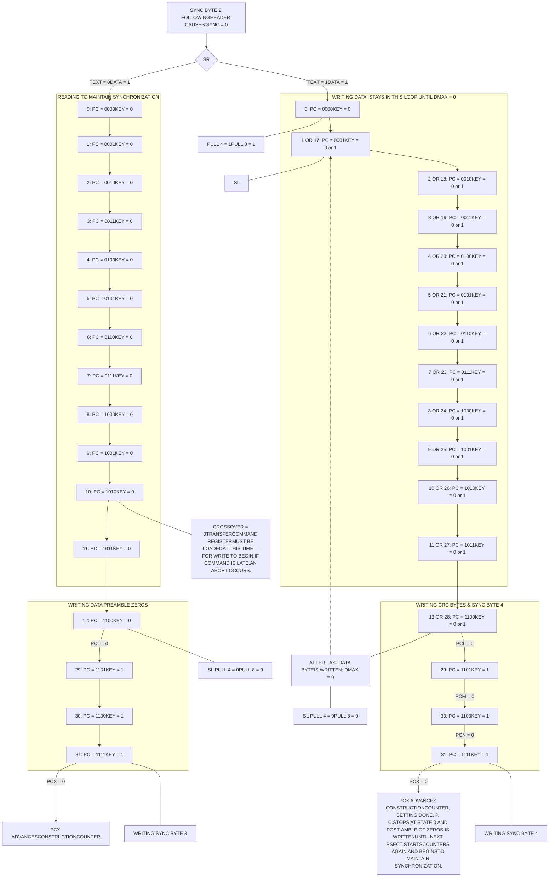

Fig. 7-13 State Counters During Write Data Command

<page_number>2</page_number>

7-56

Helios II

NOTES

<page_number>2</page_number>

7-57

Helios II

Photograph of the Helios II Dual Diskette Drive Cabinet (Model 2) showing the front panel with two vertical drive slots, status indicator lights (RDY, WRT, HEAD, SEEK, ON), and the Helios II Disk Memory System logo.

Fig. 7-14 Helios II Dual Diskette Drive Cabinet (Model 2)

<page_number>2</page_number>

7-58

Helios II

# 7.12 DISKETTE DRIVE

## 7.12.1 ELECTROMECHANICAL DESCRIPTION

### A. <u>Head Loading Actuator</u>

Each diskette is moved into contact with its read/write/erase head by a solenoid-controlled head actuator. An interface signal separately activates each head-load actuator and allows a pressure pad to bring the selected diskette into contact with the read/write/erase head with the proper contact pressure.

### B. <u>Head Positioning</u>

The two read/write/erase heads are mounted on a movable head-carriage.

The head carriage is actuated by an electro-magnetic actuator utilizing a servo-driven coil moving within a permanent stator (voice coil motor). Positioning of the head with respect to the diskette is determined by the magnitude and direction of the current introduced into the coil windings.

The electromagnetic positioner moves the carriage to position the head at any of 77 positions. It is possible for the positioner to move the head directly from one position to another without returning to a reference point.

### C. <u>Diskette Surface Accessibility</u>

Only one surface of the diskette is accessible by each single movable read/write/erase head. At the present time, diskettes are initialized and used only on the back side (side opposite to the label side). The design has provisions to accommodate future possible recording on both sides of the diskette. This feature requires that the drive be able to sense the offset index hole when the diskette is inserted into the drive 180° from its presently-used orientation.

### D. <u>Remote Eject Option</u>

A remote diskette eject option is available, allowing the controller to eject a diskette at the end of a job. When this option is installed, a low logic level on Pin 14 will eject a diskette from Unit Ø; a low logic level on Pin 32 will eject a diskette from Unit 1. These lines must be held low for 1 second to ensure proper activation of this function. The option can be installed on either or both sides of the dual drive.

<page_number>2</page_number>

7-59

Helios II

# 7.12.2 ELECTRONIC DESCRIPTION

## A. <u>Data Recording Scheme</u>

A double frequency encoding scheme is used whereby each data bit is preceded by a clock bit. Each byte is written starting with the high-order clock bit, then the high-order data bit, and so on until the low-order data bit is finally written. The presence of a magnetic flux transition represents a binary one. Clock bits are binary ones unless otherwise noted. A byte with a value of binary zero comprises eight clock transitions and no data transitions.

## B. <u>Controller Seek Monitoring</u>

The controller monitors the seek time and, if the desired track has not been located within the allocated time, the controller initiates a recalibration of the positioning system, causing the head to be repositioned to track øø.

## C. <u>Data Separator PCB</u>

A phase-locked data separator for double frequency code (FM) is incorporated in the Helios II diskette drives. SEPARATED CLOCK is presented to the controller interface at P1 Pin 50, and SEPARATED DATA at P1 Pin 48. The phase-locked loop removes jitter due to peak shift from these signals.

SEPARATED CLOCK IS A 200 ns transition to logic low state for every "clock bit" written on the diskette. SEPARATED DATA is a similar transition for every "data bit" written on the diskette. A is connected to C on the data separator module for this output.

An alternative jumper connection on the data separator also provides data pulses on the clock line and clock pulses on the data line during a soft-sectored address mark, to simulate the action of a "1-shot" type of data separator. B is jumpered to C on the data separator module for this option. Both connections work as described with soft-sectored formats and with hard-sectored formats. Three bytes of data is required to synchronize the data separator.

## D. <u>High-Speed Seek</u>

(Refer to Fig. 7-15, Simplified Controller Design Configuration with Fast Multi-Track Seek and Restore.)

A high-speed seek feature shortens maximum seek time to 100 ms. This makes use of the restore line and seek-complete line as well as step and direction. Step pulses for high-speed seek may be transferred at rates from 30Khz to 500Khz. A seek-complete indication is given by a logic low on P1 Pin 10 when the drive has settled within 0.001" of track center. On power turn on, or in the event of a missed seek, a logic low for 500 ns or greater will cause the drive to find track øø.

<page_number>2</page_number>

7-60

Helios II

2

```mermaid
graph LR
    subgraph CONTROLLER
        L1[LOAD] --> SDR
        SD[SEEKDIFFERENCE] --> SDR
        SDR[SEEKDIFFERENCEREGISTER74193]
        
        SS[STEPPERSELECT] --> G1[AND]
        SC[STEPCLOCK(10 msTYP.PRF)] --> G1
        G1 --> G2[NAND]
        G3[NAND] --> G2
        G2 --> CC[COUNTCLOCK]
        CC --> SDR
        
        K250[250 KhzCLOCK] --> G4[AND]
        M270[MODEL270/272SELECT] --> G4
        G4 --> G3
        
        SDR -- SEEK DIFFERENCE = 0 --> G5[AND]
        G5 --> G6[BUFFER]
        
        G7[NAND] --> G8[AND]
        SS2[STEPPERSELECT] --> G7
        G8 --> SC2[SEEKCOMPLETE]
        
        MR[MASTERRESET] --> G8
        MR --> FF[CLR Q P]
    end

    subgraph DISKETTE_DRIVE
        SDR --> G9[BUFFER]
        G9 -- DIRECTION --> PS1[POS. SERVO]
        
        G6 -- STEP --> SDBR
        SDBR[UP SEEKDIFFERENCEBUFFERREGISTERDWN74193]
        
        SDBR --> DB[DIFF.BITSTOPOS.SERVO]
        PSD[POSITIONERSERVODETENTPULSES] --> SDBR
        
        FF -- SEEKCOMPLETE --> PS2[POS.SERVO]
        FF -- RESTORE --> PS2
    end
```

7-61


Fig. 7-15 Simplified Controller Design Configuration with Fast Multi-Track Seek and Restore

Helios II

The simplified controller design configuration (Fig. 7-15) illustrates utilization of the fast multi-track seek and restore-to-track 00 option capability while simultaneously employing their conventional stepper motor interfaces.

## E. <u>Parallel Operation and Unit Selection</u>

(Refer to Fig. 7-16 for two drive parallel wiring diagram.)

For systems containing two or more dual drives, a terminator resistor pack (U5) must be located in the drive farthest electrically from the controller.

A selector module must be installed in U11 to identify the drive by number in a multidrive system. (See Section 4.2.2, Multi-drive System Configuration.)

In any multidrive system, selector units must be installed in each drive so that no more than one drive is enabled at a time. Within each drive all interface signals are controlled by this drive-enable logic.

A drive is identified to serve a pair of units by the presence of a unit selector in socket U11 on the Data and Interface PCB of the disk drive. This unit selector decodes one of the four possible binary combinations of -DRIVE SELECT 1 and -DRIVE SELECT 2 and enables the drive only when that combination appears.

If a drive has no selector installed, it will be enabled for any of the 4 combinations.

A drive being de-selected causes all outputs to go to the high logic state and inhibits all inputs except spindle-motor-enable.

## 7.12.3 SIGNAL NAMES AND FUNCTIONS

(Refer to Table 7-8, Diskette Drive Power and Interface Pin Connections.)

> 

> **NOTE**
>
> 

> The names of the signals used in this section are those used on the schematics for the diskette drive. (See Helios II Service Manual.) They are somewhat different from those of the corresponding pin numbers on connector P2 of the controller PCB. (cf. Fig. 8-16, Pin-to-Pin Signal Flow Diagram and Table 8-2, Numerical Pin-to-Pin Assignments, Controller/Drive/Indicator Panel.)

<page_number>2</page_number>

7-62

Helios II

Wiring diagram showing the parallel (daisy-chain) connection between a Host System and two Diskette Drives. The diagram includes details for TTL typical input with 220 and 330 ohm resistors, typical open collector drivers, and power supply connections (+24V, +5V, -5V) via twisted pair or ribbon cable. Diskette Drive No. 1 and No. 2 show internal components like 75453 gates and TTL buffers with associated pull-up resistors.

Fig. 7-16 Two-Drive Parallel (Daisy-Chain) Connection Wiring Diagram

<page_number>2</page_number>

7-63

Helios II

Table 7-8. Diskette Drive Power and Interface Pin Connections

<table>
  <thead>
    <tr>
        <th colspan="3">P1 - SIGNAL CONNECTOR</th>
    </tr>
    <tr>
        <th colspan="3">(50 Pin PCB Edge Connector-0.1" Centers)</th>
    </tr>
    <tr>
        <th colspan="3">Pin Numbers</th>
    </tr>
    <tr>
        <th>Gnd</th>
        <th>Signal</th>
        <th> </th>
    </tr>
  </thead>
  <tbody>
    <tr>
        <td>1</td>
        <td>2</td>
        <td>DISK SELECT</td>
    </tr>
    <tr>
        <td>3</td>
        <td>4</td>
        <td>HEAD LOAD 1</td>
    </tr>
    <tr>
        <td>5</td>
        <td>6</td>
        <td>READY 1</td>
    </tr>
    <tr>
        <td>7</td>
        <td>8</td>
        <td>INDEX 1</td>
    </tr>
    <tr>
        <td>9</td>
        <td>10</td>
        <td>SEEK COMPLETE</td>
    </tr>
    <tr>
        <td>11</td>
        <td>12</td>
        <td>RESTORE</td>
    </tr>
    <tr>
        <td>13</td>
        <td>14</td>
        <td>REMOTE EJECT Ø</td>
    </tr>
    <tr>
        <td>15</td>
        <td>16</td>
        <td>SPINDLE POSITION PULSES</td>
    </tr>
    <tr>
        <td>17</td>
        <td>18</td>
        <td>HEAD LOAD Ø</td>
    </tr>
    <tr>
        <td>19</td>
        <td>20</td>
        <td>INDEX Ø</td>
    </tr>
    <tr>
        <td>21</td>
        <td>22</td>
        <td>READY Ø</td>
    </tr>
    <tr>
        <td>23</td>
        <td>24</td>
        <td>SPINDLE MOTOR ENABLE</td>
    </tr>
    <tr>
        <td>25</td>
        <td>26</td>
        <td>DRIVE SELECT 2</td>
    </tr>
    <tr>
        <td>27</td>
        <td>28</td>
        <td>DRIVE SELECT 1</td>
    </tr>
    <tr>
        <td>29</td>
        <td>30</td>
        <td>WRITE PROTECT 1</td>
    </tr>
    <tr>
        <td>\*</td>
        <td>32</td>
        <td>REMOTE EJECT 1</td>
    </tr>
    <tr>
        <td>33</td>
        <td>34</td>
        <td>DIRECTION SELECT</td>
    </tr>
    <tr>
        <td>35</td>
        <td>36</td>
        <td>STEP</td>
    </tr>
    <tr>
        <td>37</td>
        <td>38</td>
        <td>WRITE DATA</td>
    </tr>
    <tr>
        <td>39</td>
        <td>40</td>
        <td>WRITE GATE</td>
    </tr>
    <tr>
        <td>41</td>
        <td>42</td>
        <td>TRACK ØØ</td>
    </tr>
    <tr>
        <td>43</td>
        <td>44</td>
        <td>WRITE PROTECT Ø</td>
    </tr>
    <tr>
        <td>45</td>
        <td>46</td>
        <td>READ DATA</td>
    </tr>
    <tr>
        <td>47</td>
        <td>48</td>
        <td>SEPARATED DATA</td>
    </tr>
    <tr>
        <td>49</td>
        <td>50</td>
        <td>SEPARATED CLOCK</td>
    </tr>
  </tbody>
</table>

**Mating Connectors**

Flat Cable
Scotchflex 3415-0000
or
T&B Ansley 609-5005

Solder Connector
Viking Connector 3VH25/1JN-5
or
TI Connector H312125

\* Pin 31 space is occupied by a polarizing key.

<table>
  <thead>
    <tr>
        <th colspan="2">P3 - POWER CONNECTOR</th>
    </tr>
    <tr>
        <th colspan="2">(10-Pin Molex-0.156" Centers)</th>
    </tr>
    <tr>
        <th>Pin No.</th>
        <th>Signal</th>
    </tr>
  </thead>
  <tbody>
    <tr>
        <td>1</td>
        <td>Chassis Gnd</td>
    </tr>
    <tr>
        <td>2</td>
        <td>+5V DC</td>
    </tr>
    <tr>
        <td>3</td>
        <td>+8V Unreg.</td>
    </tr>
    <tr>
        <td>4</td>
        <td>Key</td>
    </tr>
    <tr>
        <td>5</td>
        <td>+24V DC</td>
    </tr>
    <tr>
        <td>6</td>
        <td>Gnd</td>
    </tr>
    <tr>
        <td>7</td>
        <td>Gnd</td>
    </tr>
    <tr>
        <td>8</td>
        <td>Gnd</td>
    </tr>
    <tr>
        <td>9</td>
        <td>Gnd</td>
    </tr>
    <tr>
        <td>10</td>
        <td>-5V DC</td>
    </tr>
  </tbody>
</table>

**Mating Connector**

Connector-Molex 09-50-7101

Terminal - 08-50-0106

Polarizing Key - 15-04-0219

<page_number>2</page_number>

7-64

Helios II

## 2 DISK SELECT

A positive level on this line selects the left unit for connection to the controller read/write interface signals; a negative level similarly selects the right unit. Selection of one of the two heads for the Write operation automatically selects the other head for the Read operation.

## 4 HEAD LOAD 1

Head 1 remains loaded for the length of time that a negative level is held on this line. This signal is gated by the Drive Select line. Head 1 is the head of the right unit.

## 6 READY 1

A negative level on this line indicates that a diskette is loaded in unit 1 and is within 90% of operating speed. This signal is gated by the Drive Select line.

## 8 INDEX 1

This line is normally at the positive level. A one ms pulse to the negative level is transmitted on this line once for each revolution of the diskette in unit 1 as the diskette index hole passes the index hole sensor. This signal is gated by the Drive Select line.

## 10 SEEK COMPLETE

A negative level on this line indicates that a seek or restore operation has been completed. A positive level on this line indicates that a seek operation is in process. This signal is gated by the Drive Select line.

## 12 RESTORE

A negative level on this line causes a low-speed repositioning of the heads to Track ØØ. This line takes priority over the Track Address Difference Register lines within the drive. This signal is gated by the Drive Select line.

## 14 REMOTE EJECT Ø

A negative level on this line energizes a relay that ejects the diskette in unit Ø. This line is held at the negative level for 1 second to allow operation of the eject mechanism. This signal is gated by the Drive Select line.

## 16 SPINDLE POSITION PULSES

A 4800 Hz ±2% square wave, symmetrical to within ±5%, is presented on this line, synchronized to change in spindle position. The signal is derived from the 800 equally-spaced pulses on the spindle code wheel, each cycle representing 0.45 degree of spindle rotation. This signal is gated by the Drive Select line.

<page_number>2</page_number>

7-65

Helios II

## 18 HEAD LOAD Ø

Head Ø remains loaded for the length of time that a negative level is held on this line. This signal is gated by the Drive Select line. Head Ø is the head of the left unit.

## 20 INDEX Ø

This line is normally at the positive level. A one ms pulse to the negative level is transmitted on this line once for each revolution of the diskette in unit Ø (left side when viewed from front panel looking toward rear of drive) as the diskette index hole passes the index hole sensor. This signal is gated by the Drive Select line.

## 22 READY Ø

A negative level on this line indicates that a diskette is loaded in unit Ø and is within 90% of operating speed. This signal is gated by the Drive Select line.

## 24 SPINDLE MOTOR ENABLE

Pin 24 of the diskette drive provides controller control of the spindle motor. A logic low on this line enables the spindle servo, such that the spindle turns when a diskette is installed. A logic high inhibits the spindle motor, thus allowing the system to "stand by" at very low power consumption with a diskette loaded.

The spindle motor attains operating speed within 1 second after application of the negative level to this line. This signal is gated by the Drive Select line. Drive interface signal lines Ready Ø and Ready 1 remain at the negative (True) level if the Spindle Motor Enable line is positive (False) and the diskette is present.

## 26 DRIVE SELECT 2

A negative level on this line selects the drive containing units 4 and 5, and the drive containing units 6 and 7 (the drives in cabinet 2). A positive level on this line selects the drive containing units Ø and 1 and the drive containing units 2 and 3 (the drives in cabinet 1).

## 28 DRIVE SELECT 1

A negative level on this line selects the drive containing units 2 and 3, and the drive containing units 6 and 7 (the drives in the right-hand side of a cabinet.) A positive level on this line selects the drive containing units Ø and 1 and the drive containing units 4 and 5 (the drives on the left side of a cabinet.)

<page_number>2</page_number>

7-66

Helios II

## 30 WRITE PROTECT 1

A negative level on this line indicates that the diskette in unit 1 is Write Protected and that the drive write circuitry is prevented from writing on this diskette. (The Helios II does not use the write-protect lines.)

## 32 REMOTE EJECT 1

A negative level on this line energizes a relay that ejects the diskette in unit 1. This line is held at the negative level for 1 second to allow operation of the eject mechanism. This signal is gated by the Drive Select line.

## 34 DIRECTION SELECT

The level on this line defines the direction of motion of the head positioner when the Step line is pulsed. A negative level defines the direction as inward (higher track number) and a positive level as outward (lower track number and away from the center).

## 36 STEP

A 200 ns to 1 μs pulse to the negative level is presented on this line for each track to be crossed by the head during a seek to a new address. The Direction Select level shall be stable for 100 ns prior to the leading edge of this Step pulse. Pulse trains representative of up to 76 tracks of address change may be transmitted at pulse recurrent frequencies up to 500 kHz. The entire pulse train representative of an address change must be transmitted in less than 2.0 ms.

## 38 WRITE DATA

Write current changes polarity for each positive level to negative level transition on this line. This line shall stay at a negative level for at least 180 ns after such a transition, but should be at a positive level for at least 180 ns before the next positive level to negative level transition. This signal is gated by the Drive Select line.

## 40 WRITE GATE

Write current is turned on for the duration of time that this line is held at a negative level. The selection of one head for writing automatically selects the other head for reading. This signal is gated by the Drive Select line. Erase current is also controlled by this line.

## 42 TRACK ØØ

This line is normally at the positive level. A negative level is presented on this line when the heads are positioned over Track ØØ. This signal is gated by the Drive Select line.

<page_number>2</page_number>

7-67

Helios II

44 WRITE PROTECT Ø

A negative level on this line indicates that the diskette in unit Ø is Write Protected and that the drive write circuitry is prevented from writing on this diskette. (Not used in Helios II.)

46 READ DATA

This line transmits the output of the selected head at all times except when the Write Gate is enabled, at which time it transmits the output of the other drive head. Each flux transition on the diskette is represented by a 200 ns ±20% pulse to the negative level on this line. This signal is gated by the Drive Select line.

48 SEPARATED DATA

Separated data pulses from the selected head are presented on this line except when the Write Gate is enabled, whereupon the output is from the other drive head. Data separation is performed by a phase-locked oscillator. Each data pulse is represented by a 200 ns ±20% pulse to the negative level on this line. This signal is gated by the Drive Select line.

50 SEPARATED CLOCK

Separated clock pulses from the selected head are presented on this line except when the Write Gate is enabled, whereupon the output is from the other drive head. Clock separation is performed by a phase-locked oscillator which omits missing clock pulses. Each clock pulse is represented by a 200 ns ±20% pulse to the negative level on this line. This signal is gated by the Drive Select line.

NOTE: When they are designated on the controller/formatter, the signals between controller P2 and drive P1 are prefixed by a minus sign to denote that they are drive signals as opposed to controller/formatter signals and that they are active low with regard to the drive. They do not have this minus sign on the drive vendor documentation. Once processed on either the controller or formatter, they are inscribed with a "not-bar." If inverted the "not-bar" is dropped.

<page_number>7-68</page_number>

Helios II

# CONTENTS

# SECTION 8 DRAWINGS

## MODEL 2

<table>
  <thead>
    <tr>
        <th>FIGURE</th>
        <th> </th>
    </tr>
  </thead>
  <tbody>
    <tr>
        <td>8-1</td>
        <td>System Assembly, Interconnect Diagram</td>
    </tr>
    <tr>
        <td>8-2</td>
        <td>Cabinet Assembly, Model 2, Exploded</td>
    </tr>
    <tr>
        <td>8-3</td>
        <td>Base Assembly, Model 2, Exploded</td>
    </tr>
    <tr>
        <td>8-4</td>
        <td>Bezel Assembly, Model 2, Exploded</td>
    </tr>
    <tr>
        <td>8-5</td>
        <td>Rear Panel Assembly, Model 2, Exploded</td>
    </tr>
    <tr>
        <td>8-6</td>
        <td>Controller PCB Assembly</td>
    </tr>
    <tr>
        <td>8-7</td>
        <td>Formatter PCB Assembly</td>
    </tr>
    <tr>
        <td>8-8</td>
        <td>Regulator PCB Assembly, Model 2</td>
    </tr>
    <tr>
        <td>8-9</td>
        <td>Indicator Panel PCB Assembly</td>
    </tr>
    <tr>
        <td>8-10</td>
        <td>System Wiring Diagram</td>
    </tr>
    <tr>
        <td>8-11</td>
        <td>Controller PCB, Schematic</td>
    </tr>
    <tr>
        <td>8-12</td>
        <td>Formatter PCB, Schematic</td>
    </tr>
    <tr>
        <td>8-13</td>
        <td>Regulator PCB, Schematic</td>
    </tr>
    <tr>
        <td>8-14</td>
        <td>Indicator Panel PCB, Schematic</td>
    </tr>
    <tr>
        <td>8-15</td>
        <td>Selector DIPs, Schematic Assemblies</td>
    </tr>
    <tr>
        <td>8-16</td>
        <td>Pin-to-Pin Signal Flow Diagram</td>
    </tr>
    <tr>
        <td>8-17</td>
        <td>System Block Diagram</td>
    </tr>
  </tbody>
</table>

## MODEL 4

<table>
  <tbody>
    <tr>
        <td>8-18</td>
        <td>Cabinet Assembly, Model 4, Exploded</td>
    </tr>
    <tr>
        <td>8-19</td>
        <td>Base Assembly, Model 4, Exploded</td>
    </tr>
    <tr>
        <td>8-20</td>
        <td>Bezel Assembly, Model 4, Exploded</td>
    </tr>
    <tr>
        <td>8-21</td>
        <td>Rear Panel Assembly, Model 4, Exploded</td>
    </tr>
    <tr>
        <td>8-22</td>
        <td>Regulator PCB Assembly, Model 4</td>
    </tr>
  </tbody>
</table>

<page_number>2</page_number>

Helios II

Engineering drawing of the Helios Cabinet Assembly showing the controller/cabinet interconnect cable connecting from J5 on a vertical panel to P2 on a horizontal board. The cable is marked with a red stripe for Pin 1.

<sup>5</sup> HELIOS CABINET ASSEMBLY

J5

RED STRIPE (PIN 1)

P2

RED STRIPE (PIN 1)

<sup>4</sup> CONTROLLER/CABINET INTERCONNECT CABLE
<sup>5</sup>

<sup>3</sup> CONTROLLER/CABINET INTERCONNECT CABLE
<sup>4</sup>

Engineering drawing of Helios II system assembly showing the rear panel, S-100 backplane, controller PCB, formatter PCB, and interconnect cable.

**NOTE:**

See Parts List, Section 9, for key to item numbers:

(N) Model 2
<mark>N</mark> Model 4

HELIOS II REAR PANEL

S-100 BACKPLANE

P3
(1) CONTROLLER PCB
<mark>2</mark>

P3
(2) FORMATTER PCB
<mark>3</mark>

RED STRIPE (PIN 1)

(3) CONTROLLER/FORMATTER INTERCONNECT CABLE
<mark>4</mark>

2 Helios II

Fig. 8-1 System Assembly, Interconnect Diagram (I-2-7)

Engineering drawing showing an exploded view of an electronic assembly with various components labeled with numbers in circles. Key components include a chassis, circuit boards, wiring harnesses, and mounting hardware. Labels include 2, 3, 5, 7, 8, 10, 11, 12, 13, 14, 15, 17, 18 REF., 19, 22, 23, 101, 102, 103, 104, and 3 REF. Text annotations include "PART OF 3", "J3", "P1", "PIN 1, RED", "FROM POWER SUPPLY HARNESS", "RED", "4 PL", "2 PL", "7 PL", and "3 PL".

Exploded view engineering drawing of Cabinet Assembly, Model 2, showing various components like the cover, base, and internal wiring with callouts for item numbers 2, 3, 4, 13, 14, 16, 18, 20, and 21. Labels include "RED", "WHITE", and "PIN 1, LED".

<u>NOTES:</u>

1. UNLESS OTHERWISE SPECIFIED:
   ALL FLAT WASHERS ARE ITEM <sup>16</sup>
   ALL LOCK WASHERS ARE ITEM <sup>14</sup>
   ALL SCREWS ARE ITEM <sup>9</sup>

**See Parts List, Section 9, for key to encircled item numbers**

2 Helios II

Fig. 8-2 Cabinet Assembly, Model 2, Exploded (300000+I-2-78)

Engineering assembly drawing showing an exploded view of a chassis with a transformer, capacitor, and mounting hardware. The drawing includes callouts for parts 1, 2, 3, 7, 8, 9, 10, 11, and 12, with quantity indicators like "2 PL" and "3 PL". The page is bordered by a coordinate grid with letters A-D on the vertical axis and numbers 5-8 on the horizontal axis.

Exploded view diagram of the Base Assembly, Model 2, showing various components like screws, washers, brackets, and the main chassis with callout numbers 3, 4, 5, 6, 8, 14, and 15.

See Parts List, Section 9, for key to encircled item numbers

Fig. 8-3 Base Assembly, Model 2, Exploded

2 Helios II

Exploded view engineering drawing of a mechanical assembly showing plates, spacers, and screws with callouts 3, 4, 5, 6, and 9. The drawing includes grid coordinates A-D and 3-4.

Exploded view engineering drawing of Bezel Assembly, Model 2, showing various components like screws, washers, and plates with callouts 1, 2, 6, and 7. The drawing includes a grid with coordinates A-D and 1-3.

NOTES:

1. UNLESS OTHERWISE SPECIFIED: ALL LOCKWASHERS ARE ITEM 8.
2. <sup>2</sup> SOLDER ITEM 9 TO ITEM 4 AS SHOWN BEFORE ITEM 4 IS MOUNTED TO ITEM 1.

See Parts List, Section 9, for key to encircled item numbers

2 Helios II

Fig. 8-4 Bezel Assembly, Model 2, Exploded (306000E)

Exploded view engineering drawing of an assembly with numbered components and grid coordinates A-D and 5-8.

Engineering drawing of Rear Panel Assembly, Model 2, Exploded view, showing components like a fan, brackets, and connectors with callout numbers 1, 5, 6, 12, 14, 15, 16, 21, and 22.

NOTES:

<sup>1</sup> FOR AC POWER INTERCONNECT CABLE <sup>4</sup> CONNECTION SEE DWG 300006 (WIRING DIAGRAM, HELIOS II, MODEL 2).

See Parts List, Section 9, for key to encircled item numbers

Fig. 8-5 Rear Panel Assembly, Model 2, Exploded

Engineering drawing of a circuit board (HELIOS II CONTROLLER) with component wiring details and cross-section views.

**POINT B**
**ADD JUMPER FROM POINT "A" TO POINT "B"**
**POINT A**

**CUT TRACE (COMP. SIDE)**
**POINT D**
**POINT C**

**CUT TRACE (COMP. SIDE)**
**ADD JUMPER FROM POINT "C" TO POINT "D"**

### COMPONENT WIRING
<table>
  <tbody>
    <tr>
        <td>+ 8</td>
        <td>+ 8</td>
        <td>1-51</td>
    </tr>
    <tr>
        <td>+ 16</td>
        <td>- 16</td>
        <td> </td>
    </tr>
    <tr>
        <td>XRDY</td>
        <td>SSW DSB</td>
        <td> </td>
    </tr>
    <tr>
        <td>VI0</td>
        <td>EXT CLR</td>
        <td> </td>
    </tr>
    <tr>
        <td>VI1</td>
        <td>RTC</td>
        <td>5-55</td>
    </tr>
    <tr>
        <td>VI2</td>
        <td>STSTB</td>
        <td> </td>
    </tr>
    <tr>
        <td>VI3</td>
        <td>DIG 1</td>
        <td> </td>
    </tr>
    <tr>
        <td>VI4</td>
        <td>FRDY</td>
        <td> </td>
    </tr>
    <tr>
        <td>VI5</td>
        <td> </td>
        <td>10-60</td>
    </tr>
    <tr>
        <td colspan="3">VI6</td>
    </tr>
    <tr>
        <td colspan="3">VI7</td>
    </tr>
    <tr>
        <td>XRDY2</td>
        <td> </td>
        <td>15-65</td>
    </tr>
    <tr>
        <td>STA DSB</td>
        <td>MWRT</td>
        <td> </td>
    </tr>
    <tr>
        <td>C/C DSB</td>
        <td>PS</td>
        <td> </td>
    </tr>
    <tr>
        <td>UNPROC</td>
        <td>PROC</td>
        <td>20-70</td>
    </tr>
    <tr>
        <td>SS</td>
        <td>RUN</td>
        <td> </td>
    </tr>
    <tr>
        <td>ADD DSB</td>
        <td>PRDY</td>
        <td> </td>
    </tr>
    <tr>
        <td>DO DSB</td>
        <td>PINT</td>
        <td> </td>
    </tr>
    <tr>
        <td>$\phi$ 1 CLK</td>
        <td>PHOLD</td>
        <td> </td>
    </tr>
    <tr>
        <td>$\phi$ 2 CLK</td>
        <td>PRESET</td>
        <td>25-75</td>
    </tr>
    <tr>
        <td>PHLDA</td>
        <td>PSYNC</td>
        <td> </td>
    </tr>
    <tr>
        <td>PWAIT</td>
        <td>PWR</td>
        <td> </td>
    </tr>
    <tr>
        <td>PINTE</td>
        <td>PDBIN</td>
        <td> </td>
    </tr>
    <tr>
        <td>A 5</td>
        <td>A 0</td>
        <td>30-80</td>
    </tr>
    <tr>
        <td>A 4</td>
        <td>A 1</td>
        <td> </td>
    </tr>
    <tr>
        <td>A 3</td>
        <td>A 2</td>
        <td> </td>
    </tr>
    <tr>
        <td>A 15</td>
        <td>A 6</td>
        <td> </td>
    </tr>
    <tr>
        <td>A 12</td>
        <td>A 7</td>
        <td> </td>
    </tr>
    <tr>
        <td>A 9</td>
        <td>A 8</td>
        <td>35-85</td>
    </tr>
    <tr>
        <td>DO 1</td>
        <td>A 13</td>
        <td> </td>
    </tr>
    <tr>
        <td>DO 0</td>
        <td>A 14</td>
        <td> </td>
    </tr>
    <tr>
        <td>A 10</td>
        <td>A 11</td>
        <td> </td>
    </tr>
    <tr>
        <td>DO 4</td>
        <td>DO 2</td>
        <td> </td>
    </tr>
    <tr>
        <td>DO 5</td>
        <td>DO 3</td>
        <td> </td>
    </tr>
    <tr>
        <td>DO 6</td>
        <td>DO 7</td>
        <td>40-90</td>
    </tr>
    <tr>
        <td>DI 2</td>
        <td>DI 4</td>
        <td> </td>
    </tr>
    <tr>
        <td>DI 3</td>
        <td>DI 5</td>
        <td> </td>
    </tr>
    <tr>
        <td>DI 7</td>
        <td>DI 6</td>
        <td> </td>
    </tr>
    <tr>
        <td>SMI</td>
        <td>DI 1</td>
        <td>45-95</td>
    </tr>
    <tr>
        <td>SOUT</td>
        <td>DI 0</td>
        <td> </td>
    </tr>
    <tr>
        <td>SINP</td>
        <td>SINTA</td>
        <td> </td>
    </tr>
    <tr>
        <td>SMER</td>
        <td>SWO</td>
        <td> </td>
    </tr>
    <tr>
        <td>SHLTA</td>
        <td>SSTACK</td>
        <td> </td>
    </tr>
    <tr>
        <td>CLOCK</td>
        <td>POC</td>
        <td> </td>
    </tr>
    <tr>
        <td>GND</td>
        <td>GND</td>
        <td>50-100</td>
    </tr>
  </tbody>
</table>

**CUT TRACES (COMP. SIDE) (2 PL)**

**A - A**
**B - B**

Engineering drawing of Controller PCB Assembly showing component layout, jumper details, and technical notes.

**NOTES:**
1. ALL HEAVY-THICK DASHED LINES ARE JUMPERS ON THE SOLDER SIDE (FARSIDE) OF THE PCB. ALL HEAVY-THICK SOLID LINES ARE JUMPERS ON THE COMPONENT SIDE (NEARSIDE) OF THE PCB.
2. (NOT USED)
3. <sup>3</sup> MARK LABEL, ITEM <sup>64</sup>, WITH REV LETTER AND PLACE IN APPROXIMATE AREA SHOWN.
4. <sup>4</sup> REMOVE PIN 15 FROM HEADER PRIOR TO INSTALLING HEADER ON BOARD.
5. <sup>5</sup> REMOVE PIN 31 FROM HEADER PRIOR TO INSTALLING HEADER ON BOARD.
6. UNLESS OTHERWISE SPECIFIED ALL JUMPER WIRES ARE 24 AWG, ITEM <sup>67</sup>.

See Parts List, Section 9, for key to encircled item numbers

2 Helios II

Fig. 8-6 Controller PCB Assembly (C/G)

Engineering drawing of a Formatter circuit board assembly, showing component layout for integrated circuits U1 through U25, capacitors C3 through C20, and connectors P1 and P3.

**FORMATTER**
**ASSY. NO. 301003**
**REV C PC301004**
**©1977 BY PROCESSOR TECHNOLOGY**

### Component Layout Data

<table>
  <thead>
    <tr>
        <th>Ref Des</th>
        <th>Part Number / Value</th>
    </tr>
  </thead>
  <tbody>
    <tr>
        <td>U1</td>
        <td>7/8097</td>
    </tr>
    <tr>
        <td>U2</td>
        <td>/8097</td>
    </tr>
    <tr>
        <td>U3</td>
        <td>CTS 761-5-R</td>
    </tr>
    <tr>
        <td>U4</td>
        <td>8098</td>
    </tr>
    <tr>
        <td>U5</td>
        <td>9401</td>
    </tr>
    <tr>
        <td>U6</td>
        <td>74LS153</td>
    </tr>
    <tr>
        <td>U7</td>
        <td>74LS151</td>
    </tr>
    <tr>
        <td>U8</td>
        <td>74LS151</td>
    </tr>
    <tr>
        <td>U9</td>
        <td>74LS153</td>
    </tr>
    <tr>
        <td>U10</td>
        <td>74LS153</td>
    </tr>
    <tr>
        <td>U11</td>
        <td>74LS163</td>
    </tr>
    <tr>
        <td>U12</td>
        <td>74LS163</td>
    </tr>
    <tr>
        <td>U14</td>
        <td>74LS175</td>
    </tr>
    <tr>
        <td>U15</td>
        <td>74LS109</td>
    </tr>
    <tr>
        <td>U16</td>
        <td>74LS10</td>
    </tr>
    <tr>
        <td>U17</td>
        <td>74LS123</td>
    </tr>
    <tr>
        <td>U18</td>
        <td>74LS109</td>
    </tr>
    <tr>
        <td>U19</td>
        <td>74LS08</td>
    </tr>
    <tr>
        <td>U20</td>
        <td>74LS86</td>
    </tr>
    <tr>
        <td>U21</td>
        <td>74LS00</td>
    </tr>
    <tr>
        <td>U22</td>
        <td>74LS10</td>
    </tr>
    <tr>
        <td>U23</td>
        <td>74LS08</td>
    </tr>
    <tr>
        <td>U24</td>
        <td>74LS04</td>
    </tr>
    <tr>
        <td>U25</td>
        <td>74LS139</td>
    </tr>
    <tr>
        <td>C3</td>
        <td>.047 uf</td>
    </tr>
    <tr>
        <td>C4</td>
        <td>.047 uf</td>
    </tr>
    <tr>
        <td>C5</td>
        <td>.047 uf</td>
    </tr>
    <tr>
        <td>C6</td>
        <td>.047 uf</td>
    </tr>
    <tr>
        <td>C7</td>
        <td>.047 uf</td>
    </tr>
    <tr>
        <td>C10</td>
        <td>.047 uf</td>
    </tr>
    <tr>
        <td>C11</td>
        <td>.047 uf</td>
    </tr>
    <tr>
        <td>C12</td>
        <td>.047 uf</td>
    </tr>
    <tr>
        <td>C13</td>
        <td>.047 uf</td>
    </tr>
    <tr>
        <td>C14</td>
        <td>390</td>
    </tr>
    <tr>
        <td>C15</td>
        <td>390 PF</td>
    </tr>
    <tr>
        <td>C16</td>
        <td>.047 uf</td>
    </tr>
    <tr>
        <td>C17</td>
        <td>.047 uf</td>
    </tr>
    <tr>
        <td>C18</td>
        <td>.047 uf</td>
    </tr>
    <tr>
        <td>C19</td>
        <td>.047 uf</td>
    </tr>
    <tr>
        <td>C20</td>
        <td>.047 uf</td>
    </tr>
    <tr>
        <td>R1</td>
        <td>1.5K</td>
    </tr>
    <tr>
        <td>R2</td>
        <td>5.1K</td>
    </tr>
  </tbody>
</table>

P1
P3

PIN 1 COMPONENT
PIN 51 SOLDER SIDE

5 4 3 2 1

Technical drawing of Formatter PCB Assembly showing component layout, including integrated circuits (U11-U31), capacitors (C1-C24), and connectors. Detail AA shows a side view of a component mounting.

NOTES:
1. REMOVE PIN 1 FROM HEADER PRIOR TO INSTALLING HEADER ON BOARD.

See Parts List, Section 9, for key to encircled item numbers

301003 | E |

2 Helios II

5 4 3 2 1 9.3

Fig. 8-7 Formatter PCB Assembly (C/E)

Engineering drawing of a circuit board assembly with component labels and wiring details.

DETAIL A-A

Engineering drawing of Regulator PCB Assembly showing component layout, heatsink mounting, and technical notes.

NOTES:
1. THERMAL COMPOUND, ITEM 37, IS TO BE PLACED BETWEEN HEATSINK AND ALL COMPONENTS WHICH ARE MOUNTED TO THE HEATSINK.
2. MARK REV LETTER "D" WITH INDELIBLE INK IN APPROXIMATE AREA SHOWN.

See Parts List, Section 9, for key to encircled item numbers

Fig. 8-8 Regulator PCB Assembly, Model 2 (C/D)

Engineering drawing of a printed circuit board assembly showing component layout for ASSY 300008, PC 300009, including resistors R1-R11, diodes D1-D9, transistor Q1 (2N2907), and integrated circuits U1 (74LS139) and U2 (74LS157).

MV5752

Engineering drawing of Indicator Panel PCB Assembly showing component layout, traces, and a side view of a diode labeled D2(REF). Encircled item numbers 1, 25, and a triangle-enclosed 2 are visible.

NOTES:

UNLESS OTHERWISE SPECIFIED:

1. RESISTOR VALUES ARE 220 OHMS.
2. <sup>2</sup> SOLDER A # 24 SOLID BUS WIRE JUMPER BETWEEN B & C ON THE FARSIDE (SOLDER SIDE) OF PCB.

See Parts List, Section 9, for key to encircled item numbers

2 Helios II

Fig. 8-9 Indicator Panel PCB Assembly (300008 D/F)

8 7 6 5

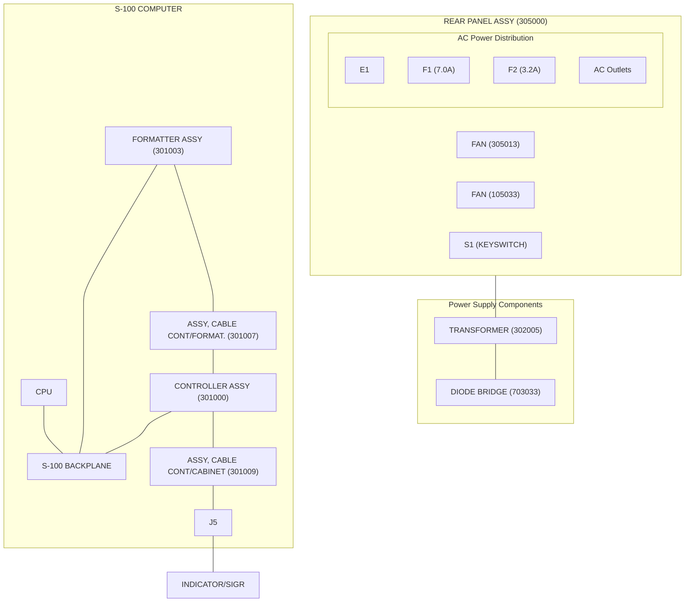

**PART OF REAR PANEL ASSY (305000)**

<table>
    <tr>
        <th>Component</th>
        <th>Part Number</th>
    </tr>
    <tr>
        <td>REAR PANEL ASSY</td>
        <td>(305000)</td>
    </tr>
    <tr>
        <td>FAN</td>
        <td>(305013)</td>
    </tr>
    <tr>
        <td>FAN</td>
        <td>(105033)</td>
    </tr>
    <tr>
        <td>F1</td>
        <td>(7.0A)</td>
    </tr>
    <tr>
        <td>F2</td>
        <td>(3.2A)</td>
    </tr>
    <tr>
        <td>TRANSFORMER</td>
        <td>(302005)</td>
    </tr>
    <tr>
        <td>DIODE BRIDGE</td>
        <td>(703033)</td>
    </tr>
    <tr>
        <td>FORMATTER ASSY</td>
        <td>(301003)</td>
    </tr>
    <tr>
        <td>ASSY, CABLE CONT/FORMAT.</td>
        <td>(301007)</td>
    </tr>
    <tr>
        <td>CONTROLLER ASSY</td>
        <td>(301000)</td>
    </tr>
    <tr>
        <td>ASSY, CABLE CONT/CABINET</td>
        <td>(301009)</td>
    </tr>
</table>

8 7 6 5

System Wiring Diagram for Helios II, showing Regulator PCB Assy, Right Disk Drive, Left Disk Drive, and Indicator Panel PCB Assy with associated cable assemblies.

NOTES:
1. <sup>1</sup> USED ON HELIOS II MODEL 4 ONLY


Fig. 8-10 System Wiring Diagram

2 Helios II

Engineering schematic diagram showing complex circuit connections with integrated circuits including 8097, 74LS13, 74LS191, 8833, 9403, 74LS157, 74LS279, and 74LS02. The diagram includes various signal labels such as RCLOCK, SET HOLD RRST, FIFO QS, RDATA, TEXT, RMC, CRCERR, RSECT, ORE TC, SYNC ERROR, and OVER INDEX.

\* EACH OF THESE LINES IS TERMINATED
BY 330$\Omega$ TO 0V & 220$\Omega$ TO +5V
(11 PLACES)

Controller PCB Schematic Diagram

Fig. 8-11 Controller PCB, Schematic (301002E)

2 Helios II

Engineering schematic diagram showing circuit components, logic gates (74LS series), and wiring connections.

NOTES: UNLESS OTHERWISE SPECIFIED:
1. ALL RESISTOR VALUES ARE IN OHMS, 1/4W, ±5%.
2. " CAPACITOR " ARE .047 AND UNITS IN MICROFARADS.
3. EACH PIN OF P3 IS TO BE CONNECTED BY THE MATING CABLE TO THE PIN BEARING THE SAME NO. AT P3 OF THE CONTROLLER.
4. \* EACH OF THESE LINES IS TERMINATED BY 330 $\Omega$ TO 0V, AND BY 220 $\Omega$ TO +5V BY A RESISTOR NETWORK IN U3.

<table>
  <thead>
    <tr>
        <th colspan="4">REF. DESIGNATION USED</th>
    </tr>
    <tr>
        <th>REF. DES.</th>
        <th>FIRST USED</th>
        <th>LAST USED</th>
        <th>DELETED</th>
    </tr>
  </thead>
  <tbody>
    <tr>
        <td>U</td>
        <td>1</td>
        <td>31</td>
        <td> </td>
    </tr>
    <tr>
        <td>R</td>
        <td>1</td>
        <td>2</td>
        <td> </td>
    </tr>
    <tr>
        <td>C</td>
        <td>1</td>
        <td>24</td>
        <td> </td>
    </tr>
    <tr>
        <td>P</td>
        <td>1</td>
        <td>3</td>
        <td> </td>
    </tr>
  </tbody>
</table>

P3 CLOCK 0 (26) \* U3-2
P3 - SEPARATED CLOCK (50) \* U3-5
P3 DMAOFF (32) \* U3-1

P3 - SEPARATED DATA (48) \* U3-3
P3 WRITE (28) \* U3-4

P3 MAIN CLOCK (36) \* U3-7

P3 R/W (2) \* U3-14
P3 FIFO QS (12) \* U3-12
P3 CLOCK 2 (40) \* U3-6

P3 ORE TC (4) \* U3-14
P3 - SEPARATED SECTOR (20) \* U3-9
P3 - SEPARATED INDEX (8) \* U3-11
P3 HOLD (18) \* U3-10

+8V UNREG (1)
+8V UNREG (51)

GND (50)
GND (100) 0V

P1
(S100 BUS)

C1
15 UF
DIPPED TANTALUM

Formatter PCB Schematic Diagram


Fig. 8-12 Formatter PCB, Schematic (301005D)

2 Helios II

Engineering drawing of electrical circuit showing transformers T1 and T2, bridge rectifier MDA 3500, and various color-coded wiring (BLUE, WHITE, YEL, BLACK, GRN).

NOTES:

1. UNLESS OTHERWISE SPECIFIED

    A. ALL RESISTOR VALUES ARE G

    B. ALL CAPACITOR VALUES ARE

Regulator PCB Schematic Diagram

2 Helios II

Fig. 8-13 Regulator PCB, Schematic (302002A)

Schematic diagram showing logic gates (74LS139, 74LS157), resistors, diodes, and a transistor (2N2907) for drive selection and status signals.

V

POWER ON

DISC 3 SELECTED

DISC 2 SELECTED

DISC 1 SELECTED

DISC 0 SELECTED

Q1
2N2907

WRITE

SEEK COMPLETE

SELECTED HD,
LOADED

SELECTED
DISK READY

NOTES:

A. UNLESS OTHERWISE SPECIFIED

1. ALL DIODES ARE LED, MV575Z, RED

2. ALL RESISTOR VALUES IN OHMS, 1/4W, 5%

3. ALL CAPACITOR VALUES IN MICROFARADS

B. I.C. PWR & GND PIN CONNECTION

<table>
  <thead>
    <tr>
        <th>REF DES.</th>
        <th>IC NO.</th>
        <th>PIN NO +5V</th>
        <th>PIN NO. GND</th>
    </tr>
  </thead>
  <tbody>
    <tr>
        <td>U1</td>
        <td>74LS139</td>
        <td>16</td>
        <td>8</td>
    </tr>
    <tr>
        <td>U2</td>
        <td>74LS157</td>
        <td>16</td>
        <td>8</td>
    </tr>
  </tbody>
</table>

C. COMPONENT REF. DESIGNATION

<table>
  <thead>
    <tr>
        <th>LAST USED</th>
        <th>DELETED</th>
    </tr>
  </thead>
  <tbody>
    <tr>
        <td colspan="2">U2</td>
    </tr>
    <tr>
        <td colspan="2">Q1</td>
    </tr>
    <tr>
        <td>D9</td>
        <td>D3 &amp; D4 ON SINGLE DRIVE (-01 &amp; -02) ONLY</td>
    </tr>
    <tr>
        <td>R15</td>
        <td>R3 &amp; R4 " " " " "</td>
    </tr>
    <tr>
        <td colspan="2">C1</td>
    </tr>
  </tbody>
</table>

D. JUMPER B TO C FOR SINGLE OR #1 HELIOS CABINET
JUMPER A TO C FOR 2<sup>ND</sup> HELIOS CABINET

<page_number>2</page_number> Helios II

Fig. 8-14 Indicator Panel PCB, Schematic (300007E)

A DUAL FLOPPY DISC DRIVE CONTAINING THIS SELECTOR
IN U11 WILL RESPOND AS UNITS 0 & 1

Engineering drawing of a 14-pin integrated circuit logic diagram for units 0 & 1

TO MAKE THIS DEVICE
1. GET A 74LS21
2. CUT OFF PINS 6, 9
3. REMOVE PREVIOUS NOMENCLATURE
4. MARK WITH PT PART NUMBER AND "0-1"

<table>
  <thead>
    <tr>
        <th>INPUT 28</th>
        <th>INPUT 26</th>
        <th>OUT</th>
    </tr>
  </thead>
  <tbody>
    <tr>
        <td>LO</td>
        <td>LO</td>
        <td>LO</td>
    </tr>
    <tr>
        <td>LO</td>
        <td>HI</td>
        <td>LO</td>
    </tr>
    <tr>
        <td>HI</td>
        <td>LO</td>
        <td>LO</td>
    </tr>
    <tr>
        <td>HI</td>
        <td>HI</td>
        <td>HI</td>
    </tr>
  </tbody>
</table>

A DUAL FLOPPY DISC DRIVE CONTAINING THIS SELECTOR
IN U11 WILL RESPOND AS UNITS 4 & 5

Engineering drawing of a 14-pin integrated circuit logic diagram for units 4 & 5

TO MAKE THIS DEVICE
1. GET A 74LS27
2. CUT OFF PIN 4
3. BEND UP PINS 1, 2, 6 & CONNECT THEM TO
4. BEND UP PINS 9, 12 & CONNECT THEM TOGETHER
5. REMOVE PREVIOUS NOMENCLATURE
6. MARK WITH PT PART NUMBER AND "4-5"

<table>
  <thead>
    <tr>
        <th>INPUT 28</th>
        <th>INPUT 26</th>
        <th>OUT</th>
    </tr>
  </thead>
  <tbody>
    <tr>
        <td>LO</td>
        <td>LO</td>
        <td>LO</td>
    </tr>
    <tr>
        <td>LO</td>
        <td>HI</td>
        <td>LO</td>
    </tr>
    <tr>
        <td>HI</td>
        <td>LO</td>
        <td>HI</td>
    </tr>
    <tr>
        <td>HI</td>
        <td>HI</td>
        <td>LO</td>
    </tr>
  </tbody>
</table>

A DUAL FLOPPY DISC DRIVE CONTAINING THIS SELECTOR
IN U11 WILL RESPOND AS UNITS 2 & 3

Engineering drawing of a 74LS37 selector DIP with wiring instructions

AND "0-1"

TO MAKE THIS DEVICE
1. GET A 74LS37
2. CUT OFF PINS 1, 2, 6
3. BEND UP PINS 9, 11 & CONNECT THEM TOGETHER
4. REMOVE PREVIOUS NOMENCLATURE
5. MARK WITH PT PART NUMBER AND "2-3"

<table>
  <thead>
    <tr>
        <th>INPUT 28</th>
        <th>INPUT 26</th>
        <th>OUT</th>
    </tr>
  </thead>
  <tbody>
    <tr>
        <td>LO</td>
        <td>LO</td>
        <td>HI</td>
    </tr>
    <tr>
        <td>LO</td>
        <td>HI</td>
        <td>LO</td>
    </tr>
    <tr>
        <td>HI</td>
        <td>LO</td>
        <td>HI</td>
    </tr>
    <tr>
        <td>HI</td>
        <td>HI</td>
        <td>HI</td>
    </tr>
  </tbody>
</table>

A DUAL FLOPPY DISC DRIVE CONTAINING THIS SELECTOR
IN U11 WILL RESPOND AS UNITS 6 & 7

Engineering drawing of a 74LS51 selector DIP with wiring instructions

AND "4-5"

TO MAKE THIS DEVICE
1. GET A 74LS51
2. CUT OFF PINS 1, 6, 9
3. REMOVE PREVIOUS NOMENCLATURE
4. MARK WITH PT PART NUMBER AND "6-7"

<table>
  <thead>
    <tr>
        <th>INPUT 28</th>
        <th>INPUT 26</th>
        <th>OUT</th>
    </tr>
  </thead>
  <tbody>
    <tr>
        <td>LO</td>
        <td>LO</td>
        <td>HI</td>
    </tr>
    <tr>
        <td>LO</td>
        <td>HI</td>
        <td>LO</td>
    </tr>
    <tr>
        <td>HI</td>
        <td>LO</td>
        <td>LO</td>
    </tr>
    <tr>
        <td>HI</td>
        <td>HI</td>
        <td>LO</td>
    </tr>
  </tbody>
</table>

2 Helios II

Fig. 8-15 Selector DIPSs, Schematic Assemblies, (30015-18B)

Table 8-1 Numerical Pin-to-Pin Assignments, Controller P3/Formatter P3 (Cable Assy. 301007, Model 2 and 4)
Note: All odd numbered pins are ground.

Table 8-2 Numerical Pin-to-Pin Assignments, Controller/Drive/Indicator Panel (Cable Assys. 301009 and 300011, Model 2)
Note: All odd numbered pins are ground.

<table>
  <thead>
    <tr>
        <th>PIN #</th>
        <th><u>SIGNAL NAME</u></th>
    </tr>
  </thead>
  <tbody>
    <tr>
        <td>2</td>
        <td>R/$\overline{\text{W}}$</td>
    </tr>
    <tr>
        <td>4</td>
        <td>ORE·TC</td>
    </tr>
    <tr>
        <td>6</td>
        <td><u>SYNC ERROR</u></td>
    </tr>
    <tr>
        <td>8</td>
        <td>-SEPARATED INDEX</td>
    </tr>
    <tr>
        <td>10</td>
        <td><u>OVER INDEX</u></td>
    </tr>
    <tr>
        <td>12</td>
        <td>FIFO QS</td>
    </tr>
    <tr>
        <td>14</td>
        <td><u>TEXT</u></td>
    </tr>
    <tr>
        <td>16</td>
        <td>DATA</td>
    </tr>
    <tr>
        <td>18</td>
        <td><u>HOLD</u></td>
    </tr>
    <tr>
        <td>20</td>
        <td>-SEPARATED SECTOR</td>
    </tr>
    <tr>
        <td>22</td>
        <td><u>RCLOCK</u></td>
    </tr>
    <tr>
        <td>24</td>
        <td>CRCERR</td>
    </tr>
    <tr>
        <td>26</td>
        <td><u>CLOCK $\emptyset$</u></td>
    </tr>
    <tr>
        <td>28</td>
        <td><u>WRITE</u></td>
    </tr>
    <tr>
        <td>30</td>
        <td><u>CROSSOVER</u></td>
    </tr>
    <tr>
        <td>32</td>
        <td><u>RSECT</u></td>
    </tr>
    <tr>
        <td>34</td>
        <td><u>DMAOFF</u></td>
    </tr>
    <tr>
        <td>36</td>
        <td>MAIN CLOCK</td>
    </tr>
    <tr>
        <td>38</td>
        <td>-WRITE DATA</td>
    </tr>
    <tr>
        <td>40</td>
        <td><u>CLOCK 2</u></td>
    </tr>
    <tr>
        <td>42</td>
        <td><u>RMC</u></td>
    </tr>
    <tr>
        <td>44</td>
        <td>RDATA</td>
    </tr>
    <tr>
        <td>46</td>
        <td><u>SET HOLD RQST</u></td>
    </tr>
    <tr>
        <td>48</td>
        <td>-SEPARATED DATA</td>
    </tr>
    <tr>
        <td>50</td>
        <td>-SEPARATED CLOCK</td>
    </tr>
  </tbody>
</table>
<table>
  <thead>
    <tr>
        <th> </th>
        <th> </th>
        <th>CON-</th>
        <th> </th>
        <th>IND</th>
    </tr>
    <tr>
        <th>PIN</th>
        <th> </th>
        <th>TROLLER</th>
        <th>DRIVE</th>
        <th>CAT</th>
    </tr>
    <tr>
        <th>#</th>
        <th><u>SIGNAL</u></th>
        <th><u>P2</u></th>
        <th><u>P1</u></th>
        <th><u>PAN</u></th>
    </tr>
  </thead>
  <tbody>
    <tr>
        <td>2</td>
        <td>-DISK SELECT 1</td>
        <td>X</td>
        <td>X</td>
        <td>X</td>
    </tr>
    <tr>
        <td>4</td>
        <td>-LOAD HEAD 1</td>
        <td>X</td>
        <td>X</td>
        <td>X</td>
    </tr>
    <tr>
        <td>6</td>
        <td>-READY 1</td>
        <td>X</td>
        <td>X</td>
        <td>X</td>
    </tr>
    <tr>
        <td>8</td>
        <td>-SEPARATED INDEX</td>
        <td>X</td>
        <td>X</td>
        <td>-</td>
    </tr>
    <tr>
        <td>10</td>
        <td>-SEEK COMPLETE</td>
        <td>X</td>
        <td>X</td>
        <td>X</td>
    </tr>
    <tr>
        <td>12</td>
        <td>-RESTORE</td>
        <td>X</td>
        <td>X</td>
        <td>-</td>
    </tr>
    <tr>
        <td>18</td>
        <td>-LOAD HEAD $\emptyset$</td>
        <td>X</td>
        <td>X</td>
        <td>X</td>
    </tr>
    <tr>
        <td>20</td>
        <td>-SEPARATED SECTOR</td>
        <td>X</td>
        <td>X</td>
        <td>-</td>
    </tr>
    <tr>
        <td>22</td>
        <td>-READY $\emptyset$</td>
        <td>X</td>
        <td>X</td>
        <td>X</td>
    </tr>
    <tr>
        <td>24</td>
        <td>-SPINDLE MOTOR<br/>ENABLE</td>
        <td>X</td>
        <td>X</td>
        <td>-</td>
    </tr>
    <tr>
        <td>26</td>
        <td>-DRIVE SELECT 2</td>
        <td>X</td>
        <td>X</td>
        <td>X</td>
    </tr>
    <tr>
        <td>28</td>
        <td>-DRIVE SELECT 1</td>
        <td>X</td>
        <td>X</td>
        <td>X</td>
    </tr>
    <tr>
        <td>34</td>
        <td>-INWARD MOTION</td>
        <td>X</td>
        <td>X</td>
        <td>-</td>
    </tr>
    <tr>
        <td>36</td>
        <td>-STEP</td>
        <td>X</td>
        <td>X</td>
        <td>-</td>
    </tr>
    <tr>
        <td>38</td>
        <td>-WRITE DATA</td>
        <td>X</td>
        <td>X</td>
        <td>-</td>
    </tr>
    <tr>
        <td>40</td>
        <td>-WRITE GATE</td>
        <td>X</td>
        <td>X</td>
        <td>X</td>
    </tr>
    <tr>
        <td>48</td>
        <td>-SEPARATED DATA</td>
        <td>X</td>
        <td>X</td>
        <td>-</td>
    </tr>
    <tr>
        <td>50</td>
        <td>-SEPARATED CLOCK</td>
        <td>X</td>
        <td>X</td>
        <td>-</td>
    </tr>
  </tbody>
</table>

### *NOTES

1. See Table 8-1, 8-2 and 7-7 for numerical pin-to-pin assignments.

2. Among the controller, formatter, drive, and indicator panel, all odd numbered pins are ground. Some indicator panel pins are grounded by the interconnect cable to control ground.

3. For system wiring see Fig. 8-10, System Wiring Diagram.

4. Signals among the controller, formatter, drive and indicator panel are unidirectional.

5. Only those signal/pins on the CPU which are used by the controller are listed on this drawing.

6. P1 and P2 on the formatter are alternative DC power sources. (See Section 3, Unpacking and Assembly Tips.)

signments,

Model 2)
round.

<table>
    <tr>
        <th>DRIVE P1</th>
        <th>INDICATOR PANEL</th>
    </tr>
    <tr>
        <td>X</td>
        <td>X</td>
    </tr>
    <tr>
        <td>X</td>
        <td>X</td>
    </tr>
    <tr>
        <td>X</td>
        <td>X</td>
    </tr>
    <tr>
        <td>X</td>
        <td>—</td>
    </tr>
    <tr>
        <td>X</td>
        <td>X</td>
    </tr>
    <tr>
        <td>X</td>
        <td>—</td>
    </tr>
    <tr>
        <td>X</td>
        <td>X</td>
    </tr>
    <tr>
        <td>X</td>
        <td>—</td>
    </tr>
    <tr>
        <td>X</td>
        <td>X</td>
    </tr>
    <tr>
        <td>X</td>
        <td>—</td>
    </tr>
    <tr>
        <td>X</td>
        <td>—</td>
    </tr>
    <tr>
        <td>X</td>
        <td>X</td>
    </tr>
    <tr>
        <td>X</td>
        <td>X</td>
    </tr>
    <tr>
        <td>X</td>
        <td>—</td>
    </tr>
    <tr>
        <td>X</td>
        <td>—</td>
    </tr>
    <tr>
        <td>X</td>
        <td>—</td>
    </tr>
    <tr>
        <td>X</td>
        <td>X</td>
    </tr>
    <tr>
        <td>X</td>
        <td>—</td>
    </tr>
    <tr>
        <td>X</td>
        <td>—</td>
    </tr>
</table>
ed pins are
o controller

lirectional.
ed on this

3, Unpack-

Schematic diagram showing signal connections between S-100 Backplane PCB Socket, Sol JII, and Controller PCB Assy. 301000. The diagram details pin assignments for Ready Lines, Processor Command/Control (8080), Bus Transfer, Status (8080), Address Lines (Low and High Order), and Data Lines (Data In and Data Out).

50 PIN HEADER ON CABLE

Pin-to-Pin Signal Flow Diagram showing connections between Indicator Panel PCB, Diskette Drive, Formatter PCB, and CPU via ribbon cables and headers.

Fig. 8-16 Pin-to-Pin Signal Flow Diagram (I-2-78)

# Table 8-3 Key to System Functional Block Diagram
(The encircled key numbers refer to matching numbers on Fig. 8-17, System Block Diagram.)

## CONTROLLER PCB

(Refer to Fig. 8-11, Controller PCB Schematic.)

<table>
  <thead>
    <tr>
        <th><u>KEY #</u></th>
        <th><u>NAME OF FUNCTIONAL BLOCK</u></th>
        <th><u>ICs REPRESENTED</u></th>
    </tr>
  </thead>
  <tbody>
    <tr>
        <td>1</td>
        <td>Drive Status Logic</td>
        <td>U10-9, U12-8, 11, U15, U34</td>
    </tr>
    <tr>
        <td>2</td>
        <td>S-100 Tri-state Bus Drivers</td>
        <td>U50, U51</td>
    </tr>
    <tr>
        <td>3</td>
        <td>S-100 Tri-state Bus Drivers</td>
        <td>U41, U43, U44, U45, U49, U50</td>
    </tr>
    <tr>
        <td>4</td>
        <td>Transfer Status Logic</td>
        <td>U14, U19, U21, U33</td>
    </tr>
    <tr>
        <td>5</td>
        <td>Transfer Command Logic</td>
        <td>U13, U18-6, U19-1, 4, 10, U20,<br/>U21-11, U39-3, U40-8</td>
    </tr>
    <tr>
        <td>6</td>
        <td>Clock Generator/Multiplexer</td>
        <td>U5, U6, U7, U11, U14</td>
    </tr>
    <tr>
        <td>7</td>
        <td>Hold Sequence Logic</td>
        <td>UØ, U1, U2, U3, U11, U12, U13, U16,<br/>U17, U18, U23, U35, U36, U37,<br/>U38, U40;<br/>Abort Logic: U35-8, 12, U17-8,<br/>12, U18-3</td>
    </tr>
    <tr>
        <td>8</td>
        <td>FIFO Buffer</td>
        <td>U52, U53</td>
    </tr>
    <tr>
        <td>9</td>
        <td>DO Bus Transceivers</td>
        <td>U47, U48</td>
    </tr>
    <tr>
        <td>10</td>
        <td>PWR ON Detector/Clear Generator</td>
        <td>U39</td>
    </tr>
    <tr>
        <td>11</td>
        <td>I/O Port Decoder</td>
        <td>U6, U7, U8, U21, U23, U42</td>
    </tr>
    <tr>
        <td>12</td>
        <td>Transfer Command Register/Counters</td>
        <td>U22, U24 through U30</td>
    </tr>
    <tr>
        <td>13</td>
        <td>S-100 Tri-state Address Bus Drivers</td>
        <td>U41, U43 through U46, U49, U50</td>
    </tr>
    <tr>
        <td>14</td>
        <td>Disk Command Logic</td>
        <td>U10-6, U21-3, U31</td>
    </tr>
  </tbody>
</table>

CONTROLLER P2 FROM DRIVE

CONTROLLER P3 FROM FORMATTER

## FORMATTER PCB

(Refer to Fig. 8-12, Formatter PCB Schematic.)

<table>
  <thead>
    <tr>
        <th><u>KEY #</u></th>
        <th><u>NAME OF FUNCTIONAL BLOCK</u></th>
        <th><u>ICs REPRESENTED</u></th>
    </tr>
  </thead>
  <tbody>
    <tr>
        <td>15</td>
        <td>Sector/Index Logic</td>
        <td>U14, U15, U16</td>
    </tr>
    <tr>
        <td>16</td>
        <td>Clock Detector/Conditioner</td>
        <td>U17, U18, U19, U28</td>
    </tr>
    <tr>
        <td>17</td>
        <td>Read Data Conditioner</td>
        <td>U29</td>
    </tr>
    <tr>
        <td>18</td>
        <td>Sync Detector</td>
        <td>U20, U21, U22, U26, U27, U28</td>
    </tr>
    <tr>
        <td>19</td>
        <td>State Counter Logic</td>
        <td>(Refer to Fig. 7-4.)</td>
    </tr>
    <tr>
        <td>20</td>
        <td>Write Multiplexer</td>
        <td>U7</td>
    </tr>
    <tr>
        <td>21</td>
        <td>CRC Generator/Detector</td>
        <td>U4, U5, U6</td>
    </tr>
  </tbody>
</table>

CONTROLLER P1 FROM BACKPLANE

<table>
  <tbody>
    <tr>
        <td>22</td>
        <td>Indicator Panel PCB</td>
        <td>(Refer to Fig. 8-14, Indicator Panel PCB, Schematic.)</td>
    </tr>
    <tr>
        <td>23</td>
        <td>Diskette Drive Assembly</td>
        <td>(Refer to schematics in the Helios II Service Manual.)</td>
    </tr>
  </tbody>
</table>

2

Helios II

Engineering block diagram of a disk controller interface, showing logic blocks for Drive Status, Transfer Status, Transfer Command, Hold Sequence, FIFO Buffer, and Disk Command, with connections to S-100 backplane and controller ports.

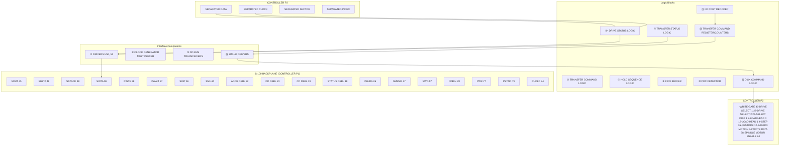

### Signal Definitions and Pin Numbers

<table>
    <tr>
        <th>Signal Name</th>
        <th>Pin Number</th>
        <th>Source/Destination</th>
    </tr>
    <tr>
        <td>-SEPARATED DATA</td>
        <td>48</td>
        <td>P3</td>
    </tr>
    <tr>
        <td>-SEPARATED CLOCK</td>
        <td>50</td>
        <td>P3</td>
    </tr>
    <tr>
        <td>-SEPARATED SECTOR</td>
        <td>20</td>
        <td>P3</td>
    </tr>
    <tr>
        <td>-SEPARATED INDEX</td>
        <td>8</td>
        <td>P3</td>
    </tr>
    <tr>
        <td>-SEEK COMPLETE</td>
        <td>10</td>
        <td>ROLLER OM</td>
    </tr>
    <tr>
        <td>-READY 0</td>
        <td>22</td>
        <td>ROLLER OM</td>
    </tr>
    <tr>
        <td>-READY 1</td>
        <td>6</td>
        <td>ROLLER OM</td>
    </tr>
    <tr>
        <td>RSECT</td>
        <td>32</td>
        <td>Internal</td>
    </tr>
    <tr>
        <td>-WRITE DATA</td>
        <td>(P2-Pin 38)</td>
        <td>Controller P2</td>
    </tr>
    <tr>
        <td>SYNC ERROR</td>
        <td>6</td>
        <td>Transfer Status</td>
    </tr>
    <tr>
        <td>OVER INDEX</td>
        <td>10</td>
        <td>Transfer Status</td>
    </tr>
    <tr>
        <td>CRCERR</td>
        <td>24</td>
        <td>Transfer Status</td>
    </tr>
    <tr>
        <td>RMC</td>
        <td>42</td>
        <td>Transfer Status</td>
    </tr>
    <tr>
        <td>TEXT</td>
        <td>14</td>
        <td>Transfer Status</td>
    </tr>
    <tr>
        <td>CROSSOVER</td>
        <td>30</td>
        <td>Transfer Command</td>
    </tr>
    <tr>
        <td>DATA(HEADER)</td>
        <td>16</td>
        <td>Transfer Command</td>
    </tr>
    <tr>
        <td>SETHOLD RQST</td>
        <td>46</td>
        <td>Hold Sequence</td>
    </tr>
    <tr>
        <td>RCLOCK</td>
        <td>22</td>
        <td>Clock Gen</td>
    </tr>
    <tr>
        <td>RDATA</td>
        <td>44</td>
        <td>Clock Gen</td>
    </tr>
    <tr>
        <td>Φ 2</td>
        <td>24</td>
        <td>S-100</td>
    </tr>
    <tr>
        <td>XRDY</td>
        <td>3</td>
        <td>S-100</td>
    </tr>
    <tr>
        <td>PRDY</td>
        <td>72</td>
        <td>S-100</td>
    </tr>
    <tr>
        <td>PHLDA</td>
        <td>26</td>
        <td>S-100</td>
    </tr>
    <tr>
        <td>PHOLD</td>
        <td>74</td>
        <td>S-100</td>
    </tr>
    <tr>
        <td>POC</td>
        <td>99</td>
        <td>POC Detector</td>
    </tr>
    <tr>
        <td>SINP</td>
        <td>46</td>
        <td>I/O Port Decoder</td>
    </tr>
    <tr>
        <td>PDBIN</td>
        <td>78</td>
        <td>I/O Port Decoder</td>
    </tr>
    <tr>
        <td>PWR</td>
        <td>77</td>
        <td>I/O Port Decoder</td>
    </tr>
    <tr>
        <td>SOUT</td>
        <td>45</td>
        <td>I/O Port Decoder</td>
    </tr>
</table>

### Disk Command Logic (⑭) Outputs to Controller P2

*   **-WRITE GATE**: 40
*   **-DRIVE SELECT 1**: 28
*   **-DRIVE SELECT 2**: 26
*   **-SELECT DISK 1**: 2
*   **-LOAD HEAD 0**: 18
*   **-LOAD HEAD 1**: 4
*   **-STEP**: 36
*   **-RESTORE**: 12
*   **-INWARD MOTION**: 34
*   **-WRITE DATA**: 38
*   **-SPINDLE MOTOR ENABLE**: 24

### S-100 Backplane Interface (Controller P1)

*   **SOUT**: 45
*   **SHLTA**: 48
*   **SSTACK**: 98
*   **SINTA**: 96
*   **PINTE**: 28
*   **PWAIT**: 27
*   **SINP**: 46
*   **SM1**: 44
*   **ADDR DSBL**: 22
*   **DO DSBL**: 23
*   **CC_DSBL**: 19
*   **STATUS DSBL**: 18
*   **PHLDA**: 26
*   **SMEMR**: 47
*   **SWO**: 97
*   **PDBIN**: 78
*   **PWR**: 77
*   **PSYNC**: 76
*   **PHOLD**: 74

### Notes
*   **RESISTOR NET U3-14**: Connected to DMAOFF (Pin 34) and (P2-Pin 40).
*   **CLOCK GENERATOR MULTIPLEXER (⑥)**: Outputs CLOCK 0 (Pin 26), CLOCK 2 (Pin 40), and MAIN CLOCK (Pin 36) to Controller PCB.
*   **FIFO BUFFER (⑧)**: Handles serial data during write (Pin 12).

```mermaid
graph TD
    subgraph "System Block Diagram"
        direction LR
        
        CONTROLLER_P1["CONTROLLER P1OUT TO S-100BACKPLANE"]
        
        SECTOR_INDEX_LOGIC["(15)SECTOR/INDEXLOGIC"]
        
        MISSING_CLOCK["(16)MISSINGCLOCKDETECTOR/CLOCKCONDITIONER"]
        
        READ_DATA_CONDITIONER["(17)READ DATACONDITIONER"]
        
        SYNC_DETECTOR["(18)SYNC DETECTOR"]
        
        STATE_COUNTER_LOGIC["(19)STATECOUNTERLOGICSEE FIG. 7-4"]
        
        WRITE_MULTIPLEXER["(20)WRITEMULTIPLEXER"]
        
        CRC_GENERATOR["(21)CRC GENERATORDETECTOR"]
        
        INDICATOR_PANEL["(22)INDICATORPANEL PCB"]
        
        DISKETTE_DRIVE["(23)DISKETTEDRIVEASSEMBLYSEE FIG. 8-16"]

        %% Connections
        CONTROLLER_P1 --> SECTOR_INDEX_LOGIC
        SECTOR_INDEX_LOGIC --> MISSING_CLOCK
        MISSING_CLOCK --> READ_DATA_CONDITIONER
        READ_DATA_CONDITIONER --> SYNC_DETECTOR
        SYNC_DETECTOR --> STATE_COUNTER_LOGIC
        STATE_COUNTER_LOGIC --> WRITE_MULTIPLEXER
        WRITE_MULTIPLEXER --> CRC_GENERATOR
        DISKETTE_DRIVE --> INDICATOR_PANEL
    end
```

\* See Table 8-3 For IC's Represented By Functional Blocks.
Arrows With Circled Numbers Indicate Connection To Or From Block With Matching Number. Arrows With Circled Numbers Indicate Connection To Or From Block With Matching Number.
Number Of Signals In A Bus. Number Of Signals In A Bus.

2 Helios II

Fig. 8-17 System Block Diagram (I-3-78)

Exploded view engineering drawing of an electronic assembly with numbered callouts for components and fasteners.

See Parts List, Section 9, for key to encircled item numbers

Exploded view engineering drawing of Cabinet Assembly, Model 4, showing various components like the cover, base, and internal wiring with numbered callouts.

**NOTES:**

1 UNLESS OTHERWISE SPECIFIED:
ALL FLAT WASHERS ARE ITEM <sup>25</sup>
ALL LOCK WASHERS ARE ITEM <sup>19</sup>
ALL SCREWS ARE ITEM <sup>14</sup>

<sup>1</sup> INSTALL DRIVE SELECTORS DURING PRODUCTION TEST.

2 Helios II

Fig. 8-18 Cabinet Assembly, Model 4, Exploded

Engineering assembly drawing showing internal components of an electronic device, including a transformer (2), circuit board (1), wiring harnesses, and chassis (4). Callouts indicate parts and quantities (e.g., 19 2 PL, 20 4 PL). The drawing includes a coordinate grid with letters A-D and numbers 5-8.

Exploded view diagram of Base Assembly, Model 4, showing components with callout numbers 3, 15, 21, and 27. The diagram includes a coordinate grid with numbers 1-4 and letters A-D.

See Parts List, Section 9, for key to encircled item numbers

2 Helios II

Fig. 8-19 Base Assembly, Model 4, Exploded

Engineering assembly drawing showing an exploded view of a device with components labeled 3, 5, and 8, including screws, spacers, and a circuit board with "PIN 1 (REF)" and "Helios II" text. The drawing includes a grid with coordinates A, B, C, D and 3, 4.

Exploded view engineering drawing of Bezel Assembly, Model 4, showing components labeled with encircled numbers 1, 2, 4, 6, 7, 9, and 10, along with assembly notes.

NOTES:

<sup>1</sup> SOLDER ITEM 8 TO ITEM 4 BEFORE ITEM 4 IS MOUNTED TO ITEM 1.

<sup>2</sup> MOUNT AND SOLDER D3, D4, R3, R4 (ITEMS 9 AND 10) ON P.C. BOARD (ITEM 4) BEFORE MOUNTING ITEM 4 TO ITEM 1.

See Parts List, Section 9, for key to encircled item numbers

2 Helios II

Fig. 8-20 Bezel Assembly, Model 4, Exploded

Engineering assembly drawing showing an exploded view of a device chassis with various components including lenses (5, 7, 8), screws (15, 17, 14), washers (23), and electrical components (29, 31, 3). The drawing includes grid coordinates A-D and 5-8.

Exploded view engineering drawing of Rear Panel Assembly, Model 4, showing fans, mounting hardware, and chassis components with numbered callouts.

NOTES:
1. FOR AC POWER INTERCONNECT CABLE ITEM <sup>2</sup>, INSTALLATION REFER TO WIRING DIAGRAM 300006.

See Parts List, Section 9, for key to encircled item numbers

2 Helios II

Fig. 8-21 Rear Panel Assembly, Model 4, Exploded

Engineering drawing showing a detailed assembly of electronic components, including capacitors (C1, C3, C4, C5, C6, C7, C9, C11), resistors (R1, R2, R3), diodes (D1, D3, DZ), and integrated circuits or transistors (U1, U2, U3, U4). It includes a cross-sectional view labeled "DETAIL A-A" at the top, showing mounting hardware and component profiles. The main view shows a large circular component (C1) and a wiring harness with color-coded wires (BLUE, RED, WHITE, GREEN, YELLOW) connected to various terminals (G1-G5, TZ, 8A-8C, 5A-5C, G8, etc.). The drawing is marked with grid coordinates (8, 7, 6, 5 on the horizontal axis and A, B, C, D on the vertical axis) and various reference callouts in circles.

Engineering drawing of Regulator PCB Assembly, Model 4 showing component layout and assembly notes.

**NOTES:**

1. THERMAL COMPOUND, ITEM 37, IS TO BE PLACED BETWEEN HEATSINK AND ALL COMPONENTS WHICH ARE MOUNTED TO THE HEATSINK.
2. <sup>2</sup> MARK REV LETTER WITH INDELLIBLE INK IN APPROXIMATE AREA SHOWN.
3. <sup>3</sup> MARK ASSY NO. "304025" IN APPROXIMATE AREA SHOWN.

See Parts List, Section 9, for key to encircled item numbers

2 Helios II
Fig. 8-22 Regulator PCB Assembly, Model 4

# CONTENTS

## SECTION 9 APPENDIX

<table>
  <thead>
    <tr>
        <th> </th>
        <th>PAGE</th>
    </tr>
  </thead>
  <tbody>
    <tr>
        <td>DISK SYSTEM TEST, LISTING OF I/O ROUTINES</td>
        <td>9-1</td>
    </tr>
    <tr>
        <td>IC PIN CONFIGURATIONS</td>
        <td>9-3</td>
    </tr>
    <tr>
        <td>PARTS LISTS, MODEL 2</td>
        <td>9-8</td>
    </tr>
    <tr>
        <td>System Assembly (Ref. Fig. 8-1)</td>
        <td>9-8</td>
    </tr>
    <tr>
        <td>Cabinet Assembly (Ref. Fig. 8-2)</td>
        <td>9-9</td>
    </tr>
    <tr>
        <td>Base Assembly (Ref. Fig. 8-3)</td>
        <td>9-10</td>
    </tr>
    <tr>
        <td>Bezel Assembly (Ref. Fig. 8-4)</td>
        <td>9-10</td>
    </tr>
    <tr>
        <td>Rear Panel Assembly (Ref. Fig. 8-5)</td>
        <td>9-11</td>
    </tr>
    <tr>
        <td>Controller PCB Assembly (Ref. Fig. 8-6)</td>
        <td>9-12</td>
    </tr>
    <tr>
        <td>Formatter PCB Assembly (Ref. Fig. 8-7)</td>
        <td>9-14</td>
    </tr>
    <tr>
        <td>Regulator PCB Assembly (Ref. Fig. 8-8)</td>
        <td>9-15</td>
    </tr>
    <tr>
        <td>Indicator PCB Assembly (Ref. Fig. 8-9)</td>
        <td>9-16</td>
    </tr>
    <tr>
        <td>PARTS LISTS, MODEL 4</td>
        <td>9-17</td>
    </tr>
    <tr>
        <td>System Assembly, Model 4 (Ref. Fig. 8-1)</td>
        <td>9-17</td>
    </tr>
    <tr>
        <td>Cabinet Assembly, Model 4 (Ref. Fig. 8-18)</td>
        <td>9-18</td>
    </tr>
    <tr>
        <td>Base Assembly, Model 4 (Ref. Fig. 8-19)</td>
        <td>9-19</td>
    </tr>
    <tr>
        <td>Bezel Assembly, Model 4 (Ref. Fig. 8-20)</td>
        <td>9-19</td>
    </tr>
    <tr>
        <td>Rear Panel Assembly, Model 4 (Ref. Fig. 8-21)</td>
        <td>9-20</td>
    </tr>
    <tr>
        <td>Regulator PCB Assembly, Model 4 (Ref. 8-22)</td>
        <td>9-21</td>
    </tr>
  </tbody>
</table>

# DISK SYSTEM TEST, LISTING OF I/O ROUTINES

```
                  0000          LST
                  0000 *
                  0000 * THIS JUMP TABLE PROVIDES STANDARD ENTRY
                  0000 * POINTS FOR TEST START-UP AND INPUT/OUTPUT.
                  0000 *
                  0000 *
0006 C3 45 00     0000 BEGIN    JMP      START     TEST ENTRY POINT
                  0000 *
0009 C3 49 11     0000 OSOUT    JMP      CHOUT     CHAR. OUTPUT
                  0000 *
000C C3 53 11     0000 OSIN     JMP      CHIN      CHAR./STATUS CHECK
                  0000 *
000F C3 64 11     0000 INA      JMP      INPUT     STANDARD CHAR. INPUT
                  0000 *
0012 C3 90 11     0000 EORMS    JMP      EXIT      RETURN TO SOLOS/CUTER
                  0000 *
                  0000 *
                  0000          LST
                  0000 * THIS ROUTINE OUTPUTS THE CHAR. IN REG. B
                  0000 * TO THE PSEUDO-PORT DEFINED BY PPORT.
                  0000 *
                  0000 CHOUT    PUSH     D         KEEP IT CLEAN
                  0000          LXI      D,AOUT    ENTRY TABLE OFFSET
                  0000          LDA      PPORT     PSEUDO-PORT #
                  0000          JMP      OSIO
                  0000 *
                  0000 * THIS ROUTINE GETS A CHAR. OR STATUS FROM
                  0000 * THE DEFAULT PSEUDO-PORT. ON RETURN IF THE
                  0000 * ZERO FLAG IS SET REG. A CONTAINS THE CHAR.
                  0000 * ZERO FLAG RESET INDICATES NO CHAR.
                  0000 *
                  0000 CHIN     PUSH     D         KEEP IT CLEAN
                  0000          LXI      D,SINP    ENTRY TABLE OFFSET
                  0000 *
                  0000 * THIS ROUTINE COMPUTES THE ENTRY POINT
                  0000 * ADDRESS, PUTS A RETURN ADDRESS ON THE
                  0000 * STACK, AND JUMPS TO THE ENTRY POINT.
                  0000 *
                  0000 OSIO     PUSH     H         KEEP IT CLEAN TOO
                  0000          LHLD     IOTAB     ENTRY TABLE ADDRESS
                  0000          DAD      D         HL=ENTRY ADDRESS
                  0000          LXI      D,IORTN   OUR RETURN ADDRESS
                  0000          PUSH     D         ONTO STACK
                  0000          PCHL     .         TO I/O ENTRY POINT
                  0000 *
                  0000 * SOLOS/CUTER RETURNS TO THIS POINT WHEN
                  0000 * IT HAS FINISHED PROCESSING AN I/O CALL.
                  0000 *
                  0000 IORTN    POP      H         IT'S CLEAN
                  0000          POP      D         IT'S CLEAN TOO
                  0000          RET      .         I/O FINISHED
                  0000 *
```

<page_number>2</page_number>

9-1

Helios II

DISK SYSTEM TEST, LISTING OF I/O ROUTINES (Continued)

```
0000 * THIS ROUTINE WAITS FOR A CHAR. FROM THE
0000 *DEFAULT PSEUDO-PORT. THEN SETS BIT 7 TO
0000 *ZERO, CHECKS FOR AN ESCAPE, AND RETURNS
0000 *WITH THE CHAR. IN REG. B.
0000 *
0000 INPUT    CALL     OSIN     GET CHAR. OR STATUS
0000          JZ       INPUT    NO CHAR. YET
0000 INB      ANI      7FH      SET BIT 7 TO 0
0000          CPI      1BH      ESCAPE ?
0000          JZ       EORMS    YES. GO PROCESS IT
0000          MOV      B,A      NO. PUT CHAR IN REG. B.
0000          RET      .        FINISHED
0000 *
0000          LST
0000 *
0000 * THIS ROUTINE JUMPS TO THE SOLOS/CUTER
0000 * RE-ENTRY POINT.
0000 *
0000 EXIT     LHLD     IOTAB    HL=ENTRY TABLE ADDRESS
0000          INX      H
0000          INX      H
0000          INX      H
0000          INX      H        HL=RE-ENTRY POINT
0000          PCHL     .        JUMP TO SOLOS/CUTER
0000 *
```

<page_number>

2
</page_number>

9-2

Helios II

9-4 IC PIN CONFIGURATIONS

# 74LS00

QUADRUPLE 2-INPUT POSITIVE-NAND GATES

positive logic:

Y = $\overline{AB}$

74LS00 pin configuration diagram

**SN5400 (J)** SN7400 (J, N)
**SN54H00 (J)** SN74H00 (J, N)
**SN54L00 (J)** SN74L00 (J, N)
**SN54LS00 (J, W)** SN74LS00 (J, N)
**SN54S00 (J, W)** SN74S00 (J, N)

# 74LS02

QUADRUPLE 2-INPUT POSITIVE-NOR GATES

positive logic:

Y = $\overline{A+B}$

74LS02 pin configuration diagram

**SN5402 (J)** SN7402 (J, N)
**SN54L02 (J)** SN74L02 (J, N)
**SN54LS02 (J, W)** SN74LS02 (J, N)
**SN54S02 (J, W)** SN74S02 (J, N)

# 74LS04

HEX INVERTERS

positive logic:

Y = $\overline{A}$

74LS04 pin configuration diagram

**SN5404 (J)** SN7404 (J, N)
**SN54H04 (J)** SN74H04 (J, N)
**SN54L04 (J)** SN74L04 (J, N)
**SN54LS04 (J, W)** SN74LS04 (J, N)
**SN54S04 (J, W)** SN74S04 (J, N)

# 74LS08

QUADRUPLE 2-INPUT POSITIVE-AND GATES

positive logic:

Y = AB

74LS08 pin configuration diagram

**SN5408 (J, W)** SN7408 (J, N)
**SN54LS08 (J, W)** SN74LS08 (J, N)
**SN54S08 (J, W)** SN74S08 (J, N)

# 74LS10

TRIPLE 3-INPUT POSITIVE-NAND GATES

positive logic:

Y = $\overline{ABC}$

74LS10 pin configuration diagram

**SN5410 (J)** SN7410 (J, N)
**SN64H10 (J)** SN74H10 (J, N)
**SN54L10 (J)** SN74L10 (J, N)
**SN54LS10 (J, W)** SN74LS10 (J, N)
**SN54S10 (J, W)** SN74S10 (J, N)

# 74LS11

TRIPLE 3-INPUT POSITIVE-AND GATES

positive logic:

Y = ABC

74LS11 pin configuration diagram

**SN54H11 (J)** SN74H11 (J, N)
**SN54LS11 (J, W)** SN74LS11 (J, N)
**SN54S11 (J, W)** SN74S11 (J, N)

# 74LS13

DUAL 4-INPUT POSITIVE-NAND SCHMITT TRIGGERS

positive logic:

Y = $\overline{ABCD}$

74LS13 pin configuration diagram

**SN5413 (J, W)** SN7413 (J, N)
**SN54LS13 (J, W)** SN74LS13 (J, N)

NC—No internal connection

# 74LS14

HEX SCHMITT-TRIGGER INVERTERS

positive logic:

Y = $\overline{A}$

74LS14 pin configuration diagram

**SN5414 (J, W)** SN7414 (J, N)
**SN54LS14 (J, W)** SN74LS14 (J, N)

<page_number>2</page_number>

9-3

Helios II

# 74LS20

**DUAL 4-INPUT POSITIVE-NAND GATES**

positive logic:

Y = ABCD

Logic diagram and pinout for 74LS20

<table>
  <tbody>
    <tr>
        <td>SN5420 (J)</td>
        <td>SN7420 (J, N)</td>
    </tr>
    <tr>
        <td>SN54H20 (J)</td>
        <td>SN74H20 (J, N)</td>
    </tr>
    <tr>
        <td>SN54L20 (J)</td>
        <td>SN74L20 (J, N)</td>
    </tr>
    <tr>
        <td>SN54LS20 (J, W)</td>
        <td>SN74LS20 (J, N)</td>
    </tr>
    <tr>
        <td>SN54S20 (J, W)</td>
        <td>SN74S20 (J, N)</td>
    </tr>
  </tbody>
</table>

# 74LS86 Quad 2-Input Exclusive-OR Gates

<table>
  <thead>
    <tr>
        <th colspan="2">INPUTS</th>
        <th>OUTPUT</th>
    </tr>
    <tr>
        <th>A</th>
        <th>B</th>
        <th>Y</th>
    </tr>
  </thead>
  <tbody>
    <tr>
        <td>L</td>
        <td>L</td>
        <td>L</td>
    </tr>
    <tr>
        <td>L</td>
        <td>H</td>
        <td>H</td>
    </tr>
    <tr>
        <td>H</td>
        <td>L</td>
        <td>H</td>
    </tr>
    <tr>
        <td>H</td>
        <td>H</td>
        <td>L</td>
    </tr>
  </tbody>
</table>

H = high level, L = low level

Logic diagram and pinout for 74LS86

SN54L86 (J) SN74L86 (J, N)

# 74LS109

**DUAL J-K POSITIVE-EDGE-TRIGGERED FLIP-FLOPS WITH PRESET AND CLEAR**

FUNCTION TABLE

<table>
  <thead>
    <tr>
        <th colspan="5">INPUTS</th>
        <th colspan="2">OUTPUTS</th>
    </tr>
    <tr>
        <th>PRESET</th>
        <th>CLEAR</th>
        <th>CLOCK</th>
        <th>J</th>
        <th>K</th>
        <th>Q</th>
        <th>Q<sub>0</sub></th>
    </tr>
  </thead>
  <tbody>
    <tr>
        <td>L</td>
        <td>H</td>
        <td>X</td>
        <td>X</td>
        <td>X</td>
        <td>H</td>
        <td>L</td>
    </tr>
    <tr>
        <td>H</td>
        <td>L</td>
        <td>X</td>
        <td>X</td>
        <td>X</td>
        <td>L</td>
        <td>H</td>
    </tr>
    <tr>
        <td>L</td>
        <td>L</td>
        <td>X</td>
        <td>X</td>
        <td>X</td>
        <td>H*</td>
        <td>H*</td>
    </tr>
    <tr>
        <td>H</td>
        <td>H</td>
        <td>↑</td>
        <td>L</td>
        <td>L</td>
        <td>L</td>
        <td rowspan="2">H</td>
    </tr>
    <tr>
        <td>H</td>
        <td>H</td>
        <td>↑</td>
        <td>H</td>
        <td>L</td>
        <td>TOGGLE</td>
    </tr>
    <tr>
        <td>H</td>
        <td>H</td>
        <td>↑</td>
        <td>L</td>
        <td>H</td>
        <td>Q<sub>0</sub></td>
        <td>Q<sub>0</sub></td>
    </tr>
    <tr>
        <td>H</td>
        <td>H</td>
        <td>↑</td>
        <td>H</td>
        <td>H</td>
        <td>H</td>
        <td>L</td>
    </tr>
    <tr>
        <td>H</td>
        <td>H</td>
        <td>L</td>
        <td>X</td>
        <td>X</td>
        <td>Q<sub>0</sub></td>
        <td>Q<sub>0</sub></td>
    </tr>
  </tbody>
</table>

Logic diagram and pinout for 74LS109

# 74LS123

**DUAL RETRIGGERABLE MONOSTABLE MULTIVIBRATORS WITH CLEAR**

FUNCTION TABLE

<table>
  <thead>
    <tr>
        <th colspan="3">INPUTS</th>
        <th colspan="2">OUTPUTS</th>
    </tr>
    <tr>
        <th>CLEAR</th>
        <th>A</th>
        <th>B</th>
        <th>Q</th>
        <th>Q</th>
    </tr>
  </thead>
  <tbody>
    <tr>
        <td>L</td>
        <td>X</td>
        <td>X</td>
        <td>L</td>
        <td>H</td>
    </tr>
    <tr>
        <td>X</td>
        <td>H</td>
        <td>X</td>
        <td>L</td>
        <td>H</td>
    </tr>
    <tr>
        <td>X</td>
        <td>X</td>
        <td>L</td>
        <td>L</td>
        <td>H</td>
    </tr>
    <tr>
        <td>H</td>
        <td>L</td>
        <td>↑</td>
        <td>Ω</td>
        <td>V</td>
    </tr>
    <tr>
        <td>H</td>
        <td>↓</td>
        <td>H</td>
        <td>Ω</td>
        <td>V</td>
    </tr>
    <tr>
        <td>↑</td>
        <td>L</td>
        <td>H</td>
        <td>Ω</td>
        <td>V</td>
    </tr>
  </tbody>
</table>

Logic diagram and pinout for 74LS123

# 74LS138 3-8 Line Decoder

Logic diagram and pinout for 74LS138

# 74LS139 Dual 2-to-4 Line Decoder

Logic diagram and pinout for 74LS139

# 74LS151

**1-OF-8 DATA SELECTORS/MULTIPLEXERS**

Logic diagram and pinout for 74LS151

<page_number>2</page_number>

9-4

Helios II

74LS153

74LS157

# DUAL 4-LINE TO 1-LINE DATA SELECTORS/MULTIPLEXERS

74LS157 Quad 2-to-1 Line Multiplexer
74LS158 Quad 2-to-1 Line Multiplexer, with Inverted Outputs

Pinout and logic diagram for 74LS153 Dual 4-Line to 1-Line Data Selectors/Multiplexers

Pinout and logic diagram for 74LS157 and 74LS158 Quad 2-to-1 Line Multiplexers

<table>
  <tbody>
    <tr>
        <td>SN54153 (J, W)</td>
        <td>SN74153 (J, N)</td>
    </tr>
    <tr>
        <td>SN54L153 (J)</td>
        <td>SN74L153 (J, N)</td>
    </tr>
    <tr>
        <td>SN54LS153 (J, W)</td>
        <td>SN74LS153 (J, N)</td>
    </tr>
    <tr>
        <td>SN54S153 (J, W)</td>
        <td>SN74S153 (J, N)</td>
    </tr>
  </tbody>
</table>
<table>
  <tbody>
    <tr>
        <td>SN54157 (J, W)</td>
        <td>SN74157 (J, N)</td>
    </tr>
    <tr>
        <td>SN54L157 (J)</td>
        <td>SN74L157 (J, N)</td>
    </tr>
    <tr>
        <td>SN54LS157 (J, W)</td>
        <td>SN74LS157 (J, N)</td>
    </tr>
    <tr>
        <td>SN54S157 (J, W)</td>
        <td>SN74S157 (J, N)</td>
    </tr>
    <tr>
        <td>SN54LS158 (J, W)</td>
        <td>SN74LS158 (J, N)</td>
    </tr>
    <tr>
        <td>SN54S158 (J, W)</td>
        <td>SN74S158 (J, N)</td>
    </tr>
  </tbody>
</table>

## 74LS163 Synchronous 4-Bit Binary Counter

## 74LS174 Hex D Flipflop

Pinout and logic diagram for 74LS163 Synchronous 4-Bit Binary Counter

Pinout and logic diagram for 74LS174 Hex D Flipflop

<table>
  <tbody>
    <tr>
        <td>SN54160 (J, W)</td>
        <td>SN74160 (J, N)</td>
    </tr>
    <tr>
        <td>SN54LS160A (J, W)</td>
        <td>SN74LS160A (J, N)</td>
    </tr>
    <tr>
        <td>SN54161 (J, W)</td>
        <td>SN74161 (J, N)</td>
    </tr>
    <tr>
        <td>SN54LS161A (J, W)</td>
        <td>SN74LS161A (J, N)</td>
    </tr>
    <tr>
        <td>SN54162 (J, W)</td>
        <td>SN74162 (J, N)</td>
    </tr>
    <tr>
        <td>SN54LS162A (J, W)</td>
        <td>SN74LS162A (J, N)</td>
    </tr>
    <tr>
        <td>SN54S162 (J, W)</td>
        <td>SN74S162 (J, N)</td>
    </tr>
    <tr>
        <td>SN54163 (J, W)</td>
        <td>SN74163 (J, N)</td>
    </tr>
    <tr>
        <td>SN54LS163A (J, W)</td>
        <td>SN74LS163A (J, N)</td>
    </tr>
    <tr>
        <td>SN54S163 (J, W)</td>
        <td>SN74S163 (J, N)</td>
    </tr>
  </tbody>
</table>
<table>
  <tbody>
    <tr>
        <td>SN54174 (J, W)</td>
        <td>SN74174 (J, N)</td>
    </tr>
    <tr>
        <td>SN54LS174 (J, W)</td>
        <td>SN74LS174 (J, N)</td>
    </tr>
    <tr>
        <td>SN54S174 (J, W)</td>
        <td>SN74S174 (J, N)</td>
    </tr>
  </tbody>
</table>

## 74LS175 Quad D Flipflop

## 74LS191 Synchronous Up/Down Counter

Pinout and logic diagram for 74LS175 Quad D Flipflop

Pinout and logic diagram for 74LS191 Synchronous Up/Down Counter

<table>
  <tbody>
    <tr>
        <td>SN54175 (J, W)</td>
        <td>SN74175 (J, N)</td>
    </tr>
    <tr>
        <td>SN54LS175 (J, W)</td>
        <td>SN74LS175 (J, N)</td>
    </tr>
    <tr>
        <td>SN54S175 (J, W)</td>
        <td>SN74S175 (J, N)</td>
    </tr>
  </tbody>
</table>
<table>
  <tbody>
    <tr>
        <td>SN54190 (J, W)</td>
        <td>SN74190 (J, N)</td>
    </tr>
    <tr>
        <td>SN54LS190 (J, W)</td>
        <td>SN74LS190 (J, N)</td>
    </tr>
    <tr>
        <td>SN54191 (J, W)</td>
        <td>SN74191 (J, N)</td>
    </tr>
    <tr>
        <td>SN54LS191 (J, W)</td>
        <td>SN74LS191 (J, N)</td>
    </tr>
  </tbody>
</table>

<page_number>2</page_number>

9-5

Helios. II

74LS279

## QUAD S-R LATCHES

DIODE-CLAMPED INPUTS
TOTEM-POLE OUTPUTS

### FUNCTION TABLE

<table>
  <thead>
    <tr>
        <th colspan="2">INPUTS</th>
        <th>OUTPUT</th>
    </tr>
    <tr>
        <th>S<sup>†</sup></th>
        <th>R</th>
        <th>Q</th>
    </tr>
  </thead>
  <tbody>
    <tr>
        <td>H</td>
        <td>H</td>
        <td>Q<sub>0</sub></td>
    </tr>
    <tr>
        <td>L</td>
        <td>H</td>
        <td>H</td>
    </tr>
    <tr>
        <td>H</td>
        <td>L</td>
        <td>L</td>
    </tr>
    <tr>
        <td>L</td>
        <td>L</td>
        <td>H*</td>
    </tr>
  </tbody>
</table>

H = high level

L = low level

Q<sub>0</sub> = the level of Q before the indicated input conditions were established.
\* This output level is pseudo stable; that is, it may not persist when the S and R inputs return to their inactive (high) level.

<sup>†</sup> For latches with double S inputs:

H = both S inputs high

L = one or both S inputs low

74LS279 Connection Diagram

SN54279 (J, W) SN74279 (J, N)
SN54LS279 (J, W) SN74LS279 (J, N)

## 74LS298 Quad 2-Input Multiplexer, with Storage

## 8T97 (74LS367) High Speed Hex Buffer/Inverter

74LS298 Connection Diagram

SN54298 (J, W) SN74298 (J, N)
SN54LS298 (J, W) SN74LS298 (J, N)

74LS367 Connection Diagram
SN54367A (J, W) SN74367A (J, N)
SN54LS367 (J, W) SN74LS367 (J, N)

## 9401 C.R.C. Generator

### LOGIC SYMBOL

9401 Logic Symbol

V<sub>CC</sub> = Pin 14
GND = Pin 7

### CONNECTION DIAGRAM DIP (TOP VIEW)

9401 Connection Diagram

Pins 6 and 9 not connected.

### BLOCK DIAGRAM

9401 Block Diagram

V<sub>CC</sub> = 14

GND = 7

2 9-6 Helios II

# 9403 4 x 16 FIFO Buffer

**LOGIC SYMBOL**

**CONNECTION DIAGRAM**
**DIP (TOP VIEW)**

9403 Logic Symbol

9403 Connection Diagram

V<sub>CC</sub> = Pin 24

GND = Pin 12

# 8833 Quad Tri-State Party Line Transceiver

8833 Logic Diagram and Pinout

Order Number DS7833J, DS8833J, DS8833N or DS7833W

## general description

This family of TRI-STATE Party Line Transceivers offer extreme versatility in bus organized data transmission systems. The data bus may be unterminated, or terminated dc or ac, at one or both ends. Drivers in the third (high impedance) state load the data bus with a negligible leakage current. The receiver input current is low allowing at least 100 driver/receiver pairs to utilize a single bus. The bus loading is unchanged when V<sub>CC</sub> = 0V. The receiver incorporates hysteresis to provide greater noise immunity. All devices utilize a high current TRI-STATE output driver. The DS7833/DS8833 and DS7835/DS8835 employ TRI-STATE outputs on the receiver also.

The DS7833/DS8833 are non-inverting quad transceivers with a common inverter driver disable control and a common inverter receiver disable control.

The DS7835/DS8835 are inverting quad transceivers with a common inverter driver disable control and a common inverter receiver disable control.

<page_number>2</page_number>

9-7

Helios II

# PARTS LISTS

## KEY NUMBERS

The encircled item numbers, in the first column of the parts list, refer to the encircled matching key numbers on the assembly drawings of the same name. Assembly drawings are found in Section 8, Drawings.

## STANDARD PARTS AND EQUIVALENTS

The standard vendor part number is underlined and is the first part number in the field called "Standard Vendor Part and Equivalent(s)." Equivalent parts, if any, follow the standard vendor part number.

## PARTS LIST - SYSTEM ASSEMBLY, MODEL 2 (301006A)

<table>
  <thead>
    <tr>
        <th>ITEM #</th>
        <th>PART #</th>
        <th>QTY</th>
        <th>DESCRIPTION</th>
    </tr>
  </thead>
  <tbody>
    <tr>
        <td>1</td>
        <td>301000</td>
        <td>1</td>
        <td>Assy, PCB, Controller, Helios II } Separate<br/>Parts List<br/>follows.</td>
    </tr>
    <tr>
        <td>2</td>
        <td>301003</td>
        <td>1</td>
        <td>Assy, PCB, Formatter }</td>
    </tr>
    <tr>
        <td>3</td>
        <td>301007</td>
        <td>1</td>
        <td>Assy Cable, Disk Controller/ }<br/>Formatter Interconnect</td>
    </tr>
    <tr>
        <td>4</td>
        <td>301009</td>
        <td>1</td>
        <td>Assy Cable, Disk Controller/Cabinet</td>
    </tr>
    <tr>
        <td>5</td>
        <td>300000</td>
        <td>1</td>
        <td>Cabinet Assembly (See separate parts list.)</td>
    </tr>
  </tbody>
</table>

<page_number>2</page_number>

9-8

Helios II

# PARTS LIST - CABINET ASSEMBLY, MODEL 2 (300000C)

<table>
  <thead>
    <tr>
        <th>ITEM #</th>
        <th>PART #</th>
        <th>QTY</th>
        <th>DESCRIPTION</th>
    </tr>
  </thead>
  <tbody>
    <tr>
        <td>1</td>
        <td>301006</td>
        <td>1</td>
        <td>Assy, Controller }<br/>Separate Parts List<br/>follows.</td>
    </tr>
    <tr>
        <td>2</td>
        <td>302004</td>
        <td>1</td>
        <td>Assy, Base }<br/>Separate Parts List<br/>follows.</td>
    </tr>
    <tr>
        <td>3</td>
        <td>306000</td>
        <td>1</td>
        <td>Assy, Bezel }<br/>Separate Parts List<br/>follows.</td>
    </tr>
    <tr>
        <td>4</td>
        <td>307000</td>
        <td>1</td>
        <td>Assy, Top Cover</td>
    </tr>
    <tr>
        <td>5</td>
        <td>305000</td>
        <td>1</td>
        <td>Assy, Rear Panel (See separate Parts List.)</td>
    </tr>
    <tr>
        <td>6</td>
        <td>730009</td>
        <td>1</td>
        <td><u>Helios II, Disk Memory System Manual</u><br/>(Includes <u>PTDOS User's Manual</u>)</td>
    </tr>
    <tr>
        <td>7</td>
        <td>722005</td>
        <td>1</td>
        <td>Disk Drv, Dual</td>
    </tr>
    <tr>
        <td>8</td>
        <td>718001</td>
        <td>1</td>
        <td>Cable, AC Pwr, 3 Wire</td>
    </tr>
    <tr>
        <td>9</td>
        <td>720003</td>
        <td>6</td>
        <td>PHMS, 4-40 x 5/16"</td>
    </tr>
    <tr>
        <td>10</td>
        <td>720016</td>
        <td>3</td>
        <td>PHMS, 6-32 x 1/4"</td>
    </tr>
    <tr>
        <td>11</td>
        <td>720069</td>
        <td>4</td>
        <td>PHMS, 8-32 x 5/8"</td>
    </tr>
    <tr>
        <td>12</td>
        <td>720018</td>
        <td>3</td>
        <td>PHMS, 6-32 x 7/16"</td>
    </tr>
    <tr>
        <td>13</td>
        <td>720041</td>
        <td>7</td>
        <td>ITLW, #6</td>
    </tr>
    <tr>
        <td>14</td>
        <td>720038</td>
        <td>8</td>
        <td>ITLW, #4</td>
    </tr>
    <tr>
        <td>15</td>
        <td>720051</td>
        <td>4</td>
        <td>ITLW, #8</td>
    </tr>
    <tr>
        <td>16</td>
        <td>720070</td>
        <td>6</td>
        <td>FW, Zinc, #4</td>
    </tr>
    <tr>
        <td>17</td>
        <td>720067</td>
        <td>3</td>
        <td>FW, #6</td>
    </tr>
    <tr>
        <td>18</td>
        <td>720072</td>
        <td>1</td>
        <td>Screw, 8-32 x 1", Blk Cap</td>
    </tr>
    <tr>
        <td>19</td>
        <td>300003</td>
        <td>1</td>
        <td>Label, Serial Number, Helios II</td>
    </tr>
    <tr>
        <td>20</td>
        <td>716016</td>
        <td>2</td>
        <td>Tubing, Shrink, 3/16 x 1"</td>
    </tr>
    <tr>
        <td>21</td>
        <td>720020</td>
        <td>1</td>
        <td>PHMS, 6-32 x 1/2"</td>
    </tr>
    <tr>
        <td>22</td>
        <td>720056</td>
        <td>2</td>
        <td>#4 Kep Nut</td>
    </tr>
    <tr>
        <td>23</td>
        <td>720005</td>
        <td>2</td>
        <td>PHMS, 4-40 x 1/2"</td>
    </tr>
    <tr>
        <td>24</td>
        <td>701109</td>
        <td>1</td>
        <td>Dual 4-Input AND, 74LS21</td>
    </tr>
    <tr>
        <td>25</td>
        <td>727030</td>
        <td>1</td>
        <td>PTDOS 1.4 System Diskette</td>
    </tr>
    <tr>
        <td>26</td>
        <td>722021</td>
        <td>1</td>
        <td>Flexible Disk, Blank</td>
    </tr>
    <tr>
        <td>27</td>
        <td>727026</td>
        <td>1</td>
        <td>Cassette, Disk Sys. Test</td>
    </tr>
    <tr>
        <td>101</td>
        <td>PERSCI-100026</td>
        <td>2</td>
        <td>Momentary Switch, Push.</td>
    </tr>
    <tr>
        <td>102</td>
        <td>720058</td>
        <td>2</td>
        <td>ITLW #12 (Part of 101)</td>
    </tr>
    <tr>
        <td>103</td>
        <td>—</td>
        <td>2</td>
        <td>#12 Hexnut (Part of 101)</td>
    </tr>
    <tr>
        <td>104</td>
        <td>—</td>
        <td>2</td>
        <td>Pushbutton switch cover (Part of 101)</td>
    </tr>
  </tbody>
</table>

<page_number>2</page_number>

9-9

Helios II

# PARTS LIST - BASE ASSEMBLY, MODEL 2 (302004D)

<table>
  <thead>
    <tr>
        <th><u>ITEM #</u></th>
        <th><u>PART #</u></th>
        <th><u>QTY</u></th>
        <th><u>DESCRIPTION</u></th>
    </tr>
  </thead>
  <tbody>
    <tr>
        <td>1</td>
        <td>302003</td>
        <td>1</td>
        <td>Fab, Base</td>
    </tr>
    <tr>
        <td>2</td>
        <td>302005</td>
        <td>1</td>
        <td>Trans., Pwr., Helios II</td>
    </tr>
    <tr>
        <td>3</td>
        <td>302000</td>
        <td>1</td>
        <td>Assy, PCB, Reg., Helios II (See separate<br/>parts list.)</td>
    </tr>
    <tr>
        <td>4</td>
        <td>302007</td>
        <td>1</td>
        <td>Fab, Bracket, Keyswitch</td>
    </tr>
    <tr>
        <td>5</td>
        <td>703033</td>
        <td>1</td>
        <td>MDA3500, DIO, Br. Rect. 50PIV, 35A</td>
    </tr>
    <tr>
        <td>6</td>
        <td>723006</td>
        <td>1</td>
        <td>Switch, AC Pwr, Key</td>
    </tr>
    <tr>
        <td>7</td>
        <td>720017</td>
        <td>3</td>
        <td>PHMS, 6-32 x 5/16"</td>
    </tr>
    <tr>
        <td>8</td>
        <td>720041</td>
        <td>8</td>
        <td>ITLW, #6</td>
    </tr>
    <tr>
        <td>9</td>
        <td>720048</td>
        <td>2</td>
        <td>Spacer, RND, CLR, #6 x 3/8"</td>
    </tr>
    <tr>
        <td>10</td>
        <td>720032</td>
        <td>4</td>
        <td>PHMS, 8-32 x 1/2"</td>
    </tr>
    <tr>
        <td>11</td>
        <td>720051</td>
        <td>4</td>
        <td>ITLW, #8</td>
    </tr>
    <tr>
        <td>12</td>
        <td>720022</td>
        <td>2</td>
        <td>PHMS, 6-32 x 3/4"</td>
    </tr>
    <tr>
        <td>14</td>
        <td>720018</td>
        <td>3</td>
        <td>PHMS, 6-32 x 7/16"</td>
    </tr>
    <tr>
        <td>15</td>
        <td>720050</td>
        <td>1</td>
        <td>Spacer, Insul., Cir. #4 x 1/8</td>
    </tr>
  </tbody>
</table>

# PARTS LIST - BEZEL ASSEMBLY, MODEL 2 (306000E)

<table>
  <thead>
    <tr>
        <th><u>ITEM #</u></th>
        <th><u>PART #</u></th>
        <th><u>QTY</u></th>
        <th><u>DESCRIPTION</u></th>
    </tr>
  </thead>
  <tbody>
    <tr>
        <td>1</td>
        <td>306001</td>
        <td>1</td>
        <td>Fab, Bezel, Helios II, One Drive</td>
    </tr>
    <tr>
        <td>2</td>
        <td>306003</td>
        <td>1</td>
        <td>Fab, Logo Panel, Helios II, Model 2</td>
    </tr>
    <tr>
        <td>3</td>
        <td>306005</td>
        <td>2</td>
        <td>Fab, Plex Retainer</td>
    </tr>
    <tr>
        <td>4</td>
        <td>300008</td>
        <td>1</td>
        <td>Assy, PCB, Indicator Panel (See separate<br/>parts list.)</td>
    </tr>
    <tr>
        <td>5</td>
        <td>720054</td>
        <td>4</td>
        <td>Spacer, 1/4" OD, 1/2" Long</td>
    </tr>
    <tr>
        <td>6</td>
        <td>720068</td>
        <td>4</td>
        <td>PHMS, 4-40 x 3/4</td>
    </tr>
    <tr>
        <td>7</td>
        <td>720001</td>
        <td>4</td>
        <td>PHMS, 4-40 x 3/16</td>
    </tr>
    <tr>
        <td>8</td>
        <td>720038</td>
        <td>8</td>
        <td>ITLW, #4</td>
    </tr>
    <tr>
        <td>9</td>
        <td>300011</td>
        <td>1</td>
        <td>Assy, Cable, Indicator/Signal</td>
    </tr>
  </tbody>
</table>

<page_number>2</page_number>

9-10

Helios II

# PARTS LIST - REAR PANEL ASSEMBLY, MODEL 2 (305000E)

Note: Item numbers correspond to the encircled key numbers on the exploded view of the rear panel, Fig. 8-5.

<table>
  <thead>
    <tr>
        <th>ITEM #</th>
        <th>PART #</th>
        <th>QTY</th>
        <th>DESCRIPTION</th>
    </tr>
  </thead>
  <tbody>
    <tr>
        <td>1</td>
        <td>305002</td>
        <td>1</td>
        <td>Rear Panel</td>
    </tr>
    <tr>
        <td>4</td>
        <td>305004</td>
        <td>1</td>
        <td>AC Power Interconn Cable</td>
    </tr>
    <tr>
        <td>5</td>
        <td>305008</td>
        <td>4</td>
        <td>Cover Plate D Connector</td>
    </tr>
    <tr>
        <td>6</td>
        <td>305014</td>
        <td>3</td>
        <td>Cover Plate, 50 Pin Conn</td>
    </tr>
    <tr>
        <td>7</td>
        <td>305010</td>
        <td>1</td>
        <td>Clamp</td>
    </tr>
    <tr>
        <td>10</td>
        <td>720001</td>
        <td>14</td>
        <td>PHMS, 4-40 x 3/16</td>
    </tr>
    <tr>
        <td>11</td>
        <td>720016</td>
        <td>2</td>
        <td>PHMS, 6-32 x 1/4</td>
    </tr>
    <tr>
        <td>12</td>
        <td>720041</td>
        <td>4</td>
        <td>ITLW, #6</td>
    </tr>
    <tr>
        <td>13</td>
        <td>720056</td>
        <td>2</td>
        <td>Nut, Kep, #4</td>
    </tr>
    <tr>
        <td>14</td>
        <td>720057</td>
        <td>3</td>
        <td>Nut, Kep, #6</td>
    </tr>
    <tr>
        <td>15</td>
        <td>105033</td>
        <td>1</td>
        <td>Fan, Assy, 3" Leads</td>
    </tr>
    <tr>
        <td>16</td>
        <td>720011</td>
        <td>4</td>
        <td>Hex nut, 6-32</td>
    </tr>
    <tr>
        <td>17</td>
        <td>723013</td>
        <td>1</td>
        <td>Fuse, Cart, 7A, SLO BLO</td>
    </tr>
    <tr>
        <td>18</td>
        <td>723018</td>
        <td>1</td>
        <td>Fuse, Cart, 3.2A, SLO BLO</td>
    </tr>
    <tr>
        <td>19</td>
        <td>305006</td>
        <td>1</td>
        <td>Filter, EMI</td>
    </tr>
    <tr>
        <td>20</td>
        <td>724003</td>
        <td>3</td>
        <td>Outlet, AC, Aux</td>
    </tr>
    <tr>
        <td>21</td>
        <td>724005</td>
        <td>2</td>
        <td>Comm Block, AC, 5 POS</td>
    </tr>
    <tr>
        <td>22</td>
        <td>724007</td>
        <td>2</td>
        <td>Fuse Holder, Cart, 3AG</td>
    </tr>
    <tr>
        <td>23</td>
        <td>720066</td>
        <td>4</td>
        <td>Insert 1/4" Round</td>
    </tr>
    <tr>
        <td>24</td>
        <td>720065</td>
        <td>1</td>
        <td>Insert 5/8" Round</td>
    </tr>
    <tr>
        <td>25</td>
        <td>720064</td>
        <td>1</td>
        <td>Insert 3" Round</td>
    </tr>
    <tr>
        <td>27</td>
        <td>720002</td>
        <td>2</td>
        <td>PHMS, 4-40 x 1/4"</td>
    </tr>
    <tr>
        <td>28</td>
        <td>305009</td>
        <td>1</td>
        <td>Filter Frame</td>
    </tr>
    <tr>
        <td>29</td>
        <td>305011</td>
        <td>1</td>
        <td>Filter Element</td>
    </tr>
    <tr>
        <td>30</td>
        <td>305012</td>
        <td>1</td>
        <td>Filter Screen</td>
    </tr>
    <tr>
        <td>26</td>
        <td>720038</td>
        <td>2</td>
        <td>ITLW, #4</td>
    </tr>
  </tbody>
</table>

<page_number>2</page_number>

9-11

Helios II

PARTS LIST - CONTROLLER PCB ASSEMBLY (301000G)

<table>
  <thead>
    <tr>
        <th>ITEM #</th>
        <th>PART #</th>
        <th>QTY</th>
        <th>REFERENCE CODE</th>
        <th>STANDARD PART # &amp; EQUIVALENT(S)</th>
        <th>DESCRIPTION</th>
    </tr>
  </thead>
  <tbody>
    <tr>
        <td>①</td>
        <td>301001</td>
        <td>1</td>
        <td> </td>
        <td> </td>
        <td>Fab, PCB, Controller, REV C</td>
    </tr>
    <tr>
        <td>4</td>
        <td>301002</td>
        <td>REF</td>
        <td> </td>
        <td> </td>
        <td>Schematic Dia, Controller</td>
    </tr>
    <tr>
        <td>6</td>
        <td>701090</td>
        <td>2</td>
        <td>U18,21</td>
        <td>74LS00</td>
        <td>Quad 2-Input NAND</td>
    </tr>
    <tr>
        <td>7</td>
        <td>701092</td>
        <td>1</td>
        <td>U19</td>
        <td>74LS02, 9LS02</td>
        <td>Quad 2-Input NOR</td>
    </tr>
    <tr>
        <td>8</td>
        <td>701094</td>
        <td>1</td>
        <td>U6</td>
        <td>74LS04</td>
        <td>Hex Inverter</td>
    </tr>
    <tr>
        <td>9</td>
        <td>701098</td>
        <td>3</td>
        <td>UØ,12,36</td>
        <td>74LS08</td>
        <td>Quad 2-Input AND</td>
    </tr>
    <tr>
        <td>10</td>
        <td>701100</td>
        <td>1</td>
        <td>U35</td>
        <td>74LS10</td>
        <td>Triple 3-Input NAND</td>
    </tr>
    <tr>
        <td>11</td>
        <td>701102</td>
        <td>1</td>
        <td>U17</td>
        <td>74LS11</td>
        <td>Triple 3-Input AND</td>
    </tr>
    <tr>
        <td>12</td>
        <td>701104</td>
        <td>2</td>
        <td>U8,23</td>
        <td>74LS13</td>
        <td>Dual 4-Input NAND</td>
    </tr>
    <tr>
        <td>13</td>
        <td>701106</td>
        <td>1</td>
        <td>U7</td>
        <td>74LS14</td>
        <td>Hex Inv, Schmitt</td>
    </tr>
    <tr>
        <td>14</td>
        <td>701118</td>
        <td>1</td>
        <td>U40</td>
        <td>74LS86</td>
        <td>Quad 2-Input EX-OR</td>
    </tr>
    <tr>
        <td>15</td>
        <td>701120</td>
        <td>5</td>
        <td>U2,10,20,<br/>U37,39</td>
        <td>74LS109</td>
        <td>Dual J-K FF</td>
    </tr>
    <tr>
        <td>16</td>
        <td>701122</td>
        <td>1</td>
        <td>U15</td>
        <td>74LS123</td>
        <td>Dual Retrig One-Shot</td>
    </tr>
    <tr>
        <td>17</td>
        <td>701128</td>
        <td>1</td>
        <td>U42</td>
        <td>74LS138</td>
        <td>3-to-8 Line Decoder</td>
    </tr>
    <tr>
        <td>18</td>
        <td>701130</td>
        <td>2</td>
        <td>U14,16</td>
        <td>74LS139</td>
        <td>Dual 2-to-4 Line Decoder</td>
    </tr>
    <tr>
        <td>19</td>
        <td>701138</td>
        <td>2</td>
        <td>U13,34</td>
        <td>74LS157</td>
        <td>Quad 2-to-1 Line MPX</td>
    </tr>
    <tr>
        <td>20</td>
        <td>701140</td>
        <td>1</td>
        <td>U11</td>
        <td>74LS158</td>
        <td>Quad 2-Input Inv MPX</td>
    </tr>
    <tr>
        <td>21</td>
        <td>701142</td>
        <td>1</td>
        <td>U5</td>
        <td>74LS163</td>
        <td>Synch 4 Bit Bin CNTR</td>
    </tr>
    <tr>
        <td>22</td>
        <td>701144</td>
        <td>1</td>
        <td>U31</td>
        <td>74LS174</td>
        <td>Hex D FF</td>
    </tr>
    <tr>
        <td>23</td>
        <td>701146</td>
        <td>2</td>
        <td>U1,38</td>
        <td>74LS175, 25LS175</td>
        <td>Quad D FF</td>
    </tr>
    <tr>
        <td>24</td>
        <td>701148</td>
        <td>7</td>
        <td>U24-30</td>
        <td>74LS191</td>
        <td>Synch UP/DN CNTR</td>
    </tr>
    <tr>
        <td>25</td>
        <td>701152</td>
        <td>1</td>
        <td>U33</td>
        <td>74LS279</td>
        <td>Quad S-R Latches</td>
    </tr>
    <tr>
        <td>26</td>
        <td>701156</td>
        <td>1</td>
        <td>U22</td>
        <td>74LS298</td>
        <td>Quad 2-MPx, Store</td>
    </tr>
    <tr>
        <td>27</td>
        <td>701177</td>
        <td>2</td>
        <td>U47,48</td>
        <td>8833</td>
        <td>Quad T-S XCVR, 16P</td>
    </tr>
    <tr>
        <td>28</td>
        <td>701186</td>
        <td>11</td>
        <td>U3,9,32,41,<br/>U43-46,49-51</td>
        <td>8T97, DM8097(NA)<br/>74367</td>
        <td>High Speed Hex Buf/Inv</td>
    </tr>
    <tr>
        <td>29</td>
        <td>701196</td>
        <td>2</td>
        <td>U52,53</td>
        <td>9403</td>
        <td>4 x 16 FIFO Buf</td>
    </tr>
    <tr>
        <td>30</td>
        <td>701162</td>
        <td>2</td>
        <td>U54,55</td>
        <td>7805, LM340T-5</td>
        <td>Volt Reg, +5V, TO-220</td>
    </tr>
    <tr>
        <td>33</td>
        <td>702002</td>
        <td>1</td>
        <td>Q1</td>
        <td>2N2222</td>
        <td>Trans, NPN</td>
    </tr>
    <tr>
        <td>36</td>
        <td>703005</td>
        <td>1</td>
        <td>CR1</td>
        <td>1N4148</td>
        <td>Diode, Sil, SW</td>
    </tr>
    <tr>
        <td>39</td>
        <td>705022</td>
        <td>3</td>
        <td>R1,4,5</td>
        <td> </td>
        <td>Res, 220Ω, CF, 1/4W, 5%</td>
    </tr>
    <tr>
        <td>40</td>
        <td>705025</td>
        <td>3</td>
        <td>R2,3,6</td>
        <td> </td>
        <td>Res, 330Ω, CF, 1/4W, 5%</td>
    </tr>
    <tr>
        <td>41</td>
        <td>705061</td>
        <td>2</td>
        <td>R8,9</td>
        <td> </td>
        <td>Res, 10KΩ, CF, 1/4W, 5%</td>
    </tr>
    <tr>
        <td>42</td>
        <td>705087</td>
        <td>1</td>
        <td>R7</td>
        <td> </td>
        <td>Res, 1.5MΩ, CF, 1/4W, 5%</td>
    </tr>
    <tr>
        <td>43</td>
        <td>705096</td>
        <td>1</td>
        <td>U4</td>
        <td>761-5-R-220/330</td>
        <td>Res, 220/330Ω, DIP, NET</td>
    </tr>
    <tr>
        <td>46</td>
        <td>707023</td>
        <td>18</td>
        <td>C3-7,10-22</td>
        <td> </td>
        <td>Cap, .047μf, Disk Cer,<br/>+80 -20%</td>
    </tr>
    <tr>
        <td>47</td>
        <td>707032</td>
        <td>2</td>
        <td>C9,23</td>
        <td> </td>
        <td>Cap, 1.0μf, Tant, 35V, 10%</td>
    </tr>
    <tr>
        <td>48</td>
        <td>707034</td>
        <td>1</td>
        <td>C1</td>
        <td> </td>
        <td>Cap, 2.2μf, Tant, 10%</td>
    </tr>
    <tr>
        <td>49</td>
        <td>707036</td>
        <td>2</td>
        <td>C2,8</td>
        <td> </td>
        <td>Cap, 15μf, Tant, 20V, 10%</td>
    </tr>
    <tr>
        <td>52</td>
        <td>713004</td>
        <td>13</td>
        <td> </td>
        <td> </td>
        <td>Socket, DIP, 14P, Sldr</td>
    </tr>
    <tr>
        <td>53</td>
        <td>713006</td>
        <td>39</td>
        <td> </td>
        <td> </td>
        <td>Socket, DIP, 16P, Sldr</td>
    </tr>
    <tr>
        <td>54</td>
        <td>713013</td>
        <td>4</td>
        <td> </td>
        <td> </td>
        <td>Socket, Strip, 12P, Sldr</td>
    </tr>
    <tr>
        <td>55</td>
        <td>713018</td>
        <td>3</td>
        <td> </td>
        <td> </td>
        <td>Pins, Augat AG716, Pin,<br/>Rcpt, 16P</td>
    </tr>
    <tr>
        <td>56</td>
        <td>717050</td>
        <td>1</td>
        <td>P4</td>
        <td> </td>
        <td>Connector Pin</td>
    </tr>
    <tr>
        <td>57</td>
        <td>717049</td>
        <td>1</td>
        <td>P4</td>
        <td> </td>
        <td>Recpt, TP, PC, RT Ang, ORN</td>
    </tr>
    <tr>
        <td>58</td>
        <td>721022</td>
        <td>1</td>
        <td> </td>
        <td> </td>
        <td>Heatsink</td>
    </tr>
    <tr>
        <td>59</td>
        <td>720020</td>
        <td>2</td>
        <td> </td>
        <td> </td>
        <td>PHMS, 6-32 x 1/2"</td>
    </tr>
  </tbody>
</table>

<page_number>2</page_number>

9-12

Helios II

Helios II logo

# PARTS LIST - CONTROLLER PCB ASSEMBLY (301000G) (Continued)

<table>
  <thead>
    <tr>
        <th>ITEM #</th>
        <th>PART #</th>
        <th>QTY</th>
        <th>REFERENCE CODE</th>
        <th>STANDARD PART # &amp; EQUIVALENT(S)</th>
        <th>DESCRIPTION</th>
    </tr>
  </thead>
  <tbody>
    <tr>
        <td>60</td>
        <td>720011</td>
        <td>2</td>
        <td> </td>
        <td> </td>
        <td>HN, 6-32</td>
    </tr>
    <tr>
        <td>61</td>
        <td>720041</td>
        <td>2</td>
        <td> </td>
        <td> </td>
        <td>ITLW, #6</td>
    </tr>
    <tr>
        <td>62</td>
        <td>717003</td>
        <td>2</td>
        <td>P2,3</td>
        <td> </td>
        <td>Header, Male PC Mount, 50 Pin</td>
    </tr>
    <tr>
        <td>(64)</td>
        <td>711004</td>
        <td>1</td>
        <td> </td>
        <td> </td>
        <td>Label, Assy. Rev, 1/4"</td>
    </tr>
    <tr>
        <td>(65)</td>
        <td>716027-5</td>
        <td>A/R</td>
        <td> </td>
        <td> </td>
        <td>Wire, SS, Insul, 22 AWG</td>
    </tr>
    <tr>
        <td>67</td>
        <td>716007-5</td>
        <td>A/R</td>
        <td> </td>
        <td> </td>
        <td>Wire, SS, Insul, 24 AWG</td>
    </tr>
  </tbody>
</table>

<page_number>2</page_number>

9-13

Helios II

# PARTS LIST - FORMATTER PCB ASSEMBLY (301003E)

<table>
  <thead>
    <tr>
        <th>ITEM #</th>
        <th>PART #</th>
        <th>QTY</th>
        <th>REFERENCE CODE</th>
        <th>STANDARD PART # &amp; EQUIVALENT(S)</th>
        <th>DESCRIPTION</th>
    </tr>
  </thead>
  <tbody>
    <tr>
        <td>1</td>
        <td>301004</td>
        <td>1</td>
        <td> </td>
        <td> </td>
        <td>PCB, Formatter</td>
    </tr>
    <tr>
        <td>3</td>
        <td>301005</td>
        <td>REF</td>
        <td> </td>
        <td> </td>
        <td>Schematic, Formatter</td>
    </tr>
    <tr>
        <td>5</td>
        <td>701090</td>
        <td>1</td>
        <td>U21</td>
        <td>74LS00</td>
        <td>Quad 2-Input NAND</td>
    </tr>
    <tr>
        <td>6</td>
        <td>701094</td>
        <td>1</td>
        <td>U24</td>
        <td>74LS04</td>
        <td>Hex Inv</td>
    </tr>
    <tr>
        <td>7</td>
        <td>701098</td>
        <td>3</td>
        <td>U19,23,26</td>
        <td>74LS08</td>
        <td>Quad 2-Input AND</td>
    </tr>
    <tr>
        <td>8</td>
        <td>701100</td>
        <td>2</td>
        <td>U16,22</td>
        <td>74LS10</td>
        <td>Triple 3-Input NAND</td>
    </tr>
    <tr>
        <td>9</td>
        <td>701108</td>
        <td>1</td>
        <td>U27</td>
        <td>74LS20</td>
        <td>Dual 4-Input NAND</td>
    </tr>
    <tr>
        <td>10</td>
        <td>701118</td>
        <td>1</td>
        <td>U20</td>
        <td>74LS86</td>
        <td>Quad 2-Input EX-OR</td>
    </tr>
    <tr>
        <td>11</td>
        <td>701120</td>
        <td>4</td>
        <td>U15,18,28, U29</td>
        <td>74LS109</td>
        <td>Dual J-K FF</td>
    </tr>
    <tr>
        <td>12</td>
        <td>701122</td>
        <td>1</td>
        <td>U17</td>
        <td>74LS123</td>
        <td>Dual Retrig One-Shot</td>
    </tr>
    <tr>
        <td>13</td>
        <td>701130</td>
        <td>1</td>
        <td>U25</td>
        <td>74LS139</td>
        <td>Dual 2-to-4 Line DEC</td>
    </tr>
    <tr>
        <td>14</td>
        <td>701132</td>
        <td>3</td>
        <td>U7,8,30</td>
        <td>74LS151</td>
        <td>8-to-1 Line MPX</td>
    </tr>
    <tr>
        <td>15</td>
        <td>701134</td>
        <td>3</td>
        <td>U6,9,10</td>
        <td>74LS153</td>
        <td>Dual 4-to-1 Line MPX</td>
    </tr>
    <tr>
        <td>16</td>
        <td>701142</td>
        <td>3</td>
        <td>U11,12,13</td>
        <td>74LS163</td>
        <td>Synch 4-Bit Binary CNTR</td>
    </tr>
    <tr>
        <td>17</td>
        <td>701146</td>
        <td>1</td>
        <td>U14</td>
        <td>74LS175</td>
        <td>Quad D FF</td>
    </tr>
    <tr>
        <td>18</td>
        <td>701162</td>
        <td>1</td>
        <td>U31</td>
        <td>7805, LM340T-5</td>
        <td>Volt Reg, +5V, TO-220</td>
    </tr>
    <tr>
        <td>19</td>
        <td>701186</td>
        <td>2</td>
        <td>U1,2</td>
        <td>8T97, 8097, 74367</td>
        <td>Hex Buffer/Inv</td>
    </tr>
    <tr>
        <td>20</td>
        <td>701188</td>
        <td>1</td>
        <td>U4</td>
        <td>8T98, 8098, NT98, 74368</td>
        <td>Hex Buf/Inv</td>
    </tr>
    <tr>
        <td>21</td>
        <td>701194</td>
        <td>1</td>
        <td>U5</td>
        <td>9401, MW4101, SY2401</td>
        <td>C.R.C. GEN</td>
    </tr>
    <tr>
        <td>24</td>
        <td>705096</td>
        <td>1</td>
        <td>U3</td>
        <td>CTS 761-5-R 220/330</td>
        <td>Res, DIP, NET, 220/330Ω</td>
    </tr>
    <tr>
        <td>25</td>
        <td>705056</td>
        <td>1</td>
        <td>R2</td>
        <td> </td>
        <td>Res, 5.1KΩ, CF, 1/4W, 5%</td>
    </tr>
    <tr>
        <td>26</td>
        <td>705065</td>
        <td>1</td>
        <td>R1</td>
        <td> </td>
        <td>Res, 15KΩ, CF, 1/4W, 5%</td>
    </tr>
    <tr>
        <td>29</td>
        <td>707007</td>
        <td>2</td>
        <td>C14,15</td>
        <td> </td>
        <td>Cap, 390pf, MICA, 5%</td>
    </tr>
    <tr>
        <td>30</td>
        <td>707023</td>
        <td>20</td>
        <td>C3-13,16-24</td>
        <td> </td>
        <td>Cap, .047μf, Disk Cer, +80 -20%</td>
    </tr>
    <tr>
        <td>31</td>
        <td>707032</td>
        <td>1</td>
        <td>C2</td>
        <td> </td>
        <td>Cap, 1.0μf, TANT, 35V, 10%</td>
    </tr>
    <tr>
        <td>32</td>
        <td>707036</td>
        <td>1</td>
        <td>C1</td>
        <td> </td>
        <td>Cap, 15μf, TANT, 20V, 10%</td>
    </tr>
    <tr>
        <td>35</td>
        <td>713004</td>
        <td>10</td>
        <td> </td>
        <td> </td>
        <td>Socket, DIP, 14P, Sldr</td>
    </tr>
    <tr>
        <td>36</td>
        <td>713006</td>
        <td>20</td>
        <td> </td>
        <td> </td>
        <td>Socket, DIP, 16P, Sldr</td>
    </tr>
    <tr>
        <td>37</td>
        <td>717015</td>
        <td>1</td>
        <td> </td>
        <td> </td>
        <td>Header, M, 5P, 90°</td>
    </tr>
    <tr>
        <td>38</td>
        <td>720002</td>
        <td>1</td>
        <td> </td>
        <td> </td>
        <td>PHMS, 4-40 x 1/4"</td>
    </tr>
    <tr>
        <td>39</td>
        <td>720010</td>
        <td>1</td>
        <td> </td>
        <td> </td>
        <td>HN, 4-40</td>
    </tr>
    <tr>
        <td>40</td>
        <td>720038</td>
        <td>1</td>
        <td> </td>
        <td> </td>
        <td>ITLW, #4</td>
    </tr>
    <tr>
        <td>42</td>
        <td>717003</td>
        <td>1</td>
        <td>P3</td>
        <td> </td>
        <td>Header, Male PC Mount, 50 Pin</td>
    </tr>
  </tbody>
</table>

<page_number>2</page_number>

9-14

Helios II

# PARTS LIST - REGULATOR PCB ASSEMBLY, MODEL 2 (302000D)

<table>
  <thead>
    <tr>
        <th>ITEM #</th>
        <th>PART #</th>
        <th>QTY</th>
        <th>REFERENCE CODE</th>
        <th>DESCRIPTION</th>
    </tr>
  </thead>
  <tbody>
    <tr>
        <td>①</td>
        <td>302001</td>
        <td>1</td>
        <td> </td>
        <td>Fab, PCB, Regulator, REV C</td>
    </tr>
    <tr>
        <td>②</td>
        <td>302010</td>
        <td>1</td>
        <td> </td>
        <td>Assy, Cable, Helios Power</td>
    </tr>
    <tr>
        <td>③</td>
        <td>302003</td>
        <td>1</td>
        <td> </td>
        <td>Fab, Heatsink</td>
    </tr>
    <tr>
        <td>5</td>
        <td>302002</td>
        <td>REF</td>
        <td> </td>
        <td>Schematic, Power Supply, Helios II</td>
    </tr>
    <tr>
        <td>6</td>
        <td>701163</td>
        <td>1</td>
        <td>U1</td>
        <td>78H05 Volt Reg, +5V, 5A</td>
    </tr>
    <tr>
        <td>7</td>
        <td>701165</td>
        <td>1</td>
        <td>U2</td>
        <td>7905μC Volt Reg, -5V, TO-220 or LM 320T-5</td>
    </tr>
    <tr>
        <td>8</td>
        <td>701167</td>
        <td>1</td>
        <td>U3</td>
        <td>7824μC Volt Reg, +24V, TO-220 or LM340T-24</td>
    </tr>
    <tr>
        <td>11</td>
        <td>703003</td>
        <td>1</td>
        <td>D2</td>
        <td>IN4001 Diode, SIL, PWR</td>
    </tr>
    <tr>
        <td>12</td>
        <td>703011</td>
        <td>1</td>
        <td>D1</td>
        <td>IN5231B Diode, Zen, 5.1V, 1/2W, 5%</td>
    </tr>
    <tr>
        <td>13</td>
        <td>703027</td>
        <td>1</td>
        <td>SCR1</td>
        <td>MCR 106-2, SCR, 60PIV, 4A, 10632</td>
    </tr>
    <tr>
        <td>14</td>
        <td>703029</td>
        <td>1</td>
        <td>FWB1</td>
        <td>Diode, Br Rect, 50PIV, 1.5A</td>
    </tr>
    <tr>
        <td>15</td>
        <td>703031</td>
        <td>1</td>
        <td>FWB2</td>
        <td>Diode, Br Rect, 50PIV, 4A</td>
    </tr>
    <tr>
        <td>18</td>
        <td>705017</td>
        <td>1</td>
        <td>R3</td>
        <td>Res, 100Ω, CF, 1/4W, 5%</td>
    </tr>
    <tr>
        <td>19</td>
        <td>705025</td>
        <td>2</td>
        <td>R1,2</td>
        <td>Res, 330Ω, CF, 1/4W, 5%</td>
    </tr>
    <tr>
        <td>22</td>
        <td>707023</td>
        <td>4</td>
        <td>C2,4,6,9</td>
        <td>Cap, .047μf, Disk CER +80 -20%</td>
    </tr>
    <tr>
        <td>23</td>
        <td>707036</td>
        <td>2</td>
        <td>C3,7</td>
        <td>Cap, 15μf, TANT, 20V, 10%</td>
    </tr>
    <tr>
        <td>24</td>
        <td>707041</td>
        <td>2</td>
        <td>C5,10</td>
        <td>Cap, 2500μf, ALUM, 25V</td>
    </tr>
    <tr>
        <td>25</td>
        <td>707045</td>
        <td>1</td>
        <td>C8</td>
        <td>Cap, 10,000μf, ALUM, 40V</td>
    </tr>
    <tr>
        <td>26</td>
        <td>707049</td>
        <td>1</td>
        <td>C1</td>
        <td>Cap, 54,000μf, ALUM, 15V</td>
    </tr>
    <tr>
        <td>28</td>
        <td>720062</td>
        <td>1</td>
        <td> </td>
        <td>Washer, MICA</td>
    </tr>
    <tr>
        <td>29</td>
        <td>720010</td>
        <td>1</td>
        <td> </td>
        <td>HN, #4-40</td>
    </tr>
    <tr>
        <td>30</td>
        <td>720011</td>
        <td>4</td>
        <td> </td>
        <td>HN, #6-32</td>
    </tr>
    <tr>
        <td>31</td>
        <td>720019</td>
        <td>1</td>
        <td> </td>
        <td>PHMS, NYL, 6-32 x 1/2</td>
    </tr>
    <tr>
        <td>32</td>
        <td>720020</td>
        <td>3</td>
        <td> </td>
        <td>PHMS, 6-32 x 1/2</td>
    </tr>
    <tr>
        <td>33</td>
        <td>720038</td>
        <td>1</td>
        <td> </td>
        <td>ITLW, #4</td>
    </tr>
    <tr>
        <td>34</td>
        <td>720041</td>
        <td>4</td>
        <td> </td>
        <td>ITLW, #6</td>
    </tr>
    <tr>
        <td>35</td>
        <td>720046</td>
        <td>1</td>
        <td> </td>
        <td>Washer, MICA, TO-220</td>
    </tr>
    <tr>
        <td>36</td>
        <td>720053</td>
        <td>1</td>
        <td> </td>
        <td>PHMS, NYL, #4-40 x 1/2</td>
    </tr>
    <tr>
        <td>37</td>
        <td>721000</td>
        <td>A/R</td>
        <td> </td>
        <td>Heatsink Compound (See Kit P/L)</td>
    </tr>
  </tbody>
</table>

<page_number>2</page_number>

9-15

Helios II

# PARTS LIST - INDICATOR PANEL PCB ASSEMBLY, MODEL 2 (300008F)

<table>
  <thead>
    <tr>
        <th>ITEM #</th>
        <th>PART #</th>
        <th>QTY</th>
        <th>REFERENCE CODE</th>
        <th>STANDARD PART # &amp; EQUIVALENT(S)</th>
        <th>DESCRIPTION</th>
    </tr>
  </thead>
  <tbody>
    <tr>
        <td>①</td>
        <td>300009</td>
        <td>1</td>
        <td> </td>
        <td> </td>
        <td>Fab, PCB, Indicator Panel,<br/>REV D</td>
    </tr>
    <tr>
        <td>3</td>
        <td>300007</td>
        <td>REF</td>
        <td> </td>
        <td> </td>
        <td>Schematic, Indicator Panel</td>
    </tr>
    <tr>
        <td>5</td>
        <td>701130</td>
        <td>1</td>
        <td>U1</td>
        <td>74LS139</td>
        <td>Dual 2-to-4 Line DEC</td>
    </tr>
    <tr>
        <td>6</td>
        <td>701138</td>
        <td>1</td>
        <td>U2</td>
        <td>74LS157</td>
        <td>Quad 2-to-1 Line MPX</td>
    </tr>
    <tr>
        <td>9</td>
        <td>702004</td>
        <td>1</td>
        <td>Q1</td>
        <td>2N2907</td>
        <td>Trans, PNP</td>
    </tr>
    <tr>
        <td>12</td>
        <td>703017</td>
        <td>9</td>
        <td>D1-9</td>
        <td>MV5752</td>
        <td>LED, RED</td>
    </tr>
    <tr>
        <td>15</td>
        <td>705022</td>
        <td>11</td>
        <td>R1-9,<br/>R12,13</td>
        <td> </td>
        <td>Res, 220, CF, 1/4W, 5%</td>
    </tr>
    <tr>
        <td>16</td>
        <td>705049</td>
        <td>2</td>
        <td>R10,11</td>
        <td> </td>
        <td>Res, 2.2K, CF, 1/4W, 5%</td>
    </tr>
    <tr>
        <td>17</td>
        <td>705025</td>
        <td>2</td>
        <td>R14,15</td>
        <td> </td>
        <td>Res, 330Ω, CF, 1/4W, 5%</td>
    </tr>
    <tr>
        <td>20</td>
        <td>707023</td>
        <td>1</td>
        <td>C1</td>
        <td> </td>
        <td>Cap, .047μf, Disk Cer,<br/>+80 -20%</td>
    </tr>
    <tr>
        <td>circled 25</td>
        <td>716000</td>
        <td>A/R</td>
        <td> </td>
        <td> </td>
        <td>Wire, Solid, Bare, 24 AWG(BUS)</td>
    </tr>
  </tbody>
</table>

<page_number>2</page_number>

9-16

Helios II

# PARTS LIST - SYSTEM ASSEMBLY, MODEL 4 (304000A)

<table>
  <thead>
    <tr>
        <th><u>ITEM #</u></th>
        <th><u>PART #</u></th>
        <th><u>QTY</u></th>
        <th colspan="2"><u>DESCRIPTION</u></th>
    </tr>
  </thead>
  <tbody>
    <tr>
        <td>Item 1 icon</td>
        <td>304005</td>
        <td>1</td>
        <td>Assy, Helios II Cabinet, Model 4 (See sepa-<br/>rate parts list.)</td>
        <td></td>
    </tr>
    <tr>
        <td>Item 2 icon</td>
        <td>301000</td>
        <td>1</td>
        <td>Assy, PCB, Controller (See Model 2)</td>
        <td></td>
    </tr>
    <tr>
        <td>Item 3 icon</td>
        <td>301003</td>
        <td>1</td>
        <td>Assy, PCB, Formatter (See Model 2)</td>
        <td></td>
    </tr>
    <tr>
        <td>Item 4 icon</td>
        <td>301007</td>
        <td>1</td>
        <td>Assy, Cable, Cont/Form.</td>
        <td></td>
    </tr>
    <tr>
        <td>Item 5 icon</td>
        <td>301009</td>
        <td>1</td>
        <td>Assy, Cable, Cont/Cab.</td>
        <td></td>
    </tr>
    <tr>
        <td>9</td>
        <td>722021</td>
        <td>1</td>
        <td>Flexible Disk Blank</td>
        <td></td>
    </tr>
    <tr>
        <td>10</td>
        <td>727026</td>
        <td>1</td>
        <td>Cassette, Disk System Test</td>
        <td></td>
    </tr>
    <tr>
        <td>11</td>
        <td>727030</td>
        <td>1</td>
        <td>PTDOS 1.4 System Disk</td>
        <td></td>
    </tr>
    <tr>
        <td>13</td>
        <td>304004</td>
        <td>REF</td>
        <td>Drawing Tree</td>
        <td></td>
    </tr>
    <tr>
        <td>14</td>
        <td>300015</td>
        <td> </td>
        <td>Selector, Ø-1</td>
        <td rowspan="4">} Refer to 4.2.2,<br/>Multi-Drive System<br/>Configuration</td>
    </tr>
    <tr>
        <td>15</td>
        <td>300016</td>
        <td> </td>
        <td>Selector, 2-3 </td>
    </tr>
    <tr>
        <td>16</td>
        <td>300017</td>
        <td> </td>
        <td>Selector, 4-5 </td>
    </tr>
    <tr>
        <td>17</td>
        <td>300018</td>
        <td> </td>
        <td>Selector, 6-7 </td>
    </tr>
  </tbody>
</table>

<page_number>2</page_number>

9-17

Helios II

# PARTS LIST - CABINET ASSEMBLY, MODEL 4 (304005A)

<table>
  <thead>
    <tr>
        <th>ITEM #</th>
        <th>PART #</th>
        <th>QTY</th>
        <th>DESCRIPTION</th>
    </tr>
  </thead>
  <tbody>
    <tr>
        <td>1</td>
        <td>304010</td>
        <td>1</td>
        <td>Assy, Bezel, Helios II, Model 4 } See</td>
    </tr>
    <tr>
        <td>2</td>
        <td>304020</td>
        <td>1</td>
        <td>Assy, Base, Helios II, Model 4 } Separate</td>
    </tr>
    <tr>
        <td>3</td>
        <td>304030</td>
        <td>1</td>
        <td>Assy, Rear Panel, Helios II, Model 4 } Parts Lists</td>
    </tr>
    <tr>
        <td>4</td>
        <td>307000</td>
        <td>1</td>
        <td>Fab, Top Cover, Helios II</td>
    </tr>
    <tr>
        <td>5</td>
        <td>300003</td>
        <td>1</td>
        <td>Label, Serial, Helios II</td>
    </tr>
    <tr>
        <td>12</td>
        <td>716016</td>
        <td>A/R</td>
        <td>Tubing, Shrink, 3/16 O.D.</td>
    </tr>
    <tr>
        <td>13</td>
        <td>718001</td>
        <td>1</td>
        <td>AC Power Cable, 3 Wire</td>
    </tr>
    <tr>
        <td>14</td>
        <td>720003</td>
        <td>6</td>
        <td>PHMS, 4-40 x 5/16"</td>
    </tr>
    <tr>
        <td>15</td>
        <td>720005</td>
        <td>2</td>
        <td>PHMS, 4-40 x 1/2"</td>
    </tr>
    <tr>
        <td>16</td>
        <td>720016</td>
        <td>3</td>
        <td>PHMS, 6-32 x 1/4"</td>
    </tr>
    <tr>
        <td>17</td>
        <td>720018</td>
        <td>3</td>
        <td>PHMS, 6-32 x 7/16"</td>
    </tr>
    <tr>
        <td>19</td>
        <td>720038</td>
        <td>6</td>
        <td>ITLW, #4</td>
    </tr>
    <tr>
        <td>20</td>
        <td>720041</td>
        <td>6</td>
        <td>ITLW, #6</td>
    </tr>
    <tr>
        <td>21</td>
        <td>720051</td>
        <td>8</td>
        <td>ITLW, #8</td>
    </tr>
    <tr>
        <td>22</td>
        <td>720056</td>
        <td>2</td>
        <td>#4 Kep Nut</td>
    </tr>
    <tr>
        <td>23</td>
        <td>720067</td>
        <td>3</td>
        <td>Washer, Flat, #6</td>
    </tr>
    <tr>
        <td>24</td>
        <td>720069</td>
        <td>8</td>
        <td>PHMS, #8-32 x 5/8"</td>
    </tr>
    <tr>
        <td>25</td>
        <td>720070</td>
        <td>6</td>
        <td>Flatwasher, #4, Zinc</td>
    </tr>
    <tr>
        <td>26</td>
        <td>720072</td>
        <td>2</td>
        <td>Screw, 8-32 x 1", Black Cap</td>
    </tr>
    <tr>
        <td>30</td>
        <td>722005</td>
        <td>2</td>
        <td>Disk Drive, Dual Diskette</td>
    </tr>
    <tr>
        <td>101</td>
        <td>PERSCI-100026</td>
        <td>4</td>
        <td>Momentary Switch, Push.</td>
    </tr>
    <tr>
        <td>102</td>
        <td>720058</td>
        <td>4</td>
        <td>ITLW #12 (Part of 101)</td>
    </tr>
    <tr>
        <td>103</td>
        <td>—</td>
        <td>4</td>
        <td>#12 Hexnut (Part of 101)</td>
    </tr>
    <tr>
        <td>104</td>
        <td>—</td>
        <td>4</td>
        <td>Pushbutton switch cover (Part of 101)</td>
    </tr>
  </tbody>
</table>

<page_number>9-18</page_number>

Helios II

PARTS LIST - BASE ASSEMBLY, MODEL 4 (304020A)

<table>
  <thead>
    <tr>
        <th>ITEM #</th>
        <th>PART #</th>
        <th>QTY</th>
        <th>DESCRIPTION</th>
    </tr>
  </thead>
  <tbody>
    <tr>
        <td>1</td>
        <td>304025</td>
        <td>1</td>
        <td>Assy, PCB, Reg., Helios II, Model 4<br/>(See separate parts list.)</td>
    </tr>
    <tr>
        <td>2</td>
        <td>302005</td>
        <td>1</td>
        <td>Transformer, Pwr, Helios II</td>
    </tr>
    <tr>
        <td>3</td>
        <td>302007</td>
        <td>1</td>
        <td>Fab, Bracket, Keyswitch</td>
    </tr>
    <tr>
        <td>4</td>
        <td>302008</td>
        <td>1</td>
        <td>Fab, Base, Helios II</td>
    </tr>
    <tr>
        <td>10</td>
        <td>703033</td>
        <td>1</td>
        <td>Diode, Br Rect, 50PIV, 35A</td>
    </tr>
    <tr>
        <td>15</td>
        <td>720016</td>
        <td>2</td>
        <td>PHMS, 6-32 x 1/4"</td>
    </tr>
    <tr>
        <td>16</td>
        <td>720017</td>
        <td>3</td>
        <td>PHMS, 6-32 x 5/16"</td>
    </tr>
    <tr>
        <td>17</td>
        <td>720018</td>
        <td>1</td>
        <td>PHMS, 6-32 x 7/16"</td>
    </tr>
    <tr>
        <td>19</td>
        <td>720022</td>
        <td>2</td>
        <td>PHMS, 6-32 x 3/4"</td>
    </tr>
    <tr>
        <td>20</td>
        <td>720032</td>
        <td>4</td>
        <td>PHMS, 8-32 x 1/2"</td>
    </tr>
    <tr>
        <td>21</td>
        <td>720041</td>
        <td>8</td>
        <td>ITLW, #6</td>
    </tr>
    <tr>
        <td>22</td>
        <td>720048</td>
        <td>2</td>
        <td>Spacer, Rnd, CLR #6 x 3/8"</td>
    </tr>
    <tr>
        <td>23</td>
        <td>720051</td>
        <td>4</td>
        <td>ITLW, #8</td>
    </tr>
    <tr>
        <td>26</td>
        <td>721000</td>
        <td>A/R</td>
        <td>Heat Sink Compound</td>
    </tr>
    <tr>
        <td>27</td>
        <td>723006</td>
        <td>1</td>
        <td>Switch, AC Pwr, Key</td>
    </tr>
  </tbody>
</table>

PARTS LIST - BEZEL ASSEMBLY, MODEL 4 (304010A)

<table>
  <thead>
    <tr>
        <th>ITEM #</th>
        <th>PART #</th>
        <th>QTY</th>
        <th>DESCRIPTION</th>
    </tr>
  </thead>
  <tbody>
    <tr>
        <td>1</td>
        <td>306007</td>
        <td>1</td>
        <td>Fab, Bezel, Helios II, Model 4</td>
    </tr>
    <tr>
        <td>2</td>
        <td>306009</td>
        <td>1</td>
        <td>Fab, Logo Panel, Helios II, Model 4</td>
    </tr>
    <tr>
        <td>3</td>
        <td>306004</td>
        <td>2</td>
        <td>Fab, Plex Retainer</td>
    </tr>
    <tr>
        <td>4</td>
        <td>300008</td>
        <td>1</td>
        <td>Assy, PCB, Indicator Panel (See Model 2)</td>
    </tr>
    <tr>
        <td>5</td>
        <td>720054</td>
        <td>4</td>
        <td>Spacer, 1/4" OD, 1/2" Long</td>
    </tr>
    <tr>
        <td>6</td>
        <td>720068</td>
        <td>4</td>
        <td>PHMS, 4-40 x 3/4</td>
    </tr>
    <tr>
        <td>7</td>
        <td>720038</td>
        <td>4</td>
        <td>ITLW, #4</td>
    </tr>
    <tr>
        <td>8</td>
        <td>304011</td>
        <td>1</td>
        <td>Assy, Cable, Ind/Sig, Model 4</td>
    </tr>
  </tbody>
</table>

<page_number>2</page_number>

9-19

Helios II

# PARTS LIST - REAR PANEL, MODEL 4 (304030A)

<table>
  <thead>
    <tr>
        <th>ITEM #</th>
        <th>PART #</th>
        <th>QTY</th>
        <th>DESCRIPTION</th>
    </tr>
  </thead>
  <tbody>
    <tr>
        <td>circled 1</td>
        <td>305002</td>
        <td>1</td>
        <td>Fab, Rear Panel, Helios II</td>
    </tr>
    <tr>
        <td>2</td>
        <td>305004</td>
        <td>1</td>
        <td>Assy, Cable, AC Pwr Int. triangle 1</td>
    </tr>
    <tr>
        <td>3</td>
        <td>305006</td>
        <td>1</td>
        <td>Assy, RFI Filter</td>
    </tr>
    <tr>
        <td>4</td>
        <td>305008</td>
        <td>4</td>
        <td>Fab, Cover Plate, D Con.</td>
    </tr>
    <tr>
        <td>5</td>
        <td>305009</td>
        <td>2</td>
        <td>Fab, Filter Frame</td>
    </tr>
    <tr>
        <td>6</td>
        <td>305010</td>
        <td>1</td>
        <td>Fab, Clamp, Flat Cable</td>
    </tr>
    <tr>
        <td>7</td>
        <td>305011</td>
        <td>2</td>
        <td>Fab, Filter Element</td>
    </tr>
    <tr>
        <td>8</td>
        <td>305012</td>
        <td>2</td>
        <td>Fab, Filter Screen</td>
    </tr>
    <tr>
        <td>9</td>
        <td>305013</td>
        <td>1</td>
        <td>Assy, Fan 12-inch Leads</td>
    </tr>
    <tr>
        <td>10</td>
        <td>305014</td>
        <td>3</td>
        <td>Fab, Cover Plate, 50 Pin Con.</td>
    </tr>
    <tr>
        <td>13</td>
        <td>105033</td>
        <td>1</td>
        <td>Assy, Fan 3.5-inch Leads</td>
    </tr>
    <tr>
        <td>14</td>
        <td>720001</td>
        <td>14</td>
        <td>PHMS, 4-40 x 3/16"</td>
    </tr>
    <tr>
        <td>15</td>
        <td>720002</td>
        <td>4</td>
        <td>PHMS, 4-40 x 1/4"</td>
    </tr>
    <tr>
        <td>16</td>
        <td>720011</td>
        <td>8</td>
        <td>HN, 6-32</td>
    </tr>
    <tr>
        <td>17</td>
        <td>720016</td>
        <td>2</td>
        <td>PHMS, 6-32 x 1/4"</td>
    </tr>
    <tr>
        <td>18</td>
        <td>720041</td>
        <td>8</td>
        <td>ITLW, #6</td>
    </tr>
    <tr>
        <td>19</td>
        <td>720056</td>
        <td>2</td>
        <td>#4 Kep Nut</td>
    </tr>
    <tr>
        <td>20</td>
        <td>720057</td>
        <td>3</td>
        <td>#6 Kep Nut</td>
    </tr>
    <tr>
        <td>21</td>
        <td>720065</td>
        <td>1</td>
        <td>Insert, 5/8" Hole Plug</td>
    </tr>
    <tr>
        <td>22</td>
        <td>720066</td>
        <td>4</td>
        <td>Hole Plug, 1/4", Blk</td>
    </tr>
    <tr>
        <td>23</td>
        <td>720038</td>
        <td>4</td>
        <td>ITLW, #4</td>
    </tr>
    <tr>
        <td>25</td>
        <td>723013</td>
        <td>1</td>
        <td>Fuse, Cart, 7A Slo-Blo</td>
    </tr>
    <tr>
        <td>26</td>
        <td>723018</td>
        <td>1</td>
        <td>Fuse, Cart, 3.2A Slo-Blo</td>
    </tr>
    <tr>
        <td>29</td>
        <td>724003</td>
        <td>3</td>
        <td>Outlet, AC Power, Aux.</td>
    </tr>
    <tr>
        <td>30</td>
        <td>724005</td>
        <td>2</td>
        <td>Comm. Block, AC 5 POS</td>
    </tr>
    <tr>
        <td>31</td>
        <td>724007</td>
        <td>2</td>
        <td>Fuse Holder, Cart, 3 AG</td>
    </tr>
  </tbody>
</table>

<page_number>9-20</page_number>

Helios II

# PARTS LIST - REGULATOR PCB ASSEMBLY (304025A)

<table>
  <thead>
    <tr>
        <th><u>ITEM #</u></th>
        <th><u>PART #</u></th>
        <th><u>QTY</u></th>
        <th>REFERENCE<br/><u>CODE</u></th>
        <th>STANDARD PART #<br/><u>&amp; EQUIVALENT(S)</u></th>
        <th><u>DESCRIPTION</u></th>
    </tr>
  </thead>
  <tbody>
    <tr>
        <td>1</td>
        <td>302001</td>
        <td>1</td>
        <td> </td>
        <td> </td>
        <td>Fab, PCB, Regulator, Rev.</td>
    </tr>
    <tr>
        <td>2</td>
        <td>302002</td>
        <td>REF</td>
        <td> </td>
        <td> </td>
        <td>Schematic, Power Supply,<br/>Helios II</td>
    </tr>
    <tr>
        <td>3</td>
        <td>302003</td>
        <td>1</td>
        <td> </td>
        <td> </td>
        <td>Fab, Heat Sink</td>
    </tr>
    <tr>
        <td>4</td>
        <td>302010</td>
        <td>1</td>
        <td> </td>
        <td> </td>
        <td>Assy, Cable, Helios II Pwr,<br/>Model 2</td>
    </tr>
    <tr>
        <td>5</td>
        <td>302011</td>
        <td>1</td>
        <td> </td>
        <td> </td>
        <td>Assy, Cable, Helios II Pwr,<br/>Model 4</td>
    </tr>
    <tr>
        <td>8</td>
        <td>701163</td>
        <td>1</td>
        <td>U1</td>
        <td>78H05</td>
        <td>Volt Reg, +5 V, 5A</td>
    </tr>
    <tr>
        <td>9</td>
        <td>701165</td>
        <td>1</td>
        <td>U2</td>
        <td>7905UC, TO-220</td>
        <td>Volt Reg, -5 V</td>
    </tr>
    <tr>
        <td>10</td>
        <td>701167</td>
        <td>2</td>
        <td>U3,4</td>
        <td>7824UC, TO-220</td>
        <td>Volt Reg</td>
    </tr>
    <tr>
        <td>13</td>
        <td>703003</td>
        <td>2</td>
        <td>D2,3</td>
        <td> </td>
        <td>1N4001 Diode, SIL, Pwr</td>
    </tr>
    <tr>
        <td>14</td>
        <td>703011</td>
        <td>1</td>
        <td>D1</td>
        <td> </td>
        <td>1N5231B Diode, ZEN, 5.1V,<br/>1/2 W, 5%</td>
    </tr>
    <tr>
        <td>15</td>
        <td>703027</td>
        <td>1</td>
        <td>SCR1</td>
        <td>MCR 106-2</td>
        <td>SCR, 60 PIV, 4A</td>
    </tr>
    <tr>
        <td>16</td>
        <td>703029</td>
        <td>1</td>
        <td>FWB1</td>
        <td> </td>
        <td>Diode, Br Rect, 50 PIV, 1.5A</td>
    </tr>
    <tr>
        <td>17</td>
        <td>703031</td>
        <td>1</td>
        <td>FWB2</td>
        <td> </td>
        <td>Diode, Br Rect, 50 PIV, 4A</td>
    </tr>
    <tr>
        <td>20</td>
        <td>705017</td>
        <td>1</td>
        <td>R3</td>
        <td> </td>
        <td>Res, 100, CF, 1/4 W, 5%</td>
    </tr>
    <tr>
        <td>21</td>
        <td>705025</td>
        <td>2</td>
        <td>R1,2</td>
        <td> </td>
        <td>Res, 330, CF, 1/4 W, 5%</td>
    </tr>
    <tr>
        <td>24</td>
        <td>707023</td>
        <td>4</td>
        <td>C2,4,6,9</td>
        <td> </td>
        <td>Cap, .047 μf, Disk Cer,<br/>+80 -20%</td>
    </tr>
    <tr>
        <td>25</td>
        <td>707036</td>
        <td>2</td>
        <td>C3,7</td>
        <td> </td>
        <td>Cap, 15 μf, TANT, 20 V, 10%</td>
    </tr>
    <tr>
        <td>26</td>
        <td>707041</td>
        <td>2</td>
        <td>C5,10,11</td>
        <td> </td>
        <td>Cap, 2500 μf, Alum, 25 V</td>
    </tr>
    <tr>
        <td>27</td>
        <td>707045</td>
        <td>1</td>
        <td>C8</td>
        <td> </td>
        <td>Cap, 10 K μf, Alum, 40 V</td>
    </tr>
    <tr>
        <td>28</td>
        <td>707049</td>
        <td>1</td>
        <td>C1</td>
        <td> </td>
        <td>Cap, 54 K μf, Alum, 15 V</td>
    </tr>
    <tr>
        <td>31</td>
        <td>720010</td>
        <td>1</td>
        <td> </td>
        <td> </td>
        <td>HN, #4-40</td>
    </tr>
    <tr>
        <td>32</td>
        <td>720011</td>
        <td>5</td>
        <td> </td>
        <td> </td>
        <td>HN, #6-32</td>
    </tr>
    <tr>
        <td>33</td>
        <td>720019</td>
        <td>1</td>
        <td> </td>
        <td> </td>
        <td>PHMS, Nyl, 6-32 x 1/2</td>
    </tr>
    <tr>
        <td>34</td>
        <td>720020</td>
        <td>4</td>
        <td> </td>
        <td> </td>
        <td>PHMS, 6-32 x 1/2</td>
    </tr>
    <tr>
        <td>35</td>
        <td>720038</td>
        <td>1</td>
        <td> </td>
        <td> </td>
        <td>ITLW, #4</td>
    </tr>
    <tr>
        <td>36</td>
        <td>720041</td>
        <td>5</td>
        <td> </td>
        <td> </td>
        <td>ITLW, #6</td>
    </tr>
    <tr>
        <td>37</td>
        <td>720046</td>
        <td>1</td>
        <td> </td>
        <td> </td>
        <td>Washer, MICA, TO-220</td>
    </tr>
    <tr>
        <td>38</td>
        <td>720053</td>
        <td>1</td>
        <td> </td>
        <td> </td>
        <td>PHMS, #4-40 x 1/2</td>
    </tr>
    <tr>
        <td>39</td>
        <td>720062</td>
        <td>1</td>
        <td> </td>
        <td> </td>
        <td>Washer, MICA</td>
    </tr>
    <tr>
        <td>42</td>
        <td>721000</td>
        <td>A/R</td>
        <td> </td>
        <td> </td>
        <td>Heat Sink Compound</td>
    </tr>
  </tbody>
</table>

<page_number>2</page_number>

9-21

Helios II

−

# SECTION 10 UPDATES

## 10.0 PREFACE

Electronics is a very fast moving field. Development of new products, and improvements in the old products proceeds at an unprecedented rate. The continuing development of the Helios II is no exception. Better parts become available and are included, experience yields circuit improvements, and new circuitry is developed. This process generates changes much more frequently than this manual is reprinted. As a result, we include the improvements as blue update sheets, added to this section as they become available. Be sure to integrate this information into the body of the manual before beginning, by making indicated changes in the text, adding or replacing pages, or making notes referring you to the update page.

If you have a question as to the currency of a particular page of text, look in the lower left-hand corner of the page. The initial version of the page will have this corner blank. When the contents of the page have changed, the new version will have "REV A" in this corner; a third version will have "REV B," and so forth. When a whole new page and page number are added, the corner is blank.

A "2" in the corner means 2nd revised printing of the entire manual.

<page_number>2</page_number>

10-1

Helios II

2