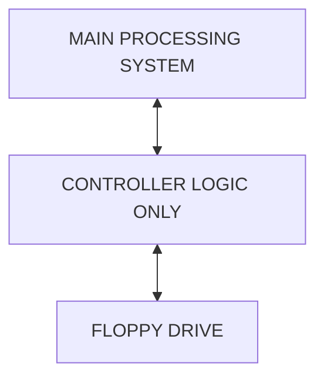
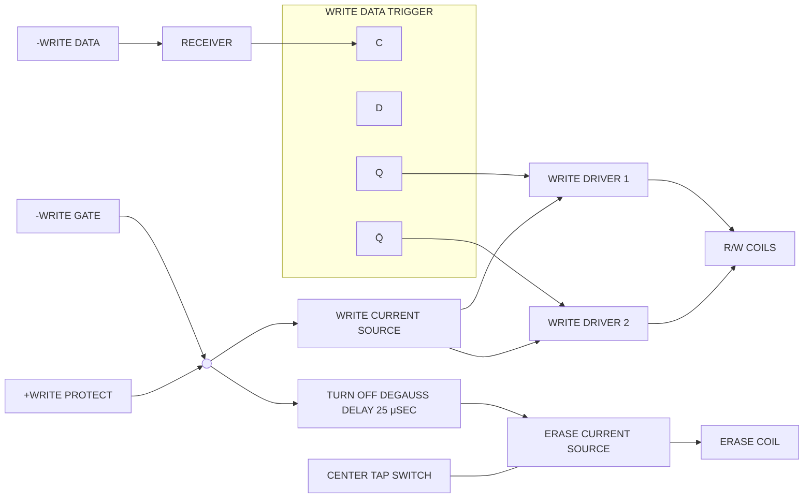
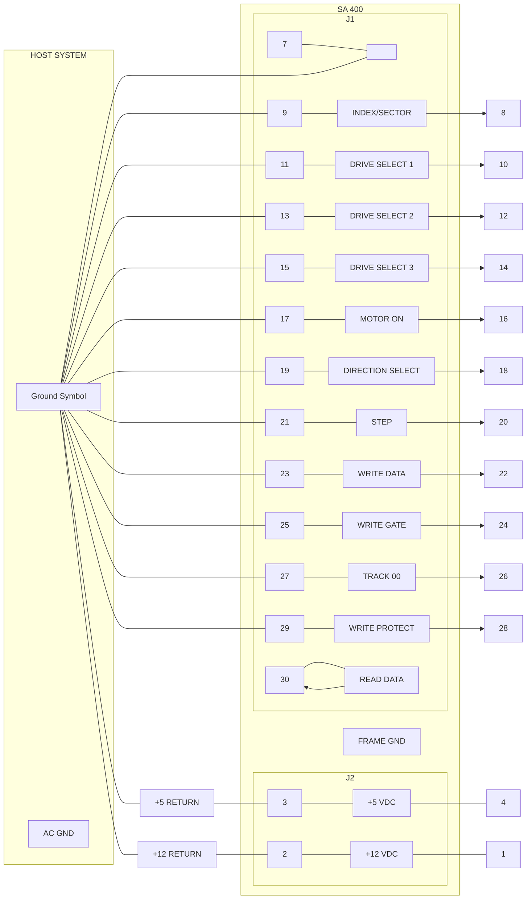

IMSAI logo with the slogan "The Standard of Excellence in Microcomputer Systems."

# MDC-DIO

USER MANUAL

Shugart [illegible] System Repair
Shugart Assoc
154R - Main St
Waltham MA 02154
617-893-0560

Carter Marine Eng., Inc.
505 Beatrice Street
Venice, Florida 33595

IMSAI Manufacturing Corporation
San Leandro, CA

IMSAI

MDC-DIO

Shugart SA400 Mini-Floppy

with DIO Controller

Copyright 1978
IMSAI Manufacturing Corporation
14860 Wicks Boulevard
San Leandro, California 94577
Made in the U. S. A.
All rights reserved worldwide.

January, 1978

O

The following manual is divided into four sections. The first section is a guide for the installation of the Shugart Mini-Floppy and interface boards (DIO and PDS). It includes all the information necessary for power and control signal cabling and diagrams to complement these instructions. Diskette handling and use are also described. The second section contains information on the floppy disk system as a whole including system theory of operation and user guide. Section III provides pertinent information on the DIO and PDS boards including schematics and assembly diagrams The last section is a reprint of the Shugart documentation provided with the drives.

)

0

0

MDC-DIO
INSTALLATION

# SECTION I

# INSTALLATION

The drive and interface boards (DIO and PDS) are assembled, tested and ready for installation. The instructions below provide information first on satisfying the power requirements and second, cabling the drives to the DIO board.

To start, unpack the unit. Do not throw away any packing material until all parts are accounted for. This unit includes:

* Shugart Mini-Floppy Disk Drive
* Cable AP
* MDC-DIO Harness Cable
* DIO Controller consisting of:
    - DIO Board
    - PDS Board
    - Board Interconnect Cable

We recommend that you save the shipping cartons in case the need arises to ship any of the above components.

**POWER CONNECTION**

The SA400 Shugart Mini-Floppy requires the following voltages:

<table>
  <thead>
    <tr>
        <th>Voltage</th>
        <th>Regulation</th>
        <th>Typical Current</th>
        <th>Max Current</th>
    </tr>
  </thead>
  <tbody>
    <tr>
        <td>+12VDC</td>
        <td>±.6VDC</td>
        <td>.9A</td>
        <td>1.8A *</td>
    </tr>
    <tr>
        <td>+5VDC</td>
        <td>±.25VDC</td>
        <td>.5A</td>
        <td>.7A</td>
    </tr>
  </tbody>
</table>

\* The 1.8A maximum may occur only during the pack motor start or if the pack motor is stalled.

The MDC-DIO harness is the power cable for the SA400. One end of the cable is a conector which will mate with the drive DC power connector J2, the other end is 4, color-coded, stripped and tinned wires.

<page_number>I - 3</page_number>

MDC-DIO
INSTALLATION

Three power connections options will be discussed.

## EXTERNAL

The diagram below details which wires carry the various voltages. This is a very general description and we recommend that you first refer to the other options before choosing this one.

Engineering drawing of MDC-DIO external power connection wiring from SA 400 to MDC-DIO Harness, showing RED (+12VDC), BLACK (12V return (GND)), GREEN (5V return (GND)), and WHITE (+5VDC) wires.

## INTERNAL REGULATOR CARD

Power may also be taken from the mainframe. However, this option requires that a regulator card be used to provide the necessary voltages. Refer to the following diagram for a schematic representation of the card.

Schematic diagram of the internal regulator card showing 7812 and 7805 voltage regulators with capacitors (2.2 uF) connecting the Mother Board to the Customer Provided Interconnect for MDC-DIO Harness and Mini Floppy.

<page_number>I - 4</page_number>

MDC-DIO
INSTALLATION

# INTER MOTHERBOARD REGULATORS

If you are connecting the MDC-DIO to a PCS-80/15 or 80/30, you may use the auxiliary regulator option on the EXP-10 motherboard. Although there is provision for +12 VDC and +5VDC regulator chips on the EXP-10, the components may or may not presently be installed on the EXP-10 depending on which options have been purchased. The following parts MUST all be present to supply the MDC-DIO power requirements:

<table>
  <thead>
    <tr>
        <th> </th>
        <th><u>Location</u></th>
        <th><u>ITEM</u></th>
    </tr>
  </thead>
  <tbody>
    <tr>
        <td>[no]</td>
        <td>U3</td>
        <td>7812 +12V Regulator</td>
    </tr>
    <tr>
        <td>[no]</td>
        <td>U1</td>
        <td>7805 +5V Regulator</td>
    </tr>
    <tr>
        <td>[no]</td>
        <td>C6</td>
        <td>2.2 uF Tantalum Capacitor</td>
    </tr>
    <tr>
        <td>[no]</td>
        <td>C2</td>
        <td>2.2 uF Tantalum Capacitor</td>
    </tr>
    <tr>
        <td>[no]</td>
        <td>C1</td>
        <td>2.2 uF Tantalum Capacitor</td>
    </tr>
    <tr>
        <td>[no]</td>
        <td>J1</td>
        <td>6-Pin Male Connector</td>
    </tr>
  </tbody>
</table>

As stated above, your EXP-10 may or may not have these items installed. Carefully check each part listed against the EXP-10 in your chassis. If any item is not there, it will have to be installed. DO NOT ATTEMPT TO INSTALL A PART WHILE THE EXP-10 IS ATTACHED TO THE CHASSIS. To remove the EXP-10, first shut the power off then remove all PC boards that are plugged into the motherboard. Next, detach all power connections from the power supply. There are seven tab-style power connectors on the left edge of the EXP-10 board and 4 ground connections along the right-hand edge. A screwdriver may be used if these connectors are difficult to remove. Next, detach any Molex connectors that will hinder removal. Finally, unscrew the nuts that hold the EXP-10 to the chassis and lift the motherboard from the chassis. Refer to the appropriate section of your User's Manual (PCS-80/15: Section III-C; PCS-80/30: Section III-D) for instructions for installing regulators, tantalum capacitors and connectors. While the EXP-10 is disconnected, it is a good time to install any extra edge connectors to accomodate the two new boards. Refer to either of the above for instructions on EXPM insertion if new edge connectors are required. Reconnect the EXP-10 to the chassis again referring to either of the above sections.

<page_number>I - 5</page_number>

MDC-DIO
INSTALLATION

Once any and all necessary modifications have been made, the wire end of the MDC-DIO harness may be terminated with a connector to mate with the EXP-10 at J1 or may be added to a pre-existing connector already attached at J1. Refer to the drawing below for proper pin assignments on the connector. Finally, while the power is still off plug the MDC-DIO harness into connector J1.

Engineering drawing of MDC-DIO harness wiring to J1 connector on EXP-10, showing wire colors (RED, WHITE, BLACK, GREEN) from MINI FLOPPY, wire splice, and Molex connector parts 09-50-3061 and 08-50-0106.

# CONTROL SIGNAL INTERCONNECTION

Now that the power requirements have been satisfied, the control signal interconnection can be completed. First, press the DIO and PDS boards into the edge connectors. The EXPM is a high quality edge connector and is possibly very stiff so be sure that the board is seated all the way down. Connect the DIO and PDS using the short 26-pin cable. Note the orientation of pin 1 (the red line.)

To connect the SA400 to the DIO, cable AP will be used. Refer to the drawing below for proper connection. Again, note the orientation of pin 1 (the red line) in the drawing and be sure to observe its proper alignment.

<page_number>

I - 6
</page_number>

MDC-DIO
INSTALLATION

Engineering drawing showing the connection between the DIO CARD, the ribbon cable with red lines, and the DRIVE unit with POWER RECEPTACLE and power source connections.

This completes the installation procedures for the MDC-DIO. The Mini-Floppy is now ready for use. Read further for instructions on Diskette handling and use.

## OPERATION

If you have just received the Mini-Floppy, the door is probably closed (the face of the drive is smooth). To open, press gently on the top of the latch (the side toward the circuit board). Turn the power on and the drive is now ready to accept a diskette.

To load a diskette, first remove it from the paper sleeve. NOTE: diskettes should always be stored in this sleeve to protect them from dust, sunlight and other destructive elements. Notice that there is a plastic disk enclosed in a paper package with a square notch on one side and two round notches beside an exposed

<page_number>I - 7</page_number>

MDC-DIO
INSTALLATION

area (see the diagram below). This constitutes the diskette; do not remove the plastic disk from the paper package. To insert the diskette into the drive, hold it such that the edge with the two small notches will go in first and the small circle on the diskette is on the same side as the red LED on the drive. Push the diskette all the way in and close the door; the diskette will automatically align itself. NOTE: it is good practice not to power up or down with a diskette in the drive. If you have purchased IMDOS (IMSAI Multi Disk Operating System) with your MDC-DIO, refer to the IMDOS System User Guide, Section 9 (starting on page IMDOS - 49) for instructions on "booting" the system.

Engineering drawing of a 5.25-inch floppy diskette showing the label area, central hub, index hole, and read/write access slot.

I - 8

FLOPPY DISK SYSTEM
SYSTEM COMPONENTS

## SECTION II

# THE FLOPPY DISK SYSTEM

## SYSTEM COMPONENTS

The IMSAI Floppy Disk System consists of a Controller Set and a Drive Assembly.

The Controller Set is composed of two boards, the DIO (Floppy Disk Interface) and the PDS (Programmable Data Separator).

The DIO contains all the control logic necessary to drive the floppy disk from the IMSAI PCS-80 or VDP-80 and plugs into the standard S100 Bus. It contains 2K bytes of ROM/EPROM for the Floppy Firmware and 256 bytes of RAM for its intermediate storage.

The PDS contains a programmable data separator which is based on a phase locked oscillator to ensure a high level of data integrity and to permit the detection of IBM 3740 format Address Marks and other Address Marks with missing clock patterns. It can be programmed to separate Frequency Modulated (FM) data at 125 or 250kHz or Modified Frequency Modulated (MFM) data at 500 KHz.

The Floppy Disk Drive can be any of the following drives:

* Shugart Model SA800 for single or double density recording
* PERSCI Model 270 for single or double density recording
* GSI Model GSI-110 for single or double density recording
* Shugart Model SA400 for single density recording

The SA400 is a Mini Floppy and contains .65M bits of formatted data storage. The Model 270 is a dual floppy drive and contains 3.88M bits of formatted storage in single density or 9.14M bits of formatted storage in double density. The SA800 and GSI-110 are standard drives and contain 1.94M bits of formatted storage in single density or 4.57M bits of storage in double density.

<page_number>II - 1</page_number>

D

0

FLOPPY DISK SYSTEM
THEORY OF OPERATION

# THEORY OF OPERATION

## PREFACE

This section is intended to help the User gain a general understanding of how the IMSAI Floppy Disk System functions as a whole. The operation of a theoretical floppy disk system is first presented to convey a general understanding of the principles involved in floppy disk transfers. Once this is achieved the operation of the IMSAI Floppy Disk System is explained.

Systems Operation does not cover the detailed logic and timing functions. If this information is desired the User should reference the Theory of Operations section for the individual system component.

## I. FLOPPY DISK SYSTEMS IN GENERAL

A floppy disk system allows for the storage and retrieval of blocks of data between the main system memory and a storage medium, the floppy diskette.

The floppy disk system shown in Figure 1 provides the framework for a discussion of the processes involved in general floppy disk transfers. This floppy disk system is assumed to interface to a main processing system and is composed of two major elements:

1) a controller
2) a drive

Figure 1 A Simple Floppy Disk System

<page_number>II - 3</page_number>

# FLOPPY DISK SYSTEM
# THEORY OF OPERATION

The controller contains all of the logic necessary to interface the floppy disk drive with the main processing system. All transfer routines are taken care of by the main processor. Note that control resides with the main processor only.

The drive contains the floppy disk storage unit which utilizes a movable read/write head to access information stored on a flexible diskette.

## DATA FORMATS

The data on the diskette is organized into tracks and sectors.

A track can be conceived of as a circular ring with its center located at the physical center of the diskette. If the read/write head is located a "distance" n from the center of the diskette, the nth track is defined as the area passing directly under the head in one complete revolution of the diskette.

Each track consists of a number of sectors. A sector is composed of preamble information, a data block, and postamble information. (See Figure 2)

The preamble information will normally contain: 1) a set pattern to indicate the start of a sector; 2) the track address; and 3) the sector address.

The data block contains the actual data transferred from the system's main memory.

The postamble information will normally include: 1) a number of check characters and 2) a gap to fill the end of a sector.

## WRITE PROCESSES IN A SIMPLE FLOPPY DISK SYSTEM

Assume there exists a block of data located in the system RAM which is to be stored on a floppy diskette. For simplicity, assume that the block size is equal to the sector data block size. In order to set up the transfer, the processor needs to get the address of the data block in system RAM and the location of the destination on the diskette (track and sector). During the transfer, the controller needs to compute check characters for the block of data being transferred.

<page_number>II - 4</page_number>

FLOPPY DISK SYSTEM
THEORY OF OPERATION

Diagram showing a diskette with concentric tracks, with a dashed line pointing from a track to a detailed view of a sector containing PROLOGUE, DATA BLOCK, and EPILOGUE sections.

Figure 2 Tracks and Sectors

The check characters are used to verify the validity of the data when the block is read back into memory.

At this point the processor tells the floppy controller to position the head over the destination track and sector on the diskette. Once the floppy acknowledges it has positioned the head over the correct location, the processor sets the write enable and executes the transfer a word at a time until the block transfer is complete.

The check characters are then stored in the postamble, and the write enable is turned off. The process of writing onto the diskette is complete.

<page_number>II - 5</page_number>

# FLOPPY DISK SYSTEMTHEORY OF OPERATION

## READ PROCESSES IN A SIMPLE FLOPPY DISK SYSTEM

Transferring a block of data stored on diskette to the main processor's memory involves a similar process. The processor first needs to get the location of the data block on the diskette (track and sector) and the address of the destination in the system RAM.

The processor then commands the floppy to position the head over the desired track and sector. When the floppy acknowledges it has found the requested track and sector, the processor begins reading the data from the diskette into a previously defined storage area until the block read is complete.

The check characters (CRC) are then read and checked to insure the validity of the data.

## II. THE IMSAI FLOPPY DISK SYSTEM

The IMSAI DIO Floppy Disk System consists of a Controller and Drive Assembly. The Controller contains all of the logic necessary to interface up to four standard floppy disk drives and three mini floppy disk drives. The firmware, located in the Controller's 2K bytes of ROM/EPROM contains the driving software to operate the floppy disk drive in any of the supported Data Formats.

## DATA FORMATS

All data is recorded on the floppy disks using soft sectoring with sector sizes of 128 bytes. Recognition of the individual sectors is accomplished by using unique patterns of clock and data bits to identify the start of sectors. The data or clock bits are recorded on the diskette as flux reversals.

Most flexible disk files today operate with Frequency Modulation (FM) encoding. The rules for FM encoding are:

1. Write data bits (D) at the center of the bit cell.

2. Write clock bits at the leading edge of the bit cell.

Examination of the rules show that a penalty is paid in clocking bits, and if the code could be made more efficient by elimination of clock bits then higher information densities could be achieved.

<page_number>II - 6</page_number>

FLOPPY DISK SYSTEM
THEORY OF OPERATION

Diagram showing bit cells with values 1, 1, 1, 0, 1, 0, 0, 0, 1

Diagram of FM encoding waveform with data bits (D) and clock pulses, showing 2F and 1f intervals

Figure 3 FM Encoding

Such a technique was devised several years ago and is commonly called Modified Frequency Modulation or MFM. This encoding scheme has been used successfully on high performance disk drives such as the IBM 3330 and IBM 3340. The rules for MFM are:

1. Write data bits (D) at the center of the bit cell.

2. Write clock bits at the leading edge of a bit cell if:

A) No data bit has been written in the previous bit cell and,

B) No data bit will be written in the present bit cell.

Diagram showing bit cells with values 1, 1, 1, 0, 1, 0, 0, 0, 1 and the corresponding MFM encoding waveform with data bits (D)

Figure 4 MFM Encoding

II - 7
<page_number>7</page_number>

# FLOPPY DISK SYSTEM
# THEORY OF OPERATION

The mini floppy disk uses only FM recording at 125 kHz (8 microseconds per bit cell). Standard floppy disks record FM at 250 kHz (4 microseconds per bit cell) or MFM at 500 kHz (2 microseconds per bit cell). For IBM 3740 compatability, FM recording is used in conjunction with the standard IBM sector organization. In order to use MFM, the user must ensure that both the floppy disk drive and diskette in use are capable of operating in the double density mode. Figures 5, 6 and 7 give the sector organizations used. The definitions of the terms for the charts are as follows:

\* G4A = Gap from physical index to index AM sync.

\* S = # of bytes for data separator sync prior to any AM -- includes a minimum of two bytes before any AM plus sync up requirement.

\* AM = One unique byte not written per the encode rules.

<table>
  <thead>
    <tr>
        <th>FM Encode</th>
        <th>Hex Byte</th>
        <th>Missing Clocks</th>
    </tr>
  </thead>
  <tbody>
    <tr>
        <td>Index AM</td>
        <td>FC</td>
        <td>Bit cells 2,4</td>
    </tr>
    <tr>
        <td>ID AM</td>
        <td>FE</td>
        <td>Bit cells 2,3,4</td>
    </tr>
    <tr>
        <td>Data AM</td>
        <td>FB</td>
        <td>Bit cells 2,3,4</td>
    </tr>
    <tr>
        <td>Deleted Data AM</td>
        <td>F8</td>
        <td>Bit cells 2,3,4</td>
    </tr>
    <tr>
        <td> </td>
        <td> </td>
        <td> </td>
    </tr>
    <tr>
        <th>MFM Encode</th>
        <th>Hex Byte</th>
        <th>Missing Clock</th>
    </tr>
    <tr>
        <td>Index AM</td>
        <td>OC</td>
        <td>Bit cell 3</td>
    </tr>
    <tr>
        <td>ID AM</td>
        <td>OE</td>
        <td>Bit cell 3</td>
    </tr>
    <tr>
        <td>Data AM</td>
        <td>OB</td>
        <td>Bit cell 3</td>
    </tr>
    <tr>
        <td>Deleted Data AM</td>
        <td>08</td>
        <td>Bit cell 3</td>
    </tr>
  </tbody>
</table>

Bit cells 1 (high order) thru 8 (low order)

G1 (Gap 1) = Gap from index AM to ID AM sync

ID = Four binary bytes of track and sector address

CRC = Two cyclic redundancy check bytes (IBM or equiv.)

G2 (Gap 2) = Gap from ID CRC to data AM sync - includes speed variation, osc. variation and erase core clearance of ID CRC bytes. Prior to write gate turn on for update write.

Data = User data

\*\* WG off = Write gate turn off after data field update - usually one byte to prevent write turn off affecting CRC byte.

II - 8
<page_number>II - 8</page_number>

# FLOPPY DISK SYSTEM
# THEORY OF OPERATION

\*\* G3 (Gap 3) = Gap from WG OFF to next ID AM sync - includes speed variation and osc. variation for previous update write and preamp recovery for next read ID

G4B = Gap after last G3 to physical index - includes remaining speed variation and osc. variation for format write

G4 (Gap 4) = Last gap prior to physical index equal to G3 and G4B - includes total speed variation and osc. variation for format write.

\*contained in IBM format but reason unknown
\*\*G3 bytes and WG. OFF are same hex bytes and their combined total used to be called Gap 3.

## MAIN PROCESSOR CONTROL OF FLOPPY DISK FUNCTIONS

Execution of a disk transfer operation is determined by Command Strings which reside in the main processor's memory. The execution of these Command Strings are initiated from the Main Processor by means of a subroutine call with a command byte in the A register. This Command byte contains a BYTE COMMAND number of 0 in the 4 high order bits and a pointer number to a particular Command String in the 4 low order bits.

## WRITE PROCESSES IN THE IMSAI FLOPPY DISK SYSTEM

### MAIN PROGRAM PROCESSES

Assume there exists a block of data located in the main system RAM to be transferred to floppy disk. The main processor needs to first set-up the COMMAND STRING in main memory with 1) the command number for a sector write; 2) a position for the Status Byte; 3) the destination track and sector number and 4) the address in memory of the data block to be transferred.

The main processor then executes the subroutine call to initiate the execution of the write. The acknowledgement of a completed operation will be indicated by a non-zero value being stored in the status word of the COMMAND STRING and contained in the accumulator on the return from the subroutine call.

### FIRMWARE PROCESSES

The output word 0 is decoded by the DIO firmware as being a command to execute from the COMMAND STRING located in the System RAM. The Command Number is decoded as a write operation.

<page_number>II - 9</page_number>

FLOPPY DISK SYSTEM
THEORY OF OPERATION

## TRACK POSITIONING

A request is issued to the DIO to load the head, position the head, sync the PDS, and then to synchronize on the ID Address Mark. The DIO then places the processor in a WAIT state until it has found the desired missing clock pattern.

Once the DIO has recognized the Address Mark, it raises the READY line, allowing the processor to read and check the track address. A compare is made to see if the head is positioned over the desired track. If not, the direction and Step lines are used to reposition the head over the destination track.

## SECTOR POSITIONING

Again, the processor issues a request to the DIO to synchronize on the ID Address Mark. The processor is again placed in a WAIT State until the ID Address Mark is recognized. Once the processor is allowed to continue, it reads and checks track and sector number, this time looking for the destination sector. If the head is verified to be positioned over the desired sector, the processor waits for the gap before writing the sync 0 bytes, the Data Address Mark, 128 bytes of data, and the 2 CRC characters according to the Data Format.

## COMPLETION OF THE OPERATION

At this point, the Write operation is complete and the firmware will indicate the results of the operation to the Main System by storing a non-zero value in the Status Word of the COMMAND STRING, and returning from the subroutine.

## READ PROCESSES IN THE IMSAI FLOPPY DISK SYSTEM

### MAIN PROGRAM PROCESSES

To prepare for a Read operation the main processor sets up the COMMAND STRING with:

1) The Command Number for a sector read;

2) A position for the Status Byte;

3) the track and sector number for the data block to be read from the diskette;

4) the Address of the destination in Main memory.

<page_number>

II - 10
</page_number>

# FLOPPY DISK SYSTEM
# THEORY OF OPERATION

The main processor then executes the subroutine call to initiate the READ operation.

## FIRMWARE PROCESSES

As before, the firmware will receive the call from the main program and decode it as a command to execute from the COMMAND STRING located in the System RAM.

The Command Number is decoded as a READ operation and the processor positions the read/write head over the desired track and sector as before. Once the head is correctly positioned, the processor waits for the Data Address Mark. When the Data Address Mark is recognized, 128 bytes of data are read into the RAM. The two CRC characters are then read and checked to verify the data block.

To acknowledge completion of the READ operation, the firmware will store a non-zero value in the Status Byte. This value is also passed to the calling program in the A register when the return is executed.

<page_number>II - 11</page_number>

<table>
  <thead>
    <tr>
        <th>Field</th>
        <th rowspan="2">G4A</th>
        <th rowspan="2">INDEX SYNC</th>
        <th rowspan="2">MK AM</th>
        <th rowspan="2">G1</th>
        <th colspan="4">ID FIELD</th>
        <th rowspan="2">G2</th>
        <th colspan="4">DATA FIELD</th>
        <th rowspan="2">WG OFF</th>
        <th rowspan="2">G3</th>
        <th rowspan="2">G4B</th>
    </tr>
    <tr>
        <th>Sub-Field</th>
        <th>SYNC</th>
        <th>AM</th>
        <th>ID</th>
        <th>CRC</th>
        <th>SYNC</th>
        <th>AM</th>
        <th>DATA</th>
        <th>CRC</th>
    </tr>
  </thead>
  <tbody>
    <tr>
        <td># of Bytes</td>
        <td>40</td>
        <td>6</td>
        <td>1</td>
        <td>26</td>
        <td>6</td>
        <td>1</td>
        <td>4</td>
        <td>2</td>
        <td>11</td>
        <td>6</td>
        <td>1</td>
        <td>128</td>
        <td>2</td>
        <td>1</td>
        <td>26</td>
        <td>247</td>
    </tr>
    <tr>
        <td>Hex Byte</td>
        <td>00</td>
        <td>00</td>
        <td>FC</td>
        <td>00</td>
        <td>00</td>
        <td>FE</td>
        <td>Note 1</td>
        <td>Note 2</td>
        <td>00</td>
        <td>00</td>
        <td>Note 3</td>
        <td>Note 4</td>
        <td>Note 2</td>
        <td>FF</td>
        <td>00</td>
        <td>00</td>
    </tr>
  </tbody>
</table>

**Notes:**
1 - Track Addr, Zeroes, Sector Addr, Zeroes
2 - Generated by CRC Generator which should be IBM or equiv.
3 - FB for data field or F8 for deleted data field
4 - User data

Figure 5 - Recommended FM Format (26 Records - IBM 3740 Compatible)

O

U

Diagram showing Recommended MFM or M²FM Format with byte counts and hex values for various fields like G4A, INDEX SYNC, MK AM, G1, ID FIELD, G2, DATA FIELD, WG OFF, and G3/G4B.

**Notes:**
1 - Track Addr, Zeroes, Sector Addr, Zeroes
2 - Generated by CRC Generator which should be IBM or equiv
3 - 0B for data field or 08 for deleted data field

4 - User data

Figure 6 - Recommended MFM or M2FM Format (58 Records)

0

−

2)

Diagram of Recommended Mini FM Format showing Physical Index, ID Field, Data Field, and byte counts.

<table>
  <thead>
    <tr>
        <th colspan="14">3161 Bytes</th>
    </tr>
    <tr>
        <th> </th>
        <th> </th>
        <th colspan="11">REPEATED FOR EACH RECORD</th>
        <th>G4B</th>
    </tr>
    <tr>
        <th> </th>
        <th>G1</th>
        <th colspan="4">ID FIELD</th>
        <th>G2</th>
        <th colspan="5">DATA FIELD</th>
        <th>G3</th>
        <th>G4B</th>
    </tr>
    <tr>
        <th> </th>
        <th> </th>
        <th>SYNC</th>
        <th>AM</th>
        <th>ID</th>
        <th>CRC</th>
        <th> </th>
        <th>SYNC</th>
        <th>AM</th>
        <th>DATA</th>
        <th>CRC</th>
        <th>WG OFF</th>
        <th> </th>
        <th> </th>
    </tr>
  </thead>
  <tbody>
    <tr>
        <td># of Bytes</td>
        <td>16</td>
        <td>4</td>
        <td>1</td>
        <td>4</td>
        <td>2</td>
        <td>6</td>
        <td>4</td>
        <td> </td>
        <td>128</td>
        <td>2</td>
        <td>1</td>
        <td>16</td>
        <td>103</td>
    </tr>
    <tr>
        <td>Hex Byte</td>
        <td>00</td>
        <td>00</td>
        <td>FE</td>
        <td>Note 2</td>
        <td>00</td>
        <td>00</td>
        <td>Note 3</td>
        <td>Note 4</td>
        <td>Note 2</td>
        <td>FF</td>
        <td>00</td>
        <td>00</td>
        <td></td>
    </tr>
    <tr>
        <td>Binary Byte</td>
        <td> </td>
        <td> </td>
        <td> </td>
        <td>Note 1</td>
        <td> </td>
        <td> </td>
        <td> </td>
        <td> </td>
        <td> </td>
        <td> </td>
        <td> </td>
        <td> </td>
        <td> </td>
    </tr>
  </tbody>
</table>

**Notes:**
1. Track Addr, Zeroes, Sector Addr, Zeroes
2. Generated by CRC Generator which should be IBM or equiv.
3. For data field or for deleted data field
4. User data

Figure 7 - Recommended Mini FM Format (18 Records)

E

-i

FLOPPY DISK SYSTEM
USER GUIDE

USER GUIDE

ADDRESS SELECTION

The DIO Floppy Disk Interface is designed to plug into the standard IMSAI backplane. The interface occupies address locations E000 Hex to EFFF Hex and uses two I/O port locations. The I/O ports used are switch selected to be XE Hex and XF Hex where X can be any hex digit from 0 to F. The DIO is designed so it can be used with RAM locations using the same addresses, providing that the RAM Memories use A16 (Backplane pin 16) to disable their address selection logic. In this case, the two I/O ports are used to enable and disable the DIO from responding to these addresses. The DIO can also be jumper configured to operate with an IMSAI IMM Board. The following paragraphs give the jumper and program requirements for the various possible configurations.

SINGLE DIO INTERFACE WITH NO OVERLAPPING RAM ADDRESSES

Upon receiving a reset command, the DIO is enabled and no further I/O instructions need be executed for the DIO. The I/O ports should be jumper selected to be I/O ports which are NOT used in the rest of the system.

SINGLE DIO INTERFACE WITH OVERLAPPING RAM ADDRESSES

Upon receiving a reset command, the DIO is enabled. To disable the DIO (thus enabling the RAM locations of the same address) an OUT XE instruction should be executed. For the I/O instructions, the contents of the A Register (i.e. the data value) is not used and can be any value. An OUT XF instruction will reenable the DIO. The value of X should be switch selected to be unique to that DIO and the appropriate output instruction executed to enable or disable the DIO for DIO and RAM references respectively.

CAUTION: Note that this definition precludes the transfer of data directly to or from the RAM locations E000-EFFF using the DIO Floppy Disk System.

MULTIPLE DIO INTERFACES IN A SINGLE SYSTEM

Multiple DIO Interfaces may be used in a single system by selecting a different set of I/O ports (e.g. a different value of X) for each DIO. Then the derived DIO can be enabled, or all of them disabled for referencing overlapping RAM Memory. In addition, the reset command jumpers should be inserted so that the primary DIO board is enabled and the others are disabled by

<page_number>II - 19</page_number>

FLOPPY DISK SYSTEM
USER GUIDE

the Reset Command.

## DIO INTERFACE USED WITH AN IMSAI IMM BOARD

If an IMM board is being used, the DIO board may be jumpered to reside in the top 65K of the Megabyte Address Space. Within this 65K, it still resides at E000-EFFF and the above alternatives do not exist for overlapping RAM Memory and multiple DIO's.

## DRIVE SELECTIONS

The DIO board requires switch settings to delineate the type of standard floppy drive and the recording format for that drive for use by the Firmware. These switch values are read by the Firmware when bootstrapping and each time the system is initialized to determine the type of drive. The results are stored in the DIO RAM Memory. The value in the RAM Memory is then used by the Firmware when transferring data to or from the disks. In this manner, the same physical drive can be used, under program control, to read and record in different formats. For more complete information on how to do this, the reader is referred to the Programming Options section of this Guide.

## JUMPER AND SWITCH SELECTIONS

This section gives the physical configuration requirements to accomplish the above alternatives. The switches at location U3 are used for the I/O Port selection and the Drive selection. The discrete jumper locations are called out alphabetically as shown on the assembly diagram.

### STANDARD SWITCH SETTINGS

<table>
  <thead>
    <tr>
        <th>Switch</th>
        <th colspan="2">DIO 1</th>
        <th colspan="2">DIO 2</th>
        <th colspan="2">Function / Legend</th>
    </tr>
    <tr>
        <th> </th>
        <th>OFF</th>
        <th>ON</th>
        <th>OFF</th>
        <th colspan="2">ON</th>
        <th> </th>
    </tr>
  </thead>
  <tbody>
    <tr>
        <td>1</td>
        <td>[yes]</td>
        <td>[no]</td>
        <td>[yes]</td>
        <td>[no]</td>
        <td rowspan="4">Switches 1 - 4: Address Assignments DIO 1 Set to D hex DIO 2 Set to E hex</td>
        <td></td>
    </tr>
    <tr>
        <td>2</td>
        <td>[yes]</td>
        <td>[no]</td>
        <td>[yes]</td>
        <td>[no]</td>
        <td></td>
    </tr>
    <tr>
        <td>3</td>
        <td>[no]</td>
        <td>[yes]</td>
        <td>[yes]</td>
        <td>[no]</td>
        <td></td>
    </tr>
    <tr>
        <td>4</td>
        <td>[yes]</td>
        <td>[no]</td>
        <td>[no]</td>
        <td>[yes]</td>
        <td></td>
    </tr>
    <tr>
        <th> </th>
        <th> </th>
        <th> </th>
        <th> </th>
        <th> </th>
        <th>OFF</th>
        <th>ON</th>
    </tr>
    <tr>
        <td>5</td>
        <td>[yes]</td>
        <td>[no]</td>
        <td>[no]</td>
        <td>[yes]</td>
        <td>Switch 5: Shugart / GSI</td>
        <td>PERSCI</td>
    </tr>
    <tr>
        <td>6</td>
        <td>[no]</td>
        <td>[yes]</td>
        <td>[no]</td>
        <td>[yes]</td>
        <td>Switch 6: Double (MFM)</td>
        <td>Single (FM)</td>
    </tr>
    <tr>
        <td>7</td>
        <td>[yes]</td>
        <td>[no]</td>
        <td>[yes]</td>
        <td>[no]</td>
        <td>Switch 7: 8085</td>
        <td>8080</td>
    </tr>
    <tr>
        <td>8</td>
        <td>[yes]</td>
        <td>[no]</td>
        <td>[yes]</td>
        <td>[no]</td>
        <td>Switch 8: Not Used</td>
        <td> </td>
    </tr>
  </tbody>
</table>

NOTE: For the purpose of illustration, DIO 1 is set for D hex, Shugart drives, single density and 8085 processor. DIO 2 is set for E hex, PERSCI drives, double density, and 8085 processor. Your DIO may or may not be so configured.

II - 20
<page_number>20</page_number>

FLOPPY DISK SYSTEM
USER GUIDE

## ADDRESS ASSIGNMENT

The standard address assignments are selected by switches 1 - 4. The assignment for the first DIO is D and E for the second. Note that a 1 corresponds to OFF on the switch.

## DRIVE SELECTION

The type of standard drive used is selected by switch 5. For PERSCI drives this switch should be ON, for GSI or Shugart drives it should be OFF.

## RECORDING FORMAT SELECTION

The recording format used by the standard drives is selected by switch 6. It should be ON for single density FM and OFF for double density MFM.

## MPU SELECTION

Due to differences in system clock frequency the type of MPU being used must be set in switch 7. It should be ON for 2 mHz 8080 (MPU-A) systems and OFF for 3 mHz 8085 (MPU-B) systems.

## RESET COMMAND SELECTION (L,M,N)

Standard DIO has a trace from L to M and this causes the DIO to be enabled by a Reset Command. To cause it to be disabled, cut the trace from L to M and insert a jumper from M to N.

## IMM SELECTION (A,B; C,D,E; F,G,H; I,J,K)

To jumper a DIO for use with an IMSAI IMM board make the following changes:

* Cut trace from A to B

* Cut trace from D to E, add jumper from C to D

* Cut trace from G to H, add jumper from F to G

* Cut trace from K to J, add jumper from I to J

## SYSTEM BOOTSTRAP

A "bootstrap" is a short program which reads another program from some storage medium into system RAM and executes it. This simple, yet general procedure gives the user freedom to load in any kind of operating system s/he desires. The IMSAI Floppy Disk System bootstrap reads sector 1 of track 0 from drive 0 into system RAM at 0-7F and then jumps to location 0. Drive 0 of the

<page_number>II - 21</page_number>

FLOPPY DISK SYSTEM
USER GUIDE

standard drive is used by the bootstrap starting at E000 and drive 0 of the mini drive is used by the bootstrap starting at E003.

The following procedure should be used when bootstrapping from an IMSAI IMDOS System Diskette in an IMSAI 8080 system. Refer to the PCS-80 or VDP-80 operator manual for other systems.

1. Insure that the diskettes are removed from the drives.

2. Power up the computer.

3. Power up the floppy disk drive.

4. Insert a system diskette in drive 0.

5. Set the ADDRESS switches for E000 (standard drive) or E003 (mini drive) and press EXAMINE. A "C3" should appear in the DATA lights.

6. Press RUN.

At this point, the operating system should automatically load and run.

If a hardware error occurs the bootstrap will be retried until it is successful, or until it is stopped.

# PROGRAMMING GUIDE

## A. Introduction

An Assembly Language Program stored in the 8080 System Memory is necessary to access the Floppy Disk. To use the IMSAI Floppy Disk System, the User must understand how to write such a program.

In order to accomplish this, the User may think of the Floppy Disk as a subroutine called from the 8080 Microprocessor System.

The program which will access the Floppy Disk System utilizes TWO TYPES OF INSTRUCTIONS:

1. BYTE INSTRUCTIONS and

2. A COMMAND STRING INSTRUCTION

II - 22
<page_number>22</page_number>

FLOPPY DISK SYSTEM
USER GUIDE

BYTE INSTRUCTIONS are subroutine calls to the Starting Address in the Floppy Disk Firmware.

A COMMAND STRING is a series of consecutive words located in the System Memory.

The processes which need to take place within this program are described as follows:

START.....SET UP THE COMMAND STRING IN RAM FOR A PARTICULAR DISK OPERATION

ISSUE THE SUBROUTINE CALL TO INITIATE THE EXECUTION OF A DISK OPERATION

CHECK THE VALUE OF THE A REGISTER OR STATUS WORD IN THE COMMAND STRING FOR AN INDICATION THAT THE DISK OPERATION WAS SUCCESSFULLY COMPLETED.

END.......

The sections of the USER GUIDE which follow give the detailed information necessary to WRITE THE FLOPPY DISK ACCESS PROGRAM.

## B. Command Types

These are two basic Command types available for control of the DIO Floppy Disk System:

1) the BYTE COMMAND and

2) the COMMAND STRING

Both of these commands are executed by making subroutine calls to the DIO firmware with the Byte Command Value in the A register. The Command String is executed when a Byte Command of 0 is passed to the firmware. There are two subroutine entry points for the commands in the DIO firmware:

E006 - Entry point for commands using standard drives

E009 - Entry point for commands using mini drives

In addition to the basic commands, there is an Initialization Command. This command is executed by making a subroutine call to E00C, and is the same regardless of the drive type. An Initialization Command must be executed after power up or a RESET before any attempt is made to execute one of the two basic commands. It is automatically

<page_number>

II - 23
</page_number>

FLOPPY DISK SYSTEM
USER GUIDE

executed when the DIO bootstrap is used or the system is booted using any version of the MPU-B firmware.

## C. BYTE COMMANDS

The Byte instruction is an eight bit word structured so that the upper four bits contain the BYTE INSTRUCTION NUMBER and the lower four bits contain either a pointer number or a drive select number, depending on the command used. (See Figure 9.)

<table>
  <thead>
    <tr>
        <th>DATA BIT</th>
        <th>DATA BIT</th>
        <th>DATA BIT</th>
        <th>DATA BIT</th>
        <th>DATA BIT</th>
        <th>DATA BIT</th>
        <th>DATA BIT</th>
        <th>DATA BIT</th>
    </tr>
    <tr>
        <th>7</th>
        <th>6</th>
        <th>5</th>
        <th>4</th>
        <th>3</th>
        <th>2</th>
        <th>1</th>
        <th>0</th>
    </tr>
  </thead>
  <tbody>
    <tr>
        <td colspan="4">BYTE COMMAND</td>
        <td colspan="4">DRIVE SELECT OR POINTER NO.</td>
    </tr>
  </tbody>
</table>

Figure 8 Byte Command

The Byte Instructions are listed below according to the Byte Instruction Number (the hex number contained in the upper four bits of the Byte Instruction).

**COMMAND 0:** Execute Command String from pointer. This command will take the pointer number from 0 to 15 and execute the Command String pointed to by that pointer. Note that prior to using this command the pointer address must have been initialized using Command 1.

**COMMAND 1:** This command will cause the floppy firmware to take the next two bytes passed to it by the master program and use these as the new address for the pointer specified. Note that three bytes must be output to the DIO firmware from the main program to properly execute this command. (BYTE COMMAND NUMBER, LOW ORDER ADDRESS, HIGH ORDER ADDRESS)

**COMMAND 2:** Restore Drive causes the floppy controller to execute a restore command (position the head over track 0) on any or all drives selected the next time that drive is referenced.

<page_number>II - 24</page_number>

FLOPPY DISK SYSTEM
USER GUIDE

**COMMAND 3:** Set software Write Protect causes the controller to set a Write Protect on all of the drives which are selected. Note that in an initialized state all drives come up WRITE ENABLED and therefore the WRITE PROTECT must be reset whenever power goes on.

**COMMAND 4:** Software WRITE ENABLE causes the microprocessor or the floppy controller to remove the WRITE PROTECT on any or all drives selected.

COMMAND 5 through COMMAND 15 perform no operation.

## POINTERS

The pointer is a number from 0 to 15 which signifies that one of 16 addresses be used as the address of the Command String in Main Memory. Byte Commands 0 and 1 will take the lower four bits of the Byte Instruction Word as a pointer number to a Command String address. Note that Byte Command 1 is used to initialize the addresses of the pointers, while Byte Command 0 will execute the Command String pointed to by the lower four bits of the Byte Command Word.

On system initialization, the sixteen pointers are initialized with the following default values (all in hexadecimal).

<table>
  <tbody>
    <tr>
        <td>0:</td>
        <td>0080</td>
        <td>4:</td>
        <td>4000</td>
        <td>8:</td>
        <td>8000</td>
        <td>C:</td>
        <td>C000</td>
    </tr>
    <tr>
        <td>1:</td>
        <td>1000</td>
        <td>5:</td>
        <td>5000</td>
        <td>9:</td>
        <td>9000</td>
        <td>D:</td>
        <td>D000</td>
    </tr>
    <tr>
        <td>2:</td>
        <td>2000</td>
        <td>6:</td>
        <td>6000</td>
        <td>A:</td>
        <td>A000</td>
        <td>E:</td>
        <td>E000</td>
    </tr>
    <tr>
        <td>3:</td>
        <td>3000</td>
        <td>7:</td>
        <td>7000</td>
        <td>B:</td>
        <td>B000</td>
        <td>F:</td>
        <td>F000</td>
    </tr>
  </tbody>
</table>

## DRIVE SELECT NUMBERS

Byte Commands 2, 3 and 4 will take the lower four bits of the Byte Instruction Word as a Drive Select number. A drive is selected (0-3) if its corresponding bit is a 1. A command with no drives selected does no operation.

Diagram of Byte Command structure for Drive Select Numbers showing Bits 0-3 mapping to Drives 0-3

Figure 9 Drive Select Numbers

<page_number>II - 25</page_number>

FLOPPY DISK SYSTEM
USER GUIDE

## D. COMMAND STRING INSTRUCTIONS

Command String Instructions are indirectly executable and are stored in a variable length Command String in the Main Program RAM.

Diagram of Command String Instructions in System RAM showing required words 1 through 4 and optional words 5 through 7.

Figure 10 Command String Instructions

All Command Strings consist of at least four bytes of information. The definition of each 8 bit byte in the Command String is given below.

### BYTE 1 - Command Byte

This byte contains a command number in the upper hexadecimal digit and the drive select number in the lower digit. The opertion for each Command Number is defined in the next section and a drive is selected (0-3) if its corresponding bit is a one (bits 0-3).

### BYTE 2 - Status Byte

This byte indicates to the master program the results of the last disk operation. This byte is set non-zero at the completion of the Command String by the DIO firmware. The same value is returned in the A register. If bit 7 is set, it indicates that the operation was not completed successfully. Bit 0 only is set on successful completion.

<page_number>II - 26</page_number>

FLOPPY DISK SYSTEM
USER GUIDE

## BYTE 3 and 4 - Track Address

Two bytes are allowed for the track address for future expansion. At this time, Byte 3 must be 0, and Byte 4 contains a value to specify on what track the operation should be performed. The range is from 0 to 76 for standard drives and 0 to 34 for mini drives.

## BYTE 5 - Sector Number (when required)

This byte contains a value to specify on what sector the operation should be performed. The sector numbers are 1 to 18 for mini drives, 1 to 26 for standard drives using single density and 1 to 58 for standard drives using double density.

## BYTE 6 and 7 - Memory Address (when required)

Two bytes are used to contain the Memory Address to or from which data is to be transferred for Disk read or write operations. Byte 6 contains the least significant half of the address and Byte 7 the most significant half. Byte 7 MAY NOT contain E0 hex, since this would result in an attempt to transfer data to or from the same addresses occupied by the DIO.

## COMMAND TYPES

The individual Command String commands are listed below by the command numbers - the upper four bits of the Command Byte.

## COMMAND 0

NOT USED

## COMMAND 1

The WRITE SECTOR command causes the floppy controller to write the data from the location pointed to by Bytes 6 and 7. Byte 6 contains the least significant half of the data buffer location, and Byte 7 contains the most significant half. The data is written in the sector specified in Byte 5.

II - 27
<page_number>II - 27</page_number>

FLOPPY DISK SYSTEM
USER GUIDE

COMMAND 2

READ SECTOR: The sector number contained in Byte 5 is read and the data is transferred to the data buffer location contained in Bytes 6 and 7. Byte 6 contains the least significant half of the data buffer location, and Byte 7 contains the most significant half.

COMMAND 3

The FORMAT TRACK command uses no additional bytes and causes the floppy controller to write a format on the selected track number. This command destroys all previous information on the track and should be used with caution to initialize new diskettes.

COMMAND 4

The VERIFY SECTOR command causes the floppy controller to read and verify the redundancy check on the selected sector. NO DATA TRANSFER to the main processor'S memory is initiated. Byte 5 for this command contains the sector number which is to be verified.

COMMAND 5

The WRITE DELETED DATA SECTOR MARK command causes the floppy controller to write a deleted data mark in the data portion of the sector number contained in Byte 5.

## E. USE OF THE COMMAND STRING INSTRUCTIONS

Use of the Command String Instructions is detailed in the following discussion.

### 1. SET UP A POINTER TO A COMMAND STRING

By using Byte Command 1, the program may set the value of a pointer. The main program will pass a 1X to the DIO firmware where X is a pointer number (0-15). Following this it will pass 8 bits and HH is the high order 8 bits of the address.

Once this is accomplished, the Command String beginning at address HHLL may be referred to by the pointer number X.

<page_number>

II - 28
</page_number>

FLOPPY DISK SYSTEM
USER GUIDE

## 2. SET UP THE COMMAND STRING WITH ALL REQUIRED INFORMATION

a) Load the Command Number and Drive Select Number in BYTE 1.

- b) Load a zero in the Status Byte (optional).

- c) Load a zero in BYTE 3.

- d) Load the track number in BYTE 4.

- e) Load BYTES 5-7 as required by the operation being performed.

## 3. ISSUE A BYTE COMMAND 0 TO INITIATE THE EXECUTION OF A COMMAND STRING

The processor will pass a 0X to the DIO firmware where X is a pointer number causing the Command String pointed to by X to be executed.

## 4. WAIT FOR THE COMPLETION OF THE OPERATION

The firmware completes the requested operation and returns the status in the A register and the Status Byte. If an error is indicated, the processor may at this time take appropriate actions.

EXAMPLES ARE GIVEN IN THE SECTION ON SYSTEM TESTING.

# F. ERROR SPECIFICATION FOR THE STATUS WORD

An error is indicated in the status word by BIT 7 being set. BITs 6, 5, and 4 are used to identify the class of error. The specific error is indicated in the low order nibble (BITs 0 through 3) of the status byte. The error classes and specific error codes are as follows:

BIT 6 set (Cx)

Bit 6, if set to a 1, indicates that an error was detected in the Command String. The specific error codes are:

C2 - No drive was selected.

C3 - Greater than one drive was selected.

FLOPPY DISK SYSTEM
USER GUIDE

Diagram of Status Word bit definitions showing Bit 7 as Error Indicator, Bit 6 as Error in Command String, Bit 5 as Recoverable System Error, Bit 4 as Hardware Error, and Bits 3-0 used for Error Message Decoding.

Figure 11 Status Word

C4 - An illegal command number was contained in the string.

C5 - There was an illegal track address in the string.

C6 - There was illegal sector address in the string.

C7 - There was an illegal data buffer location in the string.

## BIT 5 set (Ax)

Bit 5, if set, indicates that there was a system error which may be recoverable by the operator. The specific error codes are:

Al - The selected drive was not ready for operation.

A2 - The selected drive is hardware write protected, and an attempt to initiate a write operation on this drive was performed.

A3 - The selected drive is software write protected, and an attempt was made to initiate a write on this

<page_number>

II - 30
</page_number>

FLOPPY DISK SYSTEM
USER GUIDE

drive.

BIT 4 set (9x)

Bit 4, if set, indicates that there was a hardware malfunction which inhibited completion of the operation. The specific error codes are:

91 - The selected drive is not operable; that is, the controller was unable to position over track 0, or the drive was not ready during an operation.

92 - A track address error has occurred when attempting to read or write data onto the drive. An attempt is made 3 times to reposition the head over this track prior to indicating the error.

93 - A data synchronization error occurred; that is, the floppy controller was unable to find the selected sector number on the track prescribed within the permissible time. An attempt is made 3 times to reposition the head prior to indicating the error.

94 - A CRC error occurred in the ID sector when attempting to locate the sector for read or write. This error is retried 20 times prior to submitting it as an error.

96 - A CRC error occurred in the data portion of the sector when the data was read. This error is retried 20 times prior to submitting it. The data is transferred independent of the error.

97 - A deleted data address mark was encountered when attempting to read data from the prescribed sector. The data is transferred independent of the error, and no CRC error was detected. No retries are performed.

# PROGRAM OPTIONS

Under program control, the main program can alter the recording format used on a standard disk drive, modify the timing used by the DIO Firmware and program input/output pins on the 34 and 50 pin flat cables to use options available on the disk drives which are not supported by the firmware.

FLOPPY DISK SYSTEM
USER GUIDE

ALTERING RECORDING FORMATS

The first seven locations of the DIO RAM Memory are used to define the type of drive present and the recording format used for that drive. The locations are:

E800 - Specify drive 0 for the standard drives

E801 - Specify drive 1 for the standard drives

E802 - Specify drive 2 for the standard drives

E803 - Specify drive 3 for the standard drives

E804 - Specify drive 0 for the mini drives

E805 - Specify drive 1 for the mini drives

E806 - Specify drive 2 for the mini drives

These locations can be filled with the different values for defining the types of drives. Locations E804 to E806 must have a value of 6 to indicate a 125 kHz Single Density Mini Drive. Locations E800 to E803 can assume the following values:

2 - SA800 or GSI-110, Single Density

3 - SA800 or GSI-110, Double Density

0 - Persci 270, Single Density, Side 0 (Note 1)

4 - Persci 270, Single Density, Side 1 (Note 2)

1 - Persci 270, Single Density, Side 0 (Note 1)

5 - Persci 270, Single Density, Side 1 (Note 2)

Note 1 - Locations E800 and E802 only.

Note 2 - Locations E801 and E803 only.

These seven locations are loaded with the switch selected drive type and recording density each time Initialization Command or Bootstrap is executed.

The following table gives the Memory Addresses and Corresponding RAM locations for the registers.

<table>
  <thead>
    <tr>
        <th>Register Name</th>
        <th>Memory Address</th>
        <th>RAM Address</th>
    </tr>
  </thead>
  <tbody>
    <tr>
        <td>Output Control 1 (OC1)</td>
        <td>E900</td>
        <td>E80F</td>
    </tr>
    <tr>
        <td>Output Control 2 (OC2)</td>
        <td>E902</td>
        <td>E810</td>
    </tr>
    <tr>
        <td>Output Control 3 (OC3)</td>
        <td>EA01</td>
        <td>E811</td>
    </tr>
    <tr>
        <td>Output Control 4 (OC4)</td>
        <td>EA02</td>
        <td>E812</td>
    </tr>
    <tr>
        <td>Input Sense 1 (IS1)</td>
        <td>E901</td>
        <td>None</td>
    </tr>
    <tr>
        <td>Input Sense 2 (IS2)</td>
        <td>EA00</td>
        <td>None</td>
    </tr>
  </tbody>
</table>

MINI DRIVE OPTIONS

Motor On - Controlled by OC2, bit 4. Always turned on by DIO Firmware. 1 is on, 0 is off.

II - 32
<page_number>32</page_number>

FLOPPY DISK SYSTEM
USER GUIDE

## PERSCI DRIVE OPTIONS

Motor On - Controlled by OC4, bit 7. Always turned on by DIO Firmware. 1 is on, 0 is off.

\* Remote Eject 0 - Controlled by OC4, bit 5. Set to 1 for eject.

\* Remote Eject 1 - Controlled by OC3, bit 3. Set to 1 for eject.

\* This feature only applies to those machines purchased with the remote eject option.

## SA800 and GSI-110 OPTIONS

Since the manufacturers have multiple options associated with a single I/O pin, a list of the pins available and for input and output options will be given.

### Input Sense Pins

Pin 6 - Appears on IS1, bit 5

Pin 10 - Appears on IS1, bit 3

Pin 12 - Appears on IS2, bit 4

### Output Drive Pins

Pin 2 - Driven by OC4, bit 6

Pin 4 - Driven by OC4, bit 0

Pin 12 - Driven by OC3, bit 1

Pin 14 - Driven by OC4, bit 5

Pin 16 - Driven by OC3, bit 0

## DISK DRIVE OPTIONS

The DIO uses memory mapped transfers for transferring its I/O data. There are four output registers and two input registers used for the control functions. For a complete description of all bits in these registers the reader is referred to the User Guide - DIO Board. When using the control ports, care must be taken to ensure that all bits of that port are set appropriately.

<page_number>II - 33</page_number>

2

)

D

DIO CONTROLLER
Functional Description

## SECTION III

# FLOPPY DISK SYSTEM
# DIO CONTROLLER

## FUNCTIONAL DESCRIPTION

The IMSAI DIO Board is designed to operate with an IMSAI PDS Board to form a floppy disk controller. The controller provides for control of up to four standard floppy disks and three mini-floppy disks from the IMSAI PCS-80 and VDP-80 systems. The standard floppy disks can use either double-density or single-density recording techniques and can be drives supplied by Shugart Associates, General Systems International or PERscI. The mini-floppy disk should be the type supplied by Shugart Associates. For single-density recording on standard drives, the data formats are fully compatible with the IBM 3740 format.

With the exception of the data separator (contained on the PDS Board), the DIO is a self-contained floppy disk interface. It contains 2K bytes of ROM/EPROM (in a single 2316/2716 chip) for the firmware which operates the floppy drives. Commands for the floppy drives (i.e. read sector or write sector, etc.) are executed by making subroutine calls to the entry points in the firmware. There are two entry points, one for standard drives and one for mini drives. There are also 256 bytes of RAM on the DIO Board, 128 are used by the firmware and the other 128 bytes are available as storage for the user program.

The DIO Board operates on a memory mapped basis and occupies 1000H locations. The addresses which are not used for the ROM/EPROM and RAM are used for memory mapped I/O. For large system users, the DIO Board can be configured (using hardware jumpers) to operate with an IMSAI IMM board. It has the capability of residing in the same location as RAM memory and can be switched in and out using I/O instructions.

Data is transferred between the floppy disk drives and the main system memory under program control. The CPU Ready line is used to introduce Wait States and thereby provide synchronization with the floppy disk drive data transfer rates.

This board of the floppy system is designed to make the operation as easy as possible for the end user. All initialization sequences and error recovery procedures are contained within the firmware in the floppy disk controller. Hence, if a hardware error is indicated by the floppy disk

III - 1

DIO CONTROLLER
Functional Description

firmware, it is an unrecoverable error and the user need not have error recovery procedures in his/her software. Similarly, the floppy firmware is designed to do the necessary head positioning and to remember the existing head positions, so the user need only execute read and/or write functions.

The communication between the master program and the DIO firmware uses subroutine calls (to fixed locations in memory) for passing single-byte commands to the firmware. The actual command is contained in the A-register when the call is made, and the resultant status from the execution of the command is contained in the A-register when the return is executed. The byte commands are immediately executed upon the subroutine call. One of these commands, a byte command of zero, informs the DIO firmware to execute a string command, and the command string is stored in the main system RAM.

The DIO firmware is designed to pick up from its internal RAM memory the type of drive and recording technique being used each time a read or write operation is requested. Therefore, under program control the main system program can modify RAM locations and change the recording format used on the same physical drive. Thus, a single-drive system is capable, under program control, of reading or writing IBM 3740 compatible diskettes and then switching to a high or double-density format to achieve economy in storage using the same physical drive. These settings are initialized by the initialization call to the value which is defined by the hardware switch settings on the DIO board. There are five different entries to the DIO firmware. Two are for the minifloppies, two for the standard floppies, and one to perform an initialization on the entire system.

III - 2

DIO CONTROLLER
Theory of Operation

# THEORY OF OPERATION

The DIO Board is designed to operate with a data separator to form a complete floppy disk controller. It is used with the IMSAI Programmable Data Separator (PDS) Board to form the IMSAI Floppy Disk Controller which is capable of operating with minifloppy disks and standard floppy disks in either single density or double density. The minifloppies and standard floppies are connected to the DIO using flat cables as recommended by the drive manufacturers. The minifloppies connect to J3 using 34-conductor cable and the standard floppies connect to J4 using 50-conductor cable. In either case, there is a one-to-one correspondence between the pin numbers and signals on the DIO connectors and those called out in the drive manual. The reader is referred to the manual for the particular drive used to identiy these signals for his system.

The PDS connects to the DIO using a 20-conductor flat cable attached to connector J2. All odd-number pins on this connector are signal ground. The signals contained on the even pins are as follows:

**Pin 2 - CLK DATA**

> This signal is a high if there was a clock pulse in the previous bit cell. It is gated into the DIO on the low-to-high transition of the PLO shift pulse.

**Pin 4 - PLO SHFT**

> This is the square wave output of the phaselocked oscillator. The low-to-high transition is used (one per bit cell) to shift the value of the data and clock lines into registers on the DIO.

**Pin 6 - /CLK**

> This is a 2 mHz reference signal transmitted from the DIO to the PDS. It is used on the PDS for the self-adjust feature.

**Pin 8 - CLK A**

> This is used with CLK B to define the format of the input data as follows:

III - 3

DIO CONTROLLER
Theory of Operation

<table>
  <thead>
    <tr>
        <th>CLK B</th>
        <th>CLK A</th>
        <th>Data Format</th>
    </tr>
  </thead>
  <tbody>
    <tr>
        <td>0</td>
        <td>0</td>
        <td>FM Data at 125 kHz</td>
    </tr>
    <tr>
        <td>0</td>
        <td>1</td>
        <td>Not Used</td>
    </tr>
    <tr>
        <td>1</td>
        <td>0</td>
        <td>FM Data at 250 kHz</td>
    </tr>
    <tr>
        <td>1</td>
        <td>1</td>
        <td>MFM Data at 500 KHz</td>
    </tr>
  </tbody>
</table>

Pin 10 - /STD DATA

This is the Raw Data input from the standard drives. A high-to-low transition is used to signify a pulse. It must be high when not being used.

Pin 12 - /MINI DATA

This is the Raw Data input from the minidrives. A high-to-low transition is used to signify a pulse. It must be high when not being used.

Pin 14 - CLK B

This is used with CLK A to define the format of the input data as described above.

Pin 16 - /CLR

When low, this causes the PDS to be in a clear state which in turn forces the PLO Shift Output signal to be a high.

Pin 18 - /SYNC

Input signal used by the PDS to properly phase itself during an input of zeroes on the raw data line.

Pin 20 - DATA IN

This signal is a high if there was a data pulse in the previous bit cell. It is gated into the DIO on the low-to-high transition of the PLO Shift Pulse.

With the exception of the data separator, all the logic required to interface with the floppies is contained on the DIO. There are two 8255 Programmable Peripheral Interface chips used to generate and receive all signals except read and write data from

III - 4

DIO CONTROLLER
Theory of Operation

the floppies. They are also used to generate or receive other control signals for the interface. All I/O operations in the DIO Firmware are performed using Memory Mapped I/O. The reader is referred to the User Guide -- DIO BOARD for a definition of the addresses used and the bit assignments within the two 8255 chips.

The self-contained memory on the DIO consists of 2048 bytes of ROM (or EPROM) and 256 bytes of RAM. The ROM is implemented using a single 2316/2716 ROM/EPROM. The RAM is implemented using two 8111 chips (each is a 256 x 4 RAM). The serializing and deserializing of the data is accomplished using the two 74LS395 chips. These tri-state chips are usd so an internal data bus can be used. The data bus provides bidirectional communication with the two 8255 chips, the two 8111 RAMs, the two 74LS395 chips and the S100 Bus Interface 8216 chips. The 2316/2716 ROM/EPROM also gates its data onto the internal bus. The 8216 chips are selected by the /BD SEL signal (discussed below) while the direction of data flow is determined by the Backplane signal PDBIN which is high when data flow is from the DIO to the MPU Board.

There are three possible sources for an internal RESET signal for the DIO. Two are low active back plane signals /POC and /EXTCLR. These signals are ORed with an internal reset signal by the 74LS11 at U42. The internal signal is active (i.e. low) whenever the +5 Volts from the regulator chip falls below approximately 4.25 Volts. This is detected by comparing the output voltage of the Zener Diode CR1 (which is 3V) with the voltage at the base of Q2 formed by the divider network of R9 and R10. When this is less than 2.3V (+5V bus is less than 4.25V) Q1 is turned on providing the low active signal.

As defined in the User Guide, the DIO may be enabled or disabled using two I/O ports with addresses of XE (for deselect) and XF (for select) where X is any hex digit. This is accomplished by comparing the I/O addresses with the switch settings using the 74LS85 Comparator at U39. The A=B Input is active when the 4 LSB's (bits) contain an E or F and the /PWR signal is low. The A=B output is ANDed with the SOUT signal at the 74LS08 gate located at U26 to form a clock signal for the 74LS74 at U1. This clock captures the value of A0 and selects or deselects the DIO on a high or low respectively. Note that the M, N and P jumper configuration can be used to have the /RESET signal cause this flip-flop to be initialized in the set (selected, M to N) or reset (deselected, P to N) state.

III - <page_number>5</page_number>

DIO CONTROLLER
Theory of Operation

Figure 1 shows the DIO address Decode Logic. The standard (trace present) jumper configurations are shown with the solid curved lines. For operation with the IMSAI IMM Board these traces must all be cut and the jumpers shown with dotted curved lines must be added. The 74LS21 at U32 (output pin 6) is used to form the board select signal. In either case, the 4 MS bits of the address must be an E (Hex) and the other Backplane signals must be low (indicating that this is a memory reference). For the standard case the select flip-flop must be set (U1-5) or with the IMM the four extra address bits must all be ones (thus putting the DIO in the topmost page) to complete the selection.

Engineering drawing of the DIO Address Decode logic circuit showing various ICs like 8205, 74LS21, 74LS11, 74LS32, and 74LS02 with address line inputs and jumper configurations.

Figure 1 DIO Address Decode

III - 6

# DIO CONTROLLER
# Theory of Operation

The /BD SEL signal is then used to enable the ROM (or EPROM) if All is low. This uses addresses E000 to E7FF Hex and is accomplished by the 74LS32 at U22. If All is high then /BD SEL enables the 8205 Decode chip at U23.

This selects eight 256-byte segments of the addresses from E800 to EFFF Hex. The User Guide defines the use of each of these selections and defines the addresses used by the DIO Firmware.

Engineering schematic diagram of DIO Bit Timing Generation circuit featuring ICs U1 (74LS74), U9 (74LS04), U18 and U19 (74LS161), and U22 (74LS32), along with a 10.0 MHz crystal oscillator Y1.

Figure 2 DIO Bit Timing Generation

Figure 2 shows the bit timing generation for the DIO. During a read operation the Write signal (U12 pin 7) is low causing the two counters and the flip-flop to be held in the clear state. The PLO SHFT signal from the data separator is used to generate the

III - 7

DIO CONTROLLER
Theory of Operation

timing and to form the SHFT (internal shift) signal. When Write is high, the PLO SHFT signal is low and the DIO generates the timing. The two sections of the 74LS04 at U9 with the feedback resistors are used with the crystal to form a free-running 10 mHz oscillator. Capacitor C1 is to ensure that the crystal is not overstressed while C2 is used for pulse shaping.

The 74LS161 at U18 is then used to divide the 10 mHz signal for the required speeds as follows:

<table>
  <thead>
    <tr>
        <th>CLK B</th>
        <th>CLK A</th>
        <th>Output Freq.</th>
        <th>Bit Freq.</th>
    </tr>
  </thead>
  <tbody>
    <tr>
        <td>0</td>
        <td>0</td>
        <td>2.5 mHz</td>
        <td>125 kHz</td>
    </tr>
    <tr>
        <td>0</td>
        <td>1</td>
        <td>Not used</td>
        <td>Not used</td>
    </tr>
    <tr>
        <td>1</td>
        <td>0</td>
        <td>5.0 mHz</td>
        <td>250 kHz</td>
    </tr>
    <tr>
        <td>1</td>
        <td>1</td>
        <td>10.0 mHz</td>
        <td>500 kHz</td>
    </tr>
  </tbody>
</table>

The output frequency (from U9-12) is used to determine the amount of write precompensation and to keep it in proportion with the bit rate. The 74LS161 at U19 divides the output of U19 by ten; its output is divided in half by the 74LS74 at U1 to form the bit frequency.

Schematic diagram of DIO Byte Timing circuit featuring 74LS161, 74LS04, and 74LS21 integrated circuits with various signal labels like /BYTE RDY, SHFT, and /SYNC.

Figure 3 DIO Byte Timing

Figure 3 shows the Byte Timing for the DIO. The SHFT signal, which is a square wave with a cycle time equal to a bit cell, is divided by eight using the 74LS161 at U27 to form the BYTE RDY signal. When reading, BYTE RDY is active when a full byte has been assembled in the shift registers (i.e., the two 74LS395 chips). This byte must be read from the interface during the next bit (as opposed to byte) time. When writing, BYTE RDY is active during the bit time AFTER the parallel data from the CPU has been loaded into the shift registers. Note that the division is accomplished by sequencing the counter from 1 to 8. The

<page_number>

III - 8
</page_number>

DIO CONTROLLER
Theory of Operation

74LS21 at U33 is used to decode a count of seven when a write is in progress. Its output goes to the mode control of the 74LS395 chips and causes a parallel load of these chips on the leading edge of the clock which counts the 74LS161 to the BYTE RDY state. (Note that the clock signal for the 74LS395 chips is the inversion of SHFT.)

Schematic diagram of Ready Synchronization Logic featuring ICs U43 (74LS123), U25 (74LS02), U42 (74LS11), U26 (74LS08), U4 (7416), U38 (74LS02), and U22 (74LS32).

Figure 4 Ready Synchronization Logic

As discussed above, there is a single bit time used to accomplish the reading or writing of the parallel data from the CPU. The CPU is put into the Wait State to perform the required synchronization for this timing. The logic used to generate the ready signal is shown in Figure 4. The one-shot (74LS123) at U43 is used to ensure that the DIO does not cause continuous Wait State if there is a hardware malfunction. Its time constant is set longer than any Wait State required for normal operation and it is triggered each time the DIO is referenced. The /Q output is then ANDed with the internal wait signal (by the section of U25 with pin 1 as its output) in order to form the wait (PRDY) signal for the MPU.

<page_number>III - 9</page_number>

DIO CONTROLLER
Theory of Operation

CRC and Write Pulse Generation circuit diagram

Figure 5 CRC and Write Pulse Generation

All other registers in the system shift on the low-to-high transition of the SHIFT signal. Due to the long setup and hold times required by the CRC chip it is set to shift on the high-to-low transition of this signal. The one exception is when the CRC value is to be shifted from this chip onto the Data Out Line. At this time the CRC chip must also shift on the low-to-high transition of the SHIFT signal. This is accomplished by having the CRC SHIFT signal select an alternate clock input. This clock is generated by the one-shot (74LS123) at U37 which is triggered on the low-to-high transition of SHIFT.

For writing, the output of the CRC chip is shifted into the 74LS164 at U13. This is required because five bits of data (two previous bits, the bit being written and the next two bits to be written) are needed to properly encode and compensate the data being written for the MFM format. Finally, the SHIFT signal is used to determine when a clock pulse (SHIFT is high) or a data pulse (SHIFT is low) is to be written. These seven bits are used to select one of 128 locations in the PROM located at U14 and the data stored in each location determines whether a pulse is required and how it is compensated.

III - 10

# DIO CONTROLLER
# Theory of Operation

The signals PWR and PDBIN are ORed and the result ANDed with the internal address decodes to prevent internal gating of signals when there is not a legitimate memory reference. The output of the 74LS08 at U26 is used to synchronize internal signals at the end of the Wait State.

There are two different synchronization requirements for the DIO. The first is waiting for the hardware to recognize the unique clock- and data pattern associated with the Address Marks for the three formats. For a definition of these patterns, see the Theory of Operation - Floppy Disk System. The recognition is performed by comparing the five clock bits (ignoring the MSB and two LSB) required to define the patterns. A 74LS85 at U15 is used to compare with the clock data value (deserialized by the 74LS164 at U20) with the value loaded in the 8255 by the firmware. When /SYNC RD goes low, the CPU is then put into the Wait State (U25 pin 13 goes high) until a comparison is found (U15 pin 6 goes high).

The other synchronization required is for the parallel transfer of bytes between the CPU and the DIO. The low active decodes of these signals are ORed by the 74LS11 at U42. Its output going low causes the Wait State to be entered until the BYTE RDY signal (from U27 pin 11) goes high indicating that output data has been taken or input data is ready.

The remainder of the logic on the DIO is associated with the CRC generation and testing and forming the clock and data pulses for writing on the diskettes. A complete specification of the MC8506 CRC chip is attached, so this discussion will only describe how it is used. Figure 5 shows the logic involved in the CRC and write pulse generation. The serial input data comes from the 74LS395 shift register for both reading and writing. Therefore, when in the read mode one trailer byte (after the two CRC bytes) must be shifted into the shift register before sampling the /ALL ZERO output to determine whether there was a CRC error.

The 3622 PROM has a 512 x 4 organization. The 512 locations are divided into four quadrants by A7 and A8 for the different encoding schemes as follows:

<table>
  <thead>
    <tr>
        <th>A8</th>
        <th>A7</th>
        <th>Used For</th>
    </tr>
  </thead>
  <tbody>
    <tr>
        <td>0</td>
        <td>0</td>
        <td>Encoding standard FM data</td>
    </tr>
    <tr>
        <td>0</td>
        <td>1</td>
        <td>Not used</td>
    </tr>
    <tr>
        <td>1</td>
        <td>0</td>
        <td>Encoding standard MFM data</td>
    </tr>
    <tr>
        <td>1</td>
        <td>1</td>
        <td>Encoding the unique Address Marks for all formats</td>
    </tr>
  </tbody>
</table>

<page_number>III - 11</page_number>

DIO CONTROLLER
Theory of Operation

The 74LS166 shift register is parallel loaded twice per bit with the output of the PROM, once for the clock pulse and once for the data pulse. This is accomplished by having the output of the divide-by-ten chip at U19 (via U9 pin 6) activate the parallel load enable. There are 6 different values used in the PROM. The values and resultant compensation are as follows:

<table>
  <thead>
    <tr>
        <th>Prom Data</th>
        <th>Pulse Compensation</th>
    </tr>
  </thead>
  <tbody>
    <tr>
        <td>0</td>
        <td>No Pulse</td>
    </tr>
    <tr>
        <td>1</td>
        <td>Pulse, Compensated Heavy Late (300 ns)</td>
    </tr>
    <tr>
        <td>3</td>
        <td>Pulse, Compensated Light Late (100 ns)</td>
    </tr>
    <tr>
        <td>7</td>
        <td>Pulse, no compensation</td>
    </tr>
    <tr>
        <td>B</td>
        <td>Pulse, Compensated Light Early (100 ns)</td>
    </tr>
    <tr>
        <td>F</td>
        <td>Pulse, Compensated Heavy Early (300 ns)</td>
    </tr>
  </tbody>
</table>

The times in parentheses are calculated based on the fact that compensation is only used for MFM encoding and for these formats the shift pulse from U9 pin 12 will be a 10 mHz signal.

Note that the PROM outputs together with the gates at U26 and U22 insure that whenever a data bit in the 74LS166 is parallel loaded with a one, all bits to the right of it will also be a one. Therefore, pin 13 of U11 will go high once (if at all) and stay high until all of the bits are shifted out (eight shifts at most). This in turn will cause negative going pulses at J3 and J4. All drives which interface with the DIO detect the leading edge of input data pulses and ignore the pulse width. Hence the difference in timing of the leading edge of the pulse generates the desired precompensation at the drive.

<page_number>III - 12</page_number>

DIO CONTROLLER
User Guide

# USER GUIDE

The DIO Floppy Disk Interface is designed to function with a PDS Programmable Data Separator to form a Floppy Disk Controller. The DIO uses 1000 Hex address locations beginning at E000 Hex for its self-contained ROM, RAM and Memory Mapped I/O. The following paragraphs provide a detailed description of the address use within the 1000 Hex locations. For jumper options available on this board, the reader is referred to the User Guide - FLOPPY DISK SYSTEM.

The format for the following discussion will be to give the address locations in hex followed by a description of the use of those locations. Locations labeled as undefined will cause indeterminate results if referenced with a read or write operation.

E000 to E7FF - Used to address the 2048 bytes of ROM contained on the board. The ROM contains all of the firmware required to operate all supported combinations of drives. Use of the routines is described in the FLOPPY DISK SYSTEM - User Guide.

E800 to E8FF - Used to address the 256 bytes of RAM contained on the board. The first 128 bytes of RAM (E800 - E87F) are used for parameter and intermediate storage by the firmware. The parameters which may be changed by the user are described in the FLOPPY DISK SYSTEM - User Guide. The last 128 bytes of RAM (E880 - E8FF) are not used by this system and may be used by other programs.

E900 - Output Control 1 register, write only. The individual bits of this register are used as follows:

* Bit 0 - Enable the CRC calculation on the CRC chip.

* Bit 1 - Bit 0 (LSB) of the four bit clock pattern which is used for identifying the soft-sectored Address Marks.

* Bit 2 - Bit 2 of the clock recognition pattern.

III - 13
<page_number>III - 13</page_number>

DIO CONTROLLER
User Guide

Bit 3 - Bit 3 of the clock recognition pattern.

Bit 4 - Enable a write on the selected drive. Controls the Write Gate line for all drives.

Bit 5 - LSB of the Write Precompensation ROM group select. These two bits are used as follows:

00 - FM Recording Format

01 - Not used

10 - MFM Recording Format

11 - Address Mark recording - used to write AM's for all formats

Bit 6 - MSB of the Write Precompensation ROM group select.

Bit 7 - Enable the CRC bytes to be shifted out onto the data line (for recording CRC)

E901 - Input Sense 1, read only. The individual bits contain the following input values:

Bit 0 - Write Protect for selected Mini Floppy - 0 when protected.

Bit 1 - Contains the value of Switch 6.

Bit 2 - Contains the value of Switch 5.

Bit 3 - Seek Complete Signal from selected PERSCI Drive - 0 when complete.

Bit 4 - Contains the value of Switch 7.

Bit 5 - Side 1 Ready from selected PERSCI Drive - 0 when ready.

Bit 6 - T00 from selected Mini Floppy - 0 when positioned over Track 0.

Bit 7 - Index pulse from selected Mini Floppy - 0 when index pulse is present.

E902 - Output Control 2 register, write only. The individual bits of this register are used as follows:

Bit 0 - Enable the Step line for Mini Floppy

Bit 1 - Enable the Drive Select 1 line for Mini Floppy.

III - 14

DIO CONTROLLER
User Guide

Bit 2 - Enable the Drive Select 2 line for Mini Floppy.

Bit 3 - Enable the Drive Select 3 line for Mini Floppy.

Bit 4 - Enable the Motor On line for Mini Floppy

Bit 5 - Enable the Direction Select Line for Mini Floppy
(0 causes head to move out towards lower-numbered
track.)

Bit 6 - Bit 1 of the clock recognition pattern.

Bit 7 - Preset the CRC value in the CRC chip to all ones.

E903 - Write only, used to configure the 8255 chip containing
the above three locations. Must be loaded with 82 Hex
after any RESET pulse.

E904 to E9FF - Undefined.

EA00 - Input Sense 2, read only. The individual bits contain
the following input values:

Bit 0 - Contains the present value of the head load active
one shot. The value is a one if the heads are still
loaded on the selected drive.

Bit 1 - CRC value from the chip. Contains a zero when
okay.

Bit 2 - Write Protect-Side 1 from the selected
PERSCI
Drive - 0 when protected.

Bit 3 - Index pulse from the selected standard drive - 0
when index pulse is present.

Bit 4 - Disk Change line from Shugart Standard Drive.

Bit 5 - Ready Line from the selected standard drive. 0
when ready.

Bit 6 - T00 from the selected standard drive. 0 when drive
is over track 0.

Bit 7 - Write Protect from the selected standard drive -
0 when protected.

<page_number>

III - 15
</page_number>

DIO CONTROLLER
User Guide

EA01 - Output Control 3 register, write only. The individual bits of this register are used as follows:

Bit 0 - Enable the Low Current line for GSI Drives.

Bit 1 - Enable the Restore line for PERSCI Drives.

Bit 2 - Enable the Drive Select 3 line for GSI or Shugart Drives.

Bit 3 - Enable the Drive Select 4 line for GSI or Shugart Drives.

Bit 4 - Enable the Direction Select line for standard drives. Zero causes head to move out towards lower-numbered track.

Bit 5 - Enable the Drive Select 2 line for standard drives.

Bit 6 - Enable the Step line for standard drives.

Bit 7 - Enable the Drive Select 1 line for standard drives.

EA02 - Output Control 4 register, write only. The individual bits of this register are used as follows:

Bit 0 - Enable the Head Load - Side 1 line for PERSCI drives.

Bit 1 - Not used.

Bit 2 - MSB of the density select control. Used with LSB to select densities as follows:

00 - 125 kHz FM (for Mini)

10 - 250 kHz FM

11 - 500 kHz MFM

Bit 3 - LSB of the density select control.

Bit 4 - Enable the Head Load line for standard drives.

Bit 5 - Enable the Remote Eject - Side 0 line for PERSCI drives.

Bit 6 - Enable the Side Select line for PERSCI drives. A one selects side 1.

III - 16

DIO CONTROLLER
User Guide

Bit 7 - Enable the Motor On line for PERSCI drives.

EA03 - Write only, used to configure the 8255 chip containing the above three locations. Must be loaded with 90 Hex after any RESET pulse.

EA04 to EAFF - Undefined.

EB00 - Read only, Address Mark Synchronous read input. Reading this address causes the CPU to be put into a Wait State until there is a compare in the clock value compare logic. When the comparison occurs, the data byte corresponding to the clock byte is input on the data lines.

EB01 to ECFF - Undefined.

ED00 - Read only, Byte Complete Synchronous read. Reading this address causes the CPU to be put into a Wait State until the next serial byte from the drive is ready for parllel input.

ED01 to EDFF - Undefined.

EE00 - Write only, Byte Complete Synchronous write. Loading this address causes the CPU to be put into a Wait State until the Controller is ready to accept the next parallel output byte.

EE01 to EEFF - Undefined.

EF00 - Write only. Loading this byte causes the head load active one shot to be triggered, independent of the data value.

EF01 to EFFF - Undefined.

III - 17
<page_number>17</page_number>

)

.

)

<table>
  <thead>
    <tr>
        <th colspan="4">REVISIONS</th>
    </tr>
    <tr>
        <th>LTR</th>
        <th>DESCRIPTION</th>
        <th>DATE</th>
        <th>APPROVED</th>
    </tr>
  </thead>
  <tbody>
    <tr>
        <td>0</td>
        <td>ORIGINAL REV. 1</td>
        <td>10/77</td>
        <td> </td>
    </tr>
  </tbody>
</table>

DIO REV. 1 SCHEMATIC DIAGRAM

<table>
  <tbody>
    <tr>
        <td>U1</td>
        <td>74LS74</td>
        <td>R1</td>
        <td rowspan="2"> </td>
    </tr>
    <tr>
        <td>U2</td>
        <td>74LS175</td>
        <td>R9</td>
    </tr>
    <tr>
        <td>U3</td>
        <td>16 PIN DIP JMPR.</td>
        <td>R11</td>
        <td rowspan="3">1K 10% ¼W</td>
    </tr>
    <tr>
        <td>U4</td>
        <td> </td>
        <td>THRU</td>
    </tr>
    <tr>
        <td>U5</td>
        <td> </td>
        <td>R16</td>
    </tr>
    <tr>
        <td>U7</td>
        <td>7416</td>
        <td>R2</td>
        <td rowspan="3">330 10% ¼W</td>
    </tr>
    <tr>
        <td>U8</td>
        <td> </td>
        <td>R3</td>
    </tr>
    <tr>
        <td>U24</td>
        <td>2716 WITH 24 PIN SOCKET</td>
        <td>R4</td>
    </tr>
    <tr>
        <td> </td>
        <td> </td>
        <td>R5</td>
        <td>47K 10% ¼W</td>
    </tr>
    <tr>
        <td>U6</td>
        <td>74368</td>
        <td>R17</td>
        <td> </td>
    </tr>
    <tr>
        <td>U9</td>
        <td> </td>
        <td>R6</td>
        <td>36K 5% ¼W</td>
    </tr>
    <tr>
        <td>U21</td>
        <td>74LS04</td>
        <td>R7</td>
        <td>2.2K 10% ¼W</td>
    </tr>
    <tr>
        <td>U36</td>
        <td> </td>
        <td>R8</td>
        <td>390 10% ¼W</td>
    </tr>
    <tr>
        <td>U10</td>
        <td>8506</td>
        <td>R10</td>
        <td>1.2K 10% ¼W</td>
    </tr>
    <tr>
        <td>U11</td>
        <td>74LS166</td>
        <td>R18</td>
        <td>1K TERMINATOR</td>
    </tr>
    <tr>
        <td>U12</td>
        <td>74174</td>
        <td>R19</td>
        <td rowspan="2">220/330 TERMINATORS</td>
    </tr>
    <tr>
        <td>U13</td>
        <td> </td>
        <td>R20</td>
    </tr>
    <tr>
        <td>U20</td>
        <td>74LS164</td>
        <td> </td>
        <td> </td>
    </tr>
    <tr>
        <td>U14</td>
        <td>3622</td>
        <td>C1</td>
        <td>10 pF</td>
    </tr>
    <tr>
        <td>U15</td>
        <td>74LS85</td>
        <td>C2</td>
        <td>.001 uF</td>
    </tr>
    <tr>
        <td>U39</td>
        <td> </td>
        <td>C24</td>
        <td> </td>
    </tr>
    <tr>
        <td>U16</td>
        <td>8255</td>
        <td>C3</td>
        <td>2.2 uF</td>
    </tr>
    <tr>
        <td>U17</td>
        <td> </td>
        <td>C4</td>
        <td rowspan="3">33 uF</td>
    </tr>
    <tr>
        <td>U18</td>
        <td> </td>
        <td>THRU</td>
    </tr>
    <tr>
        <td>U19</td>
        <td>74LS161</td>
        <td>C6</td>
    </tr>
    <tr>
        <td>U27</td>
        <td> </td>
        <td>C7</td>
        <td rowspan="3">.1 uF</td>
    </tr>
    <tr>
        <td>U22</td>
        <td>74LS32</td>
        <td>THRU</td>
    </tr>
    <tr>
        <td>U23</td>
        <td>8205</td>
        <td>C23</td>
    </tr>
    <tr>
        <td>U25</td>
        <td>74LS02</td>
        <td>C25</td>
        <td>39 pF</td>
    </tr>
    <tr>
        <td colspan="4">U38</td>
    </tr>
    <tr>
        <td>U26</td>
        <td>74LS08</td>
        <td>CR1</td>
        <td>3V ZENER</td>
    </tr>
    <tr>
        <td>U28</td>
        <td>74LS395</td>
        <td>Q1</td>
        <td>2N3904</td>
    </tr>
    <tr>
        <td>U34</td>
        <td> </td>
        <td>Q2</td>
        <td>2N3906</td>
    </tr>
    <tr>
        <td>U29</td>
        <td>2111</td>
        <td> </td>
        <td> </td>
    </tr>
    <tr>
        <td>U35</td>
        <td> </td>
        <td>Y1</td>
        <td>10MHz XTAL</td>
    </tr>
    <tr>
        <td>U30</td>
        <td>7805</td>
        <td> </td>
        <td> </td>
    </tr>
    <tr>
        <td colspan="4">U31</td>
    </tr>
    <tr>
        <td>U42</td>
        <td>74LS11</td>
        <td> </td>
        <td> </td>
    </tr>
    <tr>
        <td>U32</td>
        <td>74LS21</td>
        <td> </td>
        <td> </td>
    </tr>
    <tr>
        <td colspan="4">U33</td>
    </tr>
    <tr>
        <td>U37</td>
        <td>74LS123</td>
        <td> </td>
        <td> </td>
    </tr>
    <tr>
        <td colspan="4">U43</td>
    </tr>
    <tr>
        <td>U40</td>
        <td>8216</td>
        <td> </td>
        <td> </td>
    </tr>
    <tr>
        <td colspan="4">U41</td>
    </tr>
  </tbody>
</table>
<table>
  <thead>
    <tr>
        <th colspan="2">TOLERANCES UNLESS OTHERWISE SPECIFIED</th>
        <th colspan="3">© 1977 IMSAI MFG. CORP., SAN LEANDRO, CA. ALL RIGHTS RESERVED WORLDWIDE MADE IN U.S.A.</th>
    </tr>
    <tr>
        <th>FRACTIONS</th>
        <th>DEC.</th>
        <th>ANGLES</th>
        <th colspan="2" rowspan="2">IMSAI SYSTEM</th>
    </tr>
    <tr>
        <th>±</th>
        <th>±</th>
        <th colspan="2">±</th>
    </tr>
    <tr>
        <th>APPROVALS</th>
        <th>DATE</th>
        <th colspan="3">DIO REV. 1 SCHEMATIC DIAGRAM</th>
    </tr>
    <tr>
        <th>DRAWN</th>
        <th> </th>
        <th>SCALE</th>
        <th>SIZE</th>
        <th>DRAWING NO.</th>
    </tr>
    <tr>
        <th>CHECKED</th>
        <th> </th>
        <th> </th>
        <th>B</th>
        <th> </th>
    </tr>
    <tr>
        <th colspan="3">DO NOT SCALE DRAWING</th>
        <th colspan="2">SHEET</th>
    </tr>
  </thead>
</table>

B BISHOP GRAPHICS, INC. REORDER NO. 20621

<table>
  <thead>
    <tr>
        <th colspan="4">REVISIONS</th>
    </tr>
    <tr>
        <th>LTR</th>
        <th>DESCRIPTION</th>
        <th>DATE</th>
        <th>APPROVED</th>
    </tr>
  </thead>
  <tbody>
    <tr>
        <td>0</td>
        <td>ORIGINAL REV. 1</td>
        <td>10/77</td>
        <td> </td>
    </tr>
  </tbody>
</table>
<table>
  <tbody>
    <tr>
        <td>U1</td>
        <td>74LS74</td>
        <td rowspan="4">R1 R9 R11 THRU R16</td>
        <td rowspan="4">1K 10% ¼W</td>
    </tr>
    <tr>
        <td>U2</td>
        <td>74LS175</td>
    </tr>
    <tr>
        <td>U3</td>
        <td>16 PIN DIP JMPR.</td>
    </tr>
    <tr>
        <td colspan="2">U4</td>
    </tr>
    <tr>
        <td>U5</td>
        <td rowspan="3">7416</td>
        <td rowspan="3">R2 R3 R8</td>
        <td rowspan="3">330 10% ¼W</td>
    </tr>
    <tr>
        <td>U7</td>
    </tr>
    <tr>
        <td>U8</td>
    </tr>
    <tr>
        <td>U24</td>
        <td>2716 WITH 24 PIN SOCKET</td>
        <td rowspan="2">R4 R5 R17</td>
        <td rowspan="2">47K 10% ¼W</td>
    </tr>
    <tr>
        <td> </td>
        <td> </td>
    </tr>
    <tr>
        <td>U6</td>
        <td>8T98 OR 74368</td>
        <td>R6</td>
        <td>36K 5% ¼W</td>
    </tr>
    <tr>
        <td>U9</td>
        <td rowspan="3">74LS04</td>
        <td>R7</td>
        <td>20K 5% ¼W</td>
    </tr>
    <tr>
        <td>U21</td>
        <td>R10</td>
        <td>1.2K 10% ¼W</td>
    </tr>
    <tr>
        <td>U36</td>
        <td>R18</td>
        <td>1K TERMINATOR</td>
    </tr>
    <tr>
        <td>U10</td>
        <td>8506</td>
        <td rowspan="2">R19 R20</td>
        <td rowspan="2">220/330 TERMINATORS</td>
    </tr>
    <tr>
        <td>U11</td>
        <td>74LS166</td>
    </tr>
    <tr>
        <td>U12</td>
        <td>74LS174</td>
        <td> </td>
        <td> </td>
    </tr>
    <tr>
        <td>U13</td>
        <td>74LS164</td>
        <td> </td>
        <td> </td>
    </tr>
    <tr>
        <td colspan="4">U20</td>
    </tr>
    <tr>
        <td>U14</td>
        <td>3622</td>
        <td>C1</td>
        <td>10 pF</td>
    </tr>
    <tr>
        <td>U15</td>
        <td rowspan="2">74LS85</td>
        <td rowspan="2">C2 C24</td>
        <td rowspan="2">.001 uF</td>
    </tr>
    <tr>
        <td>U39</td>
    </tr>
    <tr>
        <td>U16</td>
        <td rowspan="2">8255</td>
        <td>C3</td>
        <td>2.2 uF</td>
    </tr>
    <tr>
        <td>U17</td>
        <td rowspan="3">C4 THRU C6</td>
        <td rowspan="3">33 uF</td>
    </tr>
    <tr>
        <td>U18</td>
        <td rowspan="3">74LS161</td>
    </tr>
    <tr>
        <td>U19</td>
    </tr>
    <tr>
        <td>U27</td>
        <td rowspan="3">C7 THRU C23</td>
        <td rowspan="3">.1 uF</td>
    </tr>
    <tr>
        <td>U22</td>
        <td>74LS32</td>
    </tr>
    <tr>
        <td>U23</td>
        <td>8205</td>
    </tr>
    <tr>
        <td>U25</td>
        <td rowspan="2">74LS02</td>
        <td>C25</td>
        <td>39 pF</td>
    </tr>
    <tr>
        <td>U38</td>
        <td rowspan="2">CR1</td>
        <td rowspan="2">3V ZENER</td>
    </tr>
    <tr>
        <td>U26</td>
        <td>74LS08</td>
    </tr>
    <tr>
        <td>U28</td>
        <td rowspan="2">74LS395</td>
        <td rowspan="2">Q1 Q2</td>
        <td rowspan="2">2N3904 2N3906</td>
    </tr>
    <tr>
        <td>U34</td>
    </tr>
    <tr>
        <td>U29</td>
        <td>2111</td>
        <td rowspan="2">Y1</td>
        <td rowspan="2">10MHz XTAL</td>
    </tr>
    <tr>
        <td colspan="2">U35</td>
    </tr>
    <tr>
        <td>U30</td>
        <td>7805</td>
        <td> </td>
        <td> </td>
    </tr>
    <tr>
        <td>U31</td>
        <td rowspan="2">74LS11</td>
        <td> </td>
        <td> </td>
    </tr>
    <tr>
        <td colspan="3">U42</td>
    </tr>
    <tr>
        <td>U32</td>
        <td rowspan="2">74LS21</td>
        <td> </td>
        <td> </td>
    </tr>
    <tr>
        <td colspan="3">U33</td>
    </tr>
    <tr>
        <td>U37</td>
        <td rowspan="2">74LS123</td>
        <td> </td>
        <td> </td>
    </tr>
    <tr>
        <td colspan="3">U43</td>
    </tr>
    <tr>
        <td>U40</td>
        <td rowspan="2">8216</td>
        <td> </td>
        <td> </td>
    </tr>
    <tr>
        <td colspan="3">U41</td>
    </tr>
  </tbody>
</table>

TOLERANCES UNLESS OTHERWISE SPECIFIED
FRACTIONS ±  DEC. ±  ANGLES ±

© 1977 IMSAI MFG. CORP., SAN LEANDRO, CA.
ALL RIGHTS RESERVED WORLDWIDE
MADE IN U.S.A.

# IMSAI SYSTEM
## DIO REV. 1
## ASSEMBLY DIAGRAM

<table>
  <thead>
    <tr>
        <th>APPROVALS</th>
        <th>DATE</th>
        <th rowspan="2">SCALE</th>
        <th>SIZE</th>
        <th colspan="2">DRAWING NO.</th>
    </tr>
    <tr>
        <th>DRAWN</th>
        <th> </th>
        <th>B</th>
        <th> </th>
        <th></th>
    </tr>
  </thead>
  <tbody>
    <tr>
        <th>CHECKED</th>
        <th> </th>
        <th> </th>
        <th colspan="2">DO NOT SCALE DRAWING</th>
        <th>SHEET</th>
    </tr>
  </tbody>
</table>

BISHOP GRAPHICS INC. logo

PDS CONTROLLER
Functional Description

# PDS CONTROLLER

## FUNCTIONAL DESCRIPTION

The IMSAI PDS Board is designed to operate with an IMSAI DIO Board to form a floppy disk controller. The controller provides for control of up to four standard floppy disks and three mini-floppy disks from the IMSAI 8080 System. The standard floppy disks can use either double-density or single-density recording techniques and can be drives supplied by Shugart Associates, General Systems International or PERSCI. The mini-floppy disk should be the type supplied by Shugart Associates. For single-density recording on standard drives, the data formats are fully compatible with the IBM 3740 format.

The PDS Board provides the data separation for the DIO Board. It receives the raw data (i.e. a pulse stream containing intermixed clock and data pulses) from the standard and mini-floppy disk drives on two separate input lines. The density (single or double) and type of drive being used (standard or mini) are selected by two control lines from the DIO Board. The PDS then provides the DIO with the two data lines (one is high when a clock bit occurred in the last data cell and the other is high when a data bit occurred in the last data cell) and a shift line which is a square wave. The shift line has a period which is equal to the period of the incoming bit cells.

The data separator has a digital logic section which is used for all of the permissible data formats:

1) Frequency Modulation (FM) data at 125 kHz

2) FM data at 250 kHz

3) Modified FM data at 500 kHz.

This section performs the phasing of the clock and data lines and provides the outputs for the DIO. There are two analog channels which are identical except for the component values used. These channels contained Voltage Controlled Oscillators and are phase-locked to the incoming data streams. One channel is used for the 125 kHz FM data and the other is used for the other two data rates.

The PDS contains circuitry so the Phase Locked Oscillator can be adjusted without the use of external test equipment. This is accomplished using a 2 mHz reference signal provided by the DIO and the switches and LED on the PDS to control the adjustment of each of the potentiometers.

<page_number>III - 19</page_number>

2

PDS CONTROLLER
Theory of Operation

# THEORY OF OPERATION

The PDS Board is designed to operate with the DIO Board to form a Floppy Disk Controller. It can separate FM encoded data at frequencies of 125 and 250 kHz. MFM encoded data at a frequency of 500 kHz can also be separated. The PDS Board contains an internal test circuit for use in adjusting the one shots at U4 (to 1 micro second) and U9 (to 2 microseconds) and setting the two VCO channels so they obtain lock. The two oscillators operate at fundamental frequencies of approximately 2 mHz and 1 mHz with each being divided by 8 for separating FM data at 250 kHz and 125 kHz respectively. The 2 mHz channel is also divided by 4 for separating MFM data at 500 kHz.

The PDS connects to the DIO using a 20-conductor flat cable attached to connector J2. All odd-number pins on this connector are signal ground. The signals contained on the even pins are as follows:

**Pin 2 - CLK DATA**

> This signal is a high if there was a clock pulse in the previous bit cell. It is gated into the DIO on the low-to-high transition of the PLO shift pulse.

**Pin 4 - PLO SHFT**

> This is the square wave output of the phaselocked oscillator. The low-to-high transition is used (one per bit cell) to shift the value of the data and clock lines into registers on the DIO.

**Pin 6 - /CLK**

> This is a 2 mHz reference signal transmitted from the DIO to the PDS. It is used on the PDS for the self-adjust feature.

**Pin 8 - CLK A**

> This is used with CLK B to define the format of the input data as follows:

III - <page_number>21</page_number>

PDS CONTROLLER
Theory of Operation

<table>
  <thead>
    <tr>
        <th>CLK B</th>
        <th>CLK A</th>
        <th>Data Format</th>
    </tr>
  </thead>
  <tbody>
    <tr>
        <td>0</td>
        <td>0</td>
        <td>FM Data at 125 kHz</td>
    </tr>
    <tr>
        <td>0</td>
        <td>1</td>
        <td>Not Used</td>
    </tr>
    <tr>
        <td>1</td>
        <td>0</td>
        <td>FM Data at 250 kHz</td>
    </tr>
    <tr>
        <td>1</td>
        <td>1</td>
        <td>MFM Data at 500 KHz</td>
    </tr>
  </tbody>
</table>

**Pin 10 - /STD DATA**

This is the Raw Data input from the standard drives. A high-to-low transition is used to signify a pulse. It must be high when not being used.

**Pin 12 - /MINI DATA**

This is the Raw Data input from the minidrives. A high-to-low transition is used to signify a pulse. It must be high when not being used.

**Pin 14 - CLK B**

This is used with CLK A to define the format of the input data as described above.

**Pin 16 - /CLR**

When low, this causes the PDS to be in a clear state which in turn forces the PLO Shift Output signal to be a high.

**Pin 18 - /SYNC**

Input signal used by the PDS to properly phase itself during an input of zeroes on the raw data line.

**Pin 20 - DATA IN**

This signal is a high if there was a data pulse in the previous bit cell. It is gated into the DIO on the low-to-high transition of the PLO Shift Pulse.

Figure 1 shows the input section for this board. The one shot (74LS123) located at U23 output pin 5 is used to provide edge triggering and to ignore the width of the input pulses. Its output sets the UP flip-flop causing pin 6 to go low. It also triggers one of the base-time one shots (U4 for one microsecond or U9 for two microseconds) depending on which VCO channel is

III - 22

PDS CONTROLLER
Theory of Operation

selected by U10 pin 12. Since they are mutually exclusive the outputs of the two one shots are ORed by the 74LS00 at U19. This output serves two functions; to clear both the UP and DOWN one-shots when it terminates and to permit the DOWN flip-flop to be set by the output of the one shot (74LS123) at U23 output pin 13. This one shot is triggered after the VCO output is divided by two.

Schematic diagram of the Input Section showing various logic gates (74LS00, 74LS10, 74LS123, 74LS74) and passive components.

Figure 1 Input Section

Phase lock occurs when the UP flip-flop and DOWN flip-flops are set for equal time durations or fifty percent of the base time one-shot. Since the triggering of the 74LS123 output pin is derived from the output of the VCO, the VCO will also be in a fixed phase relation to the data pulses.

Figure 2 shows the two VCO channels. They are identical except for the component values. Capacitors C3 and C4 select the fundamental frequencies for the two oscillators of 2 mHz and 1 mHz respectively. Capacitors C2 and C1 provide the feedback filter for the two channels. Note that for C2 two different values are required as a function of the type of drive being used. The .001 microfarad is used for the PERSCI drive while .0022 is used for Shugart or GSI drives.

<page_number>III - 23</page_number>

PDS CONTROLLER
Theory of Operation

Schematic diagram of VCO Channels showing logic gates, resistors, capacitors, and integrated circuits U1, U8, U12, and U13.

Figure 2 VCO Channels

For either channel, the /UP signal being low causes the voltage into the VCO chip to increase while the DOWN signal being high causes the voltage into the VCO to decrease. The potentiometers (R36 and R35 for the two channels) are used to set the free running voltage values, and the feedback filter capacitors control the rate of change.

The selected VCO channel (via U13) output is used as input to the Window Generation logic shown in Figure 3. Note that this half of U13 (in Figure 3) requires both selection inputs to select the FM (250 kHz) or MFM (500 kHz) Window. The VCO output is divided by two (by U19-Q equal 9) and then by two again (U19-Q equal 6) to form a one microsecond window. The flip-flop at U14 is used to divide this output again in a manner so the 2 (or 4) microsecond window occurs with the ideal data pulse in the middle. The 74LS153 Selector then selects the proper pulse as the window pulse.

<page_number>

III - 24
</page_number>

PDS CONTROLLER
Theory of Operation

Schematic diagram of Window Generation circuit featuring 74LS74 flip-flops, 74LS00 NAND gate, 74LS04 inverter, and 74LS153 multiplexer.

Figure 3 Window Generation

Figure 4 shows how the window output is phased to have the proper polarity for the PLO SHFT signal. This signal is defined to be high when raw data pulses are interpreted as clock pulses and low when they are interpreted as data pulses. The VCO and Window Generation sections operate independent of whether the raw data pulses are clock or data. The polarity of the Window is selected by exclusive ORing it with the flip-flop at U21 and changing the value of this flip-flop.

<page_number>III - 25</page_number>

PDS CONTROLLER
Theory of Operation

The /SYNC signal (from the DIO) is low when the DIO Firmware is looking for an Address Mark. Directly preceding every address mark is a field of zeroes. The counter at U7 is enabled to count when /SYNC is low and PLO SHFT is low (i.e. raw data pulses are defined as clock pulses). It is cleared any time PLO SHFT is high and a raw data pulse occurs. If a count of eight is achieved, the flip-flop at U21 is toggled to reverse the polarity of PLO SHFT. This is proper since a count of eight means that eight consecutive data pulses were received with no intervening clock pulses while a field of zeroes has all clock pulses and no data pulses.

Schematic diagram of Window Phasing circuit featuring ICs U25 (74LS86), U21 (74LS74), U15 (74LS00), U7 (74LS161), U22 (74LS04), and U20 (74LS04).

Figure 4 Window Phasing

<page_number>III - 26</page_number>

PDS CONTROLLER
Theory of Operation

Schematic diagram of Data Separation circuit featuring 74LS86, 74LS123, and 74LS74 integrated circuits.

Figure 5 Data Separation

The PLO SHFT signal is then used to separate the RAW DATA pulses into clock and data as shown in Figure 5.

The leading edge of the PLO SHFT pulse is used to gate the present value of the two flip-flops into the DIO Board. It also triggers the one-shot (74LS123) at U11 to make CLK DATA and DATA in both low. If a RAW DATA pulse occurs while PLO SHFT is high then CLK DATA (U18 pin 9) will be set high. The exclusive or gate at U25 (in this case used as an OR gate since the inputs are mutually exclusive when RAW DATA occurs) is used to cause CLK DATA to remain high if a RAW DATA pulse also occurs when PLO SHFT is low -- in that case this bit cell would have both a Clock and Data Pulse in it.

<page_number>III - 27</page_number>

PDS CONTROLLER
Theory of Operation

Schematic diagram of Pulse Generation circuit featuring 74LS74, 74LS00, 74LS161, 74LS153, and 74LS04 integrated circuits.

Figure 6 Pulse Generation

Figure 6 shows the test pulse generation used for the self adjust features on the PDS. The four switches are used to determine adjustments with Switch 1 (S1) on for normal operation and all others off. For adjusting S1 is off and S4 is on while S2 and S3 (via U10 pin 12) determine what is to be adjusted as follows:

<table>
  <thead>
    <tr>
        <th>SW 2</th>
        <th>SW 3</th>
        <th>Adjustment</th>
        <th>Test Rate</th>
    </tr>
  </thead>
  <tbody>
    <tr>
        <td>Off</td>
        <td>Off</td>
        <td>2 Microsecond OS</td>
        <td>62.5 kHz</td>
    </tr>
    <tr>
        <td>Off</td>
        <td>On</td>
        <td>1 Microsecond OS</td>
        <td>125 kHz</td>
    </tr>
    <tr>
        <td>On</td>
        <td>Off</td>
        <td>1 mHz VCO Chan.</td>
        <td>125 kHz</td>
    </tr>
    <tr>
        <td>On</td>
        <td>On</td>
        <td>2 mHz VCO Chan.</td>
        <td>250 kHz</td>
    </tr>
  </tbody>
</table>

<page_number>

III - 28
</page_number>

PDS CONTROLLER
Theory of Operation

The test rate is the frequency at which the RAW DATA input one shot is triggered. The LED on the PDS is lit whenever the 555 timer chip is not triggered. This occurs when the output of reference selector (Figure 6) and the signal selector in this figure have the opposite polarity. The timing delays of the logic loop account for the light not responding at the precise point where the potentiometers are correctly adjusted.

Schematic diagram of the Test LED Indication circuit featuring ICs U5 (74LS153), U15 (74LS00), and U3 (555 timer) with associated resistors R11, R12, capacitors C10, C11, and an LED.

Figure 7 Test LED Indication

<page_number>III - 29</page_number>

PDS CONTROLLER
User Guide

# USER GUIDE

The PDS Board is designed to operate with the DIO Board to form a Floppy Disk Controller. There is one component value difference on the board when it is used with a PERSCI standard drive as opposed to a Shugart or GSI standard drive. Capacitor C2 should be a .01 Microfarad Mylar when the PDS is used with the PERSCI drive and a .0022 Microfarad Mylar when it is used with a Shugart or GSI drive.

The four-position dip switch (at location U2) is used to control the self-adjust features. For normal operation switch 1 (S1) should be on with all other switches off. To perform the internal adjustments the following procedure should be done:

1. Attach the PDS Board and the DIO Board with the 20-conductor flat cable.

2. Remove the minifloppy interface cable from J3 and the standard floppy interface cable from J4 on the DIO Board.

3. Set S1 off and S4 on on the PDS Board.

Now the board is ready to have the four adjustments made as follows:

1. One Microsecond One Shot - S2 off and S3 on - Turn R6 Counter Clockwise (CCW) until the LED is on. Then turn it Clockwise (CW) until the LED is off. Continue CW for 1-3/4 more revolutions.

2. Two Microsecond One Shot - S2 off and S3 off - Turn R3 CCW until the LED is on. Then turn it CW until the LED is off. Continue CW for 1-1/4 more revolutions.

3. 2 mHz VCO Channel - S2 on and S3 on - Turn R36 CW twenty revolutions. Turn it CCW until the LED comes on. Continue CCW for another 1/2 of a revolution.

4. 1 mHz VCO Channel - S2 on and S3 off - Turn R35 CW twenty revolutions. Turn it CCW until the LED comes on. Continue CCW for another 1/2 of a revolution.

III - 30
<page_number>III - 30</page_number>

<table>
  <thead>
    <tr>
        <th colspan="4">REVISIONS</th>
    </tr>
    <tr>
        <th>LTR</th>
        <th>DESCRIPTION</th>
        <th>DATE</th>
        <th>APPROVED</th>
    </tr>
  </thead>
  <tbody>
    <tr>
        <td>0</td>
        <td>ORIGINAL REV. 1</td>
        <td>10/77</td>
        <td> </td>
    </tr>
  </tbody>
</table>

IMSAI PDS REV. 1.1 AR 1.2 ASSEMBLY DIAGRAM

<table>
  <tbody>
    <tr>
        <td>U1</td>
        <td rowspan="2">MC4024P</td>
        <td>R21</td>
        <td rowspan="2">820 10% ¼W</td>
    </tr>
    <tr>
        <td>U8</td>
        <td>R22</td>
    </tr>
    <tr>
        <td>U2</td>
        <td>8 PIN DIP SWITCH</td>
        <td>R23</td>
        <td rowspan="2">1.1K 5% ¼W</td>
    </tr>
    <tr>
        <td>U3</td>
        <td>555</td>
        <td>R24</td>
    </tr>
    <tr>
        <td>U4</td>
        <td rowspan="2">74121</td>
        <td>R25</td>
        <td rowspan="2">5.1K 5% ¼W</td>
    </tr>
    <tr>
        <td>U9</td>
        <td>R30</td>
    </tr>
    <tr>
        <td>U5</td>
        <td rowspan="2">74LS153</td>
        <td>R32</td>
        <td>8.2K 5% ¼W</td>
    </tr>
    <tr>
        <td>U13</td>
        <td>R34</td>
        <td>6.2K 5% ¼W</td>
    </tr>
    <tr>
        <td>U6</td>
        <td rowspan="2">74LS161</td>
        <td>R26</td>
        <td rowspan="2">220 10% ¼W</td>
    </tr>
    <tr>
        <td>U7</td>
        <td>R28</td>
    </tr>
    <tr>
        <td>U10</td>
        <td>74LS10</td>
        <td>R27</td>
        <td rowspan="2">330 10% ¼W</td>
    </tr>
    <tr>
        <td>U11</td>
        <td>74LS123</td>
        <td>R29</td>
    </tr>
    <tr>
        <td>U23</td>
        <td>74LS123</td>
        <td>R33</td>
        <td>220 10% ¼W</td>
    </tr>
    <tr>
        <td>U12</td>
        <td>7406</td>
        <td>R35</td>
        <td rowspan="2">1K 20 TURN POT</td>
    </tr>
    <tr>
        <td>U14</td>
        <td>74LS74</td>
        <td>R36</td>
    </tr>
    <tr>
        <td>U16</td>
        <td>74LS74</td>
        <td>C1</td>
        <td>.0047 uF</td>
    </tr>
    <tr>
        <td>U17</td>
        <td rowspan="4">74LS74</td>
        <td>C2</td>
        <td>.0022 OR .01 uF</td>
    </tr>
    <tr>
        <td>U19</td>
        <td>C3</td>
        <td>68 pF</td>
    </tr>
    <tr>
        <td>U21</td>
        <td>C20</td>
        <td>330pF</td>
    </tr>
    <tr>
        <td>U24</td>
        <td>C5</td>
        <td rowspan="3">33 uF</td>
    </tr>
    <tr>
        <td>U15</td>
        <td rowspan="2">74LS00</td>
        <td>THRU</td>
    </tr>
    <tr>
        <td>U18</td>
        <td>C7</td>
    </tr>
    <tr>
        <td>U20</td>
        <td>74LS04</td>
        <td>C8</td>
        <td rowspan="4">.01 uF</td>
    </tr>
    <tr>
        <td>U22</td>
        <td>74LS04</td>
        <td>C10</td>
    </tr>
    <tr>
        <td>U25</td>
        <td>74LS86</td>
        <td>C11</td>
    </tr>
    <tr>
        <td>U26</td>
        <td>7805</td>
        <td>C15</td>
    </tr>
    <tr>
        <td> </td>
        <td> </td>
        <td>C9</td>
        <td rowspan="7">.1 uF</td>
    </tr>
    <tr>
        <td>R1</td>
        <td rowspan="4">2.2K 10% ¼W</td>
        <td>C12</td>
    </tr>
    <tr>
        <td>R2</td>
        <td>THRU</td>
    </tr>
    <tr>
        <td>R13</td>
        <td>C14</td>
    </tr>
    <tr>
        <td>R14</td>
        <td>C16</td>
    </tr>
    <tr>
        <td>R3</td>
        <td rowspan="2">5K 20 TURN POT</td>
        <td>THRU</td>
    </tr>
    <tr>
        <td>R6</td>
        <td>C19</td>
    </tr>
    <tr>
        <td>R4</td>
        <td rowspan="2">6.2K 5% ¼W</td>
        <td>C22</td>
        <td rowspan="6">.1 uF</td>
    </tr>
    <tr>
        <td>R5</td>
        <td>THRU</td>
    </tr>
    <tr>
        <td>R7</td>
        <td rowspan="4">1K 10% ¼W</td>
        <td>C26</td>
    </tr>
    <tr>
        <td>THRU</td>
        <td>C28</td>
    </tr>
    <tr>
        <td>R10</td>
        <td>THRU</td>
    </tr>
    <tr>
        <td>R31</td>
        <td>C35</td>
    </tr>
    <tr>
        <td>R11</td>
        <td>2.7M 10% ¼W</td>
        <td>C4</td>
        <td rowspan="2">160 pF</td>
    </tr>
    <tr>
        <td>R12</td>
        <td>160 5% ¼W</td>
        <td>C21</td>
    </tr>
    <tr>
        <td>R15</td>
        <td rowspan="2">470 5% ¼W</td>
        <td>CR1</td>
        <td rowspan="3">1N4151</td>
    </tr>
    <tr>
        <td>R16</td>
        <td>THRU</td>
    </tr>
    <tr>
        <td>R17</td>
        <td rowspan="3">3.3K 10% ¼W</td>
        <td>CR4</td>
    </tr>
    <tr>
        <td>THRU</td>
        <td>CR5</td>
        <td>1N753</td>
    </tr>
    <tr>
        <td>R20</td>
        <td>LED 1</td>
        <td> </td>
    </tr>
  </tbody>
</table>
<table>
    <tr>
        <th>TOLERANCES UNLESS OTHERWISE SPECIFIED</th>
        <th>© 1977 IMSAI MFG. CORP., SAN LEANDRO, CA. ALL RIGHTS RESERVED WORLDWIDE MADE IN U.S.A.</th>
    </tr>
    <tr>
        <td>FRACTIONS DEC. ANGLES ± ± ±</td>
        <td>**IMSAI SYSTEM** PDS REV. 1 ASSEMBLY DIAGRAM</td>
    </tr>
</table>
<table>
  <thead>
    <tr>
        <th>APPROVALS</th>
        <th>DATE</th>
        <th>SCALE</th>
        <th>SIZE</th>
        <th>DRAWING NO.</th>
    </tr>
  </thead>
  <tbody>
    <tr>
        <td>DRAWN</td>
        <td> </td>
        <td rowspan="2"> </td>
        <td>B</td>
        <td> </td>
    </tr>
    <tr>
        <th>CHECKED</th>
        <th> </th>
        <th colspan="2">DO NOT SCALE DRAWING</th>
        <th>SHEET</th>
    </tr>
  </tbody>
</table>

BISHOP GRAPHICS INC logo BISHOP GRAPHICS, INC. REORDER NO. 20621

Schematic diagram of an electronic circuit with various integrated circuits, resistors, and capacitors.

<table>
  <thead>
    <tr>
        <th>LTR</th>
        <th>DESCRIPTION</th>
        <th>DATE</th>
        <th>APPROVED</th>
    </tr>
  </thead>
  <tbody>
    <tr>
        <td>0</td>
        <td>ORIGINAL REV. 1</td>
        <td>10/77</td>
        <td> </td>
    </tr>
  </tbody>
</table>
<table>
  <tbody>
    <tr>
        <td>U1</td>
        <td>MC4024P</td>
    </tr>
    <tr>
        <td colspan="2">U8</td>
    </tr>
    <tr>
        <td>U2</td>
        <td>8 PIN DIP SWITCH</td>
    </tr>
    <tr>
        <td>U3</td>
        <td>555</td>
    </tr>
    <tr>
        <td>U4</td>
        <td>74121</td>
    </tr>
    <tr>
        <td colspan="2">U9</td>
    </tr>
    <tr>
        <td>U5</td>
        <td>74LS153</td>
    </tr>
    <tr>
        <td colspan="2">U13</td>
    </tr>
    <tr>
        <td>U6</td>
        <td>74LS161</td>
    </tr>
    <tr>
        <td colspan="2">U7</td>
    </tr>
    <tr>
        <td>U10</td>
        <td>74LS10</td>
    </tr>
    <tr>
        <td>U11</td>
        <td>74LS123</td>
    </tr>
    <tr>
        <td colspan="2">U23</td>
    </tr>
    <tr>
        <td>U12</td>
        <td>7406</td>
    </tr>
    <tr>
        <td colspan="2">U14</td>
    </tr>
    <tr>
        <td colspan="2">U16</td>
    </tr>
    <tr>
        <td>U17</td>
        <td>74LS74</td>
    </tr>
    <tr>
        <td colspan="2">U19</td>
    </tr>
    <tr>
        <td colspan="2">U21</td>
    </tr>
    <tr>
        <td colspan="2">U24</td>
    </tr>
    <tr>
        <td>U15</td>
        <td>74LS00</td>
    </tr>
    <tr>
        <td colspan="2">U18</td>
    </tr>
    <tr>
        <td>U20</td>
        <td>74LS04</td>
    </tr>
    <tr>
        <td colspan="2">U22</td>
    </tr>
    <tr>
        <td>U25</td>
        <td>74LS86</td>
    </tr>
    <tr>
        <td>U26</td>
        <td>7805</td>
    </tr>
  </tbody>
</table>
<table>
  <tbody>
    <tr>
        <td>R21</td>
        <td>820 10% 1/4W</td>
    </tr>
    <tr>
        <td colspan="2">R22</td>
    </tr>
    <tr>
        <td>R23</td>
        <td>1.1K 5% 1/4W</td>
    </tr>
    <tr>
        <td colspan="2">R24</td>
    </tr>
    <tr>
        <td colspan="2">R25</td>
    </tr>
    <tr>
        <td>R30</td>
        <td>5.1K 5% 1/4W</td>
    </tr>
    <tr>
        <td colspan="2">R32</td>
    </tr>
    <tr>
        <td colspan="2">R34</td>
    </tr>
    <tr>
        <td>R26</td>
        <td>220 10% 1/4W</td>
    </tr>
    <tr>
        <td colspan="2">R28</td>
    </tr>
    <tr>
        <td>R27</td>
        <td>330 10% 1/4W</td>
    </tr>
    <tr>
        <td colspan="2">R29</td>
    </tr>
    <tr>
        <td>R33</td>
        <td>220 10% 1/4W</td>
    </tr>
    <tr>
        <td>R35</td>
        <td>1K 20 TURN POT</td>
    </tr>
    <tr>
        <td colspan="2">R36</td>
    </tr>
    <tr>
        <td>C1</td>
        <td>.0047 uF</td>
    </tr>
    <tr>
        <td>C2</td>
        <td>.0022 OR .01 uF</td>
    </tr>
    <tr>
        <td>C3</td>
        <td>68 pF</td>
    </tr>
    <tr>
        <td>C4</td>
        <td>160 pF</td>
    </tr>
    <tr>
        <td colspan="2">C20</td>
    </tr>
    <tr>
        <td colspan="2">C5</td>
    </tr>
    <tr>
        <td>THRU</td>
        <td>33 uF</td>
    </tr>
    <tr>
        <td colspan="2">C7</td>
    </tr>
    <tr>
        <td colspan="2">C8</td>
    </tr>
    <tr>
        <td>C10</td>
        <td>.01 uF</td>
    </tr>
    <tr>
        <td colspan="2">C11</td>
    </tr>
    <tr>
        <td colspan="2">C15</td>
    </tr>
    <tr>
        <td colspan="2">C9</td>
    </tr>
    <tr>
        <td colspan="2">C12</td>
    </tr>
    <tr>
        <td colspan="2">THRU</td>
    </tr>
    <tr>
        <td colspan="2">C14</td>
    </tr>
    <tr>
        <td>C16</td>
        <td>.1 uF</td>
    </tr>
    <tr>
        <td colspan="2">THRU</td>
    </tr>
    <tr>
        <td colspan="2">C19</td>
    </tr>
    <tr>
        <td colspan="2">C22</td>
    </tr>
    <tr>
        <td colspan="2">THRU</td>
    </tr>
    <tr>
        <td colspan="2">C34</td>
    </tr>
    <tr>
        <td>C21</td>
        <td>330 pF</td>
    </tr>
    <tr>
        <td colspan="2">CR1</td>
    </tr>
    <tr>
        <td>THRU</td>
        <td>1N4151</td>
    </tr>
    <tr>
        <td colspan="2">CR4</td>
    </tr>
    <tr>
        <td>CR5</td>
        <td>1N753</td>
    </tr>
    <tr>
        <td colspan="2">R1</td>
    </tr>
    <tr>
        <td>R2</td>
        <td>2.2K 10% 1/4W</td>
    </tr>
    <tr>
        <td colspan="2">R13</td>
    </tr>
    <tr>
        <td colspan="2">R14</td>
    </tr>
    <tr>
        <td>R3</td>
        <td>5K 20 TURN POT</td>
    </tr>
    <tr>
        <td colspan="2">R6</td>
    </tr>
    <tr>
        <td>R4</td>
        <td>6.2K 5% 1/4W</td>
    </tr>
    <tr>
        <td colspan="2">R5</td>
    </tr>
    <tr>
        <td colspan="2">R7</td>
    </tr>
    <tr>
        <td>THRU</td>
        <td>1K 10% 1/4W</td>
    </tr>
    <tr>
        <td colspan="2">R10</td>
    </tr>
    <tr>
        <td colspan="2">R31</td>
    </tr>
    <tr>
        <td>R11</td>
        <td>2.7M 10% 1/4W</td>
    </tr>
    <tr>
        <td>R12</td>
        <td>160 5% 1/4W</td>
    </tr>
    <tr>
        <td>R15</td>
        <td>470 10% 1/4W</td>
    </tr>
    <tr>
        <td colspan="2">R16</td>
    </tr>
    <tr>
        <td colspan="2">R17</td>
    </tr>
    <tr>
        <td>THRU</td>
        <td>3.3K 10% 1/4W</td>
    </tr>
    <tr>
        <td colspan="2">R20</td>
    </tr>
  </tbody>
</table>
<table>
  <thead>
    <tr>
        <th colspan="2">TOLERANCES UNLESS OTHERWISE SPECIFIED</th>
        <th colspan="3">© 1977 IMSAI MFG. CORP., SAN LEANDRO, CA. ALL RIGHTS RESERVED WORLDWIDE MADE IN U.S.A.</th>
    </tr>
    <tr>
        <th>FRACTIONS</th>
        <th>DEC.</th>
        <th colspan="2">ANGLES</th>
        <th> </th>
    </tr>
    <tr>
        <th>±</th>
        <th>±</th>
        <th>±</th>
        <th colspan="2">IMSAI SYSTEM</th>
    </tr>
    <tr>
        <th>APPROVALS</th>
        <th>DATE</th>
        <th colspan="3">PDS REV. 1</th>
    </tr>
    <tr>
        <th>DRAWN</th>
        <th> </th>
        <th colspan="3">SCHEMATIC DIAGRAM</th>
    </tr>
    <tr>
        <th rowspan="2">CHECKED</th>
        <th rowspan="2"> </th>
        <th>SCALE</th>
        <th>SIZE</th>
        <th>DRAWING NO.</th>
    </tr>
    <tr>
        <th>B</th>
        <th> </th>
        <th></th>
    </tr>
  </thead>
  <tbody>
    <tr>
        <th colspan="3">DO NOT SCALE DRAWING</th>
        <th colspan="2">SHEET</th>
    </tr>
  </tbody>
</table>

BISHOP GRAPHICS, INC logo
BISHOP GRAPHICS, INC
REORDER NO. 20621

# SHUGART
# SA400 MINIFLOPPY
# SERVICE MANUAL

The following manual is reproduced with the permission of Shugart Associates.

Copyright 1977
IMSAI Manufacturing Corporation
14860 Wicks Boulevard
San Leandro, California 94577
Made in the U. S. A.
All rights reserved worlwide.

December, 1977

C

C

Service Manual

# SA400 minifloppyTM Diskette Storage Drive

© Copyright 1977 Shugart Associates

.

  C

# PREFACE

This service manual contains all the information required to service the SA 400 MiniFloppy drive in the field. The service manual is divided into 3 sections:

* Section 1 Theory of Operations
* Section 2 Maintenance Manual
* Section 3 Illustrated Parts Catalog

Each section contains its own Table of Contents.

For information on the SA 400 drive specifications, interfacing, track formats, and applications notes refer to Shugart Associates OEM manual P/N 54102.

# Section 1

# Theory of Operations

# Table of Contents

1.0 Theory of Operations 1
1.1 General Operations 1
1.2 Head Positioning 1
1.3 Diskette Spindle Drive 2
1.4 Read/Write Head 2
1.5 Recording Format 2
1.6 Bit Cell 3
1.7 Byte 3
1.8 Tracks 4
1.9 Track Format 4
1.10 Sector Recording Format 4
1.11 Soft Sector Recording Format 4
2.0 Drive Motor Control 6
3.0 Drive Selection 7
3.1 Head Load 7
3.2 Single Drive System 7
3.3 Multiple Drive System 7
4.0 Index Detector 8
5.0 Track Zero Indication 9
6.0 Track Accessing 10
6.1 Stepper Motor 10
6.2 Stepper Control 10
6.3 Step Out 10
6.4 Step In Mode 10
7.0 Read/Write Operations 13
8.0 Read/Write Head 16
9.0 Write Circuit Operation 17
10.0 Read Circuit Operation 18
11.0 Write Protect 19
12.0 Interface 20
12.1 J1/P1 Connector 20
12.2 D.C. Power 20
12.3 Input/Output Lines 20

# List of Illustrations

1. Functional Diagram 2
2. Data Pattern 2
3. Bit Cell 3
4. Byte 3
5. Data Bytes 3
6. Hard Sector Format 4
7. Soft Sector Format 5
8. Motor Control Functional Diagram 6
9. Drive Select Functional Diagram 7
10. Index Detector Logic 8
11. Index Timing Diagram 8
12. Track 00 Indication Diagram 9
13. Track 00 Timing Diagram 9
14. Step Out Logic 10
15. Stepper Control Functional Diagram 11
16. Step Timing Diagram 12
17. Step In Logic 12
18. Bit Cell 14
19. Basic Read/Write Head 14
20. Recorded Bit 14
21. Reading A Bit 15
22. 1F and 2F Recording Flux and Pulse Relationship 15
23. Read/Write Head 16
24. Write Circuit Functional Diagram 17
25. Read Circuit Functional Diagram 18
26. Write Protect Functional Diagram 19
27. D.C. Power 20
28. SA400 Interface Connections 21
29. Interface Signal Driver/Receiver 21

# 1.0 THEORY OF OPERATIONS

## 1.1 GENERAL OPERATIONS

The SA 400 Minifloppy Drive consists of read/write and control electronics, drive mechanism, motor control, read/write head, track positioning mechanism, and the removable Diskette. These components perform the following functions:

* Interpret and generate control signals.

* Move read/write head to the desired track.

* Read and write data

* Maintain correct diskette speed.

The relationship and interface signals for the internal functions of the SA 400 are shown in Figure 1.

The Head Positioning Actuator Cam positions the read/write head to the desired track on the Diskette. The Head Load Actuator loads the Diskette against the read/write head and data may then be recorded or read from the Diskette.

The drive has two (2) PCB's, one is for the drive motor control and the other is the drive PCB. The electronics packaged on the drive PCB contains:

1. Index Detector Circuits

2. Head Position Actuator Driver

3. Head Load Actuator Driver

4. Read/Write Amplifier and Transition Detector

5. Step Control Logic

6. Track Zero Sensing Circuits

7. Write Protect

The drive motor control PCB contains the following electronics:

1. Motor on & off circuitry

2. Motor current limiting circuitry

3. Motor speed control

## 1.2 HEAD POSITIONING

An electrical stepping motor drives the Head Position Actuator Cam which positions the read/write head. The stepping motor rotates the actuator cam clockwise or counter-clockwise. The using system increments the stepping motor to the desired track. Each step consists of 2 steps to the stepper motor for each step pulse supplied on the interface.

<page_number>1</page_number>

Functional diagram of the diskette drive system showing logic blocks for Read, Write, and Control, and mechanical components like the stepper motor, drive motor, and read/write head.

FIGURE 1. FUNCTIONAL DIAGRAM

## 1.3 DISKETTE SPINDLE DRIVE

The Diskette D.C. drive motor rotates the spindle at 300 rpm through a belt-drive system. 50 or 60 Hz operation is accommodated without any changes. A Clamping Hub moves in conjunction with the Hub frame that precisely clamps the Diskette to the spindle hub. The motor is started by making the interface signal "motor on" true and is stopped by making this signal false. The Diskette is held in a plane perpendicular to the read/write head by one platen located on the base casting. The Diskette is loaded against the head with a felt load pad actuated by the head load solenoid.

## 1.4 READ/WRITE HEAD

The read/write head is a ceramic head and is in direct contact with the Diskette. The head surface has been designed to obtain maximum signal transfer to and from the magnetic surface of the Diskette with minimum Head/Diskette wear.

The SA 400 ceramic head is a single element read/write head with straddle erase elements to provide erased areas between data tracks. Thus, normal tolerance between media and drives will not degrade the signal to noise ratio and insures Diskette interchangeability.

The read/write head is mounted on a carriage which is located on the Head Position Actuator Cam and is driven thru a cam follower. The Disk-

## 1.5 RECORDING FORMAT

The format of the data recorded on the Diskette is totally a function of the host system. Data is recorded on the Diskette using frequency modulation as the recording mode, i.e., each data bit recorded on the diskette has an associated clock bit recorded with it, this is referred to as FM. Data written on and read back from the diskette takes the form as shown in Figure 2. The binary data pattern shown represents a 101. Two recording frequencies are used. 1F which is 0 bit and 2F which is a 1 bit. The 1F frequency is 62.5 KHz and 2F is 125.0 KHz.

Waveform diagram showing clock bits and data bits for 2F and 1F frequencies.

FIGURE 2. DATA PATTERN

<page_number>2</page_number>

## 1.6 BIT CELL

As shown in Figure 3, the clock bits and data bits (if present) are interleaved. By definition, a Bit Cell is the period between the leading edge of one clock bit and the leading edge of the next clock bit. A bit cell time is 8µ sec from clock to clock.

Engineering drawing of a bit cell showing clock bits and an optional data bit within an 8µsec period.

FIGURE 3. BIT CELL

## 1.7 BYTE

A Byte, when referring to serial data (being written onto or read from the disc drive), is defined as

eight (8) consecutive bit cells. The most significant bit cell is defined as bit cell 0 and the least significant bit cell is defined as bit cell 7. When reference is made to a specific data bit (i.e., data bit 3), it is with respect to the corresponding bit cell (bit cell 3).

During a write operation, bit cell 0 of each byte is transferred to the disc drive first with bit cell 7 being transferred last. Correspondingly, the most significant byte of data is transferred to the disc first and the least significant byte is transferred last.

When data is being read back from the drive, bit cell 0 of each byte will be transferred first with bit cell 7 last. As with reading, the most significant byte will be transferred first from the drive to the user. Figure 4 illustrates the relationship of the bits within a byte and Figure 5 illustrates the relationship of the bytes for read and write data.

Engineering diagram showing the relationship of bits within a byte (Figure 4) and the sequence of data bytes (Figure 5). Figure 4 shows clock (C) and data (D) pulses for bit cells 0 through 7, with binary and hexadecimal representations. Figure 5 shows a sequence of bytes from 0 to 17 with arrows indicating the start and end of data transfer.

FIGURE 4. BYTE

FIGURE 5. DATA BYTES

# 1.8 TRACKS

The SA 400 Minifloppy drive is capable of recording up to 35 tracks of data. The tracks are numbered 0-34. Each track is made available to the read/write head by accessing the head with a stepper motor and carriage assembly. Track 00 is the outer most track with track 35 being the intermost track. Track accessing will be covered in Section 3.

Basic Track Characteristics:

<table>
  <tbody>
    <tr>
        <td>No. bits/track</td>
        <td>25,000 bits</td>
    </tr>
    <tr>
        <td>Bit per inch (inside)</td>
        <td>2,581 BPI</td>
    </tr>
    <tr>
        <td>Tracks per inch</td>
        <td>48 TPI</td>
    </tr>
    <tr>
        <td>Access time</td>
        <td>40 msec</td>
    </tr>
  </tbody>
</table>

# 1.9 TRACK FORMAT

Tracks may be formatted in numerous ways and is dependent on the using system. The SA 400 can use index recording with SA105 and SA107 media or soft-sectoring using SA104 media.

# 1.10 SECTOR RECORDING FORMAT

In this Format, the using system may record up to 10 or 16 sectors (records) per track. Each track is started by a physical index pulse and each sector is started by a physical sector pulse. This type of recording is called hard sectoring. Figure 6 shows some typical Sector Recording Formats. The using system must do the sector separation. For additional information on sector separation and formatting requirements. Refer to the SA 400 OEM Manual.

# 1.11 SOFT SECTOR RECORDING FORMAT

In this Format, the using system may record one long record or several smaller records. Each track is started by a physical index pulse and then each record is preceded by a unique recorded identifier. This type of recording is called soft sectoring. Figure 7 shows the soft sector format for 18 sectors and 128 bytes. Refer to the SA 400 OEM Manual for further formatting information.

# SA 400 HARD SECTOR FORMAT

SECTOR SEPARATION DONE BY THE USING SYSTEM

FM RECOMMENDED FORMAT

<table>
  <thead>
    <tr>
        <th>PHYSICAL SECTOR</th>
        <th>G1</th>
        <th>ID</th>
        <th>DATA FIELD</th>
        <th>CRC</th>
        <th>G2</th>
    </tr>
    <tr>
        <th>HEX BYTE</th>
        <th>HEX 00</th>
        <th>HEX FB</th>
        <th>1</th>
        <th>2</th>
        <th>HEX FF</th>
    </tr>
    <tr>
        <th># OF BYTES</th>
        <th>16</th>
        <th>1</th>
        <th> </th>
        <th>2</th>
        <th> </th>
    </tr>
  </thead>
  <tbody>
    <tr>
        <td>16 SECTORS</td>
        <td> </td>
        <td> </td>
        <td>128</td>
        <td> </td>
        <td>48</td>
    </tr>
    <tr>
        <td>10 SECTORS</td>
        <td> </td>
        <td> </td>
        <td>256</td>
        <td> </td>
        <td>35</td>
    </tr>
    <tr>
        <td>8 SECTORS</td>
        <td> </td>
        <td> </td>
        <td>256</td>
        <td> </td>
        <td>115</td>
    </tr>
    <tr>
        <td>5 SECTORS</td>
        <td> </td>
        <td> </td>
        <td>512</td>
        <td> </td>
        <td>91</td>
    </tr>
    <tr>
        <td>4 SECTORS</td>
        <td> </td>
        <td> </td>
        <td>512</td>
        <td> </td>
        <td>250</td>
    </tr>
    <tr>
        <td>2 SECTORS</td>
        <td> </td>
        <td> </td>
        <td>1024</td>
        <td> </td>
        <td>519</td>
    </tr>
    <tr>
        <td>1 SECTORS</td>
        <td> </td>
        <td> </td>
        <td>2048</td>
        <td> </td>
        <td>1058</td>
    </tr>
  </tbody>
</table>

UPDATE WRITE

1 -USER DATA

2 -GENERATED BY CRC GENERATOR (IBM OR EQUIV)

FIGURE 6. HARD SECTOR FORMAT

4

5

Diagram of Soft Sector Format (18 sectors per track) showing the physical index, data fields, gaps, and detailed byte structures for ID records and data records.

FIGURE 7. SOFT SECTOR FORMAT (18 SECTORS PER TRACK)

# 2.0 DRIVE MOTOR CONTROL

* Start Stop

* Speed Control

* Over Current Protection

* Speed Adjust

The motor used in the SA 400 is a DC drive motor and has a separate motor on and off interface line. After activating the motor on line, a 1 second delay must be introduced to allow proper motor speed before reading or writing.

When motor on is activated to PIN 16 on the drive PCB this will start the motor by causing current to flow thru the motor windings. Figure 8 shows the functional diagram of the motor speed control circuit. The motor speed control utilizes an integral brushless tachometer. The output voltage signal from this tachometer (V speed) is compared to a voltage reference level. The output from the OP AMP will control the necessary current to maintain a constant motor speed of 300 RPM. Motor speed adjustment changes the V ref thru a Potentiometer. The current limiter monitors motor current for themal protection in case of stalls, etc.

Motor control functional diagram showing -MOTOR ON signal, OP AMP for speed control, V REF with speed adjustment, CURRENT DRVR, MOTOR, and CURRENT LIMITING block.

FIGURE 8. MOTOR CONTROL FUNCTIONAL DIAGRAM

<page_number>6</page_number>

# 3.0 DRIVE SELECTION

## 3.1 HEAD LOAD

When the shunt block position HS is shorted the head will load, by energizing the head load solenoid, when drive select is brought to an active low. Reference Figure 9.

If the shunt block is positioned so HS is open and HM is shorted the head will load with- Motor On signal, irregardless of the state of drive select. Reference Figure 9.

## 3.2 SINGLE DRIVE SYSTEM

With MX jumper shorted the input to the or gate for output enable is at a low level. This causes the signal output enable to always be true when the drive is powered on. Activating any drive select line will light the activity lite and enable reading and writing if the motor is running and the head is loaded. Refer to Figure 9 for the logic required.

## 3.3 MULTIPLE DRIVE SYSTEM

There are 3 drive select lines. In multiple drive systems leave the jumper uncut in the shunt block for the drive number you wish to select. MX must be cut for the input & output to be daisey chained. With MX cut drive select must be true in order to activate output enable which in turn gates the output lines lites the activity lite and conditions the input lines. Reading and writing can now be performed if the motor is running and the head is loaded. Figure 9 is the drive select functional diagram.

DRIVE SELECT FUNCTIONAL DIAGRAM

FIGURE 9. DRIVE SELECT FUNCTIONAL DIAGRAM

<page_number>7</page_number>

# 4.0 INDEX DETECTOR

Each time an index or sector hole is moved past the index photo detector, a pulse is formed. This pulse is present on the interface as index/sector pin 8. Without a Diskette in the drive the output line will be low so the using system must look for a transition to be a valid signal. The detector output is fed into a schmidt trigger with a level trigger latch back to maintain pulse stability, while shaping the pulse. With output enable true this pulse will be on the interface as a negative going pulse. Refer to figures 10 and 11 for logic required and timings. Shown is the output from a soft sector Diskette.

Index detector logic diagram showing phototransistor, schmidt triggers, and output gate

FIGURE 10. INDEX DETECTOR LOGIC

Waveform diagrams for points 1, 2, and 3 in the logic circuit

Index timing diagram for soft sector diskette showing 200±7.2m.sec period

FIGURE 11. INDEX TIMING DIAGRAM

<page_number>8</page_number>

# 5.0 TRACK ZERO INDICATION

Track 00 signal (pin 26) is provided to the using system to indicate when the read/write head is positioned on track zero. Figures 12 & 13 show the logic and timing for the track zero indication. The track zero micro switch is actuated by the carriage between track one and track zero. When the carriage is stepped to track 00 stepper phase A is Anded with the output from the track 00 switch.

The output from this And gate conditions another And gate and its other leg is output enable which is true when the drive is selected in a multiple drive system or on power on in a single drive system. These conditions will cause a TRK 00 indication to the interface. Reference Figure 12 for the logic required.

Track 00 indication logic diagram showing debounce circuit, AND gates, and output enable signal.

FIGURE 12. TRACK 00 INDICATION DIAGRAM

Track 00 timing diagram showing waveforms for Output Enable, On Track, Step Pulse, Direction, Phases A through D, Track 00 Switch, and TK00 Interface Signal.

FIGURE 13. TRACK 00 TIMING DIAGRAM

<page_number>9</page_number>

# 6.0 TRACK ACCESSING

* Stepper Motor (4 Phase)

* Stepper Control Logic

* Reverse Seek

* Forward Seek

* Track Zero Indication

Seeking the read/write head from one track to another is accomplished by selecting the desired direction utilizing the Direction Select Interface line, loading the read/write head, and then pulsing the Step line. Multiple track accessing is accomplished by repeated pulsing of the Step line with write gate inactive until the desired track has been reached. Each pulse on the Step line will cause the read/write head to move one track either in or out depending on the Direction Select line.

## 6.1 STEPPER MOTOR

The 4 phase stepper motor turns the head actuator cam in 2 step increments per track. Two increments will move the head one track via a ball bearing follower which is attached to the carriage assembly. This follower rides in a spiral groove in the face of the actuator cam.

The stepper motor has 4 phases. Phase A and phase C are the active positions which are energized when the head is on track. The phases B and D are transient states. Two one shots to the stepper counter logic provides the 2nd step pulse approximately 13 milliseconds after the step line goes negative providing the drive is selected and read enable is true.

## 6.2 STEPPER CONTROL

During Power on Reset time the stepper control shift register is reset to zero. This will cause phase A to be energized in the stepper. "Figure 15 and 16 shows the stepper control logic and timing."

With drive select and read enable true, this provides the conditions which allows the step pulse to clock the clock input to the stepper control shift register. As the stepper control shifts from one phase to another the outputs are fed back to the 2nd pulse generator S/S. When a step pulse causes the stepper counter to go from its on track phase via the clock input the two step S/S is fired. In approximately 13 milliseconds a 2nd clock to the shift register is provided, this causes the stepper motor to step from its transient phase B or D to the next on track phase A or C. This is the method that causes the stepper to step 2 times for each step pulse on the interface. The circuit will also interlock any possibility of writing on the transient phases B and D.

The stepper control is a 4 bit parallel access shift register with J and K inputs. It is used in the shift mode when stepping out and in the load mode when stepping in. Only the A B and C outputs are used. The 4th output is D' and is true when the other outputs are zero.

## 6.3 STEPOUT

Figure 14 shows the logic for how the bit for stepping is shifted when direction is high and the shift register is in a shift mode or step out.

## 6.4 STEP IN MODE

When direction is low the drive is in a step in mode. The shift register is in a load mode. Its outputs are being used to load the inputs. Figure 17 shows the logic on this and how the outputs are shifted. Reference figure 16 for timing. Again only A B & C outputs are used, the 4th output is D'.

Diagram of Step Out Logic showing states, inputs to 2 pulse generator, and stepper phase timing.

FIGURE 14. STEP OUT LOGIC

Stepper control functional diagram showing logic gates, flip-flops, and pulse generators.

\* SHUNT POSITION 12
CUT FOR STEPPER POWER ALWAYS ON (SEEK OVERLAP)
SHORT FOR STEPPER POWER WITH DRIVE SELECT (LOW POWER)

FIGURE 15. STEPPER CONTROL FUNCTIONAL DIAGRAM

<page_number>11</page_number>

<table>
  <thead>
    <tr>
        <th>Signal</th>
        <th>T1</th>
        <th>T2</th>
        <th>T3</th>
        <th>T4</th>
        <th>T5</th>
        <th>T6</th>
        <th>T7</th>
        <th>T8</th>
        <th>T9</th>
        <th>T10</th>
    </tr>
  </thead>
  <tbody>
    <tr>
        <td>POR</td>
        <td>Low</td>
        <td>High</td>
        <td>High</td>
        <td>High</td>
        <td>High</td>
        <td>High</td>
        <td>High</td>
        <td>High</td>
        <td>High</td>
        <td>High</td>
    </tr>
    <tr>
        <td>STEP</td>
        <td>Low</td>
        <td>Low</td>
        <td>High</td>
        <td>Low</td>
        <td>High</td>
        <td>Low</td>
        <td>High</td>
        <td>Low</td>
        <td>High</td>
        <td>Low</td>
    </tr>
    <tr>
        <td>CLK</td>
        <td>High</td>
        <td>Low</td>
        <td>High</td>
        <td>Low</td>
        <td>High</td>
        <td>Low</td>
        <td>High</td>
        <td>Low</td>
        <td>High</td>
        <td>Low</td>
    </tr>
    <tr>
        <td>DIRECTION</td>
        <td>High</td>
        <td>High</td>
        <td>High</td>
        <td>High</td>
        <td>High</td>
        <td>Low</td>
        <td>Low</td>
        <td>Low</td>
        <td>Low</td>
        <td>Low</td>
    </tr>
    <tr>
        <td>φ A</td>
        <td>High</td>
        <td>High</td>
        <td>Low</td>
        <td>Low</td>
        <td>High</td>
        <td>Low</td>
        <td>High</td>
        <td>High</td>
        <td>High</td>
        <td>High</td>
    </tr>
    <tr>
        <td>φ B</td>
        <td>Low</td>
        <td>Low</td>
        <td>Low</td>
        <td>High</td>
        <td>Low</td>
        <td>Low</td>
        <td>Low</td>
        <td>High</td>
        <td>Low</td>
        <td>Low</td>
    </tr>
    <tr>
        <td>φ C</td>
        <td>Low</td>
        <td>Low</td>
        <td>High</td>
        <td>Low</td>
        <td>Low</td>
        <td>Low</td>
        <td>Low</td>
        <td>Low</td>
        <td>High</td>
        <td>Low</td>
    </tr>
    <tr>
        <td>φ D</td>
        <td>Low</td>
        <td>High</td>
        <td>Low</td>
        <td>Low</td>
        <td>High</td>
        <td>Low</td>
        <td>High</td>
        <td>Low</td>
        <td>Low</td>
        <td>High</td>
    </tr>
  </tbody>
</table>

FIGURE 16. STEP TIMING DIAGRAM

Logic diagram showing a state machine with a truth table, an AND gate with inverted inputs, and timing pulses for CLK and STEPPER PHASE.

FIGURE 17. STEP IN LOGIC

<page_number>12</page_number>

# 7.0 READ-WRITE OPERATIONS

* SA 400 Minifloppy uses double frequency NRZI recording method.

* The read/write head, in general, is a ring with a gap and a coil wound at some point on the ring.

* During a write operation, a bit is recorded when the flux direction in the ring is reversed by rapidly reversing the current in the coil.

* During a read operation, a bit is read when the flux direction in the ring is reversed as a result of a flux reversal on the diskette surface.

**7.1** The SA 400 drive uses the double-frequency (2F) longitudinal non return to zero (NRZI) method of recording. Double frequency is the term given to the recording system that inserts a clock bit at the beginning of each bit cell time thereby doubling the frequency of recorded bits. This clock bit, as well as the data bit, are provided by the using system. See Figure 18.

**7.2** The read/write head is a ring with a gap and a coil wound some point on the ring. When current flows through the coil, the flux induced in the ring fringes at the gap. As the diskette recording surface passes by the gap, the fringe flux magnetizes the surface in a longitudinal direction. See Figure 19.

**7.3** The drive writes 2 frequencies 1F 62.5 KHz and 2F 125 KHz. During a write operation, a bit is recorded when the flux direction in the ring is reversed by rapidly reversing the current in the coil. The fringe flux is reversed in the gap and hence the portion of the flux flowing through the oxide recording surface is reversed. If the flux reversal is instantaneous in comparison to the motion of the diskette, it can be seen that the portion of the diskette surface that just passed under the gap is magnetized in one direction while the portion under the gap is magnetized in the opposite direction. This flux reversal represents a bit. See Figure 20.

**7.4** During a read operation, a bit is read when the flux direction in the ring is reversed as a result of a flux reversal on the diskette surface. The gap first passes over an area that is magnetized in one direction, and a constant flux flows through the ring and coil. The coil registers no output voltage at this point. When a recorded bit passes under the gap, the flux flowing through the ring and coil will make a 180° reversal. This means that the flux reversal in the coil will cause a voltage output pulse. See Figure 21.

<page_number>13</page_number>

Diagram showing bit cells with clock (C) and data (D) pulses, binary representation (11001010), and hex representation (C A).

FIGURE 18. BIT CELL

Diagram of a basic read/write head showing current, fringe flux, oxide recording surface, mylar base, and diskette motion.

FIGURE 19. BASIC READ/WRITE HEAD

Diagram showing the recording of a bit on a diskette surface with read/write heads and current direction.

FIGURE 20. RECORDED BIT

<page_number>1A</page_number>

Engineering drawing showing a read head over a diskette surface with magnetic flux lines, labeled "VOLTAGE PULSE (FLUX REVERSAL IN GAP)", "RECORDED BIT", and "DISKETTE MOTION" with an arrow.

FIGURE 21. READING A BIT

<table>
  <thead>
    <tr>
        <th>Signal</th>
        <th colspan="2">BIT CELL 0</th>
        <th colspan="2">BIT CELL 1</th>
        <th colspan="2">BIT CELL 2</th>
        <th colspan="2">BIT CELL 3</th>
    </tr>
    <tr>
        <th>Frequency</th>
        <th colspan="2">2F</th>
        <th colspan="2">1F</th>
        <th colspan="2">2F</th>
        <th colspan="2">2F</th>
    </tr>
    <tr>
        <th>BINARY EQUIVALENT</th>
        <th colspan="2">1</th>
        <th colspan="2">0</th>
        <th colspan="2">1</th>
        <th colspan="2">1</th>
    </tr>
    <tr>
        <th>Timing Points</th>
        <th>C</th>
        <th>D</th>
        <th>C</th>
        <th>D</th>
        <th>C</th>
        <th>D</th>
        <th>C</th>
        <th>D</th>
    </tr>
  </thead>
  <tbody>
    <tr>
        <td>WRITE DATA</td>
        <td>Pulse</td>
        <td>Pulse</td>
        <td>Pulse</td>
        <td> </td>
        <td>Pulse</td>
        <td>Pulse</td>
        <td>Pulse</td>
        <td>Pulse</td>
    </tr>
    <tr>
        <td>WRITE DRIVER 1</td>
        <td>High</td>
        <td>Low</td>
        <td>High</td>
        <td>High</td>
        <td>Low</td>
        <td>High</td>
        <td>Low</td>
        <td>High</td>
    </tr>
    <tr>
        <td>WRITE DRIVER 2</td>
        <td>Low</td>
        <td>High</td>
        <td>Low</td>
        <td>Low</td>
        <td>High</td>
        <td>Low</td>
        <td>High</td>
        <td>Low</td>
    </tr>
    <tr>
        <td>DISKETTE SURFACE</td>
        <td>Flux Rev</td>
        <td>Flux Rev</td>
        <td>Flux Rev</td>
        <td> </td>
        <td>Flux Rev</td>
        <td>Flux Rev</td>
        <td>Flux Rev</td>
        <td>Flux Rev</td>
    </tr>
    <tr>
        <td>READ SIGNAL</td>
        <td>Peak</td>
        <td>Peak</td>
        <td>Peak</td>
        <td> </td>
        <td>Peak</td>
        <td>Peak</td>
        <td>Peak</td>
        <td>Peak</td>
    </tr>
    <tr>
        <td>READ DATA</td>
        <td>Pulse</td>
        <td>Pulse</td>
        <td>Pulse</td>
        <td> </td>
        <td>Pulse</td>
        <td>Pulse</td>
        <td>Pulse</td>
        <td>Pulse</td>
    </tr>
  </tbody>
</table>

FIGURE 22. 1F AND 2F RECORDING FLUX AND PULSE RELATIONSHIP

# 8.0 READ/WRITE HEAD

* The read/write head contains three coils.

* When writing, the head erases the outer edges of the track to insure data recorded will not exceed the .012 track width.

* The head is ceramic.

**8.1** The read/write head contains three coils. Two read-write coils are wound on a single core, center tapped and one erase coil is wound on a yoke that spans the track being written. The read-write and erase coils are connected as shown on Figure 23.

**8.2** On a write operation, the erase coil is energized. This causes the outer edges of the track to be trim erased so as the track being recorded will not exceed the .012" track width. The straddle erasing allows for minor deviations in read/write head current so as one track is recorded, it will not "splash over" to adjacent tracks.

**8.3** Each bit written will be directed to alternate read/write coils, thus causing a change in the direction of current flow through the read/write head. This will cause a change in the flux pattern for each bit. The current through either of the read/write coils will cause the old data to be erased as new data is recorded.

**8.4** On a read operation, as the direction of flux changes on the diskette surface as it passes under the gap, current will be induced into one of the windings of the read/write head. This will result in a voltage output pulse. When the next data bit passes under the gap, another flux change in the recording surface takes place. This will cause current to be induced in the other coil causing another voltage output pulse of the opposite polarity.

Schematic diagram of the Read/Write Head showing R/W coils, erase coil, and connections to write drivers, read amps, and erase driver.

FIGURE 23. READ/WRITE HEAD

# 9.0 WRITE CIRCUIT OPERATION (FIGURE 24)

* The binary connected Write Data Trigger flips with each pulse on the Write Data line.

* The Write Data Trigger alternately drives one or the other of the Write Drivers.

* Write Gate allows write current to flow to the Write Driver circuits if diskette is not write protected.

* Write Current sensed allows Erase Coil current.

9.1 Write data pulses (clock & data bits) are supplied by the using system. The Write Trigger "flips" with each pulse. The Q and $\bar{Q}$ outputs are fed to alternate Write Drivers.

9.2 Write Gate, and not Write Protect, are anded together and will cause write current to flow to the Write Driver circuits, which in turn causes the Center Tap Switch to close and erase current to flow.

9.3 The output of one of the Write Drivers allows write current to flow through one half of the read/write coil. When the Write Trigger "flips", the other Write Driver provides write current to the other half of the read/write coil.

9.4 The removal of Write Gate causes the Turn Off Degauss Delay circuit to slowly reduce write current for 25 microseconds. During this time if Write Gate is toggled the Read/Write head will be degaused by the decreasing write current. At the end of the delay the Center Tap Switch opens and the Erase Current Source is turned off.

FIGURE 24. WRITE CIRCUIT FUNCTIONAL DIAGRAM

# 10.0 READ CIRCUIT OPERATION (FIGURE 25)

* Duration of all read operations is under control of the using system.

* When the head is loaded, the read signal amplitude becomes active and is fed to the amplifier.

* As long as the head is loaded, the drive is selected and write gate is not active, the read signal is amplified and shaped, the square wave signals are sent to the interface as read data.

**10.1** When the using system requires data from the diskette drive, the using system must first load the head. With loading of the head and write gate being inactive, the read signal is fed to the amplifier section of the read circuit. After the amplification, the read signal is fed to a filter where the noise spikes are removed. The read signal is then fed to the differential amplifier.

**10.2** Since a pulse occurs at least once every 8 µs and when data bits are present once every 4 µs, the frequency of the read data varies. The read signal amplitude decreases as the frequency increases. Note the signals on Figure 25. The differential amplifier will amplify the read signals to even levels and make square waves out of the read signals (sine waves).

The drive has no data separator only a pulse standardizer for the read data signal.

READ CIRCUIT FUNCTIONAL DIAGRAM showing signal flow through AMP, FILTER, DIFF, DATA DET/SHAPER, DROOP DETECTOR, and DRV blocks with associated waveforms and control signals like +WRITE GATE and +READ ENABLE.

19

FIGURE 25. READ CIRCUIT FUNCTIONAL DIAGRAM

## 11.0 WRITE PROTECT

The SA 400 uses a write protect micro switch which is activated when a Diskette with a write protect label is inserted.

The micro switch is a normally closed switch to ground. When the switch is opened it applies a positive level to the output driver if output enable is active. This gives a low level to the interface pin 28. The signal and write protect prevents write gate from turning on write current. Figure 26 shows the logic required.

Write protect functional diagram showing logic gates, a switch, and connections to write current source and pin 28.

FIGURE 26. WRITE PROTECT FUNCTIONAL DIAGRAM

# 12.0 INTERFACE

The electrical interface between the SA 400 drive and the host system is via two connectors. The first connector, J1, provides the signal interface; the second connector, J2, provides the DC power. Frame ground is connected via a faston connector located near the motor control PCB.

## 12.1 J1/P1 CONNECTOR

Connection to J1 is through a 34 pin PCB edge card connector. The pins are numbered 1 through 34 with the even numbered pins on the component side of the PCB and the odd numbered pins on the non-component side. Pin 2 is located on the end of the PCB connector closest to the corner and is labeled 2. A key slot is provided between pins 4 and 6 for optional connector keying. Refer to Figure 28.

## 12.2 D.C. POWER

D.C. power to the drive is via connector P2/J2 which is located on the non-component side of the drive PCB near the spindle drive motor. The drive uses 2 voltages. Figure 27 outlines the voltage and current requirements.

## 12.3 INPUT OUTPUT LINES

There are four (4) output lines from the SA 400. The output signals are driven with an open collector output stage capable of sinking a maximum of 40 ma at a logical zero level or true state with a maximum voltage of 0.4V measured at the driver. When the line driver is in a logical one or false state the driver is off and the collector current is a maximum of 250 microamperes.

There are 8 input lines to the SA 400. These input lines have the following electrical specifications. Reference Figure for the recommended circuit.

True = Logical zero = Vin ±0.0V to +0.4V @Iin = 40 ma (max)

False = Logical one = Vin +2.5V to +5.25V @Iin = 0 ma (open)

Input Impedance = 150 ohms

<table>
  <thead>
    <tr>
        <th>P2 PIN</th>
        <th>DC VOLTAGE</th>
        <th>TOLERANCE</th>
        <th>CURRENT</th>
        <th>MAX RIPPLE (ptop)</th>
    </tr>
  </thead>
  <tbody>
    <tr>
        <td>1</td>
        <td>+12 VDC</td>
        <td>± 0.6 VDC</td>
        <td>* 1.80A MAX .90A TYP</td>
        <td>100 mV</td>
    </tr>
    <tr>
        <td>2</td>
        <td>+12 Return</td>
        <td> </td>
        <td> </td>
        <td> </td>
    </tr>
    <tr>
        <td>3</td>
        <td>+ 5 Return</td>
        <td> </td>
        <td> </td>
        <td> </td>
    </tr>
    <tr>
        <td>4</td>
        <td>+ 5 VDC</td>
        <td>± 0.25 VDC</td>
        <td>.70A MAX .50A TYP</td>
        <td>50 mV</td>
    </tr>
  </tbody>
</table>

\*The 12 VDC current is composed of three components; head load current, diskette drive motor current, and PCB functions. Each of these components has the following contribution to the 12 VDC current requirements.

1. PCB functions (Drive "Standby" current)—0.4A TYP; 0.5A AMX

2. Head Load (Drive Selected)—0.15A TYP; 0.2A MAX

3. Drive Motor: Start (for 1 sec. max.)—1.0A TYP; 1.1A MAX
Running—0.35A TYP; 1.1A MAX (Motor Stalled)

FIGURE 27. D.C. POWER

PLAT RIBBON OR
TWISTED PAIR

MAX 10 FEET

\* TWISTED PAIR

FIGURE 28. SA400 INTERFACE CONNECTIONS

Schematic diagram of an interface signal driver/receiver showing a 7438 NAND gate, a 150Ω pull-up resistor to +5V, and a receiver, connected by a ribbon or twisted pair cable max 10 feet long.

FIGURE 29. INTERFACE SIGNAL DRIVER/RECEIVER

<page_number>21</page_number>

Maintenance Manual

# Section 2

2

D

# Table of Contents

2.1 Maintenance Features 1
2.1.1 Alignment Diskette 1
2.1.2 Exerciser 1
2.1.3 Special Tools 2
2.2 Diagnostic Techniques 2
2.2.1 Introduction 2
2.2.2 "Soft Error" Detection and Correction 2
2.2.3 Write Error 2
2.2.4 Read Error 2
2.2.5 Seek Error 2
2.2.6 Interchange Errors 2
2.2.7 Test Points SA400 3
2.3 Preventative Maintenance 3
2.4 Removals and Adjustments 3
2.4.1 Face Plate: Removal and Installation 3
2.4.2 Drive Motor Assembly: Removal and Installation 4
(includes the motor and PCB)
2.4.3 Stepper Motor and Actuator Cam 4
2.4.4 Head and Carriage Assembly 4
2.4.4.1 Read/Write Head Load Button: Removal and Installation 4
2.4.5 Spindle Hub and Pulley/Assembly 4
2.4.6 Clamp Hub Removal 5
2.4.7 Hub Frame Assembly Removal 5
2.4.7.1 Hub Frame Assembly Installation and Adjustment 5
2.4.8 Write Protect Switch Removal 5
2.4.9 Index Detector Assembly Removal 5
2.4.10 Index LED Removal 6
2.4.11 Track Zero Switch Removal 6
2.4.12 Head Amplitude Check 6
2.4.13 Motor Speed Adjustment 6
2.4.13.1 Motor Speed Adustment (using a frequency counter) 6
2.4.14 Read/Write Head Load Button Adjustment 7
2.4.15 Track Zero Switch Adjustment 7
2.4.16 Carriage Limiter 7
2.4.17 Index/Sector Timing Adjustment 8
2.4.18 Head/Radial Alignment 8

2.4.19 Write Protect Switch Adjustment 10
2.4.20 Head Load Bail Adjustment . 10
2.4.21 Read/Write Head Cleaning Procedure 10
Physical Locations 11
PCB Component Locations . 15
Logic Manual . 19
Schematics . 25

# List of Illustrations

1. Test Point Locations 3
2. Head Load Button Replacement . 4
3. Hub Frame Adjustment 5
4. Motor Speed Adjustment . 6
5. Track Zero Position . 7
5.1 Track Zero Switch Adjustment 7
5.2 Track Zero Timing . 7
6. Carriage Limiter Adjustment 7
7. Carriage Limiter Clearance 8
8. Index Detector Adjustment 8
9. SA400 Service Position 8
10. Index Timing . 9
11. Head Radial Alignment 9
12. Head Radial Alignment . 9
13. Write Protect Switch Adjustment 10
14. Head Load Bail Adjustment . 10

# 2.1 MAINTENANCE FEATURES

## 2.1.1 Alignment Diskette

The SA 124 alignment diskette is used for alignment of the SA 400. The following adjustments and checks can be made using the SA 124.

1. Read/write head radial adjustment using track 16.

2. Index photo detector alignment using track 01.

3. Track 00 is recorded with a 125 KHz signal (2F). This track is used to tell if the head is positioned over track zero when the track zero indication is true.

4. Track 34 has a 125 KHz signal (2F) recorded on it and is used to tell if the head is positioned over track 34 and for reference purposes.

Caution should be used in order not to destroy prerecorded alignment tracks. These tracks are 00, 01, 15, 16, 17, & 34. The write protect tab should always be installed on the SA 124 to prevent accidental writing on the SA 124.

## 2.1.2 Exerciser

The exerciser is a 800 exerciser with a special cable set. The exerciser PCB can be used in a stand alone mode or it can be built into a test station or used in a tester for Field Service.

The exerciser will enable the user to make all adjustments and check outs required on the SA 400 Mini Diskette drive.

The exerciser has no intelligent data handling capabilities but can write a 2F 125KHz signal which is the recording frequence used for amplitude check in the SA 400 drive. The exerciser can start and stop the drive motor, and enable read in the SA 400 to allow checking for proper read back signals.

## 2.1.3 Special Tools

The following special tools are available for performing maintenance on the SA 400.

<table>
  <thead>
    <tr>
        <th>Description</th>
        <th>Part Number</th>
    </tr>
  </thead>
  <tbody>
    <tr>
        <td>Alignment Diskette</td>
        <td>SA 124</td>
    </tr>
    <tr>
        <td>Exerciser</td>
        <td>54157</td>
    </tr>
    <tr>
        <td>Head Cable Extender</td>
        <td>54143</td>
    </tr>
  </tbody>
</table>

<page_number>1</page_number>

# 2.2 DIAGNOSTIC TECHNIQUES

## 2.2.1 Introduction

Incorrect operating procedures, faulty programming, damaged diskettes, and "soft errors" created by airborne contaminants, random electrical noise, and other external causes can produce errors falsely attributed to drive failure or misadjustment. Unless visual inspection of the drive discloses an obvious misalignment or broken part, attempt to repeat the fault with the original diskette, then attempt to duplicate fault on second diskette.

## 2.2.2 "Soft Error" Detection and Correction

Soft errors are usually caused by:

1. Airborne cqntaminants that pass between the read/write head and the disk. Usually these contaminants can be removed by the cartridge self-cleaning wiper.

2. Random electrical noise that usually lasts for a few $\mu$ seconds.

3. Small defects in the written data and/or track not detected during the write operation that may cause a soft error during a read.

4. Worn or defective load pad.

5. Improper grounding of the power supply, drive and/or host system. Refer to the SA 400 OEM manual for proper grounding requirements.

6. Improper motor speed.

The following procedures are recommended to recover from the above mentioned soft errors:

1. Reread the track ten (10) times or until such time as the data is recovered.

2. If data is not recovered after using step 1, access the head to the adjacent track in the same direction previously moved, then return to the desired track.

3. Repeat step 1.

4. If data is not recovered, the error is not recoverable.

## 2.2.3 Write Error

In an error occurs during a write operation, it will be detected on the next revolution by doing a read operation, commonly called a "write check". To correct the error, another write and check operation must be done. If the write operation is not successful after ten (10) attempts have been made, a read operation should be attempted on another track to determine if the media or the drive is failing. If the error still persists, the diskette should be replaced and the above procedure repeated. If the failure still exists, consider the drive defective. If the failure disappears, consider the original diskette defective and discard it.

## 2.2.4 Read Error

Most errors that occur will be "soft errors". In these cases, performing an error recovery procedure will recover the data.

## 2.2.5 Seek Error

1. Stepper malfunction.

2. Carriage binds.

3. To recover from a seek error recalibrate to track 00 and perform another seek to the original track or do a read I.D. to find what track the head is on and compensate accordingly.

## 2.2.6 Interchange Errors

This error is identified to be when data written on one drive cannot be read correctly on another drive.

Probable cause and checks:

1. Head alignment reference section 2.4.18.

2. Head amplitude low. Check on both drives per section 2.4.12.

3. Motor speed out of adjustment. Check on both drives per section 2.4.13.

4. Mis-clamping of the diskette caused by center hole damage. Replace the diskette and check the clamp hub.

5. If hard sectored check the index timing adjustment section 2.4.17.

6. If hard sectored insure the recommended sector format is being followed, reference the SA 400 OEM manual for proper format requirements.

<page_number>2</page_number>

## 2.2.7 Test Points SA 400

Reference figure 1.

T.P. 1. Read Data Signal
2. Read Data Signal
3. Read Data (Differentiated)
4. Read Data (Differentiated)
5. Signal Ground
6. + Read Data
7. + Index
8. - Detect Track 00
9. + Write Protect
10. Ground
11. - Head Load
12. + Gated Step Pulses
13. - Motor On

## 2.3 PREVENTIVE MAINTENANCE

Preventative maintenance is not required on the SA 400 minifloppy under normal usage.

## 2.4 REMOVALS AND ADJUSTMENTS

### 2.4.1 Face Plate: Removal and Installation

a. Open the door.

b. Remove the mounting screw on each side of the faceplate. Pull the face plate forward and away from the drive casting.

c. No re-adjustment is required after replacement.

Engineering drawing of the SA 400 circuit board showing test point locations 1 through 13 and connectors J1, J2, J3, J4, P-2, and P-4.

FIGURE 1. TEST POINT LOCATIONS

# 2.4.2 Drive Motor Assembly: Removal and Installation (includes the motor and PCB)

Note: For ease of replacement it is recommended to replace the motor and PCB as an entire assembly.

a. Remove drive belt.

b. Disconnect connector P-3 from drive PCB and extract pins K (org) 13 (brn) and 14 (blk).

c. Remove drive PCB.

d. Remove the drive motor PCB and drive motor as an assembly by removing their respective mounting screws.

e. To re-install, reverse the above procedure insuring the PCB spacers and faston tab are in place.

f. Motor speed must be adjusted as per section 2.4.13.

## 2.4.3 Stepper Motor and Acuator Cam

These assemblies are not field replaceable.

## 2.4.4 Head and Carriage Assembly

a. Remove the drive PCB and disconnect the head connector from the PCB.

b. Unclamp the head cable from the drive.

c. Remove the guide rod nearest the read/write head.

d. Pivot the carriage away from the cam and off of the lower guide rod.

e. To re-install, reverse the above.

IMPORTANT: Insure that after installing the head cable there is enough slack to allow the carriage to go to track zero.

f. Readjust the carriage limiter if a new carriage is installed. Reference section 2.4.16.

g. Head alignment should not be required but if interchange problems exist check and adjust head alignment per section 2.4.18.

## 2.4.4.1 Read/Write Head Load Button: Removal and Installation

a. Remove drive PCB.

b. To remove the old button, hold the load arm out away from head, squeeze the locking tabs together with a pair of needle nose pliers and press forward.

c. To install load button, press the button into the arm, from the head side, and it will snap into place. Reference figure 2.

d. Adjust according to section 2.4.14.

## 2.4.5 Spindle Hub and Pulley/Assembly

These assemblies are not field replaceable.

Diagram showing head load button replacement with an arrow pointing to the button and the word PRESS

FIGURE 2. HEAD LOAD BUTTON REPLACEMENT

<page_number>4</page_number>

## 2.4.6 Clamp Hub Removal

a. Remove face plate, Reference section 2.4.1.

b. Remove the drive PCB.

c. Remove the E-ring from the hub shaft. The entire assembly can now be removed from the hub frame. Care should be taken not to over-stress the hub frame mounting pivot springs.

d. To re-install: Place the hub clamp with spacer and spring in place onto the spindle hub. (The large end of the spring is placed against the hub frame).

e. Press the hub frame down towards the spindle until the hub shaft protrudes through its mounting hole in the hub frame.

f. Install the E-ring onto the hub shaft.

g. Re-install the face plate. Re-adjustment is not required.

## 2.4.7 Hub Frame Assembly Removal

Removal of this assembly is not normally required or recommended. The only time removal would be required in the field is to replace the entire assembly.

a. Remove the drive PCB.

b. Remove the 2 mounting screws that hold the pivot springs to the casting.

c. The hub frame assembly can now be lifted clear of the casting.

### 2.4.7.1 Hub Frame Assembly Installation and Adjustment

a. Put the hub frame onto drive and lightly tighten mounting screws removed in Step 2 of Removal Procedures.

b. Latch the hub frame closed.

c. Position the hub frame until the hub shaft is centered in its mounting hole in the hub frame Reference figure 3. Now tighten the mounting screws for the hub frame pivot springs.

d. Check that the door latch assembly does not bind in the face plate. If binding occurs loosen the door latch mounting screws and reposition until it is free of binds.

e. Reinstall the drive PCB.

f. Check and readjust the index timing if drive is used in hard sectored applications. Refer to section 2.4.17.

## 2.4.8 Write Protect Switch Removal

a. Remove the two mounting screws for the switch.

b. Unsolder the brown wire from the C terminal and the black wire from N/C on the switch.

c. After reinstallation adjust per section 2.4.19.

## 2.4.9 Index Detector Assembly Removal

a. Remove drive PCB.

b. From connector P-3 extract pins from 5 (orange) and E (red).

c. Remove the detector mounting screw from the hub frame. This will free the detector.

d. When installing a new assembly, insure the detector mounting block is flush against the side of the hub frame. Reference figure 3.

e. Re-adjust the index timing per section 2.4.17.

Engineering drawing of hub frame adjustment showing mounting hole and hub shaft

FIGURE 3. HUB FRAME ADJUSTMENT

5

# 2.4.10 Index LED Removal

a. Remove the drive PCB.

b. From connector P-3 extract the pins from 8 (blue) and J (purple).

c. Remove the platen from the base casting that the LED is mounted to.

d. Squeeze the led mounting block locking tabs together and press the assembly out of the mounting hole in the platen.

e. To re-install, reverse the removal procedure

f. When remounting the platen, insure it is flush with the machine surface on the casting. Position it laterally so a diskette can be inserted without binding when the door is closed.

g. Re-adjust the index timing per section 2.4.17 if hard sectored.

# 2.4.11 Track Zero Switch Removal

a. Remove the drive PCB.

b. The switch is removed by removing its two mounting screws.

c. Un-solder the wires N/C (white) N/O (yellow) and com (green).

d. To reinstall, reverse the above procedure.

e. Readjust the switch per section 2.4.15.

# 2.4.12 Head Amplitude Check

These checks are only valid when writing and reading back as described below. If the amplitude is below the minimum specified, the load pad should be replaced and the head should be cleaned if necessary (Reference section 2.4.21) before rewriting and re-checking. Insure the diskette used for this check is not "worn" or otherwise shows evidence of damage on either the load pad or the head side.

a. Install good media.

b. Start the motor.

c. Select the drive and step to track 34.

d. Sync the oscilloscope external on TP 7 (+ Index), connect one probe to TP-2 and one to TP-1, on the drive PCB. Ground the probes to the PCB, add and invert one input. Set volts per division to 50mv and time base to 20 M seconds per division.

e. Write the entire track with all one's.

f. The average minimum read back amplitude, peak to peak, should be 80 millivolts.

If a new load pad does not bring the amplitude to the minimum level try the following:

1. Install a different piece of media and re-check.

2. Check motor speed section 2.4.13.

3. Make sure you are getting an output from both TP-1 amd TP-2. Check with the scope in the chop mode. If the probes are OK and still one TP has no output or has less output than the other TP replace the PCB.

4. If 1, 2, & 3 are OK the head and carriage assembly will require replacement. Refer to section 2.4.4.

# 2.4.13 Motor Speed Adjustment

a. Install a diskette, start the motor and load the head. Step to Track 16.

b. Turn the pot R-12 located on the motor control PCB until the dark lines on the spindle pulley appear motionless. For 60 HZ use the outside ring of lines for the 50 HZ observe the inside ring. Reference figure 4.

NOTE: This adjustment can be made only in an area where there is flourescent lighting. Otherwise refer to 2.4.13.1.

Diagram of motor speed adjustment showing drive pulley, motor belt, spindle pulley with 60 and 50 Hz rings, and tach disc.

FIGURE 4. MOTOR SPEED ADJUSTMENT

# 2.4.13.1 Motor Speed Adjustment (using a frequency counter)

a. Install a SA104 or SA124 diskette, start the motor and load the head, step to Track 16.

b. Connect the frequency counter input to T.P. 7 (+ Index) on the drive PCB.

c. Adjust pot R-12 located on the motor control PCB for 200 HZ ±0.2 HZ.

<page_number>6</page_number>

## 2.4.14 Read/Write Head Load Button Adjustment

a. Insert SA124 diskette or any diskette with data on track 34.

b. Connect oscilloscope to TP 1 and 2, added differentially and sync external positive on TP 7 (+ Index).

c. Start the motor.

d. Select the drive and step carriage to track 34.

e. Observing read signal on oscilloscope, rotate the load button counterclockwise in small increments (10°) until maximum amplitude is obtained.

Engineering drawing of track zero switch adjustment showing screwdriver placement and bracket locations

FIGURE 5.1. TRACK ZERO SWITCH ADJUSTMENT

## 2.4.15 Track Zero Switch Adjustment

a. Remove the PCB from the drive, disconnect the head cable but leave the interface and drive connector installed.

b. Rotate head cam actuator until the cam follower is opposite the track zero dimple on the cam. Reference figure 5.

e. Step to track 1 T.P. 8 should go high. If not readjust the microswitch.

f. Step to track 00 T.P. 8 should go low.

g. If not readjust the microswitch.

h. To check switch adjustment using a scope repeatively step between tracks zero and one. Look at TP 8 (-detect track zero). The step in and step out time should be equal within ± 2.5 MS.

i. Reinstall PCB and plug in the head cable.

Engineering drawing showing cam follower and dimple in cam

FIGURE 5. TRACK ZERO POSITION

Timing diagram for track zero showing TP 8 output

FIGURE 5.2. TRACK ZERO TIMING

c. Adjust the switch so it just makes by moving its mounting bracket.

NOTE: When making switch adjustments insure that the bracket is registered against the casting and the activator is located on the 45° angled portion on the rear of the carriage. Refer to figure 5.1.

## 2.4.16 Carriage Limiter

a. Unplug the head cable and remove the PCB from the drive leaving the interface and PCB connector installed.

b. Step to track zero, leave the drive selected.

d. Power up the drive being careful not to short out the PCB, and select the drive. This will energize phase A in the stepper motor. The dimple should remain within ±.050 of the cam follower and the switch should not break.

c. Position the stop until it is flush with stop post (old style) or in the slot (new style) on the carriage assembly. Reference figure 6. Adjust the track zero cam stop horizontally and vertically until there is .020 ± .005 between the stop on the acuator cam and the stepper motor shaft. Reference figure 6.

Engineering drawing of carriage limiter adjustment showing old and new styles

FIGURE 6. CARRIAGE LIMITER ADJUSTMENT

d. Step to track 34 and insure there is clearance between the cam stop extension and the stepper motor shaft. Reference figure 7.

e. Re-install the drive PCB and plug in the head cable.

Engineering drawing showing clearance at track 34

FIGURE 7. CARRIAGE LIMITER CLEARANCE

## 2.4.17 Index/Sector Timing Adjustment

If soft sectored, using the IBM type format:

a. Position the index detector assembly flush with the registration surface on the hub frame. Reference figure 8.

b. Position the detector assembly in the center of its mounting slot. Tighten the mounting screw, Reference figure 8.

Engineering drawing of index detector adjustment showing flush registration surface and mounting slot

FIGURE 8. INDEX DETECTOR ADJUSTMENT

## FOR HARD SECTORED APPLICATIONS:

a. Remove the PCB and install the head cable extender. Leave the PCB and interface connectors installed. Reference figure 9.

b. Insert Alignment Diskette (SA 124).

c. Start the motor and select the drive.

d. Sync oscilloscope, external positive, on TP 7 (+ Index). Set time base to 50 $\mu$sec/division.

e. Connect one probe to TP 1 and the other TP 2. Ground probes to the PCB. Set the inputs to AC, add and invert one channel. Set vertical deflection to 500 MV/division.

f. Observe the timing between the start of the sweep and the first data pulse. This should be 200 $\pm$ 100 $\mu$sec. If the timing is not within tolerance, continue on with the adjustment. Reference figure 10.

g. Loosen the mounting screw in the Index Detector block until the assembly is just able to be moved.

h. Observing the timing, adjust the detector until the timing is 200 $\pm$50 $\mu$sec. Insure that the detector assembly is against the registration surface on the hub frame.

i. Tighten the mounting screw.

j. Recheck the timing.

Photograph of drive assembly with labels for P2 connector, P1 connector, head cable, P4 head cable connector, head cable extender, and interface cable

<page_number>2</page_number>

Oscilloscope display showing index timing pulses

FIGURE 10. INDEX TIMING

Oscilloscope display showing two lobes for head radial alignment

FIGURE 11. HEAD RADIAL ALIGNMENT

### 2.4.18 Head/Radial Alignment

NOTE: This adjustment is not normally required even on head replacement due to the SA 400 pre-aligned head and carriage assembly, but if the stepper motor mounting screws are accidently loosened or if parts damage has occured or you are experiencing interchange problems use the following procedure to check and/or adjust the head radial alignment.

a. Start the motor and select the drive.

b. Load the SA 124 alignment diskette.

c. Step the carriage to track 16.

d. Sync the oscilloscope, external positive, on TP 7 (+CE Index). Set the time base to 20 Msec per division. This will display over one revolution.

e. Connect one probe to TP 1 and the other to TP 2. Ground the probes on the PCB. Set the inputs to AC, add and invert one channel. Set the vertical deflection to 100 MV/dev.

f. The two lobes must be within 70% amplitude of each other. If the lobes do not fall within the specification, continue on with the procedure. Reference figure 11.

g. Loosen the two mounting screws which mount the stepper motor to the drive casting.

h. Rotate the stepper motor to radially move the head in or out. If the left lobe is less than 70% of the right, turn the stepper motor clockwise as viewed from the stepper motor side of the drive. If the right lobe is less than 70% of the left lobe, turn the stepper motor counterclockwise as viewed from the stepper motor side of the drive.

i. When the lobes are of equal amplitude, tighten the motor mounting screws. Reference figure 12.

Diagram showing various lobe amplitudes and their corresponding track alignment conditions

FIGURE 12. HEAD RADIAL ALIGNMENT

<page_number>9</page_number>

j. Check the adjustment by stepping off track and returning. Check in both directions and readjust as required.

k. Whenever the Head Radial Alignment has been adjusted, the carriage limiter and track zero switch adjustment must be checked (Section 2.4.15 & 2.4.16).

NOTE: (Alignment diskette should be at room conditions for at least twenty minutes before alignment).

Engineering drawing showing front and top views of the head load bail adjustment with labels for scale, down stop adjustment screw, platen, load bail, and solenoid.

FIGURE 14. HEAD LOAD BAIL ADJUSTMENT

## 2.4.19 Write Protect Switch Adjustment

a. Adjust the switch so that the actuator will just transfer the switch when its point is flush ±.010 within the top of the groove in the guide rail. Reference figure 13.

Engineering drawing of the write protect switch adjustment showing the actuator point flush ±.010 with the guide rail.

FIGURE 13. WRITE PROTECT SWITCH ADJUSTMENT

## 2.4.21 Read/Write Head Cleaning Procedure

The head should *ONLY* be cleaned if it has an oxide build up that is visable to the naked eye. Cleaning methods and materials other than those listed can permanently damage the head and should be avoided.

1. Lightly dampen a piece of clean lintless tissue with Isopropyl alcohol (use sparingly).

2. Lift the load arm off the head, being careful not to touch the load button.

3. Lightly wipe the head with the moistened portion of the tissue.

4. After the alcohol has evaporated, lightly polish the head with a clean dry piece of lintless tissue.

5. Lower the load arm onto the head. *Do not let it snap back.*

## 2.4.20 Head Load Bail Adjustment

a. Select the drive to load the head or ground TP 11 (-Head Load) to energize the head load solenoid.

b. Adjust the down stop screw to obtain 3/16" to 1/4" from the top flat surface of the load bail and the platen. Reference figure 14.

c. Check for a minimal clearance of .020 between the load bail and the load arm. This check is made at track zero and track 34 with the door closed and the head loaded.

<page_number>10</page_number>

# Physical Locations

Engineering drawing of a disk drive mechanism with labels: WRITE PROTECT SWITCH, SPINDLE, CLAMP HUB, INDEX DETECTOR, PLATEN, HEAD SOLENOID, LOAD BAIL, DRIVE MOTOR, HEAD AND CARTRIDGE ASSEMBLY, TRACK ZERO SWITCH, LOAD ARM, PIVOT SPRINGS HUB FRAME, CAM FOLLOWER, HEAD CABLE CLAMP, ACTUATOR CAM, CARRIAGE GUIDE ROD, CARRIAGE LIMITER, and HUB FRAME.

Engineering drawing showing the electrical connections of a disk drive: P2 CONNECTOR, P1 CONNECTOR, HEAD CABLE, P4 HEAD CABLE CONNECTOR, HEAD CABLE EXTENDER, and INTERFACE CABLE.

12

Engineering drawing of a disk drive assembly showing internal components: TACH DISK, STEPPER MOTOR, MOUNTING SCREWS STEPPER MOTOR, MOTOR CONTROL PCB, J1 CONNECTOR, P3 CONNECTOR, CONNECTOR FRAME GROUND, J2 CONNECTOR, MOTOR PULLEY, DRIVE BELT, and DRIVE PULLEY.

Engineering drawing of a disk drive assembly showing external and PCB components: DRIVE PCB, ACTIVITY LIGHT, DOOR HANDLE, FACE PLATE, P4 CONNECTOR, TERMINATOR RESISTOR PACK, PROGRAM SHUNT, J1 CONNECTOR, and P3 CONNECTOR.

C

O

# PCB Component Locations

<page_number>15</page_number>

Engineering drawing of a Drive PCB showing component locations including resistors (R), capacitors (C), diodes (CR), inductors (L), transistors (Q), and integrated circuits (labeled with alphanumeric codes like 2A, 3B, etc.).

DRIVE PCB
COMPONENT LOCATIONS
BELOW E.C. 649

<page_number>16</page_number>

DRIVE PCB COMPONENT LOCATIONS diagram showing various electronic components like resistors (R), capacitors (C), diodes (CR), inductors (L), and integrated circuits (IC) on a circuit board layout.

* TEST POINTS

**DRIVE PCB**
**COMPONENT LOCATIONS**

EC. 649 AND ABOVE

Engineering drawing of Motor Control PCB component locations showing various resistors (R), capacitors (C), diodes (CR), transistors (Q), and an integrated circuit (1A) with color-coded wire labels (BLU, RED, BRN, ORG, BLK, GRN, YEL).

MOTOR CONTROL PCB
COMPONENT LOCATIONS

<page_number>18</page_number>

# Logic Manual

DRIVE PCB LOGIC DIAGRAM showing read/write, index, write protect, and drive selection circuitry with various logic gates, amplifiers, and test points.

**NOTES:**

1. CUT TRACE OPTION FOR MULTIPLEX OPERATION
2. CONNECTOR SYMBOL REFERENCE connector symbol = J1 connector symbol = J2 connector symbol = J3 connector symbol = J4
3. ALL ODD NUMBERED PINS ON J1 CONNECTOR ARE GROUND
4. PROGRAM SHUNT
5. WITH HM SHORTED HEAD LOADS WITH -MOTOR ONWITH HS SHORTED HEAD LOADS WITH -DRIVE SELECT

DRIVE PCB LOGIC DIAGRAM PCB P/N 25060
READ/WRITE, INDEX,
WRITE PROTECT, DRIVE SELECTION

1 OF 2

20

Engineering schematic showing stepper controls and track zero logic including a two pulse generator, step counter, and driver circuits.

Engineering schematic showing power distribution and filtering circuits with capacitors C28, C29, C27, C14, C15 and inductor L5.

DRIVE PCB
STEPPER CONTROLS, TRACK ZERO,
POWER

2 OF 2

Motor Speed Control Logic Diagram showing inputs for -MOTOR ON (ORG), +TACH IN (YEL), and -TACH IN (GRN) feeding into an OP AMP and DRVR circuit with outputs for -MOTOR OUT (BLU) and +MOTOR OUT (+12V RED), including SPEED ADJUST and CURRENT LIMITING components.

Power input circuit diagram showing +12V IN (BRN) and GROUND (BLK) with filtering capacitors and an inductor.

Legend symbol showing a triangle pointing to a line, labeled: INDICATES SOLDER CONNECTION

MOTOR SPEED CONTROL PCB LOGIC DIAGRAM
AMPLITUDE MODULATION PCB P/N 25062

<page_number>22</page_number>

Engineering schematic diagram showing electrical connections for Drive Motor, Stepper Motor, Head Load Solenoid, Track Zero switches, Write Protect switch, and Index/Sector LED/Detector.

SWITCH AND MOTOR CONNECTIONS

<page_number>23</page_number>

)

D

# Schematics

)

J

4 3 2 1
PART NO 25061-0

Schematic Diagram - Diskette Mini

# NOTES: UNLESS OTHERWISE SPECIFIED,

1. ALL CAPACITORS ARE IN MICROFARADS, 50V, +80, -20%.
2. ALL DIODES ARE 1N4148.
3. ALL INDUCTORS ARE IN MICROHENRIES, 10%.
4. ALL RESISTORS ARE IN OHMS, 1/4W, 5%.
5. [X] INDICATES CUT TRACE OPTION.
6. [X] INDICATES J1, [X] INDICATES J2, [X] INDICATES J3, [X] INDICATES J4.
7. [7] COMPONENT NOT INSTALLED.
8. RESISTOR PACK RP1 IS 680Ω, RP2 IS 330Ω, RP3 IS 330Ω, AND RP4 IS 1K.
9. R18 VALUE MAY BE 30K.

### REF DESIGNATION LAST USED
C30
CR18
L5
Q2
R36
RP4 [8]
TP12

### REF DESIGNATION NOT USED
C19, 20, 23, 24, 29, 30 (RESERVED)

<table>
    <tr>
        <th>TYPE</th>
        <th>POS.</th>
        <th>UNUSED</th>
        <th>VCC (PIN)</th>
        <th>GND (PIN)</th>
        <th>VDD (PIN)</th>
        <th>TYPE</th>
        <th>POS.</th>
        <th>UNUSED</th>
        <th>VCC (PIN)</th>
        <th>GND (PIN)</th>
        <th>VDD (PIN)</th>
    </tr>
    <tr>
        <td>7400</td>
        <td>3E</td>
        <td></td>
        <td>14</td>
        <td>7</td>
        <td>—</td>
        <td>75453B</td>
        <td>3F</td>
        <td></td>
        <td>8</td>
        <td>4</td>
        <td>—</td>
    </tr>
    <tr>
        <td>7402</td>
        <td>3B</td>
        <td></td>
        <td>14</td>
        <td>7</td>
        <td>—</td>
        <td>LM311N</td>
        <td>4A</td>
        <td></td>
        <td>—</td>
        <td>—</td>
        <td>8</td>
    </tr>
    <tr>
        <td>74LS14</td>
        <td>2E</td>
        <td></td>
        <td>14</td>
        <td>7</td>
        <td>—</td>
        <td>NE592A</td>
        <td>3A</td>
        <td></td>
        <td>—</td>
        <td>5</td>
        <td>10</td>
    </tr>
    <tr>
        <td>7407</td>
        <td>2C</td>
        <td>2, 4, 6</td>
        <td>14</td>
        <td>7</td>
        <td>—</td>
        <td>7486</td>
        <td>4C</td>
        <td>4, 1, 2</td>
        <td>14</td>
        <td>7</td>
        <td>—</td>
    </tr>
    <tr>
        <td>7438</td>
        <td>2D</td>
        <td></td>
        <td>14</td>
        <td>7</td>
        <td>—</td>
        <td>9602</td>
        <td>4B, 3C</td>
        <td></td>
        <td>16</td>
        <td>8</td>
        <td>—</td>
    </tr>
    <tr>
        <td>7438</td>
        <td>2F</td>
        <td></td>
        <td>14</td>
        <td>7</td>
        <td>—</td>
        <td>2N2222</td>
        <td>2A</td>
        <td></td>
        <td>—</td>
        <td>—</td>
        <td>—</td>
    </tr>
    <tr>
        <td>7474</td>
        <td>2B</td>
        <td></td>
        <td>14</td>
        <td>7</td>
        <td>—</td>
        <td>2N2906</td>
        <td>1C</td>
        <td></td>
        <td>—</td>
        <td>—</td>
        <td>—</td>
    </tr>
    <tr>
        <td>74195</td>
        <td>3D</td>
        <td></td>
        <td>16</td>
        <td>8</td>
        <td>—</td>
        <td>150 Ω</td>
        <td>1E</td>
        <td></td>
        <td>—</td>
        <td>—</td>
        <td>—</td>
    </tr>
    <tr>
        <td>75452P</td>
        <td>4D, 4E</td>
        <td></td>
        <td>8</td>
        <td>4</td>
        <td>—</td>
        <td></td>
        <td></td>
        <td></td>
        <td></td>
        <td></td>
        <td></td>
    </tr>
</table>
<table>
    <tr>
        <th>MUST CONFORM TO ENGINEERING SPEC ES 30000-0</th>
        <th>EC HISTORY</th>
        <th>TITLE SCHEMATIC DIAGRAM</th>
    </tr>
    <tr>
        <td>MATERIAL</td>
        <td>TOLERANCE UNLESS OTHERWISE NOTED</td>
        <td>DATE</td>
        <td>NO.</td>
        <td>DISKETTE - MINI</td>
    </tr>
    <tr>
        <td></td>
        <td>LINEAR .X ± .XX</td>
        <td>8-7-76</td>
        <td>0600</td>
        <td>DRAWN BY: [signature: J.L.L.]</td>
    </tr>
    <tr>
        <td></td>
        <td>LINEAR .XX ± .XXX</td>
        <td>8-7-76</td>
        <td>0613</td>
        <td>DETAIL: [signature: J.L.L.]</td>
        <td>RELEASED FOR ASSEMBLY</td>
    </tr>
    <tr>
        <td>CASE DEPTH</td>
        <td>ANGULAR ±</td>
        <td>9-7-76</td>
        <td>0618</td>
        <td>DESIGN: [signature]</td>
        <td>25061</td>
    </tr>
    <tr>
        <td>HARDNESS</td>
        <td>FINISH: OUTSIDE</td>
        <td>10-7-76</td>
        <td>0628</td>
        <td>APPRO: [signature]</td>
        <td>SHEET 1 OF 2</td>
    </tr>
    <tr>
        <td>SURFACE TREATMENT</td>
        <td>FINISH: INSIDE</td>
        <td>11-7-76</td>
        <td>0643</td>
        <td>D</td>
        <td>SIZE</td>
        <td>FSCM NO.</td>
        <td>PART NO. 25061-0</td>
        <td>REV. 0643</td>
    </tr>
</table>

X5400 4 3 2 1

)

D

PART NO 25061-0

Schematic diagram of a diskette mini drive controller circuit.

<table>
    <tr>
        <th>MUST CONFORM TO ENGINEERING SPEC. ES 20000-0</th>
        <th>EC HISTORY</th>
        <th>SHUGART ASSOCIATES</th>
    </tr>
    <tr>
        <td>**MATERIAL**</td>
        <td>**TOLERANCE UNLESS OTHERWISE NOTED**</td>
        <td>**TITLE** SCHEMATIC DIAGRAM DISKETTE, MINI</td>
    </tr>
    <tr>
        <td>**CASE DEPTH**</td>
        <td>**LINEAR** .X ± .XX .XX ± .XXX</td>
        <td>**DETAIL** d.w. 8-76</td>
        <td>**RELEASED FOR ASSEMBLY**</td>
    </tr>
    <tr>
        <td>**HARDNESS**</td>
        <td>**ANGULAR** ±</td>
        <td>**DESIGN**</td>
        <td>**725061**</td>
    </tr>
    <tr>
        <td>**SURFACE TREATMENT**</td>
        <td>**CORNER BREAK** OUTSIDE MAX INSIDE MAX</td>
        <td>**APPRO** r.f. 9-76</td>
        <td>**SHEET** 2 **OF**</td>
    </tr>
    <tr>
        <td></td>
        <td></td>
        <td>**SCALE**</td>
        <td>**SIZE** D</td>
        <td>**DOC CODE** SC</td>
        <td>**PART NO** 25061-0</td>
        <td>**REV** 0643</td>
    </tr>
</table>

1

XS401

Engineering schematic diagram for Shugart Associates Diskette Mini, model 25061-1

# NOTES: UNLESS OTHERWISE SPECIFIED,

1. ALL CAPACITORS ARE IN MICROFARADS, 50V, +80, -20%.
2. ALL DIODES ARE 1N4148.
3. ALL INDUCTORS ARE IN MICROHENRIES, 10%.
4. ALL RESISTORS ARE IN OHMS, 1/4W, 5%.
5.      INDICATES CUT TRACE OPTION.
6. \* INDICATES J1, ▽ INDICATES J2, ▽ INDICATES J3, ▽ INDICATES J4.
7. [7] COMPONENT NOT INSTALLED.
8. PIN 4 OF ID IS GROUND.
9. R13 VALUE MAY BE 30K.

### RESISTOR ARRAY
<table>
  <tbody>
    <tr><td>VALUE</td><td>POSITION</td></tr>
    <tr><td>330Ω</td><td>RP2, 3</td></tr>
    <tr><td>680Ω</td><td>RP1</td></tr>
    <tr><td>150Ω</td><td>RP5</td></tr>
    <tr><td>1K</td><td>RP4</td></tr>
  </tbody>
</table>

### REF DESIGNATION LAST USED
C31
CR18
L8
Q2
R35
RP5
TP13

### REF DESIGNATION NOT USED
C19, 20, 23, 24, 29, 30 (RESERVED)

<table>
  <thead>
    <tr><th>TYPE</th><th>POS.</th><th>UNUSED</th><th>VCC (PIN)</th><th>GND (PIN)</th><th>VBB (PIN)</th><th>VDD (PIN)</th></tr>
  </thead>
  <tbody>
    <tr><td>7400</td><td>3E</td><td> </td><td>14</td><td>7</td><td>—</td><td>—</td></tr>
    <tr><td>7402</td><td>3B</td><td> </td><td>14</td><td>7</td><td>—</td><td>—</td></tr>
    <tr><td>74L314</td><td>2E</td><td> </td><td>14</td><td>7</td><td>—</td><td>—</td></tr>
    <tr><td>7407</td><td>2C</td><td>2C4</td><td>14</td><td>7</td><td>—</td><td>—</td></tr>
    <tr><td>7433</td><td>2D</td><td> </td><td>14</td><td>7</td><td>—</td><td>—</td></tr>
    <tr><td>7438</td><td>2F</td><td> </td><td>14</td><td>7</td><td>—</td><td>—</td></tr>
    <tr><td>7474</td><td>2B, 1D</td><td>1D1 6</td><td>14</td><td>7</td><td>—</td><td>—</td></tr>
    <tr><td>74195</td><td>3D</td><td> </td><td>16</td><td>8</td><td>—</td><td>—</td></tr>
    <tr><td>75452P</td><td>4D, 4E</td><td> </td><td>8</td><td>4</td><td>—</td><td>—</td></tr>
  </tbody>
</table>
<table>
  <thead>
    <tr><th>TYPE</th><th>POS.</th><th>UNUSED</th><th>VCC (PIN)</th><th>GND (PIN)</th><th>VBB (PIN)</th><th>VDD (PIN)</th></tr>
  </thead>
  <tbody>
    <tr><td>75453B</td><td>3F</td><td> </td><td>8</td><td>4</td><td>—</td><td>—</td></tr>
    <tr><td>L1481N</td><td>4A</td><td> </td><td>—</td><td>—</td><td>1</td><td>8</td></tr>
    <tr><td>NE592A</td><td>3A</td><td> </td><td>—</td><td>5</td><td>—</td><td>10</td></tr>
    <tr><td>7486</td><td>4C</td><td>4C1, 2</td><td>14</td><td>7</td><td>—</td><td>—</td></tr>
    <tr><td>9602</td><td>4B, 3C</td><td> </td><td>16</td><td>8</td><td>—</td><td>—</td></tr>
    <tr><td>2QT2222</td><td>2A</td><td> </td><td>—</td><td>—</td><td>—</td><td>—</td></tr>
    <tr><td>2QT2905</td><td>1C</td><td> </td><td>—</td><td>—</td><td>—</td><td>—</td></tr>
    <tr><td>150 Ω</td><td>1E</td><td>2</td><td>—</td><td>—</td><td>—</td><td>—</td></tr>
  </tbody>
</table>
<table>
    <tr>
        <th>MUST CONFORM TO ENGINEERING SPEC. ES 30000-0</th>
        <th>EC HISTORY</th>
        <th>SHUGART ASSOCIATES</th>
    </tr>
    <tr>
        <td>**MATERIAL**</td>
        <td>**DATE**</td>
        <td>**NO.**</td>
        <td>**TITLE** SCHEMATIC DIAGRAM DISKETTE, MINI</td>
    </tr>
    <tr>
        <td>**TOLERANCE UNLESS OTHERWISE NOTED**</td>
        <td>8-76</td>
        <td>0600</td>
        <td>**DETAIL** [signature] 7-27-76</td>
        <td>**RELEASED FOR ASSEMBLY**</td>
    </tr>
    <tr>
        <td>LINEAR .XX ± .XXX ±</td>
        <td>8-76</td>
        <td>0613</td>
        <td>**DESIGN** [signature]</td>
        <td>725061</td>
    </tr>
    <tr>
        <td>ANGULAR ±</td>
        <td>9-76</td>
        <td>0618</td>
        <td>**APPRO** [signature] 8-16</td>
        <td>**SHEET** 1 **OF** 2</td>
    </tr>
    <tr>
        <td>**CASE DEPTH**</td>
        <td>10-76</td>
        <td>0628</td>
        <td>**SCALE**</td>
        <td>**CODE**</td>
        <td>**PART NO**</td>
        <td>**REV/EC**</td>
    </tr>
    <tr>
        <td>**HARDNESS**</td>
        <td>11-76</td>
        <td>0643</td>
        <td>    </td>
        <td>SC</td>
        <td>25061-1</td>
        <td>0649</td>
    </tr>
    <tr>
        <td>**SURFACE TREATMENT**</td>
        <td>12-76</td>
        <td>0649</td>
        <td>    </td>
        <td>    </td>
        <td>    </td>
        <td>    </td>
    </tr>
</table>
1

O

C

C

3 2 1

Schematic Diagram: Diskette, Mini

25061-1

<table>
  <thead>
    <tr>
        <th>MUST CONFORM TO ENGINEERING SPEC. ES 30000-0</th>
        <th>EC HISTORY</th>
        <th colspan="4">SHUGART ASSOCIATES</th>
    </tr>
    <tr>
        <th>MATERIAL</th>
        <th>TOLERANCE UNLESS OTHERWISE NOTED</th>
        <th>DATE</th>
        <th>NO.</th>
        <th colspan="2">TITLE SCHEMATIC DIAGRAM DISKETTE, MINI</th>
    </tr>
    <tr>
        <th rowspan="2">CASE DEPTH HARDNESS</th>
        <th>LINEAR ±.XX ±.XXX</th>
        <th> </th>
        <th> </th>
        <th>DRWN A.U.</th>
        <th>8-76</th>
    </tr>
    <tr>
        <th>ANGULAR ±</th>
        <th> </th>
        <th> </th>
        <th>DESIGN</th>
        <th> </th>
    </tr>
    <tr>
        <th rowspan="2">SURFACE TREATMENT FS</th>
        <th>CONCEN- OUTSIDE MAX</th>
        <th> </th>
        <th> </th>
        <th>APPRO</th>
        <th>8-16</th>
    </tr>
    <tr>
        <th>TRICITY INSIDE MAX</th>
        <th> </th>
        <th> </th>
        <th>SIZE D</th>
        <th>SCALE ~</th>
    </tr>
  </thead>
</table>

XS401 4 3 2 1

O

C

Schematic Diagram for DRV MTR SPEED CTRL (AM)

**NOTES; UNLESS OTHERWISE SPECIFIED,**
1. ALL CAPACITORS ARE IN MICROFARADS.
2. ALL DIODES ARE 1N4148.
3. ALL RESISTORS ARE IN OHMS, 1/4W, ±5%.
4. [symbol] INDICATES SOLDERED WIRE CONNECTION.

<table>
    <tr>
        <th>REF DESIGNATION LAST USED</th>
        <th>REF DESIGNATION NOT USED</th>
    </tr>
    <tr>
        <td>C3</td>
        <td></td>
    </tr>
    <tr>
        <td>CR5</td>
        <td></td>
    </tr>
    <tr>
        <td>L1</td>
        <td></td>
    </tr>
    <tr>
        <td>Q3</td>
        <td></td>
    </tr>
    <tr>
        <td>R13</td>
        <td></td>
    </tr>
</table>
<table>
    <tr>
        <th>MUST CONFORM TO ENGINEERING SPEC. ES 30000-0</th>
        <th>EC HISTORY</th>
        <th>SHUGART ASSOCIATES</th>
    </tr>
    <tr>
        <td>**MATERIAL**     </td>
        <td>**DATE**</td>
        <td>**NO.**</td>
        <td>**TITLE** SCHEMATIC DIAGRAM, DRV MTR SPEED CTRL (AM)</td>
    </tr>
    <tr>
        <td>**TOLERANCE UNLESS OTHERWISE NOTED**</td>
        <td>8-76</td>
        <td>0000</td>
        <td>RELEASED FOR ASSEMBLY</td>
    </tr>
    <tr>
        <td>**CASE DEPTH**     </td>
        <td>**LINEAR** ±.XX / ±.XXX</td>
        <td>8-76</td>
        <td>0613</td>
    </tr>
    <tr>
        <td>**HARDNESS**     </td>
        <td>**ANGULAR** ±</td>
        <td>9-76</td>
        <td>0622</td>
        <td>**DESIGN**     </td>
    </tr>
    <tr>
        <td>**SURFACE TREATMENT** ES</td>
        <td>**CORNERS EDGES** OUTSIDE MAX / INSIDE MAX</td>
        <td></td>
        <td></td>
        <td>**APPRO** [signature: d.u.] 8-76</td>
        <td>**SHEET** 1 **OF** 1</td>
    </tr>
    <tr>
        <td></td>
        <td></td>
        <td></td>
        <td></td>
        <td>**SIZE** C</td>
        <td>**SCALE** ~</td>
        <td>**DOC CODE** SC</td>
        <td>**PART NO** 25062-1</td>
        <td>**REV/EC** 0622</td>
    </tr>
</table>

C

C

Illustrated Parts Catalog

# Section 3

C

C

# Table of Contents

<table>
  <tbody>
    <tr>
        <td>Description</td>
        <td>1</td>
    </tr>
    <tr>
        <td>Drive Assembly</td>
        <td>3</td>
    </tr>
    <tr>
        <td>Numeric Index</td>
        <td>4</td>
    </tr>
  </tbody>
</table>

O

2

# DESCRIPTION

**General**

The Illustrated Parts Catalog is arranged so that the figures precede the parts listings and will be on the opposite page.

The drive assembly is contained on a single page. Sub assemblies will be separated by a solid line and are broken down on this page.

**Indented Level**

The parts list is indented to show the levels of assembly within a figure. The major assembly will always be level 1, all parts or assemblies that attach to that assembly will be level 2 and assemblies within level 2 will have their attaching parts level 3 and so on.

**Parts Replacement**

Some parts and assemblies are not field replace-able. These will be noted by an asterisk\* and a footnote. These part numbers are included so they can be ordered for factory and/or repair centers.

**Quantity Per Assembly**

The quantity listed is the quantity used on the assembly.

**Numerical Index**

The numerical index lists all parts in part number sequence and is cross referenced to the figure and reference number.

Exploded view engineering drawing of a mechanical assembly with numbered components from 1 to 61, including circuit boards, motors, gears, and structural frames.

<table>
  <thead>
    <tr>
        <th>FIGURE &amp; REF. NUMBER</th>
        <th>PART NUMBER</th>
        <th>1 2 3 4 DESCRIPTION</th>
        <th>QTY PER ASM</th>
    </tr>
  </thead>
  <tbody>
    <tr>
        <td>1</td>
        <td> </td>
        <td>DRIVE ASSEMBLY</td>
        <td> </td>
    </tr>
    <tr>
        <td>- 1</td>
        <td>25060</td>
        <td>. PCB, DRIVE</td>
        <td>1</td>
    </tr>
    <tr>
        <td>- 2</td>
        <td>54070</td>
        <td>. HUB FRAME ASSEMBLY</td>
        <td>1</td>
    </tr>
    <tr>
        <td>- 3</td>
        <td>54073</td>
        <td>. . DOOR HINGE</td>
        <td>1</td>
    </tr>
    <tr>
        <td>- 4</td>
        <td>10186</td>
        <td>. . SCREW 6-32 X .188 BH</td>
        <td>2</td>
    </tr>
    <tr>
        <td>- 5</td>
        <td>54057</td>
        <td>. . STOPDISK</td>
        <td>1</td>
    </tr>
    <tr>
        <td>- 6</td>
        <td>11305</td>
        <td>. . E-RING</td>
        <td>1</td>
    </tr>
    <tr>
        <td>- 7</td>
        <td>54131</td>
        <td>. . COLLAR HUB</td>
        <td>1</td>
    </tr>
    <tr>
        <td>- 8</td>
        <td>54132</td>
        <td>. . SPRING, CLAMP</td>
        <td>1</td>
    </tr>
    <tr>
        <td>- 9</td>
        <td>54066</td>
        <td>. . HUB, COLLETT</td>
        <td>1</td>
    </tr>
    <tr>
        <td>- 10</td>
        <td>10186</td>
        <td>. SCREW 6-32X.188 BH</td>
        <td>2</td>
    </tr>
    <tr>
        <td>- 11</td>
        <td>54136</td>
        <td>. DETECTOR INDEX</td>
        <td>1</td>
    </tr>
    <tr>
        <td>- 12</td>
        <td>10187</td>
        <td>. SCREW 6-32X.188 BH</td>
        <td>1</td>
    </tr>
    <tr>
        <td>- 13</td>
        <td>\* 54032</td>
        <td>. SPINDLE</td>
        <td>1</td>
    </tr>
    <tr>
        <td>- 14</td>
        <td>\* 10805</td>
        <td>. BEARING, FLANGED</td>
        <td>1</td>
    </tr>
    <tr>
        <td>- 15</td>
        <td>54078</td>
        <td>. KEEPER, GUIDE ROD</td>
        <td>1</td>
    </tr>
    <tr>
        <td>- 16</td>
        <td>10186</td>
        <td>. SCREW 6-32X.188 BH</td>
        <td>1</td>
    </tr>
    <tr>
        <td>- 17</td>
        <td>54006</td>
        <td>. GUIDE ROD</td>
        <td>2</td>
    </tr>
    <tr>
        <td>- 18</td>
        <td>54099</td>
        <td>. STOP, CARRIAGE</td>
        <td>1</td>
    </tr>
    <tr>
        <td>- 19</td>
        <td>10186</td>
        <td>. SCREW 6-32X.188 BH</td>
        <td>1</td>
    </tr>
    <tr>
        <td>- 20</td>
        <td>54078</td>
        <td>. KEEPER GUIDE ROD</td>
        <td>1</td>
    </tr>
    <tr>
        <td>- 21</td>
        <td>10186</td>
        <td>. SCREW 6-32X.188 BH</td>
        <td>1</td>
    </tr>
    <tr>
        <td>- 22</td>
        <td>54064</td>
        <td>. SOLENOID ASSMY. HEAD LOAD</td>
        <td>1</td>
    </tr>
    <tr>
        <td>- 23</td>
        <td>54135</td>
        <td>. . BAIL, LOAD</td>
        <td>1</td>
    </tr>
    <tr>
        <td>- 24</td>
        <td>54003</td>
        <td>. CAM, ACTUATOR</td>
        <td>1</td>
    </tr>
    <tr>
        <td>- 25</td>
        <td>54055</td>
        <td>. HEAD &amp; CARRIAGE ASSMY.</td>
        <td>1</td>
    </tr>
    <tr>
        <td>- 26</td>
        <td>54145</td>
        <td>. . LOAD BUTTON</td>
        <td>1</td>
    </tr>
    <tr>
        <td>- 27</td>
        <td>17211</td>
        <td>. TK 00 SWITCH</td>
        <td>1</td>
    </tr>
    <tr>
        <td>- 28</td>
        <td>10176</td>
        <td>. SCREW 4-40X.50 BH</td>
        <td>2</td>
    </tr>
    <tr>
        <td>- 29</td>
        <td>10187</td>
        <td>. SCREW 6-32X.250 BH</td>
        <td>1</td>
    </tr>
    <tr>
        <td>- 30</td>
        <td>10013</td>
        <td>. WASHER</td>
        <td>1</td>
    </tr>
    <tr>
        <td>- 31</td>
        <td>54038</td>
        <td>. MOUNT TK 00 SWITCH</td>
        <td>1</td>
    </tr>
    <tr>
        <td>- 32</td>
        <td>15655</td>
        <td>. CONNECTOR P-3</td>
        <td>1</td>
    </tr>
    <tr>
        <td>- 33</td>
        <td>54067</td>
        <td>. MOTOR &amp; CONTROL ASSEMBLY</td>
        <td>1</td>
    </tr>
    <tr>
        <td>- 34</td>
        <td>54047</td>
        <td>. . MOTOR DRIVE</td>
        <td>1</td>
    </tr>
    <tr>
        <td>- 35</td>
        <td>25063</td>
        <td>. . PCB MOTOR CONTROL</td>
        <td>1</td>
    </tr>
    <tr>
        <td>- 36</td>
        <td>54069</td>
        <td>. STANDOFF, MOTOR PCB</td>
        <td>2</td>
    </tr>
    <tr>
        <td>- 37</td>
        <td>10191</td>
        <td>. SCREW 6-32X.50 BH</td>
        <td>2</td>
    </tr>
    <tr>
        <td>- 38</td>
        <td>\* 54068</td>
        <td>. MOTOR, STEPPER</td>
        <td>1</td>
    </tr>
    <tr>
        <td>- 39</td>
        <td>10187</td>
        <td>. SCREW 6-32X.250 BH</td>
        <td>2</td>
    </tr>
    <tr>
        <td>- 40</td>
        <td>10177</td>
        <td>. SCREW 4-40X.625 BH</td>
        <td>2</td>
    </tr>
    <tr>
        <td>- 41</td>
        <td>54048</td>
        <td>. BELT, DRIVE</td>
        <td>1</td>
    </tr>
    <tr>
        <td>- 42</td>
        <td>\* 54138</td>
        <td>. PULLEY, SPINDLE</td>
        <td>1</td>
    </tr>
    <tr>
        <td>- 43</td>
        <td>\* 10804</td>
        <td>. BEARING</td>
        <td>1</td>
    </tr>
    <tr>
        <td>- 44</td>
        <td>\* 54097</td>
        <td>. SPACER, LONG</td>
        <td>1</td>
    </tr>
    <tr>
        <td>- 45</td>
        <td>17212</td>
        <td>. SWITCH WRITE PROTECT</td>
        <td>1</td>
    </tr>
    <tr>
        <td>- 46</td>
        <td>54062</td>
        <td>. NUT PLATE</td>
        <td>1</td>
    </tr>
    <tr>
        <td>- 47</td>
        <td>10166</td>
        <td>. SCREW 2-56X.50 BH</td>
        <td>1</td>
    </tr>
    <tr>
        <td>- 48</td>
        <td>54137</td>
        <td>. LED, INDEX</td>
        <td>1</td>
    </tr>
    <tr>
        <td>- 49</td>
        <td>54125</td>
        <td>. PLATEN</td>
        <td>1</td>
    </tr>
    <tr>
        <td>- 50</td>
        <td>10189</td>
        <td>. SCREW 6-32X.250 BH</td>
        <td>1</td>
    </tr>
    <tr>
        <td>- 51</td>
        <td>54036</td>
        <td>. CLAMP, PCB</td>
        <td>4</td>
    </tr>
    <tr>
        <td>- 52</td>
        <td>11311</td>
        <td>. RETAINER, CLAMP</td>
        <td>4</td>
    </tr>
    <tr>
        <td>- 53</td>
        <td>54077</td>
        <td>. FACEPLATE</td>
        <td>1</td>
    </tr>
    <tr>
        <td>- 54</td>
        <td>11900</td>
        <td>. 6-32X.250 F.H.</td>
        <td>2</td>
    </tr>
    <tr>
        <td>- 55</td>
        <td>10013</td>
        <td>. WASHER</td>
        <td>1</td>
    </tr>
    <tr>
        <td>- 56</td>
        <td>12501</td>
        <td>. WASHER</td>
        <td>1</td>
    </tr>
    <tr>
        <td>- 57</td>
        <td>15663</td>
        <td>. FASTON</td>
        <td>1</td>
    </tr>
    <tr>
        <td>- 58</td>
        <td>11312</td>
        <td>. ACTIVITY LIGHT HOLDER</td>
        <td>1</td>
    </tr>
    <tr>
        <td>- 59</td>
        <td>15915</td>
        <td>. LED ACTIVITY LIGHT</td>
        <td>1</td>
    </tr>
    <tr>
        <td>- 60</td>
        <td>\* 54089</td>
        <td>. GUIDE DISKETTE R.H.</td>
        <td>1</td>
    </tr>
    <tr>
        <td>- 61</td>
        <td>\* 54090</td>
        <td>. GUIDE DISKETTE L. H.</td>
        <td>1</td>
    </tr>
  </tbody>
</table>

\* NOT FIELD REPLACEABLE

<table>
  <thead>
    <tr>
        <th>PART NUMBER</th>
        <th>REF.</th>
    </tr>
  </thead>
  <tbody>
    <tr>
        <td>10013</td>
        <td>55</td>
    </tr>
    <tr>
        <td>10166</td>
        <td>47</td>
    </tr>
    <tr>
        <td>10176</td>
        <td>28</td>
    </tr>
    <tr>
        <td>10177</td>
        <td>40</td>
    </tr>
    <tr>
        <td rowspan="6">10186</td>
        <td>4</td>
    </tr>
    <tr>
        <td>10</td>
    </tr>
    <tr>
        <td>12</td>
    </tr>
    <tr>
        <td>16</td>
    </tr>
    <tr>
        <td>19</td>
    </tr>
    <tr>
        <td>21</td>
    </tr>
    <tr>
        <td rowspan="3">10187</td>
        <td>12</td>
    </tr>
    <tr>
        <td>29</td>
    </tr>
    <tr>
        <td>39</td>
    </tr>
    <tr>
        <td>10189</td>
        <td>50</td>
    </tr>
    <tr>
        <td>10191</td>
        <td>37</td>
    </tr>
    <tr>
        <td>10804</td>
        <td>43</td>
    </tr>
    <tr>
        <td>10805</td>
        <td>14</td>
    </tr>
    <tr>
        <td>11305</td>
        <td>6</td>
    </tr>
    <tr>
        <td>11311</td>
        <td>52</td>
    </tr>
    <tr>
        <td>11312</td>
        <td>58</td>
    </tr>
    <tr>
        <td>11900</td>
        <td>54</td>
    </tr>
    <tr>
        <td>12501</td>
        <td>56</td>
    </tr>
    <tr>
        <td>15655</td>
        <td>32</td>
    </tr>
    <tr>
        <td>15663</td>
        <td>57</td>
    </tr>
    <tr>
        <td>17211</td>
        <td>27</td>
    </tr>
    <tr>
        <td>17212</td>
        <td>45</td>
    </tr>
    <tr>
        <td>25060</td>
        <td>1</td>
    </tr>
    <tr>
        <td>25063</td>
        <td>35</td>
    </tr>
    <tr>
        <td>54003</td>
        <td>24</td>
    </tr>
    <tr>
        <td>54006</td>
        <td>17</td>
    </tr>
    <tr>
        <td>54032</td>
        <td>13</td>
    </tr>
    <tr>
        <td>54036</td>
        <td>51</td>
    </tr>
    <tr>
        <td>54038</td>
        <td>31</td>
    </tr>
    <tr>
        <td>54047</td>
        <td>34</td>
    </tr>
    <tr>
        <td>54048</td>
        <td>41</td>
    </tr>
    <tr>
        <td>54055</td>
        <td>25</td>
    </tr>
    <tr>
        <td>54057</td>
        <td>5</td>
    </tr>
    <tr>
        <td>54062</td>
        <td>46</td>
    </tr>
    <tr>
        <td>54064</td>
        <td>22</td>
    </tr>
    <tr>
        <td>54065</td>
        <td>36</td>
    </tr>
    <tr>
        <td>54066</td>
        <td>9</td>
    </tr>
    <tr>
        <td>54067</td>
        <td>33</td>
    </tr>
    <tr>
        <td>54068</td>
        <td>38</td>
    </tr>
    <tr>
        <td>54070</td>
        <td>2</td>
    </tr>
    <tr>
        <td>54073</td>
        <td>3</td>
    </tr>
    <tr>
        <td>54077</td>
        <td>53</td>
    </tr>
    <tr>
        <td rowspan="2">54078</td>
        <td>15</td>
    </tr>
    <tr>
        <td>20</td>
    </tr>
  </tbody>
</table>
<table>
  <thead>
    <tr>
        <th>PART NUMBER</th>
        <th>REF.</th>
    </tr>
  </thead>
  <tbody>
    <tr>
        <td>54089</td>
        <td>60</td>
    </tr>
    <tr>
        <td>54090</td>
        <td>61</td>
    </tr>
    <tr>
        <td>54097</td>
        <td>44</td>
    </tr>
    <tr>
        <td>54099</td>
        <td>18</td>
    </tr>
    <tr>
        <td>54125</td>
        <td>49</td>
    </tr>
    <tr>
        <td>54131</td>
        <td>7</td>
    </tr>
    <tr>
        <td>54132</td>
        <td>8</td>
    </tr>
    <tr>
        <td>54135</td>
        <td>23</td>
    </tr>
    <tr>
        <td>54136</td>
        <td>11</td>
    </tr>
    <tr>
        <td>54137</td>
        <td>48</td>
    </tr>
    <tr>
        <td>54138</td>
        <td>42</td>
    </tr>
    <tr>
        <td>54145</td>
        <td>26</td>
    </tr>
  </tbody>
</table>

102650008